# 2018学习笔记（二）

标签（空格分隔）： 整理

---


2018学习笔记（二）
--------
 1. https://www.jianshu.com/p/5ad977cd3113
 2. https://www.jianshu.com/p/05d44e107470

 **1. 虚拟内存是什么干什么用的？**
 
https://blog.csdn.net/qq_30137611/article/details/66478426

虚拟内存的引入主要还是为了应对物理内存有限的情形,操作系统引入了虚拟内存,且加入了逻辑地址 物理地址的概念,CPU在请求资源数据的时候,一般都是先将虚拟地址给MMU(内存管理单元),MMU请求页表(页表中的数据,有可能在内存,也有可能在磁盘),获得虚拟地址对应的物理地址,如果物理地址对应的数据在磁盘,会首先将数据缓冲到内存,如果本身就在内存,那么直接返回物理地址对应位置的数据给CPU.

总结来说就是如下几步:

 - 第一步：处理器生成一个虚拟地址（VA），并把它传送给MMU
 - 第二步：MMU生成页表条目的地址（PTEA），请求内存中的页表，让它给自己返回一个页表条目（PTE）
 - 第三步：MMU构造物理地址（PA），然后把这这个物理地址传给内存（这时候是真实的物理地址），请求物理内存中的数据
 - 第四步：内存返回所请求的数据给处理器

下面是博客里的一张示意图:

![此处输入图片的描述][1]

 **1. HTTP协议包括哪几种请求?如何保证幂等性?**

https://www.cnblogs.com/ranyonsue/p/5984001.html

注意http协议是无状态的,即如果后续请求需要前面请求的信息,那么它必须进行重传.

http请求可以细分为8种,分别如下:

 - GET     请求指定的页面信息，并返回实体主体。
 - HEAD     类似于get请求，只不过返回的响应中没有具体的内容，用于获取报头
 - POST    向指定资源提交数据进行处理请求（例如提交表单或者上传文件）。数据被包含在请求体中。POST请求可能会导致新的资源的建立和/或已有资源的修改。
 - PUT     从客户端向服务器传送的数据取代指定的文档的内容。
 - DELETE      请求服务器删除指定的页面。
 - CONNECT     HTTP/1.1协议中预留给能够将连接改为管道方式的代理服器。
 - OPTIONS     允许客户端查看服务器的性能。
 - TRACE     回显服务器收到的请求，主要用于测试或诊断。

其中,HTTP1.0定义了三种请求方法： GET, POST 和 HEAD方法。
HTTP1.1新增了五种请求方法：OPTIONS, PUT, DELETE, TRACE 和 CONNECT 方法。

HTTP之请求消息Request

客户端发送一个HTTP请求到服务器的请求消息包括以下格式：**请求行（request line）、请求头部（header）、空行和请求数据**四个部分组成。如下图所示:

![此处输入图片的描述][2]

 - Get请求例子，使用Charles抓取的request：

```http
GET /562f25980001b1b106000338.jpg HTTP/1.1
Host    img.mukewang.com
User-Agent    Mozilla/5.0 (Windows NT 10.0; WOW64) AppleWebKit/537.36 (KHTML, like Gecko) Chrome/51.0.2704.106 Safari/537.36
Accept    image/webp,image/*,*/*;q=0.8
Referer    http://www.imooc.com/
Accept-Encoding    gzip, deflate, sdch
Accept-Language    zh-CN,zh;q=0.8

```
注意:请求头部后面的空行是必须的,即使第四部分的请求数据为空，也必须有空行(这个例子的请求数据为空).

 - POST请求例子，使用Charles抓取的request：
```http
POST / HTTP1.1
Host:www.wrox.com
User-Agent:Mozilla/4.0 (compatible; MSIE 6.0; Windows NT 5.1; SV1; .NET CLR 2.0.50727; .NET CLR 3.0.04506.648; .NET CLR 3.5.21022)
Content-Type:application/x-www-form-urlencoded
Content-Length:40
Connection: Keep-Alive

name=Professional%20Ajax&publisher=Wiley
```


HTTP之响应消息Response

HTTP响应也由四个部分组成，分别是：状态行、消息报头、空行(必须要有)和响应正文。如下图所示:

![此处输入图片的描述][3]

下面是一个具体的例子:
```http
HTTP/1.1 200 OK
Date: Fri, 22 May 2009 06:07:21 GMT
Content-Type: text/html; charset=UTF-8

<html>
      <head></head>
      <body>
            <!--body goes here-->
      </body>
</html>
```

**http协议如何保证幂等性?**

https://blog.csdn.net/Patrick_1993/article/details/82633726

幂等性指的是一次请求和多次请求某一资源具有同样的副作用。比如，你采用 GET 请求银行账户的余额，虽然结果不一定相同，可是并无副作用，因此是幂等的。而如果采用 POST请求提交扣款，多次提交产生不同的副作用，因此不满足幂等性。

 - GET 请求用于获取资源，无副作用，所以是幂等的。
 - DELETE 请求用于删除资源，有副作用，但是，DELETE 同一资源，无论调用一次还是调用多次，其副作用是相同的，因此也满足幂等性。
 - PUT 方法用于创建或更新操作，有副作用，与 DELETE 相同，对同一资源无论调用一次还是多次，其副作用是相同的，因此也满足幂等性。
 - POST 方法与 PUT 方法的区别主要在于幂等性，**POST 不具备幂等性**，因为 POST 请求每次都会创建一个文件，而 PUT方法会在服务器验证是否有 ENTITY，若有则更新该 ENTITY而不是重新创建。

kkkk

 **1. 输入一个网址到浏览器渲染出页面的过程中有哪些报文，分别涉及哪些协议，协议的主要内容是啥，分别用来做什么的?**

https://blog.csdn.net/u014590757/article/details/80035410

 - 浏览器获取输入的域名www.baidu.com
 - 浏览器向DNS请求解析www.baidu.com的IP地址
 - 域名系统DNS解析出百度服务器的IP地址
 - 浏览器发出HTTP请求，请求百度首页
 - 浏览器与该服务器建立TCP连接(默认端口号80)
 - 服务器通过HTTP响应把首页文件发送给浏览器
 - TCP连接释放
 - 浏览器将首页文件进行解析，并将Web页显示给用户。

涉及到的相关协议:

(1) 应用层：HTTP(WWW访问协议)，DNS(域名解析服务) 
DNS解析域名为目的IP，通过IP找到服务器路径，客户端向服务器发起HTTP会话，然后通过运输层TCP协议封装数据包，在TCP协议基础上进行传输

(2) 传输层：TCP(为HTTP提供可靠的数据传输)，UDP(DNS使用UDP传输) 
HTTP会话会被分成报文段，添加源、目的端口；TCP协议进行主要工作

(3)网络层：IP(IP数据数据包传输和路由选择)，ICMP(提供网络传输过程中的差错检测)，ARP(将本机的默认网关IP地址映射成物理MAC地址) 为数据包选择路由，ARP协议将IP地址转成MAC地址。

数据流向:HTTP数据包(应用层)->TCP报文段(传输层)->IP数据包(网络层)->数据帧(数据链路层)

 **1. 如果让你设计一个下载器中的断点续传功能，你打算怎么设计，会有哪些问题?**
 
 https://www.jianshu.com/p/75271ec07c75
 
 https://blog.csdn.net/zgaoq/article/details/72778922
 
 

 **1. 概率问题**

 有一个袋子里面装了黑白两种颜色的球若干个，现在每次从袋子里面摸两个球，如果摸到的是相同颜色的球那么将两个球丢弃并且重新放一个黑球进去，如果摸到的是不同颜色的球则将黑球白球放回，问最后袋子里面存在哪些情况并且详细说明过程，推导方法。
 
 

 - N黑(N为奇偶数都行)->1黑

 

 - N白(N为奇数)->1白1黑

 

 - N白(N为偶数)->1黑

 

 - M黑N白(M为奇偶数无所谓,N为奇)->1白1黑

 

 - M黑N白(M为奇偶数无所谓,N为偶)->1黑

 
 综上:最后只会1黑or1白1黑
 

如果将问题修改成摸到相同颜色的球直接丢弃不放回的话，这个时候整个过程会有哪些变化。

纯色球的时候,黑白都一样,以白球为例:

N白(N为奇数)->1白

N白(N为偶数)->0个球

M黑N白->1黑  or 1白 or  1黑1白  or 0个球

 **1. 有一台服务器，含有若干的CPU和内存资源，现在有一系列规格不等的虚拟机，设计算法最大化的利用服务器的资源并分析求解的复杂度?**
 
 这题的解题思路应该是使用贪心算法,后面再解决.
 

 **1. 手撕代码，给一个数组，将数组看做二叉树，输出二叉树的右半边部分，每一层要求逆序输出.**
 
 数组应该是按照层次遍历的方式输入的.其实,题目的意思,已知树的层次遍历,要输出树的右子树.
 
 

 **1. 什么是堆?最大堆最小堆?堆排序?**
 
 https://www.cnblogs.com/bakari/p/5490858.html
 
 这里所说的堆不是内存中的堆,而是一种数据结构,堆通常可以被看做是树结构，满足两个性质：**1）**堆中任意节点的值总是不大于（不小于）其子节点的值；**2）**堆是一棵完全树。
 
 **最大堆:**根节点的值不小于左右节点的值
 
 **最小堆:**根节点的值不大于左右节点的值
 
 http://www.cnblogs.com/dolphin0520/archive/2011/10/06/2199741.html
 
 堆排序的基本思想:首先构建最大(小)堆,然后将堆顶元素R1和Rn交换,调整树结构使其再次满足堆性质,然后重复上面的过程,知道交换了N-1次,就完成了堆排序.
 
 

 **1. TCP与UDP的区别**


 - TCP是有连接的,UDP是无无连接的；
 - 对系统资源的要求（TCP较多，UDP少）
 - TCP是**流**模式，UDP是**数据报**模式，原因可以参见https://www.cnblogs.com/jason2013/articles/4346639.html，总结来说就是：TCP由于可以保证顺序，且是一对一的通信，因此一次send多少或者一次receive多少，总是可以恢复出正确的信息。但是UDP不行，它不能保证顺序，且存在多个send一个receive的情况，假如来自两个send的报文信息合并了，那么将不能恢复出正确的原始信息来。
 - TCP保证数据正确性，UDP可能丢包，TCP保证数据顺序，UDP不保证
 - http协议（应用层）使用的就是TCP（传输层），常见的使用TCP还有FTP、SMTP、Telnet、QQ文件传输等。
 - DNS服务（原因层）使用的是UDP(传输层)，常见的使用UDP的还有语音电话、视频电话等。


----------

  

CAS用途及原理
--------

https://www.cnblogs.com/longshiyVip/p/5211478.html

CAS，Compare And Swap，它含有三个操作数，内存数据v，旧的预期数据A，要修改的数据B，每次进行数据更新时，当且仅当预期值A和内存中的数据V相同时，才将内存中的数据修改为B，否则什么也不做。

使用这种机制编写的算法也叫非阻塞算法。

基本上JDK中atomic包下的很多类都是使用了这个原理，我们简单看一下AtomicInteger的部分源码：
```java
/**
     * Atomically updates the current value with the results of
     * applying the given function, returning the previous value. The
     * function should be side-effect-free, since it may be re-applied
     * when attempted updates fail due to contention among threads.
     *
     * @param updateFunction a side-effect-free function
     * @return the previous value
     * @since 1.8
     */
    public final int getAndUpdate(IntUnaryOperator updateFunction) {
        int prev, next;
        do {
            prev = get();
            next = updateFunction.applyAsInt(prev);
        } while (!compareAndSet(prev, next));
        return prev;
    }
    
    
    /**
     * Atomically sets the value to the given updated value
     * if the current value {@code ==} the expected value.
     *
     * @param expect the expected value
     * @param update the new value
     * @return {@code true} if successful. False return indicates that
     * the actual value was not equal to the expected value.
     */
    public final boolean compareAndSet(int expect, int update) {
        return unsafe.compareAndSwapInt(this, valueOffset, expect, update);
    }
```
上面的Unsafe为JNI的代码，锁分两种，一个叫悲观锁，一种称之为乐观锁。Synchronized就是悲观锁的一种，也称之为独占锁，加了synchronized关键字的代码基本上就只能以单线程的形式去执行了，它会导致其他需要该资源的线程挂起，直到前面的线程执行完毕释放所资源。而另外一种乐观锁是一种更高效的机制，它的原理就是每次不加锁去执行某项操作，如果发生冲突则失败并重试，直到成功为止，其实本质上不算锁，所以很多地方也称之为自旋（比如上面代码中的while循环）。

 

Synchronized深入解析
----------------

为了保证线程安全，java提供了Synchronized关键字，用于进行临界资源的锁定，从而达到线程访问互斥的目的。

Synchronized的实现基础就是Java对象头和Monitor。

一般而言，java对象在内存中都有对象头、实例数据、对齐填充三部分组成。我们这里主要认识一下对象头，如下图所示：

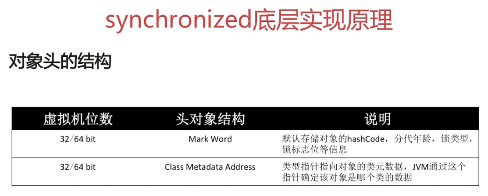

markword详细数据bit位如下：

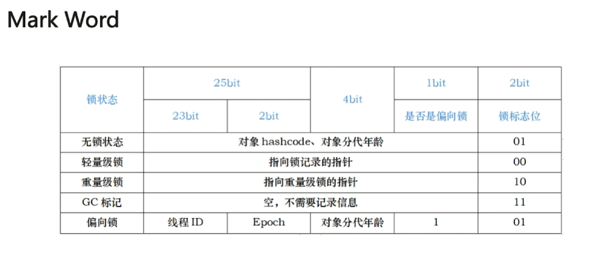

从图中我们可以看出，当对象持有的锁状态不同时，mark word的锁标志位的值也不一样。

下面再看一下monitor，默认来说，每个java对象都带有monitor锁。

monitor底层使用ObjectMonitor实现，C++编写，源码可以在  http://hg.openjdk.java.net/jdk8u/jdk8u/hotspot/file/174eed0020f2/src/share/vm/runtime/objectMonitor.hpp  位置找到。我们重点关注如下代码：
```c++
  // initialize the monitor, exception the semaphore, all other fields
  // are simple integers or pointers
  ObjectMonitor() {
    _header       = NULL;
    _count        = 0;
    _waiters      = 0,
    _recursions   = 0;
    _object       = NULL;
    _owner        = NULL;
    _WaitSet      = NULL;
    _WaitSetLock  = 0 ;
    _Responsible  = NULL ;
    _succ         = NULL ;
    _cxq          = NULL ;
    FreeNext      = NULL ;
    _EntryList    = NULL ;
    _SpinFreq     = 0 ;
    _SpinClock    = 0 ;
    OwnerIsThread = 0 ;
    _previous_owner_tid = 0;
  }
```
上面的代码我们可以获得很多有用信息，_WaitSet就是等待获取monitor的线程，_EntryList是所有需要想要获得锁的数组。当某个线程获得锁时，_owner将会被设置为当前线程，且_count进行+1操作。更为形象的解释，可以看一下下面的图：

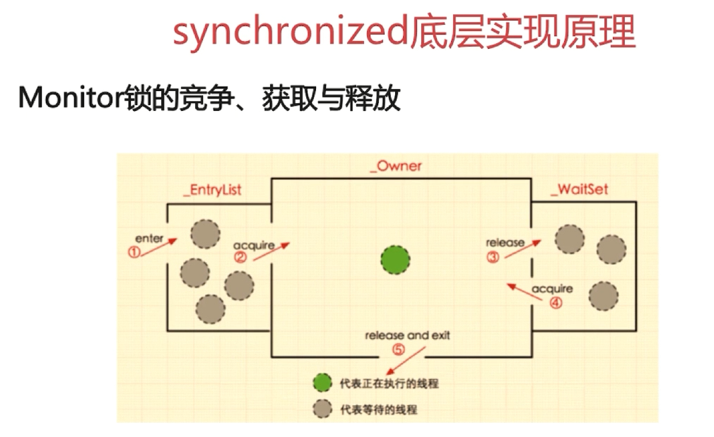


下面我们看一个简单的实例：
```java
package com.interview.javabasic.thread;

public class SyncBlockAndMethod {
    public void syncsTask() {
        synchronized (this) {
            System.out.println("Hello");
//            synchronized (this) {
//                System.out.println("World");
//            }
        }
    }

    public synchronized void syncTask() {
        System.out.println("Hello Again");
    }

}
```
使用如下命令编译一下源文件，并打开编译后的class文件：
```java
D:\javabasic-master\javabasic\src\com\interview\javabasic\thread>javac SyncBlockAndMethod.java

D:\javabasic-master\javabasic\src\com\interview\javabasic\thread>javap -verbose SyncBlockAndMethod.class
```
输出如下：
```java
  Last modified 2020-1-9; size 637 bytes
  MD5 checksum eb66a779fa1538ab6678b5595d78f54d
  Compiled from "SyncBlockAndMethod.java"
public class com.interview.javabasic.thread.SyncBlockAndMethod
  minor version: 0
  major version: 52
  flags: ACC_PUBLIC, ACC_SUPER
Constant pool:
   #1 = Methodref          #7.#20         // java/lang/Object."<init>":()V
   #2 = Fieldref           #21.#22        // java/lang/System.out:Ljava/io/PrintStream;
   #3 = String             #23            // Hello
   #4 = Methodref          #24.#25        // java/io/PrintStream.println:(Ljava/lang/String;)V
   #5 = String             #26            // Hello Again
   #6 = Class              #27            // com/interview/javabasic/thread/SyncBlockAndMethod
   #7 = Class              #28            // java/lang/Object
   #8 = Utf8               <init>
   #9 = Utf8               ()V
  #10 = Utf8               Code
  #11 = Utf8               LineNumberTable
  #12 = Utf8               syncsTask
  #13 = Utf8               StackMapTable
  #14 = Class              #27            // com/interview/javabasic/thread/SyncBlockAndMethod
  #15 = Class              #28            // java/lang/Object
  #16 = Class              #29            // java/lang/Throwable
  #17 = Utf8               syncTask
  #18 = Utf8               SourceFile
  #19 = Utf8               SyncBlockAndMethod.java
  #20 = NameAndType        #8:#9          // "<init>":()V
  #21 = Class              #30            // java/lang/System
  #22 = NameAndType        #31:#32        // out:Ljava/io/PrintStream;
  #23 = Utf8               Hello
  #24 = Class              #33            // java/io/PrintStream
  #25 = NameAndType        #34:#35        // println:(Ljava/lang/String;)V
  #26 = Utf8               Hello Again
  #27 = Utf8               com/interview/javabasic/thread/SyncBlockAndMethod
  #28 = Utf8               java/lang/Object
  #29 = Utf8               java/lang/Throwable
  #30 = Utf8               java/lang/System
  #31 = Utf8               out
  #32 = Utf8               Ljava/io/PrintStream;
  #33 = Utf8               java/io/PrintStream
  #34 = Utf8               println
  #35 = Utf8               (Ljava/lang/String;)V
{
  public com.interview.javabasic.thread.SyncBlockAndMethod();
    descriptor: ()V
    flags: ACC_PUBLIC
    Code:
      stack=1, locals=1, args_size=1
         0: aload_0
         1: invokespecial #1                  // Method java/lang/Object."<init>":()V
         4: return
      LineNumberTable:
        line 3: 0

  public void syncsTask();
    descriptor: ()V
    flags: ACC_PUBLIC
    Code:
      stack=2, locals=3, args_size=1
         0: aload_0
         1: dup
         2: astore_1
         3: monitorenter
         4: getstatic     #2                  // Field java/lang/System.out:Ljava/io/PrintStream;
         7: ldc           #3                  // String Hello
         9: invokevirtual #4                  // Method java/io/PrintStream.println:(Ljava/lang/String;)V
        12: aload_1
        13: monitorexit
        14: goto          22
        17: astore_2
        18: aload_1
        19: monitorexit
        20: aload_2
        21: athrow
        22: return
      Exception table:
         from    to  target type
             4    14    17   any
            17    20    17   any
      LineNumberTable:
        line 5: 0
        line 6: 4
        line 10: 12
        line 11: 22
      StackMapTable: number_of_entries = 2
        frame_type = 255 /* full_frame */
          offset_delta = 17
          locals = [ class com/interview/javabasic/thread/SyncBlockAndMethod, class java/lang/Object ]
          stack = [ class java/lang/Throwable ]
        frame_type = 250 /* chop */
          offset_delta = 4

  public synchronized void syncTask();
    descriptor: ()V
    flags: ACC_PUBLIC, ACC_SYNCHRONIZED
    Code:
      stack=2, locals=1, args_size=1
         0: getstatic     #2                  // Field java/lang/System.out:Ljava/io/PrintStream;
         3: ldc           #5                  // String Hello Again
         5: invokevirtual #4                  // Method java/io/PrintStream.println:(Ljava/lang/String;)V
         8: return
      LineNumberTable:
        line 14: 0
        line 15: 8
}
SourceFile: "SyncBlockAndMethod.java"
```
首先找到方法syncsTask，可以看到首先使用了monitorenter尝试进行加锁，如果锁获取成功，那么后续就会有monitorexit进行锁的释放，否则会卡在monitorenter指令位置，等待获取锁。

值得注意的是，monitorexit后面还有一个monitorexit，这个其实是为了保证锁一定可以被成功释放，保证我们的业务代码放生异常时，锁也可以被释放。

再搜索一下syncTask，可以看到它并没有加解锁的指令，但是它有ACC_SYNCHRONIZED，同样可以达到相同的效果。

我们再研究一下synchronized的**可重入**性，看下面的源码：
```java
package com.interview.javabasic.thread;

public class SyncBlockAndMethod {
    public void syncsTask() {
        synchronized (this) {
            System.out.println("Hello");
            synchronized (this) {
                System.out.println("World");
            }
        }
    }

    public synchronized void syncTask() {
        System.out.println("Hello Again");
    }

}
```
同样编译，再查看class文件：
```java
D:\javabasic-master\javabasic\src\com\interview\javabasic\thread>javac SyncBlockAndMethod.java

D:\javabasic-master\javabasic\src\com\interview\javabasic\thread>javap -verbose SyncBlockAndMethod.class
Classfile /D:/BaiduNetdiskDownload/剑指Java面试-Offer直通车/javabasic-master/javabasic/src/com/interview/javabasic/thread/SyncBlockAndMethod.class
  Last modified 2020-1-9; size 710 bytes
  MD5 checksum b26cd7addb1cbb89001f975b414a6bf7
  Compiled from "SyncBlockAndMethod.java"
public class com.interview.javabasic.thread.SyncBlockAndMethod
  minor version: 0
  major version: 52
  flags: ACC_PUBLIC, ACC_SUPER
Constant pool:
   #1 = Methodref          #8.#21         // java/lang/Object."<init>":()V
   #2 = Fieldref           #22.#23        // java/lang/System.out:Ljava/io/PrintStream;
   #3 = String             #24            // Hello
   #4 = Methodref          #25.#26        // java/io/PrintStream.println:(Ljava/lang/String;)V
   #5 = String             #27            // World
   #6 = String             #28            // Hello Again
   #7 = Class              #29            // com/interview/javabasic/thread/SyncBlockAndMethod
   #8 = Class              #30            // java/lang/Object
   #9 = Utf8               <init>
  #10 = Utf8               ()V
  #11 = Utf8               Code
  #12 = Utf8               LineNumberTable
  #13 = Utf8               syncsTask
  #14 = Utf8               StackMapTable
  #15 = Class              #29            // com/interview/javabasic/thread/SyncBlockAndMethod
  #16 = Class              #30            // java/lang/Object
  #17 = Class              #31            // java/lang/Throwable
  #18 = Utf8               syncTask
  #19 = Utf8               SourceFile
  #20 = Utf8               SyncBlockAndMethod.java
  #21 = NameAndType        #9:#10         // "<init>":()V
  #22 = Class              #32            // java/lang/System
  #23 = NameAndType        #33:#34        // out:Ljava/io/PrintStream;
  #24 = Utf8               Hello
  #25 = Class              #35            // java/io/PrintStream
  #26 = NameAndType        #36:#37        // println:(Ljava/lang/String;)V
  #27 = Utf8               World
  #28 = Utf8               Hello Again
  #29 = Utf8               com/interview/javabasic/thread/SyncBlockAndMethod
  #30 = Utf8               java/lang/Object
  #31 = Utf8               java/lang/Throwable
  #32 = Utf8               java/lang/System
  #33 = Utf8               out
  #34 = Utf8               Ljava/io/PrintStream;
  #35 = Utf8               java/io/PrintStream
  #36 = Utf8               println
  #37 = Utf8               (Ljava/lang/String;)V
{
  public com.interview.javabasic.thread.SyncBlockAndMethod();
    descriptor: ()V
    flags: ACC_PUBLIC
    Code:
      stack=1, locals=1, args_size=1
         0: aload_0
         1: invokespecial #1                  // Method java/lang/Object."<init>":()V
         4: return
      LineNumberTable:
        line 3: 0

  public void syncsTask();
    descriptor: ()V
    flags: ACC_PUBLIC
    Code:
      stack=2, locals=5, args_size=1
         0: aload_0
         1: dup
         2: astore_1
         3: monitorenter
         4: getstatic     #2                  // Field java/lang/System.out:Ljava/io/PrintStream;
         7: ldc           #3                  // String Hello
         9: invokevirtual #4                  // Method java/io/PrintStream.println:(Ljava/lang/String;)V
        12: aload_0
        13: dup
        14: astore_2
        15: monitorenter
        16: getstatic     #2                  // Field java/lang/System.out:Ljava/io/PrintStream;
        19: ldc           #5                  // String World
        21: invokevirtual #4                  // Method java/io/PrintStream.println:(Ljava/lang/String;)V
        24: aload_2
        25: monitorexit
        26: goto          34
        29: astore_3
        30: aload_2
        31: monitorexit
        32: aload_3
        33: athrow
        34: aload_1
        35: monitorexit
        36: goto          46
        39: astore        4
        41: aload_1
        42: monitorexit
        43: aload         4
        45: athrow
        46: return
      Exception table:
         from    to  target type
            16    26    29   any
            29    32    29   any
             4    36    39   any
            39    43    39   any
      LineNumberTable:
        line 5: 0
        line 6: 4
        line 7: 12
        line 8: 16
        line 9: 24
        line 10: 34
        line 11: 46
      StackMapTable: number_of_entries = 4
        frame_type = 255 /* full_frame */
          offset_delta = 29
          locals = [ class com/interview/javabasic/thread/SyncBlockAndMethod, class java/lang/Object, class java/lang/Object ]
          stack = [ class java/lang/Throwable ]
        frame_type = 250 /* chop */
          offset_delta = 4
        frame_type = 68 /* same_locals_1_stack_item */
          stack = [ class java/lang/Throwable ]
        frame_type = 250 /* chop */
          offset_delta = 6

  public synchronized void syncTask();
    descriptor: ()V
    flags: ACC_PUBLIC, ACC_SYNCHRONIZED
    Code:
      stack=2, locals=1, args_size=1
         0: getstatic     #2                  // Field java/lang/System.out:Ljava/io/PrintStream;
         3: ldc           #6                  // String Hello Again
         5: invokevirtual #4                  // Method java/io/PrintStream.println:(Ljava/lang/String;)V
         8: return
      LineNumberTable:
        line 14: 0
        line 15: 8
}
SourceFile: "SyncBlockAndMethod.java"
```

可以看到，上述代码，两个monitorenter是连着的，中间并没有monitorexit，证明了synchronized获取的锁是可重入的。

自旋锁及自适应自旋锁
----------

 - 自旋锁:这个相对容易理解，也就是在尝试获取锁失败时，不断重试的去获取锁，而不是进入锁池进行等待。
 - 自适应自旋锁：它首先是自旋锁，所谓自适应其实就是jvm会基于上次或者上几次的获取锁的情况，来自适应的调节获取锁时自旋的次数。比如，上次获取锁成功，那么这次获取时，jvm就认为获取成功的几率较大，会尝试多次获取。反之，上次获取锁失败，那么再次获取时，jvm就认为获取成功的几率较小，jvm会降低自旋的次数，以避免CPU资源的消耗。

 
atomic包下有哪些实现类？原理是什么？
---------------------

 
 atomic包下的类，我们可以看一下下面的截图：
 
 ![此处输入图片的描述][4]

 atomic包中的操作原理大都基于CAS，具体的可以参考上面的笔记。
 
 
redis的数据结构
----------

 - http://www.cnblogs.com/wxd0108/p/5729739.html
 - http://www.redis.net.cn/order/3593.html

 
 | 结构类型        | 可存储数据格式   |  数量  |相关指令|
| --------   | :-----:  | :----:  | :---- |
| String字符串     | 字符串，整数或者浮点数 |   对整个字符串或者字符串中的一部分执行操作，对整个整数或者浮点执行自增(increment)或者自减(decrement)操作     | 1、get、获取存储在指定键中的值 2、set、设置存储在指定键中的值 3、del、删除存储在指定键中的值（这个命令可以用于所有的类型）|
| List列表        |   一个链表，链表上的每个节点都包含了一个字符串   |   从链表的两端推入或者弹出元素，根据偏移量对链表进行修剪(trim)，读取单个或者多个元素，根据值查找或者移除元素   |1、rpush、将给定值推入列表的右端   2、lrange、获取列表在指定范围上的所有值  3、lindex、获取列表在指定范围上的单个元素  4、lpop、从列表的左端弹出一个值，并返回被弹出的值|
| Set集合        |    包含字符串的无序收集器（不可重复）   |  添加，获取，移除单个元素，检查一个元素是否存在于集合中，计算交集，并集，差集，从集合里面随机获取元素  |1、sadd、将给定元素添加到集合  2、smembers、返回集合包含的所有元素  3、sismember、检查指定元素是否存在于集合中  4、srem、检查指定元素是否存在于集合中，那么移除这个元素|
| Hash散列        |   包含key-value键值对无序散列表     |  添加，获取，移除当键值对，获取所有键值对  |1、hset、在散列里面关联起指定的键值对 2、hget、获取指定散列键的值 3、hgetall、获取散列包含的所有键值对 4、hdel、如果给定键存在于散列里面，那么移除这个键|
| Zset有序集合       |   字符串成员(member)与浮点数分值(score)之间的有序映射(score可以重复，但是member不能重复)    |  元素的排列顺序由分值的大小决定。添加，获取，删除单个元素，根据分值范围(range)或者成员来获取元素  |1、zadd、将一个带有给定分值的成员添加到有序集合里面 2、zrange、根据元素在有序排列中所处的位置，从有序集合里面获取多个元素 3、zrangebyscore、获取有序集合在给定分值范围内的所有元素 4、zrem、如果指定成员存在于有序集合中，那么移除这个成员|

**注意**：zset不能member重复，但是可以分值重复。member重复添加的时候，之前的member节点会被删除，新的member节点会被插入。分值重复的时候，节点的先后顺序按照member的字典序进行排序。

  

redis的keys命令在生产环境可以使用吗
----------------------

 
 

 - http://www.cnblogs.com/joshua317/p/5533917.html

 
 **不可以**，绝对不可以。由于执行keys命令，redis会锁定，如果数据庞大的话可能需要几秒或更长，对于生产服务器上锁定几秒这绝对是灾难了
 
 redis官方文档对于keys命令的warning解释：
 
 Warning: consider KEYS as a command that should only be used in production environments with extreme care. It may ruin performance when it is executed against large databases. This command is intended for debugging and special operations, such as changing your keyspace layout. Don’t use KEYS in your regular application code. If you’re looking for a way to find keys in a subset of your keyspace, consider using SCAN or sets.
 
 
 如果有这种需求的话可以自己对键值做索引，比如把各种键值存到不同的set里面，分类建立索引，这样就可以很快的得到数据，但是这样也存在一个明显的缺点，就是浪费宝贵的空间，要知道这可是内存空间啊，所以还是要合理考虑，当然也可以想办法，比如对于有规律的键值，可以存储他们的始末值等等。
 
 从redis的官方文档上看，2.8版本之后SCAN命令已经可用，允许使用游标从keyspace中检索键。对比KEYS命令，虽然SCAN无法一次性返回所有匹配结果，但是却规避了阻塞系统这个高风险，从而也让一些操作可以放在主节点上执行。

需要注意的是，SCAN 命令是一个基于游标的迭代器。SCAN 命令每次被调用之后， 都会向用户返回一个新的游标，用户在下次迭代时需要使用这个新游标作为 SCAN 命令的游标参数， 以此来延续之前的迭代过程。同时，使用SCAN，用户还可以使用keyname模式和count选项对命令进行调整。SCAN相关命令还包括SSCAN 命令、HSCAN 命令和 ZSCAN 命令，分别用于集合、哈希键及有续集等。


 

 

redis的跳跃表是怎么实现的？有什么用？为什么使用跳表而不使用平衡树？
------------------------------------

 
 https://blog.csdn.net/lz710117239/article/details/78408919
 
 跳表主要用于有序集合zset中，若一个有序集合包含的元素数量比较多，或者有序集合中的成员是比较长的字符串时，Redis就会使用跳跃表来作为有序集合键的底层实现。
 
 redis跳表底层实现，本质来说就是一个改良过的双向链表，每次创建一个新跳跃表结点的时候，程序都根据幂次定律（power law，越大的数出现的概率越小）随机生成一个介于**1和32**之间的值作为level数组的大小，这个大小就是该结点包含的层数。
 以下是跳跃表节点的定义：
 ```c++
 typedef struct zskiplistNode {  
    robj *obj;  
    double score;  
    struct zskiplistNode *backward;  
    struct zskiplistLevel {  
        struct zskiplistNode *forward;  
        unsigned int span;  
    } level[];  
} zskiplistNode;  
 ```
 代码中的span的概念，就是为了表明当前节点与forward指向的后向节点的之间的层跨度。
 
 下面是跳跃表的示意图：
 
 ![此处输入图片的描述][5]
 
  跳跃表头结点（header指向的节点）排名为0，之后的节点排名以此类推。在上图跳跃表中查找计算分值为3.0、成员对象为o3的结点的排名。查找过程只遍历了头结点的L5层就找到了，并且头结点该层的跨度为3，因此得到该结点在跳跃表中的排名为3。
  
  **为什么使用跳表而不使用平衡树？**
  
  https://blog.csdn.net/u010412301/article/details/64923131
  

 - skiplist和各种平衡树（如AVL、红黑树等）的元素是有序排列的，而哈希表不是有序的。因此，在哈希表上只能做单个key的查找，不适宜做范围查找。所谓范围查找，指的是查找那些大小在指定的两个值之间的所有节点。
 - 在做范围查找的时候，平衡树比skiplist操作要复杂。在平衡树上，我们找到指定范围的小值之后，还需要以中序遍历的顺序继续寻找其它不超过大值的节点。如果不对平衡树进行一定的改造，这里的中序遍历并不容易实现。而在skiplist上进行范围查找就非常简单，只需要在找到小值之后，对第1层链表进行若干步的遍历就可以实现。
 - 平衡树的插入和删除操作可能引发子树的调整，逻辑复杂，而skiplist的插入和删除只需要修改相邻节点的指针，操作简单又快速。
 - 从内存占用上来说，skiplist比平衡树更灵活一些。一般来说，平衡树每个节点包含2个指针（分别指向左右子树），而skiplist每个节点包含的指针数目平均为1/(1-p)，具体取决于参数p的大小。如果像Redis里的实现一样，取p=1/4，那么平均每个节点包含1.33个指针，比平衡树更有优势。
 - 查找单个key，skiplist和平衡树的时间复杂度都为O(logn)，大体相当；而哈希表在保持较低的哈希值冲突概率的前提下，查找时间复杂度接近O(1)，性能更高一些。所以我们平常使用的各种Map或dictionary结构，大都是基于哈希表实现的。
 - 从算法实现难度上来比较，skiplist比平衡树要简单得多。


http的三次握手过程？为什么不是两次或者四次？
------------------------

 
 https://www.cnblogs.com/qdhxhz/p/8470997.html
 
 https://www.zhihu.com/question/24853633
 
 https://blog.csdn.net/lengxiao1993/article/details/82771768
 
 首先简要介绍一下tcp的6种标志位：
 SYN(建立联机)  ACK(确认)   PSH(传送)   FIN(结束)   RST(重置)    URG(紧急)  Sequence number(顺序号码)     Acknowledge number(确认号码)
 
 下面先说一下为什么不是**2次**握手？
 
 其实主要的原因还是因为，TCP为了保证可靠连接，通信的双方需要维护一个seq，用来表示哪些数据是被对方接收到的。两次握手的话，最多只能保证客户端的seq被服务端确认了，但是服务端却不知道自己的seq有没有被客户端确认。
 
另外一个**不太准确**的解释：client发送了第一个连接的请求报文，但是由于网络不好，这个请求没有立即到达服务端，而是在某个网络节点中滞留了，直到某个时间才到达server，本来这已经是一个失效的报文，但是server端接收到这个请求报文后，还是会想client发出确认的报文，表示同意连接。假如不采用三次握手，那么只要server发出确认，新的建立就连接了，但其实这个请求是失效的请求，client是不会理睬server的确认信息，也不会向服务端发送确认的请求，但是server认为新的连接已经建立起来了，并一直等待client发来数据，这样，server的很多资源就没白白浪费掉了，采用三次握手就是为了防止这种情况的发生，server会因为收不到确认的报文，就知道client并没有建立连接。这就是三次握手的作用。
 
 ![此处输入图片的描述][6]
 
 三次握手的过程如上图所示，下面介绍一下四次挥手的过程。
 
 ![此处输入图片的描述][7]
 
 第一次握手：TCP发送一个FIN(结束)，用来关闭客户到服务端的连接。

第二次握手：服务端收到这个FIN，他发回一个ACK(确认)，确认收到序号为收到序号+1，和SYN一样，一个FIN将占用一个序号。

第三次握手：服务端发送一个FIN(结束)到客户端，服务端关闭客户端的连接。

第四次握手：客户端发送ACK(确认)报文确认，并将确认的序号+1，这样关闭完成。

**为什么是四次挥手？**

可能有人会有疑问，tcp我握手的时候为何ACK(确认)和SYN(建立连接)是一起发送。挥手的时候为什么是分开的时候发送呢.
    因为当Server端收到Client端的SYN连接请求报文后，可以直接发送SYN+ACK报文。其中ACK报文是用来应答的，SYN报文是用来同步的。但是关闭连接时，当Server端收到FIN报文时，很可能并不会立即关闭             SOCKET，所以只能先回复一个ACK报文，告诉Client端，"你发的FIN报文我收到了"。只有等到我Server端所有的报文都发送完了，我才能发送FIN报文，因此不能一起发送。故需要四步握手。
    
    

 

session解决用户登录信息保存的例子
--------------------

 
 https://github.com/CyC2018/CS-Notes/blob/master/notes/HTTP.md#8-session
 
 
 除了可以将用户信息通过 Cookie 存储在用户浏览器中，也可以利用 **Session存储在服务器端**，存储在服务器端的信息更加安全。

Session 可以存储在服务器上的文件、数据库或者内存中。也可以将 Session 存储在 Redis这种内存型数据库中，效率会更高。
 
 使用 Session 维护用户登录状态的过程如下：

 - 用户进行登录时，用户提交包含用户名和密码的表单，放入 HTTP 请求报文中；
 - 服务器验证该用户名和密码，如果正确则把用户信息存储到 Redis 中，它在 Redis 中的 Key 称为 Session ID；
 - 服务器返回的响应报文的 Set-Cookie 首部字段包含了这个 Session ID，客户端收到响应报文之后将该 Cookie值存入浏览器中；
 - 客户端之后对同一个服务器进行请求时会包含该 Cookie 值，服务器收到之后提取出 Session ID，从 Redis
   中取出用户信息，继续之前的业务操作。

应该注意 Session ID 的安全性问题，不能让它被恶意攻击者轻易获取，那么就不能产生一个容易被猜到的 Session ID 值。此外，还需要经常重新生成 Session ID。在对安全性要求极高的场景下，例如转账等操作，除了使用 Session 管理用户状态之外，还需要对用户进行重新验证，比如重新输入密码，或者使用短信验证码等方式。

 

Cookie 与 Session 选择（区别）
-----------------------

 

 - Cookie 只能存储 ASCII 码字符串，而 Session 则可以存取任何类型的数据，因此在考虑数据复杂性时首选 Session；
 - Cookie 存储在浏览器中，容易被恶意查看。如果非要将一些隐私数据存在 Cookie 中，可以将 Cookie
   值进行加密，然后在服务器进行解密；
 - 对于大型网站，如果用户所有的信息都存储在 Session 中，那么开销是非常大的，因此不建议将所有的用户信息都存储到 Session 中。

 **1. HTTPs协议**
 
 https://github.com/CyC2018/CS-Notes/blob/master/notes/HTTP.md#六https
 
 HTTP 有以下安全性问题：
 

 - 使用明文进行通信，内容可能会被窃听；
 - 不验证通信方的身份，通信方的身份有可能遭遇伪装；
 - 无法证明报文的完整性，报文有可能遭篡改。

HTTPs 并不是新协议，而是让 HTTP 先和 SSL（Secure Sockets Layer）通信，再由 SSL 和 TCP 通信，也就是说 HTTPs 使用了隧道进行通信。

通过使用 SSL，HTTPs 具有了加密（防窃听）、认证（防伪装）和完整性保护（防篡改）。

![此处输入图片的描述][8]

HTTPs采用了对称、非对称加密结合的方式来进行数据的交互。使用非对称加密技术加密对称加密的秘钥，然后使用对称加密的秘钥去加密传输的数据。

这样做的好处是，利用了对称加密的加解密过程快速的优点，提高https的效率。

记住非对称加密的时候，使用的是公钥加密，私钥解密。

同样的，非对称加密也可以用于签名，这时候就是私钥签名，公钥验签。

非对称加密的公私钥都是服务器产生的，这个很好理解，因为如果公私钥匙客户端产生的，那么如果有多个客户端，那么服务器就要存很多歌客户端的公钥，这是没有必要的，还不如服务器产生一对公私钥，然后所有的客户端都获得该服务器的公钥，节约资源。

https的加解密过程如下图所示：

![此处输入图片的描述][9]

至于上面提到的公私钥的产生，可以使用CA，由服务端去向CA认证机构申请CA证书。然后在https通信的时候，需要客户端去下载CA证书，取出其中的公钥，使用该公钥加密对称秘钥，传输给服务器，然后服务器解密，使用该对称公钥，双方就可以安全通信了。

https://github.com/CyC2018/CS-Notes/blob/master/notes/HTTP.md

http2.0
------

http2.0相对于http1.x具有以下一些区别或优点：

 - HTTP/2.0 将报文分成 HEADERS 帧和 DATA 帧，它们都是二进制格式的。
 - 在通信过程中，只会有一个 TCP 连接存在，它承载了任意数量的双向数据流（Stream）。
 - HTTP/2.0 在客户端请求一个资源时，会把相关的资源一起发送给客户端，客户端就不需要再次发起请求了。例如客户端请求 page.html 页面，服务端就把 script.js 和 style.css 等与之相关的资源一起发给客户端。
 - HTTP/1.1 的首部带有大量信息，而且每次都要重复发送。HTTP/2.0要求客户端和服务器同时维护和更新一个包含之前见过的首部字段表，从而避免了重复传输。不仅如此，HTTP/2.0 也使用 Huffman编码对首部字段进行压缩。

springboot的启动过程
---------------

 
 下面我们简要分析一下springboot的启动过程,看看为什么springboot可以使用如此简介的代码实现springboot的pure java式的启动过程,在讲springboot的启动过程之前我们先复习一下之前spring的bean的实例化过程:
 
 https://github.com/WQZ321123/learn/blob/master/%E7%AC%94%E8%AE%B0%E6%95%B4%E7%90%86.md
 
 

spring-bean的生命周期
----------------

 
 这里重复一下:
 
 下面的流程可以参考https://github.com/WQZ321123/spring-demo/blob/master/src/main/java/com/example/demo/initial/AbstractInit.java类:
 
 1. 实例化一个Bean－－也就是我们常说的new；
 2. 按照Spring上下文对实例化的Bean进行配置－－也就是IOC注入；
 3. 如果这个Bean已经实现了BeanNameAware接口，会调用它实现的setBeanName(String)方法，此处传递的就是Spring配置文件中Bean的id值
 4. 如果这个Bean已经实现了BeanFactoryAware接口，会调用它实现的setBeanFactory(setBeanFactory(BeanFactory)传递的是Spring工厂自身（可以用这个方式来获取其它Bean，只需在Spring配置文件中配置一个普通的Bean就可以）；
 5. 如果这个Bean已经实现了ApplicationContextAware接口，会调用setApplicationContext(ApplicationContext)方法，传入Spring上下文（同样这个方式也可以实现步骤4的内容，但比4更好，因为ApplicationContext是BeanFactory的子接口，有更多的实现方法）；
 6. 如果这个Bean关联了BeanPostProcessor接口，将会调用postProcessBeforeInitialization(Object
    obj, String
    s)方法，BeanPostProcessor经常被用作是Bean内容的更改，并且由于这个是在Bean初始化结束时调用那个的方法，也可以被应用于内存或缓存技术；
 7. 如果Bean在Spring配置文件中配置了init-method属性会自动调用其配置的初始化方法。
 8. 如果这个Bean关联了BeanPostProcessor接口，将会调用postProcessAfterInitialization(Object
    obj, String s)方法、；
 9. 注：以上工作完成以后就可以应用这个Bean了，那这个Bean是一个Singleton的，所以一般情况下我们调用同一个id的Bean会是在内容地址相同的实例，当然在Spring配置文件中也可以配置非Singleton，这里我们不做赘述。
 
 10. 当Bean不再需要时，会经过清理阶段，如果Bean实现了DisposableBean这个接口，会调用那个其实现的destroy()方法；
 11. 最后，如果这个Bean的Spring配置中配置了destroy-method属性，会自动调用其配置的销毁方法。

上面的第6部和第8部,所谓的关联了BeanPostProcessor接口,其实就是只要你自己实现了BeanPostProcessor接口,可以参考https://github.com/WQZ321123/spring-demo/blob/master/src/main/java/com/example/demo/initial/CustomBeanPostProcessor.java

另外,注意一下@PostConstruct这个注解,它并不属于spring,属于java注解,它的作用类似于init-method(),所以执行时机也就在第7步.

如果实例化的bean还是实现了InitializingBean接口的话,那么afterPropertiesSet()方法(该方法中使用@PostConstruct注解是不会生效的)执行的时机是在第8步之前.下面是InitializingBean接口的定义以及https://github.com/WQZ321123/spring-demo工程中BInit对象的实例化过程的部分日志:
```java
package org.springframework.beans.factory;

public interface InitializingBean {
    void afterPropertiesSet() throws Exception;
}
```

BInit实例化日志:
```java
2018-12-09 15:34:51.976  INFO 8238 --- [  restartedMain] com.example.demo.initial.AbstractInit    : BInit.Construct, bean:BInit(aInit=null)
2018-12-09 15:34:51.981  INFO 8238 --- [  restartedMain] com.example.demo.initial.AbstractInit    : BInit.BeanNameAware.setBeanName:BInit, bean:BInit(aInit=AInit(cInit=null, hello=hello word))
2018-12-09 15:34:51.981  INFO 8238 --- [  restartedMain] com.example.demo.initial.AbstractInit    : BInit.BeanFactoryAware.setBeanFactory, bean:BInit(aInit=AInit(cInit=null, hello=hello word))
2018-12-09 15:34:51.981  INFO 8238 --- [  restartedMain] com.example.demo.initial.AbstractInit    : BInit.ApplicationContextAware.setApplicationContext, bean:BInit(aInit=AInit(cInit=null, hello=hello word))
2018-12-09 15:34:51.981  INFO 8238 --- [  restartedMain] c.e.d.initial.CustomBeanPostProcessor    : CustomBeanPostProcessor.BeanPostProcessor.postProcessBeforeInitialization,beanName:BInit, bean:BInit(aInit=AInit(cInit=null, hello=hello word))
2018-12-09 15:34:51.981  INFO 8238 --- [  restartedMain] com.example.demo.initial.AbstractInit    : BInit.PostConstruct, bean:BInit(aInit=AInit(cInit=null, hello=hello word))
2018-12-09 15:34:51.981  INFO 8238 --- [  restartedMain] com.example.demo.initial.AbstractInit    : BInit.InitializingBean.afterPropertiesSet, bean:BInit(aInit=AInit(cInit=null, hello=hello word))
2018-12-09 15:34:51.981  INFO 8238 --- [  restartedMain] c.e.d.initial.CustomBeanPostProcessor    : CustomBeanPostProcessor.BeanPostProcessor.postProcessAfterInitialization, beanName:BInit, bean:BInit(aInit=AInit(cInit=null, hello=hello word))
```
 
 
 https://github.com/WQZ321123/spring-demo
 
 这里参考了才哥之前讲的springboot的示例代码:
 ```java
 import org.springframework.boot.SpringApplication;
import org.springframework.boot.autoconfigure.SpringBootApplication;

@SpringBootApplication
public class DemoApplication {

    public static void main(String[] args) {
        SpringApplication.run(DemoApplication.class, args);
    }
}
 ```
 一般分析springboot的启动过程都是从@SpringBootApplication注解和SpringApplication.run()方法入手的.
 
 https://www.cnblogs.com/shamo89/p/8184960.html
 
 先上一张图,这张图大概讲解了springboot的启动过程:
 
 ![此处输入图片的描述][10]
 
 然后我们看一下springboot的@SpringBootApplication注解:
 ```java
 @Target(ElementType.TYPE)            // 注解的适用范围，其中TYPE用于描述类、接口（包括包注解类型）或enum声明
@Retention(RetentionPolicy.RUNTIME)  // 注解的生命周期，保留到class文件中（三个生命周期）
@Documented                          // 表明这个注解应该被javadoc记录
@Inherited                           // 子类可以继承该注解
@SpringBootConfiguration             // 继承了Configuration，表示当前是注解类
@EnableAutoConfiguration             // 开启springboot的注解功能，springboot的四大神器之一，其借助@import的帮助
@ComponentScan(excludeFilters = {    // 扫描路径设置（具体使用待确认）
        @Filter(type = FilterType.CUSTOM, classes = TypeExcludeFilter.class),
        @Filter(type = FilterType.CUSTOM, classes = AutoConfigurationExcludeFilter.class) })
public @interface SpringBootApplication {
...
}
 ```
 虽然定义使用了多个Annotation进行了原信息标注，但实际上重要的只有三个Annotation：

 - @Configuration（@SpringBootConfiguration点开查看发现里面还是应用了@Configuration）
 - @EnableAutoConfiguration
 - @ComponentScan


@Configuration主要标志某个类是一个配置类,在这里表示springboot的启动类本身也是spring的一个配置类.

@ComponentScan注解功能其实就是自动扫描并加载符合条件的组件或者bean定义,最终将这些bean定义加载到IoC容器中。注意,**默认**Spring框架实现会从声明@ComponentScan所在类的package进行扫描。所以,所以SpringBoot的启动类最好是放在root package下,这样就可以省去配置basePackages了.

@EnableAutoConfiguration借助@Import的帮助，将所有符合自动配置条件的bean定义加载到IoC容器,这个注解相对来说最为重要,下面详细讲一下这个注解.

@EnableAutoConfiguration作为一个复合Annotation,其自身定义关键信息如下：
```java
@SuppressWarnings("deprecation")
@Target(ElementType.TYPE)
@Retention(RetentionPolicy.RUNTIME)
@Documented
@Inherited
@AutoConfigurationPackage   //自动配置包
@Import(EnableAutoConfigurationImportSelector.class)  //导入自动配置的组件
public @interface EnableAutoConfiguration {
    ...
}
```

对于@AutoConfigurationPackage注解,看一下它的定义:
```java
package org.springframework.boot.autoconfigure;

import java.lang.annotation.Documented;
import java.lang.annotation.ElementType;
import java.lang.annotation.Inherited;
import java.lang.annotation.Retention;
import java.lang.annotation.RetentionPolicy;
import java.lang.annotation.Target;

import org.springframework.context.annotation.Import;

/**
 * Indicates that the package containing the annotated class should be registered with
 * {@link AutoConfigurationPackages}.
 *
 * @author Phillip Webb
 * @since 1.3.0
 * @see AutoConfigurationPackages
 */
@Target(ElementType.TYPE)
@Retention(RetentionPolicy.RUNTIME)
@Documented
@Inherited
@Import(AutoConfigurationPackages.Registrar.class)
public @interface AutoConfigurationPackage {

}
```

可以看到这个注解使用了Registrar类对象,源码如下:
```java
/**
	 * {@link ImportBeanDefinitionRegistrar} to store the base package from the importing
	 * configuration.
	 */
	@Order(Ordered.HIGHEST_PRECEDENCE)
	static class Registrar implements ImportBeanDefinitionRegistrar, DeterminableImports {

		@Override
		public void registerBeanDefinitions(AnnotationMetadata metadata,
				BeanDefinitionRegistry registry) {
			register(registry, new PackageImport(metadata).getPackageName());
		}

		@Override
		public Set<Object> determineImports(AnnotationMetadata metadata) {
			return Collections.<Object>singleton(new PackageImport(metadata));
		}

	}
```

上面代码中的
```java
new PackageImport(metadata).getPackageName()
```
其实就是返回了当前主程序类的 **同级以及子级**     的包组件。

再看一下@Import(EnableAutoConfigurationImportSelector.class) 注解:


从图中可以看出  AutoConfigurationImportSelector 继承了 DeferredImportSelector 继承了 ImportSelector,

看一下AutoConfigurationImportSelector中如下的一个方法
```java
@Override
	public String[] selectImports(AnnotationMetadata annotationMetadata) {
		if (!isEnabled(annotationMetadata)) {
			return NO_IMPORTS;
		}
		try {
			AutoConfigurationMetadata autoConfigurationMetadata = AutoConfigurationMetadataLoader
					.loadMetadata(this.beanClassLoader);
			AnnotationAttributes attributes = getAttributes(annotationMetadata);
			List<String> configurations = getCandidateConfigurations(annotationMetadata,
					attributes);
			configurations = removeDuplicates(configurations);
			configurations = sort(configurations, autoConfigurationMetadata);
			Set<String> exclusions = getExclusions(annotationMetadata, attributes);
			checkExcludedClasses(configurations, exclusions);
			configurations.removeAll(exclusions);
			configurations = filter(configurations, autoConfigurationMetadata);
			fireAutoConfigurationImportEvents(configurations, exclusions);
			return configurations.toArray(new String[configurations.size()]);
		}
		catch (IOException ex) {
			throw new IllegalStateException(ex);
		}
	}
```

它会去加载  public static final String FACTORIES_RESOURCE_LOCATION = "META-INF/spring.factories";外部文件。这个外部文件，有很多自动配置的类。

spring下有多个jar包下都有这个文件,如下图:

![此处输入图片的描述][11]

@EnableAutoConfiguration自动配置的魔法骑士就变成了：从classpath中搜寻所有的META-INF/spring.factories配置文件，并将其中org.springframework.boot.autoconfigure.EnableutoConfiguration对应的配置项通过反射（Java Refletion）实例化为对应的标注了@Configuration的JavaConfig形式的IoC容器配置类，然后汇总为一个并加载到IoC容器。

![此处输入图片的描述][12]

总结上面的过程,得出下面的流程图:

![此处输入图片的描述][13]

**下面**，我们讲解一下SpringApplication的静态run()方法，流程如下：

1、首先run方法会创建一个**SpringApplication对象实例**，然后调用这个创建好的SpringApplication的实例方法。
```java
/**
	 * Static helper that can be used to run a {@link SpringApplication} from the
	 * specified source using default settings.
	 * @param source the source to load
	 * @param args the application arguments (usually passed from a Java main method)
	 * @return the running {@link ApplicationContext}
	 */
	public static ConfigurableApplicationContext run(Object source, String... args) {
		return run(new Object[] { source }, args);
	}
	
....
	/**
	 * Static helper that can be used to run a {@link SpringApplication} from the
	 * specified sources using default settings and user supplied arguments.
	 * @param sources the sources to load
	 * @param args the application arguments (usually passed from a Java main method)
	 * @return the running {@link ApplicationContext}
	 */
	public static ConfigurableApplicationContext run(Object[] sources, String[] args) {
		return new SpringApplication(sources).run(args);
	}
```
在new SpringApplication对象的时候，其构造函数内部调用了initialize()方法，构造函数和initialize方法的实现如下所示：
```java
/**
	 * Create a new {@link SpringApplication} instance. The application context will load
	 * beans from the specified sources (see {@link SpringApplication class-level}
	 * documentation for details. The instance can be customized before calling
	 * {@link #run(String...)}.
	 * @param sources the bean sources
	 * @see #run(Object, String[])
	 * @see #SpringApplication(ResourceLoader, Object...)
	 */
	public SpringApplication(Object... sources) {
		initialize(sources);
	}
	
	...
	@SuppressWarnings({ "unchecked", "rawtypes" })
	private void initialize(Object[] sources) {
		if (sources != null && sources.length > 0) {
			this.sources.addAll(Arrays.asList(sources));
		}
		this.webEnvironment = deduceWebEnvironment();
		setInitializers((Collection) getSpringFactoriesInstances(
				ApplicationContextInitializer.class));
		setListeners((Collection) getSpringFactoriesInstances(ApplicationListener.class));
		this.mainApplicationClass = deduceMainApplicationClass();
	}
```

initialize()方法主要完成了以下一些功能：

 - deduceWebEnvironment()方法，查看当前ClassLoader是否有"javax.servlet.Servlet","org.springframework.web.context.ConfigurableWebApplicationContext"两个类，有的话就将this.webEnvironment设置为true，否则false；
 - setInitializers((Collection) getSpringFactoriesInstances(ApplicationContextInitializer.class));方法主要完成在应用的classpath中查找并加载所有可用的ApplicationContextInitializer；
 - setListeners((Collection) getSpringFactoriesInstances(ApplicationListener.class));方法主要完成在应用的classpath中查找并加载所有可用的ApplicationListener；
 - 推断并设置main方法的定义类

**SpringApplication实例化**完成以后，就开始执行静态run方法了。
```java
/**
	 * Run the Spring application, creating and refreshing a new
	 * {@link ApplicationContext}.
	 * @param args the application arguments (usually passed from a Java main method)
	 * @return a running {@link ApplicationContext}
	 */
	public ConfigurableApplicationContext run(String... args) {
		StopWatch stopWatch = new StopWatch();
		stopWatch.start();
		ConfigurableApplicationContext context = null;
		FailureAnalyzers analyzers = null;
		configureHeadlessProperty();
		SpringApplicationRunListeners listeners = getRunListeners(args);
		listeners.starting();
		try {
			ApplicationArguments applicationArguments = new DefaultApplicationArguments(
					args);
			ConfigurableEnvironment environment = prepareEnvironment(listeners,
					applicationArguments);
			Banner printedBanner = printBanner(environment);
			context = createApplicationContext();
			analyzers = new FailureAnalyzers(context);
			prepareContext(context, environment, listeners, applicationArguments,
					printedBanner);
			refreshContext(context);
			afterRefresh(context, applicationArguments);
			listeners.finished(context, null);
			stopWatch.stop();
			if (this.logStartupInfo) {
				new StartupInfoLogger(this.mainApplicationClass)
						.logStarted(getApplicationLog(), stopWatch);
			}
			return context;
		}
		catch (Throwable ex) {
			handleRunFailure(context, listeners, analyzers, ex);
			throw new IllegalStateException(ex);
		}
	}
```

 - run方法首先是加载所有通过SpringFactoriesLoader可以查找到并加载的SpringApplicationRunListener，并添加到SpringApplicationRunListeners中（其实就是个ArrayList中）；
 - 启动所有的Listener，开始监听，listeners.starting();，内部使用了多线程来启动listener
 - prepareEnvironment(listeners,applicationArguments);，创建并配置当前Spring Boot应用将要使用的Environment（包括配置要使用的PropertySource以及Profile）
 - prepareContext(context, environment, listeners, applicationArguments,printedBanner);将前面创建的各种对象放到context上下文环境中。
 - refreshContext(context);

这个方法比较重要，我们细看一下：
```java
@Override
	public void refresh() throws BeansException, IllegalStateException {
		synchronized (this.startupShutdownMonitor) {
			// Prepare this context for refreshing.
			prepareRefresh();

			// Tell the subclass to refresh the internal bean factory.
			ConfigurableListableBeanFactory beanFactory = obtainFreshBeanFactory();

			// Prepare the bean factory for use in this context.
			prepareBeanFactory(beanFactory);

			try {
				// Allows post-processing of the bean factory in context subclasses.
				postProcessBeanFactory(beanFactory);

				// Invoke factory processors registered as beans in the context.
				invokeBeanFactoryPostProcessors(beanFactory);

				// Register bean processors that intercept bean creation.
				registerBeanPostProcessors(beanFactory);

				// Initialize message source for this context.
				initMessageSource();

				// Initialize event multicaster for this context.
				initApplicationEventMulticaster();

				// Initialize other special beans in specific context subclasses.
				onRefresh();

				// Check for listener beans and register them.
				registerListeners();

				// Instantiate all remaining (non-lazy-init) singletons.
				finishBeanFactoryInitialization(beanFactory);

				// Last step: publish corresponding event.
				finishRefresh();
			}

			catch (BeansException ex) {
				if (logger.isWarnEnabled()) {
					logger.warn("Exception encountered during context initialization - " +
							"cancelling refresh attempt: " + ex);
				}

				// Destroy already created singletons to avoid dangling resources.
				destroyBeans();

				// Reset 'active' flag.
				cancelRefresh(ex);

				// Propagate exception to caller.
				throw ex;
			}

			finally {
				// Reset common introspection caches in Spring's core, since we
				// might not ever need metadata for singleton beans anymore...
				resetCommonCaches();
			}
		}
	}
```

 - 首先这个方法一进来就加锁了synchronized (this.startupShutdownMonitor)
 - 然后是prepareRefresh，其实就是设置启动时间，激活flag，以及实例化一些配置项目
 - 然后就是获取beanFactory，并且执行bean processors的注册，实例化事件传播器，消息源，注册所有的listener
 - 实例化所有的non-lazy-init的singleton类型的bean
 - 最后发布相应的事件

 查找当前ApplicationContext中是否注册有CommandLineRunner，如果有，则遍历执行它们。
 
 正常情况下，遍历执行SpringApplicationRunListener的finished()方法、（如果整个过程出现异常，则依然调用所有SpringApplicationRunListener的finished()方法，只不过这种情况下会将异常信息一并传入处理）
 
 springboot的run方法的过程大致可以归纳为如下图的样子：
 
 ![此处输入图片的描述][14]
 
 
 
 
 
 
 
 
 
 
 
 

 

springboot如何检测循环依赖
------------------

 
 https://blog.csdn.net/u010853261/article/details/77940767
 
 spring的循环依赖一般分为两种,一是构造器循环依赖,二是属性或者setter依赖.第一种情况spring是不能解决的,第二种情况,spring可以解决.
 
 Spring的单例对象的初始化主要分为三步： 
 
 ![此处输入图片的描述][15]
 
 

 1. createBeanInstance：实例化，其实也就是调用对象的构造方法实例化对象(所以说,构造器的循环以来是不能解决的)
 2. populateBean：填充属性，这一步主要是多bean的依赖属性进行填充
 3. initializeBean：调用init-method方法或者InitializingBean.afterPropertiesSet方法。

spring为了解决循环依赖,使用了三级缓存,分别如下:
```java
/** Cache of singleton objects: bean name --> bean instance */
private final Map<String, Object> singletonObjects = new ConcurrentHashMap<String, Object>(256);

/** Cache of early singleton objects: bean name --> bean instance */
private final Map<String, Object> earlySingletonObjects = new HashMap<String, Object>(16);

/** Cache of singleton factories: bean name --> ObjectFactory */
private final Map<String, ObjectFactory<?>> singletonFactories = new HashMap<String, ObjectFactory<?>>(16);
```

这三级缓存分别指： 

 - singletonObjects：单例对象的cache(第一级)
 - earlySingletonObjects ：提前暴光的单例对象的Cache(第二级)
 - singletonFactories ： 单例对象工厂的cache(第三级)

下面代码展示了如何从缓存中获取bean实例对象:
```java
protected Object getSingleton(String beanName, boolean allowEarlyReference) {
    Object singletonObject = this.singletonObjects.get(beanName);
    if (singletonObject == null && isSingletonCurrentlyInCreation(beanName)) {
        synchronized (this.singletonObjects) {
            singletonObject = this.earlySingletonObjects.get(beanName);
            if (singletonObject == null && allowEarlyReference) {
                ObjectFactory<?> singletonFactory = this.singletonFactories.get(beanName);
                if (singletonFactory != null) {
                    singletonObject = singletonFactory.getObject();
                    this.earlySingletonObjects.put(beanName, singletonObject);
                    this.singletonFactories.remove(beanName);
                }
            }
        }
    }
    return (singletonObject != NULL_OBJECT ? singletonObject : null);
}
```

分析getSingleton()的整个过程，Spring首先从一级缓存singletonObjects中获取。如果获取不到，并且对象正在创建中，就再从二级缓存earlySingletonObjects中获取。如果还是获取不到且允许singletonFactories通过getObject()获取，就从三级缓存singletonFactory.getObject()(三级缓存)获取，如果获取到了从singletonFactories中移除，并放入earlySingletonObjects中。其实也就是从三级缓存移动到了二级缓存。

从上面三级缓存的分析，我们可以知道，Spring解决循环依赖的诀窍就在于singletonFactories这个三级cache。这个cache的value类型是ObjectFactory，定义如下：
```java
public interface ObjectFactory<T> {

	/**
	 * Return an instance (possibly shared or independent)
	 * of the object managed by this factory.
	 * @return the resulting instance
	 * @throws BeansException in case of creation errors
	 */
	T getObject() throws BeansException;
}
```
在AbstractAutowireCapableBeanFactory类的doCreateBean方法内部调用了addSingletonFactory()方法,该方法引用了ObjectFactory对象:
```java
/**
	 * Add the given singleton factory for building the specified singleton
	 * if necessary.
	 * <p>To be called for eager registration of singletons, e.g. to be able to
	 * resolve circular references.
	 * @param beanName the name of the bean
	 * @param singletonFactory the factory for the singleton object
	 */
	protected void addSingletonFactory(String beanName, ObjectFactory<?> singletonFactory) {
		Assert.notNull(singletonFactory, "Singleton factory must not be null");
		synchronized (this.singletonObjects) {
			if (!this.singletonObjects.containsKey(beanName)) {
				this.singletonFactories.put(beanName, singletonFactory);
				this.earlySingletonObjects.remove(beanName);
				this.registeredSingletons.add(beanName);
			}
		}
	}
```

这里就是解决循环依赖的关键，这段代码发生在createBeanInstance之后，也就是说单例对象此时已经被创建出来(调用了构造器)。这个对象已经被生产出来了，虽然还不完美（还没有进行初始化的第二步和第三步），但是已经能被人认出来了（根据对象引用能定位到堆中的对象），所以Spring此时将这个对象提前曝光出来让大家认识，让大家使用。

此时,spring就解决了循环依赖的问题.

 

工作中遇到了哪些比较难的问题？如何解决的？
---------------------

 
 之前遇到过，在trust底层处理区块特别慢，原本1秒可以产生5个区块左右，但是当时30-50秒才产生一个区块。查看服务器内存占用特别高，但是进程还在。一般我们在服务器内存出现OOM之前可以在启动命令中加上-XX:+HeapDumpOnOutOfMemoryError，这样出现OOM的时候就会将堆栈信息保存下来。
  这里我们使用如下命令：
```java
 jmap -dump:format=b,file=3.hprof 11459
```
 生成PID=11459的堆文件，使用MAT打开。分析占用内存最大的对象，发现是一个ThreadLocal对象，它内部存储的map对象的value是一个ArrayList，list中的数据量非常大，占去了整个内存的90%多。
 
 通过搜索源码，定位到我们代码中使用的一个性能日志输出的工具类Profiler，它内部为了统计各个方法的执行耗时，使用到了ThreadLocal变量来应对多线程处理的情况。
 
 首先看一下Porfiler类的方法和属性：
 
 ![此处输入图片的描述][16]
 
 我们一般常用的方法就是start、enter、release、getDuration、dump方法，外加一个Entry内部类，先贴出他们的源码：
```java
 /**
     * 代表一个计时单元。
     */
    public static final class Entry {
        private final List subEntries = new ArrayList(4);
        private final Object message;
        private final Entry parentEntry;
        private final Entry firstEntry;
        private final long baseTime;
        private final long startTime;
        private long endTime;

        /**
         * 创建一个新的entry。
         *
         * @param message     entry的信息，可以是<code>null</code>
         * @param parentEntry 父entry，可以是<code>null</code>
         * @param firstEntry  第一个entry，可以是<code>null</code>
         */
        private Entry(Object message, Entry parentEntry, Entry firstEntry) {
            this.message = message;
            this.startTime = System.currentTimeMillis();
            this.parentEntry = parentEntry;
            this.firstEntry = (firstEntry != null) ? firstEntry : this;
            this.baseTime = (firstEntry == null) ? 0 : firstEntry.startTime;
        }
        。。。
        
        
/**
     * 开始计时。
     *
     * @param message 第一个entry的信息
     */
    public static void start(String message) {
        ENTRY_STACK.set(new Entry(message, null, null));
    }
    
    
    
    /**
     * 开始一个新的entry，并计时。
     *
     * @param message 新entry的信息
     */
    public static void enter(String message) {
        Entry currentEntry = getCurrentEntry();

        if (currentEntry != null) {
            currentEntry.enterSubEntry(message);
        }
    }
    
    
    /**
     * 结束最近的一个entry，记录结束时间。
     */
    public static void release() {
        Entry currentEntry = getCurrentEntry();

        if (currentEntry != null) {
            currentEntry.release();
        }
    }
    
    
    /**
     * 取得耗费的总时间。
     *
     * @return 耗费的总时间，如果未开始计时，则返回<code>-1</code>
     */
    public static long getDuration() {
        Entry entry = (Entry)ENTRY_STACK.get();

        if (entry != null) {
            return entry.getDuration();
        } else {
            return -1;
        }
    }
    

    /**
     * 列出所有的entry。
     *
     * @return 列出所有entry，并统计各自所占用的时间
     */
    public static String dump() {
        return dump("", "");
    }
```
 
一般我们的正常用法是：
```java
    private void testProfiler(){
        Profiler.start("1");
        Profiler.enter("1.1");
        Profiler.release();
        Profiler.enter("1.2");
        Profiler.enter("1.2.1");
        Profiler.release();
        Profiler.enter("1.2.2");
        Profiler.release();
        Profiler.release();
        Profiler.enter("1.3");
        Profiler.release();
        Profiler.release();
    }
```
上面的调用关系可以打印出父方法的总耗时，以及子方法各自的耗时。上面代码的调用如下图所示：

![此处输入图片的描述][17]

当时异常的情况是，调用了一次start  多次调用enter 而没有调用start

 

各种排序算法的时间复杂度
------------

 ![此处输入图片的描述][18]
 

 **1. 快速排序**
 
 http://developer.51cto.com/art/201403/430986.htm
 
 排序的思路，我们可以参考连接里的几张图片，形象生动，搬运如下：
 
![此处输入图片的描述][19]
![此处输入图片的描述][20]
![此处输入图片的描述][21]
![此处输入图片的描述][22]
![此处输入图片的描述][23]
![此处输入图片的描述][24]
![此处输入图片的描述][25]
![此处输入图片的描述][26]
![此处输入图片的描述][27]


 
 ```java
 package com.audi.offer.sort;

import java.util.Arrays;

public class QuickSort {
    public static void main(String[] args) {
//        int a[] = {5, 7, 9, 10, 18, 1, 5, 11, 0, 20, 11, 2, 3, 45, 1, 100, 12};
        int a[] = {5, 7, 9, 10, 18, 1, 5, 11, 0, 20, 11};
        System.out.println("a before:" + Arrays.toString(a));
        QuickSort quickSort = new QuickSort();
        quickSort.sort(a, 0, a.length - 1);
        System.out.println("a after:" + Arrays.toString(a));
    }

    /**
     * @param
     * @return
     * @desc 从小到大排序（升序）
     */
    public void sort(int[] a, int i, int j) {
        if (null == a || i >= j) {
            return;
        }
        int left = i;
        int right = j;
        while (left < right) {
            while (left < right && a[i] < a[right]) {
                right--;
            }
            while (left < right && a[i] >= a[left]) {
                left++;
            }
            if (left < right) {
                swap(a, left, right);
            }
        }
        if (i < left) {
            swap(a, i, left);
        }
        sort(a, i, left - 1);
        sort(a, left + 1, j);

    }

    private void swap(int[] a, int left, int right) {
        int temp = a[left];
        a[left] = a[right];
        a[right] = temp;
    }
}
 ```
 
 代码输出：
 ```java
a before:[5, 7, 9, 10, 18, 1, 5, 11, 0, 20, 11]
a after:[0, 1, 5, 5, 7, 9, 10, 11, 11, 18, 20]
 ```
 
 

 **1. 冒泡排序**

https://www.cnblogs.com/chengxiao/p/6103002.html

![此处输入图片的描述][28]

冒泡排序本质上来说还是很简单的,每次内循环结束以后,数组最大的元素会被放置到当前子数组的末尾.

```java
// 从小到大排序
    public static void bubbleSort(int[] a) {
        if (null == a || a.length < 2) {
            return;
        }
        for (int i = 0; i < a.length - 1; i++) {
            for (int j = 0; j < a.length - i - 1; j++) {
                if (a[j] > a[j + 1]) {
                    int temp = a[j];
                    a[j] = a[j + 1];
                    a[j + 1] = temp;
                }
            }
        }
    }
```

 

java基本类型占几个字节
-------------

| 整数类型 | byte    | 1B         | -128~127               |
| -------- | ------- | ---------- | ---------------------- |
|          | short   | 2B         | -32768~32767           |
|          | int     | 4B         | -2147483648~2147483647 |
|          | long    | 8B         | -2^63~2^63-1           |
| 字符类型 | char    | 2B         |                        |
| 浮点型   | float   | 4B         |                        |
|          | double  | 8B         |                        |
| 布尔型   | boolean | 一般占用1B |                        |

需要指出的是：所有的正无穷大都是相等的，所有的负无穷大也是相等的。
NaN不与任何数值相等，与NaN也不相等。浮点数除以0会得到正/负无穷大，整数除以0会抛出异常。

 

Java中的NIO
---------

NIO也就是New Input/Output，新IO。
NIO和IO目的相同，都是用于进行输入/输出。但是新IO采用内存映射文件的方式来处理IO。新IO将文件或文件的一段区域映射到内存中，这样就可以像访问内存一样来访问文件了（这种方式模拟了操作系统上的虚拟内存的概念）。
Java中与NIO相关的包如下：

 - java.nio：主要包含各种和Buffer相关的类
 - java.nio.channels：主要包含与Channel和Selector相关的类

java.nio.charset：主要包含与字符集相关的类
java.nio.channels.spi
java.nio.charset.spi

 

一致性 Hash 算法
-----------

一致性Hash算法主要是为了解决分布式环境下,数据均匀映射散列分布的问题.具体可以参考一下[这里][29].


  但是如上的链接对于虚拟节点的讲解不是很清除,我又搜索整理了一下资料.
  
  https://blog.csdn.net/baidu_30000217/article/details/53671716
  
  发现这个链接对于虚拟节点部分讲解挺不错的.引入虚拟节点以后:
  
  ![此处输入图片的描述][30]
  
  此时，对象到“虚拟节点”的映射关系为：

objec1->cache C2 ； objec2->cache A1 ； objec3->cache C1 ； objec4->cache A2 ；
注意,objec2,objec3,objec4并未在上图中标出,但是位置我们应该知道他们的位置.例如objec2应该在cache C2和cache A1之间.

此时,又因为cache C2和cache C1都会映射到cache C上.同理,cache A1和cache A2也会映射到cache A上.因此,平衡性有了很大提高。

 

Object类有哪些方法
------------

 
 https://blog.csdn.net/qq_30264689/article/details/81903031
 
 Java的所有类都默认继承java.lang.Object类
 
 ![此处输入图片的描述][31]
 
 从图中可以看出，clone和finalize方法是protected关键字修饰的，也就是在当前类及其子类，以及同包，都可以访问。
 
 **clone方法**是一个native方法，主要用于实现对象的深拷贝，需要class实现Cloneable接口。但是，Cloneable接口**没有任何方法**，那么clone类为什么还要实现Cloneable接口呢？其实这个接口仅仅是一个标志，而且这个标志也仅仅是针对 Object类中clone()方法的，如果clone类没有实现Cloneable接口，并调用了Object的clone()方法（也就是调用了 super.Clone()方法），那么Object的clone()方法就会抛出CloneNotSupportedException异常。
 
**finalize方法**主要由虚拟机调用，当一个对象的没有指向该对象的引用时，就会被垃圾收集器回收掉。需要注意的是:调用finalize方法以后，在**下一次**垃圾回收动作发生时，才会真正回收对象占用的内存。并且，执行了finalize方法**不一定**会被回收，有可能该对象会再次被其他线程引用。
 
 ```java
 protected native Object clone() throws CloneNotSupportedException;
 
 protected void finalize() throws Throwable { }
 ```
 
 然后就是一些其他的final  native方法，主要有：
 

 1. **hashCode方法**，主要计算对象的hash值，一般在建立hashmap存储某类对象的时候，需要重写该方法。
 2. **equals方法**，主要用于判断对象是否相等，一般需要配合重写hashcode方法
 3. **toString方法**，主要用于打印对象时使用，一般子类都会重写
 4. notify、notifyAll是主要用于唤醒等待某个monitor（锁）的线程，但不能确定是哪一个线程被唤醒
 5. wait方法有三个重载方法，wait(),wait(long timeout)【timeout表示等待该时长后，线程将尝试唤醒自己，如果唤醒时没有获取到对象锁，会抛出IllegalMonitorStateException异常。当timeout等于0的时候，timeout不生效，只能通过notify来唤醒】,wait()内部其实就是调用了wait（0）。还有wait(long timeout, int nanos)方法，就是在nanos>0的时候，timeout代表的毫秒数+1，感觉没什么卵用这个方法。wait方法要获取锁，并且在while循环体内。

```java
synchronized (obj) {
              while (&lt;condition does not hold&gt;)
                  obj.wait(timeout);
              ... // Perform action appropriate to condition
          }
```

 ```java
 //
// Source code recreated from a .class file by IntelliJ IDEA
// (powered by Fernflower decompiler)
//

package java.lang;

public class Object {
    public Object() {
    }

    private static native void registerNatives();

    public final native Class<?> getClass();

    public native int hashCode();

    public boolean equals(Object var1) {
        return this == var1;
    }

    protected native Object clone() throws CloneNotSupportedException;

    public String toString() {
        return this.getClass().getName() + "@" + Integer.toHexString(this.hashCode());
    }

    public final native void notify();

    public final native void notifyAll();

    public final native void wait(long var1) throws InterruptedException;

    public final void wait(long var1, int var3) throws InterruptedException {
        if (var1 < 0L) {
            throw new IllegalArgumentException("timeout value is negative");
        } else if (var3 >= 0 && var3 <= 999999) {
            if (var3 > 0) {
                ++var1;
            }

            this.wait(var1);
        } else {
            throw new IllegalArgumentException("nanosecond timeout value out of range");
        }
    }

    public final void wait() throws InterruptedException {
        this.wait(0L);
    }

    protected void finalize() throws Throwable {
    }

    static {
        registerNatives();
    }
}
 ```
 
 

Java中的Condition类 内部实现原理
-----------------------

 
 https://www.cnblogs.com/dolphin0520/p/3920385.html
 
 线程间协作通信，主要有以下两种方式：

 1. 一种是基于Object**类**的wait/notify方法，集合[synchronized**关键字**][32]实现的
 2. 另一种方法是Condition**接口** 结合Lock**接口**来实现

第一种相对来说，我们已经比较熟悉了，我们主要看一下第二种。下面这段代码来自JDK8的Condition接口注释中，功能是为了实现一个有界数组，当满了或者空了的时候都会阻塞相应的存、取操作：
```java
class BoundedBuffer {
    final Lock lock = new ReentrantLock();
    final Condition notFull  = lock.newCondition(); 
    final Condition notEmpty = lock.newCondition(); 
 
    final Object[] items = new Object[100];
    int putptr, takeptr, count;
 
    public void put(Object x) throws InterruptedException {
      lock.lock();
      try {
        while (count == items.length)
          notFull.await();
        items[putptr] = x;
        if (++putptr == items.length) putptr = 0;
        ++count;
        notEmpty.signal();
      } finally {
        lock.unlock();
      }
    }
 
    public Object take() throws InterruptedException {
      lock.lock();
      try {
        while (count == 0)
          notEmpty.await();
        Object x = items[takeptr];
        if (++takeptr == items.length) takeptr = 0;
        --count;
        notFull.signal();
        return x;
      } finally {
        lock.unlock();
      }
    }
  }
```

与上面的代码相似的是，生产者-消费者的示例代码，现分别使用上面的两种方式实现：

下面的代码使用wait配合notify实现生产-消费，需要注意的由于两个线程都操作的是queue，因此synchronized锁定的对象也是该queue。
```java
package com.audi.produceconsumer;

import java.util.PriorityQueue;
import java.util.Queue;

/**
 * 使用wait notify配合synchronized实现生产-消费
 *
 * @author WangQuanzhou
 * @date 2018/12/18 20:07
 */
public class ProducerConsumer1 {
    static int queueSize = 10;
    static Queue queue = new PriorityQueue<String>(queueSize);

    public static void main(String[] args) {

        ProducerConsumer1 producerConsumer = new ProducerConsumer1();
        Producer producer = producerConsumer.new Producer();
        Consumer consumer = producerConsumer.new Consumer();
        producer.start();
        consumer.start();

    }

    class Producer extends Thread {
        @Override
        public void run() {
            put();
        }

        private void put() {
            while (true) {
                synchronized (queue) {
                    try {
                        while (queue.size() == queueSize) {
                            System.out.println("队列满，生产者唤醒消费者");
                            queue.wait();
                        }
                        System.out.println("生产者加入一个元素");
                        queue.offer("producer");
                        queue.notify();
                    } catch (InterruptedException e) {
                        System.out.println(e);
                    }
                }
            }
        }
    }

    class Consumer extends Thread {
        @Override
        public void run() {
            take();
        }

        private void take() {
            while (true) {
                synchronized (queue) {
                    try {
                        while (queue.size() == 0) {
                            System.out.println("队列空，消费者唤醒生产者");
                            queue.wait();
                        }
                        System.out.println("消费者弹出一个元素:" + queue.poll());
                        queue.notify();
                    } catch (InterruptedException e) {
                        System.out.println(e);
                    }
                }

            }
        }
    }
}
```

注意下面代码的1处的注释，其实也可以不使用while循环，但是生产者和消费者执行一次就结束了，这里是为了模拟持续的生产-消费流程，因此需要加while循环。

另外一点下面的signal操作也可以放在内层的while循环内部，这样做的效果就是，生产者需要将队列填满才会唤醒消费者，换句话说：生产者与消费者没有同时存取队列。
```java
package com.audi.produceconsumer;

import java.util.PriorityQueue;
import java.util.Queue;
import java.util.concurrent.locks.Condition;
import java.util.concurrent.locks.Lock;
import java.util.concurrent.locks.ReentrantLock;

/**
 * 使用condition配合lock实现
 *
 * @author WangQuanzhou
 * @date 2018/12/18 14:52
 */
public class ProducerConsumer {
    static Lock lock = new ReentrantLock();
    static Condition full = lock.newCondition();
    static Condition empty = lock.newCondition();
    static int queueSize = 10;
    static Queue queue = new PriorityQueue<String>(queueSize);

    public static void main(String[] args) {

        ProducerConsumer producerConsumer = new ProducerConsumer();
        Producer producer = producerConsumer.new Producer();
        Consumer consumer = producerConsumer.new Consumer();
        producer.start();
        consumer.start();

    }

    class Producer extends Thread {
        @Override
        public void run() {
            put();
        }

        private void put() {
            // ①为什么这里需要while循环？
            while (true) {
                lock.lock();
                try {
                    while (queue.size() == queueSize) {
                        System.out.println("队列满，生产者唤醒消费者");
                        full.await();
                    }
                    System.out.println("生产者加入一个元素");
                    queue.offer("producer");
                    empty.signal();
                } catch (InterruptedException e) {
                    System.out.println(e);
                } finally {
                    lock.unlock();
                }
            }
        }
    }

    class Consumer extends Thread {
        @Override
        public void run() {
            take();
        }

        private void take() {
            while (true) {
                lock.lock();
                try {
                    while (queue.size() == 0) {
                        System.out.println("队列空，消费者唤醒生产者");
                        empty.await();
                    }
                    System.out.println("消费者弹出一个元素:" + queue.poll());
                    full.signal();
                } catch (InterruptedException e) {
                    System.out.println(e);
                } finally {
                    lock.unlock();
                }
            }
        }
    }
}
```

然后下面，我们再看一下**Condition**的内部**实现原理**。

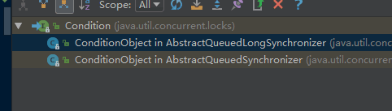

首先Condition是个接口，它有两个实现类(都是内部类，都叫ConditionObject)，如上图所示。AbstractQueuedSynchronizer和AbstractQueuedLongSynchronizer功能几乎都一样，只是前者使用int来表示状态，后者使用long来表示状态，也就是可以表示更多的状态。

ConditionObject内部维护了一个FIFO的队列（实际是个单链表，链表内都是Node类型对象），并且记录了firstWaiter（头节点）和lastWaiter（尾节点），每次wait时，往链表的尾部添加一个Node，每次signal时从链表头部取出一个元素。

![此处输入图片的描述][34]

 

sleep和wait的区别
-------------

 
 sleep属于Thread类的static native方法，sleep可以在指定时间后唤醒自己，且不用重新获取锁，即不释放锁。
 
 wait属于Object类的方法，wait虽然也可以在一定时间后尝试唤醒自己，但是不一定能唤醒成功（此时会抛出中断异常），因为它会释放锁。
 
 

 

多线程的状态转换图
---------

其实，线程Thread的源码中，有一个Enum枚举，源码如下：
```java
/**
     * A thread state.  A thread can be in one of the following states:
     * <ul>
     * <li>{@link #NEW}<br>
     *     A thread that has not yet started is in this state.
     *     </li>
     * <li>{@link #RUNNABLE}<br>
     *     A thread executing in the Java virtual machine is in this state.
     *     </li>
     * <li>{@link #BLOCKED}<br>
     *     A thread that is blocked waiting for a monitor lock
     *     is in this state.
     *     </li>
     * <li>{@link #WAITING}<br>
     *     A thread that is waiting indefinitely for another thread to
     *     perform a particular action is in this state.
     *     </li>
     * <li>{@link #TIMED_WAITING}<br>
     *     A thread that is waiting for another thread to perform an action
     *     for up to a specified waiting time is in this state.
     *     </li>
     * <li>{@link #TERMINATED}<br>
     *     A thread that has exited is in this state.
     *     </li>
     * </ul>
     *
     * <p>
     * A thread can be in only one state at a given point in time.
     * These states are virtual machine states which do not reflect
     * any operating system thread states.
     *
     * @since   1.5
     * @see #getState
     */
    public enum State {
        /**
         * Thread state for a thread which has not yet started.
         */
        NEW,

        /**
         * Thread state for a runnable thread.  A thread in the runnable
         * state is executing in the Java virtual machine but it may
         * be waiting for other resources from the operating system
         * such as processor.
         */
        RUNNABLE,

        /**
         * Thread state for a thread blocked waiting for a monitor lock.
         * A thread in the blocked state is waiting for a monitor lock
         * to enter a synchronized block/method or
         * reenter a synchronized block/method after calling
         * {@link Object#wait() Object.wait}.
         */
        BLOCKED,

        /**
         * Thread state for a waiting thread.
         * A thread is in the waiting state due to calling one of the
         * following methods:
         * <ul>
         *   <li>{@link Object#wait() Object.wait} with no timeout</li>
         *   <li>{@link #join() Thread.join} with no timeout</li>
         *   <li>{@link LockSupport#park() LockSupport.park}</li>
         * </ul>
         *
         * <p>A thread in the waiting state is waiting for another thread to
         * perform a particular action.
         *
         * For example, a thread that has called <tt>Object.wait()</tt>
         * on an object is waiting for another thread to call
         * <tt>Object.notify()</tt> or <tt>Object.notifyAll()</tt> on
         * that object. A thread that has called <tt>Thread.join()</tt>
         * is waiting for a specified thread to terminate.
         */
        WAITING,

        /**
         * Thread state for a waiting thread with a specified waiting time.
         * A thread is in the timed waiting state due to calling one of
         * the following methods with a specified positive waiting time:
         * <ul>
         *   <li>{@link #sleep Thread.sleep}</li>
         *   <li>{@link Object#wait(long) Object.wait} with timeout</li>
         *   <li>{@link #join(long) Thread.join} with timeout</li>
         *   <li>{@link LockSupport#parkNanos LockSupport.parkNanos}</li>
         *   <li>{@link LockSupport#parkUntil LockSupport.parkUntil}</li>
         * </ul>
         */
        TIMED_WAITING,

        /**
         * Thread state for a terminated thread.
         * The thread has completed execution.
         */
        TERMINATED;
    }
```
 状态之间的相互流转可以参照下图，需要注意的是sleep并不会释放锁，而wait会释放。
 
 https://www.cnblogs.com/audi-car/p/6028763.html
 
 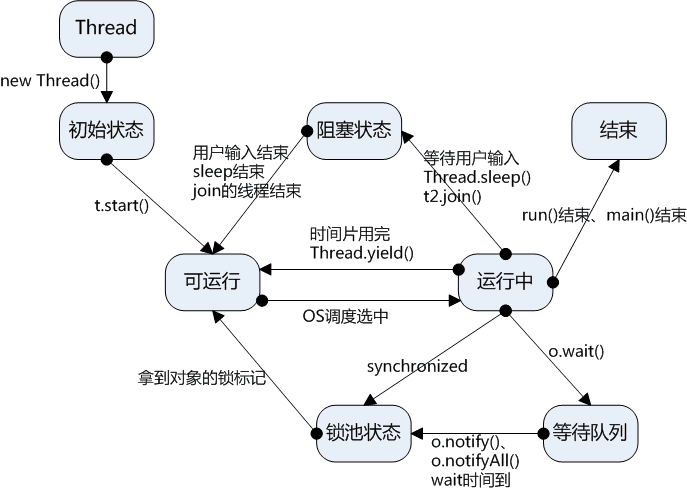
 
 

线程池状态
=====
线程有如上的多种状态，那么线程池呢？同样的，有多种状态。分别是(源码位于ThreadPoolExecutor类中)：
```java
    // runState is stored in the high-order bits
    private static final int RUNNING    = -1 << COUNT_BITS;
    private static final int SHUTDOWN   =  0 << COUNT_BITS;
    private static final int STOP       =  1 << COUNT_BITS;
    private static final int TIDYING    =  2 << COUNT_BITS;
    private static final int TERMINATED =  3 << COUNT_BITS;
```

他们之间的转换关系如下：
```java
     /* The runState provides the main lifecycle control, taking on values:
     *
     *   RUNNING:  Accept new tasks and process queued tasks
     *   SHUTDOWN: Don't accept new tasks, but process queued tasks
     *   STOP:     Don't accept new tasks, don't process queued tasks,
     *             and interrupt in-progress tasks
     *   TIDYING:  All tasks have terminated, workerCount is zero,
     *             the thread transitioning to state TIDYING
     *             will run the terminated() hook method
     *   TERMINATED: terminated() has completed
     *
     * The numerical order among these values matters, to allow
     * ordered comparisons. The runState monotonically increases over
     * time, but need not hit each state. The transitions are:
     *
     * RUNNING -> SHUTDOWN
     *    On invocation of shutdown(), perhaps implicitly in finalize()
     * (RUNNING or SHUTDOWN) -> STOP
     *    On invocation of shutdownNow()
     * SHUTDOWN -> TIDYING
     *    When both queue and pool are empty
     * STOP -> TIDYING
     *    When pool is empty
     * TIDYING -> TERMINATED
     *    When the terminated() hook method has completed
     *
     * Threads waiting in awaitTermination() will return when the
     * state reaches TERMINATED.
     *
     * Detecting the transition from SHUTDOWN to TIDYING is less
     * straightforward than you'd like because the queue may become
     * empty after non-empty and vice versa during SHUTDOWN state, but
     * we can only terminate if, after seeing that it is empty, we see
     * that workerCount is 0 (which sometimes entails a recheck -- see
     * below).
     */
```
简单来说就是如下图所示：


 

thread的run方法和start方法的区别
-----------------------
 - https://blog.csdn.net/ljheee/article/details/78512815

我们先看一个实例：
```java
package com.interview.javabasic.thread;

public class ThreadTest {
    private static void attack() {
        System.out.println("Fight");
        System.out.println("Current Thread is : " + Thread.currentThread().getName());
    }

    public static void main(String[] args) throws InterruptedException {
        Thread t = new Thread(){
            public void run(){
                attack();
            }
        };
        System.out.println("current main thread is : " + Thread.currentThread().getName());
        t.run();
//        t.start();
    }
}
```
分别执行上面代码的run和start部分，run时可以得到我们一直都是main线程在执行，没有新建线程：
```java
current main thread is : main
Fight
Current Thread is : main
```
至于为什么没有新建线程，可以看一下run方法的源码，可以看到并没有新建线程的部分，仅仅是调用target的run方法，从英文注释也可以看出这一点，：
```java
    /**
     * If this thread was constructed using a separate
     * <code>Runnable</code> run object, then that
     * <code>Runnable</code> object's <code>run</code> method is called;
     * otherwise, this method does nothing and returns.
     * <p>
     * Subclasses of <code>Thread</code> should override this method.
     *
     * @see     #start()
     * @see     #stop()
     * @see     #Thread(ThreadGroup, Runnable, String)
     */
    @Override
    public void run() {
        if (target != null) {
            target.run();
        }
    }
```


start执行时，结果如下：
```java
current main thread is : main
Fight
Current Thread is : Thread-0
```
可以看到，当我们调用start以后，就新创建了一个线程。

为了更加深入的了解start方法，我们看一下他的源码：
```java
/**
     * Causes this thread to begin execution; the Java Virtual Machine
     * calls the <code>run</code> method of this thread.
     * <p>
     * The result is that two threads are running concurrently: the
     * current thread (which returns from the call to the
     * <code>start</code> method) and the other thread (which executes its
     * <code>run</code> method).
     * <p>
     * It is never legal to start a thread more than once.
     * In particular, a thread may not be restarted once it has completed
     * execution.
     *
     * @exception  IllegalThreadStateException  if the thread was already
     *               started.
     * @see        #run()
     * @see        #stop()
     */
    public synchronized void start() {
        /**
         * This method is not invoked for the main method thread or "system"
         * group threads created/set up by the VM. Any new functionality added
         * to this method in the future may have to also be added to the VM.
         *
         * A zero status value corresponds to state "NEW".
         */
        if (threadStatus != 0)
            throw new IllegalThreadStateException();

        /* Notify the group that this thread is about to be started
         * so that it can be added to the group's list of threads
         * and the group's unstarted count can be decremented. */
        group.add(this);

        boolean started = false;
        try {
            start0();
            started = true;
        } finally {
            try {
                if (!started) {
                    group.threadStartFailed(this);
                }
            } catch (Throwable ignore) {
                /* do nothing. If start0 threw a Throwable then
                  it will be passed up the call stack */
            }
        }
    }

    private native void start0();
```
我们重点关注一下第一个try语句内的start0方法，他是一个native方法，源码可以在  http://hg.openjdk.java.net/jdk8u/jdk8u/jdk/file/5b5973c3db08/src/share/native/java/lang/Thread.c  以及   http://hg.openjdk.java.net/jdk8u/jdk8u/hotspot/file/174eed0020f2/src/share/vm/prims/jvm.cpp   找到。

在jvm.cpp中搜索JVM_StartThread即可定位到实现的c++源码部分，其中有一句下面的代码，证明这里确实新开了一个线程：
```c++
 native_thread = new JavaThread(&thread_entry, sz);
```

重复调用一个线程的start方法，会如何
--------------------
首先给出答案，会抛出IllegalThreadStateException异常。

至于为什么呢，我们也可以看一下源码：
```java
 /**
     * Causes this thread to begin execution; the Java Virtual Machine
     * calls the <code>run</code> method of this thread.
     * <p>
     * The result is that two threads are running concurrently: the
     * current thread (which returns from the call to the
     * <code>start</code> method) and the other thread (which executes its
     * <code>run</code> method).
     * <p>
     * It is never legal to start a thread more than once.
     * In particular, a thread may not be restarted once it has completed
     * execution.
     *
     * @exception  IllegalThreadStateException  if the thread was already
     *               started.
     * @see        #run()
     * @see        #stop()
     */
    public synchronized void start() {
        /**
         * This method is not invoked for the main method thread or "system"
         * group threads created/set up by the VM. Any new functionality added
         * to this method in the future may have to also be added to the VM.
         *
         * A zero status value corresponds to state "NEW".
         */
        if (threadStatus != 0)
            throw new IllegalThreadStateException();

        /* Notify the group that this thread is about to be started
         * so that it can be added to the group's list of threads
         * and the group's unstarted count can be decremented. */
        group.add(this);

        boolean started = false;
        try {
            start0();
            started = true;
        } finally {
            try {
                if (!started) {
                    group.threadStartFailed(this);
                }
            } catch (Throwable ignore) {
                /* do nothing. If start0 threw a Throwable then
                  it will be passed up the call stack */
            }
        }
    }

    private native void start0();
```

其实这段代码，上面刚刚已经出现过，我们简单分析一下。首先这个方法是synchronized 修饰的，意味着第一个start没执行完，第二个start不能执行。

其次，第二个start执行的时候，会发现threadStatus已经不等于0，因为我们分析了线程的状态转换，直到start以后，理论上来说线程的state已经是RUNNABLE了，不再是NEW（也就是0），因此从源码可以看出会抛出异常。


 
不同jdk版本的intern方法
----------------

 - https://blog.csdn.net/guoxiaolongonly/article/details/80425548

按我的理解，jdk6之前就是将堆中的常量字符串复制一份到常量池，他们的内存地址是不同的。jdk6以后，常量池仅仅保存堆中常量对象的引用，而不会进行复制，即他们的内存地址是指向一个位置。
 
我们先看一个例子：
```java
 package com.interview.javabasic.jvm.model;

public class InternDifference {
    public static void main(String[] args) {
        // 首先将常量“a”存入常量池
        String s = new String("a");
        // 调用intern时，尝试将常量“a”再次放入常量池，此时由于已经放入过一次，因此不会再次放入，只会返回"a"的常量引用
        s.intern();
        // 返回常量池中"a"的引用
        String s2 = "a";
        // 下面结果为false，因为s指向堆内存空间，s2指向常量池“a”的引用
        System.out.println(s == s2);
        // 下面的语句结果为true，因为s.intern()和s2都指向“a”的常量引用
//        System.out.println(s.intern() == s2);

        // s3为堆中对象  “aa”
        String s3 = new String("a") + new String("a");
        // 调用intern时，将堆中对象“aa”的 引用 存入常量池
        s3.intern();
        // s4指向常量池的“aa”引用  即s3
        String s4 = "aa";
        System.out.println(s3 == s4);
    }
}
```
jdk8下，运行结果，如果看不懂可以看注释就懂了：
```java
false
true
```

如果是jdk6运行结果又是什么呢？结果如下：
```java
false
false
```
不同jdk版本为什么会出现上述的差异？

因为，如下图所示，jdk6时，即便是相同的字符串，堆中的字符串和常量池中的对象，他们的内存地址也不是一样的，是复制的关系。

jdk6+时，对于相同的字符串，如果已经在堆中存在，那么常量池中就不会再存储一次这个字符串，而仅仅存储堆中对象的引用。其实我们在GC可达性分析时，常量池引用可以作为GC-root，这里就是常量池引用的一个很好的例子。

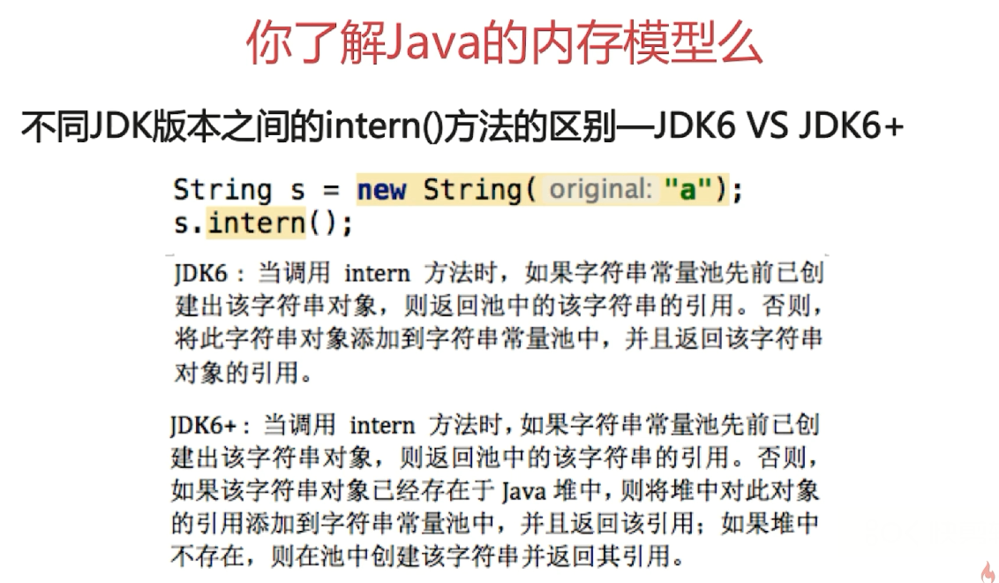

 

操作系统当中的进程调度算法 每种算法的优缺点
----------------------

 
 https://blog.csdn.net/qq_35642036/article/details/82809812
 
 调度算法主要包括:
 

 1. 先来先服务调度算法(FIFO)
 2. 短作业(进程)优先调度算法(需要预先知道作业的执行时间长短)
 3. 高优先权优先调度算法(根据优先级确定谁先执行)
 4. 高响应比优先调度算法(主要是为了保证长作业时间任务的及时执行)
 5. 时间片轮转法(一个时间片内,进程没有执行完成,会被添加到等待队列末尾,保证了所有的进程都能及时得到调度)
 6. 多级反馈队列调度算法(前面介绍的各种用作进程调度的算法都有一定的局限性。如短进程优先的调度算法，仅照顾了短进程而忽略了长进程，而且如果并未指明进程的长度，则短进程优先和基于进程长度的抢占式调度算法都将无法使用。而多级反馈队列调度算法则不必事先知道各种进程所需的执行时间，而且还可以满足各种类型进程的需要，因而它是目前被公认的一种较好的进程调度算法。在采用多级反馈队列调度算法的系统中，调度算法的实施过程如下所述。)
 
 (1) 应设置多个就绪队列，并为各个队列赋予不同的优先级。第一个队列的优先级最高，第二个队列次之，其余各队列的优先权逐个降低。该算法赋予各个队列中进程执行时间片的大小也各不相同，在优先权愈高的队列中，为每个进程所规定的执行时间片就愈小。例如，第二个队列的时间片要比第一个队列的时间片长一倍，……，第i+1个队列的时间片要比第i个队列的时间片长一倍。

(2)当一个新进程进入内存后，首先将它放入第一队列的末尾，按FCFS原则排队等待调度。当轮到该进程执行时，如它能在该时间片内完成，便可准备撤离系统；如果它在一个时间片结束时尚未完成，调度程序便将该进程转入第二队列的末尾，再同样地按FCFS原则等待调度执行；如果它在第二队列中运行一个时间片后仍未完成，再依次将它放入第三队列，……，如此下去，当一个长作业(进程)从第一队列依次降到第n队列后，在第n 队列便采取按时间片轮转的方式运行。

(3) 仅当第一队列空闲时，调度程序才调度第二队列中的进程运行；仅当第1～(i-1)队列均空时，才会调度第i队列中的进程运行。如果处理机正在第i队列中为某进程服务时，又有新进程进入优先权较高的队列(第1～(i-1)中的任何一个队列)，则此时新进程将抢占正在运行进程的处理机，即由调度程序把正在运行的进程放回到第i队列的末尾，把处理机分配给新到的高优先权进程。

响应比的计算方式如下图所示:

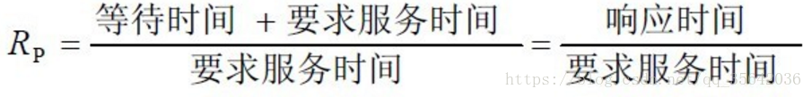

多级响应队列示意图:


 

批处理系统、分时系统和实时系统中，各采用哪几种进程（作业）调度算法
---------------------------------

 
 批处理系统常用调度算法：
①、先来先服务：FCFS
②、最短作业优先
③、最短剩余时间优先
④、响应比最高者优先

分时系统调度算法：
①、轮转调度
②、优先级调度
③、多级队列调度
④、彩票调度

实时系统调度算法：
①、单比率调度
②、限期调度
③、最少裕度法

 

布隆过滤器
-----

 
 https://www.jianshu.com/p/c45af74b2a33
 
 通过布隆过滤器查找的数据如果不存在,那么这个数据一定不存在.如果布隆过滤器判断存在,则该数据不一定存在.
 
 下图中,不同颜色的线条,表示不同的hash函数:
 

 
 下面粘贴一下链接里的布隆过滤器的概率推导:
 
 假设 Hash 函数以等概率条件选择并设置 Bit Array 中的某一位，m 是该位数组的大小，k 是 Hash 函数的个数，那么位数组中某一特定的位在进行元素插入时的 Hash 操作中没有被置位的概率是：
 
 
 
 那么在所有 k 个 Hash 操作后该位都没有被置 "1" 的概率是：
 
 
 
 如果我们插入了 n 个元素，那么某一位仍然为 "0" 的概率是：
 
 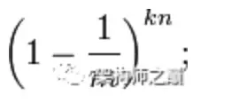
 
 因而该位为 "1"的概率是：
 
 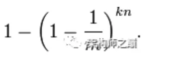
 
 现在检测某一元素是否在该集合中。标明某个元素是否在集合中所需的 k 个位置都按照如上的方法设置为 "1"，但是该方法可能会使算法错误的认为某一原本不在集合中的元素却被检测为在该集合中（False Positives），该概率由以下公式确定：
 
 
 
 其实上述结果是在假定由每个 Hash 计算出需要设置的位（bit） 的位置是相互独立为前提计算出来的，不难看出，随着 m （位数组大小）的增加，假正例（False Positives）的概率会下降，同时随着插入元素个数 n 的增加，False Positives的概率又会上升，对于给定的m，n，如何选择Hash函数个数 k 由以下公式确定：


此时False Positives的概率为：

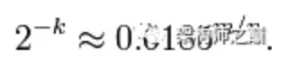

而对于给定的False Positives概率 p，如何选择最优的位数组大小 m 呢，

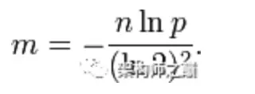

上式表明，位数组的大小最好与插入元素的个数成线性关系，对于给定的 m，n，k，假正例概率最大为：


下图是布隆过滤器假正例概率 p 与位数组大小 m 和集合中插入元素个数 n 的关系图，假定 Hash 函数个数选取最优数目：


 

jvm的知识
------

 - 引用计数法

引用计数法其实就是，类似于信号量，当一个对象被引用时，该引用对象的引用计数器加1，反之引用计数器减1。

如果引用计数器为0，那么在垃圾回收的时候，这个对象就可以被回收。

引用计数法有一个问题，就是无法解决对象循环依赖的问题，源码如下：
首先是一个MyObject对象，该对象拥有一个指向MyObject类型的对象，类似于链表的next指针：
```java
package com.interview.javabasic.jvm.gc;

public class MyObject {
    public MyObject childNode;
}
```
然后构造循环引用：
```java
package com.interview.javabasic.jvm.gc;

public class ReferenceCounterProblem {
    public static void main(String[] args) {
        MyObject object1 = new MyObject();
        MyObject object2 = new MyObject();

        object1.childNode = object2;
        object1.childNode = object1;

    }

}
```
如此object1和object1引用计数器都不为0，永远无法被回收，造成内存泄漏。

 - 可达性分析法

所谓可达性分析法，就是从GC-root开始，可以被访问到的对象，均认为是存活的对象，反之则认为该对象可以被回收。

那么哪些对象可以作为GC-root呢？

如下图所示：

![此处输入图片的描述][39]
 
 

何时触发Full GC
-----------
![此处输入图片的描述][40]

 
 
 

 

正则表相关
-----

https://github.com/CyC2018/CS-Notes/blob/master/docs/notes/%E6%AD%A3%E5%88%99%E8%A1%A8%E8%BE%BE%E5%BC%8F.md

https://www.cnblogs.com/Mustr/p/6060242.html

**常见的符号的介绍**

 1. 预定义字符类
 
| 符号        | 说明   |  
| --------   | :-----  | 
|  .     | 任何字符（与行结束符可能匹配也可能不匹配） |  
| \d        |   数字：[0-9]   |
| \D        |    非数字： [^0-9]    |
| \s        |    空白字符：[ \t\n\x0B\f\r]    |
| \S       |    非空白字符：[^\s]    |
| \w       |    单词字符：[a-zA-Z_0-9]    |
| \W       |    非单词字符：[^\w]    |
| \       |    转义字符，比如"\\\"匹配"\"    ,"\\{"匹配"{"。   |
 2. 数量词
 
| 符号        | 说明   |  
| --------   | :-----  | 
|  *     | 等价于｛0，｝匹配0至多个在它之前的字符。例如正则表达式“zo*”能匹配“z”以及“zoo”；正则表达式“.*”意味着能够匹配任意字符串。 |  
| +        |   等价于｛1，｝匹配前面的子表达式一次或多次。例如正则表达式9+匹配9、99、999等。   |
| ?       |    等价于｛0，1｝匹配前面的子表达式零次或一次。例如，"do(es)?" 可以匹配 "do" 或 "does" 中的"do" 。此元字符还有另外一个用途，就是表示非贪婪模式匹配，后边将有介绍    |
|  {n}        |    匹配确定的 n 次。例如，“e{2}”不能匹配“bed”中的“d”，但是能匹配“seed”中的两个“e”。   |
|   {n,}      |    至少匹配n次。例如，“e{2,}”不能匹配“bed”中的“e”，但能匹配“seeeeeeeed”中的所有“e”。    |
| {n,m}       |    最少匹配 n 次且最多匹配 m 次。“e{1,3}”将匹配“seeeeeeeed”中的前三个“e”。   |
 3. 边界匹配符号

| 符号        | 说明   |  
| --------   | :-----  | 
|   ^|	行的开头|
   |$	|行的结尾|
   |\b|	单词边界|
   |\B|	非单词边界|
   |\A|	输入的开头|
   |\G|	上一个匹配的结尾|
   |\Z|	输入的结尾，仅用于最后的结束符（如果有的话）|
   |\z|	输入的结尾|
   
 4. 其他常见符号

| 符号 大小括号等的使用          | 说明   |  
| ------------   | :-----  | 
   |[]|             	匹配括号中的任何一个字符|
   |[abc]|	a、b 或 c（简单类）|
   |[^abc]|	任何字符，除了 a、b 或 c（否定）|
   |[a-zA-Z]|	a 到 z 或 A 到 Z，两头的字母包括在内（范围）|
   |[a-d[m-p]]|	a 到 d 或 m 到 p：[a-dm-p]（并集）|
   |[a-z&&[def]]|	d、e 或 f（交集）|
   |[a-z&&[^bc]]|	a 到 z，除了 b 和 c：[ad-z]（减去）|
   |[a-z&&[^m-p]]|	a 到 z，而非 m 到 p：[a-lq-z]（减去）|
  | （）的使用  -- 组|	 |
   | （）|	将 () 之间括起来的表达式定义为“组”(group)，并且将匹配这个表达式的字符保存到一个临时区域,这个元字符在字符串提取的时候非常有用。捕获组可以通过从左到右计算其开括号来编号。|
|  (\d)|	 第一组|
|((A)(B(C)))|	 第一组  ((A)(B(C)))   第二组 (A)   第三组(B(C))  第四组(C)|

 

Listener监听器 和 Filter过滤器以及拦截器Interceptor
---------------------------------------

 
 https://www.jianshu.com/p/503142244753
 
 Servlet的监听器(Listener)：

 - 监听ServletContext,HttpSession,ServletRequest
 - 事件源和监听器绑定的过程:通过配置完成.

Servlet中的监听器:提供了8个监听器.

一类:监听三个域对象的创建和销毁的监听器.3个

二类:监听三个域对象的属性变更的监听器.(属性添加,属性移除,属性替换)3个.

三类:监听HttpSession对象中的JavaBean的状态的改变.(绑定,解除绑定,钝化和活化)2个

**ServletContext**对象何时**创建**和**销毁**?

创建：服务器启动时候,服务器可以为每个WEB应用创建一个单独的ServletContext.

销毁：服务器关闭的时候,或者项目从服务器中移除.

下面上一段demo代码(注意除了在该类上加@WebListener注解外,还需要在应用的主类上加上@ServletComponentScan,否则自定义的Listener不会生效):
```java
package com.audi.demo.listener;

import javax.servlet.ServletContextEvent;
import javax.servlet.ServletContextListener;
import javax.servlet.annotation.WebListener;

/**
 * @author wangquanzhou
 * @date 19-1-21 下午12:08
 */
@WebListener
public class DemoListener implements ServletContextListener {

    @Override
    public void contextInitialized(ServletContextEvent sce) {
        System.out.println("ServletContext对象被创建了....");
    }

    @Override
    public void contextDestroyed(ServletContextEvent sce) {
        System.out.println("ServletContext对象被销毁了....");
    }
}
```

那么,通过上面这种自定义ServletContextListener,可以实现什么**功能**呢?

 1. 初始化工作.
 2. 加载配置文件:Spring框架.
 3. 定时任务调度:Timer,TimerTask.


 
 **HttpSessionListener**:监听**HttpSession对象**的**创建**和**销毁**的监听器.
 
HttpSession对象何时创建和销毁的? 

创建:服务器第一次调用getSession()方法的时候.

销毁：非正常关闭服务器(正常关闭序列化到硬盘)

session过期了(默认30分钟)

session.invalidate()

【问题】

1.访问html是否创建session对象? 不会

2.访问一个Servlet是否创建session对象? 不会

3.访问一个jsp是否创建session对象? 会

```java
package com.audi.demo.listener;

import javax.servlet.annotation.WebListener;
import javax.servlet.http.HttpSessionEvent;
import javax.servlet.http.HttpSessionListener;

/**
 * @author wangquanzhou
 * @date 19-1-21 下午12:38
 */
@WebListener
public class DemoHttpSessionListener implements HttpSessionListener {
    @Override
    public void sessionCreated(HttpSessionEvent se) {
        System.out.println("HttpSession对象被创建了...");
    }

    @Override
    public void sessionDestroyed(HttpSessionEvent se) {
        System.out.println("HttpSession对象被销毁了...");
    }
}
```

 **ServletRequestListener**:监听**ServletRequest对象**的**创建**和**销毁**的监听器
 
ServletRequest对象何时创建和销毁?

创建:客户端向服务器发送请求的时候.

销毁:服务器为这次请求作出了响应时候.

```java
package com.audi.demo.listener;

import javax.servlet.ServletRequestEvent;
import javax.servlet.ServletRequestListener;
import javax.servlet.annotation.WebListener;
import java.util.Date;

/**
 * @author wangquanzhou
 * @date 19-1-21 下午12:44
 */
@WebListener
public class DemoServletRequestListener implements ServletRequestListener {
    @Override
    public void requestDestroyed(ServletRequestEvent sre) {
        System.out.println(System.nanoTime() + " ServletRequest对象被创建了...");
    }

    @Override
    public void requestInitialized(ServletRequestEvent sre) {
        System.out.println(System.nanoTime() + " ServletRequest对象被销毁了...");
    }
}
```
【问题】

1.访问html是否创建request对象? 会

2.访问一个Servlet是否创建request对象? 会

3.访问一个jsp是否创建request对象? 会

二类 三类监听器这里就不做介绍  都比较简单.

下面看一下filter过滤器.

filter的一般**用途**如下:

通过Filter可以拦截访问web资源的请求与响应操作.

WEB开发人员通过Filter技术，对web服务器管理的所有web资源：例如Jsp, Servlet, 静态图片文件或静态 html文件等进行拦截，从而实现一些特殊的功能。例如实现URL级别的权限访问控制、过滤敏感词汇、压缩响应信息等一些高级功能。

filter创建步骤:

编写filter

a. 创建一个类实现javax.servlet.Filter接口

b. 重写接口方法

编写配置文件

a. 注册filter

b. 绑定路径

多个Filter对同一个资源进行了拦截，那么当我们在开始的Filter中执行 chain.doFilter(request,response)时，是访问下一下Filter,直到最后一个Filter执行时，它后面没有了Filter,才会访问web资源。多个filter的顺序可以通过@order注解进行先后控制.

**filter生命周期**

当服务器启动，会创建Filter对象，并调用init方法，只调用一次.

当访问资源时，路径与Filter的拦截路径匹配，会执行Filter中的doFilter方法，这个方法是真正拦截操作的方法.

当服务器关闭时，会调用Filter的destroy方法来进行销毁操作.

下面自定义了两个过滤器,拦截所有的请求,需要注意其中的order顺序控制以及filterChain的dofilter,源码如下:
```java
package com.audi.demo.filter;

import org.springframework.core.Ordered;
import org.springframework.core.annotation.Order;

import javax.servlet.*;
import javax.servlet.annotation.WebFilter;
import java.io.IOException;

/**
 * @author wangquanzhou
 * @date 19-1-21 下午2:16
 */
@WebFilter
// 通过@Order注解进行多个过滤器的先后顺序控制   默认优先级是Ordered.LOWEST_PRECEDENCE
@Order(Ordered.HIGHEST_PRECEDENCE)
public class Demo1Filter implements Filter {
    @Override
    public void init(FilterConfig filterConfig) throws ServletException {
        System.out.println("自定义过滤器1初始化...");
    }

    @Override
    public void doFilter(ServletRequest servletRequest, ServletResponse servletResponse, FilterChain filterChain) throws IOException, ServletException {
        System.out.println("过滤器1成功拦截了请求...");
        filterChain.doFilter(servletRequest, servletResponse);
    }

    @Override
    public void destroy() {
        System.out.println("过滤器1被销毁了...");
    }
}
```

```java
package com.audi.demo.filter;

import org.springframework.core.annotation.Order;

import javax.servlet.*;
import javax.servlet.annotation.WebFilter;
import java.io.IOException;

/**
 * @author wangquanzhou
 * @date 19-1-21 下午2:16
 */
@WebFilter
@Order
public class Demo2Filter implements Filter {
    @Override
    public void init(FilterConfig filterConfig) throws ServletException {
        System.out.println("自定义过滤器2初始化...");
    }

    @Override
    public void doFilter(ServletRequest servletRequest, ServletResponse servletResponse, FilterChain filterChain) throws IOException, ServletException {
        System.out.println("过滤器2成功拦截了请求...");
        // 没有下面的这句话  那么请求将不能正确到达controller层
        filterChain.doFilter(servletRequest, servletResponse);
    }

    @Override
    public void destroy() {
        System.out.println("过滤器2被销毁了...");
    }
}
```

拦截器Interceptor

https://www.cnblogs.com/GodHeng/p/9285259.html

主要也是控制前端到后端的请求,设置一些规则,和过滤器的区别联系后续介绍,先看一下自定义拦截器实例代码:
```java
package com.audi.demo.interceptor;

import org.springframework.lang.Nullable;
import org.springframework.web.servlet.HandlerInterceptor;
import org.springframework.web.servlet.ModelAndView;

import javax.servlet.http.HttpServletRequest;
import javax.servlet.http.HttpServletResponse;

/**
 * @author wangquanzhou
 * @date 19-1-21 下午3:34
 */
public class DemoInterceptor implements HandlerInterceptor {
    @Override
    public boolean preHandle(HttpServletRequest request, HttpServletResponse response, Object handler) throws Exception {
        System.out.println("进入拦截器的preHandle方法...");
        return true;
    }

    @Override
    public void postHandle(HttpServletRequest request, HttpServletResponse response, Object handler, @Nullable ModelAndView modelAndView) throws Exception {
        System.out.println("进入拦截器的postHandle方法...");
    }

    @Override
    public void afterCompletion(HttpServletRequest request, HttpServletResponse response, Object handler, @Nullable Exception ex) throws Exception {
        System.out.println("进入拦截器的afterCompletion方法...");
    }
}
```

然后,拦截器需要进行一些配置:
```java
package com.audi.demo.config;

import com.audi.demo.interceptor.DemoInterceptor;
import org.springframework.context.annotation.Configuration;
import org.springframework.web.servlet.config.annotation.InterceptorRegistry;
import org.springframework.web.servlet.config.annotation.WebMvcConfigurer;

/**
 * @author wangquanzhou
 * @date 19-1-21 下午3:39
 */
@Configuration
public class WebAppConfig implements WebMvcConfigurer {
    @Override
    public void addInterceptors(InterceptorRegistry registry) {
        registry.addInterceptor(new DemoInterceptor()).addPathPatterns("/*");
    }
}
```

下面我们比对一下拦截器和过滤器的区别:

https://blog.csdn.net/heweimingming/article/details/79993591

先上一张图:

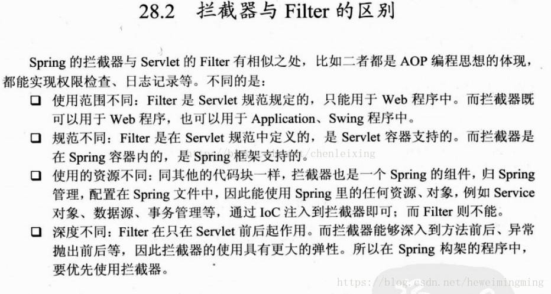

 1. 过滤器和拦截器触发时机不一样，过滤器是在请求进入容器后，但请求进入servlet之前进行预处理的。请求结束返回也是，是在servlet处理完后，返回给前端之前。可以参照一下下面这张图,很形象.


2、拦截器可以获取IOC容器中的各个bean，而过滤器就不行，因为拦截器是spring提供并管理的，spring的功能可以被拦截器使用，在拦截器里注入一个service，可以调用业务逻辑。而过滤器是JavaEE标准，只需依赖servlet api ，不需要依赖spring。

过滤器拦截器运行先后步骤如下图所示： 

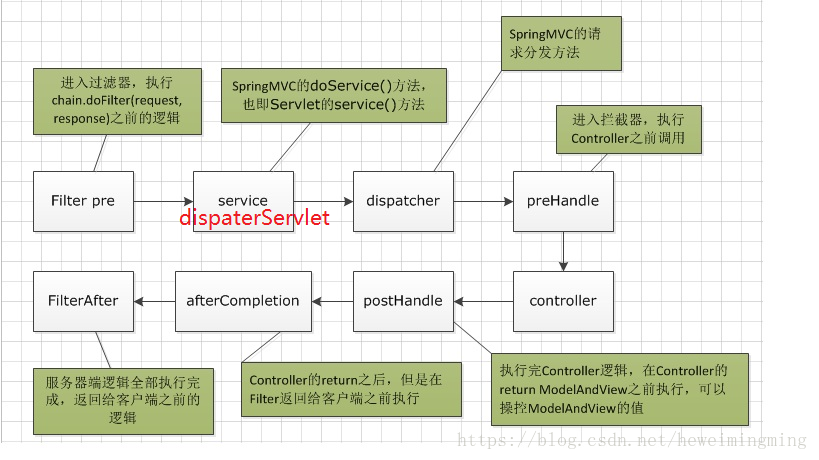

3. 过滤器的实现基于回调函数。而拦截器（代理模式）的实现基于反射，代理分静态代理和动态代理，动态代理是拦截器的简单实现。

何时使用拦截器？何时使用过滤器？

如果是非spring项目，那么拦截器不能用，只能使用过滤器。

如果是处理controller前后，既可以使用拦截器也可以使用过滤器。

如果是处理dispaterServlet前后，只能使用过滤器。

 **1. 短信轰炸接口**
 https://login.ceconline.com/pcMobileNumberRegister.do
 
 https://ems.xg-yc.com/#/register
 
 http://www.yifatong.com/Customers/registration
 
 http://qydj.scjg.tj.gov.cn/reportOnlineService/
 

 

redis的持久化
---------

https://www.cnblogs.com/AndyAo/p/8135980.html

redis提供两种方式进行持久化，一种是RDB持久化（原理是将Reids在内存中的数据库记录定时 dump到磁盘上的RDB持久化），另外一种是AOF（append only file）持久化（原理是将Reids的操作日志以追加的方式写入文件）。

**RDB持久化**

RDB持久化是指在指定的时间间隔内将内存中的数据集快照写入磁盘，实际操作过程是fork一个子进程，先将数据集写入临时文件，写入成功后，再替换之前的文件，用**二进制**压缩存储。如果在下一次定时备份时间之前，服务器崩溃，那么将会损失部分数据。

 
 
 **AOF持久化**
 
 AOF持久化以日志的形式记录服务器所处理的每一个写、删除操作，查询操作不会记录，以**文本文件**的方式记录，可以打开文件看到详细的操作记录。aof可以每秒都进行指令备份。
 
 
 
**二者对比**

相对于RDB存储直接存储缓存中的数据而言，aof是存储缓存对于数据的操作步骤，因此aof相对于RDB所需的存储空间要大一些，并且在做数据恢复时也要慢与RDB，但是rdb由于是定时对内存所有数据做快照，当数据量很大的时候会造成缓存服务器变慢甚至停顿。

二者选择的标准，就是看系统是愿意牺牲一些性能，换取更高的缓存一致性（aof），还是愿意写操作频繁的时候，不启用备份来换取更高的性能，待手动运行save的时候，再做备份（rdb）。rdb这个就更有些 eventually consistent的意思了。

 

Redis缓存淘汰策略
-----------

 
 | 策略        | 描述   |  
| --------   | -----  | 
| volatile-lru|	从已设置过期时间的数据集中挑选最近最少使用的数据淘汰|
|volatile-ttl|	从已设置过期时间的数据集中挑选将要过期的数据淘汰|
|volatile-random|	从已设置过期时间的数据集中任意选择数据淘汰|
|allkeys-lru	|从所有数据集中挑选最近最少使用的数据淘汰|
|allkeys-random|	从所有数据集中任意选择数据进行淘汰|
|noeviction|	禁止驱逐数据   |

Redis 4.0 引入了 volatile-lfu 和 allkeys-lfu 淘汰策略，LFU 策略通过统计访问频率，将访问频率最少的键值对淘汰。

 

redis的事务
--------

 
 一个事务包含了多个命令，服务器在执行事务期间，不会改去执行其它客户端的命令请求。

事务中的多个命令被一次性发送给服务器，而不是一条一条发送，这种方式被称为流水线，它可以减少客户端与服务器之间的网络通信次数从而提升性能。

Redis 最简单的事务实现方式是使用 MULTI 和 EXEC 命令将事务操作包围起来。  如果把EXEC换成DISCARD可以放弃当前事务。

 

redis数据分片
---------

 
 分片是将数据划分为多个部分的方法，可以将数据存储到多台机器里面，这种方法在解决某些问题时可以获得线性级别的性能提升。

假设有 4 个 Reids 实例 R0，R1，R2，R3，还有很多表示用户的键 user:1，user:2，... ，有不同的方式来选择一个指定的键存储在哪个实例中。

最简单的方式是范围分片，例如用户 id 从 0~1000 的存储到实例 R0 中，用户 id 从 1001~2000 的存储到实例 R1 中，等等。但是这样需要维护一张映射范围表，维护操作代价很高。
还有一种方式是哈希分片，使用 CRC32 哈希函数将键转换为一个数字，再对实例数量求模就能知道应该存储的实例。
根据执行分片的位置，可以分为三种分片方式：

客户端分片：客户端使用一致性哈希等算法决定键应当分布到哪个节点。
代理分片：将客户端请求发送到代理上，由代理转发请求到正确的节点上。
服务器分片：Redis Cluster。

 

redis的缓存更新策略
------------

 
 https://coolshell.cn/articles/17416.html
 
 **Cache Aside Pattern**
 
 一般通用的就是这个Cache Aside Pattern，即更新数据的时候，先更新**数据库**，然后再更新**缓存**。
 
 这个Pattern有没有什么问题？有，不过出现的概率真的很小。
 
 考虑如下的场景：一个是查询操作，一个是更新操作的并发，首先，更新数据库中的数据，此时，缓存依然有效，所以，并发的查询操作拿的是没有更新的数据，但是，更新操作马上让缓存的失效了，后续的查询操作再把数据从数据库中拉出来。而不会像文章开头的那个逻辑产生的问题，后续的查询操作一直都在取老的数据。

 

redis 的缓存穿透
-----------

redis 的缓存穿透值的是，客户端大量请求服务端不存在的数据，由于正常的逻辑是查询结果为空的数据不会进行缓存，那么会导致所有的查询都会进入db，严重时可能会使db hang住。

一般的做法是，即使查询得到的数据为空，也将空数据存入redis缓存，不过为了避免数据量太大撑爆缓存，可以为这类数据设置相对较短的过期时间，比如30秒。

另外一种做法是，使用**布隆过滤器**。在查询操作进行之前，先使用布隆过滤器根据查询条件判断一下数据是否存在。如果存在再继续仅需缓存或者db查询操作。

redis的缓存雪崩
----------

 
redis的缓存雪崩，大概的意思就是缓存在同一时间段内同时失效了，导致大量的数据插叙操作都请求到db了，这对于db的来说是很可怕的。

解决办法：一般的做法是避免缓存同时失效，例如可以在原有固定过期时间上加上一定的随机值，比如1-5分钟。

 

redis 的缓存击穿
-----------

缓存击穿，大概描述的是，针对某个访问频次很高的key，当key过期时，这时会有很多并发的请求来请求这个key，由于缓存已经没有了这个key，所有这些请求都会进入到db。

解决办法：为了避免多个请求同时请求db，在请求db之前可以使用setnx指令向cache写入一个key，这样可以保证只有一个请求拿到了query db的权限。不至于撑爆数据库。这种叫mutex锁。

 

hsahmap的死锁问题
------------

 
 针对JDK8之前的代码
 
 https://coolshell.cn/articles/9606.html
 
 hashmap在存入元素的时候，如果出现扩容的场景，且是在多线程环境下，那么可能出现死锁。具体的死锁形成的过程如下：
 
 首先我们看一下扩容的时候用到的几个关键方法：
```java
void resize(int newCapacity)
{
    Entry[] oldTable = table;
    int oldCapacity = oldTable.length;
    ......
    //创建一个新的Hash Table
    Entry[] newTable = new Entry[newCapacity];
    //将Old Hash Table上的数据迁移到New Hash Table上
    transfer(newTable);
    table = newTable;
    threshold = (int)(newCapacity * loadFactor);
}
```

注意transfer的时候使用的是头插法
```java
void transfer(Entry[] newTable)
{
    Entry[] src = table;
    int newCapacity = newTable.length;
    //下面这段代码的意思是：
    //  从OldTable里摘一个元素出来，然后放到NewTable中
    for (int j = 0; j < src.length; j++) {
        Entry<K,V> e = src[j];
        if (e != null) {
            src[j] = null;
            do {
                Entry<K,V> next = e.next;
                int i = indexFor(e.hash, newCapacity);
                // 从下面这句话可以看出,新的链表插入元素的时候采用的是头插法
                e.next = newTable[i];
                newTable[i] = e;
                e = next;
            } while (e != null);
        }
    }
}
```

**单线程时**，正常的rehash过程：

 - 我假设了我们的hash算法就是简单的用key mod 一下表的大小（也就是数组的长度）。
 - 最上面的是old hash 表，其中的Hash表的size=2, 所以key = 3, 7, 5，在mod
   2以后都冲突在table[1]这里了。
 - 接下来的三个步骤是Hash表 resize成4，然后所有的<key,value> 

下图展示了hashmap从2扩容到4的过程:


**多线程时**,rehash的过程:

假设我们有两个线程都在做resize的工作。我用红色和浅蓝色标注了一下。我们再回头看一下我们的 transfer代码中的这个细节：
```java
do {
    Entry<K,V> next = e.next; // <--假设线程一执行到这里就被调度挂起了
    int i = indexFor(e.hash, newCapacity);
    e.next = newTable[i];
    newTable[i] = e;
    e = next;
} while (e != null);
```

而我们的线程二执行完成了。于是我们有下图的这个样子。

**图2**


注意，因为线程1的 e 指向了key(3)，而next指向了key(7)，其在线程2 rehash后，指向了线程2重组后的链表。我们可以看到链表的顺序被反转后。

接下来,线程一被调度回来执行。

 1. 先是执行 newTalbe[i] = e;
 2. 然后是e = next，导致了e指向了key(7)，
 3. 而下一次循环的next = e.next导致了next指向了key(3)

如下图所示:


一切安好。线程一接着工作。把key(7)摘下来，放到newTable[i]的第一个(这就是**头插法**的体现)，然后把e和next往下移。


环形链接出现。e.next = newTable[i] 导致  key(3).next 指向了 key(7)

注意：此时的key(7).next 已经指向了key(3)， 环形链表就这样出现了。


据说JDK8避免了上述死循环的问题,我们看一下它是如何做resize的:
```java
/**
     * Initializes or doubles table size.  If null, allocates in
     * accord with initial capacity target held in field threshold.
     * Otherwise, because we are using power-of-two expansion, the
     * elements from each bin must either stay at same index, or move
     * with a power of two offset in the new table.
     *
     * @return the table
     */
    final Node<K,V>[] resize() {
        Node<K,V>[] oldTab = table;
        int oldCap = (oldTab == null) ? 0 : oldTab.length;
        int oldThr = threshold;
        int newCap, newThr = 0;
        if (oldCap > 0) {
            if (oldCap >= MAXIMUM_CAPACITY) {
                threshold = Integer.MAX_VALUE;
                return oldTab;
            }
            else if ((newCap = oldCap << 1) < MAXIMUM_CAPACITY &&
                     oldCap >= DEFAULT_INITIAL_CAPACITY)
                newThr = oldThr << 1; // double threshold
        }
        else if (oldThr > 0) // initial capacity was placed in threshold
            newCap = oldThr;
        else {               // zero initial threshold signifies using defaults
            newCap = DEFAULT_INITIAL_CAPACITY;
            newThr = (int)(DEFAULT_LOAD_FACTOR * DEFAULT_INITIAL_CAPACITY);
        }
        if (newThr == 0) {
            float ft = (float)newCap * loadFactor;
            newThr = (newCap < MAXIMUM_CAPACITY && ft < (float)MAXIMUM_CAPACITY ?
                      (int)ft : Integer.MAX_VALUE);
        }
        threshold = newThr;
        @SuppressWarnings({"rawtypes","unchecked"})
            Node<K,V>[] newTab = (Node<K,V>[])new Node[newCap];
        table = newTab;
        //如果是进行扩容操作,及原map是有数据的,需要进行元素的重新散列
        if (oldTab != null) {
            //循环处理旧map的每一个元素
            for (int j = 0; j < oldCap; ++j) {
                Node<K,V> e;
                if ((e = oldTab[j]) != null) {
                    oldTab[j] = null;
                    //如果该节点只有单个元素
                    if (e.next == null)
                        newTab[e.hash & (newCap - 1)] = e;
                    //如果该节点是红黑树结构
                    else if (e instanceof TreeNode)
                        ((TreeNode<K,V>)e).split(this, newTab, j, oldCap);
                    //如果该节点是链表结构
                    else { // preserve order
                        //“低链表”的头和尾，即扩容后的在new table的index和old index是一样的
                        Node<K,V> loHead = null, loTail = null;
                        //“高链表”的头和尾，即扩容后的在new table的index是old index的2倍
                        Node<K,V> hiHead = null, hiTail = null;
                        Node<K,V> next;
                        do {
                            next = e.next;
                            if ((e.hash & oldCap) == 0) {
                                if (loTail == null)
                                    loHead = e;
                                else
                                    loTail.next = e;
                                loTail = e;
                            }
                            else {
                                if (hiTail == null)
                                    hiHead = e;
                                else
                                    hiTail.next = e;
                                hiTail = e;
                            }
                        } while ((e = next) != null);
                        if (loTail != null) {
                            loTail.next = null;
                            newTab[j] = loHead;
                        }
                        if (hiTail != null) {
                            hiTail.next = null;
                            newTab[j + oldCap] = hiHead;
                        }
                    }
                }
            }
        }
        return newTab;
    }
```

其实,由于尾插法,如上图2中所示,那么jdk8的resize以后,线程2在entry=3位置处将依次存入key=3 key=7.

当线程1再执行的时候,首先指向的依旧是key=3,然后是key=7,避免了出现环状死循环.

 

为什么联盟连SDK中不适用zk作为注册中心
---------------------

因为,为了更好的集成使用springcloud的组件,并且工程中还会涉及节点之间的相互远程调用(使用feign-client实现),因此使用eureka作为注册中心.

 

Java堆栈溢出条件及解决办法
---------------

 
 java栈何时会溢出?
 
 无限的递归调用,就会出现栈溢出.
 
 Java堆何时会溢出?
 
 集合对象不断的往内部put元素时,就有可能会溢出.
 
 如何避免溢出?
 栈溢出可以将递归改为循环,减轻栈的压力.堆溢出可以避免使用强引用(new的方式),而使用软引用(内存不足时,会进行回收)或者弱引用(对象在下一次GC的时候会被回收).

Java的锁升级
--------

 
 https://blog.csdn.net/tongdanping/article/details/79647337
 
 Java的锁升级主要原因还是多个线程竞争临界资源导致的,并且避免自旋锁一直自旋,浪费CPU资源.
 

 

大数据题
----

 
 10亿个数去重可以使用bitmap.
 
 

10亿个数找前10个最大的
-------------

 
可以使用堆排序(注意这里需要使用**小顶堆**,这样有一个好处,当一个数比堆顶元素还小的话,那么它肯定比堆里所有的元素都小,所以不需要再进行比较可以直接丢弃,大顶堆就不能实现这个功能).

进一步的,为了加快数据的处理,可以将数据分块处理,最后进行归并就可以了.使用了map-reduce的思想.

 

 

http 状态码
--------

https://zh.wikipedia.org/wiki/HTTP%E7%8A%B6%E6%80%81%E7%A0%81

**1xx消息**

这一类型的状态码，代表请求已被接受，需要继续处理。这类响应是临时响应，只包含状态行和某些可选的响应头信息，并以空行结束。由于HTTP/1.0协议中没有定义任何1xx状态码，所以除非在某些试验条件下，服务器禁止向此类客户端发送1xx响应。[4] 这些状态码代表的响应都是信息性的，标示客户应该采取的其他行动。

100 Continue

服务器已经接收到请求头，并且客户端应继续发送请求主体（在需要发送身体的请求的情况下：例如，POST请求），或者如果请求已经完成，忽略这个响应。服务器必须在请求完成后向客户端发送一个最终响应。要使服务器检查请求的头部，客户端必须在其初始请求中发送Expect: 100-continue作为头部，并在发送正文之前接收100 Continue状态代码。响应代码417期望失败表示请求不应继续。[2]

101 Switching Protocols

服务器已经理解了客户端的请求，并将通过Upgrade消息头通知客户端采用不同的协议来完成这个请求。在发送完这个响应最后的空行后，服务器将会切换到在Upgrade消息头中定义的那些协议。[5]
只有在切换新的协议更有好处的时候才应该采取类似措施。例如，切换到新的HTTP版本（如HTTP/2）比旧版本更有优势，或者切换到一个实时且同步的协议（如WebSocket）以传送利用此类特性的资源。

102 Processing（WebDAV；RFC 2518）

WebDAV请求可能包含许多涉及文件操作的子请求，需要很长时间才能完成请求。该代码表示服务器已经收到并正在处理请求，但无响应可用。[6]这样可以防止客户端超时，并假设请求丢失。

**2xx成功**

这一类型的状态码，代表请求已成功被服务器接收、理解、并接受。

200 OK

请求已成功，请求所希望的响应头或数据体将随此响应返回。实际的响应将取决于所使用的请求方法。在GET请求中，响应将包含与请求的资源相对应的实体。在POST请求中，响应将包含描述或操作结果的实体。[7]

201 Created

请求已经被实现，而且有一个新的资源已经依据请求的需要而建立，且其URI已经随Location头信息返回。假如需要的资源无法及时创建的话，应当返回'202 Accepted'。[8]

202 Accepted

服务器已接受请求，但尚未处理。最终该请求可能会也可能不会被执行，并且可能在处理发生时被禁止。[9]

203 Non-Authoritative Information（自HTTP / 1.1起）

服务器是一个转换代理服务器（transforming proxy，例如网络加速器），以200 OK状态码为起源，但回应了原始响应的修改版本。[10][41]

204 No Content

服务器成功处理了请求，没有返回任何内容。[12]

205 Reset Content

服务器成功处理了请求，但没有返回任何内容。与204响应不同，此响应要求请求者重置文档视图。[13]

206 Partial Content（RFC 7233）

服务器已经成功处理了部分GET请求。类似于FlashGet或者迅雷这类的HTTP 下载工具都是使用此类响应实现断点续传或者将一个大文档分解为多个下载段同时下载。[14]

207 Multi-Status（WebDAV；RFC 4918）

代表之后的消息体将是一个XML消息，并且可能依照之前子请求数量的不同，包含一系列独立的响应代码。[15]

208 Already Reported （WebDAV；RFC 5842）

DAV绑定的成员已经在（多状态）响应之前的部分被列举，且未被再次包含。

226 IM Used （RFC 3229）

服务器已经满足了对资源的请求，对实体请求的一个或多个实体操作的结果表示。[16]

**3xx重定向**

这类状态码代表需要客户端采取进一步的操作才能完成请求。通常，这些状态码用来重定向，后续的请求地址（重定向目标）在本次响应的Location域中指明。[2]

当且仅当后续的请求所使用的方法是GET或者HEAD时，用户浏览器才可以在没有用户介入的情况下自动提交所需要的后续请求。客户端应当自动监测无限循环重定向（例如：A→B→C→……→A或A→A），因为这会导致服务器和客户端大量不必要的资源消耗。按照HTTP/1.0版规范的建议，浏览器不应自动访问超过5次的重定向。[17]

300 Multiple Choices

被请求的资源有一系列可供选择的回馈信息，每个都有自己特定的地址和浏览器驱动的商议信息。用户或浏览器能够自行选择一个首选的地址进行重定向。[18]
除非这是一个HEAD请求，否则该响应应当包括一个资源特性及地址的列表的实体，以便用户或浏览器从中选择最合适的重定向地址。这个实体的格式由Content-Type定义的格式所决定。浏览器可能根据响应的格式以及浏览器自身能力，自动作出最合适的选择。当然，RFC 2616规范并没有规定这样的自动选择该如何进行。
如果服务器本身已经有了首选的回馈选择，那么在Location中应当指明这个回馈的URI；浏览器可能会将这个Location值作为自动重定向的地址。此外，除非额外指定，否则这个响应也是可缓存的。

301 Moved Permanently

被请求的资源已永久移动到新位置，并且将来任何对此资源的引用都应该使用本响应返回的若干个URI之一。如果可能，拥有链接编辑功能的客户端应当自动把请求的地址修改为从服务器反馈回来的地址。[19]除非额外指定，否则这个响应也是可缓存的。
新的永久性的URI应当在响应的Location域中返回。除非这是一个HEAD请求，否则响应的实体中应当包含指向新的URI的超链接及简短说明。
如果这不是一个GET或者HEAD请求，那么浏览器禁止自动进行重定向，除非得到用户的确认，因为请求的条件可能因此发生变化。
注意：对于某些使用HTTP/1.0协议的浏览器，当它们发送的POST请求得到了一个301响应的话，接下来的重定向请求将会变成GET方式。

302 Found

要求客户端执行临时重定向（原始描述短语为“Moved Temporarily”）。[20]由于这样的重定向是临时的，客户端应当继续向原有地址发送以后的请求。只有在Cache-Control或Expires中进行了指定的情况下，这个响应才是可缓存的。
新的临时性的URI应当在响应的Location域中返回。除非这是一个HEAD请求，否则响应的实体中应当包含指向新的URI的超链接及简短说明。
如果这不是一个GET或者HEAD请求，那么浏览器禁止自动进行重定向，除非得到用户的确认，因为请求的条件可能因此发生变化。
注意：虽然RFC 1945和RFC 2068规范不允许客户端在重定向时改变请求的方法，但是很多现存的浏览器将302响应视作为303响应，并且使用GET方式访问在Location中规定的URI，而无视原先请求的方法。[21]因此状态码303和307被添加了进来，用以明确服务器期待客户端进行何种反应。[22]

303 See Other

对应当前请求的响应可以在另一个URI上被找到，当响应于POST（或PUT / DELETE）接收到响应时，客户端应该假定服务器已经收到数据，并且应该使用单独的GET消息发出重定向。[23]这个方法的存在主要是为了允许由脚本激活的POST请求输出重定向到一个新的资源。这个新的URI不是原始资源的替代引用。同时，303响应禁止被缓存。当然，第二个请求（重定向）可能被缓存。
新的URI应当在响应的Location域中返回。除非这是一个HEAD请求，否则响应的实体中应当包含指向新的URI的超链接及简短说明。
注意：许多HTTP/1.1版以前的浏览器不能正确理解303状态。如果需要考虑与这些浏览器之间的互动，302状态码应该可以胜任，因为大多数的浏览器处理302响应时的方式恰恰就是上述规范要求客户端处理303响应时应当做的。

304 Not Modified

表示资源在由请求头中的If-Modified-Since或If-None-Match参数指定的这一版本之后，未曾被修改。在这种情况下，由于客户端仍然具有以前下载的副本，因此不需要重新传输资源。[24]

305 Use Proxy

被请求的资源必须通过指定的代理才能被访问。Location域中将给出指定的代理所在的URI信息，接收者需要重复发送一个单独的请求，通过这个代理才能访问相应资源。只有原始服务器才能创建305响应。许多HTTP客户端（像是Mozilla[25]和Internet Explorer）都没有正确处理这种状态代码的响应，主要是出于安全考虑。[26]
注意：RFC 2068中没有明确305响应是为了重定向一个单独的请求，而且只能被原始服务器建立。忽视这些限制可能导致严重的安全后果。

306 Switch Proxy

在最新版的规范中，306状态码已经不再被使用。最初是指“后续请求应使用指定的代理”。[27]

307 Temporary Redirect

在这种情况下，请求应该与另一个URI重复，但后续的请求应仍使用原始的URI。 与302相反，当重新发出原始请求时，不允许更改请求方法。 例如，应该使用另一个POST请求来重复POST请求。[28]

308 Permanent Redirect (RFC 7538)

请求和所有将来的请求应该使用另一个URI重复。 307和308重复302和301的行为，但不允许HTTP方法更改。 例如，将表单提交给永久重定向的资源可能会顺利进行。[29]

4xx客户端错误

这类的状态码代表了客户端看起来可能发生了错误，妨碍了服务器的处理。除非响应的是一个HEAD请求，否则服务器就应该返回一个解释当前错误状况的实体，以及这是临时的还是永久性的状况。这些状态码适用于任何请求方法。浏览器应当向用户显示任何包含在此类错误响应中的实体内容。[30]

如果错误发生时客户端正在传送数据，那么使用TCP的服务器实现应当仔细确保在关闭客户端与服务器之间的连接之前，客户端已经收到了包含错误信息的数据包。如果客户端在收到错误信息后继续向服务器发送数据，服务器的TCP栈将向客户端发送一个重置数据包，以清除该客户端所有还未识别的输入缓冲，以免这些数据被服务器上的应用程序读取并干扰后者。

400 Bad Request

由于明显的客户端错误（例如，格式错误的请求语法，太大的大小，无效的请求消息或欺骗性路由请求），服务器不能或不会处理该请求。[31]

401 Unauthorized（RFC 7235）

参见：HTTP基本认证、HTTP摘要认证
类似于403 Forbidden，401语义即“未认证”，即用户没有必要的凭据。[32]该状态码表示当前请求需要用户验证。该响应必须包含一个适用于被请求资源的WWW-Authenticate信息头用以询问用户信息。客户端可以重复提交一个包含恰当的Authorization头信息的请求。[33]如果当前请求已经包含了Authorization证书，那么401响应代表着服务器验证已经拒绝了那些证书。如果401响应包含了与前一个响应相同的身份验证询问，且浏览器已经至少尝试了一次验证，那么浏览器应当向用户展示响应中包含的实体信息，因为这个实体信息中可能包含了相关诊断信息。
注意：当网站（通常是网站域名）禁止IP地址时，有些网站状态码显示的401，表示该特定地址被拒绝访问网站。

403 Forbidden

主条目：HTTP 403
服务器已经理解请求，但是拒绝执行它。与401响应不同的是，身份验证并不能提供任何帮助，而且这个请求也不应该被重复提交。如果这不是一个HEAD请求，而且服务器希望能够讲清楚为何请求不能被执行，那么就应该在实体内描述拒绝的原因。当然服务器也可以返回一个404响应，假如它不希望让客户端获得任何信息。

404 Not Found

主条目：HTTP 404
请求失败，请求所希望得到的资源未被在服务器上发现，但允许用户的后续请求。[35]没有信息能够告诉用户这个状况到底是暂时的还是永久的。假如服务器知道情况的话，应当使用410状态码来告知旧资源因为某些内部的配置机制问题，已经永久的不可用，而且没有任何可以跳转的地址。404这个状态码被广泛应用于当服务器不想揭示到底为何请求被拒绝或者没有其他适合的响应可用的情况下。

**5xx服务器错误**

表示服务器无法完成明显有效的请求。[56]这类状态码代表了服务器在处理请求的过程中有错误或者异常状态发生，也有可能是服务器意识到以当前的软硬件资源无法完成对请求的处理。除非这是一个HEAD请求，否则服务器应当包含一个解释当前错误状态以及这个状况是临时的还是永久的解释信息实体。浏览器应当向用户展示任何在当前响应中被包含的实体。这些状态码适用于任何响应方法。[57]

500 Internal Server Error

通用错误消息，服务器遇到了一个未曾预料的状况，导致了它无法完成对请求的处理。没有给出具体错误信息。[58]

JDK8中栈的实现
---------

栈的特性:先进后出(LIFO).
JDK8中栈的实现在java.util.Stack中.
首先看一下类的声明:
```java
public class Stack<E> extends Vector<E> 
```
可以看出Stack类继承了Vector类,Vector类类似于数组,但是它的数组大小是可以根据元素多少进行动态扩容(包括扩大或者缩小)的.

Stack类提供了5个方法,分别是通常的 push 和 pop操作，以及取堆栈顶点的 peek 方法、测试堆栈是否为空的 empty方法、在堆栈中查找项并确定到堆栈顶距离的 search 方法。
当然还有默认的构造函数.
```java
/**
     * Creates an empty Stack.
     */
    public Stack() {
    }
```

 1. 首先看一下push方法:

```java
/**
     * Pushes an item onto the top of this stack. This has exactly
     * the same effect as:
     * <blockquote><pre>
     * addElement(item)</pre></blockquote>
     *
     * @param   item   the item to be pushed onto this stack.
     * @return  the <code>item</code> argument.
     * @see     java.util.Vector#addElement
     */
    public E push(E item) {
        addElement(item);

        return item;
    }
```
内部其实调用的是Vector类的addElement方法,那我们就看一下Vector中这个方法的具体实现:
```java
/**
     * Adds the specified component to the end of this vector,
     * increasing its size by one. The capacity of this vector is
     * increased if its size becomes greater than its capacity.
     *
     * <p>This method is identical in functionality to the
     * {@link #add(Object) add(E)}
     * method (which is part of the {@link List} interface).
     *
     * @param   obj   the component to be added
     */
    public synchronized void addElement(E obj) {
        modCount++;
        ensureCapacityHelper(elementCount + 1);
        elementData[elementCount++] = obj;
    }
```
modCount记录的是vector的size的改动次数,ensureCapacityHelper方法是为了保证元素的插入不会造成vector溢出,必要时需要对vector进行扩容,扩容原则:

 - 如过capacityIncrement<=0,那么newSize=oldSize*2;
 - 否则newSize=oldSize+capacityIncrement;
 - 其中capacityIncrement变量可以在vector的构造函数中设置,不设置的话默认为0.

vector扩容的相关函数如下:
```java
   /**
     * The maximum size of array to allocate.
     * Some VMs reserve some header words in an array.
     * Attempts to allocate larger arrays may result in
     * OutOfMemoryError: Requested array size exceeds VM limit
     */
    private static final int MAX_ARRAY_SIZE = Integer.MAX_VALUE - 8;

    private void grow(int minCapacity) {
        // overflow-conscious code
        int oldCapacity = elementData.length;
        int newCapacity = oldCapacity + ((capacityIncrement > 0) ?
                                         capacityIncrement : oldCapacity);
        if (newCapacity - minCapacity < 0)
            newCapacity = minCapacity;
        if (newCapacity - MAX_ARRAY_SIZE > 0)
            newCapacity = hugeCapacity(minCapacity);
        elementData = Arrays.copyOf(elementData, newCapacity);
    }

    private static int hugeCapacity(int minCapacity) {
        if (minCapacity < 0) // overflow
            throw new OutOfMemoryError();
        return (minCapacity > MAX_ARRAY_SIZE) ?
            Integer.MAX_VALUE :
            MAX_ARRAY_SIZE;
    }
```

 1. 接下来是pop方法:

```java
/**
     * Removes the object at the top of this stack and returns that
     * object as the value of this function.
     *
     * @return  The object at the top of this stack (the last item
     *          of the <tt>Vector</tt> object).
     * @throws  EmptyStackException  if this stack is empty.
     */
    public synchronized E pop() {
        E       obj;
        int     len = size();

        obj = peek();
        removeElementAt(len - 1);

        return obj;
    }
    
    /**
     * Looks at the object at the top of this stack without removing it
     * from the stack.
     *
     * @return  the object at the top of this stack (the last item
     *          of the <tt>Vector</tt> object).
     * @throws  EmptyStackException  if this stack is empty.
     */
    public synchronized E peek() {
        int     len = size();

        if (len == 0)
            throw new EmptyStackException();
        return elementAt(len - 1);
    }
```
该方法内部调用了peek方法,且peek方法上做了同步.在取得栈顶元素后,pop方法内部还需要对该元素进行移除,即vector类的removeElementAt方法:
```java
/**
     * Deletes the component at the specified index. Each component in
     * this vector with an index greater or equal to the specified
     * {@code index} is shifted downward to have an index one
     * smaller than the value it had previously. The size of this vector
     * is decreased by {@code 1}.
     *
     * <p>The index must be a value greater than or equal to {@code 0}
     * and less than the current size of the vector.
     *
     * <p>This method is identical in functionality to the {@link #remove(int)}
     * method (which is part of the {@link List} interface).  Note that the
     * {@code remove} method returns the old value that was stored at the
     * specified position.
     *
     * @param      index   the index of the object to remove
     * @throws ArrayIndexOutOfBoundsException if the index is out of range
     *         ({@code index < 0 || index >= size()})
     */
    public synchronized void removeElementAt(int index) {
        modCount++;
        if (index >= elementCount) {
            throw new ArrayIndexOutOfBoundsException(index + " >= " +
                                                     elementCount);
        }
        else if (index < 0) {
            throw new ArrayIndexOutOfBoundsException(index);
        }
        int j = elementCount - index - 1;
        if (j > 0) {
            System.arraycopy(elementData, index + 1, elementData, index, j);
        }
        elementCount--;
        elementData[elementCount] = null; /* to let gc do its work */
    }
```
该方法移除vector中指定位置index的元素,如果移除的不是vector末尾位置的元素的话还会涉及到元素的移位.

 1. 然后是peek方法

该方法和pop方法的唯一区别是它只获取栈顶的元素,但不进行删除操作:
```java
/**
     * Looks at the object at the top of this stack without removing it
     * from the stack.
     *
     * @return  the object at the top of this stack (the last item
     *          of the <tt>Vector</tt> object).
     * @throws  EmptyStackException  if this stack is empty.
     */
    public synchronized E peek() {
        int     len = size();

        if (len == 0)
            throw new EmptyStackException();
        return elementAt(len - 1);
    }
```

 1. 然后是search方法
注意一点,如果要查找的元素在堆栈中出现多次,那么返回的是离栈顶最近(以栈顶为基准点)的元素的位置.
 
```java
/**
     * Returns the 1-based position where an object is on this stack.
     * If the object <tt>o</tt> occurs as an item in this stack, this
     * method returns the distance from the top of the stack of the
     * occurrence nearest the top of the stack; the topmost item on the
     * stack is considered to be at distance <tt>1</tt>. The <tt>equals</tt>
     * method is used to compare <tt>o</tt> to the
     * items in this stack.
     *
     * @param   o   the desired object.
     * @return  the 1-based position from the top of the stack where
     *          the object is located; the return value <code>-1</code>
     *          indicates that the object is not on the stack.
     */
    public synchronized int search(Object o) {
        int i = lastIndexOf(o);

        if (i >= 0) {
            return size() - i;
        }
        return -1;
    }
```

 
 

 


  [1]: https://github.com/WQZ321123/learn/blob/master/image/interview/VM.png?raw=true
  [2]: https://github.com/WQZ321123/learn/blob/master/image/interview/Http%E8%AF%B7%E6%B1%82%E6%B6%88%E6%81%AF%E7%BB%93%E6%9E%84.png?raw=true
  [3]: https://github.com/Audi-A7/learn/blob/master/image/interview/http%E5%93%8D%E5%BA%94%E6%B6%88%E6%81%AF%E6%A0%BC%E5%BC%8F.jpg?raw=true
  [4]: https://github.com/Audi-A7/learn/blob/master/image/interview/atomic%E5%8C%85.png?raw=true
  [5]: https://github.com/Audi-A7/learn/blob/master/image/interview/%E8%B7%B3%E8%B7%83%E8%A1%A8.jpg?raw=true
  [6]: https://github.com/Audi-A7/learn/blob/master/image/interview/%E4%B8%89%E6%AC%A1%E6%8F%A1%E6%89%8B.png?raw=true
  [7]: https://github.com/Audi-A7/learn/blob/master/image/interview/%E5%9B%9B%E6%AC%A1%E6%8C%A5%E6%89%8B.png?raw=true
  [8]: https://github.com/Audi-A7/learn/blob/master/image/interview/https.jpg?raw=true
  [9]: https://github.com/Audi-A7/learn/blob/master/image/interview/How-HTTPS-Works.png?raw=true
  [10]: https://github.com/Audi-A7/learn/blob/master/image/interview/springboot%E5%90%AF%E5%8A%A8%E8%BF%87%E7%A8%8B%E5%9B%BE.png?raw=true
  [11]: https://github.com/Audi-A7/learn/blob/master/image/interview/spring.factories.png?raw=true
  [12]: https://github.com/Audi-A7/learn/blob/master/image/interview/springboot%E7%9A%84run%E6%96%B9%E6%B3%95.png?raw=true
  [13]: https://github.com/Audi-A7/learn/blob/master/image/interview/spring.factories.png?raw=true
  [14]: https://github.com/Audi-A7/learn/blob/master/image/interview/QQ%E6%88%AA%E5%9B%BE20200105163253.png?raw=true
  [15]: https://github.com/Audi-A7/learn/blob/master/image/interview/spring.factories.png?raw=true
  [16]: https://github.com/Audi-A7/learn/blob/master/image/interview/QQ%E6%88%AA%E5%9B%BE20200105163253.png?raw=true
  [17]: https://github.com/Audi-A7/learn/blob/master/image/interview/spring.factories.png?raw=true
  [18]: https://github.com/Audi-A7/learn/blob/master/image/interview/sortcomplexity.jpg?raw=true
  [19]: https://github.com/Audi-A7/learn/blob/master/image/interview/quickSort1.jpg?raw=true
  [20]: https://github.com/Audi-A7/learn/blob/master/image/interview/quickSort2.jpg?raw=true
  [21]: https://github.com/Audi-A7/learn/blob/master/image/interview/quickSort3.jpg?raw=true
  [22]: https://github.com/Audi-A7/learn/blob/master/image/interview/quickSort4.jpg?raw=true
  [23]: https://github.com/Audi-A7/learn/blob/master/image/interview/quickSort5.jpg?raw=true
  [24]: https://github.com/Audi-A7/learn/blob/master/image/interview/quickSort6.jpg?raw=true
  [25]: https://github.com/Audi-A7/learn/blob/master/image/interview/quickSort7.jpg?raw=true
  [26]: https://github.com/Audi-A7/learn/blob/master/image/interview/quickSort8.jpg?raw=true
  [27]: https://github.com/Audi-A7/learn/blob/master/image/interview/quickSort9.jpg?raw=true
  [28]: https://github.com/Audi-A7/learn/blob/master/image/interview/bubblesort.png?raw=true
  [29]: https://github.com/Audi-A7/learn/blob/master/image/interview/QQ%E6%88%AA%E5%9B%BE20200105163253.png?raw=true
  [30]: https://github.com/Audi-A7/learn/blob/master/image/interview/consistent_hash_virtual_port.png?raw=true
  [31]: https://github.com/Audi-A7/learn/blob/master/image/interview/Object%E7%B1%BB.png?raw=true
  [32]: https://github.com/Audi-A7/learn/blob/master/image/interview/spring.factories.png?raw=true
  [33]: https://github.com/Audi-A7/learn/blob/master/image/interview/QQ%E6%88%AA%E5%9B%BE20200105163253.png?raw=true
  [34]: https://github.com/Audi-A7/learn/blob/master/image/interview/spring.factories.png?raw=true
  [35]: https://github.com/Audi-A7/learn/blob/master/image/interview/stateChange.png?raw=true
  [36]: https://github.com/Audi-A7/learn/blob/master/image/interview/%E5%BE%AE%E4%BF%A1%E6%88%AA%E5%9B%BE_20200105102632.png?raw=true
  [37]: https://github.com/Audi-A7/learn/blob/master/image/interview/%E5%BE%AE%E4%BF%A1%E6%88%AA%E5%9B%BE_20200105103413.png?raw=true
  [38]: https://github.com/Audi-A7/learn/blob/master/image/interview/%E5%BE%AE%E4%BF%A1%E6%88%AA%E5%9B%BE_20200105103424.png?raw=true
  [39]: https://github.com/Audi-A7/learn/blob/master/image/interview/QQ%E6%88%AA%E5%9B%BE20200105162336.png?raw=true
  [40]: https://github.com/Audi-A7/learn/blob/master/image/interview/QQ%E6%88%AA%E5%9B%BE20200105163253.png?raw=true
  [41]: https://github.com/Audi-A7/learn/blob/master/image/interview/spring.factories.png?raw=true