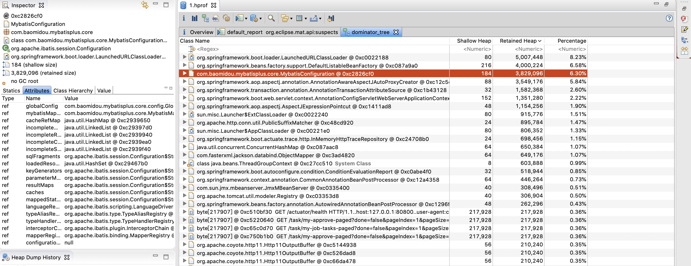

# 2021学习笔记

标签（空格分隔）： 学习

---

* [2021学习笔记](#2021学习笔记)
   * [如何设计一个RPC框架](#如何设计一个rpc框架)
   * [常见数据mock框架](#常见数据mock框架)
      * [Mockito](#mockito)
   * [常用监控系统](#常用监控系统)
   * [linux的inode](#linux的inode)
   * [xxl-job](#xxl-job)
      * [全异步化](#全异步化)
      * [通讯数据加密](#通讯数据加密)
      * [分片广播 &amp; 动态分片](#分片广播--动态分片)
      * [执行器灰度上线](#执行器灰度上线)
   * [jobs](#jobs)
   * [jvm问题定位](#jvm问题定位)
      * [内存持续升高](#内存持续升高)
      * [扩展知识](#扩展知识)
   * [序列化与反序列化](#序列化与反序列化)
   * [mongo的索引](#mongo的索引)
      * [单字段索引](#单字段索引)
      * [复合索引](#复合索引)
      * [多key索引](#多key索引)
   * [mysql运维-pt工具](#mysql运维-pt工具)
      * [pt-online-schema-change](#pt-online-schema-change)
   * [arthas使用](#arthas使用)
      * [watch命令](#watch命令)
   * [线程安全之合理删除锁](#线程安全之合理删除锁)
   * [docker的networking](#docker的networking)
      * [bridge networks](#bridge-networks)
      * [overlay networks](#overlay-networks)
      * [host networking](#host-networking)
      * [IPvlan networks](#ipvlan-networks)
      * [MACvlan networks](#macvlan-networks)

## 如何设计一个RPC框架

https://cloud.tencent.com/developer/article/1532039

https://zhuanlan.zhihu.com/p/62592174

一个完整的rpc框架设计图如下：


总共分为 3 层：

 - 服务层，Service，其中主要部分就是 **动态代理** ，主要用于将服务提供者的接口封装成远程服务调用。上层的服务接口用于 Spring之类的业务框架使用，也是 Spring 的 bean.
 - 过滤器层，服务调用职责链，提供多种调用切面供框架自身和使用者扩展，例如负载均衡，性能统计，服务调用完成通知，失败重试等。
 - RPC 层，这里就是 RPC 框架的核心部分，包括通信框架，序列化框架，还有用于屏蔽底层通信框架和序列化框架的抽象接口。


当前很多RPC框架都直接基于netty这一IO（NIO，参考[这里](https://github.com/AudiVehicle/learn/blob/master/2018%E5%AD%A6%E4%B9%A0%E7%AC%94%E8%AE%B0%EF%BC%88%E4%BA%8C%EF%BC%89.md#java%E4%B8%AD%E7%9A%84bionioaio)）通信框架，比如阿里巴巴的HSF、dubbo，Hadoop Avro，推荐使用Netty 作为底层通信框架。

## 常见数据mock框架
之所以需要mock数据框架，其实是为了方便单侧能够顺利进行下去，避免依赖方的服务或者网络波动造成单测不过。常见的mock数据框架有以下一些。
###  Mockito
https://www.toutiao.com/a6792424551180403208/

Mockito 是一种 Java Mock 框架，它可以模拟任何 Spring 管理的Bean、模拟方法的返回值、模拟抛出异常等等，同时也会记录调用这些模拟方法的参数、调用顺序，从而可以校验出这个 Mock 对象是否有被正确的顺序调用，以及按照期望的参数被调用。Mockito可以在单元测试中模拟一个 Service 返回的数据，而不会真正去调用该 Service，这就是上面提到的 Mock 测试精神，也就是通过模拟一个假的 Service 对象，来快速的测试当前我想要测试的类。需要指出的是，Mockito是springBoot内置的。


## 常用监控系统
https://www.toutiao.com/a6859620754003231243/

## linux的inode

https://geek-university.com/linux/inode/#:~:text=An%20inode%20is%20a%20data,%2C%20number%20of%20links%2C%20etc.&text=Some%20file%20systems%20(most%20notably,the%20file%20system%20is%20created.

An inode is a data structure that stores various information about a file in Linux, such as the access mode (read, write, execute permissions), ownership, file type, file size, group, number of links, etc. Each inode is identified by an integer number. An inode is assigned to a file when it is created.

Some file systems (most notably ext3) create all inodes when the file system is created. This means that it is possible to run out of storage because all of the inodes are used, although there is available space on the disk. Other file systems (like xfs) create inodes as needed.

You can view a file’s inode number using the ls -il command:


The first number on the left represents the inode number of the file.

总结来说，inode是一个整数，它包含了linux系统内文件的一些信息。且存在inode耗尽的风险「也就是系统产生了太多的文件，这种情况在使用xxl-job调度平台时可能出现，因为它的每一次调度都会生产一个log文件，可以提供设置日志保留天数进行控制」。


  
 
## xxl-job

https://www.xuxueli.com/xxl-job/#/?id=%E3%80%8A%E5%88%86%E5%B8%83%E5%BC%8F%E4%BB%BB%E5%8A%A1%E8%B0%83%E5%BA%A6%E5%B9%B3%E5%8F%B0xxl-job%E3%80%8B

使用`xxl-job`需要注意，每个任务的每次执行都会生产一个log文件，因此需要注意设置log文件的保存天数，避免耗尽机器的inode资源。

`xxl-job`在设计上，将调度器和执行器物理分开，实现解耦，并且有多个执行器时方便注册、移除。底层依赖mysql来实现数据一致性，集群任务调度等。

软件设计架构图如下：


 ### 全异步化
 
 xxl-job之所以性能较好，如上图所示使用了”异步调度队列“，且调度都是线程池异步执行，不会阻塞调度器。
 
 如若需要支撑更多的任务量，可以通过 “调大调度线程数” 、”降低调度中心与执行器ping延迟” 和 “提升机器配置” 几种方式优化。
 
 ### 通讯数据加密
 
调度中心向执行器发送的调度请求时使用RequestModel和ResponseModel两个对象封装调度请求参数和响应数据, 在进行通讯之前底层会将上述两个对象对象序列化，并进行数据协议以及时间戳检验,从而达到数据加密的功能。

### 分片广播 & 动态分片

其实也就是集群内的多个机器可以协调合作，xxl-job在调度时会附带分片参数，各个节点根据具体参数做相应协同处理。
```java
// 可参考Sample示例执行器中的示例任务"ShardingJobHandler"了解试用 
int shardIndex = XxlJobHelper.getShardIndex();
int shardTotal = XxlJobHelper.getShardTotal();
```
该特性适用场景如：

 1. 分片任务场景：10个执行器的集群来处理10w条数据，每台机器只需要处理1w条数据，耗时降低10倍；
 2. 广播任务场景：广播执行器机器运行shell脚本、广播集群节点进行缓存更新等

### 执行器灰度上线
调度中心与业务解耦，只需部署一次后常年不需要维护。但是，执行器中托管运行着业务作业，作业上线和变更需要重启执行器，尤其是Bean模式任务。
执行器重启可能会中断运行中的任务。但是，XXL-JOB得益于自建执行器与自建注册中心，可以通过灰度上线的方式，避免因重启导致的任务中断的问题。

步骤如下：

 1. 执行器改为手动注册，下线一半机器列表（A组），线上运行另一半机器列表（B组）；
 2. 等待A组机器任务运行结束并编译上线；执行器注册地址替换为A组；
 3. 等待B组机器任务运行结束并编译上线；执行器注册地址替换为A组+B组；

操作结束；
 
## jobs

https://github.com/baomidou/jobs

## jvm问题定位

### 内存持续升高

之前写过一篇类似的[笔记](https://github.com/AudiVehicle/learn/blob/master/2018%E5%AD%A6%E4%B9%A0%E7%AC%94%E8%AE%B0%E4%B8%80.md#jvm%E6%80%A7%E8%83%BD%E5%88%86%E6%9E%90)，只是当时工作经验尚浅，相关的场景都是自己虚构出来的，正好最近工作中碰到了一个jvm频繁GC的场景。这里记录一下，顺便扩展一些定位jvm问题的方法。

java启动参数配置如下：
```java
-Xmx500m -Xms500m -Xmn200m -XX:MetaspaceSize=200m -XX:+HeapDumpOnOutOfMemoryError -XX:HeapDumpPath=/app/dump -XX:+PrintGCDetails -XX:+PrintGCTimeStamps -XX:+PrintGCDateStamps -Xloggc:/app/gc.log
```

堆总共500MB，新老年代四六开。

出问题的服务运行在docker容器里，当时的gc.log显示在频繁gc，部分gc日志如下:
```java
2021-03-31T15:35:06.111+0800: 213.167: [GC (Allocation Failure) [PSYoungGen: 186496K->608K(195072K)] 354529K->169193K(502272K), 0.0066992 secs] [Times: user=0.02 sys=0.00, real=0.00 secs]
2021-03-31T15:35:06.199+0800: 213.255: [GC (Allocation Failure) [PSYoungGen: 140216K->480K(196096K)] 308802K->169617K(503296K), 0.0059172 secs] [Times: user=0.01 sys=0.00, real=0.00 secs]
2021-03-31T15:35:06.240+0800: 213.296: [GC (Allocation Failure) [PSYoungGen: 156575K->64K(196096K)] 325712K->245852K(503296K), 0.0194347 secs] [Times: user=0.07 sys=0.00, real=0.02 secs]
2021-03-31T15:35:06.260+0800: 213.315: [Full GC (Ergonomics) [PSYoungGen: 64K->0K(196096K)] [ParOldGen: 245788K->244257K(307200K)] 245852K->244257K(503296K), [Metaspace: 88483K->88483K(1130496K)], 0.4435924 secs] [Times: user=1.43 sys=0.00, real=0.44 secs]
2021-03-31T15:35:07.092+0800: 214.148: [Full GC (Ergonomics) [PSYoungGen: 187392K->91176K(196096K)] [ParOldGen: 244257K->244220K(307200K)] 431649K->335397K(503296K), [Metaspace: 88498K->88498K(1130496K)], 0.2772581 secs] [Times: user=0.82 sys=0.01, real=0.28 secs]
2021-03-31T15:35:07.562+0800: 214.617: [Full GC (Ergonomics) [PSYoungGen: 187392K->104710K(196096K)] [ParOldGen: 244220K->237493K(307200K)] 431612K->342203K(503296K), [Metaspace: 88505K->87984K(1130496K)], 0.5754444 secs] [Times: user=1.62 sys=0.01, real=0.57 secs]
2021-03-31T15:35:08.220+0800: 215.275: [GC (Allocation Failure) --[PSYoungGen: 187392K->187392K(196096K)] 424885K->448053K(503296K), 0.0725529 secs] [Times: user=0.18 sys=0.00, real=0.07 secs]
2021-03-31T15:35:08.292+0800: 215.348: [Full GC (Ergonomics) [PSYoungGen: 187392K->92179K(196096K)] [ParOldGen: 260661K->260445K(307200K)] 448053K->352625K(503296K), [Metaspace: 87988K->87988K(1130496K)], 0.4784765 secs] [Times: user=1.47 sys=0.02, real=0.48 secs]
2021-03-31T15:35:08.879+0800: 215.935: [Full GC (Ergonomics) [PSYoungGen: 187392K->108223K(196096K)] [ParOldGen: 260445K->260445K(307200K)] 447837K->368669K(503296K), [Metaspace: 87996K->87996K(1130496K)], 0.2886663 secs] [Times: user=0.81 sys=0.01, real=0.29 secs]
2021-03-31T15:35:09.243+0800: 216.299: [Full GC (Ergonomics) [PSYoungGen: 187392K->118197K(196096K)] [ParOldGen: 260445K->260445K(307200K)] 447837K->378643K(503296K), [Metaspace: 87999K->87999K(1130496K)], 0.2986136 secs] [Times: user=0.90 sys=0.00, real=0.30 secs]
2021-03-31T15:35:09.616+0800: 216.672: [Full GC (Ergonomics) [PSYoungGen: 187392K->126841K(196096K)] [ParOldGen: 260445K->260445K(307200K)] 447837K->387287K(503296K), [Metaspace: 88010K->88010K(1130496K)], 0.3403196 secs] [Times: user=0.99 sys=0.01, real=0.34 secs]
2021-03-31T15:35:10.015+0800: 217.071: [Full GC (Ergonomics) [PSYoungGen: 187392K->134800K(196096K)] [ParOldGen: 260445K->260445K(307200K)] 447837K->395245K(503296K), [Metaspace: 88020K->88020K(1130496K)], 0.3248060 secs] [Times: user=1.02 sys=0.00, real=0.33 secs]
2021-03-31T15:35:10.376+0800: 217.432: [Full GC (Ergonomics) [PSYoungGen: 187392K->148816K(196096K)] [ParOldGen: 260445K->260445K(307200K)] 447837K->409262K(503296K), [Metaspace: 88024K->88024K(1130496K)], 0.3309422 secs] [Times: user=1.03 sys=0.01, real=0.34 secs]
2021-03-31T15:35:10.747+0800: 217.803: [Full GC (Ergonomics) [PSYoungGen: 187392K->153632K(196096K)] [ParOldGen: 260445K->260445K(307200K)] 447837K->414077K(503296K), [Metaspace: 88031K->88031K(1130496K)], 0.3504541 secs] [Times: user=1.07 sys=0.00, real=0.34 secs]
2021-03-31T15:35:11.143+0800: 218.199: [Full GC (Ergonomics) [PSYoungGen: 187392K->157742K(196096K)] [ParOldGen: 260445K->260444K(307200K)] 447837K->418187K(503296K), [Metaspace: 88044K->88044K(1130496K)], 0.3811518 secs] [Times: user=1.22 sys=0.01, real=0.38 secs]
2021-03-31T15:35:11.566+0800: 218.621: [Full GC (Ergonomics) [PSYoungGen: 187392K->161488K(196096K)] [ParOldGen: 260446K->260444K(307200K)] 447838K->421933K(503296K), [Metaspace: 88044K->88044K(1130496K)], 0.3678264 secs] [Times: user=1.16 sys=0.00, real=0.37 secs]
2021-03-31T15:35:11.960+0800: 219.016: [Full GC (Ergonomics) [PSYoungGen: 187392K->164661K(196096K)] [ParOldGen: 260484K->260444K(307200K)] 447876K->425106K(503296K), [Metaspace: 88048K->88048K(1130496K)], 0.3735822 secs] [Times: user=1.09 sys=0.00, real=0.37 secs]
2021-03-31T15:35:12.368+0800: 219.423: [Full GC (Ergonomics) [PSYoungGen: 187392K->167482K(196096K)] [ParOldGen: 260446K->260443K(307200K)] 447838K->427925K(503296K), [Metaspace: 88056K->88056K(1130496K)], 0.4205702 secs] [Times: user=1.26 sys=0.06, real=0.42 secs]
2021-03-31T15:35:12.829+0800: 219.884: [Full GC (Ergonomics) [PSYoungGen: 187392K->170533K(196096K)] [ParOldGen: 260443K->260442K(307200K)] 447835K->430976K(503296K), [Metaspace: 88057K->88057K(1130496K)], 0.4452220 secs] [Times: user=1.23 sys=0.01, real=0.44 secs]
2021-03-31T15:35:13.291+0800: 220.347: [Full GC (Ergonomics) [PSYoungGen: 186420K->50140K(196096K)] [ParOldGen: 260442K->306599K(307200K)] 446863K->356740K(503296K), [Metaspace: 88060K->88060K(1130496K)], 0.4181651 secs] [Times: user=1.23 sys=0.04, real=0.42 secs]
2021-03-31T15:35:14.320+0800: 221.376: [Full GC (Ergonomics) [PSYoungGen: 187392K->0K(196096K)] [ParOldGen: 306599K->216046K(307200K)] 493991K->216046K(503296K), [Metaspace: 88188K->88188K(1130496K)], 0.5243270 secs] [Times: user=1.42 sys=0.02, real=0.52 secs]
2021-03-31T15:35:15.542+0800: 222.597: [GC (Allocation Failure) [PSYoungGen: 186561K->8169K(173056K)] 402607K->251009K(480256K), 0.0469452 secs] [Times: user=0.17 sys=0.00, real=0.05 secs]
2021-03-31T15:35:15.589+0800: 222.644: [Full GC (Ergonomics) [PSYoungGen: 8169K->0K(173056K)] [ParOldGen: 242840K->234702K(307200K)] 251009K->234702K(480256K), [Metaspace: 88297K->88297K(1132544K)], 0.5457457 secs] [Times: user=1.47 sys=0.02, real=0.54 secs]
2021-03-31T15:35:16.528+0800: 223.584: [GC (Allocation Failure) [PSYoungGen: 164864K->19964K(184832K)] 399566K->257819K(492032K), 0.0763537 secs] [Times: user=0.28 sys=0.00, real=0.07 secs]
2021-03-31T15:35:16.880+0800: 223.935: [GC (Allocation Failure) [PSYoungGen: 184828K->19949K(148992K)] 422683K->284113K(456192K), 0.0941438 secs] [Times: user=0.34 sys=0.00, real=0.09 secs]
2021-03-31T15:35:16.974+0800: 224.030: [Full GC (Ergonomics) [PSYoungGen: 19949K->0K(148992K)] [ParOldGen: 264164K->281356K(307200K)] 284113K->281356K(456192K), [Metaspace: 88363K->88363K(1132544K)], 0.6657784 secs] [Times: user=1.93 sys=0.01, real=0.67 secs]
2021-03-31T15:35:17.883+0800: 224.939: [Full GC (Ergonomics) [PSYoungGen: 120597K->0K(148992K)] [ParOldGen: 281356K->291678K(307200K)] 401953K->291678K(456192K), [Metaspace: 88384K->88384K(1132544K)], 0.4932868 secs] [Times: user=1.38 sys=0.01, real=0.49 secs]
2021-03-31T15:35:18.597+0800: 225.653: [Full GC (Ergonomics) [PSYoungGen: 124605K->0K(148992K)] [ParOldGen: 305430K->128701K(307200K)] 430036K->128701K(456192K), [Metaspace: 88434K->88434K(1132544K)], 0.2604503 secs] [Times: user=0.56 sys=0.01, real=0.26 secs]
2021-03-31T15:35:19.085+0800: 226.141: [Full GC (Ergonomics) [PSYoungGen: 128308K->0K(148992K)] [ParOldGen: 293752K->88718K(307200K)] 422060K->88718K(456192K), [Metaspace: 88710K->88710K(1132544K)], 0.1838160 secs] [Times: user=0.50 sys=0.01, real=0.19 secs]
2021-03-31T15:35:19.311+0800: 226.367: [GC (Allocation Failure) [PSYoungGen: 101857K->27668K(157184K)] 190576K->157659K(464384K), 0.0105178 secs] [Times: user=0.03 sys=0.00, real=0.01 secs]
2021-03-31T15:35:19.356+0800: 226.411: [GC (Allocation Failure) [PSYoungGen: 140254K->27636K(158208K)] 270244K->212709K(465408K), 0.0174558 secs] [Times: user=0.05 sys=0.00, real=0.02 secs]
2021-03-31T15:35:19.425+0800: 226.480: [GC (Allocation Failure) [PSYoungGen: 140589K->27636K(144384K)] 325663K->240251K(451584K), 0.0175352 secs] [Times: user=0.06 sys=0.00, real=0.02 secs]
2021-03-31T15:35:19.673+0800: 226.729: [GC (Allocation Failure) [PSYoungGen: 127080K->41486K(145408K)] 339695K->254101K(452608K), 0.0556269 secs] [Times: user=0.06 sys=0.01, real=0.06 secs]
2021-03-31T15:35:19.808+0800: 226.864: [GC (Allocation Failure) [PSYoungGen: 140691K->41454K(140800K)] 353306K->254069K(448000K), 0.0088234 secs] [Times: user=0.03 sys=0.00, real=0.00 secs]
2021-03-31T15:35:19.846+0800: 226.902: [GC (Allocation Failure) [PSYoungGen: 113769K->55210K(128512K)] 326383K->281580K(435712K), 0.0141156 secs] [Times: user=0.04 sys=0.00, real=0.02 secs]
2021-03-31T15:35:19.906+0800: 226.962: [GC (Allocation Failure) [PSYoungGen: 125866K->34688K(137728K)] 352236K->261058K(444928K), 0.0160418 secs] [Times: user=0.04 sys=0.00, real=0.01 secs]
2021-03-31T15:35:21.843+0800: 228.898: [GC (Allocation Failure) [PSYoungGen: 105344K->41582K(135680K)] 331714K->267960K(442880K), 0.0113325 secs] [Times: user=0.03 sys=0.00, real=0.01 secs]
2021-03-31T15:35:32.786+0800: 239.842: [GC (Allocation Failure) [PSYoungGen: 110190K->14186K(136704K)] 336568K->268160K(443904K), 0.0126607 secs] [Times: user=0.03 sys=0.00, real=0.01 secs]
2021-03-31T15:35:32.799+0800: 239.855: [Full GC (Ergonomics) [PSYoungGen: 14186K->0K(136704K)] [ParOldGen: 253973K->75251K(307200K)] 268160K->75251K(443904K), [Metaspace: 89490K->89490K(1132544K)], 0.1554257 secs] [Times: user=0.39 sys=0.01, real=0.15 secs]
2021-03-31T15:35:44.854+0800: 251.910: [GC (Allocation Failure) [PSYoungGen: 68608K->272K(137728K)] 143859K->75531K(444928K), 0.0051200 secs] [Times: user=0.01 sys=0.01, real=0.01 secs]
2021-03-31T15:37:07.633+0800: 334.689: [GC (Allocation Failure) [PSYoungGen: 70928K->480K(137728K)] 146187K->75747K(444928K), 0.0058751 secs] [Times: user=0.01 sys=0.00, real=0.01 secs]
2021-03-31T15:40:01.325+0800: 508.380: [GC (Allocation Failure) [PSYoungGen: 71136K->7929K(140800K)] 146403K->83204K(448000K), 0.0112032 secs] [Times: user=0.02 sys=0.00, real=0.01 secs]
```
从日志可以看出youngGC特别频繁，大概50ms就有一次。Full GC也非常频繁，并且通过日志可以发现FGC其实并没有能够成功的释放空间。

出现这种情况，要么出现了死循环往容器add元素，要么就是某些操作很频繁且很耗时。此时，进入docker容器，准备dump一份堆文件。

登录到目标服务器，`docker ps`定位到具体容器`id`，`docker exec`进入容器。`jps`查看java进程`id`。

难道进程id，直接：
```java
jmap -dump:format=b,file=1.hprof 11459
```

然后怎么把1.dump这个文件拿到本机来分析？

`docker ps`找到docker的`CONTAINER ID`，然后`docker inspect xxx`，即可查看容器的详细信息，定位到`overlay`关键字，即可找到docker容器对应在宿主机上的位置，如下图所示：


然后cd到响应目录，比如我这里是`/var/lib/docker/overlay2/37bd7e283b0c52bb675d84e380353da9b2370cc9e4a53f4db8df1c4f4eda3097/merged`，至于如何将宿主机的dump文件拿到本地，可以使用python命令直接在当前目录启动一个web容器，也可以通过file-ladder等工具，都行。

文件拿到本地以后，使用mat工具打开，详细过程可以参考[这里](https://github.com/AudiVehicle/learn/blob/master/2018%E5%AD%A6%E4%B9%A0%E7%AC%94%E8%AE%B0%E4%B8%80.md#jvm%E5%86%85%E5%AD%98%E6%B3%84%E6%BC%8F%E6%A3%80%E6%B5%8Bcpu%E4%BD%BF%E7%94%A8%E6%AD%A3%E5%B8%B8%E4%BD%86%E6%98%AF%E5%86%85%E5%AD%98%E5%8D%A0%E7%94%A8%E6%8C%81%E7%BB%AD%E5%A2%9E%E9%AB%98)。

如下图所示：


第一二项是jdk及spring的应该不是问题所在，结合elk的业务日志，发现gc的同时，数据库相关的业务日志输出的特别多，达到了1min上千条的量，并且有同事提醒这个系统有一个5min的定时自动提交的任务，基本可以定位是数据库相关操作耗费了大部分的内存。

本地debug发现，该定时任务在执行过程中有可能会因为数据问题抛出异常，但是却没有加相关事务来进行db回滚操作，导致代码后面每次进入定时task的时候每次都会往db插入数据，且量比较大，导致相关定时task耗时越来越久久，且由于出问题的环境本身就存在部分脏数据导致sql执行的情况更糟。

解决办法：

1、在相关定时task增加事务注解；
2、关闭mysql-plus的sql日志打印
3、删除脏数据

问题得到解决。

### 扩展知识

https://bbs.huaweicloud.com/blogs/119727

```java
jmap -histo 1 |more 
```
输出信息类如下：
```java
root@e088f8a23ccc:/# jmap -histo 1 |more

 num     #instances         #bytes  class name
----------------------------------------------
   1:        180912       19625624  [C
   2:         29892       10604256  [I
   3:         65973        5805624  java.lang.reflect.Method
   4:        145566        4658112  java.util.concurrent.ConcurrentHashMap$Node
   5:        173617        4166808  java.lang.String
   6:         13803        3002112  [B
   7:           802        2648448  [J
   8:         61053        2442120  java.util.LinkedHashMap$Entry
   9:         43249        2381464  [Ljava.lang.Object;
  10:         20054        2206360  java.lang.Class
  11:         23638        2159504  [Ljava.util.HashMap$Node;
  12:           960        2003728  [Ljava.util.concurrent.ConcurrentHashMap$Node;
  13:         61462        1966784  java.util.HashMap$Node
  14:         31912        1531776  org.aspectj.weaver.reflect.ShadowMatchImpl
  15:         26907        1506792  java.util.LinkedHashMap
  16:         49010        1066416  [Ljava.lang.Class;
  17:         31912        1021184  org.aspectj.weaver.patterns.ExposedState
```
jmap -histo显示的对象含义：
```java
[C 代表  char[]
[S 代表 short[]
[I 代表 int[]
[B 代表 byte[]
[[I 代表 int[][]
```

## 序列化与反序列化

https://tech.meituan.com/2015/02/26/serialization-vs-deserialization.html

## mongo的索引

https://mongoing.com/archives/2797

类似于mysql，mongo也可以通过创建索引从而加快查询的速度。MongoDB支持多种类型的索引，包括单字段索引、复合索引、多key索引、文本索引等，每种类型的索引有不同的使用场合。

### 单字段索引

这个没什么好说的，就是针对特定某个字段创建索引。MongoDB默认创建的id索引也是这种类型。

### 复合索引

复合索引，个人感觉这个其实是和mysql的复合索引很类似的，之所以这么说，除了它也是几个字段合起来代表一个索引外，mongo的复合索引也具有最左匹配的特性。

```shell
db.getCollection('recordDetail').createIndex( {playerId: 1, objectMockId: 1, configMockId: 1, gameId:1 }) 
```
以上语句创建了一个复合索引，1表示升序，-1表示降序。

```shell
db.getCollection('recordDetail').getIndexes()
```
通过上面语句可以查询mongo已有的index，结果如下：
```shell
/* 1 */
[
    {
        "v" : 2,
        "key" : {
            "_id" : 1
        },
        "name" : "_id_",
        "ns" : "elf.recordDetail"
    },
    {
        "v" : 2,
        "key" : {
            "playerId" : 1.0,
            "objectMockId" : 1.0,
            "configMockId" : 1.0,
            "gameId" : 1.0
        },
        "name" : "playerId_1_objectMockId_1_configMockId_1_gameId_1",
        "ns" : "elf.recordDetail"
    }
]
```

在未创建索引的情况下，执行下面的查询语句，explain结果如下：
```shell
/* 1 */
{
    "queryPlanner" : {
        "plannerVersion" : 1,
        "namespace" : "elf.recordDetail",
        "indexFilterSet" : false,
        "parsedQuery" : {
            "$and" : [ 
                {
                    "configMockId" : {
                        "$eq" : 4.0
                    }
                }, 
                {
                    "gameId" : {
                        "$eq" : "1038"
                    }
                }, 
                {
                    "objectMockId" : {
                        "$eq" : "8f542b17061c43bdbd8ff6bfae9fe682"
                    }
                }, 
                {
                    "playerId" : {
                        "$eq" : "461681"
                    }
                }
            ]
        },
        "queryHash" : "59EC97F5",
        "planCacheKey" : "59EC97F5",
        "winningPlan" : {
            "stage" : "COLLSCAN",
            "filter" : {
                "$and" : [ 
                    {
                        "configMockId" : {
                            "$eq" : 4.0
                        }
                    }, 
                    {
                        "gameId" : {
                            "$eq" : "1038"
                        }
                    }, 
                    {
                        "objectMockId" : {
                            "$eq" : "8f542b17061c43bdbd8ff6bfae9fe682"
                        }
                    }, 
                    {
                        "playerId" : {
                            "$eq" : "461681"
                        }
                    }
                ]
            },
            "direction" : "forward"
        },
        "rejectedPlans" : []
    },
    "serverInfo" : {
        "host" : "bd7ed6d76ccb",
        "port" : 27017,
        "version" : "4.2.9",
        "gitVersion" : "06402114114ffc5146fd4b55402c96f1dc9ec4b5"
    },
    "ok" : 1.0,
    "$clusterTime" : {
        "clusterTime" : Timestamp(1619778017, 1),
        "signature" : {
            "hash" : { "$binary" : "AAAAAAAAAAAAAAAAAAAAAAAAAAA=", "$type" : "00" },
            "keyId" : NumberLong(0)
        }
    },
    "operationTime" : Timestamp(1619778017, 1)
}
```

https://mongoing.com/eshu_explain3

`COLLSCAN`代表查询的过程是全表扫描，在创建索引以后就会变成下面这种结果：
```shell
/* 1 */
{
    "queryPlanner" : {
        "plannerVersion" : 1,
        "namespace" : "elf.recordDetail",
        "indexFilterSet" : false,
        "parsedQuery" : {
            "$and" : [ 
                {
                    "configMockId" : {
                        "$eq" : 4.0
                    }
                }, 
                {
                    "gameId" : {
                        "$eq" : "1038"
                    }
                }, 
                {
                    "objectMockId" : {
                        "$eq" : "8f542b17061c43bdbd8ff6bfae9fe682"
                    }
                }, 
                {
                    "playerId" : {
                        "$eq" : "461681"
                    }
                }
            ]
        },
        "queryHash" : "59EC97F5",
        "planCacheKey" : "5877D7BE",
        "winningPlan" : {
            "stage" : "FETCH",
            "inputStage" : {
                "stage" : "IXSCAN",
                "keyPattern" : {
                    "playerId" : 1.0,
                    "objectMockId" : 1.0,
                    "configMockId" : 1.0,
                    "gameId" : 1.0
                },
                "indexName" : "playerId_1_objectMockId_1_configMockId_1_gameId_1",
                "isMultiKey" : false,
                "multiKeyPaths" : {
                    "playerId" : [],
                    "objectMockId" : [],
                    "configMockId" : [],
                    "gameId" : []
                },
                "isUnique" : false,
                "isSparse" : false,
                "isPartial" : false,
                "indexVersion" : 2,
                "direction" : "forward",
                "indexBounds" : {
                    "playerId" : [ 
                        "[\"461681\", \"461681\"]"
                    ],
                    "objectMockId" : [ 
                        "[\"8f542b17061c43bdbd8ff6bfae9fe682\", \"8f542b17061c43bdbd8ff6bfae9fe682\"]"
                    ],
                    "configMockId" : [ 
                        "[4.0, 4.0]"
                    ],
                    "gameId" : [ 
                        "[\"1038\", \"1038\"]"
                    ]
                }
            }
        },
        "rejectedPlans" : []
    },
    "serverInfo" : {
        "host" : "bd7ed6d76ccb",
        "port" : 27017,
        "version" : "4.2.9",
        "gitVersion" : "06402114114ffc5146fd4b55402c96f1dc9ec4b5"
    },
    "ok" : 1.0,
    "$clusterTime" : {
        "clusterTime" : Timestamp(1619778209, 1),
        "signature" : {
            "hash" : { "$binary" : "AAAAAAAAAAAAAAAAAAAAAAAAAAA=", "$type" : "00" },
            "keyId" : NumberLong(0)
        }
    },
    "operationTime" : Timestamp(1619778209, 1)
}
```
可以看到，查询过程以及走了索引


### 多key索引

其实就是需要创建索引的字段不是简单类型，是一个数组。此时针对这个字段的索引就是多key索引。

## mysql运维-pt工具

https://www.cnblogs.com/keme/p/10237590.html

https://www.percona.com/doc/percona-toolkit/LATEST/index.html

Percona Toolkit简称pt工具—PT-Tools，是Percona公司开发用于管理MySQL的工具，功能包括检查主从复制的数据一致性、检查重复索引、定位IO占用高的表文件、在线DDL等。从[官网](https://www.percona.com/downloads/percona-toolkit/LATEST/)来看，目前仅可运行在centos、ubuntu、debian等linux发行版系统上。

### pt-online-schema-change

在线DDL操作，对上亿的大表加索引加字段且对生产无影响 

主要工作原理： 

 1. 创建一个和要执行 alter 操作的表一样的新的空表结构(是alter之前的结构)
 2. 在新表执行alter table 语句（速度应该很快）
 2. 在原表中创建触发器3个触发器分别对应insert,update,delete操作
 4. 以一定块大小从原表拷贝数据到临时表，拷贝过程中通过原表上的触发器在原表进行的写操作都会更新到新建的临时表 
 5. Rename 原表到old表中，在把临时表Rename为原表 
 6. 如果有参考该表的外键，根据alter-foreign-keys-method参数的值，检测外键相关的表，做相应设置的处理
 7. 默认最后将旧原表删除 

**如果执行失败了，或手动停止了，需要手动删除下划线开头的表(_表名)及三个触发器**

pt-query-digst可以分析慢查询日志；

pt-kill杀掉指定的进程；

pt-table-checksum & pt-table-sync—–检查主从是否一致性—–检查主从不一致之后用这个工具进行处理，这两个工具一般搭配使用


## arthas使用

https://arthas.aliyun.com/doc/watch.html#id1

安装相对简单，就是下载arthas的jar文件，然后直接java -jar启动即可，如下所示：
```shell
curl -O https://arthas.aliyun.com/arthas-boot.jar
java -jar arthas-boot.jar
```
### watch命令

我比较常用的命令是`watch`，可以监控某个类的某个方法的出入参数，如下所示：
```shell
watch com.xxx.web.invoice.workflow.api.controller.EserController executeUrl "{params,returnObj}" -x 2
Press Q or Ctrl+C to abort.
Affect(class count: 1 , method count: 1) cost in 66 ms, listenerId: 2
method=com.xx.web.xx.workflow.api.controller.EsignUserController.executeUrl location=AtExit
ts=2021-05-10 19:24:54; [cost=630.683337ms] result=@ArrayList[
    @Object[][
        @String[6ff39bf5eccb4axxx934fcd73fbe89971],
        @String[44933b24aexxdfa15861bbc12f3c55],
    ],
    @GenericResult[
        data=@EsignExecuteUrl[EsignExecuteUrl(url=https://h5.esign.cn/guide?context=&flo&organ=false&a=1&bizType=1&tsign_source_type=SIGN_LINK_XUANYUAN&tsign_source_detail=1vGqUyZBm8k4aIosrZzTBwTRKUeb7lQUr1HcPKPPBFcV2i%2FZ%%2F7B9OPeWAANgPN8NtdSfwIssOatVm69waVk8e6uKwP2nXQaaa0JJl5txnoIVI4%2Bvn%2ByRiEdX%2Fu7xcegQ3DlwOkAjGRN4fV3oUUHdt5n2vPuiHCucto07m8JZQVfarGlfSKSm%2FzfzVLcMq%2FMKdzsOtFxc2WVCKnFyg19cEsNY4uXZQTww5RPDq50Qu, shortUrl=https://t.xxx.cn/9LYafUFSIvym)],
        success=@Boolean[true],
        code=null,
        message=null,
    ],
]
```

`@Object`就是入参信息，`@GenericResult`是出参信息。

其帮助信息也很丰富：
```shell
[arthas@5754]$ watch -h
 USAGE:
   watch [-b] [-e] [--exclude-class-pattern <value>] [-x <value>] [-f] [-h] [-n <value>] [--listenerId <value>] [-E] [-M <value>] [-s] [-v] class-pattern method-pattern [express] [condition-express]

 SUMMARY:
   Display the input/output parameter, return object, and thrown exception of specified method invocation
   The express may be one of the following expression (evaluated dynamically):
           target : the object
            clazz : the object's class
           method : the constructor or method
           params : the parameters array of method
     params[0..n] : the element of parameters array
        returnObj : the returned object of method
         throwExp : the throw exception of method
         isReturn : the method ended by return
          isThrow : the method ended by throwing exception
            #cost : the execution time in ms of method invocation
 Examples:
   watch -b org.apache.commons.lang.StringUtils isBlank params
   watch -f org.apache.commons.lang.StringUtils isBlank returnObj
   watch org.apache.commons.lang.StringUtils isBlank '{params, target, returnObj}' -x 2
   watch -bf *StringUtils isBlank params
   watch *StringUtils isBlank params[0]
   watch *StringUtils isBlank params[0] params[0].length==1
   watch *StringUtils isBlank params '#cost>100'
   watch -E -b org\.apache\.commons\.lang\.StringUtils isBlank params[0]
   watch javax.servlet.Filter * --exclude-class-pattern com.demo.TestFilter

 WIKI:
   https://arthas.aliyun.com/doc/watch

 OPTIONS:
 -b, --before                                                        Watch before invocation
 -e, --exception                                                     Watch after throw exception
     --exclude-class-pattern <value>                                 exclude class name pattern, use either '.' or '/' as separator
 -x, --expand <value>                                                Expand level of object (1 by default)
 -f, --finish                                                        Watch after invocation, enable by default
 -h, --help                                                          this help
 -n, --limits <value>                                                Threshold of execution times
     --listenerId <value>                                            The special listenerId
 -E, --regex                                                         Enable regular expression to match (wildcard matching by default)
 -M, --sizeLimit <value>                                             Upper size limit in bytes for the result (10 * 1024 * 1024 by default)
 -s, --success                                                       Watch after successful invocation
 -v, --verbose                                                       Enables print verbose information, default value false.
 <class-pattern>                                                     The full qualified class name you want to watch
 <method-pattern>                                                    The method name you want to watch
 <express>                                                           the content you want to watch, written by ognl.
                                                                     Examples:
                                                                       params
                                                                       params[0]
                                                                       'params[0]+params[1]'
                                                                       '{params[0], target, returnObj}'
                                                                       returnObj
                                                                       throwExp
                                                                       target
                                                                       clazz
                                                                       method

 <condition-express>                                                 Conditional expression in ognl style, for example:
                                                                       TRUE  : 1==1
                                                                       TRUE  : true
                                                                       FALSE : false
                                                                       TRUE  : 'params.length>=0'
                                                                       FALSE : 1==2
```

可以使用如下命令查看查看当前对象中的属性值：
```shell
watch com.xx.web.invoice.workflow.api.controller.EUsxxxxController executeUrl "target"  -x 2
```
以及可以指定想查看target下指定参数的值：

```shell
watch com.xx.web.invoice.workflow.api.controller.EUsxxxxController executeUrl "target.field_name"
```


## 线程安全之合理删除锁

一般来说，如果要加分布式锁，我们大都会借助redis实现。使用`setnx`命令进行设置。一般来说我们使用其进行加锁的伪代码如下：
```java
if setnx key value 10sec
try{
    // logic code
}finally{
    del key
}
```
这里需要注意，锁的释放可以通过程序在`finally`语句中调用`del`实现，或者`超时时间`到自动释放。

这里就会有一个潜在的问题：假如我们的`logic code`因为某些原因执行的比较慢，导致锁自动释放了，此时第二个线程进来就能够加锁成功。然后第一个线程在执行其`finally`语句块时会删除第二个线程加的锁，如下图所示。如此一来，就出现了线程安全的问题。


要解决这个问题，其实也很简单。就是每个线程加锁、解锁都只能针对自己的锁进行操作，加锁时可以通过设置一个特定的`value`，解锁时取出redis的这个`value`，如果没取到或者`value`不等就不再进行解锁操作。

## docker的networking

- https://docs.docker.com/network/
- https://www.cnblogs.com/mrhelloworld/p/docker11.html

### bridge networks

- https://docs.docker.com/network/bridge/

这是docker默认的网络模式，多个容器之间互相独立，即便是同一台宿主机的多个容器在容器内使用相同的端口也互不影响，如下图所示：


### overlay networks

- https://docs.docker.com/network/overlay/

`overlay`网络是一种可以实现跨宿主机之间的容器通信的网络，由于涉及到跨服务器之间通信，创建overlay网络之前需要服务器满足如下要求：

Firewall rules for Docker daemons using overlay networks

You need the following ports open to traffic to and from each Docker host participating on an overlay network:

- TCP port 2377 for cluster management communications
- TCP and UDP port 7946 for communication among nodes
- UDP port 4789 for overlay network traffic

Before you can create an overlay network, you need to either initialize your Docker daemon as a swarm manager using `docker swarm init` or join it to an existing swarm using `docker swarm join`. Either of these creates the default ingress overlay network which is used by swarm services by default. You need to do this even if you never plan to use swarm services. Afterward, you can create additional user-defined overlay networks.

当你创建或者假如一个swarm集群以后，默认会在宿主机上创建`ingress`和`docker_gwbridge`。前者负责swarm服务之间的网络请求调度，后者负责连接不同的docker宿主机之间的网络。

### host networking

- https://docs.docker.com/network/host/

`host`网络模式下，docker容器直接使用宿主机的网络和端口，不存在`port mapping`的过程，因此设置端口的相关参数都将不可用
```shell
Note: Given that the container does not have its own IP-address when using host mode networking, port-mapping does not take effect, and the -p, --publish, -P, and --publish-all option are ignored, producing a warning instead:

WARNING: Published ports are discarded when using host network mode
```

需要`host`网络模式只在`linux`上才有效，其他的mac、win都无效。

```shell
The host networking driver only works on Linux hosts, and is not supported on Docker Desktop for Mac, Docker Desktop for Windows, or Docker EE for Windows Server.
```

### IPvlan networks

- https://www.cnblogs.com/menkeyi/p/11374023.html
- https://docs.docker.com/network/ipvlan/

`IPvlan`个人理解，简单来说就是从一个主机接口虚拟出多个虚拟网络接口，即不同的容器可以拥有不同的ip地址，但是mac地址还是一样的，都是宿主机的mac地址。

要支持这个特性需要linux kernel v4.2+，之前的版本会有bug。

使用容下命令即可启动一个支持`ipvlan`的网络：
```shell
docker network  create -d ipvlan \
    --subnet=192.168.1.0/24 \ 
    --gateway=192.168.1.1 \
    -o ipvlan_mode=l2 \
    -o parent=eth0 db_net
```

### MACvlan networks

- https://www.cnblogs.com/menkeyi/p/11374023.html
- https://docs.docker.com/network/macvlan/

`MACvlan`相比于`IPvlan`，对于网络的隔离更为彻底，容器不但可以拥有自己的IP地址，还有自己的mac地址。

使用如下命令即可启动一个支持`MACvlan`的网络：

```shell
docker network create -d macvlan \
  --subnet=172.16.86.0/24 \
  --gateway=172.16.86.1 \
  -o parent=eth0 pub_net
```