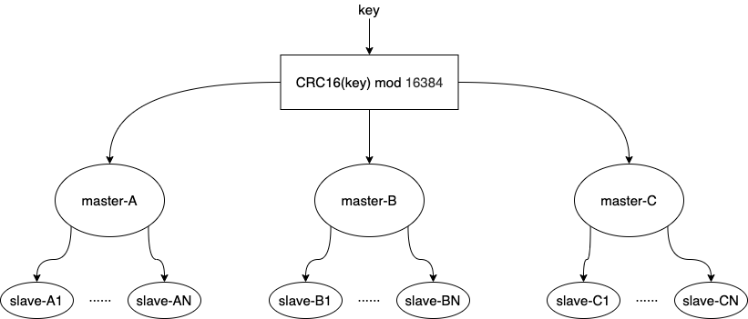

# redis学习

标签（空格分隔）： redis 数据结构

---

* [redis学习](#redis学习)
   * [redis数据结构](#redis数据结构)
      * [参考链接](#参考链接)
      * [redisObject](#redisobject)
      * [string](#string)
      * [list](#list)
      * [hash](#hash)
      * [set](#set)
      * [zset](#zset)
   * [redis为何快](#redis为何快)
      * [多路IO复用模型](#多路io复用模型)
   * [使用shell和pipline构造海量redis数据](#使用shell和pipline构造海量redis数据)
   * [redis的pipline](#redis的pipline)
   * [海量key的查询](#海量key的查询)
   * [使用redis构建分布式锁](#使用redis构建分布式锁)
   * [使用redis构建异步队列](#使用redis构建异步队列)
   * [redis的持久化以及实战](#redis的持久化以及实战)
   * [gossip流言协议](#gossip流言协议)
   * [redis主从搭建](#redis主从搭建)
   * [redis集群原理](#redis集群原理)
      * [什么是CRC16](#什么是crc16)
      * [为什么是16384](#为什么是16384)
   * [redis集群搭建](#redis集群搭建)


## redis数据结构

### 参考链接

 - https://www.toutiao.com/i6731690432675185165/
 - https://www.cnblogs.com/hunternet/p/11248192.html

### redisObject
理论上来说，所有redis存储的value都是一个redisObject，它的结构如下：
```c++
typedef struct redisObject {
 unsigned [type] 4;
 unsigned [encoding] 4;
 unsigned [lru] REDIS_LRU_BITS;
 int refcount;
 void *ptr;
} robj;
```
简单介绍一下这几个字段：

 - type：数据类型，就是我们熟悉的string、hash、list等。
 - encoding：内部编码，其实就是本文要介绍的数据结构。指的是当前这个value底层是用的什么数据结构。因为同一个数据类型底层也有多种数据结构的实现，所以这里需要指定数据结构。
 - REDIS_LRU_BITS：当前对象可以保留的时长。这个我们在后面讲键的过期策略的时候讲。
 - refcount：对象引用计数，用于GC。
 - ptr：指针，指向以encoding的方式实现这个对象的实际地址。

![此处输入图片的描述][1]

### string
在Redis内部，string类型有两种底层储存结构。Redis会根据存储的数据及用户的操作指令自动选择合适的结构：

 - int：存放整数类型；
 - SDS(简单动态字符串 simple dynamic string)：存放浮点、字符串、字节类型；

SDS的内部数据结构：
```c++
typedef struct sdshdr {
 // buf中已经占用的字符长度
 unsigned int len;
 // buf中剩余可用的字符长度
 unsigned int free;
 // 数据空间
 char buf[];
}
```
可见，其底层是一个char数组。buf最大容量为512M，里面可以放字符串、浮点数和字节。它为什么没有直接使用数组，而是包装成了这样的数据结构呢？

因为buf会有动态扩容和缩容的需求。如果直接使用数组，那每次对字符串的修改都会导致重新分配内存，效率很低。

buf的扩容过程如下：

 - 如果修改后len长度将小于1M,这时分配给free的大小和len一样,例如修改过后为10字节,
   那么给free也是10字节，buf实际长度变成了10 + 10 + 1 = 21byte (下图展示的就是该种情况)
 - 如果修改后len长度将大于等于1M,这时分配给free的长度为1M,例如修改过后为30M,那么给free是1M.buf实际长度变成了30M + 1M + 1byte

![此处输入图片的描述][2]
 
 需要指出的是，与扩容相反，当缩容时，并不会进行真正的缩容，「惰性空间释放指的是当字符串缩短时，并没有真正的缩容，而是移动free的指针。这样将来字符串长度增加时，就不用重新分配内存了。但这样会造成内存浪费，Redis提供了API来真正释放内存。」
 
 

### list
list底层有两种数据结构：链表linkedlist和压缩列表ziplist。当list元素个数少且元素内容长度不大时，使用ziplist实现，否则使用linkedlist。

 - 链表

Redis使用的链表是双向链表。为了方便操作，使用了一个list结构来持有这个链表。如图所示：
![此处输入图片的描述][3]
其数据结构如下所示：
```c++
typedef struct list{
 //表头节点
 listNode *head;
 //表尾节点
 listNode *tail;
 //链表所包含的节点数量
 unsigned long len;
 //节点值复制函数
 void *(*dup)(void *ptr);
 //节点值释放函数
 void *(*free)(void *ptr);
 //节点值对比函数
 int (*match)(void *ptr,void *key);
}list;
```

 - 压缩列表

与上面的链表相对应，压缩列表有点儿类似数组，通过一片连续的内存空间，来存储数据。不过，它跟数组不同的一点是，它允许存储的数据大小不同。每个节点上增加一个length属性来记录这个节点的长度，这样比较方便地得到下一个节点的位置。
![此处输入图片的描述][4]

上图的各字段含义为：

 - zlbytes：列表的总长度
 - zltail：指向最末元素
 - zllen：元素的个数
 - entry：元素的内容，里面记录了前一个Entry的长度，用于方便双向遍历
 - zlend：恒为0xFF，作为ziplist的定界符

 压缩列表不只是list的底层实现，也是hash的底层实现之一。当hash的元素个数少且内容长度不大时，使用压缩列表来实现。
 
 

### hash
hash底层有两种实现：压缩列表和字典（dict）。压缩列表刚刚上面已经介绍过了，下面主要介绍一下字典的数据结构。

 - 字典

字典其实就类似于Java语言中的Map,Python语言中的dict。与Java中的HashMap类似，Redis底层也是使用的散列表作为字典的实现，解决hash冲突使用的是链表法(其实，就是jdk8之前版本里的hashmap)。Redis同样使用了一个数据结构来持有这个散列表：

![此处输入图片的描述][5]

在键增加或减少时，会扩容或缩容，并且进行rehash，根据hash值重新计算索引值。那如果这个字典**太大**了怎么办呢？

为了解决一次性扩容耗时过多的情况，可以将扩容操作穿插在插入操作的过程中，分批完成。当负载因子触达阈值之后，只申请新空间，但并不将老的数据搬移到新散列表中。当有新数据要插入时，将新数据插入新散列表中，并且从老的散列表中拿出一个数据放入到新散列表。每次插入一个数据到散列表，都重复上面的过程。经过多次插入操作之后，老的散列表中的数据就一点一点全部搬移到新散列表中了。这样没有了集中的一次一次性数据搬移，插入操作就都变得很快了。这个过程也被称为**渐进式rehash**。

### set
set里面没有重复的集合。set的实现比较简单。如果是整数类型，就直接使用整数集合intset（应该是类似于数组，然后数组内的元素有序存储的）。使用二分查找来辅助，速度还是挺快的。不过在插入的时候，由于要移动元素，时间复杂度是O(N)。

如果不是整数类型，就使用上面在hash那一节介绍的字典。key为set的值，value为空（这一点和java里的hashset的实现机制是一样的）。

### zset
zset是可排序的set。实现方式有ziplist或skiplist。在同时满足以下两个条件的时候使用ziplist，其他时候使用skiplist，两个条件如下：

 - 有序集合保存的元素数量小于128个
 - 有序集合保存的所有元素的长度小于64字节

在ziplist内部，是按照score排序递增来存储的。意味着每次插入数据都要移动之后的数据。

 - skiplist

跳表是对链表的一个增强。我们在使用链表的时候，即使元素的有序排列的，但如果要查找一个元素，也需要从头一个个查找下去，时间复杂度是O(N)。而跳表顾名思义，就是跳跃了一些元素，可以抽象多层。

如下图所示，比如我们要查找8，先在最上层L2查找，发现在1和9之间；然后去L1层查找，发现在5和9之间；然后去L0查找，发现在7和9之间，然后找到8。

当元素比较多时，使用跳表可以显著减少查找的次数。

![此处输入图片的描述][6]
同list类似，Redis内部也不是直接使用的跳表，而是使用了一个自定义的数据结构来持有跳表。下图左边蓝色部分是skiplist，右边是4个zskiplistNode。zskiplistNode内部有很多层L1、L2等，指针指向这一层的下一个结点。BW是回退指针（backward），用于查找的时候回退。然后下面是score和对象本身object。
![此处输入图片的描述][7]

上图展示了一个跳跃表示例,其中最左边的是 skiplist结构,该结构包含以下属性。

 - header:指向跳跃表的表头节点，通过这个指针程序定位表头节点的时间复杂度就为O(1)
 - tail:指向跳跃表的表尾节点,通过这个指针程序定位表尾节点的时间复杂度就为O(1)
 - level:记录目前跳跃表内,层数最大的那个节点的层数(表头节点的层数不计算在内)，通过这个属性可以再O(1)的时间复杂度内获取层高最高的节点的层数。
 - length:记录跳跃表的长度,也即是,跳跃表目前包含节点的数量(表头节点不计算在内)，通过这个属性，程序可以再O(1)的时间复杂度内返回跳跃表的长度。

结构右方的是四个 zskiplistNode结构,该结构包含以下属性

 - 层(level):

    节点中用L1、L2、L3等字样标记节点的各个层,L1代表第一层,L2代表第二层,以此类推。

    每个层都带有两个属性:前进指针和跨度。前进指针用于访问位于表尾方向的其他节点,而跨度则记录了前进指针所指向节点和当前节点的距离(跨度越大、距离越远)。在上图中,连线上带有数字的箭头就代表前进指针,而那个数字就是跨度。当程序从表头向表尾进行遍历时,访问会沿着层的前进指针进行。

    每次创建一个新跳跃表节点的时候,程序都根据幂次定律(powerlaw,越大的数出现的概率越小)随机生成一个介于1和32之间的值作为level数组的大小,这个大小就是层的“高度”。

 - 后退(backward)指针：

    节点中用BW字样标记节点的后退指针,它指向位于当前节点的前一个节点。后退指针在程序从表尾向表头遍历时使用。与前进指针所不同的是每个节点只有一个后退指针，因此每次只能后退一个节点。

 - 分值(score):

    各个节点中的1.0、2.0和3.0是节点所保存的分值。在跳跃表中,节点按各自所保存的分值从小到大排列。

 - 成员对象(oj):

    各个节点中的o1、o2和o3是节点所保存的成员对象。在同一个跳跃表中,各个节点保存的成员对象必须是唯一的,但是多个节点保存的分值却可以是相同的:分值相同的节点将按照成员对象在字典序中的大小来进行排序,成员对象较小的节点会排在前面(靠近表头的方向),而成员对象较大的节点则会排在后面(靠近表尾的方向)。

![此处输入图片的描述][8]

## redis为何快

主要是由于以下几个方面：

 1. 完全基于内存，查询速度快
 2. 采用单线程处理IO请求，避免高并发时线程上下文的频繁切换
 3. 采用多路IO复用模型，提高查询响应速度

### 多路IO复用模型
![此处输入图片的描述][9]

## 使用shell和pipline构造海量redis数据
批量生成redis测试数据

windows10环境下进入docker容器，power shell下执行：
```shell
 docker exec -it 容器id /bin/bash
```

 1. docker容器Linux Bash下面执行
```shell
for((i=1;i<=20000000;i++)); do echo "set k$i v$i" >> /tmp/redisTest.txt ;done;
```
  生成2千万条redis批量设置kv的语句(key=kn,value=vn)写入到/tmp目录下的redisTest.txt文件中

 2. 用vim去掉行尾的^M符号，使用方式如下
```shell
vim /tmp/redisTest.txt
    :set fileformat=dos #设置文件的格式，通过这句话去掉每行结尾的^M符号
    ::wq #保存退出
```
  

 3. 通过redis提供的管道--pipe形式，去跑redis

传入文件的指令批量灌数据，需要花10分钟左右
```shell
cat /tmp/redisTest.txt | 路径/redis-5.0.0/src/redis-cli -h 主机ip -p 端口号 --pipe
```
如果需要安装vim工具：

进入docker容器，执行：
```shell
apt-get update
```

然后执行：
```shell
apt-get install -y vim
```
## redis的pipline

 - https://blog.csdn.net/u011489043/article/details/78769428
 - https://redis.io/topics/pipelining

看了一些博客和redis的官方文档，感觉pipeline其实简单说就是类似于批量处理。客户端的命令可以批量提交到服务器端，而不是单个单个命令的提交。同时，服务器完成操作也会批量的返回给客户端。

批量操作如何保证顺序呢？很简单，使用队列，而且是FIFO的队列，这样就可以保证命令顺序。但是这也会带来一定的内存开销，因为redis-server需要将操作的结果暂时缓存，一次性返回给客户端。所以，一批次的命令数量需要自己根据实际情况进行设置。

参考链接里使用jedis进行了测试，代码如下：
```java
	/*
	 * 测试普通模式与PipeLine模式的效率： 
	 * 测试方法：向redis中插入10000组数据
	 */
	public static void testPipeLineAndNormal(Jedis jedis)
			throws InterruptedException {
		Logger logger = Logger.getLogger("javasoft");
		long start = System.currentTimeMillis();
		for (int i = 0; i < 10000; i++) {
			jedis.set(String.valueOf(i), String.valueOf(i));
		}
		long end = System.currentTimeMillis();
		logger.info("the jedis total time is:" + (end - start));

		Pipeline pipe = jedis.pipelined(); // 先创建一个pipeline的链接对象
		long start_pipe = System.currentTimeMillis();
		for (int i = 0; i < 10000; i++) {
			pipe.set(String.valueOf(i), String.valueOf(i));
		}
		pipe.sync(); // 获取所有的response
		long end_pipe = System.currentTimeMillis();
		logger.info("the pipe total time is:" + (end_pipe - start_pipe));
		
		BlockingQueue<String> logQueue = new LinkedBlockingQueue<String>();
		long begin = System.currentTimeMillis();
		for (int i = 0; i < 10000; i++) {
			logQueue.put("i=" + i);
		}
		long stop = System.currentTimeMillis();
		logger.info("the BlockingQueue total time is:" + (stop - begin));
	}
```
测试结果如下：
![此处输入图片的描述][10]
可以看出，再批量处理10K个命令的情况下，使用pipeline的性能是不使用情况的30倍。甚至，使用pipe的性能和本机内存操作的性能匹敌。

## 海量key的查询

一般不应该使用keys进行大批量数据的过滤查询，因为他会阻塞redis的主进程，从而不能响应其他的查询操作。正确的做法是使用scan指令：

 - http://doc.redisfans.com/key/scan.html

redis的scan使用了游标的概念，其实就是类似于mysql的分页查询，下一次的查询依赖于上一次的查询。
```shell
PS C:\Users\audi> docker exec -it eb /bin/bash
root@eb375872414d:/data#
root@eb375872414d:/data#
root@eb375872414d:/data# redis-cli
127.0.0.1:6379>
127.0.0.1:6379>
127.0.0.1:6379>
127.0.0.1:6379> dbsize
(integer) 200000
127.0.0.1:6379>
127.0.0.1:6379>
127.0.0.1:6379> scan 0 match k1* count 10
1) "147456"
2) 1) "k119234"
   2) "k188801"
   3) "k180197"
   4) "k174636"
127.0.0.1:6379>
```
测试数据有20W，游标从0开始，返回的147456可以作为下一次查询的开始位置。需要指出的是，count 10并不能精确的控制只返回10条数据，redis只是尽量保证返回的数据量和这个差不多。

## 使用redis构建分布式锁

使用redis构建分布式锁的原理很简单，虽然我们的应用可能是多实例的，但是一般我们的redis只有一个（集群），我们往redis写入队（k,v），当redis已经存在该数据，那么久无法再次写入，就是这么个道理。

一般我们会使用setnx指令进行写入，同时设置过期时间。但是这样会有一个问题，那就是在已获得redis锁的线程还没执行完时，可能锁就到期了，另外的线程就可能获得该锁，从而导致并发问题。

稳妥的做法是，以java为例，设置一个相对较大的时间，在finally语句块中进行redis锁的释放。

释放锁的过程可能还会存在删除其他线程的锁的现象，参见[这里](https://github.com/AudiVehicle/learn/blob/master/2021%E5%AD%A6%E4%B9%A0%E7%AC%94%E8%AE%B0.md#%E7%BA%BF%E7%A8%8B%E5%AE%89%E5%85%A8%E4%B9%8B--%E5%90%88%E7%90%86%E5%88%A0%E9%99%A4%E9%94%81)，提供了一种较为安全的释放锁的方案。

 
## 使用redis构建异步队列

 - 非阻塞：

rpush和lpop是非阻塞的读取，并且读取一次以后消息就不存在了。

先是入队：

```shell
127.0.0.1:6379> rpush 123 456
(integer) 1
127.0.0.1:6379> 
```

然后是出队：
```shell
127.0.0.1:6379> lpop 123
"456"
127.0.0.1:6379> lpop 123
(nil)
```
第二次lpop就没有数据了。

 - 阻塞：

这次是先输入出队的指令，差事时间设置为0表示会一直阻塞：
```shell
127.0.0.1:6379> blpop xyz 0
```
然后进行入队，需要注意入队使用的还是rpush，没有brpush这个指令：
```shell
127.0.0.1:6379> rpush xyz bhcs
(integer) 1
```
此时应该会看到出队的窗口自动输出了，刚刚我们入队的数据：
```shell
127.0.0.1:6379> blpop xyz 0
1) "xyz"
2) "bhcs"
(8.88s)
127.0.0.1:6379> 
```
blpop貌似会将key也打印出来，还有取到数据所等待的时间。

 
此外，还可以使用redis的pub/sub来构建队列，示例如下：

首先开启两个监听客户端：
```shell
127.0.0.1:6379> subscribe channel
Reading messages... (press Ctrl-C to quit)
1) "subscribe"
2) "channel"
3) (integer) 1
```

```shell
127.0.0.1:6379> subscribe channel
Reading messages... (press Ctrl-C to quit)
1) "subscribe"
2) "channel"
3) (integer) 1
```

然后进行消息发布：
```shell
127.0.0.1:6379> publish channel test
(integer) 2
```

2表示有两个监听端，此时在消息的监听端应该可以收到消息test。

这种方式任然无法进行消息的持久化，如果需要持久化需要专业的消息队列，如[rabbitmq][11]。 

## redis的持久化以及实战


rdb aof rdb-aof混合格式（4.0以后的功能）
redis的save bgsave指令

## gossip流言协议

 - https://zhuanlan.zhihu.com/p/41228196
 - https://cristian.regolo.cc/2015/09/05/life-in-a-redis-cluster.html

![此处输入图片的描述][12]

gossip协议按个人理解，其目的是为了在某个特定的集群类传播某个消息，最终使集群都获得该消息，达成最终一致性。在一些区块链项目中也有用到该协议。

 - gossip协议的优点

可扩展性、去中心化、一致性收敛等。

 - gossip协议的缺点

消息冗余、消息延迟。

**消息冗余**怎么理解？

个人觉得是这样的，虽然gossip协议规定，子节点在收到父节点的消息以后，不会再将该消息会发给父节点。但是，并没有阻止将消息回发給父-父节点。也就是说，这种跨级的消息发送是被允许的，这样不可避免的某些节点就会收到重复的消息。因此，需要各个节点对消息进行唯一性标识，或者消息本身就携带唯一性标识。
 
## redis主从搭建

所谓主从，其实就是数据备份，避免单节点情况下出现的数据丢失，各个节点理论上都存储了全量的数据，忽略集群数据同步时延。

这里我们以一主两从的模式来搭建，使用docker（compose模式）实现。

docker: 18.09.2

redis tag: 

- https://redis.io/topics/sentinel
- https://www.jianshu.com/p/f185721eee57

对于主从环境中的redis配置，这里我参考redis[官方](https://redis.io/topics/config)的[conf文件](./redis_6_origin.conf)进行修改得到，主要集中修改redis的`REPLICATION`部分配置，修改后的配置文件在[这里](./redis_6_slave.conf)。

```shell
#  启动命令  docker-compose up  （-d可以后台运行）docker-compose up  xx-service 可以指定启动某一个应用
#  停止命令  docker-compose up
version: '2'

services:
  master:
    image: redis:6.2.3
    ports:
      - 6379:6379
    command: redis-server /etc/redis/redis.conf
    volumes:
      - /Users/wangquanzhou/redis/6379/data:/data
      - /Users/wangquanzhou/redis/6379/conf/redis.conf:/etc/redis/redis.conf

  slave-01:
    image: redis:6.2.3
    ports:
      - 6380:6379
    command: redis-server /etc/redis/redis.conf
    volumes:
      - /Users/wangquanzhou/redis/6380/data:/data
      - /Users/wangquanzhou/redis/6380/conf/redis.conf:/etc/redis/redis.conf

  slave-02:
    image: redis:6.2.3
    ports:
      - 6381:6379
    command: redis-server /etc/redis/redis.conf
    volumes:
      - /Users/wangquanzhou/redis/6381/data:/data
      - /Users/wangquanzhou/redis/6381/conf/redis.conf:/etc/redis/redis.conf
```

保存为`docker-compose.yml`，使用`docker-compose up -d`启动集群。主从同步时，可以配置是优先响应客户端的请求，还是优先进行主从复制。

上面就搭建了一个主从集群，为了实现`HA`，我们可以考虑为每个节点启动一个哨兵，用来监控redis的可用性。

我们同样使用`compose`模式在每个节点启动哨兵集群.原生的reids哨兵配置文件在[这里](./sentinel_origin.conf)，修改后的在[这里](sentinel.conf).

```shell
#  启动命令  docker-compose up  （-d可以后台运行）docker-compose up  xx-service 可以指定启动某一个应用
#  停止命令  docker-compose up
version: '2'

services:

# 为每个节点设置哨兵
  sentinel:
    image: redis:6.2.3
    ports:
      - 26379:26379
    command: redis-sentinel /etc/redis/sentinel.conf
    volumes:
      - /Users/wangquanzhou/redis/6379/conf/sentinel.conf:/etc/redis/sentinel.conf
      - /Users/wangquanzhou/redis/6379/log:/var/log
  sentinel-01:
    image: redis:6.2.3
    ports:
      - 26380:26380
    command: redis-sentinel /etc/redis/sentinel.conf
    volumes:
      - /Users/wangquanzhou/redis/6380/conf/sentinel.conf:/etc/redis/sentinel.conf
      - /Users/wangquanzhou/redis/6380/log:/var/log
  sentinel-02:
    image: redis:6.2.3
    ports:
      - 26381:26381
    command: redis-sentinel /etc/redis/sentinel.conf
    volumes:
      - /Users/wangquanzhou/redis/6381/conf/sentinel.conf:/etc/redis/sentinel.conf
      - /Users/wangquanzhou/redis/6381/log:/var/log
```
使用`docker-compose up -d`启动集群哨兵。

## redis集群原理

redis集群的搭建需要区别于redis主从服务的搭建，其实这二者的差别就是：集群是每个节点保存一部分数据，而主从就是每个节点都保存了全量（理论上）的数据（为啥是理论上，因为主从复制的期间可能因为网络等原因出现数据延迟等）。

redis集群并没有使用[一致性hash算法](https://github.com/AudiVehicle/learn/blob/master/2018%E5%AD%A6%E4%B9%A0%E7%AC%94%E8%AE%B0%EF%BC%88%E4%BA%8C%EF%BC%89.md#%E4%B8%80%E8%87%B4%E6%80%A7-hash-%E7%AE%97%E6%B3%95)。可以参见[这里](https://redis.io/topics/cluster-tutorial)的`Redis Cluster data sharding`小节。redis使用的是`hash slot`的概念来进行数据饭分节点储存。针对一个特定`key`，redis使用`CRC16(key) mod 16384`来确定key存储的node。

假如我们有三个node，A、B、C，每个节点负责一部分hash slot，那么一个key最终会落到三个节点中的某一个。
```shell
Node A contains hash slots from 0 to 5500.
Node B contains hash slots from 5501 to 11000.
Node C contains hash slots from 11001 to 16383.
```

如果由于某个节点宕机，那么其中一部分hash slot将无法处理。为了保证集群高可用，我们可以在每个node上部署一个到多个从节点。如下图所示：



### 什么是CRC16

- https://emn178.github.io/online-tools/crc16.html
- https://wenku.baidu.com/view/85758f36eefdc8d376ee3256.html

本质上来说就是一种数据校验算法，且无论输入的数据长度是多少得到的数据都是定长的（16bit的16进制数）。

### 为什么是16384

- https://www.jianshu.com/p/de268f62f99b
- https://github.com/redis/redis/issues/2576

16384=2^14=16K，redis集群节点间发送心跳时，需要附带上节点的slot信息，使用位图压缩后需要2K的空间进行传输。如果使用2^16=64K，需要8K的空间。集群冗余信息占的比较多，且作者认为一个集群有1000+节点的情况很少出现，因此选择了16384这个数。

So 16k was in the right range to ensure enough slots per master with a max of 1000 maters, but a small enough number to propagate the slot configuration as a raw bitmap easily. Note that in small clusters the bitmap would be hard to compress because when N is small the bitmap would have slots/N bits set that is a large percentage of bits set.


 

## redis集群搭建


  [1]: https://github.com/Audi-A7/learn/blob/master/image/redis/redis_object.jpeg?raw=true
  [2]: https://github.com/Audi-A7/learn/blob/master/image/redis/sds.jpeg?raw=true
  [3]: https://github.com/Audi-A7/learn/blob/master/image/redis/list.jpeg?raw=true
  [4]: https://github.com/Audi-A7/learn/blob/master/image/redis/ziplist.jpeg?raw=true
  [5]: https://github.com/Audi-A7/learn/blob/master/image/redis/redis_list.jpeg?raw=true
  [6]: https://github.com/Audi-A7/learn/blob/master/image/redis/jump_table.png?raw=true
  [7]: https://github.com/Audi-A7/learn/blob/master/image/redis/redis_jump_table.png?raw=true
  [8]: https://github.com/Audi-A7/learn/blob/master/image/redis/zskiplistNode.png?raw=true
  [9]: https://github.com/Audi-A7/learn/blob/master/image/redis/%E5%BE%AE%E4%BF%A1%E6%88%AA%E5%9B%BE_20191230201452.png?raw=true
  [10]: https://github.com/Audi-A7/learn/blob/master/image/redis/aHR0cDovL2ltZy5ibG9nLmNzZG4ubmV0LzIwMTcxMjExMDkxMzU4OTkx.jpg?raw=true
  [11]: https://github.com/Audi-A7/learn/blob/master/%E6%B6%88%E6%81%AF%E9%98%9F%E5%88%97%E5%AD%A6%E4%B9%A0.md
  [12]: https://github.com/Audi-A7/learn/blob/master/image/redis/gossip.jpg?raw=true