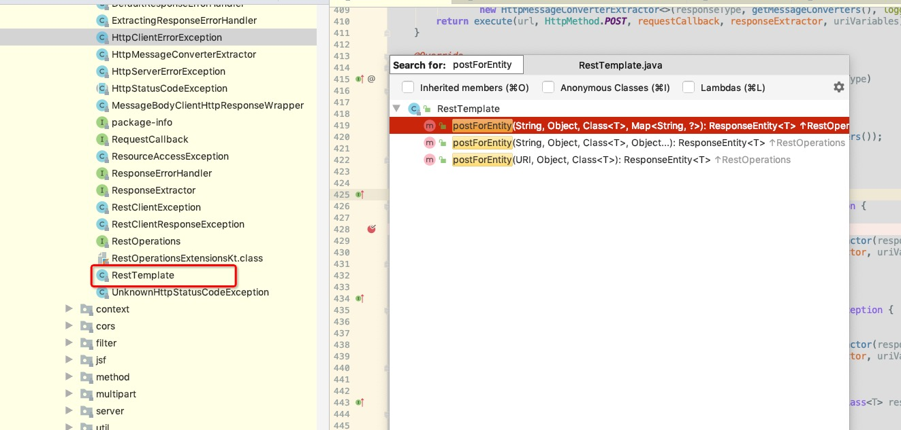
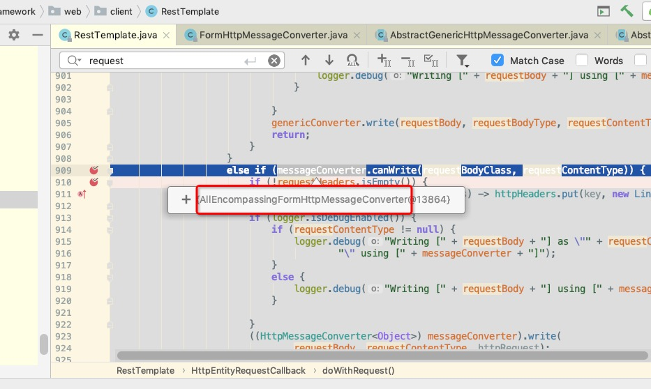
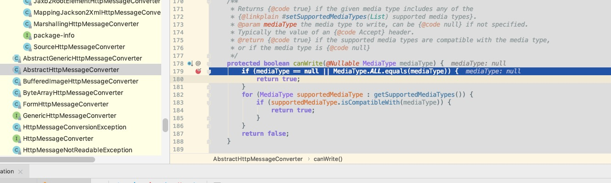
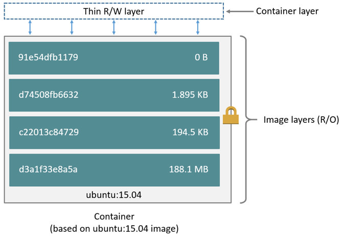
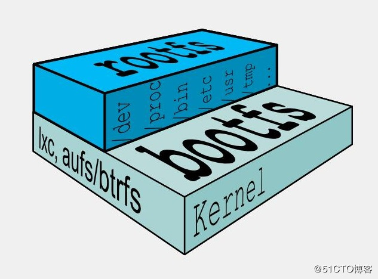
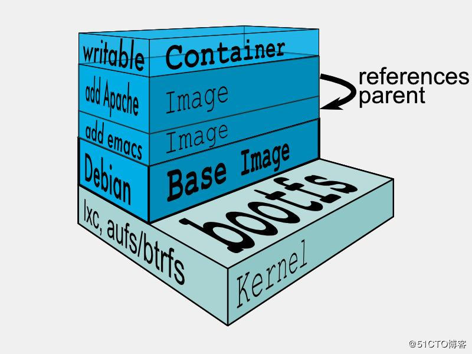

# 2020学习笔记

标签（空格分隔）： 学习

---

  * [微服务调用缓慢排查思路](#微服务调用缓慢排查思路)
  * [springCloud性能优化](#springcloud性能优化)
  * [RestTemplate的正确传参使用方式](#resttemplate的正确传参使用方式)
  * [OAuth2学习](#oauth2学习)
  * [正确使用SpringCloud上传文件](#正确使用springcloud上传文件)
    * [bff工程改造](#bff工程改造)
    * [workflow工程改造](#workflow工程改造)
    * [@RequestPart注解](#requestpart注解)
    * [nodejs上传代码](#nodejs上传代码)
  * [java的BitSet](#java的bitset)
    * [初始化](#初始化)
    * [常用函数](#常用函数)
      * [设置指定位置为true](#设置指定位置为true)
      * [设置指定位置为false](#设置指定位置为false)
      * [获取特定位置的bool值](#获取特定位置的bool值)
      * [获取当前bitset总bit的大小](#获取当前bitset总bit的大小)
      * [hashCode](#hashcode)
  * [如何减少if-else](#如何减少if-else)
  * [Java线程（线程池）数据传递](#java线程线程池数据传递)
    * [主线程往线程池（子线程）传递数据](#主线程往线程池子线程传递数据)
      * [主线程直接传递](#主线程直接传递)
      * [使用InheritableThreadLocal传递](#使用inheritablethreadlocal传递)
      * [阿里的transmittable-thread-local](#阿里的transmittable-thread-local)
  * [由ThreadLocal引发的惨案](#由threadlocal引发的惨案)
  * [线程池线程间交换数据](#线程池线程间交换数据)
    * [可以使用同步队列](#可以使用同步队列)
    * [可以使用Exchanger](#可以使用exchanger)
  * [mysql支持emoji表情](#mysql支持emoji表情)
  * [关于使用org.springframework.web.client.RestTemplate的get、post方法返回值的问题](#关于使用orgspringframeworkwebclientresttemplate的getpost方法返回值的问题)
  * [docker镜像分层原理](#docker镜像分层原理)
    * [为什么需要分层](#为什么需要分层)
    * [分层镜像原理](#分层镜像原理)
  * [es的nested查询](#es的nested查询)
  * [跨域](#跨域)
    * [简单请求](#简单请求)
    * [非简单请求](#非简单请求)
    * [后端springBoot解决跨域问题](#后端springboot解决跨域问题)
      * [重写 WebMvcConfigurer(全局跨域)](#重写-webmvcconfigurer全局跨域)
      * [使用注解 (局部跨域)](#使用注解-局部跨域)
      * [手动设置响应头(局部跨域)](#手动设置响应头局部跨域)
  * [tcpdump命令](#tcpdump命令)
  * [spring事务失效场景实战](#spring事务失效场景实战)
    * [事务注解使用在非public方法上](#事务注解使用在非public方法上)
    * [内部调用](#内部调用)
  * [http与rpc](#http与rpc)
  * [浏览器的缓存机制](#浏览器的缓存机制)


## 微服务调用缓慢排查思路

https://www.yunforum.net/group-topic-id-3827.html

https://zhuanlan.zhihu.com/p/82630599

个人认为，对于微服务调用慢的问题，可以采用以下一些方式进行查找：

如果使用了springcloud下的zipkin框架进行服务调用监控，那么可以针对一个指定的慢调用进行排查，得到是哪个服务慢；

如果已经知道了是哪个服务慢的情况下，可以分几步进行排查：首先是否数据库存在慢查询；机器物理资源使用情况；机器是否频繁GC等。

标题

如果没有使用zipkin等性能监控工具，可以自己在日志中加入相关的信息，比如微服务调用的出、入口。通过日志排查服务的耗时情况。

此外可以排查是否存在慢查询的sql等情况，甚至数据库死锁出现，相关可以参考[这里](https://github.com/Audi-A7/learn/blob/master/mysql%E5%AD%A6%E4%B9%A0.md#mysql%E6%80%A7%E8%83%BD%E6%8C%87%E6%A0%87%E7%9B%91%E6%8E%A7%E5%8F%8A%E6%AD%BB%E9%94%81%E6%A3%80%E6%B5%8B)。

## springCloud性能优化

https://juejin.im/post/5be83e166fb9a049a7115580

总的来说，个人认为一般都有以下几个方面：

 1. 首先是设置合理的ribbon或者feign超时时间以及重试机制。设置过短，网络抖动可能会误判为服务故障。设置过长，可能无法及时发现故障的服务，并且过长的超时时间会影响调用链的整体响应时间。
 2. 设置合理的GC算法。一般选用CMS（高响应）和G1（高吞吐量）。
 3. 合理调整JVM的堆栈大小配置。合理配置年轻代、老年代大小。
 4. 尽量不要使用大sql，避免数据库连接一直被占用。复杂的逻辑运算都放在java内来做。
 5. 接口幂等性需要得到保证。

## RestTemplate的正确传参使用方式

 https://www.cnblogs.com/shoren/p/RestTemplate-problem.html
 
 之前在看springcloud的ribbon模块的源码的时候，接触过restTemplate。他可以比较方便的发起http请求，并且可以实现返回值的自动转换，但是使用的时候还是有几个细节需要注意。
 
 一般而言，参数的传递有几种，放在path里，放在queryString里，form表单，或者放在body里。需要注意传参的形式，否则可能出现接收不到参数的情况。我们以下面几个例子说明一下：
 
 首先分别实现几个方法，Method有GET\POST\PATCH\DELETE
 
```java
 
    @GetMapping("test1")
    public void test1(@ApiParam("游戏id") @RequestParam(name = "gameId") String gameId,
                      @ApiParam("设备udid") @RequestParam(name = "udid") String udid) {
        System.out.println("test1");
        System.out.println(gameId);
        System.out.println(udid);
    }

    @PostMapping("test2")
    public void test2(@ApiParam("游戏id") @RequestParam(name = "gameId") String gameId,
                      @ApiParam("设备udid") @RequestParam(name = "udid") String udid) {
        System.out.println("test2");
        System.out.println(gameId);
        System.out.println(udid);
    }

    @PostMapping("test3")
    public void test3(@RequestBody Action action) {
        System.out.println("test3");
        System.out.println(action.getCn());
        System.out.println(action.getEn());
    }

    @PatchMapping("test4")
    public void test4(@ApiParam("游戏id") @RequestParam(name = "gameId") String gameId,
                      @ApiParam("设备udid") @RequestParam(name = "udid") String udid) {
        System.out.println("test4");
        System.out.println(gameId);
        System.out.println(udid);
    }

    @PatchMapping("test5")
    public void test5(@RequestBody Action action) {
        System.out.println("test5");
        System.out.println(action.getCn());
        System.out.println(action.getEn());
    }

    @DeleteMapping("{id}/test6")
    public void test6(@ApiParam("游戏id") @PathVariable("id") Long id) {
        System.out.println("test6");
        System.out.println(id);
    }
```
然后使用RestTemplate发起对这几个接接口的调用，调用代码如下：

 1. 首先是test1

```java
    @Autowired
    private RestTemplate restTemplate;

    private static final String url = "http://127.0.0.1:3003/";

    @GetMapping("test1")
    public void test1() {
        log.info("test1");
        Map<String, String> map = new HashMap<>();
        map.put("gameId", "7283");
        map.put("udid", "cbsjhcs");
        // 如果下面的url中不像下面这样使用占位符，getForEntity方法是不会自动map中的数据替换到url中的
        restTemplate.getForEntity(url + "test1?gameId={gameId}&udid={udid}", Void.class, map);
    }
```

可以看出调用略微麻烦。

 1. 然后是post

需要注意点是，我们test2接收的时候，参数依然是按照form表单（和queryString的方式是一样）的形式接收的。下面使用的是MultiValueMap，不是HashMap，需要注意。
```java
    @PostMapping("test2")
    public void test2() {
        System.out.println("test2");
        MultiValueMap<String, Object> map = new LinkedMultiValueMap<>();
        map.add("gameId", "7283");
        map.add("udid", "cbsjhcs");
        restTemplate.postForEntity(url + "test2", map, Void.class);
    }
```

另外一种post，参数放在body内的，调用方式如下：
```java
    @PostMapping("test3")
    public void test3() {
        System.out.println("test3");
        Map<String, String> map = new HashMap<>();
        map.put("cn", "中文");
        map.put("en", "English");
//        MultiValueMap<String, Object> map = new LinkedMultiValueMap<>();
//        map.add("cn", "中文");
//        map.add("en", "English");
        restTemplate.postForEntity(url + "test3", map, Void.class);
    }
```
这里就不能使用MultiValueMap了，否则会报如下错误，其实就是post时使用MultiValueMap参数会被放到queryString上去：
```java
 Content type 'application/x-www-form-urlencoded;charset=UTF-8' not supported
```

 1. 然后是patch

注意同样是使用MultiValueMap来传递参数，因为在queryString上，否则就可以使用HashMap了。
```java
    @PatchMapping("test4")
    public void test4() {
        System.out.println("test4");

        MultiValueMap<String, Object> map = new LinkedMultiValueMap<>();
        map.add("gameId", "1013");
        map.add("udid", "csdcsdcsd");

        restTemplate.patchForObject(url + "test4", map, Void.class);
    }
```
注意使用patch方法，需要特殊构造RestTemplate对象。可以像下面这样直接new。
```java
private RestTemplate restTemplate = new RestTemplate(new HttpComponentsClientHttpRequestFactory());
```
当然更好的办法是通过配置类的方式，如下所示：
```java
@Configuration
@Slf4j
public class RestTemplateConfig {
    @Bean
    public RestTemplate restTemplate(){
        RestTemplate restTemplate = new RestTemplate();
        HttpComponentsClientHttpRequestFactory requestFactory = new HttpComponentsClientHttpRequestFactory();
        restTemplate.setRequestFactory(requestFactory);
        return restTemplate;
    }
}
```
如果不对RestTemplate进行特殊构造，默认是不会设置ClientHttpRequestFactory的。且此时使用RestTemplate发起patch调用会会宝如下错误：
```java
I/O error on PATCH request for "http://127.0.0.1:3003/test4": Invalid HTTP method: PATCH; nested exception is java.net.ProtocolException: Invalid HTTP method: PATCH
```
这个错误在https://github.com/spring-cloud/spring-cloud-netflix/issues/1777     和       https://github.com/spring-projects/spring-framework/issues/19618  都有提及。

问题的根源在于，spring底层的使用的是java的HttpURLConnection来发起http连接，在HttpURLConnection内，只允许如下一些方法：
```java
    /* valid HTTP methods */
    private static final String[] methods = {
        "GET", "POST", "HEAD", "OPTIONS", "PUT", "DELETE", "TRACE"
    };
```
在构造RestTemplate对象时，除了使用HttpComponentsClientHttpRequestFactory外，还可以使用Netty4ClientHttpRequestFactory, OkHttp3ClientHttpRequestFactory and OkHttpClientHttpRequestFactory。

然后是参数放在body里的方式来调用patch。其实和上面的参数放在queryString的patch很像，只是使用的HashMap传参，而不是LinkedMultiValueMap。源码如下：
```java
    @PatchMapping("test5")
    public void test5() {
        System.out.println("test5");
        Map<String, Object> map = new HashMap<>();
        map.put("cn", "中文");
        map.put("en", "English");

        restTemplate.patchForObject(url + "test5", map, Void.class);
    }
```

 1. 最后是Delete

注意其参数是在path内，我们可以使用类似于GET请求时，占位符的方式来调用传参。调用代码如下：

```java
    @DeleteMapping("test6")
    public void test6() {
        System.out.println("test6");

        Map<String, Object> map = new HashMap<>();
        map.put("id", 14515);

        restTemplate.delete(url + "{id}/test6", map);
    }
```

 - 总结

GET：需要使用占位符当时调用，RestTemplate无法自动填充key；

POST：参数在form表单时，使用LinkedMultiValueMap传参，在body上时使用HashMap传参；

PATCH：调用方式同POST，但是需要特殊构造RestTemplate，设置ClientHttpRequestFactory；

DELETE：调用方式同GET

上面我们说，在POST中使用的Map类型不同，会导致参数传递的方式不一样，到底是什么导致了这种情况的发生？

本质上来说，LinkedMultiValueMap和HashMap没什么不一样，仅仅是LinkedMultiValueMap的value也可以存储一个List。其实，答案是因为他们底层使用的MessageConverter不一样导致的。下面我们源码debug一次：

首先我们使用LinkedMultiValueMap传参，查看postForEntity的实现，有如下三种：



我们使用下面这种：
```java
	@Override
	public <T> ResponseEntity<T> postForEntity(String url, @Nullable Object request,
			Class<T> responseType, Object... uriVariables) throws RestClientException {

		RequestCallback requestCallback = httpEntityCallback(request, responseType);
		ResponseExtractor<ResponseEntity<T>> responseExtractor = responseEntityExtractor(responseType);
		return nonNull(execute(url, HttpMethod.POST, requestCallback, responseExtractor, uriVariables));
	}
```
可以看到我们传递的map其实是第二个参数request，spring会使用request构造一个RequestCallback对象。这个没什么好说的，接下来就是execute方法，源码如下：
```java
	@Override
	@Nullable
	public <T> T execute(String url, HttpMethod method, @Nullable RequestCallback requestCallback,
			@Nullable ResponseExtractor<T> responseExtractor, Object... uriVariables) throws RestClientException {

		URI expanded = getUriTemplateHandler().expand(url, uriVariables);
		return doExecute(expanded, method, requestCallback, responseExtractor);
	}
```
这里我们着重看一下doExecute方法，源码如下：
```java
	/**
	 * Execute the given method on the provided URI.
	 * <p>The {@link ClientHttpRequest} is processed using the {@link RequestCallback};
	 * the response with the {@link ResponseExtractor}.
	 * @param url the fully-expanded URL to connect to
	 * @param method the HTTP method to execute (GET, POST, etc.)
	 * @param requestCallback object that prepares the request (can be {@code null})
	 * @param responseExtractor object that extracts the return value from the response (can be {@code null})
	 * @return an arbitrary object, as returned by the {@link ResponseExtractor}
	 */
	@Nullable
	protected <T> T doExecute(URI url, @Nullable HttpMethod method, @Nullable RequestCallback requestCallback,
			@Nullable ResponseExtractor<T> responseExtractor) throws RestClientException {

		Assert.notNull(url, "URI is required");
		Assert.notNull(method, "HttpMethod is required");
		ClientHttpResponse response = null;
		try {
			ClientHttpRequest request = createRequest(url, method);
			if (requestCallback != null) {
				requestCallback.doWithRequest(request);
			}
			response = request.execute();
			handleResponse(url, method, response);
			return (responseExtractor != null ? responseExtractor.extractData(response) : null);
		}
		catch (IOException ex) {
			String resource = url.toString();
			String query = url.getRawQuery();
			resource = (query != null ? resource.substring(0, resource.indexOf('?')) : resource);
			throw new ResourceAccessException("I/O error on " + method.name() +
					" request for \"" + resource + "\": " + ex.getMessage(), ex);
		}
		finally {
			if (response != null) {
				response.close();
			}
		}
	}
```
这里与我们关心的requestCallback只有doWithRequest方法，我们再看下源码：
```java
		@Override
		@SuppressWarnings("unchecked")
		public void doWithRequest(ClientHttpRequest httpRequest) throws IOException {
			super.doWithRequest(httpRequest);
			Object requestBody = this.requestEntity.getBody();
			if (requestBody == null) {
				HttpHeaders httpHeaders = httpRequest.getHeaders();
				HttpHeaders requestHeaders = this.requestEntity.getHeaders();
				if (!requestHeaders.isEmpty()) {
					requestHeaders.forEach((key, values) -> httpHeaders.put(key, new LinkedList<>(values)));
				}
				if (httpHeaders.getContentLength() < 0) {
					httpHeaders.setContentLength(0L);
				}
			}
			else {
				Class<?> requestBodyClass = requestBody.getClass();
				Type requestBodyType = (this.requestEntity instanceof RequestEntity ?
						((RequestEntity<?>)this.requestEntity).getType() : requestBodyClass);
				HttpHeaders httpHeaders = httpRequest.getHeaders();
				HttpHeaders requestHeaders = this.requestEntity.getHeaders();
				MediaType requestContentType = requestHeaders.getContentType();
				for (HttpMessageConverter<?> messageConverter : getMessageConverters()) {
					if (messageConverter instanceof GenericHttpMessageConverter) {
						GenericHttpMessageConverter<Object> genericConverter =
								(GenericHttpMessageConverter<Object>) messageConverter;
						if (genericConverter.canWrite(requestBodyType, requestBodyClass, requestContentType)) {
							if (!requestHeaders.isEmpty()) {
								requestHeaders.forEach((key, values) -> httpHeaders.put(key, new LinkedList<>(values)));
							}
							if (logger.isDebugEnabled()) {
								if (requestContentType != null) {
									logger.debug("Writing [" + requestBody + "] as \"" + requestContentType +
											"\" using [" + messageConverter + "]");
								}
								else {
									logger.debug("Writing [" + requestBody + "] using [" + messageConverter + "]");
								}

							}
							genericConverter.write(requestBody, requestBodyType, requestContentType, httpRequest);
							return;
						}
					}
					else if (messageConverter.canWrite(requestBodyClass, requestContentType)) {
						if (!requestHeaders.isEmpty()) {
							requestHeaders.forEach((key, values) -> httpHeaders.put(key, new LinkedList<>(values)));
						}
						if (logger.isDebugEnabled()) {
							if (requestContentType != null) {
								logger.debug("Writing [" + requestBody + "] as \"" + requestContentType +
										"\" using [" + messageConverter + "]");
							}
							else {
								logger.debug("Writing [" + requestBody + "] using [" + messageConverter + "]");
							}

						}
						((HttpMessageConverter<Object>) messageConverter).write(
								requestBody, requestContentType, httpRequest);
						return;
					}
				}
				String message = "Could not write request: no suitable HttpMessageConverter found for request type [" +
						requestBodyClass.getName() + "]";
				if (requestContentType != null) {
					message += " and content type [" + requestContentType + "]";
				}
				throw new RestClientException(message);
			}
		}
```
这个方法就是导致两种map参数位置差异的根源，该方法会调用MessageConverter进行request的write。写入之前需要判断当前的MessageConverter是否是GenericHttpMessageConverter的子类，以及是否canWrite。

实际debug发现，使用MultiValueMap使用的是AllEncompassingFormHttpMessageConverter，如下图所示：



它的supportedMediaTypes如下图所示：


这已经可以说明参数会被放到form表单。保险起见我们再看一下canWrite方法，这里我们看的是FormHttpMessageConverter的canWrite方法。源码如下：
```java
	@Override
	public boolean canWrite(Class<?> clazz, @Nullable MediaType mediaType) {
		if (!MultiValueMap.class.isAssignableFrom(clazz)) {
			return false;
		}
		if (mediaType == null || MediaType.ALL.equals(mediaType)) {
			return true;
		}
		for (MediaType supportedMediaType : getSupportedMediaTypes()) {
			if (supportedMediaType.isCompatibleWith(mediaType)) {
				return true;
			}
		}
		return false;
	}
```
我们实际debug该方法时，会进入第二个if判断，因为我们的mediaType此时是空的，如下图所示：


至此，我们基本算明白了为什么MultiValueMap传递的参数为什么会被放到form表单上去。

然后分析，HashMap传参就简单多了，确实也是进入到doWithRequest方法，只不过此时使用的converter是MappingJackson2HttpMessageConverter。如下图所示：


它所支持的MediaTypes是application/json。保险起见我们也看一下他的canWrite方法。最终底层调用的其实是AbstractHttpMessageConverter抽象类的canWrite方法：
```java
	/**
	 * Returns {@code true} if the given media type includes any of the
	 * {@linkplain #setSupportedMediaTypes(List) supported media types}.
	 * @param mediaType the media type to write, can be {@code null} if not specified.
	 * Typically the value of an {@code Accept} header.
	 * @return {@code true} if the supported media types are compatible with the media type,
	 * or if the media type is {@code null}
	 */
	protected boolean canWrite(@Nullable MediaType mediaType) {
		if (mediaType == null || MediaType.ALL.equals(mediaType)) {
			return true;
		}
		for (MediaType supportedMediaType : getSupportedMediaTypes()) {
			if (supportedMediaType.isCompatibleWith(mediaType)) {
				return true;
			}
		}
		return false;
	}
```
由于入参mediaType为空，因此canWrite会返回true。如下图所示：
 
 
 总结：
 
 最终导致MultiValueMap和HashMap参数传递不一样的原因是因为Spring底层对于两者所选取的MessageConverter不一样导致的。
 
 

## OAuth2学习

 1. https://www.jianshu.com/p/4f5fcddb4106
 2. https://www.jianshu.com/p/1f2d6e5126cb

提到OAuth2，我们不得不先说一下JSON Web Token (JWT)。


 
## 正确使用SpringCloud上传文件

使用springBoot上传文件的时候，我们一般会使用来MultipartFile  类型来进行文件的接收，但是如果我们是SpringCloud的项目，文件二进制数据需要通过feign从一个应用传到另外一个应用，那么就需要做一些特殊的设置。

我们这里以bff服务调用workflow服务为例。

### bff工程改造

首先需要在bff引入pom依赖：
```java
<dependency>
    <groupId>io.github.openfeign.form</groupId>
    <artifactId>feign-form</artifactId>
    <version>3.0.3</version>
</dependency>
<dependency>
    <groupId>io.github.openfeign.form</groupId>
    <artifactId>feign-form-spring</artifactId>
    <version>3.2.2</version>
</dependency>
```
然后在bff写上配置类：

```java
import feign.codec.Encoder;
import feign.form.spring.SpringFormEncoder;
import org.springframework.beans.factory.ObjectFactory;
import org.springframework.beans.factory.annotation.Autowired;
import org.springframework.boot.autoconfigure.http.HttpMessageConverters;
import org.springframework.cloud.openfeign.support.SpringEncoder;
import org.springframework.context.annotation.Bean;
import org.springframework.context.annotation.Configuration;
 
/**
 * https://blog.csdn.net/guobinhui/article/details/102859095
 * <p>
 * 解决feign调用上传文件报错的问题
 *
 * @author WangQuanzhou
 * @date 2020-03-24
 */
@Configuration
public class MultipartSupportConfig {
 
    @Autowired
    private ObjectFactory<HttpMessageConverters> messageConverters;
 
    @Bean
    public Encoder feignFormEncoder() {
        return new SpringFormEncoder(new SpringEncoder(messageConverters));
    }
}
```

在bff工程中  @FeignClient上写上该配置类：
```java
import com.t4f.web.invoice.bff.api.config.MultipartSupportConfig;
import com.t4f.web.invoice.workflow.shared.BillApi;
import org.springframework.cloud.openfeign.FeignClient;
import org.springframework.stereotype.Component;
 
/**
 * 账单处理相关
 *
 * @author WangQuanzhou
 * @date 2019-03-26
 */
@FeignClient(name="invoice-workflow",configuration = MultipartSupportConfig.class)
@Component
public interface BillClient extends BillApi {
}
```

bff的对外入口上写上@RequestPart("file")来接收文件流以及consumes为MediaType.MULTIPART_FORM_DATA_VALUE，file不是固定的，只要和前端约定好该关键字就可以：
```java
/**
 * 前端页面将生产好的pdf文件上传到后端，目前只支持pdf格式
 *
 * @param userId 当前登录用户id
 * @param billId 账单id
 * @param file   合同信息
 * @return
 */
@PutMapping(value = "contract/upload/{billId}", consumes = MediaType.MULTIPART_FORM_DATA_VALUE)
@ApiOperation("前端页面将生产好的pdf文件上传到后端，目前只支持pdf格式")
public Result contractUpload(@ApiParam("用户id") @RequestHeader(name = "user_id") String userId,
                             @ApiParam("账单id") @PathVariable(name = "billId") String billId,
                             @RequestPart("file") MultipartFile file) throws IOException {
    log.info("received upload contract file request, userId = {}, billId = {}, file name = {}", userId, billId,
            file.getOriginalFilename());
    return billClient.contractUpload(userId, billId, file);
}
```

### workflow工程改造
bff工程会调用workflow的如下接口，注意设置consumes为MediaType.MULTIPART_FORM_DATA_VALUE

```java
@PutMapping(value = "contract/upload/{billId}", consumes = MediaType.MULTIPART_FORM_DATA_VALUE)
@ApiOperation("前端页面将生产好的pdf文件上传到后端，目前只支持pdf格式")
Result contractUpload(@ApiParam("用户id") @RequestHeader(name = "user_id") String userId,
                      @ApiParam("账单id") @PathVariable(name = "billId") String billId,
                      @RequestPart("file") MultipartFile file) throws IOException;
```

### @RequestPart注解
注意一下这个注解，其实他本质上和@RequestParam注解区别不大，唯一的区别就是@RequestPart一般用于复杂的对象接收，如JSON、XML等，而@RequestParam一般用于较为简单的key-value的键值对接收。

下面是@RequestPart的源码注释，可以参考一下，里面有关于二者的区别介绍：
```java
/*
 * Copyright 2002-2016 the original author or authors.
 *
 * Licensed under the Apache License, Version 2.0 (the "License");
 * you may not use this file except in compliance with the License.
 * You may obtain a copy of the License at
 *
 *      http://www.apache.org/licenses/LICENSE-2.0
 *
 * Unless required by applicable law or agreed to in writing, software
 * distributed under the License is distributed on an "AS IS" BASIS,
 * WITHOUT WARRANTIES OR CONDITIONS OF ANY KIND, either express or implied.
 * See the License for the specific language governing permissions and
 * limitations under the License.
 */
 
package org.springframework.web.bind.annotation;
 
import java.beans.PropertyEditor;
import java.lang.annotation.Documented;
import java.lang.annotation.ElementType;
import java.lang.annotation.Retention;
import java.lang.annotation.RetentionPolicy;
import java.lang.annotation.Target;
 
import org.springframework.core.annotation.AliasFor;
import org.springframework.core.convert.converter.Converter;
import org.springframework.http.converter.HttpMessageConverter;
import org.springframework.web.multipart.MultipartFile;
import org.springframework.web.multipart.MultipartResolver;
 
/**
 * Annotation that can be used to associate the part of a "multipart/form-data" request
 * with a method argument.
 *
 * <p>Supported method argument types include {@link MultipartFile}
 * in conjunction with Spring's {@link MultipartResolver} abstraction,
 * {@code javax.servlet.http.Part} in conjunction with Servlet 3.0 multipart requests,
 * or otherwise for any other method argument, the content of the part is passed through an
 * {@link HttpMessageConverter} taking into consideration the 'Content-Type' header
 * of the request part. This is analogous to what @{@link RequestBody} does to resolve
 * an argument based on the content of a non-multipart regular request.
 *
 * <p>Note that @{@link RequestParam} annotation can also be used to associate the
 * part of a "multipart/form-data" request with a method argument supporting the same
 * method argument types. The main difference is that when the method argument is not a
 * String, @{@link RequestParam} relies on type conversion via a registered
 * {@link Converter} or {@link PropertyEditor} while @{@link RequestPart} relies
 * on {@link HttpMessageConverter}s taking into consideration the 'Content-Type' header
 * of the request part. @{@link RequestParam} is likely to be used with name-value form
 * fields while @{@link RequestPart} is likely to be used with parts containing more
 * complex content (e.g. JSON, XML).
 *
 * @author Rossen Stoyanchev
 * @author Arjen Poutsma
 * @author Sam Brannen
 * @since 3.1
 * @see RequestParam
 * @see org.springframework.web.servlet.mvc.method.annotation.RequestMappingHandlerAdapter
 */
@Target(ElementType.PARAMETER)
@Retention(RetentionPolicy.RUNTIME)
@Documented
public @interface RequestPart {
 
    /**
     * Alias for {@link #name}.
     */
    @AliasFor("name")
    String value() default "";
 
    /**
     * The name of the part in the {@code "multipart/form-data"} request to bind to.
     * @since 4.2
     */
    @AliasFor("value")
    String name() default "";
 
    /**
     * Whether the part is required.
     * <p>Defaults to {@code true}, leading to an exception being thrown
     * if the part is missing in the request. Switch this to
     * {@code false} if you prefer a {@code null} value if the part is
     * not present in the request.
     */
    boolean required() default true;
 
}
```

### nodejs上传代码

下面顺便附上nodejs上传文件的代码：

https://blog.csdn.net/Betterc5/article/details/102897858?depth_1-utm_source=distribute.pc_relevant.none-task&utm_source=distribute.pc_relevant.none-task

```javascript
const request = require('request');
const fs = require('fs');
 
function sendMultipart(filePath) {
    const formData = {
        file : fs.createReadStream(filePath)
    };
    let options = {
        method : 'POST',
        url : 'your url',
        headers : { 'Content-Type' : 'multipart/form-data' },
        formData : formData
    };
    return new Promise((resolve, reject) => {
        let readStream = Request(options, (error, response, body) => {
            if (!error) {
                resolve({response, body}); 
            } else {
                reject(error);
            }
        });
    });
}
```


## java的BitSet

 1. https://blog.csdn.net/u012736409/article/details/53735429
 2. https://blog.csdn.net/kongmin_123/article/details/82225172

首先介绍一下比特数组，本质上来说是个数组，只是数组的各个元素都是二进制，要么0，要么1.使用比特数组有什么好处呢？经典的使用方式，给出大量的正整数（亿级），希望快速判断，某个数在不在这一大堆数据中，此时使用比特数组在合适不过了。

理论上，1GB的比特数组可以存储1*1024*1024*1024*8=8589934592（85亿）个数字。

BitSet是java官方提供的比特数组的实现方式。我们看一下其实现的逻辑及几个重要的函数：
```java
package java.util;

import java.io.*;
import java.nio.ByteBuffer;
import java.nio.ByteOrder;
import java.nio.LongBuffer;
import java.util.stream.IntStream;
import java.util.stream.StreamSupport;

/**
 * This class implements a vector of bits that grows as needed. Each
 * component of the bit set has a {@code boolean} value. The
 * bits of a {@code BitSet} are indexed by nonnegative integers.
 * Individual indexed bits can be examined, set, or cleared. One
 * {@code BitSet} may be used to modify the contents of another
 * {@code BitSet} through logical AND, logical inclusive OR, and
 * logical exclusive OR operations.
 *
 * <p>By default, all bits in the set initially have the value
 * {@code false}.
 *
 * <p>Every bit set has a current size, which is the number of bits
 * of space currently in use by the bit set. Note that the size is
 * related to the implementation of a bit set, so it may change with
 * implementation. The length of a bit set relates to logical length
 * of a bit set and is defined independently of implementation.
 *
 * <p>Unless otherwise noted, passing a null parameter to any of the
 * methods in a {@code BitSet} will result in a
 * {@code NullPointerException}.
 *
 * <p>A {@code BitSet} is not safe for multithreaded use without
 * external synchronization.
 *
 * @author  Arthur van Hoff
 * @author  Michael McCloskey
 * @author  Martin Buchholz
 * @since   JDK1.0
 */
public class BitSet implements Cloneable, java.io.Serializable {
...
}
```

从源码可以看出，实际上它在jdk1.0的时候就已经存在了，历史还是相当久远的。

这里我们使用的是jdk1.8源码继续解析。主要涉及BitSet的以下一些部分：

 1. 初始化一个bitset，指定大小。
 2. 清空bitset。
 3. 反转某一指定位。
 4. 设置某一指定位。
 5. 获取某一位的状态。
 6. 当前bitset的bit总位数。

### 初始化

```java
    /**
     * The internal field corresponding to the serialField "bits".
     */
    private long[] words;
```
从源码及注释可以看出，BitSet内部使用long型数组存储数据。

其构造函数如下：
```java
    /**
     * Creates a new bit set. All bits are initially {@code false}.
     */
    public BitSet() {
        initWords(BITS_PER_WORD);
        sizeIsSticky = false;
    }

    /**
     * Creates a bit set whose initial size is large enough to explicitly
     * represent bits with indices in the range {@code 0} through
     * {@code nbits-1}. All bits are initially {@code false}.
     *
     * @param  nbits the initial size of the bit set
     * @throws NegativeArraySizeException if the specified initial size
     *         is negative
     */
    public BitSet(int nbits) {
        // nbits can't be negative; size 0 is OK
        if (nbits < 0)
            throw new NegativeArraySizeException("nbits < 0: " + nbits);

        initWords(nbits);
        sizeIsSticky = true;
    }

    private void initWords(int nbits) {
        words = new long[wordIndex(nbits-1) + 1];
    }

    /**
     * Creates a bit set using words as the internal representation.
     * The last word (if there is one) must be non-zero.
     */
    private BitSet(long[] words) {
        this.words = words;
        this.wordsInUse = words.length;
        checkInvariants();
    }
```
其默认构造函数的带下是一个long型，BitSet(int nbits)的大小是大于等于nbits的整数倍。整数倍的过程其实就体现在下面的代码的+1的这个操作。这么做的原因大概是为了考虑内存对齐吧。

```java
words = new long[wordIndex(nbits-1) + 1];
```
还有个构造函数，是使用已经存在的bit数组去初始化一个比特数组。

关于BitSet的大小，可以如下代码测试一下：
```java
    public static void main(String[] args) {
        BitSet bitSet = new BitSet();
        System.out.println("default size="+bitSet.size()+" "+bitSet.length());

        BitSet bitSet2 = new BitSet(1);
        System.out.println("        size="+bitSet2.size()+" "+bitSet2.length());

        BitSet bitSet3 = new BitSet(64);
        System.out.println("        size="+bitSet3.size()+" "+bitSet3.length());

        BitSet bitSet4 = new BitSet(65);
        System.out.println("        size="+bitSet4.size()+" "+bitSet4.length());
    }
```
输出结果如下：
```java
default size=64 0
        size=64 0
        size=64 0
        size=128 0
```
### 常用函数

#### 设置指定位置为true

jdk源码如下：
```java
    /**
     * Sets the bit at the specified index to {@code true}.
     *
     * @param bitIndex a bit index
     * @throws IndexOutOfBoundsException if the specified index is negative
     * @since JDK1.0
     */
    public void set(int bitIndex) {
        if (bitIndex < 0)
            throw new IndexOutOfBoundsException("bitIndex < 0: " + bitIndex);

        int wordIndex = wordIndex(bitIndex);
        expandTo(wordIndex);

        words[wordIndex] |= (1L << bitIndex); // Restores invariants

        checkInvariants();
    }
```

根据BitSet的数据结构，我们知道他的数据实际上是存储在long[]数组里的，那么set的逻辑其实就很简单，首先根据bitIndex找到需要设置的word的index，也就是wordIndex。然后查看师傅需要扩容。最后根据words[wordIndex] |= (1L << bitIndex)，进行位或操作即可设置为true（1）。

这里注意一下"<<"操作，他是个循环左移操作。如果是针对long的位移操作，那么就是以64为周期，周期性移动。具体如下代码所示：
```java
    public static void main(String[] args) {
        System.out.println(1L << 2);
        System.out.println(1L << 66);
    }
```
输出如下：
```java
4
4
```

除了这个set方法外，它还有三个重载的set，如下图所示：


其中， set(int fromIndex, int toIndex)会把数据处理成三个部分，首部、中部、尾部。

#### 设置指定位置为false

源码如下：
```java
    /**
     * Sets the bit specified by the index to {@code false}.
     *
     * @param bitIndex the index of the bit to be cleared
     * @throws IndexOutOfBoundsException if the specified index is negative
     * @since JDK1.0
     */
    public void clear(int bitIndex) {
        if (bitIndex < 0)
            throw new IndexOutOfBoundsException("bitIndex < 0: " + bitIndex);

        int wordIndex = wordIndex(bitIndex);
        if (wordIndex >= wordsInUse)
            return;

        words[wordIndex] &= ~(1L << bitIndex);

        recalculateWordsInUse();
        checkInvariants();
    }
```


原理类似于set(int)，只是这里多了一步recalculateWordsInUse的计算。其实，就是为了重新计算一下words的大小。比如，假设words的有效数据都在65及65位以下，此时将words的第65位设置为1，那么这个时候，实际有效的数据只有64位了。

源码如下：
```java
    /**
     * Sets the field wordsInUse to the logical size in words of the bit set.
     * WARNING:This method assumes that the number of words actually in use is
     * less than or equal to the current value of wordsInUse!
     */
    private void recalculateWordsInUse() {
        // Traverse the bitset until a used word is found
        int i;
        for (i = wordsInUse - 1; i >= 0; i--)
            if (words[i] != 0)
                break;

        wordsInUse = i + 1; // The new logical size
    }
```

#### 获取特定位置的bool值

原理，比较简单，其实就是通过计算出wordIndex，然后与1L << bitIndex进行位与，通过判断结果是不是0来判断true、false。
```java
    /**
     * Returns the value of the bit with the specified index. The value
     * is {@code true} if the bit with the index {@code bitIndex}
     * is currently set in this {@code BitSet}; otherwise, the result
     * is {@code false}.
     *
     * @param bitIndex the bit index
     * @return the value of the bit with the specified index
     * @throws IndexOutOfBoundsException if the specified index is negative
     */
    public boolean get(int bitIndex) {
        if (bitIndex < 0)
            throw new IndexOutOfBoundsException("bitIndex < 0: " + bitIndex);

        checkInvariants();

        int wordIndex = wordIndex(bitIndex);
        return (wordIndex < wordsInUse)
                && ((words[wordIndex] & (1L << bitIndex)) != 0);
    }
```

#### 获取当前bitset总bit的大小

```java
    /**
     * Returns the "logical size" of this {@code BitSet}: the index of
     * the highest set bit in the {@code BitSet} plus one. Returns zero
     * if the {@code BitSet} contains no set bits.
     *
     * @return the logical size of this {@code BitSet}
     * @since 1.2
     */
    public int length() {
        if (wordsInUse == 0)
            return 0;

        return BITS_PER_WORD * (wordsInUse - 1) +
                (BITS_PER_WORD - Long.numberOfLeadingZeros(words[wordsInUse - 1]));
    }
```
与之相似的还有size函数：
```java
    /**
     * Returns the number of bits of space actually in use by this
     * {@code BitSet} to represent bit values.
     * The maximum element in the set is the size - 1st element.
     *
     * @return the number of bits currently in this bit set
     */
    public int size() {
        return words.length * BITS_PER_WORD;
    }
```

源码上看，length需要去除头部的0，size不去除。

#### hashCode
```java
    /**
     * Returns the hash code value for this bit set. The hash code depends
     * only on which bits are set within this {@code BitSet}.
     *
     * <p>The hash code is defined to be the result of the following
     * calculation:
     * <pre> {@code
     * public int hashCode() {
     *     long h = 1234;
     *     long[] words = toLongArray();
     *     for (int i = words.length; --i >= 0; )
     *         h ^= words[i] * (i + 1);
     *     return (int)((h >> 32) ^ h);
     * }}</pre>
     * Note that the hash code changes if the set of bits is altered.
     *
     * @return the hash code value for this bit set
     */
    public int hashCode() {
        long h = 1234;
        for (int i = wordsInUse; --i >= 0; )
            h ^= words[i] * (i + 1);

        return (int) ((h >> 32) ^ h);
    }
```
 
  

## 如何减少if-else

- https://blog.csdn.net/weixin_44750143/article/details/106304245?utm_medium=distribute.pc_category.none-task-blog-hot-2.nonecase&depth_1-utm_source=distribute.pc_category.none-task-blog-hot-2.nonecase&request_id=

一般来说，不要一上来就是各种设计模式，各种框架往上套，需要使用简洁明了的语法来进行优化。

 1. 拆解多层if嵌套，能直接return的就在最外层return
 2. 使用三元运算符
 3. 使用Optional替代null判断
 4. 使用枚举

## Java线程（线程池）数据传递

### 主线程往线程池（子线程）传递数据
#### 主线程直接传递
主线程直接定义变量，只要线程池不对变量进行变更，就可以不需要定义成final类型。示例代码如下：

```java
// 这里的threadLocal是父线程的，因此可以正常取出auth变量
 String authDepth = threadLocal.get("auth");
                scheduledThreadPoolExecutor.schedule(new Runnable() {
                    @Override
                    public void run() {
                        try {
                            log.info("start to send batch mail, toList = {},", mail.getTo());
                            // 下面这样在线程池里，去threadLocal取变量是无法取出来的，因为此时的threadLocal已经是子线程的，而userName这个变量是存在父线程的threadLocal里的
                            GameMailDTO dto = constructMail(gameId, threadLocal.get("userName"), regionId, mail);
                            sendMail(authDepth, dto);
                            log.info("end send batch mail...");
                        } catch (Exception e) {
                            log.error("error occured while send batch mail", e);
                        }
                    }
                }, 5, TimeUnit.SECONDS);

            }
```
上面代码，使用线程池进行比较耗时的发邮件的操作。发送我们需要从主线程中获取部分用户的数据，如用户权限数据auth，用户姓名userName等。

但是这里值得注意的是，我们只是获取数据，并**不会**对数据进行**修改**，所以我们可以直接先从父线程的threadLocal将数据取出，使用局部变量的方式，传递给线程池。

#### 使用InheritableThreadLocal传递

这种方式只能实现父子线程之间的threadLocal传递，如果主线程中使用的是线程池，那么还是不行。

https://www.cnblogs.com/duanxz/p/5444805.html

https://www.cnblogs.com/Nonnetta/p/10175662.html

下面的代码是不能正穿传递父子threadLocal的示例：
```java
    public static void main(String[] args) {
        ThreadLocal<String> local = new ThreadLocal<>();
        local.set("我是主线程");

        Thread thread = new Thread(() -> {
            System.out.println(String.format("子线程获取主线程名称：%s", local.get()));
        });
        thread.start();

        List<Integer> integerList = IntStream.range(1, 10).boxed().collect(Collectors.toList());
        integerList.parallelStream().forEach(id ->
                System.out.println(String.format("流 %s 中获取主线程名称：%s", id, local.get())));
    }
```
程序运行输出如下：
```java
子线程获取主线程名称：null
流 2 中获取主线程名称：null
流 3 中获取主线程名称：null
流 1 中获取主线程名称：null
流 4 中获取主线程名称：null
流 8 中获取主线程名称：null
流 7 中获取主线程名称：null
流 9 中获取主线程名称：null
流 5 中获取主线程名称：null
流 6 中获取主线程名称：我是主线程
```

下面是使用InheritableThreadLocal在父子线程间传递数据的示例代码：
```java
    public static void main(String[] args) {
        ThreadLocal<String> local = new InheritableThreadLocal<>();
        local.set("我是主线程");

        Thread thread = new Thread(() -> {
            System.out.println(String.format("子线程获取主线程名称：%s", local.get()));
        });
        thread.start();

        List<Integer> integerList = IntStream.range(1, 10).boxed().collect(Collectors.toList());
        integerList.parallelStream().forEach(id ->
                System.out.println(String.format("流 %s 中获取主线程名称：%s", id, local.get())));
    }
```

程序运行输出如下：
```java
子线程获取主线程名称：我是主线程
流 3 中获取主线程名称：我是主线程
流 2 中获取主线程名称：我是主线程
流 4 中获取主线程名称：我是主线程
流 1 中获取主线程名称：我是主线程
流 8 中获取主线程名称：我是主线程
流 7 中获取主线程名称：我是主线程
流 9 中获取主线程名称：我是主线程
流 5 中获取主线程名称：我是主线程
流 6 中获取主线程名称：我是主线程
```

这种方式，本质上来说，其实就是在父线程中通过设置InheritableThreadLocal，来达到数据传递到子线程的过程。

具体的赋值过程是在Thread类的init方法完成的。当父亲线程中对inherThreadLocals进行了赋值，就会把当前线程的本地变量（也就是父线程的inherThreadLocals）进行createInheritedMap方法操作。init方法源码如下：
```java
    /**
     * Initializes a Thread with the current AccessControlContext.
     * @see #init(ThreadGroup,Runnable,String,long,AccessControlContext,boolean)
     */
    private void init(ThreadGroup g, Runnable target, String name,
                      long stackSize) {
        init(g, target, name, stackSize, null, true);
    }

// 上面的init方法调用了下面的init方法。

/**
     * Initializes a Thread.
     *
     * @param g the Thread group
     * @param target the object whose run() method gets called
     * @param name the name of the new Thread
     * @param stackSize the desired stack size for the new thread, or
     *        zero to indicate that this parameter is to be ignored.
     * @param acc the AccessControlContext to inherit, or
     *            AccessController.getContext() if null
     * @param inheritThreadLocals if {@code true}, inherit initial values for
     *            inheritable thread-locals from the constructing thread
     */
    private void init(ThreadGroup g, Runnable target, String name,
                      long stackSize, AccessControlContext acc,
                      boolean inheritThreadLocals) {
        if (name == null) {
            throw new NullPointerException("name cannot be null");
        }

        this.name = name;

        // 获取当前线程作为父线程
        Thread parent = currentThread();
        SecurityManager security = System.getSecurityManager();
        if (g == null) {
            /* Determine if it's an applet or not */

            /* If there is a security manager, ask the security manager
               what to do. */
            if (security != null) {
                g = security.getThreadGroup();
            }

            /* If the security doesn't have a strong opinion of the matter
               use the parent thread group. */
            if (g == null) {
                g = parent.getThreadGroup();
            }
        }

        /* checkAccess regardless of whether or not threadgroup is
           explicitly passed in. */
        g.checkAccess();

        /*
         * Do we have the required permissions?
         */
        if (security != null) {
            if (isCCLOverridden(getClass())) {
                security.checkPermission(SUBCLASS_IMPLEMENTATION_PERMISSION);
            }
        }

        g.addUnstarted();

        this.group = g;
        this.daemon = parent.isDaemon();
        this.priority = parent.getPriority();
        if (security == null || isCCLOverridden(parent.getClass()))
            this.contextClassLoader = parent.getContextClassLoader();
        else
            this.contextClassLoader = parent.contextClassLoader;
        this.inheritedAccessControlContext =
                acc != null ? acc : AccessController.getContext();
        this.target = target;
        setPriority(priority);
        // inheritThreadLocals为true  且父线程的inheritableThreadLocals已经设置过，那么就会将inheritableThreadLocals的数据传递到子线程
        if (inheritThreadLocals && parent.inheritableThreadLocals != null)
            this.inheritableThreadLocals =
                ThreadLocal.createInheritedMap(parent.inheritableThreadLocals);
        /* Stash the specified stack size in case the VM cares */
        this.stackSize = stackSize;

        /* Set thread ID */
        tid = nextThreadID();
    }
```

这种方法虽然可以实现父子线程的数据传递，但是存在一个问题，如果是父线程往线程池传递数据还是，因为线程池的线程池的线程一旦创建，一般不会进行销毁，也就不会再执行init方法，因此不行。

#### 阿里的transmittable-thread-local

https://github.com/alibaba/transmittable-thread-local

https://www.cnblogs.com/Nonnetta/p/10175662.html

https://www.jianshu.com/p/44e6d04c7910

本质上来说，他也是使用的InheritableThreadLocal，

它可以使用TtlRunnable和TtlCallable来修饰传入线程池的Runnable和Callable。或者也可以通过工具类com.alibaba.ttl.threadpool.TtlExecutors来完成线程池的数据传递。

下面演示一下，transmittable-thread-local与springBoot集成时，使用示例：
```java

/**
 * 线程池配置
 *
 **/
@Slf4j
@Configuration
public class ThreadPoolConfig {

    /**
     * 异步线程池
     *
     * @return
     */
    @Bean("taskExecutor")
    public Executor executor() {
        ThreadPoolTaskExecutor executor = new ThreadPoolTaskExecutor();
        int i = Runtime.getRuntime().availableProcessors();
        executor.setCorePoolSize(i);
        executor.setMaxPoolSize(10);
        executor.setQueueCapacity(500);
        executor.setKeepAliveSeconds(30);
        executor.setThreadNamePrefix("customize-threadPool-");
        executor.setRejectedExecutionHandler(new ThreadPoolExecutor.AbortPolicy());
        executor.setAllowCoreThreadTimeOut(true);
        executor.initialize();
        return TtlExecutors.getTtlExecutor(executor);
    }
}
```

然后，这里TransmittableThreadLocal中存放的Map类型的数据，示例如下：
```java
@Component
public class ThreadLocalMapHolder {
    private static TransmittableThreadLocal<Map<String, String>> threadLocal = new TransmittableThreadLocal();

    @Override
    public void set(String key, String value) {
        Map<String, String> mapNow = threadLocal.get();
        if (null == mapNow) {
            mapNow = new HashMap<>(16);
        }
        mapNow.put(key, value);
        threadLocal.set(mapNow);
    }

    @Override
    public void remove() {
        threadLocal.remove();
    }

    @Override
    public String get(String key) {
        Map<String, String> mapNow = threadLocal.get();
        if (null == mapNow) {
            return null;
        }
        return mapNow.get(key);
    }

    @Override
    public Map<String, String> all() {
        return threadLocal.get();
    }
}
```

然后， 在需要异步执行的方法上加上@Async注解（注意：调用方法和被调用的方法不能再同一个类），示例代码如下：
```java
    @Async("taskExecutor")
    public void doSendMailToPlayers(String gameId, String regionId, PlayerMailDTO mail) {
         // logic code...
         // threadLocalMapHolder.get(xxx);
    }
```
或者可以使用Java Agent来修饰JDK线程池实现类，这种方式，实现线程池的传递是透明的，业务代码中没有修饰Runnable或是线程池的代码。即可以做到应用代码 无侵入。具体可以参考github的示例文档。

注意TransmittableThreadLocal的set方法：
```java
    /**
     * see {@link InheritableThreadLocal#set}
     */
    @Override
    public final void set(T value) {
        if (!disableIgnoreNullValueSemantics && null == value) {
            // may set null to remove value
            remove();
        } else {
            super.set(value);
            addThisToHolder();
        }
    }
```
内部有两个注意点，一是调用了InheritableThreadLocal的set方法将value保存在ThreadLocalMap中；二是这个addThisToHolder方法：
```java
    @SuppressWarnings("unchecked")
    private void addThisToHolder() {
        if (!holder.get().containsKey(this)) {
            holder.get().put((TransmittableThreadLocal<Object>) this, null); // WeakHashMap supports null value.
        }
    }
```
可以看出这里有一个if判断，只有当holder中不存在这个threadLocal对象时才会进行put操作，因此，在使用完threadLocal时，千万不要忘记进行remove操作。

这里顺便看一下这个holder对象的代码：
```java
    // Note about the holder:
    // 1. holder self is a InheritableThreadLocal(a *ThreadLocal*).
    // 2. The type of value in the holder is WeakHashMap<TransmittableThreadLocal<Object>, ?>.
    //    2.1 but the WeakHashMap is used as a *Set*:
    //        - the value of WeakHashMap is *always null,
    //        - and be never used.
    //    2.2 WeakHashMap support *null* value.
    private static InheritableThreadLocal<WeakHashMap<TransmittableThreadLocal<Object>, ?>> holder =
            new InheritableThreadLocal<WeakHashMap<TransmittableThreadLocal<Object>, ?>>() {
                @Override
                protected WeakHashMap<TransmittableThreadLocal<Object>, ?> initialValue() {
                    return new WeakHashMap<TransmittableThreadLocal<Object>, Object>();
                }

                @Override
                protected WeakHashMap<TransmittableThreadLocal<Object>, ?> childValue(WeakHashMap<TransmittableThreadLocal<Object>, ?> parentValue) {
                    return new WeakHashMap<TransmittableThreadLocal<Object>, Object>(parentValue);
                }
            };
```

## 由ThreadLocal引发的惨案

**问题：**  项目使用了threadLocal来存储用户的信息，及用户从登陆开始，用户的相关信息（用户id，用户名字等）就会被存储到threadLocal中，后续需要使用的时候直接从threadLocal取出即可。

**但是，**  后续发现一个问题：B用户先于A用户发起请求，A用户发起的请求，可能（偶发）会影响B用户发起的请求，即A登录所产生的threadLocal信息会覆盖（污染）B用户的threadLocal信息。

**复现步骤：**  新建一个springBoot项目，配置tomcat最大线程数，最小空闲线程数均为1（设置为1是为了必现bug）。

实现两个方法，A方法在Controller内部进行异步化调用service处理逻辑（处理逻辑尽量要耗时，或者直接sleep，异步过程中的threadLocal信息借助TransmittableThreadLocal实现），B方法同步调用（处理简单逻辑，可以快速返回）。

实现拦截器，在preHandle()内处理登录用户信息，处理完写入threadLocal。

tomcat线程配置：
```json
server:
  port: 3001
  tomcat:
    max-threads: 1
    min-spare-threads: 1
```

ThreadLocal工具类：
```java
package com.t4f.web.ark.bff.api.util;

import com.alibaba.ttl.TransmittableThreadLocal;

import java.util.HashMap;
import java.util.Map;

public class ThreadLocalMapHolder {
    private static TransmittableThreadLocal<Map<String, String>> threadLocal = new TransmittableThreadLocal();


    public static void set(String key, String value) {
        Map<String, String> mapNow = threadLocal.get();
        if (null == mapNow) {
            mapNow = new HashMap<>(16);
        }
        mapNow.put(key, value);
        threadLocal.set(mapNow);
    }


    public static void remove() {
        threadLocal.remove();
    }


    public static String get(String key) {
        Map<String, String> mapNow = threadLocal.get();
        if (null == mapNow) {
            return null;
        }
        return mapNow.get(key);
    }

    public static Map<String, String> all() {
        return threadLocal.get();
    }
}
```

异步化线程池配置可以使用如下代码：
```java
package com.t4f.web.ark.bff.api.config;

import com.alibaba.ttl.threadpool.TtlExecutors;
import lombok.extern.slf4j.Slf4j;
import org.springframework.context.annotation.Bean;
import org.springframework.context.annotation.Configuration;
import org.springframework.scheduling.concurrent.ThreadPoolTaskExecutor;

import java.util.concurrent.Executor;
import java.util.concurrent.ThreadPoolExecutor;

/**
 * 线程池配置
 *
 * @date 2020/9/1 14:56
 **/
@Slf4j
@Configuration
public class ThreadPoolConfig {

    /**
     * 异步线程池
     *
     * @return
     */
    @Bean("taskExecutor")
    public Executor executor() {
        ThreadPoolTaskExecutor executor = new ThreadPoolTaskExecutor();
        int i = Runtime.getRuntime().availableProcessors();
        executor.setCorePoolSize(i);
        executor.setMaxPoolSize(10);
        executor.setQueueCapacity(500);
        executor.setKeepAliveSeconds(30);
        executor.setThreadNamePrefix("customize-threadPool-");
        executor.setRejectedExecutionHandler(new ThreadPoolExecutor.AbortPolicy());
        executor.setAllowCoreThreadTimeOut(true);
        executor.initialize();
        return TtlExecutors.getTtlExecutor(executor);
    }
}
```

使用如下日志打印，输出线程的id，threadLocal数据以及threadLocal中数据的地址。
```java
        log.info("OperationAuth handler, threadId = {}, employeeId = {}, gameId = {}, threadLocal = {}, " +
                        "threadLocalMapAddr = {}", Thread.currentThread().getId(), employeeId, gameId,
                JSON.toJSONString(ThreadLocalMapHolder.all()), System.identityHashCode(ThreadLocalMapHolder.all()));
```

经过多次测试，通过日志输出threadLocalMapAddr会发现两次请求的数据其实引用的地址是一样的。
```json
--- 同步请求
OperationAuth handler, threadId = 75, employeeId = 50, gameId = 11, threadLocal = {"gameId":"11","auth":"1","action":"get_all","employeeId":"50","model":"mail_template","userName":"邓xx","email":"xxx@xxxx.com"}, threadLocalMapAddr = 473535875


--- 异步请求
OperationAuth handler, threadId = 75, employeeId = 50, gameId = 11, threadLocal = {"gameId":"11","auth":"1","action":"send_mail","employeeId":"50","model":"mail","userName":"邓xx","email":"xxx@xxx.com"}, threadLocalMapAddr = 473535875
```

之所以实际测试的时候，有时候会影响有时候不会影响，是因为测试的服务器的tomcat线程池不是1。

**原因分析：**   由于tomcat线程池数量为1，导致只有一个主线程能处理web请求，所以其实他们的线程id是一样的。在处理完异步请求后（实际业务逻辑还没处理完），此时同步请求来了，那么主线程可以处理这个请求，由于是同一个线程，他们的threadLocal.get()获得的引用对象也是一个，因此可能会出现数据错乱的问题。

**解决办法：**   在拦截器的afterCompletion()方法内部主动调用remove方法，释放掉主线程与其引用的对象的关联关系。
```java
    @Override
    public void afterCompletion(HttpServletRequest request, HttpServletResponse response, Object handler, @Nullable Exception ex) throws Exception {
        ThreadLocalMapHolder.remove();
    }
```


## 线程池线程间交换数据

https://www.cnblogs.com/java-zzl/p/9741288.html

### 可以使用同步队列

```java
public class SynchronousQueueTest {
    public static void main(String[] args) throws InterruptedException {

        SynchronousQueue<Integer> queue = new SynchronousQueue<Integer>();
        //线程A putThread
        Thread putThread = new Thread(new Runnable() {
            @Override
            public void run() {
                System.out.println("put thread start");
                try {
                    Thread.sleep(3000);
                    System.out.println("put thread put对象");
                    queue.put(1);
                } catch (InterruptedException e) {
                }
                System.out.println("put thread end");
            }
        });
        //线程B takeThread
        Thread takeThread = new Thread(new Runnable() {
            @Override
            public void run() {
                System.out.println("take thread start");
                try {
                    System.out.println("take thread 等待put对象");
                    System.out.println("take from putThread: " + queue.take());
                } catch (InterruptedException e) {
                }
                System.out.println("take thread end");
            }
        });

        putThread.start();
        takeThread.start();
    }
}
```

### 可以使用Exchanger


```java
public class ExchangerTest {

    public static void main(String[] args) {
        ExecutorService service = Executors.newCachedThreadPool();
        final Exchanger exchanger = new Exchanger();
        service.execute(new Runnable(){
            public void run() {
                try {                
                    String data1 = "thread-1-data";
                    System.out.println("线程" + Thread.currentThread().getName() +"正在把数据" + data1 +"换出去");
                    Thread.sleep((long)(Math.random()*10000));
                    String data2 = (String)exchanger.exchange(data1);
                    System.out.println("线程" + Thread.currentThread().getName() + "换回的数据为" + data2);
                }catch(Exception e){
                    
                }
            }    
        });
        service.execute(new Runnable(){
            public void run() {
                try {                
                    String data1 = "thread-2-data";
                    System.out.println("线程" + Thread.currentThread().getName() + "正在把数据" + data1 +"换出去");
                    Thread.sleep((long)(Math.random()*10000));                    
                    String data2 = (String)exchanger.exchange(data1);
                    System.out.println("线程" + Thread.currentThread().getName() + "换回的数据为" + data2);
                }catch(Exception e){
                    
                }                
            }    
        });        
    }
}
```

## mysql支持emoji表情

 1. 数据库使用CHARSET=utf8mb4
    （如果你不确定是不是这个类型，最简单的就是编辑某个字段直接在navicat等工具里写入一个表情）
 2. 若使用springboot+druid数据库连接池，需要设置spring.datasource的如下配置：

单数据源
```sql
    druid:
      connectionInitSqls: set names utf8mb4;
```

多数据源且使用`dynamic-datasource-spring-boot-starter`依赖时，配置如下：
```sql
    druid:
      initConnectionSqls: set names utf8mb4;
```

 1. 在springboot的pom文件中加入druid的starter：

```java
        <dependency>
            <groupId>com.alibaba</groupId>
            <artifactId>druid-spring-boot-starter</artifactId>
            <version>1.1.10</version>
        </dependency>
```


## 关于使用org.springframework.web.client.RestTemplate的get、post方法返回值的问题

我们可以使用springBoot提供的RestTemplate方便的执行get、post方法，并且返回参数的类型也可以进行指定。如下代码格式、以get为例：
```java
ResponseEntity<UserStatusDTO> forEntity = restTemplate.getForEntity(outUrl, UserStatusDTO.class);
```
UserStatusDTO的定义如下：
```java
public class UserStatusDTO {

    @JsonProperty("status")
    private Boolean status;

    @JsonProperty("error_code")
    private String error_code;

    @JsonProperty("error_msg")
    private String error_msg;
}
```
如果getForEntity的返回值里，有一个参数没有在UserStatusDTO的定义中，那么就会触发一个报错。如下所示：
```java

```

todo: 单步调试org.springframework.web.client.RestTemplate的639行代码，看下其实现类，以及相应的类型转换代码。


## docker镜像分层原理

 1. https://www.jb51.net/article/175913.htm
 2. https://www.cnblogs.com/handwrit2000/p/12871493.html
 
经常看到docker打好的镜像再push或者pull的过程中，有layer相关的日志提示，那就研究一下docker镜像的分层原理。

### 为什么需要分层

其实，个人觉得，首先是为了节省存储空间。因为docker运行时各个容器环境都是一个完整到系统的概念，且是相互之间隔离开到，底层都会依赖linux到kernal。那么是不是都意味着每个docker镜像都会单独存储一份linux到kernal呢？是你，你也不会这么设计。底层到kernal都是一样的，肯定时采取复用到方式，节约存储空间。

另外，一个原因，个人认为是为了加快传输效率。因为打包后，底层到kernal不再需要push到harbor（或者docker hub）等仓库，因为远端镜像仓库已经存在kernal，只需要push自己到业务代码部分，速度当然快。

### 分层镜像原理



首先上一张图。

简单介绍一下，一般linux启动都需要两个FS，bootfs + rootfs。内核空间是 kernel，Linux 刚启动时会加载 bootfs 文件系统，之后 bootfs 会被卸载掉。用户空间的文件系统是 rootfs，包含我们熟悉的 /dev, /proc, /bin 等目录。参考下图的结构：




照抄参考链接2里到一段话：

当容器启动时，一个新的可写层被加载到镜像的顶部。这一层通常被称作“容器层”，“容器层”之下的都叫“镜像层”。

典型的Linux在启动后，首先将 rootfs 置为 readonly, 进行一系列检查, 然后将其切换为 “readwrite” 供用户使用。在docker中，起初也是将 rootfs 以readonly方式加载并检查，然而接下来利用 union mount 的将一个 readwrite 文件系统挂载在 readonly 的rootfs之上，并且允许再次将下层的 file system设定为readonly 并且向上叠加, 这样一组readonly和一个writeable的结构构成一个container的运行目录, 每一个被称作一个Layer。如下图所示：



最上层是readWritable，下层都是readOnly的。

## es的nested查询

首先需要介绍几个对象，`RestHighLevelClient`,`SearchRequest`,`SearchResponse`,`Scroll`,`SearchSourceBuilder`,`BoolQueryBuilder`,`QueryBuilders`,`SearchHit`

`org.elasticsearch.client.RestHighLevelClient`其实就是java程序与es交互的媒介，所有的查询及相应的返回数据都通过这个对象进行操作。

`org.elasticsearch.action.search.SearchRequest`其实就是构建的查询请求对象，所有的查询参数、条件都会封装在其内部，然后通过RestHighLevelClient发起查询。

`org.elasticsearch.action.search.SearchResponse`是es查询返回对象，通过对其进行解析可以获得需要的查询结果。

`org.elasticsearch.search.Scroll`游标对象，这个就相当于查询时的一个锚点，下次的查询基于上次查询的结束位置继续查询，加快查询的效率

`org.elasticsearch.search.builder.SearchSourceBuilder`，这个对象就相当于是对各个搜索条件进行封装

`org.elasticsearch.index.query.BoolQueryBuilder`可以构建布尔查询对象，一般比较常用的就是其`must`方法，表示查询的结果必须满足其查询条件

`org.elasticsearch.index.query.QueryBuilders`，这个对象可以构造出很多种类型的查询对象，比如`NestedQueryBuilder`，`TermsQueryBuilder`，`rangeQuery`等

`org.elasticsearch.search.SearchHit`，该对象表示真正的查询得到的数据，通过调用其`getSourceAsMap`方法可以获取相应的数据对象

一般构建一个典型的nest查询的java代码示例如下：
```java
        // 游标存活时间为30秒
        final Scroll scroll = new Scroll(TimeValue.timeValueSeconds(30L));

        SearchSourceBuilder sourceBuilder = new SearchSourceBuilder();
        sourceBuilder.size(1000);

        BoolQueryBuilder boolQueryBuilder = QueryBuilders.boolQuery();
        boolQueryBuilder.must(QueryBuilders.termQuery("game_cd", gameId));

        if (null != mailConditionDTO.getRecentLoginUntilNowDays()) {
            boolQueryBuilder.must(QueryBuilders.rangeQuery("recent_login_until_now_days").gte(0).lte(mailConditionDTO.getRecentLoginUntilNowDays()));
        }

        sourceBuilder.query(boolQueryBuilder);

        // 过滤查询结果  可以减少查询的数据量
        String[] includes = {"user_id", "recent_login_gs_info.server_id"};
        sourceBuilder.fetchSource(includes, null);

        SearchRequest searchRequest = new SearchRequest();
        searchRequest.indices(index);
        searchRequest.source(sourceBuilder);
        searchRequest.scroll(scroll);


        SearchResponse searchResponse = highLevelClient.search(searchRequest, RequestOptions.DEFAULT);
        String scrollId = searchResponse.getScrollId();
        SearchHit[] hits = searchResponse.getHits().getHits();

        log.info("首次查询，scrollId = {}", scrollId);
        if (hits == null || hits.length < 1) {
            //  清除游标
            clearScroll(scrollId);
            return Boolean.FALSE;
        }
        for (SearchHit searchHit : hits) {
            Map<String, Object> sourceAsMap = searchHit.getSourceAsMap();
            redisTemplate.opsForHash().put(newKey, sourceAsMap.get("user_id"),
                    ((Map) sourceAsMap.get("recent_login_gs_info")).get("server_id"));
            redisTemplate.expire(newKey, RedisConst.EXIPRE_PERIOD, TimeUnit.DAYS);
        }

        while (hits != null && hits.length > 0) {

            searchResponse = scrollQuery(scroll, scrollId);
            scrollId = searchResponse.getScrollId();
            hits = searchResponse.getHits().getHits();

            log.info("游标分批次循环查询， scrollId = {}", scrollId);
            for (SearchHit searchHit : hits) {
                Map<String, Object> sourceAsMap = searchHit.getSourceAsMap();
                redisTemplate.opsForHash().put(newKey, sourceAsMap.get("user_id"),
                        ((Map) sourceAsMap.get("recent_login_gs_info")).get("server_id"));
                redisTemplate.expire(newKey, RedisConst.EXIPRE_PERIOD, TimeUnit.DAYS);
            }
        }

        // 清除游标
        clearScroll(scrollId);
```

清除游标的代码示例：
```java

/** * 清除游标 * * @param scrollId * @throws IOException */ private void clearScroll(String scrollId) throws IOException { // 清除游标 ClearScrollRequest clearScrollRequest = new ClearScrollRequest(); clearScrollRequest.addScrollId(scrollId); ClearScrollResponse clearScrollResponse = highLevelClient.clearScroll(clearScrollRequest, RequestOptions.DEFAULT); boolean succeeded = clearScrollResponse.isSucceeded(); log.info("清除游标, result = {}", succeeded); }

```

## 跨域

 1. https://juejin.im/post/6844903678965448718
 2. http://www.ruanyifeng.com/blog/2016/04/cors.html
 3. https://limeii.github.io/2019/04/js-node-proxy/

CORS是一种访问机制，英文全称: Cross-Origin Resource Sharing，即我们说的跨域资源共享。当一个资源从与该资源本身所在服务器不同的域或端口请求一个资源时，资源会发起一个跨域HTTP请求。比如，在一个域名下的网页中，调用另一个域名中的资源。

需要强调的跨域是**浏览器**所特有的，服务器与服务器之间的请求是没有跨域问题存在的。

开始之前，需要先明白一个概念，简单请求也不存在跨域的问题。复杂的请求才会存在CORS。看一张图：

 

`CORS` 实现跨域访问并不是一蹴而就的，需要借助浏览器的支持，从原理题图我们可以看到，简单的请求(通常指 `GET/POST/HEAD` 方式，并没有去增加额外的请求头信息) 直接创建了跨域请求的 `XMLHttpRequest(XHR)`对象，而`非简单`请求(那种对服务器有特殊要求的请求，比如请求方法是 `PUT` 或`DELETE`，或者 `Content-Type`字段的类型是 `application/json`) 则要求先发送一个 "预检"(`OPTIONS`) 请求,待服务器批准后才能真正发起跨域访问请求。


### 简单请求

对于简单请求 (GET/POST/HEAD，浏览器直接发出 CORS请求，具体来说，就是在头信息之中，增加一个 Origin 字段。如下图所示：
```html
GET /cors HTTP/1.1
Origin: http://api.bob.com
Host: api.alice.com
Accept-Language: en-US
Connection: keep-alive
User-Agent: Mozilla/5.0...
```

上面的 Origin 字段用来说明，本次请求来自哪个源(协议+域名+端口)。服务器根据这个值，决定是否同意这次请求。

如果 Origin 指定的源，不在许可范围内，服务器会返回一个正常的 HTTP响应。浏览器发现，这个回应的头信息没有包含 Access-Control-Allow-Origin 字段，就知道错了，从而抛出一个错误，被 XMLHttpRequest的 onerror回调函数捕获。

如果 Origin指定的域名在许可范围内，服务器返回的响应，会多出几个头信息字段
```html
Access-Control-Allow-Origin: http://api.bob.com
Access-Control-Allow-Credentials: true
Access-Control-Expose-Headers: FooBar
Content-Type: text/html; charset=utf-8
```

下面总结下 简单请求 与 CORS 有关的请求头与响应头

**Request Headers**

 - Origin ：表示跨域请求的原始域

**Response Headers**

 - Access-Control-Allow-Origin ： 表示允许哪些原始域进行跨域访问，它的值要么是请求时
   Origin字段的值，要么是一个 *,表示接受任意域名的请求

 - Access-Control-Allow-Credentials： 表示是否允许客户端发送
   Cookie，是一个布尔值。默认情况下，Cookie不包括在 CORS 请求之中，设为 true，即表示服务器明确许可，Cookie
   可以包含在请求中，一起发给服务器

 - Access-Control-Expose-Headers:
   CORS请求时，XMLHttpRequest对象的getResponseHeader()方法只能拿到6个基本字段，自定义的header字段是拿不到的，如果想拿到自定义的Header
   字段，就必须在 Access-Control-Expose-Headers里面指定

### 非简单请求

非简单请求的 CORS **请求**，会在正式通信之前，增加一次 HTTP查询请求，称为 "预检"(OPTIONS)请求。下面是一个预检请求的HTTP头信息:

```html
OPTIONS /cors HTTP/1.1
Origin: http://api.bob.com
Access-Control-Request-Method: PUT
Access-Control-Request-Headers: X-Custom-Header
Host: api.alice.com
Accept-Language: en-US
Connection: keep-alive
User-Agent: Mozilla/5.0...
```
除了 Origin字段外，还包括两个特殊字段:

 - Access-Control-Request-Method: 用来列出浏览器的 CORS请求用到哪些HTTP方法
 - Access-Control-Request-Headers：
   该字段是一个逗号分隔的字符串，指定浏览器CORS请求会额外发送的头信息字段，上例是X-Custom-Header


预检请求的**响应**

```html
HTTP/1.1 200 OK
Date: Mon, 01 Dec 2008 01:15:39 GMT
Server: Apache/2.0.61 (Unix)
Access-Control-Allow-Origin: http://api.bob.com
Access-Control-Allow-Methods: GET, POST, PUT
Access-Control-Allow-Headers: X-Custom-Header
Content-Type: text/html; charset=utf-8
Content-Encoding: gzip
Content-Length: 0
Keep-Alive: timeout=2, max=100
Connection: Keep-Alive
Content-Type: text/plain
```

下面总结下，预检请求下的回应的与CORS相关的请求头:

 - Access-Control-Allow-Methods:
   逗号分隔的字符串，表明服务器支持的所有跨域请求的方法。注意是所有方法，不是单个浏览器请求时的那个方法，这是为了避免多次 "预检"请求
 - Access-Control-Allow-Headers：如果浏览器请求包括
   Access-Control-Request-Headers字段，则
   Access-Control-Allow-Headers是必须的，它表明服务器支持的所有头信息字段，不限于浏览器再预检中请求的字段
 - Access-Control-Max-Age: 该字段可选，用来指定本次预检请求的有效期，单位为秒。

### 后端springBoot解决跨域问题

为了解决浏览器跨域的问题，除了可以设置node代理以外，针对后端，还可以通过以下一些配置来实现跨域：

 - 返回新的CorsFilter
 - 重写 WebMvcConfigurer
 - 使用注解 @CrossOrigin
 - 手动设置响应头 (HttpServletResponse)
 
注意:

 - CorFilter / WebMvConfigurer / @CrossOrigin 需要 SpringMVC
   4.2以上版本才支持，对应于springBoot 1.3版本以上
 - 上面前两种方式属于**全局** CORS 配置，后两种属于局部 CORS配置。如果使用了局部跨域是会覆盖全局跨域的规则，所以可以通过@CrossOrigin 注解来进行细粒度更高的跨域资源控制。
 
返回新的 CorsFilter(全局跨域)

在任意配置类，返回一个 新的 CorsFIlter Bean ，并添加映射路径和具体的CORS配置路径。

```java
@Configuration
public class GlobalCorsConfig {
    @Bean
    public CorsFilter corsFilter() {
        //1. 添加 CORS配置信息
        CorsConfiguration config = new CorsConfiguration();
        //放行哪些原始域
        config.addAllowedOrigin("*");
        //是否发送 Cookie
        config.setAllowCredentials(true);
        //放行哪些请求方式
        config.addAllowedMethod("*");
        //放行哪些原始请求头部信息
        config.addAllowedHeader("*");
        //暴露哪些头部信息
        config.addExposedHeader("*");
        //2. 添加映射路径
        UrlBasedCorsConfigurationSource corsConfigurationSource = new UrlBasedCorsConfigurationSource();
        corsConfigurationSource.registerCorsConfiguration("/**",config);
        //3. 返回新的CorsFilter
        return new CorsFilter(corsConfigurationSource);
    }
}
```

#### 重写 WebMvcConfigurer(全局跨域)
```java
@Configuration
public class CorsConfig implements WebMvcConfigurer {
    @Override
    public void addCorsMappings(CorsRegistry registry) {
        registry.addMapping("/**")
                //是否发送Cookie
                .allowCredentials(true)
                //放行哪些原始域
                .allowedOrigins("*")
                .allowedMethods(new String[]{"GET", "POST", "PUT", "DELETE"})
                .allowedHeaders("*")
                .exposedHeaders("*");
    }
}
```

#### 使用注解 (局部跨域)

在控制器上使用注解 @CrossOrigin:

```java
@RestController
@CrossOrigin(origins = "*")
public class HelloController {
    @RequestMapping("/hello")
    public String hello() {
        return "hello world";
    }
}
```

#### 手动设置响应头(局部跨域)

使用 HttpServletResponse 对象添加响应头(Access-Control-Allow-Origin)来授权原始域，这里 Origin的值也可以设置为 "*",表示全部放行。

```java
    @RequestMapping("/index")
    public String index(HttpServletResponse response) {
        response.addHeader("Access-Allow-Control-Origin","*");
        return "index";
    }
```

## tcpdump命令

 1. https://www.jianshu.com/p/d9162722f189
 2. https://www.cnblogs.com/lvdongjie/p/10911564.html
 
tcpdump，就是：dump the traffic on a network，根据使用者的定义对网络上的数据包进行截获的包分析工具。 tcpdump可以将网络中传送的数据包的“头”完全截获下来提供分析。它支持针对网络层、协议、主机、网络或端口的过滤，并提供and、or、not等逻辑语句来帮助你去掉无用的信息。

例如监听en0网卡上和指定ip交互的请求数据：
`sudo tcpdump -i en0 host 172.xx.xx.xx -Anp`

## spring事务失效场景实战

- https://blog.csdn.net/qq_20597727/article/details/84900994

### 事务注解使用在非public方法上

当`@Transactional`注解应用在非public方法上，事务会失效。@Transactional是基于动态代理实现的，在bean初始化过程中，对含有@Transactional标注的bean实例创建代理对象，这里就存在一个spring扫描@Transactional注解信息的过程。大概逻辑是。根据spring创建好一个aop切点BeanFactoryTransactionAttributeSourceAdvisor实例，遍历当前bean的class的方法对象，判断方法上面的注解信息是否包含@Transactional，如果bean任何一个方法包含@Transactional注解信息，那么就是适配这个BeanFactoryTransactionAttributeSourceAdvisor切点。则需要创建代理对象，然后代理逻辑为我们管理事务。

之所以当`@Transactional`注解应用在非public方法上会失效，是因为spring底层做了检测，标注了@Transactional的方法如果修饰符不是public，那么就默认方法的@Transactional信息为空，那么将不会对bean进行代理对象创建或者不会对方法进行代理调用。

参考如下代码`AbstractFallbackTransactionAttributeSource#computeTransactionAttribute`：
```java
	/**
	 * Same signature as {@link #getTransactionAttribute}, but doesn't cache the result.
	 * {@link #getTransactionAttribute} is effectively a caching decorator for this method.
	 * <p>As of 4.1.8, this method can be overridden.
	 * @since 4.1.8
	 * @see #getTransactionAttribute
	 */
	@Nullable
	protected TransactionAttribute computeTransactionAttribute(Method method, @Nullable Class<?> targetClass) {
		// Don't allow no-public methods as required.
		// allowPublicMethodsOnly默认返回true，这里会对非public方法进行检测
		if (allowPublicMethodsOnly() && !Modifier.isPublic(method.getModifiers())) {
			return null;
		}

		// The method may be on an interface, but we need attributes from the target class.
		// If the target class is null, the method will be unchanged.
		Method specificMethod = AopUtils.getMostSpecificMethod(method, targetClass);

		// First try is the method in the target class.
		TransactionAttribute txAttr = findTransactionAttribute(specificMethod);
		if (txAttr != null) {
			return txAttr;
		}

		// Second try is the transaction attribute on the target class.
		txAttr = findTransactionAttribute(specificMethod.getDeclaringClass());
		if (txAttr != null && ClassUtils.isUserLevelMethod(method)) {
			return txAttr;
		}

		if (specificMethod != method) {
			// Fallback is to look at the original method.
			txAttr = findTransactionAttribute(method);
			if (txAttr != null) {
				return txAttr;
			}
			// Last fallback is the class of the original method.
			txAttr = findTransactionAttribute(method.getDeclaringClass());
			if (txAttr != null && ClassUtils.isUserLevelMethod(method)) {
				return txAttr;
			}
		}

		return null;
	}
```


### 内部调用

比如下面的代码（非事务调用事务）：
```java
    @GetMapping("trans")
    public void testTrans() {
        this.testInnerCall();
    }


    @Transactional(rollbackFor = Throwable.class)
    public void testInnerCall() {
        Product product = new Product();
        product.setProductId(11111);
        product.setProductName("sbncjs");
        product.setRest(151);
        product.setTotal(151);
        productDao.insert(product);
        throw new RuntimeException();
    }
```
通过get请求调用testTrans方法，发现确实没有回滚。

这个的原因可以这么理解：
- 非事务调用事务：通过this直接调用类内部的方法，根本没有代理类，而是原本的类。

## http与rpc
- https://www.cnblogs.com/liang1101/p/13083965.html

## 浏览器的缓存机制
- https://www.cnblogs.com/skynet/archive/2012/11/28/2792503.html