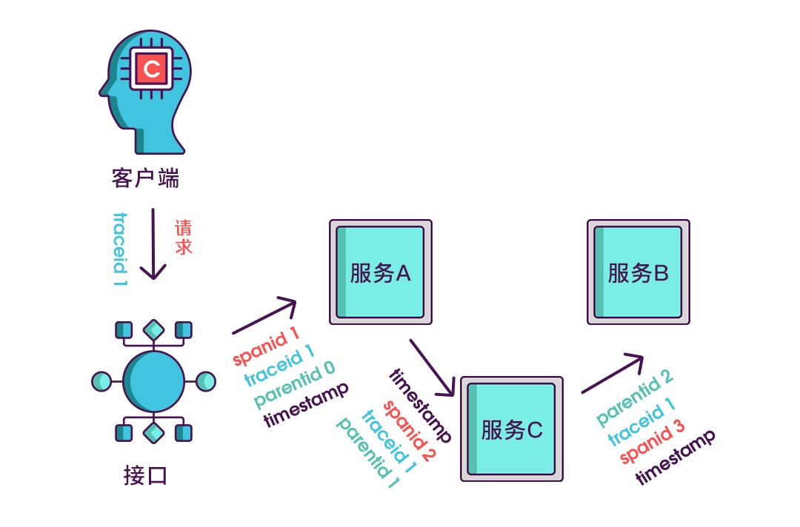

# 2021学习笔记

标签（空格分隔）： 学习

---

* [2021学习笔记](#2021学习笔记)
   * [如何设计一个RPC框架](#如何设计一个rpc框架)
   * [常见数据mock框架](#常见数据mock框架)
      * [Mockito](#mockito)
   * [常用监控系统](#常用监控系统)
   * [linux的inode](#linux的inode)
   * [xxl-job](#xxl-job)
      * [全异步化](#全异步化)
      * [通讯数据加密](#通讯数据加密)
      * [分片广播 &amp; 动态分片](#分片广播--动态分片)
      * [执行器灰度上线](#执行器灰度上线)
   * [jobs](#jobs)
   * [jvm问题定位](#jvm问题定位)
      * [内存持续升高](#内存持续升高)
      * [扩展知识](#扩展知识)
   * [序列化与反序列化](#序列化与反序列化)
   * [mongo的索引](#mongo的索引)
      * [单字段索引](#单字段索引)
      * [复合索引](#复合索引)
   * [mongodb分片](#mongodb分片)
      * [多key索引](#多key索引)
   * [mysql运维-pt工具](#mysql运维-pt工具)
      * [pt-online-schema-change](#pt-online-schema-change)
   * [arthas使用](#arthas使用)
      * [watch命令](#watch命令)
      * [trace命令](#trace命令)
      * [jad命令](#jad命令)
      * [thread命令](#thread命令)
   * [线程安全之合理删除锁](#线程安全之合理删除锁)
   * [docker的networking](#docker的networking)
      * [bridge networks](#bridge-networks)
      * [overlay networks](#overlay-networks)
      * [host networking](#host-networking)
      * [IPvlan networks](#ipvlan-networks)
      * [MACvlan networks](#macvlan-networks)
   * [docker底层技术原理](#docker底层技术原理)
   * [spring event](#spring-event)
      * [应用](#应用)
         * [自定义事件](#自定义事件)
         * [事件的发送方](#事件的发送方)
         * [事件的监听方](#事件的监听方)
         * [异步处理](#异步处理)
         * [基于注解的监听方](#基于注解的监听方)
      * [泛型事件](#泛型事件)
         * [定义泛型事件主体](#定义泛型事件主体)
         * [定义具体的事件主体](#定义具体的事件主体)
         * [定义监听器](#定义监听器)
         * [定义事件的发送方](#定义事件的发送方)
      * [@TransactionalEventListener注解](#transactionaleventlistener注解)
         * [应用](#应用-1)
         * [原理](#原理)
   * [为什么要把Java堆和栈区分出来](#为什么要把java堆和栈区分出来)
   * [微信抢红包设计](#微信抢红包设计)
   * [linux的Filesystem Caching](#linux的filesystem-caching)
   * [linux PID1](#linux-pid1)
      * [docker的进程管理](#docker的进程管理)
      * [僵尸与孤儿进程](#僵尸与孤儿进程)
   * [copyOnWrite](#copyonwrite)
   * [ZGC](#zgc)
   * [java的值传递](#java的值传递)
   * [死锁](#死锁)
      * [顺序性死锁](#顺序性死锁)
      * [饥饿性死锁](#饥饿性死锁)
      * [预防死锁](#预防死锁)
   * [分布式链路追踪](#分布式链路追踪)
      * [链路追踪概述](#链路追踪概述)
         * [基本实现原理](#基本实现原理)
      * [zipkin](#zipkin)
         * [原理](#原理-1)
         * [实际使用](#实际使用)
            * [服务端](#服务端)
            * [客户端](#客户端)
      * [skywalking](#skywalking)
         * [原理](#原理-2)
         * [相关问题](#相关问题)
            * [traceId如何保证全局唯一](#traceid如何保证全局唯一)
            * [如何保证服务上下游采样数据一致性](#如何保证服务上下游采样数据一致性)
            * [实现更细粒度的采样](#实现更细粒度的采样)
         * [实际使用](#实际使用-1)
   * [秒杀相关](#秒杀相关)
   * [Seata分布式事务原理](#seata分布式事务原理)
      * [简介](#简介)
      * [高可用](#高可用)
      * [AT模式](#at模式)
         * [前提](#前提)
         * [整体机制](#整体机制)
         * [工作机制推演](#工作机制推演)
            * [一阶段](#一阶段)
            * [二阶段-回滚](#二阶段-回滚)
            * [二阶段-提交](#二阶段-提交)
         * [写隔离](#写隔离)
         * [读隔离](#读隔离)
   * [保证日志的连续性](#保证日志的连续性)


## 如何设计一个RPC框架

https://cloud.tencent.com/developer/article/1532039

https://zhuanlan.zhihu.com/p/62592174

一个完整的rpc框架设计图如下：


总共分为 3 层：

 - 服务层，Service，其中主要部分就是 **动态代理** ，主要用于将服务提供者的接口封装成远程服务调用。上层的服务接口用于 Spring之类的业务框架使用，也是 Spring 的 bean.
 - 过滤器层，服务调用职责链，提供多种调用切面供框架自身和使用者扩展，例如负载均衡，性能统计，服务调用完成通知，失败重试等。
 - RPC 层，这里就是 RPC 框架的核心部分，包括通信框架，序列化框架，还有用于屏蔽底层通信框架和序列化框架的抽象接口。


当前很多RPC框架都直接基于netty这一IO（NIO，参考[这里](https://github.com/AudiVehicle/learn/blob/master/2018%E5%AD%A6%E4%B9%A0%E7%AC%94%E8%AE%B0%EF%BC%88%E4%BA%8C%EF%BC%89.md#java%E4%B8%AD%E7%9A%84bionioaio)）通信框架，比如阿里巴巴的HSF、dubbo，Hadoop Avro，推荐使用Netty 作为底层通信框架。

## 常见数据mock框架
之所以需要mock数据框架，其实是为了方便单侧能够顺利进行下去，避免依赖方的服务或者网络波动造成单测不过。常见的mock数据框架有以下一些。
###  Mockito
https://www.toutiao.com/a6792424551180403208/

Mockito 是一种 Java Mock 框架，它可以模拟任何 Spring 管理的Bean、模拟方法的返回值、模拟抛出异常等等，同时也会记录调用这些模拟方法的参数、调用顺序，从而可以校验出这个 Mock 对象是否有被正确的顺序调用，以及按照期望的参数被调用。Mockito可以在单元测试中模拟一个 Service 返回的数据，而不会真正去调用该 Service，这就是上面提到的 Mock 测试精神，也就是通过模拟一个假的 Service 对象，来快速的测试当前我想要测试的类。需要指出的是，Mockito是springBoot内置的。


## 常用监控系统
https://www.toutiao.com/a6859620754003231243/

## linux的inode

https://geek-university.com/linux/inode/#:~:text=An%20inode%20is%20a%20data,%2C%20number%20of%20links%2C%20etc.&text=Some%20file%20systems%20(most%20notably,the%20file%20system%20is%20created.

An inode is a data structure that stores various information about a file in Linux, such as the access mode (read, write, execute permissions), ownership, file type, file size, group, number of links, etc. Each inode is identified by an integer number. An inode is assigned to a file when it is created.

Some file systems (most notably ext3) create all inodes when the file system is created. This means that it is possible to run out of storage because all of the inodes are used, although there is available space on the disk. Other file systems (like xfs) create inodes as needed.

You can view a file’s inode number using the ls -il command:


The first number on the left represents the inode number of the file.

总结来说，inode是一个整数，它包含了linux系统内文件的一些信息。且存在inode耗尽的风险「也就是系统产生了太多的文件，这种情况在使用xxl-job调度平台时可能出现，因为它的每一次调度都会生产一个log文件，可以提供设置日志保留天数进行控制」。


  
 
## xxl-job

https://www.xuxueli.com/xxl-job/#/?id=%E3%80%8A%E5%88%86%E5%B8%83%E5%BC%8F%E4%BB%BB%E5%8A%A1%E8%B0%83%E5%BA%A6%E5%B9%B3%E5%8F%B0xxl-job%E3%80%8B

使用`xxl-job`需要注意，每个任务的每次执行都会生产一个log文件，因此需要注意设置log文件的保存天数，避免耗尽机器的inode资源。

`xxl-job`在设计上，将调度器和执行器物理分开，实现解耦，并且有多个执行器时方便注册、移除。底层依赖mysql来实现数据一致性，集群任务调度等。

软件设计架构图如下：


 ### 全异步化
 
 xxl-job之所以性能较好，如上图所示使用了”异步调度队列“，且调度都是线程池异步执行，不会阻塞调度器。
 
 如若需要支撑更多的任务量，可以通过 “调大调度线程数” 、”降低调度中心与执行器ping延迟” 和 “提升机器配置” 几种方式优化。
 
 ### 通讯数据加密
 
调度中心向执行器发送的调度请求时使用RequestModel和ResponseModel两个对象封装调度请求参数和响应数据, 在进行通讯之前底层会将上述两个对象对象序列化，并进行数据协议以及时间戳检验,从而达到数据加密的功能。

### 分片广播 & 动态分片

其实也就是集群内的多个机器可以协调合作，xxl-job在调度时会附带分片参数，各个节点根据具体参数做相应协同处理。
```java
// 可参考Sample示例执行器中的示例任务"ShardingJobHandler"了解试用 
int shardIndex = XxlJobHelper.getShardIndex();
int shardTotal = XxlJobHelper.getShardTotal();
```
该特性适用场景如：

 1. 分片任务场景：10个执行器的集群来处理10w条数据，每台机器只需要处理1w条数据，耗时降低10倍；
 2. 广播任务场景：广播执行器机器运行shell脚本、广播集群节点进行缓存更新等

### 执行器灰度上线
调度中心与业务解耦，只需部署一次后常年不需要维护。但是，执行器中托管运行着业务作业，作业上线和变更需要重启执行器，尤其是Bean模式任务。
执行器重启可能会中断运行中的任务。但是，XXL-JOB得益于自建执行器与自建注册中心，可以通过灰度上线的方式，避免因重启导致的任务中断的问题。

步骤如下：

 1. 执行器改为手动注册，下线一半机器列表（A组），线上运行另一半机器列表（B组）；
 2. 等待A组机器任务运行结束并编译上线；执行器注册地址替换为A组；
 3. 等待B组机器任务运行结束并编译上线；执行器注册地址替换为A组+B组；

操作结束；
 
## jobs

https://github.com/baomidou/jobs

## jvm问题定位

### 内存持续升高

之前写过一篇类似的[笔记](https://github.com/AudiVehicle/learn/blob/master/2018%E5%AD%A6%E4%B9%A0%E7%AC%94%E8%AE%B0%E4%B8%80.md#jvm%E6%80%A7%E8%83%BD%E5%88%86%E6%9E%90)，只是当时工作经验尚浅，相关的场景都是自己虚构出来的，正好最近工作中碰到了一个jvm频繁GC的场景。这里记录一下，顺便扩展一些定位jvm问题的方法。

java启动参数配置如下：
```java
-Xmx500m -Xms500m -Xmn200m -XX:MetaspaceSize=200m -XX:+HeapDumpOnOutOfMemoryError -XX:HeapDumpPath=/app/dump -XX:+PrintGCDetails -XX:+PrintGCTimeStamps -XX:+PrintGCDateStamps -Xloggc:/app/gc.log
```

堆总共500MB，新老年代四六开。

出问题的服务运行在docker容器里，当时的gc.log显示在频繁gc，部分gc日志如下:
```java
2021-03-31T15:35:06.111+0800: 213.167: [GC (Allocation Failure) [PSYoungGen: 186496K->608K(195072K)] 354529K->169193K(502272K), 0.0066992 secs] [Times: user=0.02 sys=0.00, real=0.00 secs]
2021-03-31T15:35:06.199+0800: 213.255: [GC (Allocation Failure) [PSYoungGen: 140216K->480K(196096K)] 308802K->169617K(503296K), 0.0059172 secs] [Times: user=0.01 sys=0.00, real=0.00 secs]
2021-03-31T15:35:06.240+0800: 213.296: [GC (Allocation Failure) [PSYoungGen: 156575K->64K(196096K)] 325712K->245852K(503296K), 0.0194347 secs] [Times: user=0.07 sys=0.00, real=0.02 secs]
2021-03-31T15:35:06.260+0800: 213.315: [Full GC (Ergonomics) [PSYoungGen: 64K->0K(196096K)] [ParOldGen: 245788K->244257K(307200K)] 245852K->244257K(503296K), [Metaspace: 88483K->88483K(1130496K)], 0.4435924 secs] [Times: user=1.43 sys=0.00, real=0.44 secs]
2021-03-31T15:35:07.092+0800: 214.148: [Full GC (Ergonomics) [PSYoungGen: 187392K->91176K(196096K)] [ParOldGen: 244257K->244220K(307200K)] 431649K->335397K(503296K), [Metaspace: 88498K->88498K(1130496K)], 0.2772581 secs] [Times: user=0.82 sys=0.01, real=0.28 secs]
2021-03-31T15:35:07.562+0800: 214.617: [Full GC (Ergonomics) [PSYoungGen: 187392K->104710K(196096K)] [ParOldGen: 244220K->237493K(307200K)] 431612K->342203K(503296K), [Metaspace: 88505K->87984K(1130496K)], 0.5754444 secs] [Times: user=1.62 sys=0.01, real=0.57 secs]
2021-03-31T15:35:08.220+0800: 215.275: [GC (Allocation Failure) --[PSYoungGen: 187392K->187392K(196096K)] 424885K->448053K(503296K), 0.0725529 secs] [Times: user=0.18 sys=0.00, real=0.07 secs]
2021-03-31T15:35:08.292+0800: 215.348: [Full GC (Ergonomics) [PSYoungGen: 187392K->92179K(196096K)] [ParOldGen: 260661K->260445K(307200K)] 448053K->352625K(503296K), [Metaspace: 87988K->87988K(1130496K)], 0.4784765 secs] [Times: user=1.47 sys=0.02, real=0.48 secs]
2021-03-31T15:35:08.879+0800: 215.935: [Full GC (Ergonomics) [PSYoungGen: 187392K->108223K(196096K)] [ParOldGen: 260445K->260445K(307200K)] 447837K->368669K(503296K), [Metaspace: 87996K->87996K(1130496K)], 0.2886663 secs] [Times: user=0.81 sys=0.01, real=0.29 secs]
2021-03-31T15:35:09.243+0800: 216.299: [Full GC (Ergonomics) [PSYoungGen: 187392K->118197K(196096K)] [ParOldGen: 260445K->260445K(307200K)] 447837K->378643K(503296K), [Metaspace: 87999K->87999K(1130496K)], 0.2986136 secs] [Times: user=0.90 sys=0.00, real=0.30 secs]
2021-03-31T15:35:09.616+0800: 216.672: [Full GC (Ergonomics) [PSYoungGen: 187392K->126841K(196096K)] [ParOldGen: 260445K->260445K(307200K)] 447837K->387287K(503296K), [Metaspace: 88010K->88010K(1130496K)], 0.3403196 secs] [Times: user=0.99 sys=0.01, real=0.34 secs]
2021-03-31T15:35:10.015+0800: 217.071: [Full GC (Ergonomics) [PSYoungGen: 187392K->134800K(196096K)] [ParOldGen: 260445K->260445K(307200K)] 447837K->395245K(503296K), [Metaspace: 88020K->88020K(1130496K)], 0.3248060 secs] [Times: user=1.02 sys=0.00, real=0.33 secs]
2021-03-31T15:35:10.376+0800: 217.432: [Full GC (Ergonomics) [PSYoungGen: 187392K->148816K(196096K)] [ParOldGen: 260445K->260445K(307200K)] 447837K->409262K(503296K), [Metaspace: 88024K->88024K(1130496K)], 0.3309422 secs] [Times: user=1.03 sys=0.01, real=0.34 secs]
2021-03-31T15:35:10.747+0800: 217.803: [Full GC (Ergonomics) [PSYoungGen: 187392K->153632K(196096K)] [ParOldGen: 260445K->260445K(307200K)] 447837K->414077K(503296K), [Metaspace: 88031K->88031K(1130496K)], 0.3504541 secs] [Times: user=1.07 sys=0.00, real=0.34 secs]
2021-03-31T15:35:11.143+0800: 218.199: [Full GC (Ergonomics) [PSYoungGen: 187392K->157742K(196096K)] [ParOldGen: 260445K->260444K(307200K)] 447837K->418187K(503296K), [Metaspace: 88044K->88044K(1130496K)], 0.3811518 secs] [Times: user=1.22 sys=0.01, real=0.38 secs]
2021-03-31T15:35:11.566+0800: 218.621: [Full GC (Ergonomics) [PSYoungGen: 187392K->161488K(196096K)] [ParOldGen: 260446K->260444K(307200K)] 447838K->421933K(503296K), [Metaspace: 88044K->88044K(1130496K)], 0.3678264 secs] [Times: user=1.16 sys=0.00, real=0.37 secs]
2021-03-31T15:35:11.960+0800: 219.016: [Full GC (Ergonomics) [PSYoungGen: 187392K->164661K(196096K)] [ParOldGen: 260484K->260444K(307200K)] 447876K->425106K(503296K), [Metaspace: 88048K->88048K(1130496K)], 0.3735822 secs] [Times: user=1.09 sys=0.00, real=0.37 secs]
2021-03-31T15:35:12.368+0800: 219.423: [Full GC (Ergonomics) [PSYoungGen: 187392K->167482K(196096K)] [ParOldGen: 260446K->260443K(307200K)] 447838K->427925K(503296K), [Metaspace: 88056K->88056K(1130496K)], 0.4205702 secs] [Times: user=1.26 sys=0.06, real=0.42 secs]
2021-03-31T15:35:12.829+0800: 219.884: [Full GC (Ergonomics) [PSYoungGen: 187392K->170533K(196096K)] [ParOldGen: 260443K->260442K(307200K)] 447835K->430976K(503296K), [Metaspace: 88057K->88057K(1130496K)], 0.4452220 secs] [Times: user=1.23 sys=0.01, real=0.44 secs]
2021-03-31T15:35:13.291+0800: 220.347: [Full GC (Ergonomics) [PSYoungGen: 186420K->50140K(196096K)] [ParOldGen: 260442K->306599K(307200K)] 446863K->356740K(503296K), [Metaspace: 88060K->88060K(1130496K)], 0.4181651 secs] [Times: user=1.23 sys=0.04, real=0.42 secs]
2021-03-31T15:35:14.320+0800: 221.376: [Full GC (Ergonomics) [PSYoungGen: 187392K->0K(196096K)] [ParOldGen: 306599K->216046K(307200K)] 493991K->216046K(503296K), [Metaspace: 88188K->88188K(1130496K)], 0.5243270 secs] [Times: user=1.42 sys=0.02, real=0.52 secs]
2021-03-31T15:35:15.542+0800: 222.597: [GC (Allocation Failure) [PSYoungGen: 186561K->8169K(173056K)] 402607K->251009K(480256K), 0.0469452 secs] [Times: user=0.17 sys=0.00, real=0.05 secs]
2021-03-31T15:35:15.589+0800: 222.644: [Full GC (Ergonomics) [PSYoungGen: 8169K->0K(173056K)] [ParOldGen: 242840K->234702K(307200K)] 251009K->234702K(480256K), [Metaspace: 88297K->88297K(1132544K)], 0.5457457 secs] [Times: user=1.47 sys=0.02, real=0.54 secs]
2021-03-31T15:35:16.528+0800: 223.584: [GC (Allocation Failure) [PSYoungGen: 164864K->19964K(184832K)] 399566K->257819K(492032K), 0.0763537 secs] [Times: user=0.28 sys=0.00, real=0.07 secs]
2021-03-31T15:35:16.880+0800: 223.935: [GC (Allocation Failure) [PSYoungGen: 184828K->19949K(148992K)] 422683K->284113K(456192K), 0.0941438 secs] [Times: user=0.34 sys=0.00, real=0.09 secs]
2021-03-31T15:35:16.974+0800: 224.030: [Full GC (Ergonomics) [PSYoungGen: 19949K->0K(148992K)] [ParOldGen: 264164K->281356K(307200K)] 284113K->281356K(456192K), [Metaspace: 88363K->88363K(1132544K)], 0.6657784 secs] [Times: user=1.93 sys=0.01, real=0.67 secs]
2021-03-31T15:35:17.883+0800: 224.939: [Full GC (Ergonomics) [PSYoungGen: 120597K->0K(148992K)] [ParOldGen: 281356K->291678K(307200K)] 401953K->291678K(456192K), [Metaspace: 88384K->88384K(1132544K)], 0.4932868 secs] [Times: user=1.38 sys=0.01, real=0.49 secs]
2021-03-31T15:35:18.597+0800: 225.653: [Full GC (Ergonomics) [PSYoungGen: 124605K->0K(148992K)] [ParOldGen: 305430K->128701K(307200K)] 430036K->128701K(456192K), [Metaspace: 88434K->88434K(1132544K)], 0.2604503 secs] [Times: user=0.56 sys=0.01, real=0.26 secs]
2021-03-31T15:35:19.085+0800: 226.141: [Full GC (Ergonomics) [PSYoungGen: 128308K->0K(148992K)] [ParOldGen: 293752K->88718K(307200K)] 422060K->88718K(456192K), [Metaspace: 88710K->88710K(1132544K)], 0.1838160 secs] [Times: user=0.50 sys=0.01, real=0.19 secs]
2021-03-31T15:35:19.311+0800: 226.367: [GC (Allocation Failure) [PSYoungGen: 101857K->27668K(157184K)] 190576K->157659K(464384K), 0.0105178 secs] [Times: user=0.03 sys=0.00, real=0.01 secs]
2021-03-31T15:35:19.356+0800: 226.411: [GC (Allocation Failure) [PSYoungGen: 140254K->27636K(158208K)] 270244K->212709K(465408K), 0.0174558 secs] [Times: user=0.05 sys=0.00, real=0.02 secs]
2021-03-31T15:35:19.425+0800: 226.480: [GC (Allocation Failure) [PSYoungGen: 140589K->27636K(144384K)] 325663K->240251K(451584K), 0.0175352 secs] [Times: user=0.06 sys=0.00, real=0.02 secs]
2021-03-31T15:35:19.673+0800: 226.729: [GC (Allocation Failure) [PSYoungGen: 127080K->41486K(145408K)] 339695K->254101K(452608K), 0.0556269 secs] [Times: user=0.06 sys=0.01, real=0.06 secs]
2021-03-31T15:35:19.808+0800: 226.864: [GC (Allocation Failure) [PSYoungGen: 140691K->41454K(140800K)] 353306K->254069K(448000K), 0.0088234 secs] [Times: user=0.03 sys=0.00, real=0.00 secs]
2021-03-31T15:35:19.846+0800: 226.902: [GC (Allocation Failure) [PSYoungGen: 113769K->55210K(128512K)] 326383K->281580K(435712K), 0.0141156 secs] [Times: user=0.04 sys=0.00, real=0.02 secs]
2021-03-31T15:35:19.906+0800: 226.962: [GC (Allocation Failure) [PSYoungGen: 125866K->34688K(137728K)] 352236K->261058K(444928K), 0.0160418 secs] [Times: user=0.04 sys=0.00, real=0.01 secs]
2021-03-31T15:35:21.843+0800: 228.898: [GC (Allocation Failure) [PSYoungGen: 105344K->41582K(135680K)] 331714K->267960K(442880K), 0.0113325 secs] [Times: user=0.03 sys=0.00, real=0.01 secs]
2021-03-31T15:35:32.786+0800: 239.842: [GC (Allocation Failure) [PSYoungGen: 110190K->14186K(136704K)] 336568K->268160K(443904K), 0.0126607 secs] [Times: user=0.03 sys=0.00, real=0.01 secs]
2021-03-31T15:35:32.799+0800: 239.855: [Full GC (Ergonomics) [PSYoungGen: 14186K->0K(136704K)] [ParOldGen: 253973K->75251K(307200K)] 268160K->75251K(443904K), [Metaspace: 89490K->89490K(1132544K)], 0.1554257 secs] [Times: user=0.39 sys=0.01, real=0.15 secs]
2021-03-31T15:35:44.854+0800: 251.910: [GC (Allocation Failure) [PSYoungGen: 68608K->272K(137728K)] 143859K->75531K(444928K), 0.0051200 secs] [Times: user=0.01 sys=0.01, real=0.01 secs]
2021-03-31T15:37:07.633+0800: 334.689: [GC (Allocation Failure) [PSYoungGen: 70928K->480K(137728K)] 146187K->75747K(444928K), 0.0058751 secs] [Times: user=0.01 sys=0.00, real=0.01 secs]
2021-03-31T15:40:01.325+0800: 508.380: [GC (Allocation Failure) [PSYoungGen: 71136K->7929K(140800K)] 146403K->83204K(448000K), 0.0112032 secs] [Times: user=0.02 sys=0.00, real=0.01 secs]
```
从日志可以看出youngGC特别频繁，大概50ms就有一次。Full GC也非常频繁，并且通过日志可以发现FGC其实并没有能够成功的释放空间。

出现这种情况，要么出现了死循环往容器add元素，要么就是某些操作很频繁且很耗时。此时，进入docker容器，准备dump一份堆文件。

登录到目标服务器，`docker ps`定位到具体容器`id`，`docker exec`进入容器。`jps`查看java进程`id`。

难道进程id，直接：
```java
jmap -dump:format=b,file=1.hprof 11459
```

然后怎么把1.dump这个文件拿到本机来分析？

`docker ps`找到docker的`CONTAINER ID`，然后`docker inspect xxx`，即可查看容器的详细信息，定位到`overlay`关键字，即可找到docker容器对应在宿主机上的位置，如下图所示：


然后cd到响应目录，比如我这里是`/var/lib/docker/overlay2/37bd7e283b0c52bb675d84e380353da9b2370cc9e4a53f4db8df1c4f4eda3097/merged`，至于如何将宿主机的dump文件拿到本地，可以使用python命令直接在当前目录启动一个web容器，也可以通过file-ladder等工具，都行。

文件拿到本地以后，使用mat工具打开，详细过程可以参考[这里](https://github.com/AudiVehicle/learn/blob/master/2018%E5%AD%A6%E4%B9%A0%E7%AC%94%E8%AE%B0%E4%B8%80.md#jvm%E5%86%85%E5%AD%98%E6%B3%84%E6%BC%8F%E6%A3%80%E6%B5%8Bcpu%E4%BD%BF%E7%94%A8%E6%AD%A3%E5%B8%B8%E4%BD%86%E6%98%AF%E5%86%85%E5%AD%98%E5%8D%A0%E7%94%A8%E6%8C%81%E7%BB%AD%E5%A2%9E%E9%AB%98)。

如下图所示：


第一二项是jdk及spring的应该不是问题所在，结合elk的业务日志，发现gc的同时，数据库相关的业务日志输出的特别多，达到了1min上千条的量，并且有同事提醒这个系统有一个5min的定时自动提交的任务，基本可以定位是数据库相关操作耗费了大部分的内存。

本地debug发现，该定时任务在执行过程中有可能会因为数据问题抛出异常，但是却没有加相关事务来进行db回滚操作，导致代码后面每次进入定时task的时候每次都会往db插入数据，且量比较大，导致相关定时task耗时越来越久久，且由于出问题的环境本身就存在部分脏数据导致sql执行的情况更糟。

解决办法：

1、在相关定时task增加事务注解；
2、关闭mysql-plus的sql日志打印
3、删除脏数据

问题得到解决。

### 扩展知识

https://bbs.huaweicloud.com/blogs/119727

```java
jmap -histo 1 |more 
```
输出信息类如下：
```java
root@e088f8a23ccc:/# jmap -histo 1 |more

 num     #instances         #bytes  class name
----------------------------------------------
   1:        180912       19625624  [C
   2:         29892       10604256  [I
   3:         65973        5805624  java.lang.reflect.Method
   4:        145566        4658112  java.util.concurrent.ConcurrentHashMap$Node
   5:        173617        4166808  java.lang.String
   6:         13803        3002112  [B
   7:           802        2648448  [J
   8:         61053        2442120  java.util.LinkedHashMap$Entry
   9:         43249        2381464  [Ljava.lang.Object;
  10:         20054        2206360  java.lang.Class
  11:         23638        2159504  [Ljava.util.HashMap$Node;
  12:           960        2003728  [Ljava.util.concurrent.ConcurrentHashMap$Node;
  13:         61462        1966784  java.util.HashMap$Node
  14:         31912        1531776  org.aspectj.weaver.reflect.ShadowMatchImpl
  15:         26907        1506792  java.util.LinkedHashMap
  16:         49010        1066416  [Ljava.lang.Class;
  17:         31912        1021184  org.aspectj.weaver.patterns.ExposedState
```
jmap -histo显示的对象含义：
```java
[C 代表  char[]
[S 代表 short[]
[I 代表 int[]
[B 代表 byte[]
[[I 代表 int[][]
```

## 序列化与反序列化

https://tech.meituan.com/2015/02/26/serialization-vs-deserialization.html

## mongo的索引

https://mongoing.com/archives/2797

类似于mysql，mongo也可以通过创建索引从而加快查询的速度。MongoDB支持多种类型的索引，包括单字段索引、复合索引、多key索引、文本索引等，每种类型的索引有不同的使用场合。

### 单字段索引

这个没什么好说的，就是针对特定某个字段创建索引。MongoDB默认创建的id索引也是这种类型。

### 复合索引

复合索引，个人感觉这个其实是和mysql的复合索引很类似的，之所以这么说，除了它也是几个字段合起来代表一个索引外，mongo的复合索引也具有最左匹配的特性。

```shell
db.getCollection('recordDetail').createIndex( {playerId: 1, objectMockId: 1, configMockId: 1, gameId:1 }) 
```
以上语句创建了一个复合索引，1表示升序，-1表示降序。

```shell
db.getCollection('recordDetail').getIndexes()
```
通过上面语句可以查询mongo已有的index，结果如下：
```shell
/* 1 */
[
    {
        "v" : 2,
        "key" : {
            "_id" : 1
        },
        "name" : "_id_",
        "ns" : "elf.recordDetail"
    },
    {
        "v" : 2,
        "key" : {
            "playerId" : 1.0,
            "objectMockId" : 1.0,
            "configMockId" : 1.0,
            "gameId" : 1.0
        },
        "name" : "playerId_1_objectMockId_1_configMockId_1_gameId_1",
        "ns" : "elf.recordDetail"
    }
]
```

在未创建索引的情况下，执行下面的查询语句，explain结果如下：
```shell
/* 1 */
{
    "queryPlanner" : {
        "plannerVersion" : 1,
        "namespace" : "elf.recordDetail",
        "indexFilterSet" : false,
        "parsedQuery" : {
            "$and" : [ 
                {
                    "configMockId" : {
                        "$eq" : 4.0
                    }
                }, 
                {
                    "gameId" : {
                        "$eq" : "1038"
                    }
                }, 
                {
                    "objectMockId" : {
                        "$eq" : "8f542b17061c43bdbd8ff6bfae9fe682"
                    }
                }, 
                {
                    "playerId" : {
                        "$eq" : "461681"
                    }
                }
            ]
        },
        "queryHash" : "59EC97F5",
        "planCacheKey" : "59EC97F5",
        "winningPlan" : {
            "stage" : "COLLSCAN",
            "filter" : {
                "$and" : [ 
                    {
                        "configMockId" : {
                            "$eq" : 4.0
                        }
                    }, 
                    {
                        "gameId" : {
                            "$eq" : "1038"
                        }
                    }, 
                    {
                        "objectMockId" : {
                            "$eq" : "8f542b17061c43bdbd8ff6bfae9fe682"
                        }
                    }, 
                    {
                        "playerId" : {
                            "$eq" : "461681"
                        }
                    }
                ]
            },
            "direction" : "forward"
        },
        "rejectedPlans" : []
    },
    "serverInfo" : {
        "host" : "bd7ed6d76ccb",
        "port" : 27017,
        "version" : "4.2.9",
        "gitVersion" : "06402114114ffc5146fd4b55402c96f1dc9ec4b5"
    },
    "ok" : 1.0,
    "$clusterTime" : {
        "clusterTime" : Timestamp(1619778017, 1),
        "signature" : {
            "hash" : { "$binary" : "AAAAAAAAAAAAAAAAAAAAAAAAAAA=", "$type" : "00" },
            "keyId" : NumberLong(0)
        }
    },
    "operationTime" : Timestamp(1619778017, 1)
}
```

https://mongoing.com/eshu_explain3

`COLLSCAN`代表查询的过程是全表扫描，在创建索引以后就会变成下面这种结果：
```shell
/* 1 */
{
    "queryPlanner" : {
        "plannerVersion" : 1,
        "namespace" : "elf.recordDetail",
        "indexFilterSet" : false,
        "parsedQuery" : {
            "$and" : [ 
                {
                    "configMockId" : {
                        "$eq" : 4.0
                    }
                }, 
                {
                    "gameId" : {
                        "$eq" : "1038"
                    }
                }, 
                {
                    "objectMockId" : {
                        "$eq" : "8f542b17061c43bdbd8ff6bfae9fe682"
                    }
                }, 
                {
                    "playerId" : {
                        "$eq" : "461681"
                    }
                }
            ]
        },
        "queryHash" : "59EC97F5",
        "planCacheKey" : "5877D7BE",
        "winningPlan" : {
            "stage" : "FETCH",
            "inputStage" : {
                "stage" : "IXSCAN",
                "keyPattern" : {
                    "playerId" : 1.0,
                    "objectMockId" : 1.0,
                    "configMockId" : 1.0,
                    "gameId" : 1.0
                },
                "indexName" : "playerId_1_objectMockId_1_configMockId_1_gameId_1",
                "isMultiKey" : false,
                "multiKeyPaths" : {
                    "playerId" : [],
                    "objectMockId" : [],
                    "configMockId" : [],
                    "gameId" : []
                },
                "isUnique" : false,
                "isSparse" : false,
                "isPartial" : false,
                "indexVersion" : 2,
                "direction" : "forward",
                "indexBounds" : {
                    "playerId" : [ 
                        "[\"461681\", \"461681\"]"
                    ],
                    "objectMockId" : [ 
                        "[\"8f542b17061c43bdbd8ff6bfae9fe682\", \"8f542b17061c43bdbd8ff6bfae9fe682\"]"
                    ],
                    "configMockId" : [ 
                        "[4.0, 4.0]"
                    ],
                    "gameId" : [ 
                        "[\"1038\", \"1038\"]"
                    ]
                }
            }
        },
        "rejectedPlans" : []
    },
    "serverInfo" : {
        "host" : "bd7ed6d76ccb",
        "port" : 27017,
        "version" : "4.2.9",
        "gitVersion" : "06402114114ffc5146fd4b55402c96f1dc9ec4b5"
    },
    "ok" : 1.0,
    "$clusterTime" : {
        "clusterTime" : Timestamp(1619778209, 1),
        "signature" : {
            "hash" : { "$binary" : "AAAAAAAAAAAAAAAAAAAAAAAAAAA=", "$type" : "00" },
            "keyId" : NumberLong(0)
        }
    },
    "operationTime" : Timestamp(1619778209, 1)
}
```
可以看到，查询过程以及走了索引


## mongodb分片

- https://www.mongodb.org.cn/tutorial/21.html

本质上来说，和其他分布式中间件的分片大同小异，基本都是一个集群内的机器，每个机器负责存储部分数据（这一点在redis的cluster集群中也有体现），唯一可能不同的就是数据的分片方式，以及查询操作时，如何定位到需要查询的数据等。


### 多key索引

其实就是需要创建索引的字段不是简单类型，是一个数组。此时针对这个字段的索引就是多key索引。

## mysql运维-pt工具

https://www.cnblogs.com/keme/p/10237590.html

https://www.percona.com/doc/percona-toolkit/LATEST/index.html

Percona Toolkit简称pt工具—PT-Tools，是Percona公司开发用于管理MySQL的工具，功能包括检查主从复制的数据一致性、检查重复索引、定位IO占用高的表文件、在线DDL等。从[官网](https://www.percona.com/downloads/percona-toolkit/LATEST/)来看，目前仅可运行在centos、ubuntu、debian等linux发行版系统上。

### pt-online-schema-change

在线DDL操作，对上亿的大表加索引加字段且对生产无影响 

主要工作原理： 

 1. 创建一个和要执行 alter 操作的表一样的新的空表结构(是alter之前的结构)
 2. 在新表执行alter table 语句（速度应该很快）
 2. 在原表中创建触发器3个触发器分别对应insert,update,delete操作
 4. 以一定块大小从原表拷贝数据到临时表，拷贝过程中通过原表上的触发器在原表进行的写操作都会更新到新建的临时表 
 5. Rename 原表到old表中，在把临时表Rename为原表 
 6. 如果有参考该表的外键，根据alter-foreign-keys-method参数的值，检测外键相关的表，做相应设置的处理
 7. 默认最后将旧原表删除 

**如果执行失败了，或手动停止了，需要手动删除下划线开头的表(_表名)及三个触发器**

pt-query-digst可以分析慢查询日志；

pt-kill杀掉指定的进程；

pt-table-checksum & pt-table-sync—–检查主从是否一致性—–检查主从不一致之后用这个工具进行处理，这两个工具一般搭配使用


## arthas使用

- https://arthas.aliyun.com/doc/watch.html#id1

安装相对简单，就是下载arthas的jar文件，然后直接java -jar启动即可，如下所示：
```shell
curl -O https://arthas.aliyun.com/arthas-boot.jar
java -jar arthas-boot.jar
```
### watch命令
- https://arthas.aliyun.com/doc/watch.html

命令`watch`，可以监控某个类的某个方法的出入参数，如下所示：
```shell
watch com.xxx.web.invoice.workflow.api.controller.EserController executeUrl "{params,returnObj}" -x 2
Press Q or Ctrl+C to abort.
Affect(class count: 1 , method count: 1) cost in 66 ms, listenerId: 2
method=com.xx.web.xx.workflow.api.controller.EsignUserController.executeUrl location=AtExit
ts=2021-05-10 19:24:54; [cost=630.683337ms] result=@ArrayList[
    @Object[][
        @String[6ff39bf5eccb4axxx934fcd73fbe89971],
        @String[44933b24aexxdfa15861bbc12f3c55],
    ],
    @GenericResult[
        data=@EsignExecuteUrl[EsignExecuteUrl(url=https://h5.esign.cn/guide?context=&flo&organ=false&a=1&bizType=1&tsign_source_type=SIGN_LINK_XUANYUAN&tsign_source_detail=1vGqUyZBm8k4aIosrZzTBwTRKUeb7lQUr1HcPKPPBFcV2i%2FZ%%2F7B9OPeWAANgPN8NtdSfwIssOatVm69waVk8e6uKwP2nXQaaa0JJl5txnoIVI4%2Bvn%2ByRiEdX%2Fu7xcegQ3DlwOkAjGRN4fV3oUUHdt5n2vPuiHCucto07m8JZQVfarGlfSKSm%2FzfzVLcMq%2FMKdzsOtFxc2WVCKnFyg19cEsNY4uXZQTww5RPDq50Qu, shortUrl=https://t.xxx.cn/9LYafUFSIvym)],
        success=@Boolean[true],
        code=null,
        message=null,
    ],
]
```

`@Object`就是入参信息，`@GenericResult`是出参信息。

其帮助信息也很丰富：
```shell
[arthas@5754]$ watch -h
 USAGE:
   watch [-b] [-e] [--exclude-class-pattern <value>] [-x <value>] [-f] [-h] [-n <value>] [--listenerId <value>] [-E] [-M <value>] [-s] [-v] class-pattern method-pattern [express] [condition-express]

 SUMMARY:
   Display the input/output parameter, return object, and thrown exception of specified method invocation
   The express may be one of the following expression (evaluated dynamically):
           target : the object
            clazz : the object's class
           method : the constructor or method
           params : the parameters array of method
     params[0..n] : the element of parameters array
        returnObj : the returned object of method
         throwExp : the throw exception of method
         isReturn : the method ended by return
          isThrow : the method ended by throwing exception
            #cost : the execution time in ms of method invocation
 Examples:
   watch -b org.apache.commons.lang.StringUtils isBlank params
   watch -f org.apache.commons.lang.StringUtils isBlank returnObj
   watch org.apache.commons.lang.StringUtils isBlank '{params, target, returnObj}' -x 2
   watch -bf *StringUtils isBlank params
   watch *StringUtils isBlank params[0]
   watch *StringUtils isBlank params[0] params[0].length==1
   watch *StringUtils isBlank params '#cost>100'
   watch -E -b org\.apache\.commons\.lang\.StringUtils isBlank params[0]
   watch javax.servlet.Filter * --exclude-class-pattern com.demo.TestFilter

 WIKI:
   https://arthas.aliyun.com/doc/watch

 OPTIONS:
 -b, --before                                                        Watch before invocation
 -e, --exception                                                     Watch after throw exception
     --exclude-class-pattern <value>                                 exclude class name pattern, use either '.' or '/' as separator
 -x, --expand <value>                                                Expand level of object (1 by default)
 -f, --finish                                                        Watch after invocation, enable by default
 -h, --help                                                          this help
 -n, --limits <value>                                                Threshold of execution times
     --listenerId <value>                                            The special listenerId
 -E, --regex                                                         Enable regular expression to match (wildcard matching by default)
 -M, --sizeLimit <value>                                             Upper size limit in bytes for the result (10 * 1024 * 1024 by default)
 -s, --success                                                       Watch after successful invocation
 -v, --verbose                                                       Enables print verbose information, default value false.
 <class-pattern>                                                     The full qualified class name you want to watch
 <method-pattern>                                                    The method name you want to watch
 <express>                                                           the content you want to watch, written by ognl.
                                                                     Examples:
                                                                       params
                                                                       params[0]
                                                                       'params[0]+params[1]'
                                                                       '{params[0], target, returnObj}'
                                                                       returnObj
                                                                       throwExp
                                                                       target
                                                                       clazz
                                                                       method

 <condition-express>                                                 Conditional expression in ognl style, for example:
                                                                       TRUE  : 1==1
                                                                       TRUE  : true
                                                                       FALSE : false
                                                                       TRUE  : 'params.length>=0'
                                                                       FALSE : 1==2
```

可以使用如下命令查看查看当前对象中的属性值：
```shell
watch com.xx.web.invoice.workflow.api.controller.EUsxxxxController executeUrl "target"  -x 2
```
以及可以指定想查看target下指定参数的值：

```shell
watch com.xx.web.invoice.workflow.api.controller.EUsxxxxController executeUrl "target.field_name"
```
### trace命令
- https://arthas.aliyun.com/doc/trace.html

trace命令可以很方便的查看制定方法的运行流程及相关步骤的耗时情况，如下所示，可以借助于这个指令定位性能问题。
```java
[arthas@1]$ trace com.xxx.web.ark.bff.api.controller.GameInformationController briefMaps
Press Q or Ctrl+C to abort.
Affect(class count: 2 , method count: 2) cost in 225 ms, listenerId: 9
`---ts=2021-08-28 17:43:57;thread_name=http-nio-8080-exec-11;id=1b5;is_daemon=true;priority=5;TCCL=org.springframework.boot.web.embedded.tomcat.TomcatEmbeddedWebappClassLoader@2eced48b
    `---[3.347805ms] com.xxx.web.ark.bff.api.controller.GameInformationController$$EnhancerBySpringCGLIB$$afa903b0:briefMaps()
        `---[3.266548ms] org.springframework.cglib.proxy.MethodInterceptor:intercept()
            `---[3.050708ms] com.xxx.web.ark.bff.api.controller.GameInformationController:briefMaps()
                +---[0.085792ms] org.slf4j.Logger:info() #355
                `---[2.886712ms] com.xxx.web.ark.bff.api.intergration.RequestGsClient:briefMaps() #356
```

### jad命令
- https://arthas.aliyun.com/doc/jad.html

有的时候，我们可能会有这种感觉，就是明明代码已经提交打包部署了，但是执行的结果可能就是和我们的不一样，这时候就会怀疑代码是不是最新的或者是不是我们想要部署的，这个时候jad命令就排上用处了，可以直接反编译某个类(或者某个具体的方法)：
```java
[arthas@1]$ jad com.xxx.web.ark.bff.api.controller.GameInformationController briefMaps

ClassLoader:
+-org.springframework.boot.loader.LaunchedURLClassLoader@5674cd4d
  +-sun.misc.Launcher$AppClassLoader@70dea4e
    +-sun.misc.Launcher$ExtClassLoader@3836a177

Location:
file:/app/app.jar!/BOOT-INF/classes!/

        @ApiOperation(value="获取项目组的逻辑服务器")
        @GetMapping(value={"brief_maps"})
        public GenericResult<List<MapDTO>> briefMaps(@ApiParam(value="游戏Id") @RequestHeader(name="gameId") String gameId, @ApiParam(value="大区Id") @RequestHeader(name="regionId", required=false, defaultValue="") String regionId, @ApiParam(value="是否刷新") @RequestParam(name="refresh", required=false, defaultValue="false") Boolean refresh) {
/*355*/     log.info("received briefMaps request. gameId = {}, regionId = {}, refresh = {}", new Object[]{gameId, regionId, refresh});
/*356*/     return this.requestGsClient.briefMaps(gameId, regionId, refresh);
        }

Affect(row-cnt:4) cost in 678 ms.
```

### thread命令

- https://arthas.aliyun.com/doc/thread.html

这个命令主要用来查看一些线程的信息，比如展示当前最忙的前2个线程并打印堆栈:
```java
[arthas@1]$ thread -n 2
"C1 CompilerThread2" [Internal] cpuUsage=1.04% deltaTime=2ms time=31343ms


"C2 CompilerThread0" [Internal] cpuUsage=1.01% deltaTime=2ms time=109998ms
```

比如查看当前服务的线程的阻塞情况，这里展示了一个我们的某个业务服务卡住时，我使用thread命令得到的结果：
```java
[arthas@1]$ thread -b
"http-nio-8080-exec-10" Id=44 WAITING on java.util.stream.ForEachOps$ForEachTask@12378bb1
    at java.lang.Object.wait(Native Method)
    -  waiting on java.util.stream.ForEachOps$ForEachTask@12378bb1
    at java.util.concurrent.ForkJoinTask.externalAwaitDone(ForkJoinTask.java:334)
    at java.util.concurrent.ForkJoinTask.doInvoke(ForkJoinTask.java:405)
    at java.util.concurrent.ForkJoinTask.invoke(ForkJoinTask.java:734)
    at java.util.stream.ForEachOps$ForEachOp.evaluateParallel(ForEachOps.java:159)
    at java.util.stream.ForEachOps$ForEachOp$OfRef.evaluateParallel(ForEachOps.java:173)
    at java.util.stream.AbstractPipeline.evaluate(AbstractPipeline.java:233)
    at java.util.stream.ReferencePipeline.forEach(ReferencePipeline.java:485)
    at java.util.stream.ReferencePipeline$Head.forEach(ReferencePipeline.java:650)
    at com.xxx.web.art.bff.api.service.impl.UserServiceImpl.assembleData(UserServiceImpl.java:372)
    at com.xxx.web.art.bff.api.service.impl.UserServiceImpl.lambda$list$1(UserServiceImpl.java:124)
    at com.xxx.web.art.bff.api.service.impl.UserServiceImpl$$Lambda$1234/1941691828.accept(Unknown Source)
    at java.util.ArrayList.forEach(ArrayList.java:1257)
    at com.xxx.web.art.bff.api.service.impl.UserServiceImpl.list(UserServiceImpl.java:116)
    at com.xxx.web.art.bff.api.service.impl.UserServiceImpl$$FastClassBySpringCGLIB$$996cbc0f.invoke(<generated>)
    at org.springframework.cglib.proxy.MethodProxy.invoke(MethodProxy.java:218)
    at org.springframework.aop.framework.CglibAopProxy$DynamicAdvisedInterceptor.intercept(CglibAopProxy.java:687)
    at com.xxx.web.art.bff.api.service.impl.UserServiceImpl$$EnhancerBySpringCGLIB$$7a12acc7.list(<generated>)
    at sun.reflect.GeneratedMethodAccessor860.invoke(Unknown Source)
    at sun.reflect.DelegatingMethodAccessorImpl.invoke(DelegatingMethodAccessorImpl.java:43)
    at java.lang.reflect.Method.invoke(Method.java:498)
    at org.springframework.aop.support.AopUtils.invokeJoinpointUsingReflection(AopUtils.java:344)
    at org.springframework.aop.framework.JdkDynamicAopProxy.invoke(JdkDynamicAopProxy.java:205)
    at com.sun.proxy.$Proxy169.list(Unknown Source)
    at com.xxx.web.art.bff.api.util.UserUtil.loadUserList(UserUtil.java:208)
    -  locked java.lang.Class@971d0d8 <---- but blocks 123 other threads!
    at com.xxx.web.art.bff.api.util.UserUtil.getUserList(UserUtil.java:225)
    at com.xxx.web.art.bff.api.util.UserUtil$$FastClassBySpringCGLIB$$ca6cdd7f.invoke(<generated>)
    at org.springframework.cglib.proxy.MethodProxy.invoke(MethodProxy.java:218)
    at org.springframework.aop.framework.CglibAopProxy$DynamicAdvisedInterceptor.intercept(CglibAopProxy.java:687)
    at com.xxx.web.art.bff.api.util.UserUtil$$EnhancerBySpringCGLIB$$4651358e.getUserList(<generated>)
    at com.xxx.web.art.bff.api.service.impl.UserServiceImpl.cacheList(UserServiceImpl.java:138)
    at com.xxx.web.art.bff.api.service.impl.UserServiceImpl$$FastClassBySpringCGLIB$$996cbc0f.invoke(<generated>)
    at org.springframework.cglib.proxy.MethodProxy.invoke(MethodProxy.java:218)
    at org.springframework.aop.framework.CglibAopProxy$DynamicAdvisedInterceptor.intercept(CglibAopProxy.java:687)
    at com.xxx.web.art.bff.api.service.impl.UserServiceImpl$$EnhancerBySpringCGLIB$$7a12acc7.cacheList(<generated>)
    at com.xxx.web.art.bff.api.web.UserController.list(UserController.java:91)
    at sun.reflect.GeneratedMethodAccessor707.invoke(Unknown Source)
    at sun.reflect.DelegatingMethodAccessorImpl.invoke(DelegatingMethodAccessorImpl.java:43)
    at java.lang.reflect.Method.invoke(Method.java:498)
    at org.springframework.web.method.support.InvocableHandlerMethod.doInvoke(InvocableHandlerMethod.java:190)
    at org.springframework.web.method.support.InvocableHandlerMethod.invokeForRequest(InvocableHandlerMethod.java:138)
    at org.springframework.web.servlet.mvc.method.annotation.ServletInvocableHandlerMethod.invokeAndHandle(ServletInvocableHandlerMethod.java:105)
    at org.springframework.web.servlet.mvc.method.annotation.RequestMappingHandlerAdapter.invokeHandlerMethod(RequestMappingHandlerAdapter.java:878)
    at org.springframework.web.servlet.mvc.method.annotation.RequestMappingHandlerAdapter.handleInternal(RequestMappingHandlerAdapter.java:792)
    at org.springframework.web.servlet.mvc.method.AbstractHandlerMethodAdapter.handle(AbstractHandlerMethodAdapter.java:87)
    at org.springframework.web.servlet.DispatcherServlet.doDispatch(DispatcherServlet.java:1040)
    at org.springframework.web.servlet.DispatcherServlet.doService(DispatcherServlet.java:943)
    at org.springframework.web.servlet.FrameworkServlet.processRequest(FrameworkServlet.java:1006)
    at org.springframework.web.servlet.FrameworkServlet.doGet(FrameworkServlet.java:898)
    at javax.servlet.http.HttpServlet.service(HttpServlet.java:626)
    at org.springframework.web.servlet.FrameworkServlet.service(FrameworkServlet.java:883)
    at javax.servlet.http.HttpServlet.service(HttpServlet.java:733)
    at org.apache.catalina.core.ApplicationFilterChain.internalDoFilter(ApplicationFilterChain.java:231)
    at org.apache.catalina.core.ApplicationFilterChain.doFilter(ApplicationFilterChain.java:166)
    at org.apache.tomcat.websocket.server.WsFilter.doFilter(WsFilter.java:53)
    at org.apache.catalina.core.ApplicationFilterChain.internalDoFilter(ApplicationFilterChain.java:193)
    at org.apache.catalina.core.ApplicationFilterChain.doFilter(ApplicationFilterChain.java:166)
    at brave.servlet.TracingFilter.doFilter(TracingFilter.java:67)
    at org.apache.catalina.core.ApplicationFilterChain.internalDoFilter(ApplicationFilterChain.java:193)
    at org.apache.catalina.core.ApplicationFilterChain.doFilter(ApplicationFilterChain.java:166)
    at com.xxx.gaea.spring.filter.TenantFilter.doFilter(TenantFilter.java:40)
    at org.apache.catalina.core.ApplicationFilterChain.internalDoFilter(ApplicationFilterChain.java:193)
    at org.apache.catalina.core.ApplicationFilterChain.doFilter(ApplicationFilterChain.java:166)
    at com.xxx.gaea.spring.filter.AuthFilter.doFilter(AuthFilter.java:46)
    at org.apache.catalina.core.ApplicationFilterChain.internalDoFilter(ApplicationFilterChain.java:193)
    at org.apache.catalina.core.ApplicationFilterChain.doFilter(ApplicationFilterChain.java:166)
    at com.xxx.gaea.spring.filter.GroupFilter.doFilter(GroupFilter.java:40)
    at org.apache.catalina.core.ApplicationFilterChain.internalDoFilter(ApplicationFilterChain.java:193)
    at org.apache.catalina.core.ApplicationFilterChain.doFilter(ApplicationFilterChain.java:166)
    at org.springframework.web.filter.RequestContextFilter.doFilterInternal(RequestContextFilter.java:100)
    at org.springframework.web.filter.OncePerRequestFilter.doFilter(OncePerRequestFilter.java:119)
    at org.apache.catalina.core.ApplicationFilterChain.internalDoFilter(ApplicationFilterChain.java:193)
    at org.apache.catalina.core.ApplicationFilterChain.doFilter(ApplicationFilterChain.java:166)
    at org.springframework.web.filter.FormContentFilter.doFilterInternal(FormContentFilter.java:93)
    at org.springframework.web.filter.OncePerRequestFilter.doFilter(OncePerRequestFilter.java:119)
    at org.apache.catalina.core.ApplicationFilterChain.internalDoFilter(ApplicationFilterChain.java:193)
    at org.apache.catalina.core.ApplicationFilterChain.doFilter(ApplicationFilterChain.java:166)
    at org.springframework.cloud.sleuth.instrument.web.ExceptionLoggingFilter.doFilter(ExceptionLoggingFilter.java:50)
    at org.apache.catalina.core.ApplicationFilterChain.internalDoFilter(ApplicationFilterChain.java:193)
    at org.apache.catalina.core.ApplicationFilterChain.doFilter(ApplicationFilterChain.java:166)
    at brave.servlet.TracingFilter.doFilter(TracingFilter.java:84)
    at org.springframework.cloud.sleuth.instrument.web.LazyTracingFilter.doFilter(TraceWebServletAutoConfiguration.java:138)
    at org.apache.catalina.core.ApplicationFilterChain.internalDoFilter(ApplicationFilterChain.java:193)
    at org.apache.catalina.core.ApplicationFilterChain.doFilter(ApplicationFilterChain.java:166)
    at org.springframework.boot.actuate.metrics.web.servlet.WebMvcMetricsFilter.doFilterInternal(WebMvcMetricsFilter.java:93)
    at org.springframework.web.filter.OncePerRequestFilter.doFilter(OncePerRequestFilter.java:119)
    at org.apache.catalina.core.ApplicationFilterChain.internalDoFilter(ApplicationFilterChain.java:193)
    at org.apache.catalina.core.ApplicationFilterChain.doFilter(ApplicationFilterChain.java:166)
    at org.springframework.web.filter.CharacterEncodingFilter.doFilterInternal(CharacterEncodingFilter.java:201)
    at org.springframework.web.filter.OncePerRequestFilter.doFilter(OncePerRequestFilter.java:119)
    at org.apache.catalina.core.ApplicationFilterChain.internalDoFilter(ApplicationFilterChain.java:193)
    at org.apache.catalina.core.ApplicationFilterChain.doFilter(ApplicationFilterChain.java:166)
    at org.apache.catalina.core.StandardWrapperValve.invoke(StandardWrapperValve.java:202)
    at org.apache.catalina.core.StandardContextValve.invoke(StandardContextValve.java:96)
    at org.apache.catalina.authenticator.AuthenticatorBase.invoke(AuthenticatorBase.java:541)
    at org.apache.catalina.core.StandardHostValve.invoke(StandardHostValve.java:139)
    at org.apache.catalina.valves.ErrorReportValve.invoke(ErrorReportValve.java:92)
    at org.apache.catalina.core.StandardEngineValve.invoke(StandardEngineValve.java:74)
    at org.apache.catalina.connector.CoyoteAdapter.service(CoyoteAdapter.java:343)
    at org.apache.coyote.http11.Http11Processor.service(Http11Processor.java:373)
    at org.apache.coyote.AbstractProcessorLight.process(AbstractProcessorLight.java:65)
    at org.apache.coyote.AbstractProtocol$ConnectionHandler.process(AbstractProtocol.java:868)
    at org.apache.tomcat.util.net.NioEndpoint$SocketProcessor.doRun(NioEndpoint.java:1589)
    at org.apache.tomcat.util.net.SocketProcessorBase.run(SocketProcessorBase.java:49)
    -  locked org.apache.tomcat.util.net.NioEndpoint$NioSocketWrapper@4a0ec1ab
    at java.util.concurrent.ThreadPoolExecutor.runWorker(ThreadPoolExecutor.java:1149)
    at java.util.concurrent.ThreadPoolExecutor$Worker.run(ThreadPoolExecutor.java:624)
    at org.apache.tomcat.util.threads.TaskThread$WrappingRunnable.run(TaskThread.java:61)
    at java.lang.Thread.run(Thread.java:748)

    Number of locked synchronizers = 1
    - java.util.concurrent.ThreadPoolExecutor$Worker@68d7a2df
```


## 线程安全之合理删除锁

一般来说，如果要加分布式锁，我们大都会借助redis实现。使用`setnx`命令进行设置。一般来说我们使用其进行加锁的伪代码如下：
```java
if setnx key value 10sec
try{
    // logic code
}finally{
    del key
}
```
这里需要注意，锁的释放可以通过程序在`finally`语句中调用`del`实现，或者`超时时间`到自动释放。

这里就会有一个潜在的问题：假如我们的`logic code`因为某些原因执行的比较慢，导致锁自动释放了，此时第二个线程进来就能够加锁成功。然后第一个线程在执行其`finally`语句块时会删除第二个线程加的锁，如下图所示。如此一来，就出现了线程安全的问题。


要解决这个问题，其实也很简单。就是每个线程加锁、解锁都只能针对自己的锁进行操作，加锁时可以通过设置一个特定的`value`，解锁时取出redis的这个`value`，如果没取到或者`value`不等就不再进行解锁操作。

## docker的networking

- https://docs.docker.com/network/
- https://www.cnblogs.com/mrhelloworld/p/docker11.html

### bridge networks

- https://docs.docker.com/network/bridge/

这是docker默认的网络模式，多个容器之间互相独立，即便是同一台宿主机的多个容器在容器内使用相同的端口也互不影响，如下图所示：


### overlay networks

- https://docs.docker.com/network/overlay/

`overlay`网络是一种可以实现跨宿主机之间的容器通信的网络，由于涉及到跨服务器之间通信，创建overlay网络之前需要服务器满足如下要求：

Firewall rules for Docker daemons using overlay networks

You need the following ports open to traffic to and from each Docker host participating on an overlay network:

- TCP port 2377 for cluster management communications
- TCP and UDP port 7946 for communication among nodes
- UDP port 4789 for overlay network traffic

Before you can create an overlay network, you need to either initialize your Docker daemon as a swarm manager using `docker swarm init` or join it to an existing swarm using `docker swarm join`. Either of these creates the default ingress overlay network which is used by swarm services by default. You need to do this even if you never plan to use swarm services. Afterward, you can create additional user-defined overlay networks.

当你创建或者假如一个swarm集群以后，默认会在宿主机上创建`ingress`和`docker_gwbridge`。前者负责swarm服务之间的网络请求调度，后者负责连接不同的docker宿主机之间的网络。

### host networking

- https://docs.docker.com/network/host/

`host`网络模式下，docker容器直接使用宿主机的网络和端口，不存在`port mapping`的过程，因此设置端口的相关参数都将不可用
```shell
Note: Given that the container does not have its own IP-address when using host mode networking, port-mapping does not take effect, and the -p, --publish, -P, and --publish-all option are ignored, producing a warning instead:

WARNING: Published ports are discarded when using host network mode
```

需要`host`网络模式只在`linux`上才有效，其他的mac、win都无效。

```shell
The host networking driver only works on Linux hosts, and is not supported on Docker Desktop for Mac, Docker Desktop for Windows, or Docker EE for Windows Server.
```

### IPvlan networks

- https://www.cnblogs.com/menkeyi/p/11374023.html
- https://docs.docker.com/network/ipvlan/

`IPvlan`个人理解，简单来说就是从一个主机接口虚拟出多个虚拟网络接口，即不同的容器可以拥有不同的ip地址，但是mac地址还是一样的，都是宿主机的mac地址。

要支持这个特性需要linux kernel v4.2+，之前的版本会有bug。

使用如下命令即可启动一个支持`ipvlan`的网络：
```shell
docker network  create -d ipvlan \
    --subnet=192.168.1.0/24 \ 
    --gateway=192.168.1.1 \
    -o ipvlan_mode=l2 \
    -o parent=eth0 db_net
```

### MACvlan networks

- https://www.cnblogs.com/menkeyi/p/11374023.html
- https://docs.docker.com/network/macvlan/

`MACvlan`相比于`IPvlan`，对于网络的隔离更为彻底，容器不但可以拥有自己的IP地址，还有自己的mac地址。

使用如下命令即可启动一个支持`MACvlan`的网络：

```shell
docker network create -d macvlan \
  --subnet=172.16.86.0/24 \
  --gateway=172.16.86.1 \
  -o parent=eth0 pub_net
```

## docker底层技术原理
- http://dockone.io/article/2941

基于操作系统的namespace实现资源的相互隔离，具体参见[这里](http://dockone.io/article/2941)

## spring event

### 应用

- https://www.baeldung.com/spring-events

`Event`这个功能由`ApplicationContext`提供，可以方便我们的业务解耦，比如订单付款完成以后，后续可能新建待评论、物流等逻辑，这些都可以通过事件机制触发。

要使用事件，需要遵循几个条件：

- the event should extend ApplicationEvent
- the publisher should inject an ApplicationEventPublisher object
- the listener should implement the ApplicationListener interface or use @EventListener annotation

#### 自定义事件

我们定义的事件默认都是`同步`的(原理是使用`doStuffAndPublishAnEvent`阻塞住流程以保证某个事件所有的监听方都已经处理完成)，这样可以让事件的发送方、接收方在一个事物里处理。

下面是一个简单的自定义事件：
```java
public class CustomSpringEvent extends ApplicationEvent {
    private String message;

    public CustomSpringEvent(Object source, String message) {
        super(source);
        this.message = message;
    }
    public String getMessage() {
        return message;
    }
}
```

#### 事件的发送方

发送事件使用的是`ApplicationEventPublisher`的`publishEvent() API`，当然也可以通过实现`ApplicationEventPublisherAware`接口来达到同样的效果，但是使用注入的方式要稍微简单一点。
```java
@Component
public class CustomSpringEventPublisher {
    @Autowired
    private ApplicationEventPublisher applicationEventPublisher;

    public void publishCustomEvent(final String message) {
        System.out.println("Publishing custom event. ");
        CustomSpringEvent customSpringEvent = new CustomSpringEvent(this, message);
        applicationEventPublisher.publishEvent(customSpringEvent);
    }
}
```

#### 事件的监听方

事件的监听方需要实现`ApplicationListener`接口，通过实现`onApplicationEvent()`方法实现事件的处理。
```java
@Component
public class CustomSpringEventListener implements ApplicationListener<CustomSpringEvent> {
    @Override
    public void onApplicationEvent(CustomSpringEvent event) {
        System.out.println("Received spring custom event - " + event.getMessage());
    }
}
```

#### 异步处理

要实现的事件的异步处理，我们需要定义一个线程池，并将其set到`ApplicationEventMulticaster`里面，示例代码如下：
```java
@Configuration
public class AsynchronousSpringEventsConfig {
    @Bean(name = "applicationEventMulticaster")
    public ApplicationEventMulticaster simpleApplicationEventMulticaster() {
        SimpleApplicationEventMulticaster eventMulticaster =
          new SimpleApplicationEventMulticaster();
        
        eventMulticaster.setTaskExecutor(new SimpleAsyncTaskExecutor());
        return eventMulticaster;
    }
}
```

#### 基于注解的监听方

从Spring4.2开始，除了上面介绍的监听方式，还可以通过注解的形式实现事件监听。注意，`@EventListener`注解需要应用在`public`方法上，示例代码如下：
```java
@Component
public class AnnotationDrivenEventListener {
    @EventListener
    public void handleContextStart(ContextStartedEvent cse) {
        System.out.println("Handling context started event.");
    }
}
```
这种方式也是同步监听，要想实现异步，需要在`public`方法上再加上`@Async`注解，且在`springboot`的主启动类加上`@EnableAsync`注解以启用异步处理。

### 泛型事件

#### 定义泛型事件主体

```java
public class GenericSpringEvent<T> {
    private T what;
    protected boolean success;

    public GenericSpringEvent(T what, boolean success) {
        this.what = what;
        this.success = success;
    }
    // ... standard getters
}
```

#### 定义具体的事件主体

该事件需要继承自我们刚刚定义的泛型事件，这里限定了是String类型的事件，示例代码如下：
```java
public class GenericStringSpringEvent extends GenericSpringEvent<String> {


    public GenericStringSpringEvent(String what, boolean success) {
        super(what, success);
    }
}
```

#### 定义监听器

和前面一样，这里可以通过实现`ApplicationListener`来定义自己的监听器，示例代码如下：

```java
@Component
public class GenericSpringEventListener 
  implements ApplicationListener<GenericSpringEvent<String>> {
    @Override
    public void onApplicationEvent(@NonNull GenericSpringEvent<String> event) {
        System.out.println("Received spring generic event - " + event.getWhat());
    }
}
```

但是按照我们这种写法，实际上会报错，因为我们自定义的泛型事件没有继承`ApplicationEvent`


使用注解的方式实现监听器，则可以避免上述的问题，示例代码如下：
```java
@Component
public class AnnotationDrivenEventListener {
    @EventListener(condition = "#event.success")
    public void handleSuccessful(GenericSpringEvent<String> event) {
        System.out.println("Handling generic event (conditional).");
    }
}
```

注意，这里的监听器限定了只会监听String类型的事件，也就是`GenericStringSpringEvent`事件，如果想要监听所有父类型是`GenericSpringEvent`的事件，取消类型限制就可以，也就是下面这样：
```java
@Component
public class AnnotationDrivenEventListener {
    @EventListener(condition = "#event.success")
    public void handleSuccessful(GenericSpringEvent event) {
        System.out.println("Handling generic event (conditional).");
    }
}
```

#### 定义事件的发送方

The event publisher is similar to the one described above. But due to type erasure, we need to publish an event that resolves the generics parameter we would filter on. For example, class GenericStringSpringEvent extends GenericSpringEvent<String>.

And there's an alternative way of publishing events. If we return a non-null value from a method annotated with @EventListener as the result, Spring Framework will send that result as a new event for us. Moreover, we can publish multiple new events by returning them in a collection as the result of event processing.

示例代码如下：
```java
public class EventController {

    @Autowired
    private ApplicationEventPublisher applicationEventPublisher;

    @RequestMapping("pub/msg")
    public void pubMsg(@RequestParam("msg") String msg) {
        log.info("received pub msg req, msg = {}", msg);
        GenericStringSpringEvent event = new GenericStringSpringEvent(msg, Boolean.TRUE);
        applicationEventPublisher.publishEvent(event);
        log.info("pub msg successed");
    }
}
```

### @TransactionalEventListener注解

#### 应用
其作用是当发布事件所在的方法事务提交or回滚以后，再事情况觉得是否监听事件（事件是否需要进行后续处理）。

实际操作的时候，并不一定需要实际去操作db。比如，我们可以在事件的publisher上手动加上`@Transactional`注解，然后在方法内部手动抛出异常，示例代码如下：
```java
    @Transactional
    @RequestMapping("pub/int/msg")
    public void pubIntMsg(@RequestParam("msg") Integer msg) throws Exception {
        log.info("received pub msg req, msg = {}", msg);
        GenericSpringEvent event = new GenericIntegerSpringEvent(msg, Boolean.TRUE);
        applicationEventPublisher.publishEvent(event);

        log.info("pub msg succeed");
        Thread.sleep(2000);

// 注意，这里不要抛出Exception，因为Transactional注解默认的异常是RuntimeException，当然非要这么做也可以，给注解添加rollbackfor熟悉
        throw new RuntimeException();
    }
```

监听器几乎不变，只是使用`@TransactionalEventListener`替换`@EventListener`即可。

#### 原理


## 为什么要把Java堆和栈区分出来

- https://blog.csdn.net/qq_33351986/article/details/108508856

* 从软件设计的角度看，栈代表了处理逻辑，而堆代表了数据。这样分开，使得处理逻辑更为清晰。分而治之的思想。这种隔离、模块化的思想在软件设计的方方面面都有体现。
* 堆与栈的分离，使得堆中的内容可以被多个栈共享（也可以理解为多个线程访问同一个对象）。这种共享的收益是很多的。一方面这种共享提供了一种有效的数据交互方式（如：共享内存），另一方面，堆中的共享常量和缓存可以被所有栈访问，节省了空间。
* 栈因为运行时的需要，比如保存系统运行的上下文，需要进行地址段的划分。由于栈只能向上增长，因此就会限制住栈存储内容的能力。而堆不同，堆中的对象是可以根据需要动态增长的，因此栈和堆的拆分，使得动态增长成为可能，相应栈中只需记录堆中的一个地址即可。
* 面向对象就是堆和栈的完美结合。其实，面向对象方式的程序与以前结构化的程序在执行上没有任何区别。但是，面向对象的引入，使得对待问题的 思考方式发生了改变，而更接近于自然方式的思考。当我们把对象拆开，你会发现，对象的属性其实就是数据，存放在堆中;而对象的行为（方法），就是运行逻 辑，放在栈中。我们在编写对象的时候，其实即编写了数据结构，也编写的处理数据的逻辑。不得不承认，面向对象的设计，确实很美。

## 微信抢红包设计


## linux的Filesystem Caching

- https://www.kernel.org/doc/html/latest/filesystems/caching/index.html
- https://blog.csdn.net/shb_derek1/article/details/99681871

## linux PID1

- https://blog.csdn.net/zhangjikuan/article/details/114702299
- https://netsecurity.51cto.com/art/202010/629396.htm###
- https://blog.csdn.net/star0116/article/details/105469593

主要探讨什么样的进程适合作为PID1？不合适的PID1会导致什么问题？

首先给出答案：作为PID1需要具备回收子进程的能力，否则可能会出现僵尸进程。

对linux系统来说1号进程为init进程，是由0号进程(内核进程)通过调用系统init函数创建的第一个用户进程1进程，主要做用户态进程的管理，垃圾回收等动作。

对docker来讲1号进程大多数情况下都是服务进程，或者是用户自己开发的服务daemon进程。

### docker的进程管理

- docker进程管理的基础是LINUX内核中的PID命名空间技术，在不同PID名空间中，进程ID是独立的；即在两个不同名空间下的进程可以有相同的PID。
- 在Docker中，每个Container都是Docker Daemon的子进程，每个Container进程缺省都具有不同的PID名空间。通过名空间技术，Docker实现容器间的进程隔离。
- 当创建一个Docker容器的时候，就会新建一个PID名空间。容器启动进程在该命名空间内PID为1。当PID1进程结束之后，Docker会销毁对应的PID名空间，并向容器内所有其它的子进程发送SIGKILL。

假如现有容器`b1a972547aac`，在宿主机上使用`docker top`查看其在宿主机的pid，如下图所示：


其父pid为`16166`，在宿主机上使用`ps -ef`查看`16166`的父pid，如下图所示：


其父pid为`5333`，进一步搜索得到`5333`的父pid信息如下图所示：


注意这里的层级关系，从最顶层开始依次是：

dockerd-->docker-containerd-->docker-containerd-shim-->docker-runc

几个组件的区别参见[这里](https://stackoverflow.com/questions/46649592/dockerd-vs-docker-containerd-vs-docker-runc-vs-docker-containerd-ctr-vs-docker-c)，摘抄如下，避免北墙：

- dockerd - The Docker daemon itself. The highest level component in your list and also the only 'Docker' product listed. Provides all the nice UX features of Docker.

- (docker-)containerd - Also a daemon, listening on a Unix socket, exposes gRPC endpoints. Handles all the low-level container management tasks, storage, image distribution, network attachment, etc...

- (docker-)containerd-ctr - A lightweight CLI to directly communicate with containerd. Think of it as how 'docker' is to 'dockerd'.

- (docker-)runc - A lightweight binary for actually running containers. Deals with the low-level interfacing with Linux capabilities like cgroups, namespaces, etc...

- (docker-)containerd-shim - After runC actually runs the container, it exits (allowing us to not have any long-running processes responsible for our containers). The shim is the component which sits between containerd and runc to facilitate this.

也可以参考[这里](https://www.jianshu.com/p/52c0f12b0294)和[这里](https://blog.csdn.net/lmix___/article/details/113895834)


### 僵尸与孤儿进程

- 僵尸进程：已终止的进程，由于父进程没有垃圾回收功能导致的进程
- 孤儿进程：子进程未退出，但是父进程退出了，这种进程会变为孤儿进程，在Linux中Init进程(PID1)作为所有进程的父进程，会维护进程树的状态，一旦有某个子进程成为了“孤儿”进程后，init就会负责接管这个子进程。

惹着的区别：僵尸进程是父进程没有能力回收子进程资源，而孤儿进程是父进程早于子进程推出了。


下面模拟下孤儿进程产生的流程，看看是否会产生孤儿进程？

窗口1
```shell
[hitv@localhost data]$ ps -ef
UID        PID  PPID  C STIME TTY          TIME CMD
hitv         1     0  0 06:50 ?        00:00:03 python3 /usr/local/bin/redisadmin -d startup -P 6379 -f
hitv      4398     1  0 07:48 ?        00:00:04 redis-server *:6379
hitv      8785     0  0 08:48 ?        00:00:00 bash  窗口1bash
hitv      8874     0  0 08:49 ?        00:00:00 bash  窗口2bash
[hitv@localhost data]$ sleep 1000&   窗口1启动sleep进程
[hitv@localhost data]$ ps -ef
UID        PID  PPID  C STIME TTY          TIME CMD
hitv         1     0  0 06:50 ?        00:00:03 python3 /usr/local/bin/redisadmin -d startup -P 6379 -f
hitv      4398     1  0 07:48 ?        00:00:04 redis-server *:6379
hitv      8785     0  0 08:48 ?        00:00:00 bash
hitv      8874     0  0 08:49 ?        00:00:00 bash
hitv      9342  8785  0 08:55 ?        00:00:00 sleep 1000 父进程为窗口1bash
```

窗口2
```shell
[hitv@localhost data]$ ps -ef
UID        PID  PPID  C STIME TTY          TIME CMD
hitv         1     0  0 06:50 ?        00:00:03 python3 /usr/local/bin/redisadmi
hitv      4398     1  0 07:48 ?        00:00:04 redis-server *:6379
hitv      8785     0  0 08:48 ?        00:00:00 bash   窗口1bash
hitv      8874     0  0 08:49 ?        00:00:00 bash   窗口2bash
hitv      9342  8785  0 08:55 ?        00:00:00 sleep 1000   窗口1bash启动的sleep
[hitv@localhost data]$ kill -9 8785   kill掉窗口1bash 让sleep1000成为孤儿进程
[hitv@localhost data]$ ps -ef
UID        PID  PPID  C STIME TTY          TIME CMD
hitv         1     0  0 06:50 ?        00:00:03 python3 /usr/local/bin/redisadmi
hitv      4398     1  0 07:48 ?        00:00:04 redis-server *:6379
hitv      8874     0  0 08:49 ?        00:00:00 bash
hitv      9342     0  0 08:55 ?        00:00:00 sleep 1000  非常震惊的发现孤儿进程被0号进程接管而不是1号进程
hitv      9435  8874  0 08:56 ?        00:00:00 ps -ef 
[hitv@localhost data]$ kill -9 9342   kill掉孤儿进程
[hitv@localhost data]$ ps -ef    发现没有成为僵尸，因为0号进程docker daemon把终止的sleep进程回收了
UID        PID  PPID  C STIME TTY          TIME CMD
hitv         1     0  0 06:50 ?        00:00:03 python3 /usr/local/bin/redisadmi
hitv      4398     1  0 07:48 ?        00:00:04 redis-server *:6379
hitv      8874     0  0 08:49 ?        00:00:00 bash
hitv      9526  8874  0 08:57 ?        00:00:00 ps -ef
```

这里的疑问是为什么孤儿进程sleep没被1号进程接管，而是被0号进程接管了呢？

按照宿主机的理论这里应该要被1号进程接管才对，但是docker表现的是被0号接管了，通过查询资料发现：

Docker1.11版本之前孤儿进程是由容器内pid为1的进程接收，而1.11版本后是由docker-containerd-shim进程接收，docker-containerd-shim进程时有进程管理功能的，所以这时候kill掉sleep也不会出现僵尸进程

由上面理论可见docker中产生僵尸进程的唯一一个点就是1号进程拉起的进程，在1号进程没退出且没有子进程管理时的场景
所以1号进程如果开辟多进程一定要有进程管理功能，下面继续做此验证

1号进程拉起的子进程，子进程退出的场景:
```shell
[hitv@localhost data]$ ps -ef
UID        PID  PPID  C STIME TTY          TIME CMD
hitv         1     0  0 06:50 ?        00:00:03 python3 /usr/local/bin/redisadmi
hitv      4398     1  0 07:48 ?        00:00:04 redis-server *:6379
hitv      8785     0  0 08:48 ?        00:00:00 bash   
[hitv@localhost data]$ kill -9 4398   kill掉redis进程，等待父进程回收
[hitv@localhost data]$ ps -ef    
UID        PID  PPID  C STIME TTY          TIME CMD
hitv         1     0  0 06:50 ?        00:00:03 python3 /usr/local/bin/redisadmi
hitv      4398     1  0 07:48 ?        00:00:04 [redis-server *:6379] <defunct>
hitv      8874     0  0 08:49 ?        00:00:00 bash
```

在1号进程没有没有进程管理时，发现redis进程果然成为了僵尸进程，这是docker出现僵尸进程最常见的场景，所以1号进程一定要有进程管理。


## copyOnWrite

- https://cloud.tencent.com/developer/article/1602307

copyOnWrite的思想，个人理解就是一种乐观锁的思想，当并发读取共享资源的时候，不会加锁。需要修改资源的时候，直接拷贝一份资源，然后进行操作，再将原来的引用指向新的对象。

看看CopyOnWriteArrayList的add方法源码：
```java
    /**
     * Appends the specified element to the end of this list.
     *
     * @param e element to be appended to this list
     * @return {@code true} (as specified by {@link Collection#add})
     */
    public boolean add(E e) {
        final ReentrantLock lock = this.lock;
        lock.lock();
        try {
            Object[] elements = getArray();
            int len = elements.length;
            Object[] newElements = Arrays.copyOf(elements, len + 1);
            newElements[len] = e;
            setArray(newElements);
            return true;
        } finally {
            lock.unlock();
        }
    }
```

## ZGC

- https://zhuanlan.zhihu.com/p/354908967
- https://wiki.openjdk.java.net/display/zgc
- https://www.baeldung.com/jvm-zgc-garbage-collector

ZGC，为了低延迟而生的垃圾收集器，他可以管理TB级的堆空间（8MB-16TB），而且停顿时间可以控制在10ms内（得益于染色指针和读屏障技术）。在JDK11时开始引入，但是一直是实验性的，也就是要开启ZGC，需要使用下面的目录：
```java
-XX:+UnlockExperimentalVMOptions -XX:+UseZGC
```
在JDK16中，可以直接使用下面的命令：
```java
-XX:+UseZGC
```

注意ZGC是没有老年代、新生代的概念的。

关于ZGC的详细信息和调优，[官方](https://wiki.openjdk.java.net/display/zgc)没有特别有用的资料，可以参考美团的一篇[文章](https://tech.meituan.com/2020/08/06/new-zgc-practice-in-meituan.html)。


## java的值传递

- https://www.jianshu.com/p/2fe41262e498

java只有值传递？对的，确实只有值传递。

其实，把这个拿到面试中来问的话也挺无聊的，因为这只是一个概念而已，我想没有哪个java程序员不知道使用基本类型当作函数入参，内部修改该参数并不会影响外层调用方法里的值；使用引用类型当作函数入参，内部修改引用对象属性会影响外层调用方法里的值。

只是，可能大家误把第二种情况当成了是引用传递。引用传递是真的把这个引用传递给了这个方法，这个方法修改引用的值，会改变传入的引用本身指向的值，这个传递叫做引用传递而Java只是传递引用的副本，所有这个不能叫引用传递。在Java里只能叫传递了对象的引用。而本质确是传递了对象的引用的副本。

## 死锁

死锁，个人理解，就是两个或者多个线程相互持有对方需要锁定的临界资源，形成一个互相等待的【环】，死锁一旦形成，除非人为干预否则基本不可能从死锁中恢复。

### 顺序性死锁

顺序性死锁，是指由于多个线程获取并发资源的顺序不一致导致互相等待，形成死锁的一种状态。示例代码如下：
```java
package com.audi.lock;

public class DeadLock {

    static String lock1 = "lock1";
    static String lock2 = "lock2";

    public static void main(String[] args) {
        new Thread(() -> {
            synchronized (lock1) {
                try {
                    System.out.println(Thread.currentThread().getName() + "成功获取锁lock1");
                    Thread.sleep(2000);
                    System.out.println(Thread.currentThread().getName() + "休眠2秒结束，尝试获取lock2");
                    synchronized (lock2) {
                        System.out.println(Thread.currentThread().getName() + "成功获取锁lock2");
                    }
                } catch (InterruptedException e) {
                    e.printStackTrace();
                }
            }
        }).start();

        new Thread(() -> {
            synchronized (lock2) {
                try {
                    System.out.println(Thread.currentThread().getName() + "成功获取锁lock2");
                    Thread.sleep(2000);
                    System.out.println(Thread.currentThread().getName() + "休眠2秒结束，尝试获取lock1");
                    synchronized (lock1) {
                        System.out.println(Thread.currentThread().getName() + "成功获取锁lock1");
                    }
                } catch (InterruptedException e) {
                    e.printStackTrace();
                }
            }
        }).start();
    }
}
```
程序输出如下：


可以看到程序会一直卡在那里。。。

使用jstack pid命令也可以看到确实有死锁产生：
```java
Found one Java-level deadlock:
=============================
"Thread-1":
  waiting to lock monitor 0x00000000032ed688 (object 0x00000000d609f700, a java.lang.String),
  which is held by "Thread-0"
"Thread-0":
  waiting to lock monitor 0x00000000032eaea8 (object 0x00000000d609f738, a java.lang.String),
  which is held by "Thread-1"

Java stack information for the threads listed above:
===================================================
"Thread-1":
        at com.audi.lock.DeadLock.lambda$main$1(DeadLock.java:31)
        - waiting to lock <0x00000000d609f700> (a java.lang.String)
        - locked <0x00000000d609f738> (a java.lang.String)
        at com.audi.lock.DeadLock$$Lambda$2/1389133897.run(Unknown Source)
        at java.lang.Thread.run(Thread.java:748)
"Thread-0":
        at com.audi.lock.DeadLock.lambda$main$0(DeadLock.java:16)
        - waiting to lock <0x00000000d609f738> (a java.lang.String)
        - locked <0x00000000d609f700> (a java.lang.String)
        at com.audi.lock.DeadLock$$Lambda$1/1854731462.run(Unknown Source)
        at java.lang.Thread.run(Thread.java:748)

Found 1 deadlock.
```

### 饥饿性死锁

饥饿性死锁，假设由于线程优先级的关系，某个低优先级的线程要获取的临界资源一直被高优先级的线程所持有，并且由于线程优先级低，可能在高优先级的线程释放资源以后，还有其他的高优先级的线程又将该资源锁定了，造成低优先级的线程一直等待。这也就是【饥饿】这个意义的由来。

### 预防死锁

针对顺序性死锁，我们可以在编码时，多个线程按照固定的顺序去获取锁，这样就可以避免这种死锁的情况发生。

针对饥饿性死锁，我们可以将线程的优先级设置为相同。但是这可能和我们的业务相冲突。因此，对于饥饿性死锁的情况，最好增加一个获取锁的超时时间，时间一到无法获取锁就结束获取或者抛出异常。

此外，还有一些方法也可以在一定程度上避免死锁，比如不要嵌套锁定；如果使用Lock进行加锁，解锁语句要写在finally中；细化锁的粒度等。

## 分布式链路追踪

- https://blog.csdn.net/weixin_39866487/article/details/111581322

### 链路追踪概述

- https://blog.csdn.net/weixin_39595621/article/details/111574769
- https://blog.csdn.net/weixin_38004638/article/details/115975798

对于单体项目而言，如果我们想获取某个方法的执行时间，可以使用AOP来比较方便的实现，如下图所示：


但是在当前微服务流行的大背景下，原来一个服务内干的事情，现在可能会涉及到多个服务之间的相互调用才能完成。并且，随着时间的推移，如果没有十分完备的文档或者文档更新不及时，除了一点一点扣代码，否则很难搞清楚服务之间的调用关系。并且，一旦某个调用出现问题，也比较难以及时发现是哪一个调用环境发生问题。

针对这些问题，`分布式链路追踪`就显得尤为重要。

#### 基本实现原理

一个简单的服务调用链，假设如下图所示：


如果我们希望知道这个调用的一个执行顺序，可以给调用过程添加spanId来实现，如下图所示：


如果希望对于某一次完整的调用过程有一个标识信息，可以通过traceId来实现，如下图所示：


有了spanId我们就可以知道链式调用的情况下的调用先后情况，但是这还不够，假如一个服务在一个traceId内调用了多个下层服务，如下图所示（坦白说，这图是我扣的，但是我觉得这图的右半部分应该是`接口`去分别调用三个`服务A、B、C`，它这么画有点别扭）：


我们可以使用parentId来记录调用的发起方是谁，如下图所示：


然后为了统计链路上各个部分的耗时情况，我们需要在调用的过程中记录时间信息，精确到微秒：



上图展示的只是请求发出的耗时情况，对于响应没有记录，所以响应的耗时情况同样需要记录：


上面的时间统计的比较粗糙，没有区分出网络请求的耗时以及应用内部真正执行的耗时，为了统计这两个信息，我们可以定义以下四个事件：

- Client Sent简称cs，客户端发起调用请求到服务端。
- Server Received简称sr，指服务端接收到了客户端的调用请求。
- Server Sent简称ss，指服务端完成了处理，准备将信息返给客户端。
- Client Received简称cr，指客户端接收到了服务端的返回信息。

如下图所示：


假如在这四个事件发生时记录下时间戳，就可以轻松计算出耗时，比如:

- sr-cs：就是调用时的网络延迟
- ss-sr：就是服务执行时间
- cr-ss：就是服务响应的延迟
- cr-cs：就是整个服务调用执行的时间

具体可以参考下图理解：


其实span块内除了记录这几个参数之外，还可以记录一些其他信息，比如发起调用服务名称、被调服务名称、返回结果、IP、调用服务的名称等，最后，我们再把相同spanid的信息合成一个大的span块，就完成了一个完整的调用链。 如下图所示：


### zipkin

- https://zipkin.io/
- https://blog.51cto.com/u_10705830/2433647
- https://cloud.spring.io/spring-cloud-sleuth/1.3.x/multi/multi__sending_spans_to_zipkin.html

Zipkin is a distributed tracing system. 正如官网所说，zipkin是一个分布式调用追踪框架。由Twitter公司开源，开放源代码分布式的跟踪系统，用于收集服务的定时数据，以解决微服务架构中的延迟问题，包括：数据的收集、存储、查找和展现。

#### 原理

基于spring的拦截器，实现在请求的前后做相关统计信息的收集工作，对代码无侵入。Zipkin 分为两端，Zipkin 服务端和Zipkin 客户端，客户端也就是微服务的应用。客户端配置服务端的 URL 地址，一旦发生服务间的调用的时候，会被配置在微服务里面的 Sleuth 的监听器监听，并生成相应的 Trace 和 Span 信息发送给服务端。发送的方式主要有两种，一种是 HTTP 报文的方式，另一种是消息总线的方式如 RabbitMQ。例如通过http：`spring.zipkin.sender.type: web`.

springcloud原生就支持Zipkin，直接通过SpringCloud的Sleuth无缝对接基于SpringBoot的微服务。通过在需要被监控的服务依赖中引入zipkin相关依赖即可。


#### 实际使用

##### 服务端

需要搭建一个zipkin server，各个服务的监控信息都会上报到这里。具体的话就是pom文件中加入`zipkin-server`和`zipkin-autoconfigure-storage-mysql`，在主启动类上加上`@EnableZipkinServer`.其他配置可以参考官网，也没啥特别的东西。

##### 客户端

严格来说，也不是客户端。首先在各个需要监控的服务pom中引入`spring-cloud-starter-zipkin`依赖。然后就是一些配置信息（不相干的配置已经忽略了）：

```java
spring:
  zipkin:
    enabled: true
    base-url: http://xx.xx.xx.xx:15517/
    discoveryClientEnabled: false
    sender:
      type: WEB
  sleuth:
    enabled: true
    web:
      client:
        enabled: true
    sampler:
      probability: 1.0
```
这里截取的开发环境的配置，采样率是1，表示全部请求都采集，实际生产应该配置小于1的比率。

需要注意的是，由于Sleuth trace filter仅针对Spring内置的Rest调用做拦截，跨服务的调用需要使用Spring官宣方式，如RestTemplate，直接使用apache的httpclient工具包调用，是无法追踪到完整链路。

实际运行效果如下图所示，网上扣的，我们之前的zipkin已经下线了，没法截图了：


### skywalking

- https://skywalking.apache.org/
- https://blog.csdn.net/weixin_38004638/article/details/115975798

#### 原理

skywalking基于字节码增强技术（ASM），在类加载并实例化之前对class进行转换，之后运行中将信息采集并发送给代理服务器(探针)，如skywalking的Agent服务。整体架构如下：


1. Skywalking Agent：链路数据采集tracing（调用链数据）和metric（指标）信息并上报，上报通过HTTP或者gRPC方式发送数据到Skywalking Collector

2. Skywalking Collector ： 链路数据收集器，对agent传过来的tracing和metric数据进行整合分析通过Analysis Core模块处理并落入相关的数据存储中，同时会通过Query Core模块进行二次统计和监控告警

3. Storage： Skywalking的存储，支持以ElasticSearch、Mysql、TiDB、H2等主流存储作为存储介质进行数据存储,H2仅作为临时演示单机用。

4. SkyWalking UI： Web可视化平台，用来展示落地的数据，目前官方采纳了RocketBot作为SkyWalking的主UI

具体可以参考官方给的一张整体架构图：


#### 相关问题

##### traceId如何保证全局唯一

要保证全局唯一 ，我们可以采用分布式或者本地生成的 ID，使用分布式话需要有一个发号器，每次请求都要先请求一下发号器，会有一次网络调用的开销，所以 SkyWalking 最终采用了本地生成 ID 的方式，它采用了大名鼎鼎的 snowflow 算法，性能很高。


不过 snowflake 算法有一个众所周知的问题：时间回拨，这个问题可能会导致生成的 id 重复。那么 SkyWalking 是如何解决时间回拨问题的呢。


每生成一个 id，都会记录一下生成 id 的时间(lastTimestamp)，如果发现当前时间比上一次生成 id 的时间(lastTimestamp)还小，那说明发生了时间回拨，此时会生成一个随机数来作为 traceId。 

##### 如何保证服务上下游采样数据一致性

SkyWalking默认设置了 3 秒采样 3 次，如何保证上游采样过的链路，下游一定会采样呢？如果上游有携带 Context 过来(说明上游采样了)，则下游强制采集数据。这样可以保证链路完整。

##### 实现更细粒度的采样

skywalking 默认的采样方式 ，即统一采样。我们知道这种方式默认是 3 秒采样前 3 次，其他请求都丢弃，这样的话有个问题，假设在这台机器上在 3 秒内有多个 dubbo，mysql，redis 调用，但在如果前三次都是 dubbo 调用的话，其他像 mysql, redis 等调用就采样不到了，所以我们可以对 skywalking 进行了改造，实现了分组采样，

#### 实际使用

1. 首先需要搭建一个skywalking server、UI端。这部分网上教程很多，不赘述，底层我们使用es进行存储。
2. 在各个需要监控的服务内，包含skywalking的agent，由于我们使用的是docker容器化部署，在dockerFile中通过`ADD`命令将agent拷贝到容器的`/app`目录下。然后在配置参数中增加如下配置：
```java
skyWalking:
  enabled: true
  address: oap:11800
  agentJarPath: /app/agent/skywalking-agent.jar
```
其中的oap是我们的的skywalking server在集群内部的服务名称。运行效果如下：


有没有很酷炫的感觉：


## 秒杀相关

- https://cloud.tencent.com/developer/article/1675922

## Seata分布式事务原理

- https://seata.io/zh-cn/docs/overview/what-is-seata.html
- https://www.cnblogs.com/vivotech/p/14096163.html

对于分布式事务，之前有过一些[笔记](https://github.com/AudiVehicle/learn/blob/master/source/2018%E5%AD%A6%E4%B9%A0%E7%AC%94%E8%AE%B0%E4%B8%80.md#%E5%88%86%E5%B8%83%E5%BC%8F%E4%BA%8B%E5%8A%A1%E4%B8%80%E8%87%B4%E6%80%A7)。当然，之前更多的是停留在理论层面，最近又研究了了下阿里的Seata的实现，对于一些实现的细节进行整理记录如下：

### 简介

Seata 是一款开源的分布式事务解决方案，致力于提供高性能和简单易用的分布式事务服务。Seata 将为用户提供了 AT、TCC、SAGA 和 XA 事务模式，为用户打造一站式的分布式解决方案，默认是AT模式。

为方便后续讨论，这里先简单介绍下载seata内部起到核心左右的几个组件：

- TC (Transaction Coordinator) - 事务协调者
维护全局和分支事务的状态，驱动全局事务提交或回滚。

- TM (Transaction Manager) - 事务管理器
定义全局事务的范围：开始全局事务、提交或回滚全局事务。

- RM (Resource Manager) - 资源管理器
管理分支事务处理的资源，与TC交谈以注册分支事务和报告分支事务的状态，并驱动分支事务提交或回滚。

来一张图，直观的感受下各个组件在完成分布式事务中的功能：


### 高可用

默认情况下，Transaction Coordinator是以本地文件的方式来保存全局事务信息，这种模式下Transaction Coordinator只能单实例运行，如果要实现Transaction Coordinator的高可用，那么就需要将Transaction Coordinator变成无状态的。然后才可以启动多个副本。

seata目前支持db、redis（redis需seata-server 1.3版本及以上）等方式来存储全局事务信息，官方说后续会支持raft等。


### AT模式

- https://seata.io/zh-cn/docs/dev/mode/at-mode.html

下面大部分内容来自官方文档，部分内容结合自己的理解做了改动。

#### 前提
基于支持本地 ACID 事务的关系型数据库。
Java 应用，通过 JDBC 访问数据库。

#### 整体机制

TA模式是两阶段提交协议的演变：

- 一阶段：业务数据和回滚日志记录在同一个本地事务中提交，释放本地锁和连接资源。

- 二阶段：

1. 如果是commit，收到 TC 的分支提交请求，把请求放入一个异步任务的队列中，马上返回提交成功的结果给 TC。
2. 如果是rollback，通过一阶段的回滚日志进行反向补偿。


#### 工作机制推演

以一个示例来说明整个 AT 分支的工作过程。

业务表：`product`

| Field        | Type   |  Key  |
| :----:  | :----:  | :----:  |
| id     | bigint(20) |   PRI     |
| name        |   varchar(100)	   |      |
| since        |    varchar(100)	    |    |

AT 分支事务的业务逻辑：
update product set name = 'GTS' where name = 'TXC';

##### 一阶段
过程：

1. 解析 SQL：得到 SQL 的类型（UPDATE），表（product），条件（where name = 'TXC'）等相关的信息。
2. 查询前镜像：根据解析得到的条件信息，生成查询语句，定位数据。
`select id, name, since from product where name = 'TXC';`

得到前镜像：
| id        | name   |  since  |
| :----:  | :----:  | :----:  |
|1|	TXC|	2014|

3. 执行业务 SQL：更新这条记录的 name 为 'GTS'。
4. 查询后镜像：根据前镜像的结果，通过 **主键** 定位数据。

`select id, name, since from product where id = 1`;`

得到后镜像：
| id        | name   |  since  |
| :----:  | :----:  | :----:  |
|1|	GTS|	2014|

5. 插入回滚日志：把前后镜像数据以及业务 SQL 相关的信息组成一条回滚日志记录，插入到 UNDO_LOG 表中。

```json
{
	"branchId": 641789253,
	"undoItems": [{
		"afterImage": {
			"rows": [{
				"fields": [{
					"name": "id",
					"type": 4,
					"value": 1
				}, {
					"name": "name",
					"type": 12,
					"value": "GTS"
				}, {
					"name": "since",
					"type": 12,
					"value": "2014"
				}]
			}],
			"tableName": "product"
		},
		"beforeImage": {
			"rows": [{
				"fields": [{
					"name": "id",
					"type": 4,
					"value": 1
				}, {
					"name": "name",
					"type": 12,
					"value": "TXC"
				}, {
					"name": "since",
					"type": 12,
					"value": "2014"
				}]
			}],
			"tableName": "product"
		},
		"sqlType": "UPDATE"
	}],
	"xid": "xid:xxx"
}
```

6. 提交前，向 TC 注册分支：申请 product 表中，主键值等于 1 的记录的 **全局锁** 。
7. 本地事务提交：业务数据的更新和前面步骤中生成的 UNDO LOG 一并提交。
8. 将本地事务提交的结果上报给 TC。

##### 二阶段-回滚

1. 收到 TC 的分支回滚请求，开启一个本地事务，执行如下操作。
2. 通过 XID 和 Branch ID 查找到相应的 UNDO LOG 记录。
3. 数据校验：拿 UNDO LOG 中的后镜与当前数据进行比较，如果有不同，说明数据被当前全局事务之外的动作做了修改。这种情况，需要根据配置策略来做处理，详细的说明在另外的文档中介绍。
4. 根据 UNDO LOG 中的前镜像和业务 SQL 的相关信息生成并执行回滚的语句：
`update product set name = 'TXC' where id = 1;`
5. 提交本地事务。并把本地事务的执行结果（即分支事务回滚的结果）上报给 TC。

这里特殊说明下，第3步所说的脏数据的情况，参考[官方FAQ](https://seata.io/zh-cn/docs/overview/faq.html)的一个问题：「脏数据回滚失败如何处理?」

1. 脏数据需手动处理，根据日志提示修正数据或者将对应undo删除（可自定义实现FailureHandler做邮件通知或其他）
2. 关闭回滚时undo镜像校验，不推荐该方案。

注：建议事前做好隔离保证无脏数据

以上是官方给的建议，总的来说，要从业务和编码上来认为规避这种情况的出现。


##### 二阶段-提交

1. 收到 TC 的分支提交请求，把请求放入一个异步任务的队列中，马上返回提交成功的结果给 TC。
2. 异步任务阶段的分支提交请求将异步和批量地删除相应 UNDO LOG 记录。

可以看出，在rollback的情况下，是需要rollback执行完才给TC响应，但是在commit的情况下，是立马就给TC响应。

#### 写隔离

- 一阶段本地事务提交前，需要确保先拿到 **全局锁** 。
- 拿不到 **全局锁** ，不能提交本地事务。
- 拿 **全局锁** 的尝试被限制在一定时间范围内，超出范围将放弃，并回滚本地事务，释放本地锁。

以一个示例来说明：

两个全局事务 tx1 和 tx2，分别对 a 表的 m 字段进行更新操作，m 的初始值 1000。

tx1 先开始，开启本地事务，拿到本地锁，更新操作 m = 1000 - 100 = 900。本地事务提交前，先拿到该记录的 全局锁 ，本地提交释放本地锁。 tx2 后开始，开启本地事务，拿到本地锁，更新操作 m = 900 - 100 = 800。本地事务提交前，尝试拿该记录的 全局锁 ，tx1 全局提交前，该记录的全局锁被 tx1 持有，tx2 需要重试等待 **全局锁** 。

下图演示的是，tx1 二阶段全局提交，释放 全局锁 。tx2 拿到 全局锁 提交本地事务。


如果 tx1 的二阶段全局回滚，则 tx1 需要重新获取该数据的本地锁，进行反向补偿的更新操作，实现分支的回滚。如下图所示：


此时，如果 tx2 仍在等待该数据的 全局锁，同时持有本地锁，则 tx1 的分支回滚会失败。分支的回滚会一直重试，直到 tx2 的 全局锁 等锁超时，放弃 全局锁 并回滚本地事务释放本地锁，tx1 的分支回滚最终成功。

因为整个过程 全局锁 在 tx1 结束前一直是被 tx1 持有的，所以不会发生 脏写 的问题。

#### 读隔离

在数据库本地事务隔离级别 读已提交（Read Committed） 或以上的基础上，Seata（AT 模式）的默认全局隔离级别是 读未提交（Read Uncommitted） 。

如果应用在特定场景下，必需要求全局的 读已提交 ，目前 Seata 的方式是通过 SELECT FOR UPDATE 语句的代理。

SELECT FOR UPDATE 语句的执行会申请 全局锁 ，如果 全局锁 被其他事务持有，则释放本地锁（回滚 SELECT FOR UPDATE 语句的本地执行）并重试。这个过程中，查询是被 block 住的，直到 全局锁 拿到，即读取的相关数据是 已提交 的，才返回。

出于总体性能上的考虑，Seata 目前的方案并没有对所有 SELECT 语句都进行代理，仅针对 FOR UPDATE 的 SELECT 语句。


## 保证日志的连续性
- https://cloud.tencent.com/developer/article/1517898
- https://zhuanlan.zhihu.com/p/91962844