# DDD学习

标签（空格分隔）： DDD

---

* [DDD学习](#ddd学习)
   * [Domain Primitive](#domain-primitive)
      * [案例分析](#案例分析)
         * [问题1-接口的清晰度](#问题1-接口的清晰度)
         * [问题2-数据验证和错误处理](#问题2-数据验证和错误处理)
         * [问题3-业务代码的清晰度](#问题3-业务代码的清晰度)
         * [问题4-可测试性](#问题4-可测试性)
      * [解决方案](#解决方案)
         * [将隐性的概念显性化](#将隐性的概念显性化)
            * [评估1-接口的清晰度](#评估1-接口的清晰度)
            * [评估2-数据验证和错误处理](#评估2-数据验证和错误处理)
            * [评估3-业务代码的清晰度](#评估3-业务代码的清晰度)
            * [评估4-可测试性](#评估4-可测试性)
      * [进阶使用](#进阶使用)
         * [案例1 - 转账](#案例1---转账)
            * [将隐性的上下文显性化](#将隐性的上下文显性化)
         * [案例2-跨境转账](#案例2-跨境转账)
            * [封装多对象行为](#封装多对象行为)
      * [讨论和总结](#讨论和总结)
         * [Domain Primitive 的定义](#domain-primitive-的定义)
         * [使用 Domain Primitive 的三原则](#使用-domain-primitive-的三原则)
         * [Domain Primitive 和 DDD 里 Value Object 的区别](#domain-primitive-和-ddd-里-value-object-的区别)
         * [Domain Primitive 和 Data Transfer Object (DTO) 的区别](#domain-primitive-和-data-transfer-object-dto-的区别)
         * [什么情况下应该用 Domain Primitive](#什么情况下应该用-domain-primitive)
      * [实战 - 老应用重构的流程](#实战---老应用重构的流程)
         * [创建 Domain Primitive，收集所有 DP 行为](#创建-domain-primitive收集所有-dp-行为)
         * [替换数据校验和无状态逻辑](#替换数据校验和无状态逻辑)
         * [创建新接口](#创建新接口)
         * [修改外部调用](#修改外部调用)
   * [应用架构](#应用架构)
      * [案例分析](#案例分析-1)
         * [问题1-可维护性能差](#问题1-可维护性能差)
         * [问题2-可拓展性差](#问题2-可拓展性差)
         * [问题3-可测试性能差](#问题3-可测试性能差)
         * [总结分析](#总结分析)
      * [重构方案](#重构方案)
         * [抽象数据存储层](#抽象数据存储层)
            * [Repository和Entity](#repository和entity)
         * [抽象第三方服务](#抽象第三方服务)
            * [防腐层（ACL）](#防腐层acl)
         * [抽象中间件](#抽象中间件)
         * [封装业务逻辑](#封装业务逻辑)
            * [用Domain Primitive封装跟实体无关的无状态计算逻辑](#用domain-primitive封装跟实体无关的无状态计算逻辑)
            * [用Entity封装单对象的有状态的行为，包括业务校验](#用entity封装单对象的有状态的行为包括业务校验)
            * [用Domain Service封装多对象逻辑](#用domain-service封装多对象逻辑)
         * [重构后结果分析](#重构后结果分析)
      * [DDD的六边形架构](#ddd的六边形架构)
         * [代码组织结构](#代码组织结构)
            * [Types 模块](#types-模块)
            * [Domain 模块](#domain-模块)
            * [Application模块](#application模块)
            * [Infrastructure模块](#infrastructure模块)
            * [Web模块](#web模块)
            * [Start模块](#start模块)
         * [测试](#测试)
         * [代码的演进/变化速度](#代码的演进变化速度)
      * [总结](#总结)

## Domain Primitive

- https://developer.aliyun.com/article/716908

以下内容大多来自[参考文档](https://developer.aliyun.com/article/716908)，融合了一些个人的理解在其中。

在 DDD 里，Domain Primitive（后续简称DP）  可以说是一切模型、方法、架构的基础，就像其他变成语言中的 Integer、String 一样无处不在。我们通过一个案例来讲解DP的一些特性。

### 案例分析

业务背景如下：

- 一个新应用在全国通过 地推业务员 做推广，需要做一个用户注册系统，同时希望在用户注册后能够通过用户电话（先假设仅限座机）的地域（区号）对业务员发奖金。

对于业务的合理性不做深究，根据上面的业务需求，一个简单的实现如下：
```java
// 定义用户实体对象
public class User {
    Long userId;
    String name;
    String phone;
    String address;
    Long repId;
}

// 用户注册的业务逻辑处理
public class RegistrationServiceImpl implements RegistrationService {

    private SalesRepRepository salesRepRepo;
    private UserRepository userRepo;

    public User register(String name, String phone, String address) 
      throws ValidationException {
        // 校验逻辑
        if (name == null || name.length() == 0) {
            throw new ValidationException("name");
        }
        if (phone == null || !isValidPhoneNumber(phone)) {
            throw new ValidationException("phone");
        }
        // 此处省略address的校验逻辑

        // 取电话号里的区号，然后通过区号找到区域内的SalesRep
        String areaCode = null;
        String[] areas = new String[]{"0571", "021", "010"};
        for (int i = 0; i < phone.length(); i++) {
            String prefix = phone.substring(0, i);
            if (Arrays.asList(areas).contains(prefix)) {
                areaCode = prefix;
                break;
            }
        }
        SalesRep rep = salesRepRepo.findRep(areaCode);

        // 最后创建用户，落盘，然后返回
        User user = new User();
        user.name = name;
        user.phone = phone;
        user.address = address;
        if (rep != null) {
            user.repId = rep.repId;
        }

        return userRepo.save(user);
    }

    private boolean isValidPhoneNumber(String phone) {
        String pattern = "^0[1-9]{2,3}-?\\d{8}$";
        return phone.matches(pattern);
    }
}
```

我们日常绝大部分代码和模型其实都跟这个是类似的，乍一看貌似没啥问题，但我们再深入一步，从以下四个维度去分析一下：接口的清晰度（可阅读性）、数据验证和错误处理、业务逻辑代码的清晰度、和可测试性。

#### 问题1-接口的清晰度

在Java代码中，对于一个方法来说所有的参数名在编译时丢失，留下的仅仅是一个参数类型的列表，所以我们重新看一下以上的接口定义，其实在运行时仅仅是：
```java
User register(String, String, String);
```
所以以下的代码是一段编译器完全不会报错的，很难通过看代码就能发现的 bug ：
```java
// 实际上，第二个参数是phone，第三个参数才是address
service.register("殷浩", "浙江省杭州市余杭区文三西路969号", "0571-12345678");
```
当然，在真实代码中运行时会报错，但这种 bug 是在运行时被发现的，而不是在编译时。普通的 Code Review 也很难发现这种问题，很有可能是代码上线后才会被暴露出来。这里的思考是，有没有办法在编码时就避免这种可能会出现的问题？

另外一种常见的，特别是在查询服务中容易出现的例子如下：
```java
User findByName(String name);
User findByPhone(String phone);
User findByNameAndPhone(String name, String phone);
```
在这个场景下，由于入参都是 String 类型，不得不在方法名上面加上 ByXXX 来区分，而 findByNameAndPhone 同样也会陷入前面的入参顺序错误的问题，而且和前面的入参不同，这里参数顺序如果输错了，方法不会报错只会返回 null，而这种 bug 更加难被发现。

这里需要思考的是，**有没有办法让方法入参一目了然，避免入参错误导致的 bug ？**

#### 问题2-数据验证和错误处理

在上面的代码中有一段数据校验的代码：
```java
if (phone == null || !isValidPhoneNumber(phone)) {
    throw new ValidationException("phone");
}
```
在日常编码中经常会出现，一般来说这种代码需要出现在方法的最前端，确保能够 fail-fast 。但是假设你有多个类似的接口和类似的入参，在每个方法里这段逻辑会被重复。而更严重的是如果未来我们要拓展电话号去包含手机时，很可能需要加入以下代码：
```java
if (phone == null || !isValidPhoneNumber(phone) || !isValidCellNumber(phone)) {
    throw new ValidationException("phone");
}
```
如果你有很多个地方用到了 phone 这个入参，但是有个地方忘记修改了，会造成 bug 。这是一个 DRY（Don't repeat yourself，简单来说就是不写重复代码，公共的部分要提出来大家共用，比如封装成工具类等） 原则被违背时经常会发生的问题。

如果有个新的需求，需要把入参错误的原因返回，那么这段代码就变得更加复杂：
```java
if (phone == null) {
    throw new ValidationException("phone不能为空");
} else if (!isValidPhoneNumber(phone)) {
    throw new ValidationException("phone格式错误");
}
```

可以想像得到，代码里充斥着大量的类似代码块时，维护成本要有多高。

最后，在这个业务方法里，会（隐性或显性的）抛 ValidationException，所以需要外部调用方去try/catch，而业务逻辑异常和数据校验异常被混在了一起，是否是合理的？

在传统Java架构里有几个办法能够去解决一部分问题，常见的如BeanValidation注解或ValidationUtils类，比如：
```java
// Use Bean Validation
User registerWithBeanValidation(
  @NotNull @NotBlank String name,
  @NotNull @Pattern(regexp = "^0?[1-9]{2,3}-?\\d{8}$") String phone,
  @NotNull String address
);

// Use ValidationUtils:
public User registerWithUtils(String name, String phone, String address) {
    ValidationUtils.validateName(name); // throws ValidationException
    ValidationUtils.validatePhone(phone);
    ValidationUtils.validateAddress(address);
    ...
}
```
但这几个传统的方法同样有问题，

BeanValidation：

- 通常只能解决简单的校验逻辑，复杂的校验逻辑一样要写代码实现定制校验器
- 在添加了新校验逻辑时，同样会出现在某些地方忘记添加一个注解的情况，DRY原则还是会被违背
ValidationUtils类：

- 当大量的校验逻辑集中在一个类里之后，违背了Single Responsibility单一性原则，导致代码混乱和不可维护
- 业务异常和校验异常还是会混杂

所以，**有没有一种方法，能够一劳永逸的解决所有校验的问题以及降低后续的维护成本和异常处理成本呢？**

#### 问题3-业务代码的清晰度

在这段代码里：
```java
String areaCode = null;
String[] areas = new String[]{"0571", "021", "010"};
for (int i = 0; i < phone.length(); i++) {
    String prefix = phone.substring(0, i);
    if (Arrays.asList(areas).contains(prefix)) {
        areaCode = prefix;
        break;
    }
}

SalesRep rep = salesRepRepo.findRep(areaCode);
```
实际上出现了另外一种常见的情况，那就是从一些入参里抽取一部分数据，然后调用一个外部依赖获取更多的数据，然后通常从新的数据中再抽取部分数据用作其他的作用。这种代码通常被称作“胶水代码”，其本质是由于外部依赖的服务的入参并不符合我们原始的入参导致的。比如，如果SalesRepRepository包含一个findRepByPhone的方法，则上面大部分的代码都不必要了。

所以，一个常见的办法是将这段代码抽离出来，变成独立的一个或多个方法：
```java
private static String findAreaCode(String phone) {
    for (int i = 0; i < phone.length(); i++) {
        String prefix = phone.substring(0, i);
        if (isAreaCode(prefix)) {
            return prefix;
        }
    }
    return null;
}

private static boolean isAreaCode(String prefix) {
    String[] areas = new String[]{"0571", "021"};
    return Arrays.asList(areas).contains(prefix);
}
```
然后原始代码变为：
```java
String areaCode = findAreaCode(phone);
SalesRep rep = salesRepRepo.findRep(areaCode);
```
而为了复用以上的方法，可能会抽离出一个静态工具类 PhoneUtils 。但是这里要思考的是，**静态工具类是否是最好的实现方式呢？当你的项目里充斥着大量的静态工具类，业务代码散在多个文件当中时，你是否还能找到核心的业务逻辑呢？**

#### 问题4-可测试性

为了保证代码质量，每个方法里的每个入参的每个可能出现的条件都要有 TC 覆盖（假设我们先不去测试内部业务逻辑），所以在我们这个方法里需要以下的 TC ：

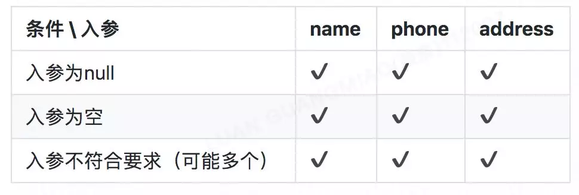

假如一个方法有 N 个参数，每个参数有 M 个校验逻辑，至少要有 N * M 个 TC 。

如果这时候在该方法中加入一个新的入参字段 fax ，即使 fax 和 phone 的校验逻辑完全一致，为了保证 TC 覆盖率，也一样需要 M 个新的 TC 。

而假设有 P 个方法中都用到了 phone 这个字段，这 P 个方法都需要对该字段进行测试，也就是说整体需要P*N*M个测试用例才能完全覆盖所有数据验证的问题，在日常项目中，这个测试的成本非常之高，导致大量的代码没被覆盖到。而没被测试覆盖到的代码才是最有可能出现问题的地方。

在这个情况下，降低测试成本就是变相的提升代码质量，**如何能够降低测试的成本呢？**

### 解决方案

重温一下刚刚的业务场景：

- 一个新应用在全国通过 地推业务员 做推广，需要做一个用户注册系统，同时希望在用户注册后能够通过用户电话（先假设仅限座机）的地域（区号）对业务员发奖金。

在分析了 use case 后，发现其中地推业务员、用户本身自带 ID 属性，属于 Entity（实体），而注册系统属于 Application Service（应用服务），这几个概念已经有存在。但是发现电话号这个概念却完全被隐藏到了代码之中。我们可以问一下自己，取电话号的区号的逻辑是否属于用户（用户的区号？）？是否属于注册服务（注册的区号？）？如果都不是很贴切，那就说明这个逻辑应该属于一个独立的概念。所以这里引入我们第一个原则：

#### 将隐性的概念显性化

Make Implicit Concepts Explicit

在这里，我们可以看到，原来电话号仅仅是用户的一个参数，属于隐形概念，但实际上电话号的区号才是真正的业务逻辑，而我们需要将电话号的概念显性化，通过写一个Value Object：
```java
public class PhoneNumber {
  
    private final String number;
    public String getNumber() {
        return number;
    }

    public PhoneNumber(String number) {
        if (number == null) {
            throw new ValidationException("number不能为空");
        } else if (isValid(number)) {
            throw new ValidationException("number格式错误");
        }
        this.number = number;
    }

    public String getAreaCode() {
        for (int i = 0; i < number.length(); i++) {
            String prefix = number.substring(0, i);
            if (isAreaCode(prefix)) {
                return prefix;
            }
        }
        return null;
    }

    private static boolean isAreaCode(String prefix) {
        String[] areas = new String[]{"0571", "021", "010"};
        return Arrays.asList(areas).contains(prefix);
    }

    public static boolean isValid(String number) {
        String pattern = "^0?[1-9]{2,3}-?\\d{8}$";
        return number.matches(pattern);
    }

}
```

这里面有几个很重要的元素：

通过 private final String number 确保 PhoneNumber 是一个（Immutable）Value Object。（一般来说 VO 都是 Immutable 的，这里只是重点强调一下）

校验逻辑都放在了 constructor 里面，确保只要 PhoneNumber 类被创建出来后，一定是校验通过的。

之前的 findAreaCode 方法变成了 PhoneNumber 类里的 getAreaCode ，突出了 areaCode 是 PhoneNumber 的一个计算属性。

这样做完之后，我们发现把 PhoneNumber 显性化之后，其实是生成了一个 Type（数据类型）和一个 Class（类）：

- Type 指我们在今后的代码里可以通过 PhoneNumber 去显性的标识电话号这个概念
- Class 指我们可以把所有跟电话号相关的逻辑完整的收集到一个文件里

这两个概念加起来，构造成了本文标题的 Domain Primitive（DP）。

我们看一下全面使用了 DP 之后效果：
```java
public class User {
    UserId userId;
    Name name;
    PhoneNumber phone;
    Address address;
    RepId repId;
}

public User register(
  @NotNull Name name,
  @NotNull PhoneNumber phone,
  @NotNull Address address
) {
    // 找到区域内的SalesRep
    SalesRep rep = salesRepRepo.findRep(phone.getAreaCode());

    // 最后创建用户，落盘，然后返回，这部分代码实际上也能用Builder解决
    User user = new User();
    user.name = name;
    user.phone = phone;
    user.address = address;
    if (rep != null) {
        user.repId = rep.repId;
    }

    return userRepo.saveUser(user);
}
```

我们可以看到在使用了 DP 之后，所有的数据验证逻辑和非业务流程的逻辑都消失了，剩下都是核心业务逻辑，可以一目了然。我们重新用上面的四个维度评估一下：

##### 评估1-接口的清晰度

重构后的方法签名变成了很清晰的：

```java
public User register(Name, PhoneNumber, Address)
```
而之前容易出现的bug，如果按照现在的写法

```java
service.register(new Name("殷浩"), new Address("浙江省杭州市余杭区文三西路969号"), new PhoneNumber("0571-12345678"));
```
让接口 API 变得很干净，易拓展。

##### 评估2-数据验证和错误处理

```java
public User register(
  @NotNull Name name,
  @NotNull PhoneNumber phone,
  @NotNull Address address
) // no throws
```
如前文代码展示的，重构后的方法里，完全没有了任何数据验证的逻辑，也不会抛 ValidationException 。原因是因为 DP 的特性，只要是能够带到入参里的一定是正确的或 null（Bean Validation 或 lombok 的注解能解决 null 的问题）。所以我们把数据验证的工作量前置到了调用方，而调用方本来就是应该提供合法数据的，所以更加合适。

再展开来看，使用DP的另一个好处就是代码遵循了 DRY 原则和单一性原则，如果未来需要修改 PhoneNumber 的校验逻辑，只需要在一个文件里修改即可，所有使用到了 PhoneNumber 的地方都会生效。

##### 评估3-业务代码的清晰度

```java
SalesRep rep = salesRepRepo.findRep(phone.getAreaCode());
User user = xxx;
return userRepo.save(user);
```
除了在业务方法里不需要校验数据之外，原来的一段胶水代码 findAreaCode 被改为了 PhoneNumber 类的一个计算属性 getAreaCode ，让代码清晰度大大提升。而且胶水代码通常都不可复用，但是使用了 DP 后，变成了可复用、可测试的代码。我们能看到，在刨除了数据验证代码、胶水代码之后，剩下的都是核心业务逻辑。（ Entity 相关的重构在后面文章会谈到，这次先忽略）

##### 评估4-可测试性

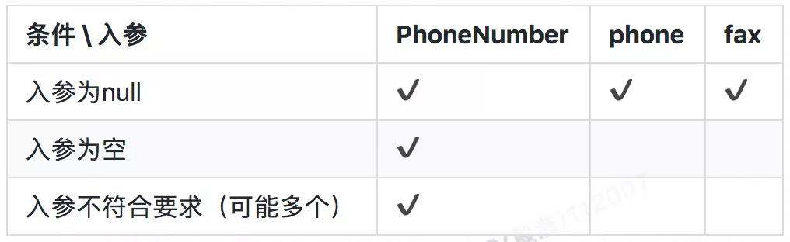

当我们将 PhoneNumber 抽取出来之后，在来看测试的 TC ：

- 首先 PhoneNumber 本身还是需要 M 个测试用例，但是由于我们只需要测试单一对象，每个用例的代码量会大大降低，维护成本降低。
- 每个方法里的每个参数，现在只需要覆盖为 null 的情况就可以了，其他的 case 不可能发生（因为只要不是 null 就一定是合法的）
所以，单个方法的 TC 从原来的 N * M 变成了今天的 N + M 。同样的，多个方法的 TC 数量变成了

N + M + P

这个数量一般来说要远低于原来的数量 N M P ，让测试成本极大的降低。

### 进阶使用

在上文我介绍了 DP 的第一个原则：将隐性的概念显性化。在这里我将介绍 DP 的另外两个原则，用一个新的案例。

#### 案例1 - 转账

假设现在要实现一个功能，让A用户可以支付 x 元给用户 B ，可能的实现如下：
```java
public void pay(BigDecimal money, Long recipientId) {
    BankService.transfer(money, "CNY", recipientId);
}
```
如果这个是境内转账，并且境内的货币永远不变，该方法貌似没啥问题，但如果有一天货币变更了（比如欧元区曾经出现的问题），或者我们需要做跨境转账，该方法是明显的 bug ，因为 money 对应的货币不一定是 CNY 。

在这个 case 里，当我们说“支付 x 元”时，除了 x 本身的数字之外，实际上是有一个隐含的概念那就是货币“元”。但是在原始的入参里，之所以只用了 BigDecimal 的原因是我们认为 CNY 货币是默认的，是一个隐含的条件，但是在我们写代码时，需要把所有隐性的条件显性化，而这些条件整体组成当前的上下文。所以 DP 的第二个原则是：

##### 将隐性的上下文显性化

Make Implicit Context Explicit

所以当我们做这个支付功能时，实际上需要的一个入参是支付金额 + 支付货币。我们可以把这两个概念组合成为一个独立的完整概念：Money。
```java
@Value
public class Money {
    private BigDecimal amount;
    private Currency currency;
    public Money(BigDecimal amount, Currency currency) {
        this.amount = amount;
        this.currency = currency;
    }
}
```
而原有的代码则变为：
```java
public void pay(Money money, Long recipientId) {
    BankService.transfer(money, recipientId);
}
```
通过将默认货币这个隐性的上下文概念显性化，并且和金额合并为 Money ，我们可以避免很多当前看不出来，但未来可能会暴雷的bug。

#### 案例2-跨境转账

前面的案例升级一下，假设用户可能要做跨境转账从 CNY 到 USD ，并且货币汇率随时在波动：
```java
public void pay(Money money, Currency targetCurrency, Long recipientId) {
    if (money.getCurrency().equals(targetCurrency)) {
        BankService.transfer(money, recipientId);
    } else {
        BigDecimal rate = ExchangeService.getRate(money.getCurrency(), targetCurrency);
        BigDecimal targetAmount = money.getAmount().multiply(new BigDecimal(rate));
        Money targetMoney = new Money(targetAmount, targetCurrency);
        BankService.transfer(targetMoney, recipientId);
    }
}
```
在这个case里，由于 targetCurrency 不一定和 money 的 Curreny 一致，需要调用一个服务去取汇率，然后做计算。最后用计算后的结果做转账。

这个case最大的问题在于，金额的计算被包含在了支付的服务中，涉及到的对象也有2个 Currency ，2 个 Money ，1 个 BigDecimal ，总共 5 个对象。这种涉及到多个对象的业务逻辑，需要用 DP 包装掉，所以这里引出 DP 的第三个原则：

##### 封装多对象行为

Encapsulate Multi-Object Behavior

在这个 case 里，可以将转换汇率的功能，封装到一个叫做 ExchangeRate 的 DP 里：
```java
@Value
public class ExchangeRate {
    private BigDecimal rate;
    private Currency from;
    private Currency to;

    public ExchangeRate(BigDecimal rate, Currency from, Currency to) {
        this.rate = rate;
        this.from = from;
        this.to = to;
    }

    public Money exchange(Money fromMoney) {
        notNull(fromMoney);
        isTrue(this.from.equals(fromMoney.getCurrency()));
        BigDecimal targetAmount = fromMoney.getAmount().multiply(rate);
        return new Money(targetAmount, to);
    }
}
```

ExchangeRate 汇率对象，通过封装金额计算逻辑以及各种校验逻辑，让原始代码变得极其简单：
```java
public void pay(Money money, Currency targetCurrency, Long recipientId) {
    ExchangeRate rate = ExchangeService.getRate(money.getCurrency(), targetCurrency);
    Money targetMoney = rate.exchange(money);
    BankService.transfer(targetMoney, recipientId);
}
```

### 讨论和总结

#### Domain Primitive 的定义

让我们重新来定义一下 Domain Primitive ：Domain Primitive 是一个在特定领域里，拥有精准定义的、可自我验证的、拥有行为的 Value Object 。

- DP是一个传统意义上的Value Object，拥有Immutable的特性
- DP是一个完整的概念整体，拥有精准定义
- DP使用业务域中的原生语言
- DP可以是业务域的最小组成部分、也可以构建复杂组合
注：Domain Primitive的概念和命名来自于Dan Bergh Johnsson & Daniel Deogun的书 Secure by Design。

#### 使用 Domain Primitive 的三原则

- 让隐性的概念显性化
- 让隐性的上下文显性化
- 封装多对象行为

#### Domain Primitive 和 DDD 里 Value Object 的区别

在 DDD 中， Value Object 这个概念其实已经存在：

- 在 Evans 的 DDD 蓝皮书中，Value Object 更多的是一个非 Entity 的值对象
- 在Vernon的IDDD红皮书中，作者更多的关注了Value Object的Immutability、Equals方法、Factory方法等

Domain Primitive 是 Value Object 的进阶版，在原始 VO 的基础上要求每个 DP 拥有概念的整体，而不仅仅是值对象。在 VO 的 Immutable 基础上增加了 Validity 和行为。当然同样的要求无副作用（side-effect free）。

#### Domain Primitive 和 Data Transfer Object (DTO) 的区别

在日常开发中经常会碰到的另一个数据结构是 DTO ，比如方法的入参和出参。DP 和 DTO 的区别如下：

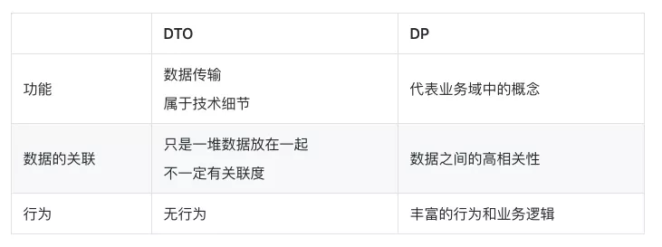

#### 什么情况下应该用 Domain Primitive

常见的 DP 的使用场景包括：

- 有格式限制的 String：比如Name，PhoneNumber，OrderNumber，ZipCode，Address等
- 有限制的Integer：比如OrderId（>0），Percentage（0-100%），Quantity（>=0）等
- 可枚举的 int ：比如 Status（一般不用Enum因为反序列化问题）
- Double 或 BigDecimal：一般用到的 Double 或 BigDecimal 都是有业务含义的，比如 Temperature、Money、Amount、ExchangeRate、Rating 等
- 复杂的数据结构：比如 Map> 等，尽量能把 Map 的所有操作包装掉，仅暴露必要行为

### 实战 - 老应用重构的流程

在新应用中使用 DP 是比较简单的，但在老应用中使用 DP 是可以遵循以下流程按部就班的升级。在此用本文的第一个 case 为例。

#### 创建 Domain Primitive，收集所有 DP 行为

在前文中，我们发现取电话号的区号这个是一个可以独立出来的、可以放入 PhoneNumber 这个 Class 的逻辑。类似的，在真实的项目中，以前散落在各个服务或工具类里面的代码，可以都抽出来放在 DP 里，成为 DP 自己的行为或属性。这里面的原则是：所有抽离出来的方法要做到无状态，比如原来是 static 的方法。如果原来的方法有状态变更，需要将改变状态的部分和不改状态的部分分离，然后将无状态的部分融入 DP 。因为 DP 本身不能带状态，所以一切需要改变状态的代码都不属于 DP 的范畴。

(代码参考 PhoneNumber 的代码，这里不再重复)


#### 替换数据校验和无状态逻辑

为了保障现有方法的兼容性，在第二步不会去修改接口的签名，而是通过代码替换原有的校验逻辑和根 DP 相关的业务逻辑。比如：
```java
public User register(String name, String phone, String address)
        throws ValidationException {
    if (name == null || name.length() == 0) {
        throw new ValidationException("name");
    }
    if (phone == null || !isValidPhoneNumber(phone)) {
        throw new ValidationException("phone");
    }
    
    String areaCode = null;
    String[] areas = new String[]{"0571", "021", "010"};
    for (int i = 0; i < phone.length(); i++) {
        String prefix = phone.substring(0, i);
        if (Arrays.asList(areas).contains(prefix)) {
            areaCode = prefix;
            break;
        }
    }
    SalesRep rep = salesRepRepo.findRep(areaCode);
    // 其他代码...
}
```
通过 DP 替换代码后：
```java
public User register(String name, String phone, String address)
        throws ValidationException {
    
    Name _name = new Name(name);
    PhoneNumber _phone = new PhoneNumber(phone);
    Address _address = new Address(address);
    
    SalesRep rep = salesRepRepo.findRep(_phone.getAreaCode());
    // 其他代码...
}
```
通过 new PhoneNumber(phone) 这种代码，替代了原有的校验代码。

通过 _phone.getAreaCode() 替换了原有的无状态的业务逻辑。

#### 创建新接口

创建新接口，将DP的代码提升到接口参数层：
```java
public User register(Name name, PhoneNumber phone, Address address) {
    SalesRep rep = salesRepRepo.findRep(phone.getAreaCode());
}
```
#### 修改外部调用

外部调用方需要修改调用链路，比如：
```java
service.register("殷浩", "0571-12345678", "浙江省杭州市余杭区文三西路969号");
```
改为：
```java
service.register(new Name("殷浩"), new PhoneNumber("0571-12345678"), new Address("浙江省杭州市余杭区文三西路969号"));
```
通过以上 4 步，就能让你的代码变得更加简洁、优雅、健壮、安全。

## 应用架构

- https://zhuanlan.zhihu.com/p/84223605?from_voters_page=true

下面的内容，大部分来自于[这里](https://zhuanlan.zhihu.com/p/84223605?from_voters_page=true)。

架构这个词源于英文里的“Architecture“，源头是土木工程里的“建筑”和“结构”，而架构里的”架“同时又包含了”架子“（scaffolding）的含义，意指能快速搭建起来的固定结构。而今天的应用架构，意指软件系统中固定不变的代码结构、设计模式、规范和组件间的通信方式。在应用开发中架构之所以是最重要的第一步，因为一个好的架构能让系统安全、稳定、快速迭代。在一个团队内通过规定一个固定的架构设计，可以让团队内能力参差不齐的同学们都能有一个统一的开发规范，降低沟通成本，提升效率和代码质量。

在做架构设计时，一个好的架构应该需要实现以下几个目标：

- 独立于框架：架构不应该依赖某个外部的库或框架，不应该被框架的结构所束缚。
- 独立于UI：前台展示的样式可能会随时发生变化（今天可能是网页、明天可能变成console、后天是独立app），但是底层架构不应该随之而变化。
- 独立于底层数据源：无论今天你用MySQL、Oracle还是MongoDB、CouchDB，甚至使用文件系统，软件架构不应该因为不同的底层数据储存方式而产生巨大改变。
- 独立于外部依赖：无论外部依赖如何变更、升级，业务的核心逻辑不应该随之而大幅变化。
- 可测试：无论外部依赖了什么数据库、硬件、UI或者服务，业务的逻辑应该都能够快速被验证正确性。

这就好像是建筑中的楼宇，一个好的楼宇，无论内部承载了什么人、有什么样的活动、还是外部有什么风雨，一栋楼都应该屹立不倒，而且可以确保它不会倒。但是今天我们在做业务研发时，更多的会去关注一些宏观的架构，比如SOA架构、微服务架构，而忽略了应用内部的架构设计，很容易导致代码逻辑混乱，很难维护，容易产生bug而且很难发现。今天，我希望能够通过案例的分析和重构，来推演出一套高质量的DDD架构。

### 案例分析
我们先看一个简单的案例需求如下：

用户可以通过银行网页转账给另一个账号，支持跨币种转账。

同时因为监管和对账需求，需要记录本次转账活动。

拿到这个需求之后，一个开发可能会经历一些技术选型，最终可能拆解需求如下：

1、从MySql数据库中找到转出和转入的账户，选择用 MyBatis 的 mapper 实现 DAO；2、从 Yahoo（或其他渠道）提供的汇率服务获取转账的汇率信息（底层是 http 开放接口）；

3、计算需要转出的金额，确保账户有足够余额，并且没超出每日转账上限；

4、实现转入和转出操作，扣除手续费，保存数据库；

5、发送 Kafka 审计消息，以便审计和对账用；

而一个简单的代码实现如下：
```java
public class TransferController {

    private TransferService transferService;

    public Result<Boolean> transfer(String targetAccountNumber, BigDecimal amount, HttpSession session) {
        Long userId = (Long) session.getAttribute("userId");
        return transferService.transfer(userId, targetAccountNumber, amount, "CNY");
    }
}

public class TransferServiceImpl implements TransferService {

    private static final String TOPIC_AUDIT_LOG = "TOPIC_AUDIT_LOG";
    private AccountMapper accountDAO;
    private KafkaTemplate<String, String> kafkaTemplate;
    private YahooForexService yahooForex;

    @Override
    public Result<Boolean> transfer(Long sourceUserId, String targetAccountNumber, BigDecimal targetAmount, String targetCurrency) {
        // 1. 从数据库读取数据，忽略所有校验逻辑如账号是否存在等
        AccountDO sourceAccountDO = accountDAO.selectByUserId(sourceUserId);
        AccountDO targetAccountDO = accountDAO.selectByAccountNumber(targetAccountNumber);

        // 2. 业务参数校验
        if (!targetAccountDO.getCurrency().equals(targetCurrency)) {
            throw new InvalidCurrencyException();
        }

        // 3. 获取外部数据，并且包含一定的业务逻辑
        // exchange rate = 1 source currency = X target currency
        BigDecimal exchangeRate = BigDecimal.ONE;
        if (sourceAccountDO.getCurrency().equals(targetCurrency)) {
            exchangeRate = yahooForex.getExchangeRate(sourceAccountDO.getCurrency(), targetCurrency);
        }
        BigDecimal sourceAmount = targetAmount.divide(exchangeRate, RoundingMode.DOWN);

        // 4. 业务参数校验
        if (sourceAccountDO.getAvailable().compareTo(sourceAmount) < 0) {
            throw new InsufficientFundsException();
        }

        if (sourceAccountDO.getDailyLimit().compareTo(sourceAmount) < 0) {
            throw new DailyLimitExceededException();
        }

        // 5. 计算新值，并且更新字段
        BigDecimal newSource = sourceAccountDO.getAvailable().subtract(sourceAmount);
        BigDecimal newTarget = targetAccountDO.getAvailable().add(targetAmount);
        sourceAccountDO.setAvailable(newSource);
        targetAccountDO.setAvailable(newTarget);

        // 6. 更新到数据库
        accountDAO.update(sourceAccountDO);
        accountDAO.update(targetAccountDO);

        // 7. 发送审计消息
        String message = sourceUserId + "," + targetAccountNumber + "," + targetAmount + "," + targetCurrency;
        kafkaTemplate.send(TOPIC_AUDIT_LOG, message);

        return Result.success(true);
    }
}
```
我们可以看到，一段业务代码里经常包含了参数校验、数据读取存储、业务计算、调用外部服务、发送消息等多种逻辑。在这个案例里虽然是写在了同一个方法里，在真实代码中经常会被拆分成多个子方法，但实际效果是一样的，而在我们日常的工作中，绝大部分代码都或多或少的接近于此类结构。在Martin Fowler的 P of EAA书中，这种很常见的代码样式被叫做Transaction Script（事务脚本）。虽然这种类似于脚本的写法在功能上没有什么问题，但是长久来看，他有以下几个很大的问题：可维护性差、可扩展性差、可测试性差。

#### 问题1-可维护性能差

一个应用最大的成本一般都不是来自于开发阶段，而是应用整个生命周期的总维护成本，所以代码的可维护性代表了最终成本。

**可维护性 = 当依赖变化时，有多少代码需要随之改变**
参考以上的案例代码，事务脚本类的代码很难维护因为以下几点：

- 数据结构的不稳定性：AccountDO类是一个纯数据结构，映射了数据库中的一个表。这里的问题是数据库的表结构和设计是应用的外部依赖，长远来看都有可能会改变，比如数据库要做Sharding，或者换一个表设计，或者改变字段名。
- 依赖库的升级：AccountMapper依赖MyBatis的实现，如果MyBatis未来升级版本，可能会造成用法的不同（可以参考iBatis升级到基于注解的MyBatis的迁移成本）。同样的，如果未来换一个ORM体系，迁移成本也是巨大的。
第三方服务依赖的不确定性：第三方服务，比如Yahoo的汇率服务未来很有可能会有变化：轻则API签名变化，重则服务不可用需要寻找其他可替代的服务。在这些情况下改造和迁移成本都是巨大的。同时，外部依赖的兜底、限流、熔断等方案都需要随之改变。
- 第三方服务API的接口变化：YahooForexService.getExchangeRate返回的结果是小数点还是百分比？入参是（source, target）还是（target, source）？谁能保证未来接口不会改变？如果改变了，核心的金额计算逻辑必须跟着改，否则会造成资损。
中间件更换：今天我们用Kafka发消息，明天如果要上阿里云用RocketMQ该怎么办？后天如果消息的序列化方式从String改为Binary该怎么办？如果需要消息分片该怎么改？

我们发现案例里的代码对于任何外部依赖的改变都会有比较大的影响。如果你的应用里有大量的此类代码，你每一天的时间基本上会被各种库升级、依赖服务升级、中间件升级、jar包冲突占满，最终这个应用变成了一个不敢升级、不敢部署、不敢写新功能、并且随时会爆发的炸弹，终有一天会给你带来惊喜。

#### 问题2-可拓展性差

事务脚本式代码的第二大缺陷是：虽然写单个用例的代码非常高效简单，但是当用例多起来时，其扩展性会变得越来越差。

**可扩展性 = 做新需求或改逻辑时，需要新增/修改多少代码**

参考以上的代码，如果今天需要增加一个跨行转账的能力，你会发现基本上需要重新开发，基本上没有任何的可复用性：

- 数据来源被固定、数据格式不兼容：原有的AccountDO是从本地获取的，而跨行转账的数据可能需要从一个第三方服务获取，而服务之间数据格式不太可能是兼容的，导致从数据校验、数据读写、到异常处理、金额计算等逻辑都要重写。
- 业务逻辑无法复用：数据格式不兼容的问题会导致核心业务逻辑无法复用。每个用例都是特殊逻辑的后果是最终会造成大量的if-else语句，而这种分支多的逻辑会让分析代码非常困难，容易错过边界情况，造成bug。
- 逻辑和数据存储的相互依赖：当业务逻辑增加变得越来越复杂时，新加入的逻辑很有可能需要对数据库schema或消息格式做变更。而变更了数据格式后会导致原有的其他逻辑需要一起跟着动。在最极端的场景下，一个新功能的增加会导致所有原有功能的重构，成本巨大。

在事务脚本式的架构下，一般做第一个需求都非常的快，但是做第N个需求时需要的时间很有可能是呈指数级上升的，绝大部分时间花费在老功能的重构和兼容上，最终你的创新速度会跌为0，促使老应用被推翻重构。

#### 问题3-可测试性能差

除了部分工具类、框架类和中间件类的代码有比较高的测试覆盖之外，我们在日常工作中很难看到业务代码有比较好的测试覆盖，而绝大部分的上线前的测试属于人肉的“集成测试”。低测试率导致我们对代码质量很难有把控，容易错过边界条件，异常case只有线上爆发了才被动发现。而低测试覆盖率的主要原因是业务代码的可测试性比较差。

**可测试性 = 运行每个测试用例所花费的时间 * 每个需求所需要增加的测试用例数量**

参考以上的一段代码，这种代码有极低的可测试性：

- 设施搭建困难：当代码中强依赖了数据库、第三方服务、中间件等外部依赖之后，想要完整跑通一个测试用例需要确保所有依赖都能跑起来，这个在项目早期是及其困难的。在项目后期也会由于各种系统的不稳定性而导致测试无法通过。
- 运行耗时长：大多数的外部依赖调用都是I/O密集型，如跨网络调用、磁盘调用等，而这种I/O调用在测试时需要耗时很久。另一个经常依赖的是笨重的框架如Spring，启动Spring容器通常需要很久。当一个测试用例需要花超过10秒钟才能跑通时，绝大部分开发都不会很频繁的测试。
- 耦合度高：假如一段脚本中有A、B、C三个子步骤，而每个步骤有N个可能的状态，当多个子步骤耦合度高时，为了完整覆盖所有用例，最多需要有N N N个测试用例。当耦合的子步骤越多时，需要的测试用例呈指数级增长。
在事务脚本模式下，当测试用例复杂度远大于真实代码复杂度，当运行测试用例的耗时超出人肉测试时，绝大部分人会选择不写完整的测试覆盖，而这种情况通常就是bug很难被早点发现的原因。

#### 总结分析

我们重新来分析一下为什么以上的问题会出现？因为以上的代码违背了至少以下几个软件设计的原则：

- 单一性原则（Single Responsibility Principle）：单一性原则要求一个对象/类应该只有一个变更的原因。但是在这个案例里，代码可能会因为任意一个外部依赖或计算逻辑的改变而改变。
- 依赖反转原则（Dependency Inversion Principle）：依赖反转原则要求在代码中依赖抽象，而不是具体的实现。在这个案例里外部依赖都是具体的实现，比如YahooForexService虽然是一个接口类，但是它对应的是依赖了Yahoo提供的具体服务，所以也算是依赖了实现。同样的KafkaTemplate、MyBatis的DAO实现都属于具体实现。
- 开放封闭原则（Open Closed Principle）：开放封闭原则指开放扩展，但是封闭修改。在这个案例里的金额计算属于可能会被修改的代码，这个时候该逻辑应该需要被包装成为不可修改的计算类，新功能通过计算类的拓展实现。
我们需要对代码重构才能解决这些问题。

### 重构方案
在重构之前，我们先画一张流程图，描述当前代码在做的每个步骤：

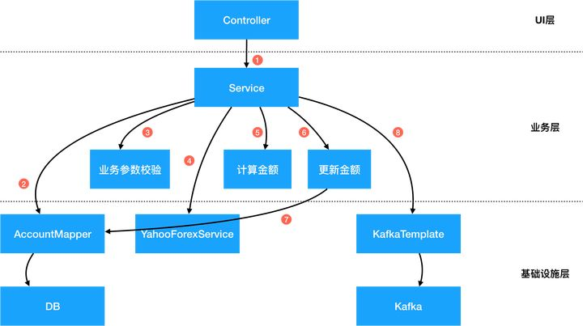

这是一个传统的MVC三层分层结构：UI层、业务层、和基础设施层。上层对于下层有直接的依赖关系，导致耦合度过高。在业务层中对于下层的基础设施有强依赖，耦合度高。我们需要对这张图上的每个节点做抽象和整理，来降低对外部依赖的耦合度。

#### 抽象数据存储层

第一步常见的操作是将Data Access层做抽象，降低系统对数据库的直接依赖。具体的方法如下：

- 新建Account实体对象：一个实体（Entity）是拥有ID的域对象，除了拥有数据之外，同时拥有行为。Entity和数据库储存格式无关，在设计中要以该领域的通用严谨语言（Ubiquitous Language）为依据。
- 新建对象储存接口类AccountRepository：Repository只负责Entity对象的存储和读取，而Repository的实现类完成数据库存储的细节。通过加入Repository接口，底层的数据库连接可以通过不同的实现类而替换。
具体的简单代码实现如下：

Account实体类：
```java
@Data
public class Account {
    private AccountId id;
    private AccountNumber accountNumber;
    private UserId userId;
    private Money available;
    private Money dailyLimit;

    public void withdraw(Money money) {
        // 转出
    }

    public void deposit(Money money) {
        // 转入
    }
}
```
和AccountRepository及MyBatis实现类：
```java
public interface AccountRepository {
    Account find(AccountId id);
    Account find(AccountNumber accountNumber);
    Account find(UserId userId);
    Account save(Account account);
}

public class AccountRepositoryImpl implements AccountRepository {

    @Autowired
    private AccountMapper accountDAO;

    @Autowired
    private AccountBuilder accountBuilder;

    @Override
    public Account find(AccountId id) {
        AccountDO accountDO = accountDAO.selectById(id.getValue());
        return accountBuilder.toAccount(accountDO);
    }

    @Override
    public Account find(AccountNumber accountNumber) {
        AccountDO accountDO = accountDAO.selectByAccountNumber(accountNumber.getValue());
        return accountBuilder.toAccount(accountDO);
    }

    @Override
    public Account find(UserId userId) {
        AccountDO accountDO = accountDAO.selectByUserId(userId.getId());
        return accountBuilder.toAccount(accountDO);
    }

    @Override
    public Account save(Account account) {
        AccountDO accountDO = accountBuilder.fromAccount(account);
        if (accountDO.getId() == null) {
            accountDAO.insert(accountDO);
        } else {
            accountDAO.update(accountDO);
        }
        return accountBuilder.toAccount(accountDO);
    }

}
```
Account实体类和AccountDO数据类的对比如下：

- Data Object数据类：AccountDO是单纯的和数据库表的映射关系，每个字段对应数据库表的一个column，这种对象叫Data Object。DO只有数据，没有行为。AccountDO的作用是对数据库做快速映射，避免直接在代码里写SQL。无论你用的是MyBatis还是Hibernate这种ORM，从数据库来的都应该先直接映射到DO上，但是代码里应该完全避免直接操作 DO。
- Entity实体类：Account 是基于领域逻辑的实体类，它的字段和数据库储存不需要有必然的联系。Entity包含数据，同时也应该包含行为。在 Account 里，字段也不仅仅是String等基础类型，而应该尽可能用上一讲的 Domain Primitive 代替，可以避免大量的校验代码。

DAO 和 Repository 类的对比如下：

- DAO对应的是一个特定的数据库类型的操作，相当于SQL的封装。所有操作的对象都是DO类，所有接口都可以根据数据库实现的不同而改变。比如，insert 和 update 属于数据库专属的操作。
- Repository对应的是Entity对象读取储存的抽象，在接口层面做统一，不关注底层实现。比如，通过 save 保存一个Entity对象，但至于具体是 insert 还是 update 并不关心。Repository的具体实现类通过调用DAO来实现各种操作，通过Builder/Factory对象实现AccountDO 到 Account之间的转化

##### Repository和Entity

- 通过Account对象，避免了其他业务逻辑代码和数据库的直接耦合，避免了当数据库字段变化时，大量业务逻辑也跟着变的问题。
通过Repository，改变业务代码的思维方式，让业务逻辑不再面向数据库编程，而是面向领域模型编程。
- Account属于一个完整的内存中对象，可以比较容易的做完整的测试覆盖，包含其行为。
- Repository作为一个接口类，可以比较容易的实现Mock或Stub，可以很容易测试。
- AccountRepositoryImpl实现类，由于其职责被单一出来，只需要关注Account到AccountDO的映射关系和Repository方法到DAO方法之间的映射关系，相对于来说更容易测试。

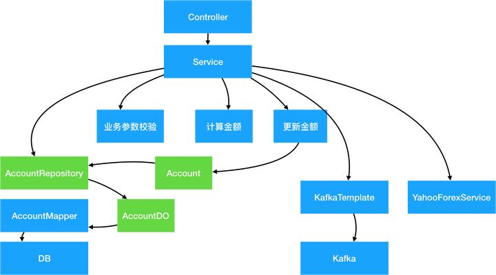

#### 抽象第三方服务

类似对于数据库的抽象，所有第三方服务也需要通过抽象解决第三方服务不可控，入参出参强耦合的问题。在这个例子里我们抽象出 ExchangeRateService 的服务，和一个ExchangeRate的Domain Primitive类：
```java
public interface ExchangeRateService {
    ExchangeRate getExchangeRate(Currency source, Currency target);
}

public class ExchangeRateServiceImpl implements ExchangeRateService {

    @Autowired
    private YahooForexService yahooForexService;

    @Override
    public ExchangeRate getExchangeRate(Currency source, Currency target) {
        if (source.equals(target)) {
            return new ExchangeRate(BigDecimal.ONE, source, target);
        }
        BigDecimal forex = yahooForexService.getExchangeRate(source.getValue(), target.getValue());
        return new ExchangeRate(forex, source, target);
    }
```
##### 防腐层（ACL）

这种常见的设计模式叫做Anti-Corruption Layer（防腐层或ACL）。很多时候我们的系统会去依赖其他的系统，而被依赖的系统可能包含不合理的数据结构、API、协议或技术实现，如果对外部系统强依赖，会导致我们的系统被”腐蚀“。这个时候，通过在系统间加入一个防腐层，能够有效的隔离外部依赖和内部逻辑，无论外部如何变更，内部代码可以尽可能的保持不变。

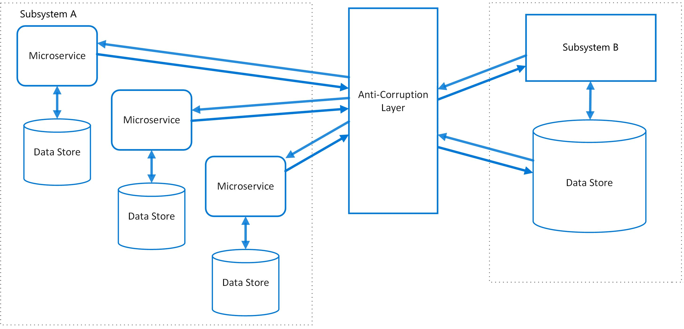

ACL 不仅仅只是多了一层调用，在实际开发中ACL能够提供更多强大的功能：

- 适配器：很多时候外部依赖的数据、接口和协议并不符合内部规范，通过适配器模式，可以将数据转化逻辑封装到ACL内部，降低对业务代码的侵入。在这个案例里，我们通过封装了ExchangeRate和Currency对象，转化了对方的入参和出参，让入参出参更符合我们的标准。
- 缓存：对于频繁调用且数据变更不频繁的外部依赖，通过在ACL里嵌入缓存逻辑，能够有效的降低对于外部依赖的请求压力。同时，很多时候缓存逻辑是写在业务代码里的，通过将缓存逻辑嵌入ACL，能够降低业务代码的复杂度。
- 兜底：如果外部依赖的稳定性较差，一个能够有效提升我们系统稳定性的策略是通过ACL起到兜底的作用，比如当外部依赖出问题后，返回最近一次成功的缓存或业务兜底数据。这种兜底逻辑一般都比较复杂，如果散落在核心业务代码中会很难维护，通过集中在ACL中，更加容易被测试和修改。
- 易于测试：类似于之前的Repository，ACL的接口类能够很容易的实现Mock或Stub，以便于单元测试。
- 功能开关：有些时候我们希望能在某些场景下开放或关闭某个接口的功能，或者让某个接口返回一个特定的值，我们可以在ACL配置功能开关来实现，而不会对真实业务代码造成影响。同时，使用功能开关也能让我们容易的实现Monkey测试，而不需要真正物理性的关闭外部依赖。

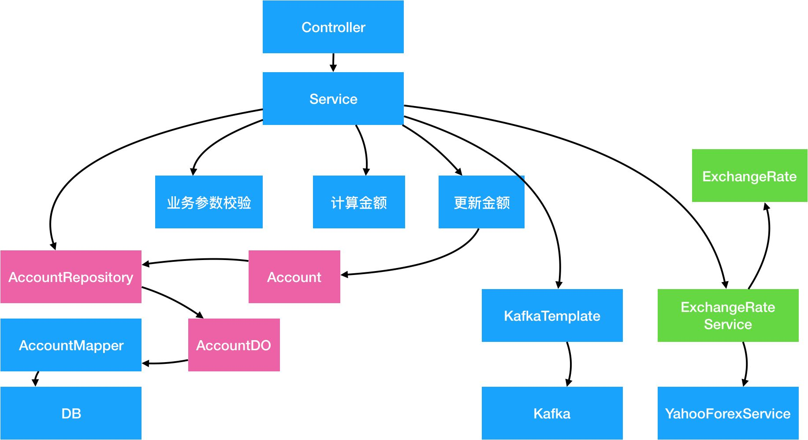

#### 抽象中间件

类似于2.2的第三方服务的抽象，对各种中间件的抽象的目的是让业务代码不再依赖中间件的实现逻辑。因为中间件通常需要有通用型，中间件的接口通常是String或Byte[] 类型的，导致序列化/反序列化逻辑通常和业务逻辑混杂在一起，造成胶水代码。通过中间件的ACL抽象，减少重复胶水代码。

在这个案例里，我们通过封装一个抽象的AuditMessageProducer和AuditMessage DP对象，实现对底层kafka实现的隔离：
```java
@Value
@AllArgsConstructor
public class AuditMessage {

    private UserId userId;
    private AccountNumber source;
    private AccountNumber target;
    private Money money;
    private Date date;

    public String serialize() {
        return userId + "," + source + "," + target + "," + money + "," + date;   
    }

    public static AuditMessage deserialize(String value) {
        // todo
        return null;
    }
}

public interface AuditMessageProducer {
    SendResult send(AuditMessage message);
}

public class AuditMessageProducerImpl implements AuditMessageProducer {

    private static final String TOPIC_AUDIT_LOG = "TOPIC_AUDIT_LOG";

    @Autowired
    private KafkaTemplate<String, String> kafkaTemplate;

    @Override
    public SendResult send(AuditMessage message) {
        String messageBody = message.serialize();
        kafkaTemplate.send(TOPIC_AUDIT_LOG, messageBody);
        return SendResult.success();
    }
}
```

#### 封装业务逻辑

在这个案例里，有很多业务逻辑是跟外部依赖的代码混合的，包括金额计算、账户余额的校验、转账限制、金额增减等。这种逻辑混淆导致了核心计算逻辑无法被有效的测试和复用。在这里，我们的解法是通过Entity、Domain Primitive和Domain Service封装所有的业务逻辑：

##### 用Domain Primitive封装跟实体无关的无状态计算逻辑

在这个案例里使用ExchangeRate来封装汇率计算逻辑：
```java
BigDecimal exchangeRate = BigDecimal.ONE;
if (sourceAccountDO.getCurrency().equals(targetCurrency)) {
    exchangeRate = yahooForex.getExchangeRate(sourceAccountDO.getCurrency(), targetCurrency);
}
BigDecimal sourceAmount = targetAmount.divide(exchangeRate, RoundingMode.DOWN);
```
变为：
```java
ExchangeRate exchangeRate = exchangeRateService.getExchangeRate(sourceAccount.getCurrency(), targetMoney.getCurrency());
Money sourceMoney = exchangeRate.exchangeTo(targetMoney);
```
##### 用Entity封装单对象的有状态的行为，包括业务校验

用Account实体类封装所有Account的行为，包括业务校验如下：
```java
@Data
public class Account {

    private AccountId id;
    private AccountNumber accountNumber;
    private UserId userId;
    private Money available;
    private Money dailyLimit;

    public Currency getCurrency() {
        return this.available.getCurrency();
    }

    // 转入
    public void deposit(Money money) {
        if (!this.getCurrency().equals(money.getCurrency())) {
            throw new InvalidCurrencyException();
        }
        this.available = this.available.add(money);
    }

    // 转出
    public void withdraw(Money money) {
        if (this.available.compareTo(money) < 0) {
            throw new InsufficientFundsException();
        }
        if (this.dailyLimit.compareTo(money) < 0) {
            throw new DailyLimitExceededException();
        }
        this.available = this.available.subtract(money);
    }
}
```
原有的业务代码则可以简化为：
```java
sourceAccount.deposit(sourceMoney);
targetAccount.withdraw(targetMoney);
```
##### 用Domain Service封装多对象逻辑

在这个案例里，我们发现这两个账号的转出和转入实际上是一体的，也就是说这种行为应该被封装到一个对象中去。特别是考虑到未来这个逻辑可能会产生变化：比如增加一个扣手续费的逻辑。这个时候在原有的TransferService中做并不合适，在任何一个Entity或者Domain Primitive里也不合适，需要有一个新的类去包含跨域对象的行为。这种对象叫做Domain Service。

我们创建一个AccountTransferService的类：
```java
public interface AccountTransferService {
    void transfer(Account sourceAccount, Account targetAccount, Money targetMoney, ExchangeRate exchangeRate);
}

public class AccountTransferServiceImpl implements AccountTransferService {
    private ExchangeRateService exchangeRateService;

    @Override
    public void transfer(Account sourceAccount, Account targetAccount, Money targetMoney, ExchangeRate exchangeRate) {
        Money sourceMoney = exchangeRate.exchangeTo(targetMoney);
        sourceAccount.deposit(sourceMoney);
        targetAccount.withdraw(targetMoney);
    }
}
```
而原始代码则简化为一行：
```java
accountTransferService.transfer(sourceAccount, targetAccount, targetMoney, exchangeRate);
```

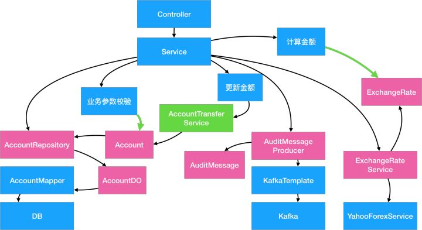

#### 重构后结果分析

这个案例重构后的代码如下：
```java
public class TransferServiceImplNew implements TransferService {

    private AccountRepository accountRepository;
    private AuditMessageProducer auditMessageProducer;
    private ExchangeRateService exchangeRateService;
    private AccountTransferService accountTransferService;

    @Override
    public Result<Boolean> transfer(Long sourceUserId, String targetAccountNumber, BigDecimal targetAmount, String targetCurrency) {
        // 参数校验
        Money targetMoney = new Money(targetAmount, new Currency(targetCurrency));

        // 读数据
        Account sourceAccount = accountRepository.find(new UserId(sourceUserId));
        Account targetAccount = accountRepository.find(new AccountNumber(targetAccountNumber));
        ExchangeRate exchangeRate = exchangeRateService.getExchangeRate(sourceAccount.getCurrency(), targetMoney.getCurrency());

        // 业务逻辑
        accountTransferService.transfer(sourceAccount, targetAccount, targetMoney, exchangeRate);

        // 保存数据
        accountRepository.save(sourceAccount);
        accountRepository.save(targetAccount);

        // 发送审计消息
        AuditMessage message = new AuditMessage(sourceAccount, targetAccount, targetMoney);
        auditMessageProducer.send(message);

        return Result.success(true);
    }
}
```
可以看出来，经过重构后的代码有以下几个特征：

- 业务逻辑清晰，数据存储和业务逻辑完全分隔。
- Entity、Domain Primitive、Domain Service都是独立的对象，没有任何外部依赖，但是却包含了所有核心业务逻辑，可以单独完整测试。
- 原有的TransferService不再包括任何计算逻辑，仅仅作为组件编排，所有逻辑均delegate到其他组件。这种仅包含Orchestration（编排）的服务叫做Application Service（应用服务）。

我们可以根据新的结构重新画一张图：

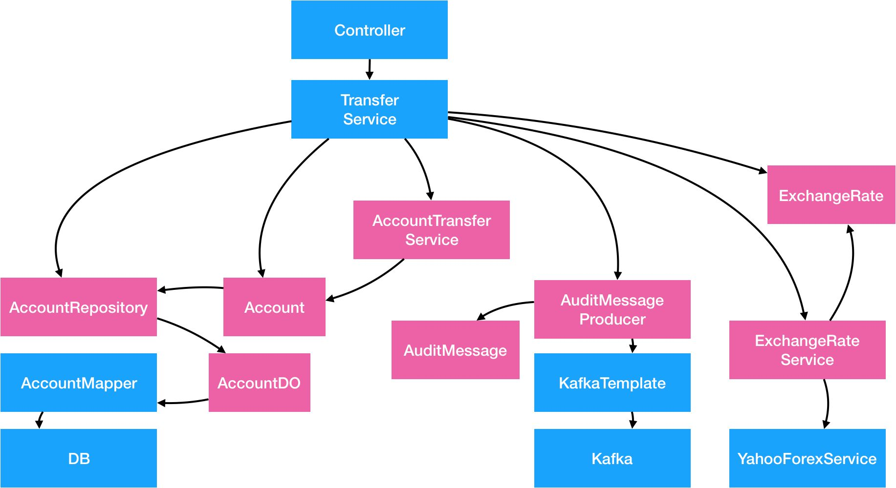

然后通过重新编排后该图变为：

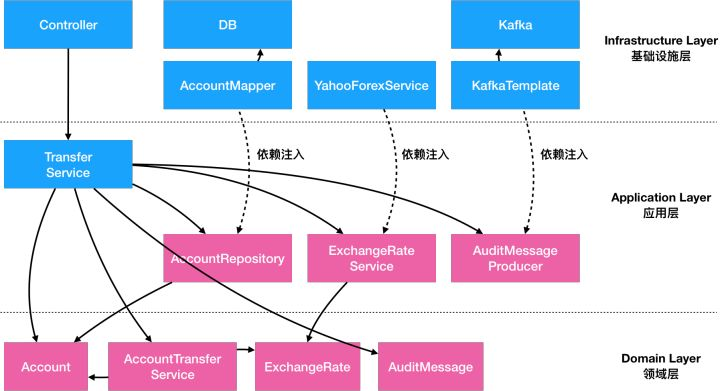


我们可以发现，通过对外部依赖的抽象和内部逻辑的封装重构，应用整体的依赖关系变了：

- 最底层不再是数据库，而是Entity、Domain Primitive和Domain Service。这些对象不依赖任何外部服务和框架，而是纯内存中的数据和操作。这些对象我们打包为Domain Layer（领域层）。领域层没有任何外部依赖关系。
- 再其次的是负责组件编排的Application Service，但是这些服务仅仅依赖了一些抽象出来的ACL类和Repository类，而其具体实现类是通过依赖注入注进来的。Application Service、Repository、ACL等我们统称为Application Layer（应用层）。应用层 依赖 领域层，但不依赖具体实现。
- 最后是ACL，Repository等的具体实现，这些实现通常依赖外部具体的技术实现和框架，所以统称为Infrastructure Layer（基础设施层）。Web框架里的对象如Controller之类的通常也属于基础设施层。

如果今天能够重新写这段代码，考虑到最终的依赖关系，我们可能先写Domain层的业务逻辑，然后再写Application层的组件编排，最后才写每个外部依赖的具体实现。这种架构思路和代码组织结构就叫做Domain-Driven Design（领域驱动设计，或DDD）。所以DDD不是一个特殊的架构设计，而是所有Transction Script代码经过合理重构后一定会抵达的终点。

### DDD的六边形架构
在我们传统的代码里，我们一般都很注重每个外部依赖的实现细节和规范，但是今天我们需要敢于抛弃掉原有的理念，重新审视代码结构。在上面重构的代码里，如果抛弃掉所有Repository、ACL、Producer等的具体实现细节，我们会发现每一个对外部的抽象类其实就是输入或输出，类似于计算机系统中的I/O节点。这个观点在CQRS架构中也同样适用，将所有接口分为Command（输入）和Query（输出）两种。除了I/O之外其他的内部逻辑，就是应用业务的核心逻辑。基于这个基础，Alistair Cockburn在2005年提出了Hexagonal Architecture（六边形架构），又被称之为Ports and Adapters（端口和适配器架构）。

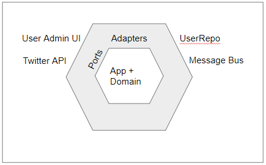

在这张图中：

- I/O的具体实现在模型的最外层
- 每个I/O的适配器在灰色地带
- 每个Hex的边是一个端口
- Hex的中央是应用的核心领域模型

在Hex中，架构的组织关系第一次变成了一个二维的内外关系，而不是传统一维的上下关系。同时在Hex架构中我们第一次发现UI层、DB层、和各种中间件层实际上是没有本质上区别的，都只是数据的输入和输出，而不是在传统架构中的最上层和最下层。

除了2005年的Hex架构，2008年 Jeffery Palermo的Onion Architecture（洋葱架构）和2017年 Robert Martin的Clean Architecture（干净架构），都是极为类似的思想。除了命名不一样、切入点不一样之外，其他的整体架构都是基于一个二维的内外关系。这也说明了基于DDD的架构最终的形态都是类似的。Herberto Graca有一个很全面的图包含了绝大部分现实中的端口类，值得借鉴。

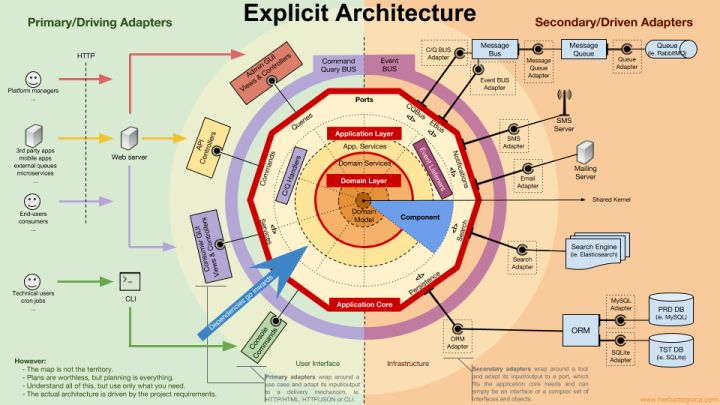

#### 代码组织结构

为了有效的组织代码结构，避免下层代码依赖到上层实现的情况，在Java中我们可以通过POM Module和POM依赖来处理相互的关系。通过Spring/SpringBoot的容器来解决运行时动态注入具体实现的依赖的问题。一个简单的依赖关系图如下：

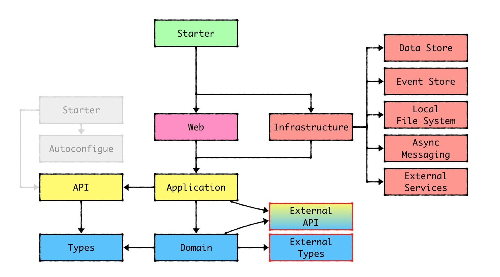

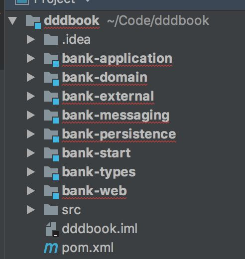


##### Types 模块

Types模块是保存可以对外暴露的Domain Primitives的地方。Domain Primitives因为是无状态的逻辑，可以对外暴露，所以经常被包含在对外的API接口中，需要单独成为模块。Types模块不依赖任何类库，纯 POJO 。

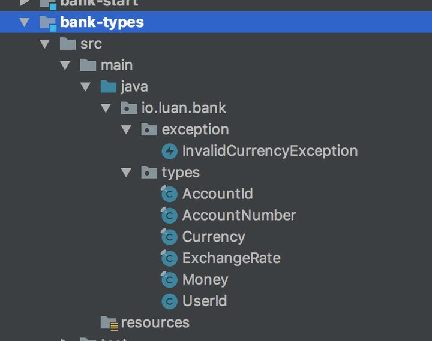


##### Domain 模块

Domain 模块是核心业务逻辑的集中地，包含有状态的Entity、领域服务Domain Service、以及各种外部依赖的接口类（如Repository、ACL、中间件等。Domain模块仅依赖Types模块，也是纯 POJO 。

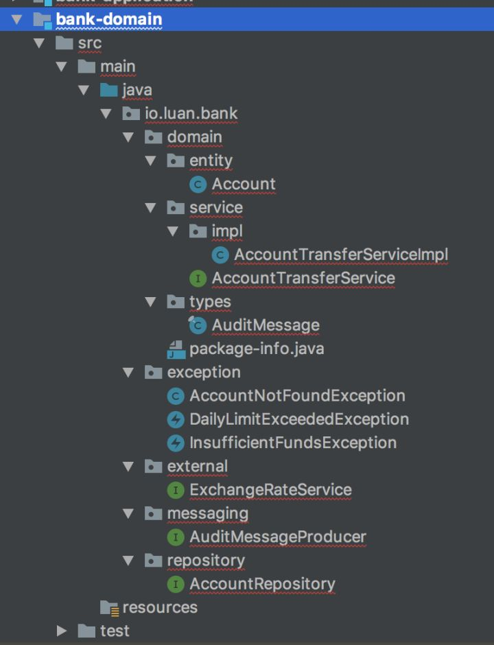

##### Application模块

Application模块主要包含Application Service和一些相关的类。Application模块依赖Domain模块。还是不依赖任何框架，纯POJO。

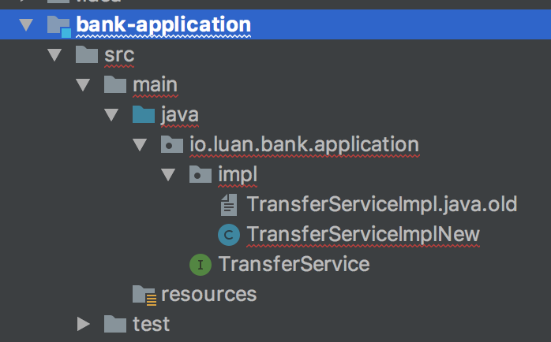

##### Infrastructure模块

Infrastructure模块包含了Persistence、Messaging、External等模块。比如：Persistence模块包含数据库DAO的实现，包含Data Object、ORM Mapper、Entity到DO的转化类等。Persistence模块要依赖具体的ORM类库，比如MyBatis。如果需要用Spring-Mybatis提供的注解方案，则需要依赖Spring。

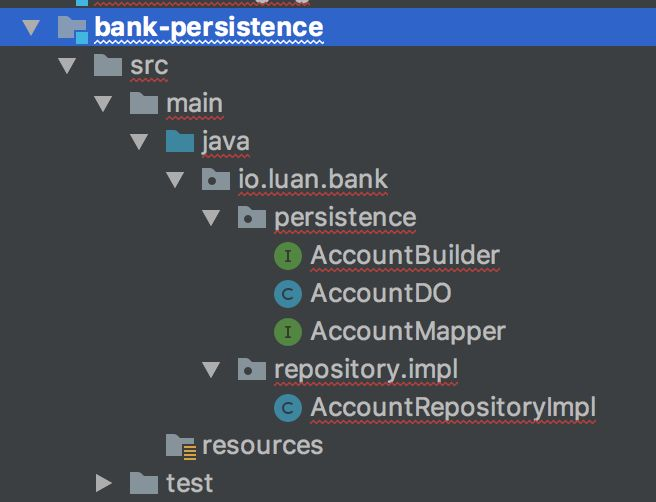


##### Web模块

Web模块包含Controller等相关代码。如果用SpringMVC则需要依赖Spring。


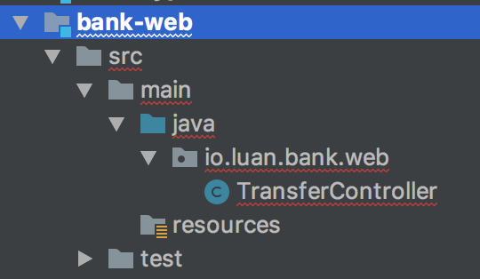

##### Start模块

Start模块是SpringBoot的启动类。

#### 测试

- Types，Domain模块都属于无外部依赖的纯POJO，基本上都可以100%的被单元测试覆盖。
- Application模块的代码依赖外部抽象类，需要通过测试框架去Mock所有外部依赖，但仍然可以100%被单元测试。
- Infrastructure的每个模块的代码相对独立，接口数量比较少，相对比较容易写单测。但是由于依赖了外部I/O，速度上不可能很快，但好在模块的变动不会很频繁，属于一劳永逸。
- Web模块有两种测试方法：通过Spring的MockMVC测试，或者通过HttpClient调用接口测试。但是在测试时最好把Controller依赖的服务类都Mock掉。一般来说当你把Controller的逻辑都后置到Application Service中时，Controller的逻辑变得极为简单，很容易100%覆盖。
- Start模块：通常应用的集成测试写在start里。当其他模块的单元测试都能100%覆盖后，集成测试用来验证整体链路的真实性。

#### 代码的演进/变化速度

在传统架构中，代码从上到下的变化速度基本上是一致的，改个需求需要从接口、到业务逻辑、到数据库全量变更，而第三方变更可能会导致整个代码的重写。但是在DDD中不同模块的代码的演进速度是不一样的：

- Domain层属于核心业务逻辑，属于经常被修改的地方。比如：原来不需要扣手续费，现在需要了之类的。通过Entity能够解决基于单个对象的逻辑变更，通过Domain Service解决多个对象间的业务逻辑变更。
- Application层属于Use Case（业务用例）。业务用例一般都是描述比较大方向的需求，接口相对稳定，特别是对外的接口一般不会频繁变更。添加业务用例可以通过新增Application Service或者新增接口实现功能的扩展。
- Infrastructure层属于最低频变更的。一般这个层的模块只有在外部依赖变更了之后才会跟着升级，而外部依赖的变更频率一般远低于业务逻辑的变更频率。

所以在DDD架构中，能明显看出越外层的代码越稳定，越内层的代码演进越快，真正体现了领域“驱动”的核心思想。

### 总结
DDD不是一个什么特殊的架构，而是任何传统代码经过合理的重构之后最终一定会抵达的终点。DDD的架构能够有效的解决传统架构中的问题：

- 高可维护性：当外部依赖变更时，内部代码只用变更跟外部对接的模块，其他业务逻辑不变。
- 高可扩展性：做新功能时，绝大部分的代码都能复用，仅需要增加核心业务逻辑即可。
- 高可测试性：每个拆分出来的模块都符合单一性原则，绝大部分不依赖框架，可以快速的单元测试，做到100%覆盖。
- 代码结构清晰：通过POM module可以解决模块间的依赖关系， 所有外接模块都可以单独独立成Jar包被复用。当团队形成规范后，可以快速的定位到相关代码。


https://juejin.cn/post/6845166890554228744

https://mp.weixin.qq.com/s/NoRTUSovcO2Yz237k0ceIw#at


1. 失血模型：是仅包含属性的 getter/setter 方法的数据载体，没有行为和动作，业务逻辑由服务层完成。
2. 贫血模型：包括了属性、getter/setter 方法，和不依赖于持久化的原子领域逻辑，依赖于持久层的业务逻辑将会放到服务层中。
3. 充血模型：包含了属性、getter/setter 方法、大部分的业务逻辑，包括依赖于持久层的业务逻辑，所以使用充血模型的领域层是依赖于持久层，服务层是很薄的一层，仅仅封装事务和少量逻辑。
4. 胀血模型：取消了 Service 层，胀血模型就是把和业务逻辑不相关的其他应用逻辑（如授权、事务等）都放到领域模型中。


