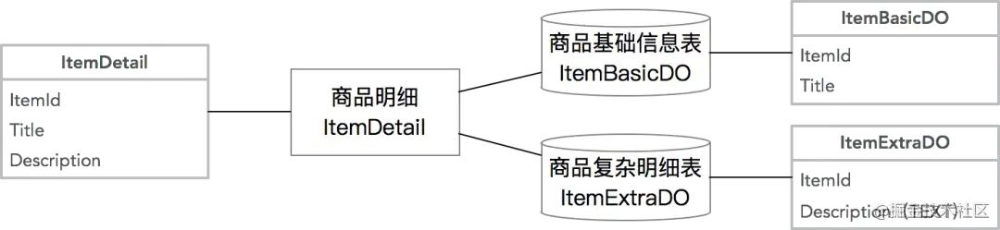
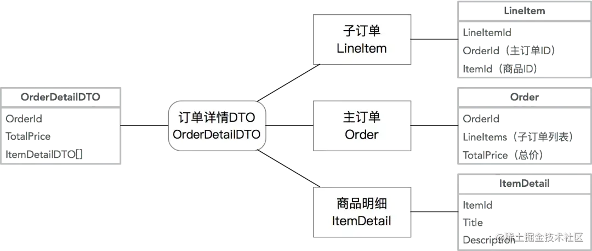
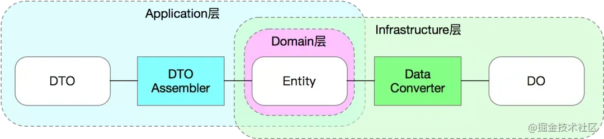
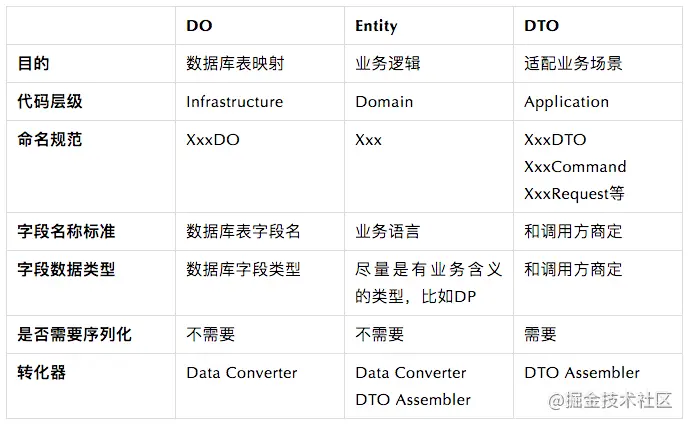
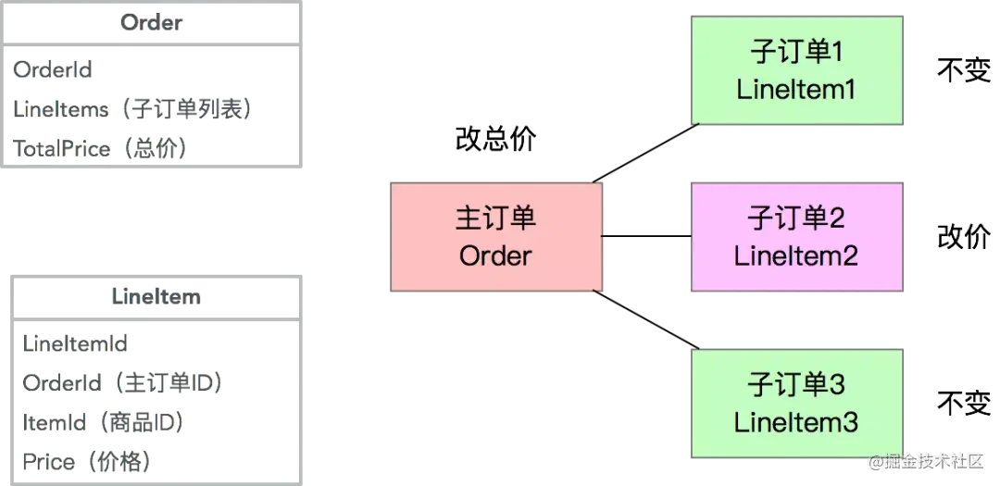

# DDD学习

标签（空格分隔）： DDD

---

* [DDD学习](#ddd学习)
   * [Domain Primitive](#domain-primitive)
      * [案例分析](#案例分析)
         * [问题1-接口的清晰度](#问题1-接口的清晰度)
         * [问题2-数据验证和错误处理](#问题2-数据验证和错误处理)
         * [问题3-业务代码的清晰度](#问题3-业务代码的清晰度)
         * [问题4-可测试性](#问题4-可测试性)
      * [解决方案](#解决方案)
         * [将隐性的概念显性化](#将隐性的概念显性化)
            * [评估1-接口的清晰度](#评估1-接口的清晰度)
            * [评估2-数据验证和错误处理](#评估2-数据验证和错误处理)
            * [评估3-业务代码的清晰度](#评估3-业务代码的清晰度)
            * [评估4-可测试性](#评估4-可测试性)
      * [进阶使用](#进阶使用)
         * [案例1 - 转账](#案例1---转账)
            * [将隐性的上下文显性化](#将隐性的上下文显性化)
         * [案例2-跨境转账](#案例2-跨境转账)
            * [封装多对象行为](#封装多对象行为)
      * [讨论和总结](#讨论和总结)
         * [Domain Primitive 的定义](#domain-primitive-的定义)
         * [使用 Domain Primitive 的三原则](#使用-domain-primitive-的三原则)
         * [Domain Primitive 和 DDD 里 Value Object 的区别](#domain-primitive-和-ddd-里-value-object-的区别)
         * [Domain Primitive 和 Data Transfer Object (DTO) 的区别](#domain-primitive-和-data-transfer-object-dto-的区别)
         * [什么情况下应该用 Domain Primitive](#什么情况下应该用-domain-primitive)
      * [实战 - 老应用重构的流程](#实战---老应用重构的流程)
         * [创建 Domain Primitive，收集所有 DP 行为](#创建-domain-primitive收集所有-dp-行为)
         * [替换数据校验和无状态逻辑](#替换数据校验和无状态逻辑)
         * [创建新接口](#创建新接口)
         * [修改外部调用](#修改外部调用)
   * [应用架构](#应用架构)
      * [案例分析](#案例分析-1)
         * [问题1-可维护性能差](#问题1-可维护性能差)
         * [问题2-可拓展性差](#问题2-可拓展性差)
         * [问题3-可测试性能差](#问题3-可测试性能差)
         * [总结分析](#总结分析)
      * [重构方案](#重构方案)
         * [抽象数据存储层](#抽象数据存储层)
            * [Repository和Entity](#repository和entity)
         * [抽象第三方服务](#抽象第三方服务)
            * [防腐层（ACL）](#防腐层acl)
         * [抽象中间件](#抽象中间件)
         * [封装业务逻辑](#封装业务逻辑)
            * [用Domain Primitive封装跟实体无关的无状态计算逻辑](#用domain-primitive封装跟实体无关的无状态计算逻辑)
            * [用Entity封装单对象的有状态的行为，包括业务校验](#用entity封装单对象的有状态的行为包括业务校验)
            * [用Domain Service封装多对象逻辑](#用domain-service封装多对象逻辑)
         * [重构后结果分析](#重构后结果分析)
      * [DDD的六边形架构](#ddd的六边形架构)
         * [代码组织结构](#代码组织结构)
            * [Types 模块](#types-模块)
            * [Domain 模块](#domain-模块)
            * [Application模块](#application模块)
            * [Infrastructure模块](#infrastructure模块)
            * [Web模块](#web模块)
            * [Start模块](#start模块)
         * [测试](#测试)
         * [代码的演进/变化速度](#代码的演进变化速度)
      * [总结](#总结)
   * [Repository模式](#repository模式)
      * [为什么要用 Repository](#为什么要用-repository)
         * [实体模型 vs. 贫血模型](#实体模型-vs-贫血模型)
      * [Repository的价值](#repository的价值)
      * [模型对象代码规范](#模型对象代码规范)
         * [对象类型](#对象类型)
         * [模型所在模块和转化器](#模型所在模块和转化器)
         * [模型规范总结](#模型规范总结)
      * [Repository代码规范](#repository代码规范)
         * [接口规范](#接口规范)
         * [Repository基础实现](#repository基础实现)
         * [Repository复杂实现](#repository复杂实现)
         * [Change-Tracking 变更追踪](#change-tracking-变更追踪)
         * [其他注意事项](#其他注意事项)
      * [Repository迁移路径](#repository迁移路径)
   * [领域层设计规范](#领域层设计规范)
      * [初探龙与魔法的世界架构](#初探龙与魔法的世界架构)
         * [背景和规则](#背景和规则)
         * [OOP实现](#oop实现)
         * [分析OOP代码的设计缺陷](#分析oop代码的设计缺陷)
      * [Entity-Component-System（ECS）架构简介](#entity-component-systemecs架构简介)
         * [ECS介绍](#ecs介绍)
         * [ECS架构分析](#ecs架构分析)
         * [ECS的缺陷](#ecs的缺陷)
      * [基于DDD架构的一种解法](#基于ddd架构的一种解法)
         * [领域对象](#领域对象)
         * [装备行为](#装备行为)
         * [攻击行为](#攻击行为)
         * [单元测试](#单元测试)
         * [移动系统](#移动系统)
      * [DDD领域层的一些设计规范](#ddd领域层的一些设计规范)
         * [实体类（Entity）](#实体类entity)
         * [领域服务（Domain Service）](#领域服务domain-service)
         * [策略对象（Domain Policy）](#策略对象domain-policy)
      * [加餐 - 副作用的处理方法 - 领域事件](#加餐---副作用的处理方法---领域事件)
         * [领域事件介绍](#领域事件介绍)
         * [领域事件实现](#领域事件实现)
         * [目前领域事件的缺陷和展望](#目前领域事件的缺陷和展望)
      * [总结](#总结-1)

以下内容大多来自参考文档，部分融合了一些个人的理解在其中。

## Domain Primitive

- https://developer.aliyun.com/article/716908


在 DDD 里，Domain Primitive（后续简称DP）  可以说是一切模型、方法、架构的基础，就像其他变成语言中的 Integer、String 一样无处不在。我们通过一个案例来讲解DP的一些特性。

### 案例分析

业务背景如下：

- 一个新应用在全国通过 地推业务员 做推广，需要做一个用户注册系统，同时希望在用户注册后能够通过用户电话（先假设仅限座机）的地域（区号）对业务员发奖金。

对于业务的合理性不做深究，根据上面的业务需求，一个简单的实现如下：
```java
// 定义用户实体对象
public class User {
    Long userId;
    String name;
    String phone;
    String address;
    Long repId;
}

// 用户注册的业务逻辑处理
public class RegistrationServiceImpl implements RegistrationService {

    private SalesRepRepository salesRepRepo;
    private UserRepository userRepo;

    public User register(String name, String phone, String address) 
      throws ValidationException {
        // 校验逻辑
        if (name == null || name.length() == 0) {
            throw new ValidationException("name");
        }
        if (phone == null || !isValidPhoneNumber(phone)) {
            throw new ValidationException("phone");
        }
        // 此处省略address的校验逻辑

        // 取电话号里的区号，然后通过区号找到区域内的SalesRep
        String areaCode = null;
        String[] areas = new String[]{"0571", "021", "010"};
        for (int i = 0; i < phone.length(); i++) {
            String prefix = phone.substring(0, i);
            if (Arrays.asList(areas).contains(prefix)) {
                areaCode = prefix;
                break;
            }
        }
        SalesRep rep = salesRepRepo.findRep(areaCode);

        // 最后创建用户，落盘，然后返回
        User user = new User();
        user.name = name;
        user.phone = phone;
        user.address = address;
        if (rep != null) {
            user.repId = rep.repId;
        }

        return userRepo.save(user);
    }

    private boolean isValidPhoneNumber(String phone) {
        String pattern = "^0[1-9]{2,3}-?\\d{8}$";
        return phone.matches(pattern);
    }
}
```

我们日常绝大部分代码和模型其实都跟这个是类似的，乍一看貌似没啥问题，但我们再深入一步，从以下四个维度去分析一下：接口的清晰度（可阅读性）、数据验证和错误处理、业务逻辑代码的清晰度、和可测试性。

#### 问题1-接口的清晰度

在Java代码中，对于一个方法来说所有的参数名在编译时丢失，留下的仅仅是一个参数类型的列表，所以我们重新看一下以上的接口定义，其实在运行时仅仅是：
```java
User register(String, String, String);
```
所以以下的代码是一段编译器完全不会报错的，很难通过看代码就能发现的 bug ：
```java
// 实际上，第二个参数是phone，第三个参数才是address
service.register("殷浩", "浙江省杭州市余杭区文三西路969号", "0571-12345678");
```
当然，在真实代码中运行时会报错，但这种 bug 是在运行时被发现的，而不是在编译时。普通的 Code Review 也很难发现这种问题，很有可能是代码上线后才会被暴露出来。这里的思考是，有没有办法在编码时就避免这种可能会出现的问题？

另外一种常见的，特别是在查询服务中容易出现的例子如下：
```java
User findByName(String name);
User findByPhone(String phone);
User findByNameAndPhone(String name, String phone);
```
在这个场景下，由于入参都是 String 类型，不得不在方法名上面加上 ByXXX 来区分，而 findByNameAndPhone 同样也会陷入前面的入参顺序错误的问题，而且和前面的入参不同，这里参数顺序如果输错了，方法不会报错只会返回 null，而这种 bug 更加难被发现。

这里需要思考的是，**有没有办法让方法入参一目了然，避免入参错误导致的 bug ？**

#### 问题2-数据验证和错误处理

在上面的代码中有一段数据校验的代码：
```java
if (phone == null || !isValidPhoneNumber(phone)) {
    throw new ValidationException("phone");
}
```
在日常编码中经常会出现，一般来说这种代码需要出现在方法的最前端，确保能够 fail-fast 。但是假设你有多个类似的接口和类似的入参，在每个方法里这段逻辑会被重复。而更严重的是如果未来我们要拓展电话号去包含手机时，很可能需要加入以下代码：
```java
if (phone == null || !isValidPhoneNumber(phone) || !isValidCellNumber(phone)) {
    throw new ValidationException("phone");
}
```
如果你有很多个地方用到了 phone 这个入参，但是有个地方忘记修改了，会造成 bug 。这是一个 DRY（Don't repeat yourself，简单来说就是不写重复代码，公共的部分要提出来大家共用，比如封装成工具类等） 原则被违背时经常会发生的问题。

如果有个新的需求，需要把入参错误的原因返回，那么这段代码就变得更加复杂：
```java
if (phone == null) {
    throw new ValidationException("phone不能为空");
} else if (!isValidPhoneNumber(phone)) {
    throw new ValidationException("phone格式错误");
}
```

可以想像得到，代码里充斥着大量的类似代码块时，维护成本要有多高。

最后，在这个业务方法里，会（隐性或显性的）抛 ValidationException，所以需要外部调用方去try/catch，而业务逻辑异常和数据校验异常被混在了一起，是否是合理的？

在传统Java架构里有几个办法能够去解决一部分问题，常见的如BeanValidation注解或ValidationUtils类，比如：
```java
// Use Bean Validation
User registerWithBeanValidation(
  @NotNull @NotBlank String name,
  @NotNull @Pattern(regexp = "^0?[1-9]{2,3}-?\\d{8}$") String phone,
  @NotNull String address
);

// Use ValidationUtils:
public User registerWithUtils(String name, String phone, String address) {
    ValidationUtils.validateName(name); // throws ValidationException
    ValidationUtils.validatePhone(phone);
    ValidationUtils.validateAddress(address);
    ...
}
```
但这几个传统的方法同样有问题，

**BeanValidation：**

- 通常只能解决简单的校验逻辑，复杂的校验逻辑一样要写代码实现定制校验器
- 在添加了新校验逻辑时，同样会出现在某些地方忘记添加一个注解的情况，DRY原则还是会被违背

**ValidationUtils类：**

- 当大量的校验逻辑集中在一个类里之后，违背了Single Responsibility单一性原则，导致代码混乱和不可维护
- 业务异常和校验异常还是会混杂

所以，**有没有一种方法，能够一劳永逸的解决所有校验的问题以及降低后续的维护成本和异常处理成本呢？**

#### 问题3-业务代码的清晰度

在这段代码里：
```java
String areaCode = null;
String[] areas = new String[]{"0571", "021", "010"};
for (int i = 0; i < phone.length(); i++) {
    String prefix = phone.substring(0, i);
    if (Arrays.asList(areas).contains(prefix)) {
        areaCode = prefix;
        break;
    }
}

SalesRep rep = salesRepRepo.findRep(areaCode);
```
实际上出现了另外一种常见的情况，那就是从一些入参里抽取一部分数据，然后调用一个外部依赖获取更多的数据，然后通常从新的数据中再抽取部分数据用作其他的作用。这种代码通常被称作“胶水代码”，其本质是由于外部依赖的服务的入参并不符合我们原始的入参导致的。比如，如果SalesRepRepository包含一个findRepByPhone的方法，则上面大部分的代码都不必要了。

所以，一个常见的办法是将这段代码抽离出来，变成独立的一个或多个方法：
```java
private static String findAreaCode(String phone) {
    for (int i = 0; i < phone.length(); i++) {
        String prefix = phone.substring(0, i);
        if (isAreaCode(prefix)) {
            return prefix;
        }
    }
    return null;
}

private static boolean isAreaCode(String prefix) {
    String[] areas = new String[]{"0571", "021"};
    return Arrays.asList(areas).contains(prefix);
}
```
然后原始代码变为：
```java
String areaCode = findAreaCode(phone);
SalesRep rep = salesRepRepo.findRep(areaCode);
```
而为了复用以上的方法，可能会抽离出一个静态工具类 PhoneUtils 。但是这里要思考的是，**静态工具类是否是最好的实现方式呢？当你的项目里充斥着大量的静态工具类，业务代码散在多个文件当中时，你是否还能找到核心的业务逻辑呢？**

#### 问题4-可测试性

为了保证代码质量，每个方法里的每个入参的每个可能出现的条件都要有 TC 覆盖（假设我们先不去测试内部业务逻辑），所以在我们这个方法里需要以下的 TC ：


假如一个方法有 N 个参数，每个参数有 M 个校验逻辑，至少要有 N * M 个 TC 。

如果这时候在该方法中加入一个新的入参字段 fax ，即使 fax 和 phone 的校验逻辑完全一致，为了保证 TC 覆盖率，也一样需要 M 个新的 TC 。

而假设有 P 个方法中都用到了 phone 这个字段，这 P 个方法都需要对该字段进行测试，也就是说整体需要P*N*M个测试用例才能完全覆盖所有数据验证的问题，在日常项目中，这个测试的成本非常之高，导致大量的代码没被覆盖到。而没被测试覆盖到的代码才是最有可能出现问题的地方。

在这个情况下，降低测试成本就是变相的提升代码质量，**如何能够降低测试的成本呢？**

### 解决方案

重温一下刚刚的业务场景：

- 一个新应用在全国通过 地推业务员 做推广，需要做一个用户注册系统，同时希望在用户注册后能够通过用户电话（先假设仅限座机）的地域（区号）对业务员发奖金。

在分析了 use case 后，发现其中地推业务员、用户本身自带 ID 属性，属于 Entity（实体），而注册系统属于 Application Service（应用服务），这几个概念已经有存在。但是发现电话号这个概念却完全被隐藏到了代码之中。我们可以问一下自己，取电话号的区号的逻辑是否属于用户（用户的区号？）？是否属于注册服务（注册的区号？）？如果都不是很贴切，那就说明这个逻辑应该属于一个独立的概念。所以这里引入我们第一个原则：

#### 将隐性的概念显性化

Make Implicit Concepts Explicit

在这里，我们可以看到，原来电话号仅仅是用户的一个参数，属于隐性概念，但实际上电话号的区号才是真正的业务逻辑，而我们需要将电话号的概念显性化，通过写一个Value Object：
```java
public class PhoneNumber {
  
    private final String number;
    public String getNumber() {
        return number;
    }

    public PhoneNumber(String number) {
        if (number == null) {
            throw new ValidationException("number不能为空");
        } else if (isValid(number)) {
            throw new ValidationException("number格式错误");
        }
        this.number = number;
    }

    public String getAreaCode() {
        for (int i = 0; i < number.length(); i++) {
            String prefix = number.substring(0, i);
            if (isAreaCode(prefix)) {
                return prefix;
            }
        }
        return null;
    }

    private static boolean isAreaCode(String prefix) {
        String[] areas = new String[]{"0571", "021", "010"};
        return Arrays.asList(areas).contains(prefix);
    }

    public static boolean isValid(String number) {
        String pattern = "^0?[1-9]{2,3}-?\\d{8}$";
        return number.matches(pattern);
    }

}
```

这里面有几个很重要的元素：

通过 private final String number 确保 PhoneNumber 是一个（Immutable）Value Object。（一般来说 VO 都是 Immutable 的，这里只是重点强调一下）

校验逻辑都放在了 constructor 里面，确保只要 PhoneNumber 类被创建出来后，一定是校验通过的。

之前的 findAreaCode 方法变成了 PhoneNumber 类里的 getAreaCode ，突出了 areaCode 是 PhoneNumber 的一个计算属性。

这样做完之后，我们发现把 PhoneNumber 显性化之后，其实是生成了一个 Type（数据类型）和一个 Class（类）：

- Type 指我们在今后的代码里可以通过 PhoneNumber 去显性的标识电话号这个概念
- Class 指我们可以把所有跟电话号相关的逻辑完整的收集到一个文件里

这两个概念加起来，构造成了本文标题的 Domain Primitive（DP）。

我们看一下全面使用了 DP 之后效果：
```java
public class User {
    UserId userId;
    Name name;
    PhoneNumber phone;
    Address address;
    RepId repId;
}

public User register(
  @NotNull Name name,
  @NotNull PhoneNumber phone,
  @NotNull Address address
) {
    // 找到区域内的SalesRep
    SalesRep rep = salesRepRepo.findRep(phone.getAreaCode());

    // 最后创建用户，落盘，然后返回，这部分代码实际上也能用Builder解决
    User user = new User();
    user.name = name;
    user.phone = phone;
    user.address = address;
    if (rep != null) {
        user.repId = rep.repId;
    }

    return userRepo.saveUser(user);
}
```

我们可以看到在使用了 DP 之后，所有的数据验证逻辑和非业务流程的逻辑都消失了，剩下都是核心业务逻辑，可以一目了然。我们重新用上面的四个维度评估一下：

##### 评估1-接口的清晰度

重构后的方法签名变成了很清晰的：

```java
public User register(Name, PhoneNumber, Address)
```
而之前容易出现的bug，如果按照现在的写法

```java
service.register(new Name("殷浩"), new Address("浙江省杭州市余杭区文三西路969号"), new PhoneNumber("0571-12345678"));
```
让接口 API 变得很干净，易拓展。

##### 评估2-数据验证和错误处理

```java
public User register(
  @NotNull Name name,
  @NotNull PhoneNumber phone,
  @NotNull Address address
) // no throws
```
如前文代码展示的，重构后的方法里，完全没有了任何数据验证的逻辑，也不会抛 ValidationException 。原因是因为 DP 的特性，只要是能够带到入参里的一定是正确的或 null（Bean Validation 或 lombok 的注解能解决 null 的问题）。所以我们把数据验证的工作量前置到了调用方，而调用方本来就是应该提供合法数据的，所以更加合适。

再展开来看，使用DP的另一个好处就是代码遵循了 DRY 原则和单一性原则，如果未来需要修改 PhoneNumber 的校验逻辑，只需要在一个文件里修改即可，所有使用到了 PhoneNumber 的地方都会生效。

##### 评估3-业务代码的清晰度

```java
SalesRep rep = salesRepRepo.findRep(phone.getAreaCode());
User user = xxx;
return userRepo.save(user);
```
除了在业务方法里不需要校验数据之外，原来的一段胶水代码 findAreaCode 被改为了 PhoneNumber 类的一个计算属性 getAreaCode ，让代码清晰度大大提升。而且胶水代码通常都不可复用，但是使用了 DP 后，变成了可复用、可测试的代码。我们能看到，在刨除了数据验证代码、胶水代码之后，剩下的都是核心业务逻辑。（ Entity 相关的重构在后面文章会谈到，这次先忽略）

##### 评估4-可测试性


当我们将 PhoneNumber 抽取出来之后，在来看测试的 TC ：

- 首先 PhoneNumber 本身还是需要 M 个测试用例，但是由于我们只需要测试单一对象，每个用例的代码量会大大降低，维护成本降低。
- 每个方法里的每个参数，现在只需要覆盖为 null 的情况就可以了，其他的 case 不可能发生（因为只要不是 null 就一定是合法的）
所以，单个方法的 TC 从原来的 N * M 变成了今天的 N + M 。同样的，多个方法的 TC 数量变成了

N + M + P

这个数量一般来说要远低于原来的数量 N M P ，让测试成本极大的降低。

### 进阶使用

在上文我介绍了 DP 的第一个原则：将隐性的概念显性化。在这里我将介绍 DP 的另外两个原则，用一个新的案例。

#### 案例1 - 转账

假设现在要实现一个功能，让A用户可以支付 x 元给用户 B ，可能的实现如下：
```java
public void pay(BigDecimal money, Long recipientId) {
    BankService.transfer(money, "CNY", recipientId);
}
```
如果这个是境内转账，并且境内的货币永远不变，该方法貌似没啥问题，但如果有一天货币变更了（比如欧元区曾经出现的问题），或者我们需要做跨境转账，该方法是明显的 bug ，因为 money 对应的货币不一定是 CNY 。

在这个 case 里，当我们说“支付 x 元”时，除了 x 本身的数字之外，实际上是有一个隐含的概念那就是货币「人民币-元」。但是在原始的入参里，之所以只用了 BigDecimal 的原因是我们认为 CNY 货币是默认的，是一个隐含的条件，但是在我们写代码时，需要把所有隐性的条件显性化，而这些条件整体组成当前的上下文。所以 DP 的第二个原则是：

##### 将隐性的上下文显性化

Make Implicit Context Explicit

所以当我们做这个支付功能时，实际上需要的一个入参是支付金额 + 支付货币。我们可以把这两个概念组合成为一个独立的完整概念：Money。
```java
@Value
public class Money {
    private BigDecimal amount;
    private Currency currency;
    public Money(BigDecimal amount, Currency currency) {
        this.amount = amount;
        this.currency = currency;
    }
}
```
而原有的代码则变为：
```java
public void pay(Money money, Long recipientId) {
    BankService.transfer(money, recipientId);
}
```
通过将默认货币这个隐性的上下文概念显性化，并且和金额合并为 Money ，我们可以避免很多当前看不出来，但未来可能会暴雷的bug。

#### 案例2-跨境转账

前面的案例升级一下，假设用户可能要做跨境转账从 CNY 到 USD ，并且货币汇率随时在波动：
```java
public void pay(Money money, Currency targetCurrency, Long recipientId) {
    if (money.getCurrency().equals(targetCurrency)) {
        BankService.transfer(money, recipientId);
    } else {
        BigDecimal rate = ExchangeService.getRate(money.getCurrency(), targetCurrency);
        BigDecimal targetAmount = money.getAmount().multiply(new BigDecimal(rate));
        Money targetMoney = new Money(targetAmount, targetCurrency);
        BankService.transfer(targetMoney, recipientId);
    }
}
```
在这个case里，由于 targetCurrency 不一定和 money 的 Curreny 一致，需要调用一个服务去取汇率，然后做计算。最后用计算后的结果做转账。

这个case最大的问题在于，金额的计算被包含在了支付的服务中，涉及到的对象也有2个 Currency ，2 个 Money ，1 个 BigDecimal ，总共 5 个对象。这种涉及到多个对象的业务逻辑，需要用 DP 包装掉，所以这里引出 DP 的第三个原则：

##### 封装多对象行为

Encapsulate Multi-Object Behavior

在这个 case 里，可以将转换汇率的功能，封装到一个叫做 ExchangeRate 的 DP 里：
```java
@Value
public class ExchangeRate {
    private BigDecimal rate;
    private Currency from;
    private Currency to;

    public ExchangeRate(BigDecimal rate, Currency from, Currency to) {
        this.rate = rate;
        this.from = from;
        this.to = to;
    }

    public Money exchange(Money fromMoney) {
        notNull(fromMoney);
        isTrue(this.from.equals(fromMoney.getCurrency()));
        BigDecimal targetAmount = fromMoney.getAmount().multiply(rate);
        return new Money(targetAmount, to);
    }
}
```

ExchangeRate 汇率对象，通过封装金额计算逻辑以及各种校验逻辑，让原始代码变得极其简单：
```java
public void pay(Money money, Currency targetCurrency, Long recipientId) {
    ExchangeRate rate = ExchangeService.getRate(money.getCurrency(), targetCurrency);
    Money targetMoney = rate.exchange(money);
    BankService.transfer(targetMoney, recipientId);
}
```

### 讨论和总结

#### Domain Primitive 的定义

让我们重新来定义一下 Domain Primitive ：Domain Primitive 是一个在特定领域里，拥有精准定义的、可自我验证的、拥有行为的 Value Object 。

- DP是一个传统意义上的Value Object，拥有Immutable的特性
- DP是一个完整的概念整体，拥有精准定义
- DP使用业务域中的原生语言
- DP可以是业务域的最小组成部分、也可以构建复杂组合

注：Domain Primitive的概念和命名来自于Dan Bergh Johnsson & Daniel Deogun的书 Secure by Design。

#### 使用 Domain Primitive 的三原则

- 让隐性的概念显性化
- 让隐性的上下文显性化
- 封装多对象行为

#### Domain Primitive 和 DDD 里 Value Object 的区别

在 DDD 中， Value Object 这个概念其实已经存在：

- 在 Evans 的 DDD 蓝皮书中，Value Object 更多的是一个非 Entity 的值对象
- 在Vernon的IDDD红皮书中，作者更多的关注了Value Object的Immutability、Equals方法、Factory方法等

Domain Primitive 是 Value Object 的进阶版，在原始 VO 的基础上要求每个 DP 拥有概念的整体，而不仅仅是值对象。在 VO 的 Immutable 基础上增加了 Validity 和行为。当然同样的要求无副作用（side-effect free）。

#### Domain Primitive 和 Data Transfer Object (DTO) 的区别

在日常开发中经常会碰到的另一个数据结构是 DTO ，比如方法的入参和出参。DP 和 DTO 的区别如下：


#### 什么情况下应该用 Domain Primitive

常见的 DP 的使用场景包括：

- 有格式限制的 String：比如Name，PhoneNumber，OrderNumber，ZipCode，Address等
- 有限制的Integer：比如OrderId（>0），Percentage（0-100%），Quantity（>=0）等
- 可枚举的 int ：比如 Status（一般不用Enum因为反序列化问题）
- Double 或 BigDecimal：一般用到的 Double 或 BigDecimal 都是有业务含义的，比如 Temperature、Money、Amount、ExchangeRate、Rating 等
- 复杂的数据结构：比如 Map 等，尽量把 Map 的所有操作包装掉，仅暴露必要行为

### 实战 - 老应用重构的流程

在新应用中使用 DP 是比较简单的，但在老应用中使用 DP 是可以遵循以下流程按部就班的升级。在此用本文的第一个 case 为例。

#### 创建 Domain Primitive，收集所有 DP 行为

在前文中，我们发现取电话号的区号这个是一个可以独立出来的、可以放入 PhoneNumber 这个 Class 的逻辑。类似的，在真实的项目中，以前散落在各个服务或工具类里面的代码，可以都抽出来放在 DP 里，成为 DP 自己的行为或属性。这里面的原则是：所有抽离出来的方法要做到无状态，比如原来是 static 的方法。如果原来的方法有状态变更，需要将改变状态的部分和不改状态的部分分离，然后将无状态的部分融入 DP 。因为 DP 本身不能带状态，所以一切需要改变状态的代码都不属于 DP 的范畴。

(代码参考 PhoneNumber 的代码，这里不再重复)


#### 替换数据校验和无状态逻辑

为了保障现有方法的兼容性，在第二步不会去修改接口的签名，而是通过代码替换原有的校验逻辑和根 DP 相关的业务逻辑。比如：
```java
public User register(String name, String phone, String address)
        throws ValidationException {
    if (name == null || name.length() == 0) {
        throw new ValidationException("name");
    }
    if (phone == null || !isValidPhoneNumber(phone)) {
        throw new ValidationException("phone");
    }
    
    String areaCode = null;
    String[] areas = new String[]{"0571", "021", "010"};
    for (int i = 0; i < phone.length(); i++) {
        String prefix = phone.substring(0, i);
        if (Arrays.asList(areas).contains(prefix)) {
            areaCode = prefix;
            break;
        }
    }
    SalesRep rep = salesRepRepo.findRep(areaCode);
    // 其他代码...
}
```
通过 DP 替换代码后：
```java
public User register(String name, String phone, String address)
        throws ValidationException {
    
    Name _name = new Name(name);
    PhoneNumber _phone = new PhoneNumber(phone);
    Address _address = new Address(address);
    
    SalesRep rep = salesRepRepo.findRep(_phone.getAreaCode());
    // 其他代码...
}
```
通过 new PhoneNumber(phone) 这种代码，替代了原有的校验代码。

通过 _phone.getAreaCode() 替换了原有的无状态的业务逻辑。

#### 创建新接口

创建新接口，将DP的代码提升到接口参数层：
```java
public User register(Name name, PhoneNumber phone, Address address) {
    SalesRep rep = salesRepRepo.findRep(phone.getAreaCode());
}
```
#### 修改外部调用

外部调用方需要修改调用链路，比如：
```java
service.register("殷浩", "0571-12345678", "浙江省杭州市余杭区文三西路969号");
```
改为：
```java
service.register(new Name("殷浩"), new PhoneNumber("0571-12345678"), new Address("浙江省杭州市余杭区文三西路969号"));
```
通过以上 4 步，就能让你的代码变得更加简洁、优雅、健壮、安全。

## 应用架构

- https://zhuanlan.zhihu.com/p/84223605?from_voters_page=true

下面的内容，大部分来自于[这里](https://zhuanlan.zhihu.com/p/84223605?from_voters_page=true)。

架构这个词源于英文里的“Architecture“，源头是土木工程里的“建筑”和“结构”，而架构里的”架“同时又包含了”架子“（scaffolding）的含义，意指能快速搭建起来的固定结构。而今天的应用架构，意指软件系统中固定不变的代码结构、设计模式、规范和组件间的通信方式。在应用开发中架构之所以是最重要的第一步，因为一个好的架构能让系统安全、稳定、快速迭代。在一个团队内通过规定一个固定的架构设计，可以让团队内能力参差不齐的同学们都能有一个统一的开发规范，降低沟通成本，提升效率和代码质量。

在做架构设计时，一个好的架构应该需要实现以下几个目标：

- 独立于框架：架构不应该依赖某个外部的库或框架，不应该被框架的结构所束缚。
- 独立于UI：前台展示的样式可能会随时发生变化（今天可能是网页、明天可能变成console、后天是独立app），但是底层架构不应该随之而变化。
- 独立于底层数据源：无论今天你用MySQL、Oracle还是MongoDB、CouchDB，甚至使用文件系统，软件架构不应该因为不同的底层数据储存方式而产生巨大改变。
- 独立于外部依赖：无论外部依赖如何变更、升级，业务的核心逻辑不应该随之而大幅变化。
- 可测试：无论外部依赖了什么数据库、硬件、UI或者服务，业务的逻辑应该都能够快速被验证正确性。

这就好像是建筑中的楼宇，一个好的楼宇，无论内部承载了什么人、有什么样的活动、还是外部有什么风雨，一栋楼都应该屹立不倒，而且可以确保它不会倒。但是今天我们在做业务研发时，更多的会去关注一些宏观的架构，比如SOA架构、微服务架构，而忽略了应用内部的架构设计，很容易导致代码逻辑混乱，很难维护，容易产生bug而且很难发现。今天，我希望能够通过案例的分析和重构，来推演出一套高质量的DDD架构。

### 案例分析
我们先看一个简单的案例需求如下：

用户可以通过银行网页转账给另一个账号，支持跨币种转账。

同时因为监管和对账需求，需要记录本次转账活动。

拿到这个需求之后，一个开发可能会经历一些技术选型，最终可能拆解需求如下：

1、从MySql数据库中找到转出和转入的账户，选择用 MyBatis 的 mapper 实现 DAO；

2、从 Yahoo（或其他渠道）提供的汇率服务获取转账的汇率信息（底层是 http 开放接口）；

3、计算需要转出的金额，确保账户有足够余额，并且没超出每日转账上限；

4、实现转入和转出操作，扣除手续费，保存数据库；

5、发送 Kafka 审计消息，以便审计和对账用；

而一个简单的代码实现如下：
```java
public class TransferController {

    private TransferService transferService;

    public Result<Boolean> transfer(String targetAccountNumber, BigDecimal amount, HttpSession session) {
        Long userId = (Long) session.getAttribute("userId");
        return transferService.transfer(userId, targetAccountNumber, amount, "CNY");
    }
}

public class TransferServiceImpl implements TransferService {

    private static final String TOPIC_AUDIT_LOG = "TOPIC_AUDIT_LOG";
    private AccountMapper accountDAO;
    private KafkaTemplate<String, String> kafkaTemplate;
    private YahooForexService yahooForex;

    @Override
    public Result<Boolean> transfer(Long sourceUserId, String targetAccountNumber, BigDecimal targetAmount, String targetCurrency) {
        // 1. 从数据库读取数据，忽略所有校验逻辑如账号是否存在等
        AccountDO sourceAccountDO = accountDAO.selectByUserId(sourceUserId);
        AccountDO targetAccountDO = accountDAO.selectByAccountNumber(targetAccountNumber);

        // 2. 业务参数校验
        if (!targetAccountDO.getCurrency().equals(targetCurrency)) {
            throw new InvalidCurrencyException();
        }

        // 3. 获取外部数据，并且包含一定的业务逻辑
        // exchange rate = 1 source currency = X target currency
        BigDecimal exchangeRate = BigDecimal.ONE;
        if (sourceAccountDO.getCurrency().equals(targetCurrency)) {
            exchangeRate = yahooForex.getExchangeRate(sourceAccountDO.getCurrency(), targetCurrency);
        }
        BigDecimal sourceAmount = targetAmount.divide(exchangeRate, RoundingMode.DOWN);

        // 4. 业务参数校验
        if (sourceAccountDO.getAvailable().compareTo(sourceAmount) < 0) {
            throw new InsufficientFundsException();
        }

        if (sourceAccountDO.getDailyLimit().compareTo(sourceAmount) < 0) {
            throw new DailyLimitExceededException();
        }

        // 5. 计算新值，并且更新字段
        BigDecimal newSource = sourceAccountDO.getAvailable().subtract(sourceAmount);
        BigDecimal newTarget = targetAccountDO.getAvailable().add(targetAmount);
        sourceAccountDO.setAvailable(newSource);
        targetAccountDO.setAvailable(newTarget);

        // 6. 更新到数据库
        accountDAO.update(sourceAccountDO);
        accountDAO.update(targetAccountDO);

        // 7. 发送审计消息
        String message = sourceUserId + "," + targetAccountNumber + "," + targetAmount + "," + targetCurrency;
        kafkaTemplate.send(TOPIC_AUDIT_LOG, message);

        return Result.success(true);
    }
}
```
我们可以看到，一段业务代码里经常包含了参数校验、数据读取存储、业务计算、调用外部服务、发送消息等多种逻辑。在这个案例里虽然是写在了同一个方法里，在真实代码中经常会被拆分成多个子方法，但实际效果是一样的，而在我们日常的工作中，绝大部分代码都或多或少的接近于此类结构。在Martin Fowler的 P of EAA书中，这种很常见的代码样式被叫做Transaction Script（事务脚本）。虽然这种类似于脚本的写法在功能上没有什么问题，但是长久来看，他有以下几个很大的问题：可维护性差、可扩展性差、可测试性差。

#### 问题1-可维护性能差

一个应用最大的成本一般都不是来自于开发阶段，而是应用整个生命周期的总维护成本，所以代码的可维护性代表了最终成本。

**可维护性 = 当依赖变化时，有多少代码需要随之改变**
参考以上的案例代码，事务脚本类的代码很难维护因为以下几点：

- 数据结构的不稳定性：AccountDO类是一个纯数据结构，映射了数据库中的一个表。这里的问题是数据库的表结构和设计是应用的外部依赖，长远来看都有可能会改变，比如数据库要做Sharding，或者换一个表设计，或者改变字段名。
- 依赖库的升级：AccountMapper依赖MyBatis的实现，如果MyBatis未来升级版本，可能会造成用法的不同（可以参考iBatis升级到基于注解的MyBatis的迁移成本）。同样的，如果未来换一个ORM体系，迁移成本也是巨大的。
第三方服务依赖的不确定性：第三方服务，比如Yahoo的汇率服务未来很有可能会有变化：轻则API签名变化，重则服务不可用需要寻找其他可替代的服务。在这些情况下改造和迁移成本都是巨大的。同时，外部依赖的兜底、限流、熔断等方案都需要随之改变。
- 第三方服务API的接口变化：YahooForexService.getExchangeRate返回的结果是小数点还是百分比？入参是（source, target）还是（target, source）？谁能保证未来接口不会改变？如果改变了，核心的金额计算逻辑必须跟着改，否则会造成资损。
中间件更换：今天我们用Kafka发消息，明天如果要上阿里云用RocketMQ该怎么办？后天如果消息的序列化方式从String改为Binary该怎么办？如果需要消息分片该怎么改？

我们发现案例里的代码对于任何外部依赖的改变都会有比较大的影响。如果你的应用里有大量的此类代码，你每一天的时间基本上会被各种库升级、依赖服务升级、中间件升级、jar包冲突占满，最终这个应用变成了一个不敢升级、不敢部署、不敢写新功能、并且随时会爆发的炸弹，终有一天会给你带来惊喜。

#### 问题2-可拓展性差

事务脚本式代码的第二大缺陷是：虽然写单个用例的代码非常高效简单，但是当用例多起来时，其扩展性会变得越来越差。

**可扩展性 = 做新需求或改逻辑时，需要新增/修改多少代码**

参考以上的代码，如果今天需要增加一个跨行转账的能力，你会发现基本上需要重新开发，基本上没有任何的可复用性：

- 数据来源被固定、数据格式不兼容：原有的AccountDO是从本地获取的，而跨行转账的数据可能需要从一个第三方服务获取，而服务之间数据格式不太可能是兼容的，导致从数据校验、数据读写、到异常处理、金额计算等逻辑都要重写。
- 业务逻辑无法复用：数据格式不兼容的问题会导致核心业务逻辑无法复用。每个用例都是特殊逻辑的后果是最终会造成大量的if-else语句，而这种分支多的逻辑会让分析代码非常困难，容易错过边界情况，造成bug。
- 逻辑和数据存储的相互依赖：当业务逻辑增加变得越来越复杂时，新加入的逻辑很有可能需要对数据库schema或消息格式做变更。而变更了数据格式后会导致原有的其他逻辑需要一起跟着动。在最极端的场景下，一个新功能的增加会导致所有原有功能的重构，成本巨大。

在事务脚本式的架构下，一般做第一个需求都非常的快，但是做第N个需求时需要的时间很有可能是呈指数级上升的，绝大部分时间花费在老功能的重构和兼容上，最终你的创新速度会跌为0，促使老应用被推翻重构。

#### 问题3-可测试性能差

除了部分工具类、框架类和中间件类的代码有比较高的测试覆盖之外，我们在日常工作中很难看到业务代码有比较好的测试覆盖，而绝大部分的上线前的测试属于人肉的“集成测试”。低测试率导致我们对代码质量很难有把控，容易错过边界条件，异常case只有线上爆发了才被动发现。而低测试覆盖率的主要原因是业务代码的可测试性比较差。

**可测试性 = 运行每个测试用例所花费的时间 * 每个需求所需要增加的测试用例数量**

参考以上的一段代码，这种代码有极低的可测试性：

- 设施搭建困难：当代码中强依赖了数据库、第三方服务、中间件等外部依赖之后，想要完整跑通一个测试用例需要确保所有依赖都能跑起来，这个在项目早期是及其困难的。在项目后期也会由于各种系统的不稳定性而导致测试无法通过。
- 运行耗时长：大多数的外部依赖调用都是I/O密集型，如跨网络调用、磁盘调用等，而这种I/O调用在测试时需要耗时很久。另一个经常依赖的是笨重的框架如Spring，启动Spring容器通常需要很久。当一个测试用例需要花超过10秒钟才能跑通时，绝大部分开发都不会很频繁的测试。
- 耦合度高：假如一段脚本中有A、B、C三个子步骤，而每个步骤有N个可能的状态，当多个子步骤耦合度高时，为了完整覆盖所有用例，最多需要有N N N个测试用例。当耦合的子步骤越多时，需要的测试用例呈指数级增长。
在事务脚本模式下，当测试用例复杂度远大于真实代码复杂度，当运行测试用例的耗时超出人肉测试时，绝大部分人会选择不写完整的测试覆盖，而这种情况通常就是bug很难被早点发现的原因。

#### 总结分析

我们重新来分析一下为什么以上的问题会出现？因为以上的代码违背了至少以下几个软件设计的原则：

- 单一性原则（Single Responsibility Principle）：单一性原则要求一个对象/类应该只有一个变更的原因。但是在这个案例里，代码可能会因为任意一个外部依赖或计算逻辑的改变而改变。
- 依赖反转原则（Dependency Inversion Principle）：依赖反转原则要求在代码中依赖抽象，而不是具体的实现。在这个案例里外部依赖都是具体的实现，比如YahooForexService虽然是一个接口类，但是它对应的是依赖了Yahoo提供的具体服务，所以也算是依赖了实现。同样的KafkaTemplate、MyBatis的DAO实现都属于具体实现。
- 开放封闭原则（Open Closed Principle）：开放封闭原则指开放扩展，但是封闭修改。在这个案例里的金额计算属于可能会被修改的代码，这个时候该逻辑应该需要被包装成为不可修改的计算类，新功能通过计算类的拓展实现。
我们需要对代码重构才能解决这些问题。

### 重构方案
在重构之前，我们先画一张流程图，描述当前代码在做的每个步骤：


这是一个传统的MVC三层分层结构：UI层、业务层、和基础设施层。上层对于下层有直接的依赖关系，导致耦合度过高。在业务层中对于下层的基础设施有强依赖，耦合度高。我们需要对这张图上的每个节点做抽象和整理，来降低对外部依赖的耦合度。

#### 抽象数据存储层

第一步常见的操作是将Data Access层做抽象，降低系统对数据库的直接依赖。具体的方法如下：

- 新建Account实体对象：一个实体（Entity）是拥有ID的域对象，除了拥有数据之外，同时拥有行为。Entity和数据库储存格式无关，在设计中要以该领域的通用严谨语言（Ubiquitous Language）为依据。
- 新建对象储存接口类AccountRepository：Repository只负责Entity对象的存储和读取，而Repository的实现类完成数据库存储的细节。通过加入Repository接口，底层的数据库连接可以通过不同的实现类而替换。
具体的简单代码实现如下：

Account实体类：
```java
@Data
public class Account {
    private AccountId id;
    private AccountNumber accountNumber;
    private UserId userId;
    private Money available;
    private Money dailyLimit;

    public void withdraw(Money money) {
        // 转出
    }

    public void deposit(Money money) {
        // 转入
    }
}
```
和AccountRepository及MyBatis实现类：
```java
public interface AccountRepository {
    Account find(AccountId id);
    Account find(AccountNumber accountNumber);
    Account find(UserId userId);
    Account save(Account account);
}

public class AccountRepositoryImpl implements AccountRepository {

    @Autowired
    private AccountMapper accountDAO;

    @Autowired
    private AccountBuilder accountBuilder;

    @Override
    public Account find(AccountId id) {
        AccountDO accountDO = accountDAO.selectById(id.getValue());
        return accountBuilder.toAccount(accountDO);
    }

    @Override
    public Account find(AccountNumber accountNumber) {
        AccountDO accountDO = accountDAO.selectByAccountNumber(accountNumber.getValue());
        return accountBuilder.toAccount(accountDO);
    }

    @Override
    public Account find(UserId userId) {
        AccountDO accountDO = accountDAO.selectByUserId(userId.getId());
        return accountBuilder.toAccount(accountDO);
    }

    @Override
    public Account save(Account account) {
        AccountDO accountDO = accountBuilder.fromAccount(account);
        if (accountDO.getId() == null) {
            accountDAO.insert(accountDO);
        } else {
            accountDAO.update(accountDO);
        }
        return accountBuilder.toAccount(accountDO);
    }

}
```
Account实体类和AccountDO数据类的对比如下：

- Data Object数据类：AccountDO是单纯的和数据库表的映射关系，每个字段对应数据库表的一个column，这种对象叫Data Object。DO只有数据，没有行为。AccountDO的作用是对数据库做快速映射，避免直接在代码里写SQL。无论你用的是MyBatis还是Hibernate这种ORM，从数据库来的都应该先直接映射到DO上，但是代码（个人理解，这里的「代码」应该是说上层业务代码）里应该完全避免直接操作 DO。
- Entity实体类：Account 是基于领域逻辑的实体类，它的字段和数据库储存不需要有必然的联系。Entity包含数据，同时也应该包含行为。在 Account 里，字段也不仅仅是String等基础类型，而应该尽可能用上一讲的 Domain Primitive 代替，可以避免大量的校验代码。

DAO 和 Repository 类的对比如下：

- DAO对应的是一个特定的数据库类型的操作，相当于SQL的封装。所有操作的对象都是DO类，所有接口都可以根据数据库实现的不同而改变。比如，insert 和 update 属于数据库专属的操作。
- Repository对应的是Entity对象读取储存的抽象，在接口层面做统一，不关注底层实现。比如，通过 save 保存一个Entity对象，但至于具体是 insert 还是 update 并不关心。Repository的具体实现类通过调用DAO来实现各种操作，通过Builder/Factory对象实现AccountDO 到 Account之间的转化

##### Repository和Entity

- 通过Account对象，避免了其他业务逻辑代码和数据库的直接耦合，避免了当数据库字段变化时，大量业务逻辑也跟着变的问题。
通过Repository，改变业务代码的思维方式，让业务逻辑不再面向数据库编程，而是面向领域模型编程。
- Account属于一个完整的内存中对象，可以比较容易的做完整的测试覆盖，包含其行为。
- Repository作为一个接口类，可以比较容易的实现Mock或Stub，可以很容易测试。
- AccountRepositoryImpl实现类，由于其职责被单一出来，只需要关注Account到AccountDO的映射关系和Repository方法到DAO方法之间的映射关系，相对于来说更容易测试。

按照上面的思路优化后的流程图如下：


#### 抽象第三方服务

类似对于数据库的抽象，所有第三方服务也需要通过抽象解决第三方服务不可控，入参出参强耦合的问题。在这个例子里我们抽象出 ExchangeRateService 的服务，和一个ExchangeRate的Domain Primitive类：
```java
public interface ExchangeRateService {
    ExchangeRate getExchangeRate(Currency source, Currency target);
}

public class ExchangeRateServiceImpl implements ExchangeRateService {

    @Autowired
    private YahooForexService yahooForexService;

    @Override
    public ExchangeRate getExchangeRate(Currency source, Currency target) {
        if (source.equals(target)) {
            return new ExchangeRate(BigDecimal.ONE, source, target);
        }
        BigDecimal forex = yahooForexService.getExchangeRate(source.getValue(), target.getValue());
        return new ExchangeRate(forex, source, target);
    }
```
##### 防腐层（ACL）

这种常见的设计模式叫做Anti-Corruption Layer（防腐层或ACL）。很多时候我们的系统会去依赖其他的系统，而被依赖的系统可能包含不合理的数据结构、API、协议或技术实现，如果对外部系统强依赖，会导致我们的系统被”腐蚀“。这个时候，通过在系统间加入一个防腐层，能够有效的隔离外部依赖和内部逻辑，无论外部如何变更，内部代码可以尽可能的保持不变。


ACL 不仅仅只是多了一层调用，在实际开发中ACL能够提供更多强大的功能：

- 适配器：很多时候外部依赖的数据、接口和协议并不符合内部规范，通过适配器模式，可以将数据转化逻辑封装到ACL内部，降低对业务代码的侵入。在这个案例里，我们通过封装了ExchangeRate和Currency对象，转化了对方的入参和出参，让入参出参更符合我们的标准。
- 缓存：对于频繁调用且数据变更不频繁的外部依赖，通过在ACL里嵌入缓存逻辑，能够有效的降低对于外部依赖的请求压力。同时，很多时候缓存逻辑是写在业务代码里的，通过将缓存逻辑嵌入ACL，能够降低业务代码的复杂度。
- 兜底：如果外部依赖的稳定性较差，一个能够有效提升我们系统稳定性的策略是通过ACL起到兜底的作用，比如当外部依赖出问题后，返回最近一次成功的缓存或业务兜底数据。这种兜底逻辑一般都比较复杂，如果散落在核心业务代码中会很难维护，通过集中在ACL中，更加容易被测试和修改。
- 易于测试：类似于之前的Repository，ACL的接口类能够很容易的实现Mock或Stub，以便于单元测试。
- 功能开关：有些时候我们希望能在某些场景下开放或关闭某个接口的功能，或者让某个接口返回一个特定的值，我们可以在ACL配置功能开关来实现，而不会对真实业务代码造成影响。同时，使用功能开关也能让我们容易的实现Monkey测试，而不需要真正物理性的关闭外部依赖。

假如防腐层，隔离第三方强依赖服务以后，流程图如下所示：


#### 抽象中间件

类似于2.2的第三方服务的抽象，对各种中间件的抽象的目的是让业务代码不再依赖中间件的实现逻辑。因为中间件通常需要有通用型，中间件的接口通常是String或Byte[] 类型的，导致序列化/反序列化逻辑通常和业务逻辑混杂在一起，造成胶水代码。通过中间件的ACL抽象，减少重复胶水代码。

在这个案例里，我们通过封装一个抽象的AuditMessageProducer和AuditMessage DP对象，实现对底层kafka实现的隔离：
```java
@Value
@AllArgsConstructor
public class AuditMessage {

    private UserId userId;
    private AccountNumber source;
    private AccountNumber target;
    private Money money;
    private Date date;

    public String serialize() {
        return userId + "," + source + "," + target + "," + money + "," + date;   
    }

    public static AuditMessage deserialize(String value) {
        // todo
        return null;
    }
}

public interface AuditMessageProducer {
    SendResult send(AuditMessage message);
}

public class AuditMessageProducerImpl implements AuditMessageProducer {

    private static final String TOPIC_AUDIT_LOG = "TOPIC_AUDIT_LOG";

    @Autowired
    private KafkaTemplate<String, String> kafkaTemplate;

    @Override
    public SendResult send(AuditMessage message) {
        String messageBody = message.serialize();
        kafkaTemplate.send(TOPIC_AUDIT_LOG, messageBody);
        return SendResult.success();
    }
}
```

#### 封装业务逻辑

在这个案例里，有很多业务逻辑是跟外部依赖的代码混合的，包括金额计算、账户余额的校验、转账限制、金额增减等。这种逻辑混淆导致了核心计算逻辑无法被有效的测试和复用。在这里，我们的解法是通过Entity、Domain Primitive和Domain Service封装所有的业务逻辑：

##### 用Domain Primitive封装跟实体无关的无状态计算逻辑

在这个案例里使用ExchangeRate来封装汇率计算逻辑：
```java
BigDecimal exchangeRate = BigDecimal.ONE;
if (sourceAccountDO.getCurrency().equals(targetCurrency)) {
    exchangeRate = yahooForex.getExchangeRate(sourceAccountDO.getCurrency(), targetCurrency);
}
BigDecimal sourceAmount = targetAmount.divide(exchangeRate, RoundingMode.DOWN);
```
变为：
```java
ExchangeRate exchangeRate = exchangeRateService.getExchangeRate(sourceAccount.getCurrency(), targetMoney.getCurrency());
Money sourceMoney = exchangeRate.exchangeTo(targetMoney);
```
##### 用Entity封装单对象的有状态的行为，包括业务校验

用Account实体类封装所有Account的行为，包括业务校验如下：
```java
@Data
public class Account {

    private AccountId id;
    private AccountNumber accountNumber;
    private UserId userId;
    private Money available;
    private Money dailyLimit;

    public Currency getCurrency() {
        return this.available.getCurrency();
    }

    // 转入
    public void deposit(Money money) {
        if (!this.getCurrency().equals(money.getCurrency())) {
            throw new InvalidCurrencyException();
        }
        this.available = this.available.add(money);
    }

    // 转出
    public void withdraw(Money money) {
        if (this.available.compareTo(money) < 0) {
            throw new InsufficientFundsException();
        }
        if (this.dailyLimit.compareTo(money) < 0) {
            throw new DailyLimitExceededException();
        }
        this.available = this.available.subtract(money);
    }
}
```
原有的业务代码则可以简化为：
```java
sourceAccount.deposit(sourceMoney);
targetAccount.withdraw(targetMoney);
```
##### 用Domain Service封装多对象逻辑

在这个案例里，我们发现这两个账号的转出和转入实际上是一体的，也就是说这种行为应该被封装到一个对象中去。特别是考虑到未来这个逻辑可能会产生变化：比如增加一个扣手续费的逻辑。这个时候在原有的TransferService中做并不合适，在任何一个Entity或者Domain Primitive里也不合适，需要有一个新的类去包含跨域对象的行为。这种对象叫做Domain Service。

我们创建一个AccountTransferService的类：
```java
public interface AccountTransferService {
    void transfer(Account sourceAccount, Account targetAccount, Money targetMoney, ExchangeRate exchangeRate);
}

public class AccountTransferServiceImpl implements AccountTransferService {
    private ExchangeRateService exchangeRateService;

    @Override
    public void transfer(Account sourceAccount, Account targetAccount, Money targetMoney, ExchangeRate exchangeRate) {
        Money sourceMoney = exchangeRate.exchangeTo(targetMoney);
        sourceAccount.deposit(sourceMoney);
        targetAccount.withdraw(targetMoney);
    }
}
```
而原始代码则简化为一行：
```java
accountTransferService.transfer(sourceAccount, targetAccount, targetMoney, exchangeRate);
```


#### 重构后结果分析

这个案例重构后的代码如下：
```java
public class TransferServiceImplNew implements TransferService {

    private AccountRepository accountRepository;
    private AuditMessageProducer auditMessageProducer;
    private ExchangeRateService exchangeRateService;
    private AccountTransferService accountTransferService;

    @Override
    public Result<Boolean> transfer(Long sourceUserId, String targetAccountNumber, BigDecimal targetAmount, String targetCurrency) {
        // 参数校验
        Money targetMoney = new Money(targetAmount, new Currency(targetCurrency));

        // 读数据
        Account sourceAccount = accountRepository.find(new UserId(sourceUserId));
        Account targetAccount = accountRepository.find(new AccountNumber(targetAccountNumber));
        ExchangeRate exchangeRate = exchangeRateService.getExchangeRate(sourceAccount.getCurrency(), targetMoney.getCurrency());

        // 业务逻辑
        accountTransferService.transfer(sourceAccount, targetAccount, targetMoney, exchangeRate);

        // 保存数据
        accountRepository.save(sourceAccount);
        accountRepository.save(targetAccount);

        // 发送审计消息
        AuditMessage message = new AuditMessage(sourceAccount, targetAccount, targetMoney);
        auditMessageProducer.send(message);

        return Result.success(true);
    }
}
```
可以看出来，经过重构后的代码有以下几个特征：

- 业务逻辑清晰，数据存储和业务逻辑完全分隔。
- Entity、Domain Primitive、Domain Service都是独立的对象，没有任何外部依赖，但是却包含了所有核心业务逻辑，可以单独完整测试。
- 原有的TransferService不再包括任何计算逻辑，仅仅作为组件编排，所有逻辑均delegate到其他组件。这种仅包含Orchestration（编排）的服务叫做Application Service（应用服务）。

我们可以根据新的结构重新画一张图：


然后通过重新编排后该图变为：


我们可以发现，通过对外部依赖的抽象和内部逻辑的封装重构，应用整体的依赖关系变了：

- 最底层不再是数据库，而是Entity、Domain Primitive和Domain Service。这些对象不依赖任何外部服务和框架，而是纯内存中的数据和操作。这些对象我们打包为Domain Layer（领域层）。领域层没有任何外部依赖关系。
- 再其次的是负责组件编排的Application Service，但是这些服务仅仅依赖了一些抽象出来的ACL类和Repository类，而其具体实现类是通过依赖注入注进来的。Application Service、Repository、ACL等我们统称为Application Layer（应用层）。应用层 依赖 领域层，但不依赖具体实现。
- 最后是ACL，Repository等的具体实现，这些实现通常依赖外部具体的技术实现和框架，所以统称为Infrastructure Layer（基础设施层）。Web框架里的对象如Controller之类的通常也属于基础设施层。

如果今天能够重新写这段代码，考虑到最终的依赖关系，我们可能先写Domain层的业务逻辑，然后再写Application层的组件编排，最后才写每个外部依赖的具体实现。这种架构思路和代码组织结构就叫做Domain-Driven Design（领域驱动设计，或DDD）。所以DDD不是一个特殊的架构设计，而是所有Transction Script代码经过合理重构后一定会抵达的终点。

### DDD的六边形架构
在我们传统的代码里，我们一般都很注重每个外部依赖的实现细节和规范，但是今天我们需要敢于抛弃掉原有的理念，重新审视代码结构。在上面重构的代码里，如果抛弃掉所有Repository、ACL、Producer等的具体实现细节，我们会发现每一个对外部的抽象类其实就是输入或输出，类似于计算机系统中的I/O节点。这个观点在CQRS架构中也同样适用，将所有接口分为Command（输入）和Query（输出）两种。除了I/O之外其他的内部逻辑，就是应用业务的核心逻辑。基于这个基础，Alistair Cockburn在2005年提出了Hexagonal Architecture（六边形架构），又被称之为Ports and Adapters（端口和适配器架构）。


在这张图中：

- I/O的具体实现在模型的最外层
- 每个I/O的适配器在灰色地带
- 每个Hex的边是一个端口
- Hex的中央是应用的核心领域模型

在Hex中，架构的组织关系第一次变成了一个二维的内外关系，而不是传统一维的上下关系。同时在Hex架构中我们第一次发现UI层、DB层、和各种中间件层实际上是没有本质上区别的，都只是数据的输入和输出，而不是在传统架构中的最上层和最下层。

除了2005年的Hex架构，2008年 Jeffery Palermo的Onion Architecture（洋葱架构）和2017年 Robert Martin的Clean Architecture（干净架构），都是极为类似的思想。除了命名不一样、切入点不一样之外，其他的整体架构都是基于一个二维的内外关系。这也说明了基于DDD的架构最终的形态都是类似的。Herberto Graca有一个很全面的图包含了绝大部分现实中的端口类，值得借鉴。


#### 代码组织结构

为了有效的组织代码结构，避免下层代码依赖到上层实现的情况，在Java中我们可以通过POM Module和POM依赖来处理相互的关系。通过Spring/SpringBoot的容器来解决运行时动态注入具体实现的依赖的问题。一个简单的依赖关系图如下：


demo示例代码，在[这里](https://github.com/AudiVehicle/dddbook)


##### Types 模块

Types模块是保存可以对外暴露的Domain Primitives的地方。Domain Primitives因为是无状态的逻辑，可以对外暴露，所以经常被包含在对外的API接口中，需要单独成为模块。Types模块不依赖任何类库，纯 POJO 。


##### Domain 模块

Domain 模块是核心业务逻辑的集中地，包含有状态的Entity、领域服务Domain Service、以及各种外部依赖的接口类（如Repository、ACL、中间件等。Domain模块仅依赖Types模块，也是纯 POJO 。


##### Application模块

Application模块主要包含Application Service和一些相关的类。Application模块依赖Domain模块。还是不依赖任何框架，纯POJO。


##### Infrastructure模块

Infrastructure模块包含了Persistence、Messaging、External等模块。比如：Persistence模块包含数据库DAO的实现，包含Data Object、ORM Mapper、Entity到DO的转化类等。Persistence模块要依赖具体的ORM类库，比如MyBatis。如果需要用Spring-Mybatis提供的注解方案，则需要依赖Spring。


##### Web模块

Web模块包含Controller等相关代码。如果用SpringMVC则需要依赖Spring。


##### Start模块

Start模块是SpringBoot的启动类。

#### 测试

- Types，Domain模块都属于无外部依赖的纯POJO，基本上都可以100%的被单元测试覆盖。
- Application模块的代码依赖外部抽象类，需要通过测试框架去Mock所有外部依赖，但仍然可以100%被单元测试。
- Infrastructure的每个模块的代码相对独立，接口数量比较少，相对比较容易写单测。但是由于依赖了外部I/O，速度上不可能很快，但好在模块的变动不会很频繁，属于一劳永逸。
- Web模块有两种测试方法：通过Spring的MockMVC测试，或者通过HttpClient调用接口测试。但是在测试时最好把Controller依赖的服务类都Mock掉。一般来说当你把Controller的逻辑都后置到Application Service中时，Controller的逻辑变得极为简单，很容易100%覆盖。
- Start模块：通常应用的集成测试写在start里。当其他模块的单元测试都能100%覆盖后，集成测试用来验证整体链路的真实性。

#### 代码的演进/变化速度

在传统架构中，代码从上到下的变化速度基本上是一致的，改个需求需要从接口、到业务逻辑、到数据库全量变更，而第三方变更可能会导致整个代码的重写。但是在DDD中不同模块的代码的演进速度是不一样的：

- Domain层属于核心业务逻辑，属于经常被修改的地方。比如：原来不需要扣手续费，现在需要了之类的。通过Entity能够解决基于单个对象的逻辑变更，通过Domain Service解决多个对象间的业务逻辑变更。
- Application层属于Use Case（业务用例）。业务用例一般都是描述比较大方向的需求，接口相对稳定，特别是对外的接口一般不会频繁变更。添加业务用例可以通过新增Application Service或者新增接口实现功能的扩展。
- Infrastructure层属于最低频变更的。一般这个层的模块只有在外部依赖变更了之后才会跟着升级，而外部依赖的变更频率一般远低于业务逻辑的变更频率。

所以在DDD架构中，能明显看出越外层的代码越稳定，越内层的代码演进越快，真正体现了领域“驱动”的核心思想。

### 总结
DDD不是一个什么特殊的架构，而是任何传统代码经过合理的重构之后最终一定会抵达的终点。DDD的架构能够有效的解决传统架构中的问题：

- 高可维护性：当外部依赖变更时，内部代码只用变更跟外部对接的模块，其他业务逻辑不变。
- 高可扩展性：做新功能时，绝大部分的代码都能复用，仅需要增加核心业务逻辑即可。
- 高可测试性：每个拆分出来的模块都符合单一性原则，绝大部分不依赖框架，可以快速的单元测试，做到100%覆盖。
- 代码结构清晰：通过POM module可以解决模块间的依赖关系， 所有外接模块都可以单独独立成Jar包被复用。当团队形成规范后，可以快速的定位到相关代码。


## Repository模式

- https://juejin.cn/post/6845166890554228744

### 为什么要用 Repository
#### 实体模型 vs. 贫血模型
Entity（实体）这个词在计算机领域的最初应用可能是来自于Peter Chen在1976年的“The Entity-Relationship Model - Toward a Unified View of Data"（ER模型），用来描述实体之间的关系，而ER模型后来逐渐的演变成为一个数据模型，在关系型数据库中代表了数据的储存方式。
而2006年的JPA标准，通过@Entity等注解，以及Hibernate等ORM框架的实现，让很多Java开发对Entity的理解停留在了数据映射层面，忽略了Entity实体的本身行为，造成今天很多的模型仅包含了实体的数据和属性，而所有的业务逻辑都被分散在多个服务、Controller、Utils工具类中，这个就是Martin Fowler所说的的Anemic Domain Model（贫血领域模型）。
如何知道你的模型是贫血的呢？可以看一下你代码中是否有以下的几个特征：

1. 有大量的XxxDO对象：这里DO虽然有时候代表了Domain Object，但实际上仅仅是数据库表结构的映射，里面没有包含（或包含了很少的）业务逻辑；
2. 服务和Controller里有大量的业务逻辑：比如校验逻辑、计算逻辑、格式转化逻辑、对象关系逻辑、数据存储逻辑等；
大量的Utils工具类等。

而贫血模型的缺陷是非常明显的：

1. 无法保护模型对象的完整性和一致性：因为对象的所有属性都是公开的，只能由调用方来维护模型的一致性，而这个是没有保障的；之前曾经出现的案例就是调用方没有能维护模型数据的一致性，导致脏数据使用时出现bug，这一类的 bug还特别隐蔽，很难排查到。
2. 对象操作的可发现性极差：单纯从对象的属性上很难看出来都有哪些业务逻辑，什么时候可以被调用，以及可以赋值的边界是什么；比如说，Long类型的值是否可以是0或者负数？
3. 代码逻辑重复：比如校验逻辑、计算逻辑，都很容易出现在多个服务、多个代码块里，提升维护成本和bug出现的概率；一类常见的bug就是当贫血模型变更后，校验逻辑由于出现在多个地方，没有能跟着变，导致校验失败或失效。
4. 代码的健壮性差：比如一个数据模型的变化可能导致从上到下的所有代码的变更。
5. 强依赖底层实现：业务代码里强依赖了底层数据库、网络/中间件协议、第三方服务等，造成核心逻辑代码的僵化且维护成本高。

虽然贫血模型有很大的缺陷，但是在我们日常的代码中，我见过的99%的代码都是基于贫血模型，为什么呢？我总结了以下几点：

1. 数据库思维：从有了数据库的那一天起，开发人员的思考方式就逐渐从“写业务逻辑“转变为了”写数据库逻辑”，也就是我们经常说的在写CRUD代码。
2. 贫血模型“简单：贫血模型的优势在于“简单”，仅仅是对数据库表的字段映射，所以可以从前到后用统一格式串通。这里简单打了引号，是因为它只是表面上的简单，实际上当未来有模型变更时，你会发现其实并不简单，每次变更都是非常复杂的事情
3. 脚本思维：很多常见的代码都属于“脚本”或“胶水代码”，也就是流程式代码。脚本代码的好处就是比较容易理解，但长久来看缺乏健壮性，维护成本会越来越高。

但是可能最核心的原因在于，实际上我们在日常开发中，混淆了两个概念：

1. 数据模型（Data Model）：指业务数据该如何持久化，以及数据之间的关系，也就是传统的ER模型；
2. 业务模型/领域模型（Domain Model）：指业务逻辑中，相关联的数据该如何联动。

所以，解决这个问题的根本方案，就是要在代码里严格区分Data Model和Domain Model，具体的规范会在后文详细描述。在真实代码结构中，Data Model和 Domain Model实际上会分别在不同的层里，Data Model只存在于数据层，而Domain Model在领域层，而链接了这两层的关键对象，就是Repository。

### Repository的价值

在传统的数据库驱动开发中，我们会对数据库操作做一个封装，一般叫做Data Access Object（DAO）。DAO的核心价值是封装了拼接SQL、维护数据库连接、事务等琐碎的底层逻辑，让业务开发可以专注于写代码。但是在本质上，DAO的操作还是数据库操作，DAO的某个方法还是在直接操作数据库和数据模型，只是少写了部分代码。在Uncle Bob的《代码整洁之道》一书里，作者用了一个非常形象的描述：

1. 硬件（Hardware）：指创造了之后不可（或者很难）变更的东西。数据库对于开发来说，就属于”硬件“，数据库选型后基本上后面不会再变，比如：用了MySQL就很难再改为MongoDB，改造成本过高。
2. 软件（Software）：指创造了之后可以随时修改的东西。对于开发来说，业务代码应该追求做”软件“，因为业务流程、规则在不停的变化，我们的代码也应该能随时变化。
3. 固件（Firmware）：即那些强烈依赖了硬件的软件。我们常见的是路由器里的固件或安卓的固件等等。固件的特点是对硬件做了抽象，但仅能适配某款硬件，不能通用。所以今天不存在所谓的通用安卓固件，而是每个手机都需要有自己的固件。

从上面的描述我们能看出来，数据库在本质上属于”硬件“，DAO 在本质上属于”固件“，而我们自己的代码希望是属于”软件“。但是，固件有个非常不好的特性，那就是会传播，也就是说当一个软件强依赖了固件时，由于固件的限制，会导致软件也变得难以变更，最终让软件变得跟固件一样难以变更。
举个软件很容易被“固化”的例子：
```java
private OrderDAO orderDAO;

public Long addOrder(RequestDTO request) {
    // 此处省略很多拼装逻辑
    OrderDO orderDO = new OrderDO();
    orderDAO.insertOrder(orderDO);
    return orderDO.getId();
}

public void updateOrder(OrderDO orderDO, RequestDTO updateRequest) {
    orderDO.setXXX(XXX); // 省略很多
    orderDAO.updateOrder(orderDO);
}

public void doSomeBusiness(Long id) {
    OrderDO orderDO = orderDAO.getOrderById(id);
    // 此处省略很多业务逻辑
}
```
在上面的这段简单代码里，该对象依赖了DAO，也就是依赖了DB。虽然乍一看感觉并没什么毛病，但是假设未来要加一个缓存逻辑，代码则需要改为如下：
```java
private OrderDAO orderDAO;
private Cache cache;

public Long addOrder(RequestDTO request) {
    // 此处省略很多拼装逻辑
    OrderDO orderDO = new OrderDO();
    orderDAO.insertOrder(orderDO);
    cache.put(orderDO.getId(), orderDO);
    return orderDO.getId();
}

public void updateOrder(OrderDO orderDO, RequestDTO updateRequest) {
    orderDO.setXXX(XXX); // 省略很多
    orderDAO.updateOrder(orderDO);
    cache.put(orderDO.getId(), orderDO);
}

public void doSomeBusiness(Long id) {
    OrderDO orderDO = cache.get(id);
    if (orderDO == null) {
        orderDO = orderDAO.getOrderById(id);
    }
    // 此处省略很多业务逻辑
}
```
这时，你会发现因为插入的逻辑变化了，导致在所有的使用数据的地方，都需要从1行代码改为至少3行。而当你的代码量变得比较大，然后如果在某个地方你忘记了查缓存，或者在某个地方忘记了更新缓存，轻则需要查数据库，重则是缓存和数据库不一致，导致bug。当你的代码量变得越来越多，直接调用DAO、缓存的地方越来越多时，每次底层变更都会变得越来越难，越来越容易导致bug。这就是软件被“固化”的后果。
所以，我们需要一个模式，能够隔离我们的软件（业务逻辑）和固件/硬件（DAO、DB），让我们的软件变得更加健壮，而这个就是Repository的核心价值。
### 模型对象代码规范
#### 对象类型
在讲Repository规范之前，我们需要先讲清楚3种模型的区别，Entity、Data Object (DO)和Data Transfer Object (DTO)：

1. Data Object （DO、数据对象）：实际上是我们在日常工作中最常见的数据模型。但是在DDD的规范里，DO应该仅仅作为数据库物理表格的映射，不能参与到业务逻辑中。为了简单明了，DO的字段类型和名称应该和数据库物理表格的字段类型和名称一一对应，这样我们不需要去跑到数据库上去查一个字段的类型和名称。（当然，实际上也没必要一摸一样，只要你在Mapper那一层做到字段映射）
2. Entity（实体对象）：实体对象是我们正常业务应该用的业务模型，它的字段和方法应该和业务语言保持一致，和持久化方式无关。也就是说，Entity和DO很可能有着完全不一样的字段命名和字段类型，甚至嵌套关系。Entity的生命周期应该仅存在于内存中，不需要可序列化和可持久化。
3. DTO（传输对象）：主要作为Application层的入参和出参，比如CQRS里的Command、Query、Event，以及Request、Response等都属于DTO的范畴。DTO的价值在于适配不同的业务场景的入参和出参，避免让业务对象变成一个万能大对象。

模型对象之间的关系
在实际开发中DO、Entity和DTO不一定是1:1:1的关系。一些常见的非1:1关系如下：

复杂的Entity拆分多张数据库表：常见的原因在于字段过多，导致查询性能降低，需要将非检索、大字段等单独存为一张表，提升基础信息表的检索效率。常见的案例如商品模型，将商品详细描述等大字段单独保存，提升查询性能：



多个关联的Entity合并一张数据库表：这种情况通常出现在拥有复杂的Aggregate Root - Entity关系的情况下，且需要分库分表，为了避免多次查询和分库分表带来的不一致性，牺牲了单表的简洁性，提升查询和插入性能。常见的案例如主子订单模型：


从复杂Entity里抽取部分信息形成多个DTO：这种情况通常在Entity复杂，但是调用方只需要部分核心信息的情况下，通过一个小的DTO降低信息传输成本。同样拿商品模型举例，基础DTO可能出现在商品列表里，这个时候不需要复杂详情：


合并多个Entity为一个DTO：这种情况通常为了降低网络传输成本，降低服务端请求次数，将多个Entity、DP等对象合并序列化，并且让DTO可以嵌套其他DTO。同样常见的案例是在订单详情里需要展示商品信息：



#### 模型所在模块和转化器
由于现在从一个对象变为3+个对象，对象间需要通过转化器（Converter/Mapper）来互相转化。而这三种对象在代码中所在的位置也不一样，简单总结如下：



DTO Assembler：在Application层，Entity到DTO的转化器有一个标准的名称叫DTO Assembler。Martin Fowler在P of EAA一书里对于DTO 和 Assembler的描述：[Data Transfer Object](https://martinfowler.com/eaaCatalog/dataTransferObject.html?spm=ata.13261165.0.0.590a62fcaM6bCk)。DTO Assembler的核心作用就是将1个或多个相关联的Entity转化为1个或多个DTO。

Data Converter：在Infrastructure层，Entity到DO的转化器没有一个标准名称，但是为了区分Data Mapper，我们叫这种转化器Data Converter。这里要注意Data Mapper通常情况下指的是DAO，比如Mybatis的Mapper。Data Mapper的出处也在P of EAA一书里：Data Mapper

如果是手写一个Assembler，通常我们会去实现2种类型的方法，如下；Data Converter的逻辑和此类似，略过。
```java
public class DtoAssembler {
    // 通过各种实体，生成DTO
    public OrderDTO toDTO(Order order, Item item) {
        OrderDTO dto = new OrderDTO();
        dto.setId(order.getId());
        dto.setItemTitle(item.getTitle()); // 从多个对象里取值，且字段名称不一样
        dto.setDetailAddress(order.getAddress.getDetail()); // 可以读取复杂嵌套字段
        // 省略N行
        return dto;
    }

    // 通过DTO，生成实体
    public Item toEntity(ItemDTO itemDTO) {
        Item entity = new Item();
        entity.setId(itemDTO.getId());
        // 省略N行
        return entity;
    }
}
```
我们能看出来通过抽象出一个Assembler/Converter对象，我们能把复杂的转化逻辑都收敛到一个对象中，并且可以很好的单元测试。这个也很好的收敛了常见代码里的转化逻辑。
在调用方使用时是非常方便的（请忽略各种异常逻辑）：
```java
public class Application {
    private DtoAssembler assembler;
    private OrderRepository orderRepository;
    private ItemRepository itemRepository;

    public OrderDTO getOrderDetail(Long orderId) {
        Order order = orderRepository.find(orderId);
        Item item = itemRepository.find(order.getItemId());
        return assembler.toDTO(order, item); // 原来的很多复杂转化逻辑都收敛到一行代码了
    }
}
```
虽然Assembler/Converter是非常好用的对象，但是当业务复杂时，手写Assembler/Converter是一件耗时且容易出bug的事情，所以业界会有多种Bean Mapping的解决方案，从本质上分为动态和静态映射。

动态映射方案包括比较原始的 BeanUtils.copyProperties、能通过xml配置的Dozer等，其核心是在运行时根据反射动态赋值。动态方案的缺陷在于大量的反射调用，性能比较差，内存占用多，不适合特别高并发的应用场景。

所以在这里我给用Java的同学推荐一个库叫MapStruct（[MapStruct官网](https://mapstruct.org/?spm=ata.13261165.0.0.590a62fcaM6bCk)）。MapStruct通过注解，在编译时静态生成映射代码，其最终编译出来的代码和手写的代码在性能上完全一致，且有强大的注解等能力。如果你的IDE支持，甚至可以在编译后看到编译出来的映射代码，用来做check。在这里我就不细讲MapStruct的用法了，具体细节请见官网。

用了MapStruct之后，会节省大量的成本，让代码变得简洁如下：
```java
@org.mapstruct.Mapper
public interface DtoAssembler { // 注意这里变成了一个接口，MapStruct会生成实现类
    DtoAssembler INSTANCE = Mappers.getMapper(DtoAssembler.class);

    // 在这里只需要指出字段不一致的情况，支持复杂嵌套
    @Mapping(target = "itemTitle", source = "item.title")
    @Mapping(target = "detailAddress", source = "order.address.detail")
    OrderDTO toDTO(Order order, Item item);

    // 如果字段没有不一致，一行注解都不需要
    Item toEntity(ItemDTO itemDTO);
}
```
在使用了MapStruct后，你只需要标注出字段不一致的情况，其他的情况都通过Convention over Configuration帮你解决了。还有很多复杂的用法我就不一一指出了。
#### 模型规范总结



从使用复杂度角度来看，区分了DO、Entity、DTO带来了代码量的膨胀（从1个变成了3+2+N个）。但是在实际复杂业务场景下，通过功能来区分模型带来的价值是功能性的单一和可测试、可预期，最终反而是逻辑复杂性的降低。
### Repository代码规范
#### 接口规范
上文曾经讲过，传统Data Mapper（DAO）属于“固件”，和底层实现（DB、Cache、文件系统等）强绑定，如果直接使用会导致代码“固化”。所以为了在Repository的设计上体现出“软件”的特性，主要需要注意以下三点：

1. 接口名称不应该使用底层实现的语法：我们常见的insert、select、update、delete都属于SQL语法，使用这几个词相当于和DB底层实现做了绑定。相反，我们应该把 Repository 当成一个中性的类 似Collection 的接口，使用语法如 find、save、remove。在这里特别需要指出的是区分 insert/add 和 update 本身也是一种和底层强绑定的逻辑，一些储存如缓存实际上不存在insert和update的差异，在这个 case 里，使用中性的 save 接口，然后在具体实现上根据情况调用 DAO 的 insert 或 update 接口。
2. 出参入参不应该使用底层数据格式：需要记得的是 Repository 操作的是  Entity 对象（实际上应该是Aggregate Root），而不应该直接操作底层的 DO 。更近一步，Repository 接口实际上应该存在于Domain层，根本看不到 DO 的实现。这个也是为了避免底层实现逻辑渗透到业务代码中的强保障。
3. 应该避免所谓的“通用”Repository模式：很多 ORM 框架都提供一个“通用”的Repository接口，然后框架通过注解自动实现接口，比较典型的例子是Spring Data、Entity Framework等，这种框架的好处是在简单场景下很容易通过配置实现，但是坏处是基本上无扩展的可能性（比如加定制缓存逻辑），在未来有可能还是会被推翻重做。当然，这里避免通用不代表不能有基础接口和通用的帮助类，具体如下。
我们先定义一个基础的 Repository 基础接口类，以及一些Marker接口类：
```java
public interface Repository<T extends Aggregate<ID>, ID extends Identifier> {

    /**
     * 将一个Aggregate附属到一个Repository，让它变为可追踪。
     * Change-Tracking在下文会讲，非必须
     */
    void attach(@NotNull T aggregate);

    /**
     * 解除一个Aggregate的追踪
     * Change-Tracking在下文会讲，非必须
     */
    void detach(@NotNull T aggregate);

    /**
     * 通过ID寻找Aggregate。
     * 找到的Aggregate自动是可追踪的
     */
    T find(@NotNull ID id);

    /**
     * 将一个Aggregate从Repository移除
     * 操作后的aggregate对象自动取消追踪
     */
    void remove(@NotNull T aggregate);

    /**
     * 保存一个Aggregate
     * 保存后自动重置追踪条件
     */
    void save(@NotNull T aggregate);
}

// 聚合根的Marker接口
public interface Aggregate<ID extends Identifier> extends Entity<ID> {

}

// 实体类的Marker接口
public interface Entity<ID extends Identifier> extends Identifiable<ID> {

}

public interface Identifiable<ID extends Identifier> {
    ID getId();
}

// ID类型DP的Marker接口
public interface Identifier extends Serializable {

}
```
业务自己的接口只需要在基础接口上进行扩展，举个订单的例子：
```java
// 代码在Domain层
public interface OrderRepository extends Repository<Order, OrderId> {

    // 自定义Count接口，在这里OrderQuery是一个自定义的DTO
    Long count(OrderQuery query);

    // 自定义分页查询接口
    Page<Order> query(OrderQuery query);

    // 自定义有多个条件的查询接口
    Order findInStore(OrderId id, StoreId storeId);
}
```
每个业务需要根据自己的业务场景来定义各种查询逻辑。
这里需要再次强调的是Repository的接口是在Domain层，但是实现类是在Infrastructure层。
#### Repository基础实现
先举个Repository的最简单实现的例子。注意OrderRepositoryImpl在Infrastructure层：
```java
// 代码在Infrastructure层
@Repository // Spring的注解
public class OrderRepositoryImpl implements OrderRepository {
    private final OrderDAO dao; // 具体的DAO接口
    private final OrderDataConverter converter; // 转化器

    public OrderRepositoryImpl(OrderDAO dao) {
        this.dao = dao;
        this.converter = OrderDataConverter.INSTANCE;
    }

    @Override
    public Order find(OrderId orderId) {
        OrderDO orderDO = dao.findById(orderId.getValue());
        return converter.fromData(orderDO);
    }

    @Override
    public void remove(Order aggregate) {
        OrderDO orderDO = converter.toData(aggregate);
        dao.delete(orderDO);
    }

    @Override
    public void save(Order aggregate) {
        if (aggregate.getId() != null && aggregate.getId().getValue() > 0) {
            // update
            OrderDO orderDO = converter.toData(aggregate);
            dao.update(orderDO);
        } else {
            // insert
            OrderDO orderDO = converter.toData(aggregate);
            dao.insert(orderDO);
            aggregate.setId(converter.fromData(orderDO).getId());
        }
    }

    @Override
    public Page<Order> query(OrderQuery query) {
        List<OrderDO> orderDOS = dao.queryPaged(query);
        long count = dao.count(query);
        List<Order> result = orderDOS.stream().map(converter::fromData).collect(Collectors.toList());
        return Page.with(result, query, count);
    }

    @Override
    public Order findInStore(OrderId id, StoreId storeId) {
        OrderDO orderDO = dao.findInStore(id.getValue(), storeId.getValue());
        return converter.fromData(orderDO);
    }

}
```
从上面的实现能看出来一些套路：所有的Entity/Aggregate会被转化为DO，然后根据业务场景，调用相应的DAO方法进行操作，事后如果需要则把DO转换回Entity。代码基本很简单，唯一需要注意的是save方法，需要根据Aggregate的ID是否存在且大于0来判断一个Aggregate是否需要更新还是插入。
#### Repository复杂实现

针对单一Entity的Repository实现一般比较简单，但是当涉及到多Entity的Aggregate Root时，就会比较麻烦，最主要的原因是在一次操作中，并不是所有Aggregate里的Entity都需要变更，但是如果用简单的写法，会导致大量的无用DB操作。

举一个常见的例子，在主子订单的场景下，一个主订单Order会包含多个子订单LineItem，假设有个改某个子订单价格的操作，会同时改变主订单价格，但是对其他子订单无影响：



如果用一个非常naive的实现来完成，会导致多出来两个无用的更新操作，如下：
```java
public class OrderRepositoryImpl extends implements OrderRepository {
    private OrderDAO orderDAO;
    private LineItemDAO lineItemDAO;
    private OrderDataConverter orderConverter;
    private LineItemDataConverter lineItemConverter;

    // 其他逻辑省略

    @Override
    public void save(Order aggregate) {
        if (aggregate.getId() != null && aggregate.getId().getValue() > 0) {
            // 每次都将Order和所有LineItem全量更新
            OrderDO orderDO = orderConverter.toData(aggregate);
            orderDAO.update(orderDO);
            for (LineItem lineItem: aggregate.getLineItems()) {
                save(lineItem);
            }
        } else {
            // 插入逻辑省略
        }
    }

    private void save(LineItem lineItem) {
        if (lineItem.getId() != null && lineItem.getId().getValue() > 0) {
            LineItemDO lineItemDO = lineItemConverter.toData(lineItem);
            lineItemDAO.update(lineItemDO);
        } else {
            LineItemDO lineItemDO = lineItemConverter.toData(lineItem);
            lineItemDAO.insert(lineItemDO);
            lineItem.setId(lineItemConverter.fromData(lineItemDO).getId());
        }
    }
}
```
在这个情况下，会导致4个UPDATE操作，但实际上只需要2个。在绝大部分情况下，这个成本不高，可以接受，但是在极端情况下（当非Aggregate Root的Entity非常多时），会导致大量的无用写操作。
#### Change-Tracking 变更追踪
在上面那个案例里，核心的问题是由于Repository接口规范的限制，让调用方仅能操作Aggregate Root，而无法单独针对某个非Aggregate Root的Entity直接操作。这个和直接调用DAO的方式很不一样。

这个的解决方案是需要能识别到底哪些Entity有变更，并且只针对那些变更过的Entity做操作，就需要加上变更追踪的能力。换一句话说就是原来很多人为判断的代码逻辑，现在可以通过变更追踪来自动实现，让使用方真正只关心Aggregate的操作。在上一个案例里，通过变更追踪，系统可以判断出来只有LineItem2 和 Order 有变更，所以只需要生成两个UPDATE即可。

业界有两个主流的变更追踪方案：

1. 基于Snapshot的方案：当数据从DB里取出来后，在内存中保存一份snapshot，然后在数据写入时和snapshot比较。常见的实现如Hibernate
2. 基于Proxy的方案：当数据从DB里取出来后，通过weaving的方式将所有setter都增加一个切面来判断setter是否被调用以及值是否变更，如果变更则标记为Dirty。在保存时根据Dirty判断是否需要更新。常见的实现如Entity Framework。

Snapshot方案的好处是比较简单，成本在于每次保存时全量Diff的操作（一般用Reflection），以及保存Snapshot的内存消耗。
Proxy方案的好处是性能很高，几乎没有增加的成本，但是坏处是实现起来比较困难，且当有嵌套关系存在时不容易发现嵌套对象的变化（比如子List的增加和删除等），有可能导致bug。

由于Proxy方案的复杂度，业界主流（包括EF Core）都在使用Snapshot方案。这里面还有另一个好处就是通过Diff可以发现哪些字段有变更，然后只更新变更过的字段，再一次降低UPDATE的成本。

在这里我简单贴一下我们自己Snapshot的实现，代码并不复杂，每个团队自己实现起来也很简单，部分代码仅供参考：

DbRepositorySupport
```java
// 这个类是一个通用的支撑类，为了减少开发者的重复劳动。在用的时候需要继承这个类
public abstract class DbRepositorySupport<T extends Aggregate<ID>, ID extends Identifier> implements Repository<T, ID> {

    @Getter
    private final Class<T> targetClass;

    // 让AggregateManager去维护Snapshot
    @Getter(AccessLevel.PROTECTED)
    private AggregateManager<T, ID> aggregateManager;

    protected DbRepositorySupport(Class<T> targetClass) {
        this.targetClass = targetClass;
        this.aggregateManager = AggregateManager.newInstance(targetClass);
    }

    /**
     * 这几个方法是继承的子类应该去实现的
     */
    protected abstract void onInsert(T aggregate);
    protected abstract T onSelect(ID id);
    protected abstract void onUpdate(T aggregate, EntityDiff diff);
    protected abstract void onDelete(T aggregate);

    /**
     * Attach的操作就是让Aggregate可以被追踪
     */
    @Override
    public void attach(@NotNull T aggregate) {
        this.aggregateManager.attach(aggregate);
    }

    /**
     * Detach的操作就是让Aggregate停止追踪
     */
    @Override
    public void detach(@NotNull T aggregate) {
        this.aggregateManager.detach(aggregate);
    }

    @Override
    public T find(@NotNull ID id) {
        T aggregate = this.onSelect(id);
        if (aggregate != null) {
            // 这里的就是让查询出来的对象能够被追踪。
            // 如果自己实现了一个定制查询接口，要记得单独调用attach。
            this.attach(aggregate);
        }
        return aggregate;
    }

    @Override
    public void remove(@NotNull T aggregate) {
        this.onDelete(aggregate);
        // 删除停止追踪
        this.detach(aggregate);
    }

    @Override
    public void save(@NotNull T aggregate) {
        // 如果没有ID，直接插入
        if (aggregate.getId() == null) {
            this.onInsert(aggregate);
            this.attach(aggregate);
            return;
        }

        // 做Diff
        EntityDiff diff = aggregateManager.detectChanges(aggregate);
        if (diff.isEmpty()) {
            return;
        }

        // 调用UPDATE
        this.onUpdate(aggregate, diff);

        // 最终将DB带来的变化更新回AggregateManager
        aggregateManager.merge(aggregate);
    }

}
```
使用方只需要继承DbRepositorySupport：
```java
public class OrderRepositoryImpl extends DbRepositorySupport<Order, OrderId> implements OrderRepository {
    private OrderDAO orderDAO;
    private LineItemDAO lineItemDAO;
    private OrderDataConverter orderConverter;
    private LineItemDataConverter lineItemConverter;

    // 部分代码省略，见上文

    @Override
    protected void onUpdate(Order aggregate, EntityDiff diff) {
        if (diff.isSelfModified()) {
            OrderDO orderDO = converter.toData(aggregate);
            orderDAO.update(orderDO);
        }

        Diff lineItemDiffs = diff.getDiff("lineItems");
        if (lineItemDiffs instanceof ListDiff) {
            ListDiff diffList = (ListDiff) lineItemDiffs;
            for (Diff itemDiff : diffList) {
                if (itemDiff.getType() == DiffType.Removed) {
                    LineItem line = (LineItem) itemDiff.getOldValue();
                    LineItemDO lineDO = lineItemConverter.toData(line);
                    lineItemDAO.delete(lineDO);
                }
                if (itemDiff.getType() == DiffType.Added) {
                    LineItem line = (LineItem) itemDiff.getNewValue();
                    LineItemDO lineDO = lineItemConverter.toData(line);
                    lineItemDAO.insert(lineDO);
                }
                if (itemDiff.getType() == DiffType.Modified) {
                    LineItem line = (LineItem) itemDiff.getNewValue();
                    LineItemDO lineDO = lineItemConverter.toData(line);
                    lineItemDAO.update(lineDO);
                }
            }
        }
    }
}
```
AggregateManager实现，主要是通过ThreadLocal避免多线程公用同一个Entity的情况
```java
class ThreadLocalAggregateManager<T extends Aggregate<ID>, ID extends Identifier> implements AggregateManager<T, ID> {

    private ThreadLocal<DbContext<T, ID>> context;
    private Class<? extends T> targetClass;

    public ThreadLocalAggregateManager(Class<? extends T> targetClass) {
        this.targetClass = targetClass;
        this.context = ThreadLocal.withInitial(() -> new DbContext<>(targetClass));
    }

    public void attach(T aggregate) {
        context.get().attach(aggregate);
    }

    @Override
    public void attach(T aggregate, ID id) {
        context.get().setId(aggregate, id);
        context.get().attach(aggregate);
    }

    @Override
    public void detach(T aggregate) {
        context.get().detach(aggregate);
    }

    @Override
    public T find(ID id) {
        return context.get().find(id);
    }

    @Override
    public EntityDiff detectChanges(T aggregate) {
        return context.get().detectChanges(aggregate);
    }

    public void merge(T aggregate) {
        context.get().merge(aggregate);
    }
}

class DbContext<T extends Aggregate<ID>, ID extends Identifier> {

    @Getter
    private Class<? extends T> aggregateClass;

    private Map<ID, T> aggregateMap = new HashMap<>();

    public DbContext(Class<? extends T> aggregateClass) {
        this.aggregateClass = aggregateClass;
    }

    public void attach(T aggregate) {
        if (aggregate.getId() != null) {
            if (!aggregateMap.containsKey(aggregate.getId())) {
                this.merge(aggregate);
            }
        }
    }

    public void detach(T aggregate) {
        if (aggregate.getId() != null) {
            aggregateMap.remove(aggregate.getId());
        }
    }

    public EntityDiff detectChanges(T aggregate) {
        if (aggregate.getId() == null) {
            return EntityDiff.EMPTY;
        }
        T snapshot = aggregateMap.get(aggregate.getId());
        if (snapshot == null) {
            attach(aggregate);
        }
        return DiffUtils.diff(snapshot, aggregate);
    }

    public T find(ID id) {
        return aggregateMap.get(id);
    }

    public void merge(T aggregate) {
        if (aggregate.getId() != null) {
            T snapshot = SnapshotUtils.snapshot(aggregate);
            aggregateMap.put(aggregate.getId(), snapshot);
        }
    }

    public void setId(T aggregate, ID id) {
        ReflectionUtils.writeField("id", aggregate, id);
    }
}
```
跑个单测（注意在这个case里我把Order和LineItem合并单表了）：
```java
@Test
public void multiInsert() {
    OrderDAO dao = new MockOrderDAO();
    OrderRepository repo = new OrderRepositoryImpl(dao);

    Order order = new Order();
    order.setUserId(new UserId(11L));
    order.setStatus(OrderState.ENABLED);
    order.addLineItem(new ItemId(13L), new Quantity(5), new Money(4));
    order.addLineItem(new ItemId(14L), new Quantity(2), new Money(3));

    System.out.println("第一次保存前");
    System.out.println(order);

    repo.save(order);
    System.out.println("第一次保存后");
    System.out.println(order);

    order.getLineItems().get(0).setQuantity(new Quantity(3));
    order.pay();
    repo.save(order);

    System.out.println("第二次保存后");
    System.out.println(order);
}
```
单测结果：
```java
第一次保存前
Order(id=null, userId=11, lineItems=[LineItem(id=null, itemId=13, quantity=5, price=4), LineItem(id=null, itemId=14, quantity=2, price=3)], status=ENABLED)

INSERT OrderDO: OrderDO(id=null, parentId=null, itemId=0, userId=11, quantity=0, price=0, status=2)
UPDATE OrderDO: OrderDO(id=1001, parentId=1001, itemId=0, userId=11, quantity=0, price=0, status=2)
INSERT OrderDO: OrderDO(id=null, parentId=1001, itemId=13, userId=11, quantity=5, price=4, status=2)
INSERT OrderDO: OrderDO(id=null, parentId=1001, itemId=14, userId=11, quantity=2, price=3, status=2)

第一次保存后
Order(id=1001, userId=11, lineItems=[LineItem(id=1002, itemId=13, quantity=5, price=4), LineItem(id=1003, itemId=14, quantity=2, price=3)], status=ENABLED)

UPDATE OrderDO: OrderDO(id=1001, parentId=1001, itemId=0, userId=11, quantity=0, price=0, status=3)
UPDATE OrderDO: OrderDO(id=1002, parentId=1001, itemId=13, userId=11, quantity=3, price=4, status=3)

第二次保存后
Order(id=1001, userId=11, lineItems=[LineItem(id=1002, itemId=13, quantity=3, price=4), LineItem(id=1003, itemId=14, quantity=2, price=3)], status=PAID)
```
#### 其他注意事项

并发乐观锁

在高并发情况下，如果使用上面的Change-Tracking方法，由于Snapshot在本地内存的数据有可能 和DB数据不一致，会导致并发冲突的问题，这个时候需要在更新时加入乐观锁。当然，正常数据库操作的Best Practice应该也要有乐观锁，只不过在这个case 里，需要在乐观锁冲突后，记得更新本地Snapshot里的值。

一个可能的BUG

这个其实算不上bug，但是单独指出来希望大家能注意一下，使用Snapshot的一个副作用就是如果没更新Entity然后调用了save方法，这时候实际上是不会去更新DB的。这个逻辑跟Hibernate的逻辑一致，是Snapshot方法的天生特性。如果要强制更新到DB，建议手动更改一个字段如gmtModified，然后再调用save。

### Repository迁移路径

在我们日常的代码中，使用Repository模式是一个很简单，但是又能得到很多收益的事情。最大的收益就是可以彻底和底层实现解耦，让上层业务可以快速自发展。

我们假设现有的传统代码包含了以下几个类（还是用订单举例）：

1. OrderDO
2. OrderDAO

可以通过以下几个步骤逐渐的实现Repository模式：

1. 生成Order实体类，初期字段可以和OrderDO保持一致
2. 生成OrderDataConverter，通过MapStruct基本上2行代码就能完成
3. 写单元测试，确保Order和OrderDO之间的转化100%正确
4. 生成OrderRepository接口和实现，通过单测确保OrderRepository的正确性
5. 将原有代码里使用了OrderDO的地方改为Order
6. 将原有代码里使用了OrderDAO的地方都改为用OrderRepository
7. 通过单测确保业务逻辑的一致性。

恭喜你！从现在开始Order实体类和其业务逻辑可以随意更改，每次修改你唯一需要做的就是变更一下Converter，已经和底层实现完全解藕了。

## 领域层设计规范

- https://mp.weixin.qq.com/s/NoRTUSovcO2Yz237k0ceIw#at

在一个DDD架构设计中，领域层的设计合理性会直接影响整个架构的代码结构以及应用层、基础设施层的设计。但是领域层设计又是有挑战的任务，特别是在一个业务逻辑相对复杂应用中，每一个业务规则是应该放在Entity、ValueObject 还是 DomainService是值得用心思考的，既要避免未来的扩展性差，又要确保不会过度设计导致复杂性。今天我用一个相对轻松易懂的领域做一个案例演示，但在实际业务应用中，无论是交易、营销还是互动，都可以用类似的逻辑来实现。

### 初探龙与魔法的世界架构


#### 背景和规则

平日里看了好多严肃的业务代码，今天找一个轻松的话题，如何用代码实现一个龙与魔法的游戏世界的（极简）规则？


基础配置如下：

- 玩家（Player）可以是战士（Fighter）、法师（Mage）、龙骑（Dragoon）
- 怪物（Monster）可以是兽人（Orc）、精灵（Elf）、龙（Dragon），怪物有血量
- 武器（Weapon）可以是剑（Sword）、法杖（Staff），武器有攻击力
- 玩家可以装备一个武器，武器攻击可以是物理类型（0），火（1），冰（2）等，武器类型决定伤害类型

攻击规则如下：

- 兽人对物理攻击伤害减半
- -精灵对魔法攻击伤害减半
- 龙对物理和魔法攻击免疫，除非玩家是龙骑，则伤害加倍

#### OOP实现

对于熟悉Object-Oriented Programming的同学，一个比较简单的实现是通过类的继承关系（此处省略部分非核心代码）：


```java
public abstract class Player {
      Weapon weapon
}
public class Fighter extends Player {}
public class Mage extends Player {}
public class Dragoon extends Player {}

public abstract class Monster {
    Long health;
}
public Orc extends Monster {}
public Elf extends Monster {}
public Dragoon extends Monster {}

public abstract class Weapon {
    int damage;
    int damageType; // 0 - physical, 1 - fire, 2 - ice etc.
}
public Sword extends Weapon {}
public Staff extends Weapon {}
```

而实现规则代码如下：


```java
public class Player {
    public void attack(Monster monster) {
        monster.receiveDamageBy(weapon, this);
    }
}

public class Monster {
    public void receiveDamageBy(Weapon weapon, Player player) {
        this.health -= weapon.getDamage(); // 基础规则
    }
}

public class Orc extends Monster {
    @Override
    public void receiveDamageBy(Weapon weapon, Player player) {
        if (weapon.getDamageType() == 0) {
            this.setHealth(this.getHealth() - weapon.getDamage() / 2); // Orc的物理防御规则
        } else {
            super.receiveDamageBy(weapon, player);
        }
    }
}

public class Dragon extends Monster {
    @Override
    public void receiveDamageBy(Weapon weapon, Player player) {
        if (player instanceof Dragoon) {
            this.setHealth(this.getHealth() - weapon.getDamage() * 2); // 龙骑伤害规则
        }
        // else no damage, 龙免疫力规则
    }
}
```

然后跑几个单测：


```java
public class BattleTest {

    @Test
    @DisplayName("Dragon is immune to attacks")
    public void testDragonImmunity() {
        // Given
        Fighter fighter = new Fighter("Hero");
        Sword sword = new Sword("Excalibur", 10);
        fighter.setWeapon(sword);
        Dragon dragon = new Dragon("Dragon", 100L);

        // When
        fighter.attack(dragon);

        // Then
        assertThat(dragon.getHealth()).isEqualTo(100);
    }

    @Test
    @DisplayName("Dragoon attack dragon doubles damage")
    public void testDragoonSpecial() {
        // Given
        Dragoon dragoon = new Dragoon("Dragoon");
        Sword sword = new Sword("Excalibur", 10);
        dragoon.setWeapon(sword);
        Dragon dragon = new Dragon("Dragon", 100L);

        // When
        dragoon.attack(dragon);

        // Then
        assertThat(dragon.getHealth()).isEqualTo(100 - 10 * 2);
    }

    @Test
    @DisplayName("Orc should receive half damage from physical weapons")
    public void testFighterOrc() {
        // Given
        Fighter fighter = new Fighter("Hero");
        Sword sword = new Sword("Excalibur", 10);
        fighter.setWeapon(sword);
        Orc orc = new Orc("Orc", 100L);

        // When
        fighter.attack(orc);

        // Then
        assertThat(orc.getHealth()).isEqualTo(100 - 10 / 2);
    }

    @Test
    @DisplayName("Orc receive full damage from magic attacks")
    public void testMageOrc() {
        // Given
        Mage mage = new Mage("Mage");
        Staff staff = new Staff("Fire Staff", 10);
        mage.setWeapon(staff);
        Orc orc = new Orc("Orc", 100L);

        // When
        mage.attack(orc);

        // Then
        assertThat(orc.getHealth()).isEqualTo(100 - 10);
    }
}
```


以上代码和单测都比较简单，不做多余的解释了。

#### 分析OOP代码的设计缺陷

编程语言的强类型无法承载业务规则


以上的OOP代码可以跑得通，直到我们加一个限制条件：

- 战士只能装备剑
- 法师只能装备法杖

这个规则在Java语言里无法通过强类型来实现，虽然Java有Variable Hiding（或者C#的new class variable），但实际上只是在子类上加了一个新变量，所以会导致以下的问题：
```java
@Data
public class Fighter extends Player {
    private Sword weapon;
}

@Test
public void testEquip() {
    Fighter fighter = new Fighter("Hero");

    Sword sword = new Sword("Sword", 10);
    fighter.setWeapon(sword);

    Staff staff = new Staff("Staff", 10);
    fighter.setWeapon(staff);

    assertThat(fighter.getWeapon()).isInstanceOf(Staff.class); // 错误了
}
```

在最后，虽然代码感觉是setWeapon(Staff)，但实际上只修改了父类的变量，并没有修改子类的变量，所以实际不生效，也不抛异常，但结果是错的。

当然，可以在父类限制setter为protected，但这样就限制了父类的API，极大的降低了灵活性，同时也违背了Liskov substitution principle，即一个父类必须要cast成子类才能使用：


```java
@Data
public abstract class Player {
    @Setter(AccessLevel.PROTECTED)
    private Weapon weapon;
}

@Test
public void testCastEquip() {
    Fighter fighter = new Fighter("Hero");

    Sword sword = new Sword("Sword", 10);
    fighter.setWeapon(sword);

    Player player = fighter;
    Staff staff = new Staff("Staff", 10);
    player.setWeapon(staff); // 编译不过，但从API层面上应该开放可用
}
```

最后，如果规则增加一条：

- 战士和法师都能装备匕首（dagger）

BOOM，之前写的强类型代码都废了，需要重构。

**对象继承导致代码强依赖父类逻辑，违反开闭原则Open-Closed Principle（OCP）**

开闭原则（OCP）规定“对象应该对于扩展开放，对于修改封闭“，继承虽然可以通过子类扩展新的行为，但因为子类可能直接依赖父类的实现，导致一个变更可能会影响所有对象。在这个例子里，如果增加任意一种类型的玩家、怪物或武器，或增加一种规则，都有可能需要修改从父类到子类的所有方法。


比如，如果要增加一个武器类型：狙击枪，能够无视所有防御一击必杀，需要修改的代码包括：

- Weapon
- Player和所有的子类（是否能装备某个武器的判断）
- Monster和所有的子类（伤害计算逻辑）


```java
public class Monster {
    public void receiveDamageBy(Weapon weapon, Player player) {
        this.health -= weapon.getDamage(); // 老的基础规则
        if (Weapon instanceof Gun) { // 新的逻辑
            this.setHealth(0);
        }
    }
}

public class Dragon extends Monster {
    public void receiveDamageBy(Weapon weapon, Player player) {
        if (Weapon instanceof Gun) { // 新的逻辑
                      super.receiveDamageBy(weapon, player);
        }
        // 老的逻辑省略
    }
}
```

在一个复杂的软件中为什么会建议“尽量”不要违背OCP？最核心的原因就是一个现有逻辑的变更可能会影响一些原有的代码，导致一些无法预见的影响。这个风险只能通过完整的单元测试覆盖来保障，但在实际开发中很难保障单测的覆盖率。OCP的原则能尽可能的规避这种风险，当新的行为只能通过新的字段/方法来实现时，老代码的行为自然不会变。


继承虽然能Open for extension，但很难做到Closed for modification。所以今天解决OCP的主要方法是通过Composition-over-inheritance，即通过组合来做到扩展性，而不是通过继承。

**Player.attack(monster) 还是 Monster.receiveDamage(Weapon, Player)？**

在这个例子里，其实业务规则的逻辑到底应该写在哪里是有异议的：当我们去看一个对象和另一个对象之间的交互时，到底是Player去攻击Monster，还是Monster被Player攻击？目前的代码主要将逻辑写在Monster的类中，主要考虑是Monster会受伤降低Health，但如果是Player拿着一把双刃剑会同时伤害自己呢？是不是发现写在Monster类里也有问题？代码写在哪里的原则是什么？


**多对象行为类似，导致代码重复**

当我们有不同的对象，但又有相同或类似的行为时，OOP会不可避免的导致代码的重复。在这个例子里，如果我们去增加一个“可移动”的行为，需要在Player和Monster类中都增加类似的逻辑：


```java
public abstract class Player {
    int x;
    int y;
    void move(int targetX, int targetY) {
        // logic
    }
}

public abstract class Monster {
    int x;
    int y;
    void move(int targetX, int targetY) {
        // logic
    }
}
```

一个可能的解法是有个通用的父类：


```java
public abstract class Movable {
    int x;
    int y;
    void move(int targetX, int targetY) {
        // logic
    }
}

public abstract class Player extends Movable;
public abstract class Monster extends Movable;
```

但如果再增加一个跳跃能力Jumpable呢？一个跑步能力Runnable呢？如果Player可以Move和Jump，Monster可以Move和Run，怎么处理继承关系？要知道Java（以及绝大部分语言）是不支持多父类继承的，所以只能通过重复代码来实现。

**问题总结**


在这个案例里虽然从直觉来看OOP的逻辑很简单，但如果你的业务比较复杂，未来会有大量的业务规则变更时，简单的OOP代码会在后期变成复杂的一团浆糊，逻辑分散在各地，缺少全局视角，各种规则的叠加会触发bug。有没有感觉似曾相识？对的，电商体系里的优惠、交易等链路经常会碰到类似的坑。而这类问题的核心本质在于：

- 业务规则的归属到底是对象的“行为”还是独立的”规则对象“？
- 业务规则之间的关系如何处理？
- 通用“行为”应该如何复用和维护？


在讲DDD的解法前，我们先去看看一套游戏里最近比较火的架构设计，Entity-Component-System（ECS）是如何实现的。


### Entity-Component-System（ECS）架构简介
#### ECS介绍


ECS架构模式是其实是一个很老的游戏架构设计，最早应该能追溯到《地牢围攻》的组件化设计，但最近因为Unity的加入而开始变得流行（比如《守望先锋》就是用的ECS）。要很快的理解ECS架构的价值，我们需要理解一个游戏代码的核心问题：


- 性能：游戏必须要实现一个高的渲染率（60FPS），也就是说整个游戏世界需要在1/60s（大概16ms）内完整更新一次（包括物理引擎、游戏状态、渲染、AI等）。而在一个游戏中，通常有大量的（万级、十万级）游戏对象需要更新状态，除了渲染可以依赖GPU之外，其他的逻辑都需要由CPU完成，甚至绝大部分只能由单线程完成，导致绝大部分时间复杂场景下CPU（主要是内存到CPU的带宽）会成为瓶颈。在CPU单核速度几乎不再增加的时代，如何能让CPU处理的效率提升，是提升游戏性能的核心。
- 代码组织：如同第一章讲的案例一样，当我们用传统OOP的模式进行游戏开发时，很容易就会陷入代码组织上的问题，最终导致代码难以阅读，维护和优化。
- 可扩展性：这个跟上一条类似，但更多的是游戏的特性导致：需要快速更新，加入新的元素。一个游戏的架构需要能通过低代码、甚至0代码的方式增加游戏元素，从而通过快速更新而留住用户。如果每次变更都需要开发新的代码，测试，然后让用户重新下载客户端，可想而知这种游戏很难在现在的竞争环境下活下来。


而ECS架构能很好的解决上面的几个问题，ECS架构主要分为：


- Entity：用来代表任何一个游戏对象，但是在ECS里一个Entity最重要的仅仅是他的EntityID，一个Entity里包含多个Component
- Component：是真正的数据，ECS架构把一个个的实体对象拆分为更加细化的组件，比如位置、素材、状态等，也就是说一个Entity实际上只是一个Bag of Components。
- System（或者ComponentSystem，组件系统）：是真正的行为，一个游戏里可以有很多个不同的组件系统，每个组件系统都只负责一件事，可以依次处理大量的相同组件，而不需要去理解具体的Entity。所以一个ComponentSystem理论上可以有更加高效的组件处理效率，甚至可以实现并行处理，从而提升CPU利用率。


ECS的一些核心性能优化包括将同类型组件放在同一个Array中，然后Entity仅保留到各自组件的pointer，这样能更好的利用CPU的缓存，减少数据的加载成本，以及SIMD的优化等。


一个ECS案例的伪代码如下：


```java
public class Entity {
  public Vector position; // 此处Vector是一个Component, 指向的是MovementSystem.list里的一个
}

public class MovementSystem {
  List<Vector> list;

  // System的行为
  public void update(float delta) {
    for(Vector pos : list) { // 这个loop直接走了CPU缓存，性能很高，同时可以用SIMD优化
      pos.x = pos.x + delta;
      pos.y = pos.y + delta;
    }
  }
}

@Test
public void test() {
  MovementSystem system = new MovementSystem();
  system.list = new List<>() { new Vector(0, 0) };
  Entity entity = new Entity(list.get(0));
  system.update(0.1);
  assertTrue(entity.position.x == 0.1);
}
```

由于本文不是讲解ECS架构的，感兴趣的同学可以搜索Entity-Component-System或者看看Unity的ECS文档等。


#### ECS架构分析

重新回来分析ECS，其实它的本源还是几个很老的概念：


**组件化**


在软件系统里，我们通常将复杂的大系统拆分为独立的组件，来降低复杂度。比如网页里通过前端组件化降低重复开发成本，微服务架构通过服务和数据库的拆分降低服务复杂度和系统影响面等。但是ECS架构把这个走到了极致，即每个对象内部都实现了组件化。通过将一个游戏对象的数据和行为拆分为多个组件和组件系统，能实现组件的高度复用性，降低重复开发成本。


**行为抽离**


这个在游戏系统里有个比较明显的优势。如果按照OOP的方式，一个游戏对象里可能会包括移动代码、战斗代码、渲染代码、AI代码等，如果都放在一个类里会很长，且很难去维护。通过将通用逻辑抽离出来为单独的System类，可以明显提升代码的可读性。另一个好处则是抽离了一些和对象代码无关的依赖，比如上文的delta，这个delta如果是放在Entity的update方法，则需要作为入参注入，而放在System里则可以统一管理。在第一章的有个问题，到底是应该Player.attack(monster) 还是 Monster.receiveDamage(Weapon, Player)。在ECS里这个问题就变的很简单，放在CombatSystem里就可以了。


**数据驱动**


即一个对象的行为不是写死的而是通过其参数决定，通过参数的动态修改，就可以快速改变一个对象的具体行为。在ECS的游戏架构里，通过给Entity注册相应的Component，以及改变Component的具体参数的组合，就可以改变一个对象的行为和玩法，比如创建一个水壶+爆炸属性就变成了“爆炸水壶”、给一个自行车加上风魔法就变成了飞车等。在有些Rougelike游戏中，可能有超过1万件不同类型、不同功能的物品，如果这些不同功能的物品都去单独写代码，可能永远都写不完，但是通过数据驱动+组件化架构，所有物品的配置最终就是一张表，修改也极其简单。这个也是组合胜于继承原则的一次体现。

#### ECS的缺陷


虽然ECS在游戏界已经开始崭露头角，我发现ECS架构目前还没有在哪个大型商业应用中被使用过。原因可能很多，包括ECS比较新大家还不了解、缺少商业成熟可用的框架、程序员们还不够能适应从写逻辑脚本到写组件的思维转变等，但我认为其最大的一个问题是ECS为了提升性能，强调了数据/状态（State）和行为（Behaivor）分离，并且为了降低GC成本，直接操作数据，走到了一个极端。而在商业应用中，数据的正确性、一致性和健壮性应该是最高的优先级，而性能只是锦上添花的东西，所以ECS很难在商业场景里带来特别大的好处。但这不代表我们不能借鉴一些ECS的突破性思维，包括组件化、跨对象行为的抽离、以及数据驱动模式，而这些在DDD里也能很好的用起来。


### 基于DDD架构的一种解法


#### 领域对象


回到我们原来的问题域上面，我们从领域层拆分一下各种对象：


**实体类**


在DDD里，实体类包含ID和内部状态，在这个案例里实体类包含Player、Monster和Weapon。Weapon被设计成实体类是因为两把同名的Weapon应该可以同时存在，所以必须要有ID来区分，同时未来也可以预期Weapon会包含一些状态，比如升级、临时的buff、耐久等。


```java
public class Player implements Movable {
    private PlayerId id;
    private String name;
    private PlayerClass playerClass; // enum
    private WeaponId weaponId; // （Note 1）
    private Transform position = Transform.ORIGIN;
    private Vector velocity = Vector.ZERO;
}

public class Monster implements Movable {
    private MonsterId id;
    private MonsterClass monsterClass; // enum
    private Health health;
    private Transform position = Transform.ORIGIN;
    private Vector velocity = Vector.ZERO;
}

public class Weapon {
    private WeaponId id;
    private String name;
    private WeaponType weaponType; // enum
    private int damage;
    private int damageType; // 0 - physical, 1 - fire, 2 - ice
}
```

在这个简单的案例里，我们可以利用enum的PlayerClass、MonsterClass来代替继承关系，后续也可以利用Type Object设计模式来做到数据驱动。


Note 1: 因为 Weapon 是实体类，但是Weapon能独立存在，Player不是聚合根，所以Player只能保存WeaponId，而不能直接指向Weapon。


**值对象的组件化**


在前面的ECS架构里，有个MovementSystem的概念是可以复用的，虽然不应该直接去操作Component或者继承通用的父类，但是可以通过接口的方式对领域对象做组件化处理：


```java
public interface Movable {
    // 相当于组件
    Transform getPosition();
    Vector getVelocity();

    // 行为
    void moveTo(long x, long y);
    void startMove(long velX, long velY);
    void stopMove();
    boolean isMoving();
}

// 具体实现
public class Player implements Movable {
    public void moveTo(long x, long y) {
        this.position = new Transform(x, y);
    }

    public void startMove(long velocityX, long velocityY) {
        this.velocity = new Vector(velocityX, velocityY);
    }

    public void stopMove() {
        this.velocity = Vector.ZERO;
    }

    @Override
    public boolean isMoving() {
        return this.velocity.getX() != 0 || this.velocity.getY() != 0;
    }
}

@Value
public class Transform {
    public static final Transform ORIGIN = new Transform(0, 0);
    long x;
    long y;
}

@Value
public class Vector {
    public static final Vector ZERO = new Vector(0, 0);
    long x;
    long y;
}
```

注意两点：

- Moveable的接口没有Setter。一个Entity的规则是不能直接变更其属性，必须通过Entity的方法去对内部状态做变更。这样能保证数据的一致性。

- 抽象Movable的好处是如同ECS一样，一些特别通用的行为（如在大地图里移动）可以通过统一的System代码去处理，避免了重复劳动。

#### 装备行为


因为我们已经不会用Player的子类来决定什么样的Weapon可以装备，所以这段逻辑应该被拆分到一个单独的类里。这种类在DDD里被叫做领域服务（Domain Service）。


```java
public interface EquipmentService {
    boolean canEquip(Player player, Weapon weapon);
}
```

在DDD里，一个Entity不应该直接参考另一个Entity或服务，也就是说以下的代码是错误的：


```java
public class Player {
    @Autowired
    EquipmentService equipmentService; // BAD: 不可以直接依赖

    public void equip(Weapon weapon) {
       // ...
    }
}
```

这里的问题是Entity只能保留自己的状态（或非聚合根的对象）。任何其他的对象，无论是否通过依赖注入的方式弄进来，都会破坏Entity的Invariance，并且还难以单测。


正确的引用方式是通过方法参数引入（Double Dispatch）：


```java
public class Player {

    public void equip(Weapon weapon, EquipmentService equipmentService) {
        if (equipmentService.canEquip(this, weapon)) {
            this.weaponId = weapon.getId();
        } else {
            throw new IllegalArgumentException("Cannot Equip: " + weapon);
        }
    }
}
```

在这里，无论是Weapon还是EquipmentService都是通过方法参数传入，确保不会污染Player的自有状态。


Double Dispatch是一个使用Domain Service经常会用到的方法，类似于调用反转。


然后在EquipmentService里实现相关的逻辑判断，这里我们用了另一个常用的Strategy（或者叫Policy）设计模式：


```java
public class EquipmentServiceImpl implements EquipmentService {
    private EquipmentManager equipmentManager; 

    @Override
    public boolean canEquip(Player player, Weapon weapon) {
        return equipmentManager.canEquip(player, weapon);
    }
}

// 策略优先级管理
public class EquipmentManager {
    private static final List<EquipmentPolicy> POLICIES = new ArrayList<>();
    static {
        POLICIES.add(new FighterEquipmentPolicy());
        POLICIES.add(new MageEquipmentPolicy());
        POLICIES.add(new DragoonEquipmentPolicy());
        POLICIES.add(new DefaultEquipmentPolicy());
    }

    public boolean canEquip(Player player, Weapon weapon) {
        for (EquipmentPolicy policy : POLICIES) {
            if (!policy.canApply(player, weapon)) {
                continue;
            }
            return policy.canEquip(player, weapon);
        }
        return false;
    }
}

// 策略案例
public class FighterEquipmentPolicy implements EquipmentPolicy {

    @Override
    public boolean canApply(Player player, Weapon weapon) {
        return player.getPlayerClass() == PlayerClass.Fighter;
    }

    /**
     * Fighter能装备Sword和Dagger
     */
    @Override
    public boolean canEquip(Player player, Weapon weapon) {
        return weapon.getWeaponType() == WeaponType.Sword
                || weapon.getWeaponType() == WeaponType.Dagger;
    }
}

// 其他策略省略，见源码

```
这样设计的最大好处是未来的规则增加只需要添加新的Policy类，而不需要去改变原有的类。


#### 攻击行为

在上文中曾经有提起过，到底应该是Player.attack(Monster)还是Monster.receiveDamage(Weapon, Player)？在DDD里，因为这个行为可能会影响到Player、Monster和Weapon，所以属于跨实体的业务逻辑。在这种情况下需要通过一个第三方的领域服务（Domain Service）来完成。


```java
public interface CombatService {
    void performAttack(Player player, Monster monster);
}

public class CombatServiceImpl implements CombatService {
    private WeaponRepository weaponRepository;
    private DamageManager damageManager;

    @Override
    public void performAttack(Player player, Monster monster) {
        Weapon weapon = weaponRepository.find(player.getWeaponId());
        int damage = damageManager.calculateDamage(player, weapon, monster);
        if (damage > 0) {
            monster.takeDamage(damage); // （Note 1）在领域服务里变更Monster
        }
        // 省略掉Player和Weapon可能受到的影响
    }
}
```

同样的在这个案例里，可以通过Strategy设计模式来解决damage的计算问题：


```java
// 策略优先级管理
public class DamageManager {
    private static final List<DamagePolicy> POLICIES = new ArrayList<>();
    static {
        POLICIES.add(new DragoonPolicy());
        POLICIES.add(new DragonImmunityPolicy());
        POLICIES.add(new OrcResistancePolicy());
        POLICIES.add(new ElfResistancePolicy());
        POLICIES.add(new PhysicalDamagePolicy());
        POLICIES.add(new DefaultDamagePolicy());
    }

    public int calculateDamage(Player player, Weapon weapon, Monster monster) {
        for (DamagePolicy policy : POLICIES) {
            if (!policy.canApply(player, weapon, monster)) {
                continue;
            }
            return policy.calculateDamage(player, weapon, monster);
        }
        return 0;
    }
}

// 策略案例
public class DragoonPolicy implements DamagePolicy {
    public int calculateDamage(Player player, Weapon weapon, Monster monster) {
        return weapon.getDamage() * 2;
    }
    @Override
    public boolean canApply(Player player, Weapon weapon, Monster monster) {
        return player.getPlayerClass() == PlayerClass.Dragoon &&
                monster.getMonsterClass() == MonsterClass.Dragon;
    }
}
```

特别需要注意的是这里的CombatService领域服务和3.2的EquipmentService领域服务，虽然都是领域服务，但实质上有很大的差异。上文的EquipmentService更多的是提供只读策略，且只会影响单个对象，所以可以在Player.equip方法上通过参数注入。但是CombatService有可能会影响多个对象，所以不能直接通过参数注入的方式调用。


#### 单元测试

```java
@Test
@DisplayName("Dragoon attack dragon doubles damage")
public void testDragoonSpecial() {
    // Given
    Player dragoon = playerFactory.createPlayer(PlayerClass.Dragoon, "Dart");
    Weapon sword = weaponFactory.createWeaponFromPrototype(swordProto, "Soul Eater", 60);
    ((WeaponRepositoryMock)weaponRepository).cache(sword);
    dragoon.equip(sword, equipmentService);
    Monster dragon = monsterFactory.createMonster(MonsterClass.Dragon, 100);

    // When
    combatService.performAttack(dragoon, dragon);

    // Then
    assertThat(dragon.getHealth()).isEqualTo(Health.ZERO);
    assertThat(dragon.isAlive()).isFalse();
}

@Test
@DisplayName("Orc should receive half damage from physical weapons")
public void testFighterOrc() {
    // Given
    Player fighter = playerFactory.createPlayer(PlayerClass.Fighter, "MyFighter");
    Weapon sword = weaponFactory.createWeaponFromPrototype(swordProto, "My Sword");
    ((WeaponRepositoryMock)weaponRepository).cache(sword);
    fighter.equip(sword, equipmentService);
    Monster orc = monsterFactory.createMonster(MonsterClass.Orc, 100);

    // When
    combatService.performAttack(fighter, orc);

    // Then
    assertThat(orc.getHealth()).isEqualTo(Health.of(100 - 10 / 2));
}
```

具体的代码比较简单，解释省略

#### 移动系统


最后还有一种Domain Service，通过组件化，我们其实可以实现ECS一样的System，来降低一些重复性的代码：


```java
public class MovementSystem {

    private static final long X_FENCE_MIN = -100;
    private static final long X_FENCE_MAX = 100;
    private static final long Y_FENCE_MIN = -100;
    private static final long Y_FENCE_MAX = 100;

    private List<Movable> entities = new ArrayList<>();

    public void register(Movable movable) {
        entities.add(movable);
    }

    public void update() {
        for (Movable entity : entities) {
            if (!entity.isMoving()) {
                continue;
            }

            Transform old = entity.getPosition();
            Vector vel = entity.getVelocity();
            long newX = Math.max(Math.min(old.getX() + vel.getX(), X_FENCE_MAX), X_FENCE_MIN);
            long newY = Math.max(Math.min(old.getY() + vel.getY(), Y_FENCE_MAX), Y_FENCE_MIN);
            entity.moveTo(newX, newY);
        }
    }
}
```

单测：


```java
@Test
@DisplayName("Moving player and monster at the same time")
public void testMovement() {
    // Given
    Player fighter = playerFactory.createPlayer(PlayerClass.Fighter, "MyFighter");
    fighter.moveTo(2, 5);
    fighter.startMove(1, 0);

    Monster orc = monsterFactory.createMonster(MonsterClass.Orc, 100);
    orc.moveTo(10, 5);
    orc.startMove(-1, 0);

    movementSystem.register(fighter);
    movementSystem.register(orc);

    // When
    movementSystem.update();

    // Then
    assertThat(fighter.getPosition().getX()).isEqualTo(2 + 1);
    assertThat(orc.getPosition().getX()).isEqualTo(10 - 1);
}
```

在这里MovementSystem就是一个相对独立的Domain Service，通过对Movable的组件化，实现了类似代码的集中化、以及一些通用依赖/配置的中心化（如X、Y边界等）。

### DDD领域层的一些设计规范


上面我主要针对同一个例子对比了OOP、ECS和DDD的3种实现，比较如下：


- 基于继承关系的OOP代码：OOP的代码最好写，也最容易理解，所有的规则代码都写在对象里，但是当领域规则变得越来越复杂时，其结构会限制它的发展。新的规则有可能会导致代码的整体重构。
- 基于组件化的ECS代码：ECS代码有最高的灵活性、可复用性、及性能，但极具弱化了实体类的内聚，所有的业务逻辑都写在了服务里，会导致业务的一致性无法保障，对商业系统会有较大的影响。
- 基于领域对象 + 领域服务的DDD架构：DDD的规则其实最复杂，同时要考虑到实体类的内聚和保证不变性（Invariants），也要考虑跨对象规则代码的归属，甚至要考虑到具体领域服务的调用方式，理解成本比较高。


所以下面，我会尽量通过一些设计规范，来降低DDD领域层的设计成本。领域层里的Value Object（Domain Primitive）设计规范请参考我之前的文章。


#### 实体类（Entity）


大多数DDD架构的核心都是实体类，实体类包含了一个领域里的状态、以及对状态的直接操作。Entity最重要的设计原则是保证实体的不变性（Invariants），也就是说要确保无论外部怎么操作，一个实体内部的属性都不能出现相互冲突，状态不一致的情况。所以几个设计原则如下：


**创建即一致**


在贫血模型里，通常见到的代码是一个模型通过手动new出来之后，由调用方一个参数一个参数的赋值，这就很容易产生遗漏，导致实体状态不一致。所以DDD里实体创建的方法有两种：


constructor参数要包含所有必要属性，或者在constructor里有合理的默认值。


比如，账号的创建：


```java
public class Account {
    private String accountNumber;
    private Long amount;
}

@Test
public void test() {
    Account account = new Account();
    account.setAmount(100L);
    TransferService.transfer(account); // 报错了，因为Account缺少必要的AccountNumber
}
```

如果缺少一个强校验的constructor，就无法保障创建的实体的一致性。所以需要增加一个强校验的constructor：


```java
public class Account {
    public Account(String accountNumber, Long amount) {
        assert StringUtils.isNotBlank(accountNumber);
        assert amount >= 0;
        this.accountNumber = accountNumber;
        this.amount = amount;
    }
}

@Test
public void test() {
    Account account = new Account("123", 100L); // 确保对象的有效性
}
```

**使用Factory模式来降低调用方复杂度**


另一种方法是通过Factory模式来创建对象，降低一些重复性的入参。比如：


```java
public class WeaponFactory {
    public Weapon createWeaponFromPrototype(WeaponPrototype proto, String newName) {
        Weapon weapon = new Weapon(null, newName, proto.getWeaponType(), proto.getDamage(), proto.getDamageType());
        return weapon;
    }
}
```

通过传入一个已经存在的Prototype，可以快速的创建新的实体。还有一些其他的如Builder等设计模式就不一一指出了。


**尽量避免public setter**


一个最容易导致不一致性的原因是实体暴露了public的setter方法，特别是set单一参数会导致状态不一致的情况。比如，一个订单可能包含订单状态（下单、已支付、已发货、已收货）、支付单、物流单等子实体，如果一个调用方能随意去set订单状态，就有可能导致订单状态和子实体匹配不上，导致业务流程走不通的情况。所以在实体里，需要通过行为方法来修改内部状态：


```java
@Data @Setter(AccessLevel.PRIVATE) // 确保不生成public setter
public class Order {
    private int status; // 0 - 创建，1 - 支付，2 - 发货，3 - 收货
    private Payment payment; // 支付单
    private Shipping shipping; // 物流单

    public void pay(Long userId, Long amount) {
        if (status != 0) {
            throw new IllegalStateException();
        }
        this.status = 1;
        this.payment = new Payment(userId, amount);
    }

    public void ship(String trackingNumber) {
        if (status != 1) {
            throw new IllegalStateException();
        }
        this.status = 2;
        this.shipping = new Shipping(trackingNumber);
    }
}
```

【建议】在有些简单场景里，有时候确实可以比较随意的设置一个值而不会导致不一致性，也建议将方法名重新写为比较“行为化”的命名，会增强其语意。比如setPosition(x, y)可以叫做moveTo(x, y)，setAddress可以叫做assignAddress等。


**通过聚合根保证主子实体的一致性**


在稍微复杂一点的领域里，通常主实体会包含子实体，这时候主实体就需要起到聚合根的作用，即：

- 子实体不能单独存在，只能通过聚合根的方法获取到。任何外部的对象都不能直接保留子实体的引用
- 子实体没有独立的Repository，不可以单独保存和取出，必须要通过聚合根的Repository实例化
- 子实体可以单独修改自身状态，但是多个子实体之间的状态一致性需要聚合根来保障


常见的电商域中聚合的案例如主子订单模型、商品/SKU模型、跨子订单优惠、跨店优惠模型等。很多聚合根和Repository的设计规范在我前面一篇关于Repository的文章中已经详细解释过，可以拿来参考。


**不可以强依赖其他聚合根实体或领域服务**


一个实体的原则是高内聚、低耦合，即一个实体类不能直接在内部直接依赖一个外部的实体或服务。这个原则和绝大多数ORM框架都有比较严重的冲突，所以是一个在开发过程中需要特别注意的。这个原则的必要原因包括：对外部对象的依赖性会直接导致实体无法被单测；以及一个实体无法保证外部实体变更后不会影响本实体的一致性和正确性。


所以，正确的对外部依赖的方法有两种：

1. 只保存外部实体的ID：这里我再次强烈建议使用强类型的ID对象，而不是Long型ID。强类型的ID对象不单单能自我包含验证代码，保证ID值的正确性，同时还能确保各种入参不会因为参数顺序变化而出bug。具体可以参考我的Domain Primitive文章。
2. 针对于“无副作用”的外部依赖，通过方法入参的方式传入。比如上文中的equip(Weapon，EquipmentService）方法。


如果方法对外部依赖有副作用，不能通过方法入参的方式，只能通过Domain Service解决，见下文。


**任何实体的行为只能直接影响到本实体（和其子实体）**


这个原则更多是一个确保代码可读性、可理解的原则，即任何实体的行为不能有“直接”的”副作用“，即直接修改其他的实体类。这么做的好处是代码读下来不会产生意外。


另一个遵守的原因是可以降低未知的变更的风险。在一个系统里一个实体对象的所有变更操作应该都是预期内的，如果一个实体能随意被外部直接修改的话，会增加代码bug的风险。


#### 领域服务（Domain Service）

在上文讲到，领域服务其实也分很多种，在这里根据上文总结出来三种常见的：


**单对象策略型**


这种领域对象主要面向的是单个实体对象的变更，但涉及到多个领域对象或外部依赖的一些规则。在上文中，EquipmentService即为此类：

- 变更的对象是Player的参数
- 读取的是Player和Weapon的数据，可能还包括从外部读取一些数据


在这种类型下，实体应该通过方法入参的方式传入这种领域服务，然后通过Double Dispatch来反转调用领域服务的方法，比如：
```java
Player.equip(Weapon, EquipmentService) {
    EquipmentService.canEquip(this, Weapon);
}
```

为什么这种情况下不能先调用领域服务，再调用实体对象的方法，从而减少实体对领域服务的入参型依赖呢？比如，下面这个方法是错误的：


```java
boolean canEquip = EquipmentService.canEquip(Player, Weapon);
if (canEquip) {
    Player.equip(Weapon); // ❌，这种方法不可行，因为这个方法有不一致的可能性
}
```

其错误的主要原因是缺少了领域服务入参会导致方法有可能产生不一致的情况。


**跨对象事务型**


当一个行为会直接修改多个实体时，不能再通过单一实体的方法作处理，而必须直接使用领域服务的方法来做操作。在这里，领域服务更多的起到了跨对象事务的作用，确保多个实体的变更之间是有一致性的。


在上文里，虽然以下的代码虽然可以跑到通，但是是不建议的：


```java
public class Player {
    void attack(Monster, CombatService) {
        CombatService.performAttack(this, Monster); // ❌，不要这么写，会导致副作用
    }
}
```

而我们真实调用应该直接调用CombatService的方法：


```java
public void test() {
    //...
    combatService.performAttack(mage, orc);
}
```

这个原则也映射了4.1.5 的原则，即Player.attack会直接影响到Monster，但这个调用Monster又没有感知。

**通用组件型**


这种类型的领域服务更像ECS里的System，提供了组件化的行为，但本身又不直接绑死在一种实体类上。具体案例可以参考上文中的MovementSystem实现。


#### 策略对象（Domain Policy）


Policy或者Strategy设计模式是一个通用的设计模式，但是在DDD架构中会经常出现，其核心就是封装领域规则。


一个Policy是一个无状态的单例对象，通常需要至少2个方法：canApply 和 一个业务方法。其中，canApply方法用来判断一个Policy是否适用于当前的上下文，如果适用则调用方会去触发业务方法。通常，为了降低一个Policy的可测试性和复杂度，Policy不应该直接操作对象，而是通过返回计算后的值，在Domain Service里对对象进行操作。


在上文案例里，DamagePolicy只负责计算应该受到的伤害，而不是直接对Monster造成伤害。这样除了可测试外，还为未来的多Policy叠加计算做了准备。


除了本文里静态注入多个Policy以及手动排优先级之外，在日常开发中经常能见到通过Java的SPI机制或类SPI机制注册Policy，以及通过不同的Priority方案对Policy进行排序，在这里就不作太多的展开了。


### 加餐 - 副作用的处理方法 - 领域事件


在上文中，有一种类型的领域规则被我刻意忽略了，那就是”副作用“。一般的副作用发生在核心领域模型状态变更后，同步或者异步对另一个对象的影响或行为。在这个案例里，我们可以增加一个副作用规则：

- 当Monster的生命值降为0后，给Player奖励经验值


这种问题有很多种解法，比如直接把副作用写在CombatService里：


```java
public class CombatService {
    public void performAttack(Player player, Monster monster) {
        // ...
        monster.takeDamage(damage);
        if (!monster.isAlive()) {
            player.receiveExp(10); // 收到经验
        }
    }
}
```

但是这样写的问题是：很快CombatService的代码就会变得很复杂，比如我们再加一个副作用：

- 当Player的exp达到100时，升一级


这时我们的代码就会变成：


```java
public class CombatService {
    public void performAttack(Player player, Monster monster) {
        // ...
        monster.takeDamage(damage);
        if (!monster.isAlive()) {
            player.receiveExp(100); // 收到经验
            if (player.canLevelUp()) {
                player.levelUp(); // 升级
            }
        }
    }
}
```

如果再加上“升级后奖励XXX”呢？“更新XXX排行”呢？依此类推，后续这种代码将无法维护。所以我们需要介绍一下领域层最后一个概念：领域事件（Domain Event）。


#### 领域事件介绍


领域事件是一个在领域里发生了某些事后，希望领域里其他对象能够感知到的通知机制。在上面的案例里，代码之所以会越来越复杂，其根本的原因是反应代码（比如升级）直接和上面的事件触发条件（比如收到经验）直接耦合，而且这种耦合性是隐性的。领域事件的好处就是将这种隐性的副作用“显性化”，通过一个显性的事件，将事件触发和事件处理解耦，最终起到代码更清晰、扩展性更好的目的。


所以，领域事件是在DDD里，比较推荐使用的跨实体“副作用”传播机制。


#### 领域事件实现

和消息队列中间件不同的是，领域事件通常是立即执行的、在同一个进程内、可能是同步或异步。我们可以通过一个EventBus来实现进程内的通知机制，简单实现如下：


```java
// 实现者：瑜进 2019/11/28
public class EventBus {

    // 注册器
    @Getter
    private final EventRegistry invokerRegistry = new EventRegistry(this);

    // 事件分发器
    private final EventDispatcher dispatcher = new EventDispatcher(ExecutorFactory.getDirectExecutor());

    // 异步事件分发器
    private final EventDispatcher asyncDispatcher = new EventDispatcher(ExecutorFactory.getThreadPoolExecutor());

    // 事件分发
    public boolean dispatch(Event event) {
        return dispatch(event, dispatcher);
    }

    // 异步事件分发
    public boolean dispatchAsync(Event event) {
        return dispatch(event, asyncDispatcher);
    }

    // 内部事件分发
    private boolean dispatch(Event event, EventDispatcher dispatcher) {
        checkEvent(event);
        // 1.获取事件数组
        Set<Invoker> invokers = invokerRegistry.getInvokers(event);
        // 2.一个事件可以被监听N次，不关心调用结果
        dispatcher.dispatch(event, invokers);
        return true;
    }

    // 事件总线注册
    public void register(Object listener) {
        if (listener == null) {
            throw new IllegalArgumentException("listener can not be null!");
        }
        invokerRegistry.register(listener);
    }

    private void checkEvent(Event event) {
        if (event == null) {
            throw new IllegalArgumentException("event");
        }
        if (!(event instanceof Event)) {
            throw new IllegalArgumentException("Event type must by " + Event.class);
        }
    }
}
```

调用方式：


```java
public class LevelUpEvent implements Event {
    private Player player;
}

public class LevelUpHandler {
    public void handle(Player player);
}

public class Player {
    public void receiveExp(int value) {
        this.exp += value;
        if (this.exp >= 100) {
            LevelUpEvent event = new LevelUpEvent(this);
            EventBus.dispatch(event);
            this.exp = 0;
        }
    }
}
@Test
public void test() {
    EventBus.register(new LevelUpHandler());
    player.setLevel(1);
    player.receiveExp(100);
    assertThat(player.getLevel()).equals(2);
}
```


#### 目前领域事件的缺陷和展望


从上面代码可以看出来，领域事件的很好的实施依赖EventBus、Dispatcher、Invoker这些属于框架级别的支持。同时另一个问题是因为Entity不能直接依赖外部对象，所以EventBus目前只能是一个全局的Singleton，而大家都应该知道全局Singleton对象很难被单测。这就容易导致Entity对象无法被很容易的被完整单测覆盖全。


另一种解法是侵入Entity，对每个Entity增加一个List:


```java
public class Player {
  List<Event> events;

  public void receiveExp(int value) {
        this.exp += value;
        if (this.exp >= 100) {
            LevelUpEvent event = new LevelUpEvent(this);
            events.add(event); // 把event加进去
            this.exp = 0;
        }
    }
}

@Test
public void test() {
    EventBus.register(new LevelUpHandler());
    player.setLevel(1);
    player.receiveExp(100);

    for(Event event: player.getEvents()) { // 在这里显性的dispatch事件
        EventBus.dispatch(event);
    }

    assertThat(player.getLevel()).equals(2);
}
```

但是能看出来这种解法不但会侵入实体本身，同时也需要比较啰嗦的显性在调用方dispatch事件，也不是一个好的解决方案。


也许未来会有一个框架能让我们既不依赖全局Singleton，也不需要显性去处理事件，但目前的方案基本都有或多或少的缺陷，大家在使用中可以注意。


### 总结


在真实的业务逻辑里，我们的领域模型或多或少的都有一定的“特殊性”，如果100%的要符合DDD规范可能会比较累，所以最主要的是梳理一个对象行为的影响面，然后作出设计决策，即：
- 是仅影响单一对象还是多个对象，
- 规则未来的拓展性、灵活性，
- 性能要求，
- 副作用的处理，等等


当然，很多时候一个好的设计是多种因素的取舍，需要大家有一定的积累，真正理解每个架构背后的逻辑和优缺点。一个好的架构师不是有一个正确答案，而是能从多个方案中选出一个最平衡的方案。


1. 失血模型：是仅包含属性的 getter/setter 方法的数据载体，没有行为和动作，业务逻辑由服务层完成。
2. 贫血模型：包括了属性、getter/setter 方法，和不依赖于持久化的原子领域逻辑，依赖于持久层的业务逻辑将会放到服务层中。
3. 充血模型：包含了属性、getter/setter 方法、大部分的业务逻辑，包括依赖于持久层的业务逻辑，所以使用充血模型的领域层是依赖于持久层，服务层是很薄的一层，仅仅封装事务和少量逻辑。
4. 胀血模型：取消了 Service 层，胀血模型就是把和业务逻辑不相关的其他应用逻辑（如授权、事务等）都放到领域模型中。


