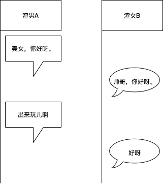
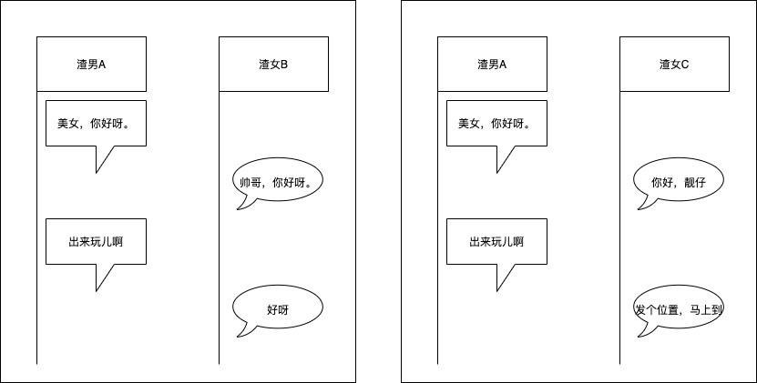

# IM系统初探

标签（空格分隔）： 未分类

---

#如何设计一个IM系统

>思考一个问题：如果让你设计一个IM系统，你会如何设计？

##我的设计

### 考虑最简单场景：单聊

- 渣男A<->渣女B

对于上面的简单回话场景，我们应该如何存储？

直观的，我们可以设计如下的msg表结构来存储消息:

| id        | from   |  to  |msg_content|date|
| --------   | :-----:  | :----:  |:----:|:----:|
| 1     | A |   B     |美女，你好呀。|2022年06月05日22:44:43|
| 2        |B      |   A   |帅哥，你好呀。|2022年06月05日22:45:05|
| 3        |A        |  B  |出来玩儿啊|2022年06月05日22:45:26|
| 4        | B       | A   |好呀|2022年06月05日22:45:40|

### 考虑稍微复杂的场景：单对多聊

- 渣男A<->渣女B
- 渣男A<->渣女C

此时，如果我们依然沿用上面的msg表结构，那么，消息的存储形式应该如下：

| id        | from   |  to  |msg_content|date|
| --------   | :-----:  | :----:  |:----:|:----:|
| 1     | A |   B     |美女，你好呀。|2022年06月05日22:57:21|
| 2        |A      |   C   |美女，你好呀。|2022年06月05日22:57:21|
| 3        | B       | A   |帅哥，你好呀。|2022年06月05日22:58:06|
| 4        | C       | A   |你好，靓仔|2022年06月05日22:58:53|
| 5        | A      | B   |出来玩儿啊|2022年06月05日22:59:02|
| 6        | A      | C   |出来玩儿啊|2022年06月05日22:59:02|
| 7        | B      | A   |好呀|2022年06月05日23:02:38|
| 8        | C      | A   |发个位置，马上到|2022年06月05日23:02:43|

此时，可能看上去msg表也还好，没有什么特别大的问题。

### 考虑再复杂点的场景：多对多聊

- 渣男A<->渣女B
- 渣男A<->渣女C
- 渣男D<->渣女B
- 渣男D<->渣女C

此时的msg表内容就有点多了：

| id        | from   |  to  |msg_content|date|
| --------   | :-----:  | :----:  |:----:|:----:|
| 1     | A |   B     |美女，你好呀。|2022年06月05日22:57:21|
| 2        |A      |   C   |美女，你好呀。|2022年06月05日22:57:21|
| 3        | B       | A   |帅哥，你好呀。|2022年06月05日22:58:06|
| 4        | C       | A   |你好，靓仔|2022年06月05日22:58:53|
| 5        | A      | B   |出来玩儿啊|2022年06月05日22:59:02|
| 6        | A      | C   |出来玩儿啊|2022年06月05日22:59:02|
| 7        | B      | A   |好呀|2022年06月05日23:02:38|
| 8        | C      | A   |发个位置，马上到|2022年06月05日23:02:43|
| 9     | D |   B     |美女，一个人吗？|2022年06月05日23:13:46|
| 10        |D      |   C |美女，一个人吗？|2022年06月05日23:13:46|
| 11       | B       | D   |对啊|2022年06月05日23:14:23|
| 12       | C       | D   |你猜|2022年06月05日23:14:27|
| 13       | D      | B   |一起去蹦迪啊？|2022年06月05日23:14:49|
| 14       | D      | C   |一起去蹦迪啊？|2022年06月05日23:14:49|
| 15       | B      | D   |好呀|2022年06月05日23:15:15|
| 16       | C      | D   |我考虑一下|2022年06月05日23:15:20|

### 考虑更复杂的场景：群聊

。。。

###上面的设计存在什么问题

- msg表会无限膨胀
- msg的存储设计方式面对群聊（千人群、万人群）场景时，消息量简直无法想象
- 如何标记消息「未读」

