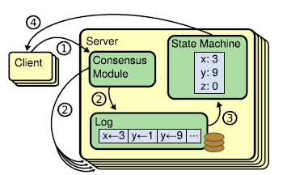
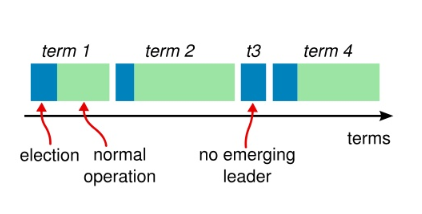
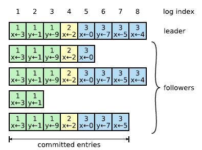
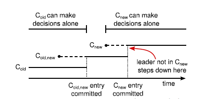

# Raft算法分享
## 概述
`Raft` 是一种用来管理复制日志的算法，实现状态机复制。

`Raft` 通过首先选举一个 `distinguished leader`，然后让它全权负责管理复制日志来实现一致性。Leader 从客户端接收日志条目，把日志条目复制到其他服务器上，并且在保证安全性的时候通知其他服务器将日志条目应用到他们的状态机中。拥有一个 `leader` 大大简化了对复制日志的管理。

通过选举一个`leader`的方式，Raft将一致性问题分解成了三个相对独立的子问题。  

1. `Leader` 选举：当前的 `leader` 宕机时，一个新的 `leader`必须被选举出来。 
2. 日志复制：`Leader`必须从客户端接收日志条目然后复制到集群中的其他节点，并且强制要求其他节点的日志和自己的保持一致。 
3. 安全性：`Raft` 中安全性的关键是状态机的安全性，如果有任何的服务器节点已经应用了一个特定的日志条目到它的状态机中，那么其他服务器节点不能在同一个日志索引位置应用一条不同的指令。

## Raft基础
一个 Raft 集群包含若干个服务器节点；通常是 5 个，这样的系统可以容忍 2 个节点的失效。

在任何时刻，每一个服务器节点都处于这三个状态之一：`leader`、`follower` 或者 `candidate` 。在正常情况下，集群中只有一个 `leader` 并且其他的节点全部都是 `follower` 。

`Follower` 都是被动的。他们不会发送任何请求，只是简单的响应来自 `leader` 和 `candidate` 的请求。`Leader` 处理所有的客户端请求（如果一个客户端和 `follower` 通信，`follower` 会将请求重定向给 `leader`）。

第三种状态，`candidate` ，是用来选举一个新的 `leader`。

## Leader 选举
`Raft` 使用一种心跳机制来触发 `leader`选举。

当服务器程序启动时，他们都是 `follower` 。一个服务器节点只要能从 `leader` 或 `candidate` 处接收到有效的 RPC 就一直保持 `follower` 状态。`Leader` 周期性地向所有 `follower` 发送心跳（不包含日志条目的 `AppendEntries RPC`）来维持自己的地位。如果一个 `follower` 在一段选举超时时间内没有接收到任何消息，它就假设系统中没有可用的 `leader` ，然后开始进行选举以选出新的 `leader` 。

节点竞选的过程，可以参考[竞选动画](https://raft.github.io/)

## 日志复制
`Leader` 一旦被选举出来，就开始为客户端请求提供服务。

客户端的每一个请求都包含一条将被复制状态机执行的指令。`Leader` 把该指令作为一个新的条目追加到日志中去，然后并行的发起 `AppendEntries RPC` 给其他的服务器，让它们复制该条目。当该条目被安全地复制（下面会介绍），`leader` 会应用该条目到它的状态机中（状态机执行该指令）然后把执行的结果返回给客户端。

如果 `follower` 崩溃或者运行缓慢，或者网络丢包，`leader` 会不断地重试 `AppendEntries RPC`（即使已经回复了的客户端）直到所有的 `follower` 最终都存储了所有的日志条目。

`Leader` 决定什么时候把日志条目应用到状态机中是安全的，这种日志条目被称为已提交的。`Raft` 算法保证所有已提交的日志条目都是持久化的并且最终会被所有可用的状态机执行。一旦创建该日志条目的 `leader` 将它复制到过半的服务器上，该日志条目就会被提交（例如条目 7）

在 `Raft` 算法中，`leader` 通过强制 `follower` 复制它的日志来解决不一致的问题。这意味着 `follower` 中跟 `leader` 冲突的日志条目会被 `leader` 的日志条目覆盖。

## 安全性

然而，到目前为止描述的机制并不能充分地保证每一个状态机会按照相同的顺序执行相同的指令。例如，一个 `follower` 可能会进入不可用状态，在此期间，`leader` 可能提交了若干的日志条目，然后这个 `follower` 可能会被选举为 `leader` 并且用新的日志条目覆盖这些日志条目；结果，不同的状态机可能会执行不同的指令序列。

### 选举限制
`Raft` 使用投票的方式来阻止 `candidate` 赢得选举，除非该 `candidate` 包含了所有已经提交的日志条目。

候选人为了赢得选举必须与集群中的过半节点通信，这意味着至少其中一个服务器节点包含了所有已提交的日志条目。如果 `candidate` 的日志至少和过半的服务器节点一样“新”，那么他一定包含了所有已经提交的日志条目。`RequestVote RPC` 执行了这样的限制： `RPC` 中包含了 `candidate` 的日志信息，如果投票者自己的日志比 `candidate` 的还新，它会拒绝掉该投票请求。

### 提交日志
只有 `leader` 当前任期内的日志条目才通过计算副本数目的方式来提交（判断出大于一半的日志已经达到某个高度，就广播这个高度的提交请求）；一旦当前任期的某个日志条目以这种方式被提交，那么由于日志匹配特性，之前的所有日志条目也都会被间接地提交。

## Follower 和 candidate 崩溃

到目前为止，我们只关注了 `leader` 崩溃的情况。`Follower` 和 `candidate` 崩溃后的处理方式比 `leader` 崩溃要简单的多，并且两者的处理方式是相同的。如果 `follower` 或者 `candidate` 崩溃了，那么后续发送给他们的 `RequestVote`和 `AppendEntries RPCs` 都会失败。`Raft` 通过无限的重试来处理这种失败，那么在它重启之后就会再次收到同样的请求。

## 集群成员变更

为了使配置变更机制能够安全，在转换的过程中不能够存在任何时间点使得同一个任期里可能选出两个 `leader` 。

不幸的是，任何服务器直接从旧的配置转换到新的配置的方案都是不安全的。一次性自动地转换所有服务器是不可能的，所以在转换期间整个集群可能划分成两个独立的大多数。

为了保证安全性，配置变更必须采用一种两阶段方法。在 `Raft` 中，集群先切换到一个过渡的配置，我们称之为联合一致（joint consensus）  

1. 日志条目被复制给集群中新、老配置的所有服务器。  
2. 新、旧配置的服务器都可以成为 leader 。  
3. 达成一致（针对选举和提交）需要分别在两种配置上获得过半的支持。

当一个 `leader` 接收到一个改变配置从 `C-old` 到 `C-new` 的请求，它就为联合一致将该配置（图中的 C-old,new）存储为一个日志条目，并以前面描述的方式复制该条目。一旦某个服务器将该新配置日志条目增加到自己的日志中，它就会用该配置来做出未来所有的决策（服务器总是使用它日志中最新的配置，无论该配置日志是否已经被提交）

## 日志压缩

在实际的系统中，日志不能无限制地增长，所以快照技术是日志压缩最简单的方法。

一台服务器用一个新快照替代了它日志中已经提交了的条目（索引 1 到 5），该快照只存储了当前的状态。通常服务器都是独立地创建快照，但是 leader 必须偶尔发送快照给一些落后的跟随者。

