# jvm学习与调优

标签（空格分隔）： 未分类

---


* [jvm学习与调优](#jvm学习与调优)
   * [栈帧](#栈帧)
   * [jvm常用命令](#jvm常用命令)
      * [jps](#jps)
      * [jinfo](#jinfo)
      * [jstat](#jstat)
      * [jmap](#jmap)
      * [jstack](#jstack)
   * [调优](#调优)
      * [打印gc日志](#打印gc日志)
      * [分析gc日志](#分析gc日志)
      * [ParallellelGC调优](#parallellelgc调优)
      * [CMS调优](#cms调优)
         * [i-CMS](#i-cms)
      * [G1调优](#g1调优)
      * [ZGC调优](#zgc调优)
         * [设置堆大小](#设置堆大小)
         * [设置GC并发线程数](#设置gc并发线程数)
         * [归还未使用内存](#归还未使用内存)

hint：以下如无特殊说明都是针对jdk8而言

## 栈帧

- https://docs.oracle.com/javase/specs/jvms/se8/html/jvms-2.html#jvms-2.6
- https://zhuanlan.zhihu.com/p/45354152


## jvm常用命令

- https://docs.oracle.com/javase/8/docs/technotes/tools/

从上面的[官方](https://docs.oracle.com/javase/8/docs/technotes/tools/)文档，我们知道jdk提供了比较丰富的命令行工具。这里着重介绍一些较为常用的。

### jps
[这个命令](https://docs.oracle.com/javase/8/docs/technotes/tools/unix/jps.html)主要是列出当前存活的java虚拟机进程信息。

```java
root@1c30b864a390:/# jps -l
1 /app/app.jar
13816 sun.tools.jps.Jps
```

### jinfo

[这个命令](https://docs.oracle.com/javase/8/docs/technotes/tools/unix/jinfo.html)可以获取一些jvm的相关配置参数信息。

```linux
### 查看最大堆内存
# jinfo -flag MaxHeapSize 39137
-XX:MaxHeapSize=268435456

## 查看使用的垃圾回收器
# jinfo -flag UseG1GC 39137
-XX:-UseG1GC

## 可以看出这里使用的并行垃圾回收器
# jinfo -flag UseParallelGC 39137
-XX:+UseParallelGC

# jinfo -flag UseConcMarkSweepGC 39137
-XX:-UseConcMarkSweepGC
```

### jstat
[这个命令](https://docs.oracle.com/javase/8/docs/technotes/tools/unix/jstat.html)主要用于统计一些jvm的性能相关的信息，功能非常强大，可选的配置参数也很多，我一般用来查看gc的相关信息及内存占用等。

如 -gc 参数，可以显示young、old大小、gc次数及时间等信息。
```linux
root@1c30b864a390:/# jstat -gc 1
 S0C    S1C    S0U    S1U      EC       EU        OC         OU       MC     MU    CCSC   CCSU   YGC     YGCT    FGC    FGCT     GCT
6656.0 6656.0 696.2   0.0   140288.0 102410.2  153600.0   73818.1   104576.0 98932.9 13184.0 12125.8     62    1.598   0      0.000    1.598

## 也可以使用如下语句每隔固定时间进行输出：
# jstat -gc 39137  5s 5
```
相关参数含义如下：
```java
S0C: Current survivor space 0 capacity (kB).

S1C: Current survivor space 1 capacity (kB).

S0U: Survivor space 0 utilization (kB).

S1U: Survivor space 1 utilization (kB).

EC: Current eden space capacity (kB).

EU: Eden space utilization (kB).

OC: Current old space capacity (kB).

OU: Old space utilization (kB).

MC: Metaspace capacity (kB).

MU: Metacspace utilization (kB).

CCSC: Compressed class space capacity (kB).

CCSU: Compressed class space used (kB).

YGC: Number of young generation garbage collection events.

YGCT: Young generation garbage collection time.

FGC: Number of full GC events.

FGCT: Full garbage collection time.

GCT: Total garbage collection time.
```
### jmap

[这个命令](https://docs.oracle.com/javase/8/docs/technotes/tools/unix/jmap.html)主要用于输出jvm的堆信息，例如可以使用如下命令保存堆信息为二进制文件：
```java
# jmap -dump:format=b,file=build.hprof 49450
Dumping heap to /Users/wangquanzhou/ideaProj/learn/build.hprof ...
Heap dump file created
```
然后配合mat等工具可进行内存溢出分析

### jstack

[这个命令](https://docs.oracle.com/javase/8/docs/technotes/tools/unix/jstack.html)主要输出jvm的线程栈信息以及线程状态。`jstack pid`即可查看该pid下的线程栈信息及线程状态。一般cpu占用较高的话，可以使用这个命令进行排查。

## 调优

- https://docs.oracle.com/javase/8/docs/technotes/guides/vm/gctuning/

调优应该是有目标的调优，而不是乱调。最好是参照着上面的官方文档的建议指南进行。

### 打印gc日志

- https://blog.csdn.net/u012988901/article/details/100708349?spm=1001.2014.3001.5501

要打印gc日志，需要设置一些jvm启动参数，这里我们正在开发的一个系统为基础，在idea里进行设置相关vm参数进行调优测试。

java版本：
```java
➜  Documents java -version
java version "1.8.0_201"
Java(TM) SE Runtime Environment (build 1.8.0_201-b09)
Java HotSpot(TM) 64-Bit Server VM (build 25.201-b09, mixed mode)
```

CPU:
```java
intel i5 四核
```

jvm参数：
```java
## 这里我们直接在项目的根目录输出gc日志
-XX:+PrintGCDetails -XX:+PrintGCTimeStamps -Xloggc:./gc.log 
```

注意：这里我除了上面的三个-xx参数外，并没有设置其他的jvm参数了。

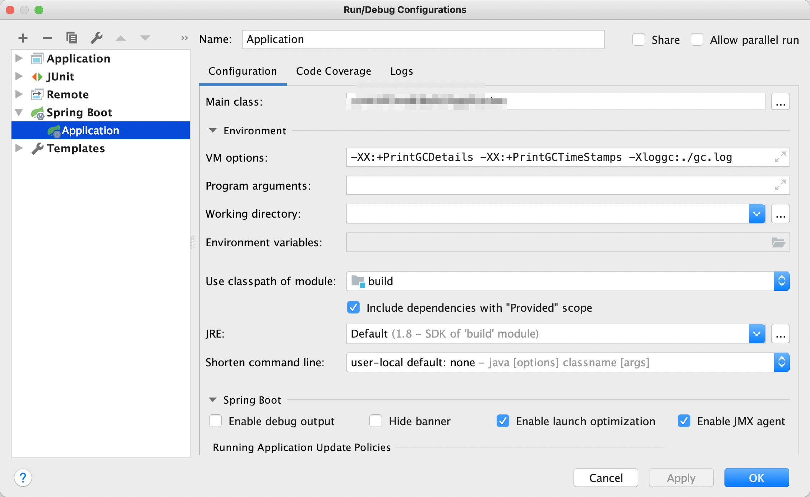

-XX:-+DisableExplicitGC参数可以禁用java代码显式调用System.gc()导致的gc。

### 分析gc日志

- https://blog.csdn.net/u012988901/article/details/102791020
- https://blog.csdn.net/u012988901/article/details/100708349?spm=1001.2014.3001.5501

参考这篇博客，我选用了GCViewer来帮助我分析gc情况。

```java
git  clone https://github.com/chewiebug/GCViewer.git

cd GCViewer

mvn clean package -Dmaven.test.skip=true
```

然后在target下有一个jar包，gcviewer-1.37-SNAPSHOT.jar，直接双击打开。然后加载刚刚生成的gc日志文件。
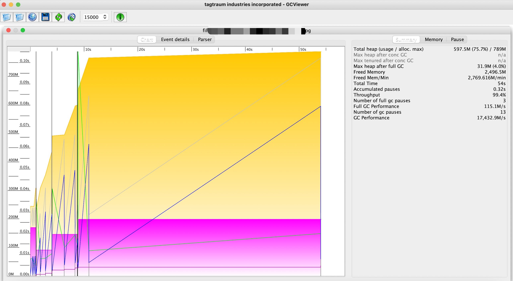

从图右侧上可以看出，当前jvm的吞吐量（Throughout）还是很不错的，达到了99.4%，相当高了。关于吞吐量，可以参考下面两个参考链接：

- https://docs.oracle.com/javase/8/docs/technotes/guides/vm/gctuning/ergonomics.html#sthref13
- https://li5jun.com/article/338.html

简单来说，吞吐量就是假设总共有100s，99s用来给业务线程使用，1s用来给GC线程使用，那么吞吐量就是99%。

顺便可以使用jinfo查看一下当前使用的垃圾收集器：

```linux
➜  learn git:(master) ✗ jinfo -flag UseParallelGC 61756
-XX:+UseParallelGC
```

可以看到使用的是并行GC收集器。

### ParallellelGC调优

根据[官方文档](https://docs.oracle.com/javase/8/docs/technotes/guides/vm/gctuning/ergonomics.html#ergonomics)的【Behavior-Based Tuning】小节，我们知道对于并行收集器，有两个指标我们可以进行调优，一是吞吐量【`-XX:GCTimeRatio=<nnn>`，吞吐量=`1 / (1 + <nnn>)`】，一是最大的GC停顿时间【`-XX:MaxGCPauseMillis=<nnn>`，单位毫秒】。

上一小节，我们知道JDK8默认使用ParallellelGC进行垃圾回收，现在我们试着调整一些参数。首先我们注意到其实我们的吞吐量已经很高了，不用怎么调，但是GC停顿时间还是比较久，最大达到了0.11734s，如下图所示：
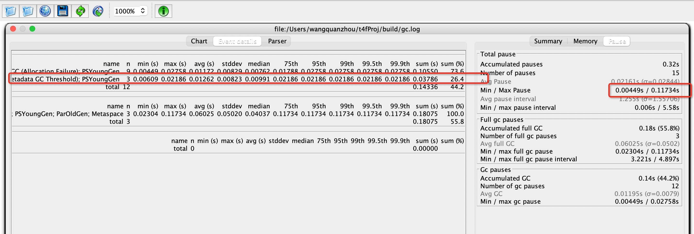

并且注意到因为metaspace导致了3次fullGC，我们先尝试配置metaspace大小消除这3个GC。注意到，metaspace大概占用了55MB的空间，我们尝试给他分配大一点的空间。
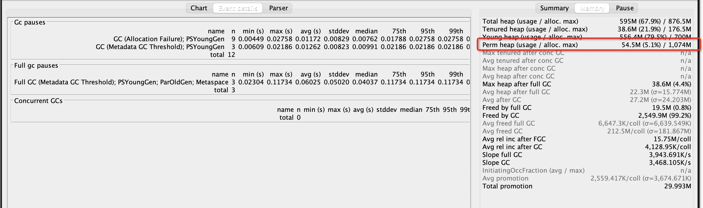

配置JVM启动参数：
```java
-XX:MetaspaceSize=128m  -XX:+PrintGCDetails -XX:+PrintGCTimeStamps -Xloggc:./gc.log 
```
再次使用GCviewer查看新的gc日志，如下所示；

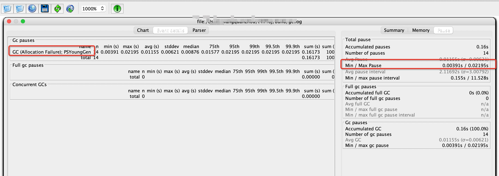

明显可以看到因为metaspace导致的fullGC没有了，并且最大停顿时间也下降到了0.02195s。

我们尝试将最大停顿时间限制在10ms以内试试，使用jvm参数配置：
```java
-XX:MetaspaceSize=128m -XX:MaxGCPauseMillis=10 -XX:+PrintGCDetails -XX:+PrintGCTimeStamps -Xloggc:./gc.log 
```
GCviewer的日志分析显示如下：
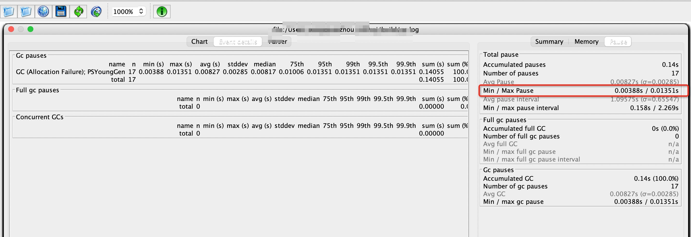

可以看到最大停顿时间，虽然下降到0.01351s，这也就是GC调优另外一个需要注意的点，我们在jvm启动参数里设置的指标，jvm只会尽力达到，而不能保证一定会达到。


### CMS调优

- https://docs.oracle.com/javase/8/docs/technotes/guides/vm/gctuning/cms.html

首先插一句，CMS从JDK9开始已经被标记为废弃了，推荐使用的是G1或者ZGC（JDK11）。

CMS和后面要介绍的G1是并发收集器（Concurrent），前面说的ParallellelGC是并行收集器。

- 并行：多个GC线程可以一起进行垃圾回收，只是GC线程垃圾收集期间，业务线程是需要暂停的
- 并发：多个GC线程可以一起进行垃圾回收，且得益于多核心CPU的优势，在GC期间，业务线程是可以使用剩余的CPU资源的，二者可以同时执行

使用参数`-XX:+UseConcMarkSweepGC`即可指定使用CMS收集器。

还是使用同样的应用，我们使用的jvm参数如下：
```java
-XX:+UseConcMarkSweepGC -XX:+PrintGCDetails -XX:+PrintGCTimeStamps -Xloggc:./gc.log 
```
CMS_tuning.png

gc日志解析结果如下：
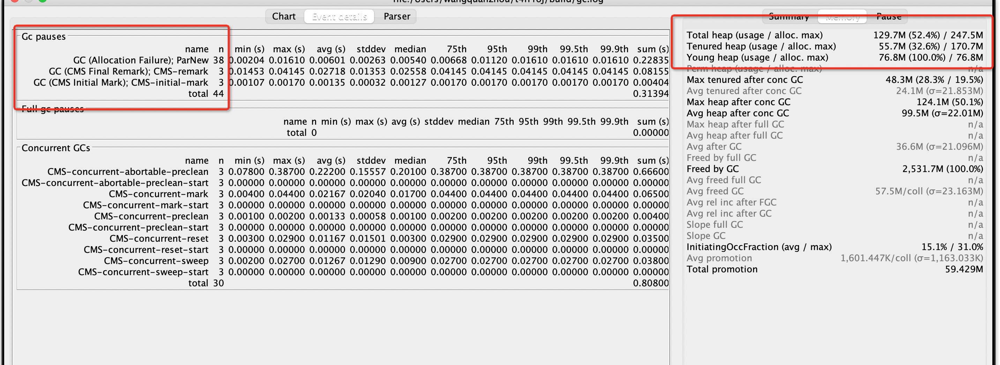

从图上可以看出，除了young区GC频繁外，old区的GC也是相当频繁，我们尝试调大young区和old区的大小。从图上的结果得知，young区占用77MB左右，且达到了100%，结合签名parallelGC的图，young区大概需要500m+的空间。根据JVM官方建议的3/8原则，设置young区5500MB，old区1500MB。使用的jvm配置参数如下：
```java
-XX:+UseConcMarkSweepGC -Xmx1500m -Xms1500m -Xmn550m -XX:+PrintGCDetails -XX:+PrintGCTimeStamps -Xloggc:./gc.log 
```
gc日志解析结果如下：
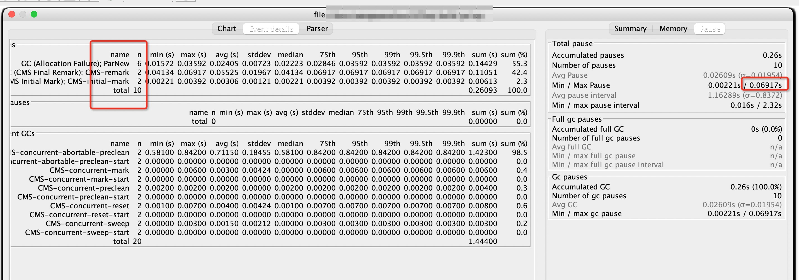

这张图和上面的图对比就可以发现，young区的GC明显下降，old区的GC也有一定程度的下降，且吞吐量保持在97.51%的高位，但是GC最大停顿时间达到了0.06917s，我们现在尝试将这个时间调整小一点。
```java
-XX:+UseConcMarkSweepGC -Xmx1500m -Xms1500m -Xmn550m -XX:MaxGCPauseMillis=10 -XX:+PrintGCDetails -XX:+PrintGCTimeStamps -Xloggc:./gc.log 
```

gc日志解析结果如下，从结果我们可以发现其实GC的最大停顿时间并没有明显的变小，这是为什么？
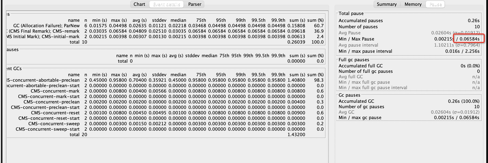


查阅相关[文档](https://docs.oracle.com/javase/8/docs/technotes/guides/vm/gctuning/ergonomics.html#sthref11)，其中有一段原文如下：

For the `parallel` collector, Java SE provides two garbage collection tuning parameters that are based on achieving a specified behavior of the application: `maximum pause time goal` and `application throughput goal`; see the section The Parallel Collector. (`These two options are not available in the other collectors.`) 

说明`MaxGCPauseMillis`这个参数在CMS里没用！

但是注意，在G1的文档里，这个参数又可以使用，原文在[这里](https://docs.oracle.com/javase/8/docs/technotes/guides/vm/gctuning/g1_gc_tuning.html#default_g1_gc)。：


#### i-CMS

- https://docs.oracle.com/javase/8/docs/technotes/guides/vm/gctuning/cms.html#CJAGIIEJ

这个`i`就是`incremental`，意思就是增量的进行垃圾回收，核心思想就是，在单核机器上为了避免CMS长时间占用CPU资源，GC的过程可以分为多次进行回收。不过这种情况在现如今的硬件环境下，已经比较少见了，这里不多做介绍。

### G1调优

- https://docs.oracle.com/javase/8/docs/technotes/guides/vm/gctuning/g1_gc_tuning.html#g1_gc_tuning
- https://docs.oracle.com/en/java/javase/11/gctuning/garbage-first-garbage-collector-tuning.html#GUID-90E30ACA-8040-432E-B3A0-1E0440AB556A

关于G1的介绍，可以参考之前的一篇[笔记](https://github.com/AudiVehicle/learn/blob/master/source/G1/G1.md)。

这里我们重点关注G1的调优。

首先启用G1，其他参数默认，查看一下性能。
```java
-XX:+UseG1GC -XX:+PrintGCDetails -XX:+PrintGCTimeStamps -Xloggc:./gc.log 
```
gc日志解析结果如下：
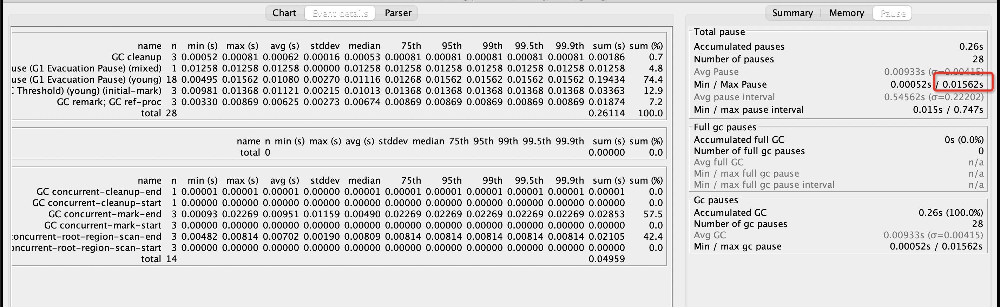

可以看出，G1在默认参数情况下，性能已经非常不错了，最大停顿时间降低到了0.01562s。

同时，注意到G1的GC有因为metaspace导致的。我们设置一下metaspace大小。

```java
-XX:+UseG1GC -XX:MetaspaceSize=256m  -XX:+PrintGCDetails -XX:+PrintGCTimeStamps -Xloggc:./gc.log 
```
gc日志解析结果如下：

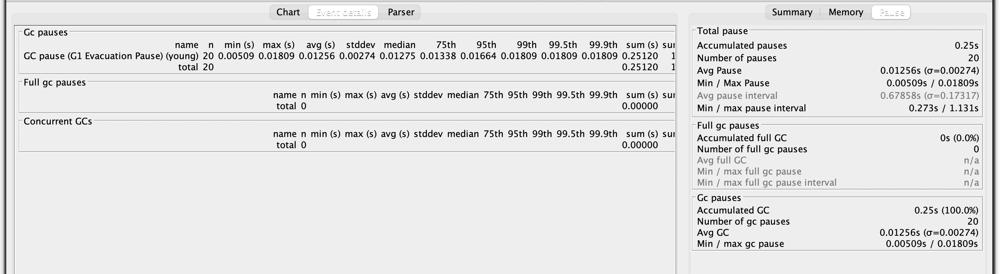

这优化效果，也太好了吧。

其实，如果是正式环境，调优到这一步，也就不需要再继续优化了，没有太大的提升空间。

其他的参数含义及调优可以参考[这里](https://docs.oracle.com/javase/8/docs/technotes/guides/vm/gctuning/g1_gc_tuning.html#default_g1_gc).

官方对于G1的调优，也给出了以下一些建议：

- 避免使用直接设置young区大小，例如通过 -Xmn、-XX:NewRatio来限制young区大小。否则会覆盖GC暂停时间目标。
- 暂停时间不要设置的过于严苛，因为它会影响吞吐量，二者需要做一个平衡
- mixed gc调优：
  - -XX:InitiatingHeapOccupancyPercent ：堆占有率达到这个数值则触发global concurrent marking，默认45%
  - -XX:G1MixedGCLiveThresholdPercent（old区的一个region的存活对象的空间占有率，默认值85%，达到这个值，这个区域就会被回收。此参数是实验性参数，需要使用`-XX:+UnlockExperimentalVMOptions`解锁。一个不太恰当的解释：可以将这个参数类比为HashMap中的loadFactor）和-XX:G1HeapWastePercent（在global concurrent marking结束之后，可以知道有多少空间要被回收，在每次YGC之后和再次发送Mixed GC之前，会检查垃圾占比是否达到此参数，只有达到了，下次才会发生Mixed GC，默认值5%）。
  - -XX:G1MixedGCCountTarget（一次global concurrent marking之后，最多执行Mixed GC的次数，默认值8次）和-XX:G1OldCSetRegionThresholdPercent（设置在一次mixed GC过程中，最多可以回收的old region的数量，百分比的形式表示，默认值10%）

### ZGC调优

- https://docs.oracle.com/en/java/javase/11/gctuning/z-garbage-collector1.html#GUID-A5A42691-095E-47BA-B6DC-FB4E5FAA43D0
- https://docs.oracle.com/en/java/javase/16/gctuning/z-garbage-collector.html#GUID-8637B158-4F35-4E2D-8E7B-9DAEF15BB3CD

从JDK11开始，官方引入了一种新的垃圾收集器，ZGC。ZGC对于所有的耗时操作均使用并发的方式，使得业务线程的停顿时间在10ms内，ZGC适用于对于低延迟要求很高的场景，且可以管理很大的内存（TB级别）。

使用如下命令开启ZGC（可以看出在JDK11，ZGC还处于实验阶段）：
```java
-XX:+UnlockExperimentalVMOptions -XX:+UseZGC.
```
在JDK16中开启ZGC的方式如下：
```java
-XX:+UseZGC
```

#### 设置堆大小

下面是官方文档里的一段原文，大致意思就是：对于ZGC调优，最重要的就是设置`最大堆大小`（-Xmx）。因为设置了堆大小便于JVM调节堆空间，使得程序可以在需要的时候申请足够的空间。对于ZGC而言，给的堆空间越大越好，但是也不可避免的会造成一些内存资源浪费，这个就需要在实际项目中去进行取舍平衡（多大的内存，GC的频率）了。

The most important tuning option for ZGC is setting the max heap size (-Xmx). Since ZGC is a concurrent collector a max heap size must be selected such that, 1) the heap can accommodate the live-set of your application, and 2) there is enough headroom in the heap to allow allocations to be serviced while the GC is running. How much headroom is needed very much depends on the allocation rate and the live-set size of the application. In general, the more memory you give to ZGC the better. But at the same time, wasting memory is undesirable, so it’s all about finding a balance between memory usage and how often the GC needs to run.

#### 设置GC并发线程数

通过参数`-XX:ConcGCThreads`可以设置GC并发的线程数，一般而言这个参数jvm可以自适应，但是针对特定的场景可以调节这个参数，使得业务线程执行时间和GC线程时间达到一个平衡。

#### 归还未使用内存

在JDK16中，默认情况下，ZGC会将未使用的堆内存归还给操作系统。但是这种默认行为在-Xms和-Xmx相等的情况下会被禁用。如果二者不等，那么也可以通过参数`-XX:-ZUncommit`来禁用这个特性。

此外还可以设置在xx秒以后，未使用的内存归还给操作系统。参数：`-XX:ZUncommitDelay=<seconds>`，默认300s。

更多关于ZGC的调优相关介绍，可以参考美团的一篇[文章](https://tech.meituan.com/2020/08/06/new-zgc-practice-in-meituan.html)。


java虚拟机规范：

- https://docs.oracle.com/javase/specs/jvms/se8/html/index.html


- https://blog.csdn.net/u012988901
- https://docs.oracle.com/javase/8/docs/technotes/guides/vm/gctuning/toc.html
