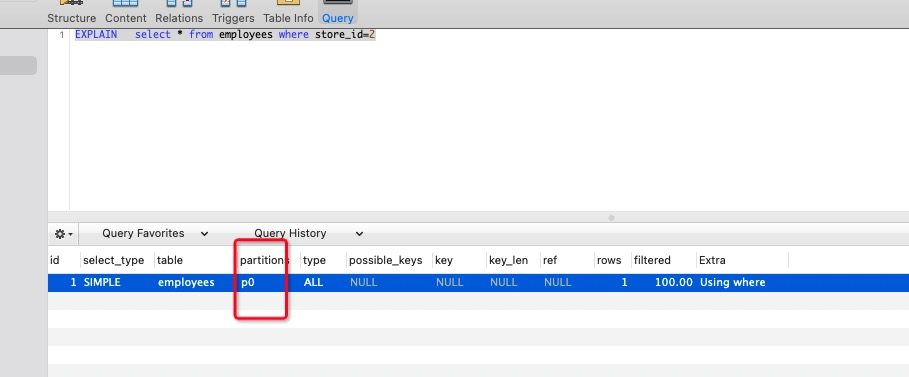
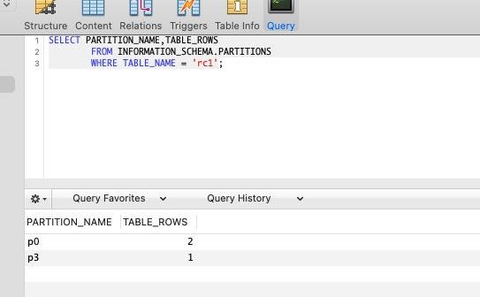
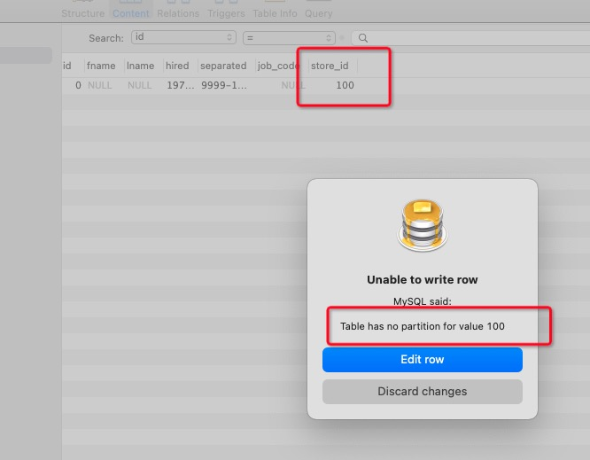
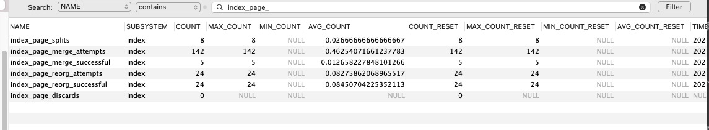
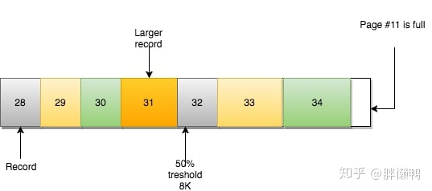
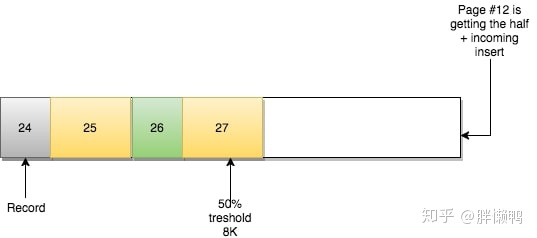

# mysql学习

标签（空格分隔）： mysql 高可用 事务

---

* [mysql学习](#mysql学习)
   * [主从集群搭建](#主从集群搭建)
      * [环境信息](#环境信息)
   * [mysql主从复制的两种方式](#mysql主从复制的两种方式)
   * [两种主从模式的对比](#两种主从模式的对比)
   * [半同步复制](#半同步复制)
   * [mysql事务](#mysql事务)
   * [mysql性能指标监控及死锁检测](#mysql性能指标监控及死锁检测)
   * [数据库设计注意事项](#数据库设计注意事项)
   * [mysql索引结构](#mysql索引结构)
   * [mysql复合索引最左匹配原则及原因](#mysql复合索引最左匹配原则及原因)
   * [mysql count(id)可能不走主键索引](#mysql-countid可能不走主键索引)
   * [mysql慢查询](#mysql慢查询)
   * [mysql read repeatable级别如何防止幻读](#mysql-read-repeatable级别如何防止幻读)
   * [分区表](#分区表)
      * [是否支持分区表属性](#是否支持分区表属性)
      * [分区类型](#分区类型)
         * [RANGE partitioning](#range-partitioning)
         * [RANGE COLUMNS partitioning](#range-columns-partitioning)
         * [LIST partitioning](#list-partitioning)
         * [LIST COLUMNS partitioning](#list-columns-partitioning)
         * [HASH partitioning](#hash-partitioning)
         * [KEY partitioning](#key-partitioning)
   * [count操作会不会锁表](#count操作会不会锁表)
   * [AUTO_INCREMENT原理](#auto_increment原理)
   * [binlog](#binlog)
      * [什么是binlog](#什么是binlog)
      * [binlog文件格式](#binlog文件格式)
      * [日志压缩](#日志压缩)
   * [undolog redolog](#undolog-redolog)
      * [redolog](#redolog)
      * [undolog](#undolog)
   * [mysql页合并与分裂](#mysql页合并与分裂)
      * [物理存储](#物理存储)
      * [页的内部原理](#页的内部原理)
         * [页合并](#页合并)
         * [页分裂](#页分裂)
         * [页的合并分裂对性能的影响](#页的合并分裂对性能的影响)


## 主从集群搭建

### 环境信息
虚拟机：VMware Fusion8

linux：ubuntu 16.04

docker：18.09.2

mysql：5.7

- https://www.jianshu.com/p/ab20e835a73f

为了方便，使用docker新建mysql服务器，构建一主一从的基于**日志点**mysql集群，集群架构图如下，网上搜的：
![此处输入图片的描述][1]

* 安装docker-ce
* 拉取mysql5.7镜像
* 启动mysql  master  注意端口是3307
```linux
docker run --name mysql -p 3307:3306 -eMYSQL_ROOT_PASSWORD=root -d mysql:5.7
```
* 启动mysql  slave  注意端口是3308
```linux
docker run --name mysql-slave -p 3308:3306 -eMYSQL_ROOT_PASSWORD=root -d mysql:5.7
```

* 进入mysql master所在的容器，设置相关参数

![此处输入图片的描述][2]

进入/etc/mysql，修改my.cnf文件信息：
```linux
 vim /etc/mysql/my.cnf
```

```linux
[mysqld]

server_id=100

binlog-ignore-db=mysql

log-bin=edu-mysql-bin

binlog_cache_size=1M

binlog_format=mixed

expire_logs_days=7
slave_skip_errors=1062
```
* 重启mysql服务器：
```linux
service mysql restart
```
上面的命令会使容器停止，再使用一次docker start命令就可以了。

重启完成以后，登录mysql创建同步数据时使用的mysql账户信息，其中的ip为宿主机的ip：
```mysql
mysql -u root -h 192.168.199.219 -P 3307 -p
```
```mysql
CREATE USER 'slave'@'%' IDENTIFIED BY '123456';
GRANT REPLICATION SLAVE, REPLICATION CLIENT ON *.* TO 'slave'@'%';  
```

* 同样的，mysql slave也需要进行配置，同样的目录下的my.cnf文件：
```linux
[mysqld]

server_id=101

binlog-ignore-db=mysql

log-bin=edu-mysql-slave1-bin

binlog_cache_size=1M

binlog_format=mixed

expire_logs_days=7


slave_skip_errors=1062

relay_log=edu-mysql-relay-bin

log_slave_updates=1

read_only=1
```
* 连接master和slave

登录master服务器，执行show master status;结果如下：
```mysql
+----------------------+----------+--------------+------------------+-------------------+
| File                 | Position | Binlog_Do_DB | Binlog_Ignore_DB | Executed_Gtid_Set |
+----------------------+----------+--------------+------------------+-------------------+
| edu-mysql-bin.000002 |      154 |              | mysql            |                   |
+----------------------+----------+--------------+------------------+-------------------+
```
记录下 File 和 Position 字段的值，后面会用到。

进入slave的mysql命令环境下，执行:
```linux
change master to master_host='192.168.199.219', master_user='slave', master_password='123456', master_port=3307, master_log_file='edu-mysql-bin.000002', master_log_pos=154, master_connect_retry=30;  
```

执行如下命令，即可开启主从同步：
```java
start slave;
```

## mysql主从复制的两种方式
MySQL可以通过两种方式配置主从复制，一种是通过二进制日志（binary log）的方式；另一种是通过GTID（全局事务ID）方式。

上面我们完成的主从复制，其实就是基于bin-log日志的。下面我们再来看一下基于GTID的主从复制方式。

- https://www.jianshu.com/p/63efedc95822

其实配置和上面的基于日志的类似，首先是使用docker新建两个mysql数据库。

```mysql
-- 主数据库
docker run --name mysql-slave-gtid -p 3309:3306 -eMYSQL_ROOT_PASSWORD=root -d mysql:5.7


-- 从数据库
docker run --name mysql-slave-gtid -p 3310:3306 -eMYSQL_ROOT_PASSWORD=root -d mysql:5.7
```

修改主mysql的my.cnf配置为：
```linux
[mysqld]
server-id=200   
log-bin=mysql-bin

gtid-mode = on
enforce-gtid-consistency = on
```
重启mysql，然后创建同步数据的用户：
```mysql
CREATE USER 'slave'@'%' IDENTIFIED BY '123456';
GRANT REPLICATION SLAVE, REPLICATION CLIENT ON *.* TO 'slave'@'%';
```

修改从mysql的配置：
```linux
[mysqld]
server-id=201 
log-bin=mysql-bin

gtid-mode = on
enforce-gtid-consistency = on
```

执行change master命令：
```mysql 
change master to MASTER_HOST='192.168.199.219',MASTER_USER='slave',MASTER_PASSWORD='123456',MASTER_PORT=3309,MASTER_AUTO_POSITION=1;

start slave;
```

基本配置就做完了，可以查看一下slave的状态：
```mysql
mysql> show slave status \G;
*************************** 1. row ***************************
               Slave_IO_State: Waiting for master to send event
                  Master_Host: 192.168.199.219
                  Master_User: slave
                  Master_Port: 3309
                Connect_Retry: 60
              Master_Log_File: mysql-bin.000002
          Read_Master_Log_Pos: 194
               Relay_Log_File: a6fa4106ae2b-relay-bin.000003
                Relay_Log_Pos: 407
        Relay_Master_Log_File: mysql-bin.000002
             Slave_IO_Running: Yes
            Slave_SQL_Running: Yes
              Replicate_Do_DB:
          Replicate_Ignore_DB:
           Replicate_Do_Table:
       Replicate_Ignore_Table:
      Replicate_Wild_Do_Table:
  Replicate_Wild_Ignore_Table:
                   Last_Errno: 0
                   Last_Error:
                 Skip_Counter: 0
          Exec_Master_Log_Pos: 194
              Relay_Log_Space: 2473
              Until_Condition: None
               Until_Log_File:
                Until_Log_Pos: 0
           Master_SSL_Allowed: No
           Master_SSL_CA_File:
           Master_SSL_CA_Path:
              Master_SSL_Cert:
            Master_SSL_Cipher:
               Master_SSL_Key:
        Seconds_Behind_Master: 0
Master_SSL_Verify_Server_Cert: No
                Last_IO_Errno: 0
                Last_IO_Error:
               Last_SQL_Errno: 0
               Last_SQL_Error:
  Replicate_Ignore_Server_Ids:
             Master_Server_Id: 200
                  Master_UUID: 97ff54fb-b77e-11e9-8e35-0242ac110005
             Master_Info_File: /var/lib/mysql/master.info
                    SQL_Delay: 0
          SQL_Remaining_Delay: NULL
      Slave_SQL_Running_State: Slave has read all relay log; waiting for more updates
           Master_Retry_Count: 86400
                  Master_Bind:
      Last_IO_Error_Timestamp:
     Last_SQL_Error_Timestamp:
               Master_SSL_Crl:
           Master_SSL_Crlpath:
           Retrieved_Gtid_Set: 97ff54fb-b77e-11e9-8e35-0242ac110005:1-5
            Executed_Gtid_Set: 97ff54fb-b77e-11e9-8e35-0242ac110005:1-5
                Auto_Position: 1
         Replicate_Rewrite_DB:
                 Channel_Name:
           Master_TLS_Version:
1 row in set (0.00 sec)
```
注意起止的Retrieved_Gtid_Set和Executed_Gtid_Set。

可以在主mysql创建一个db或者插入一些数据进行测试。


## 两种主从模式的对比

 - 基于日志点的复制
它出现的比较早，是mysql主从复制较早使用的一种方式。从库数据同步依赖于binlog日志master_log_file以及日志的偏移量master_log_pos。但是随着master数据量的增加，binlog日志和偏移量也在不断变化，此时如果出现slave宕机或者需要新加一个slave，如何准确的指定master_log_file和master_log_pos的值不是那么的容易。该方式兼容性较好，如老版本mysql及MariaDB。支持MMM和MHA高可用架构。可以方便的跳过错误。


 - 基于GTID的复制
 GTID也就是全局事务id，格式一般为：source_id:transaction_id。source_id表示提交（执行）当前事务的机器id，transaction_id为全局事务id。在主从复制集群中，一个事务的GTID值是唯一的。兼容性较差，不支持老版本mysql及MariaDB。仅支持MHA高可用架构。只能通过置入空事务的方式跳过错误。

![此处输入图片的描述][3]

## 半同步复制
mysql的半同步复制，主要是为了解决主从复制延时比较高的问题（除开网络原因，一般大事务也可能造成主从复制延长较大）。

mysql5.7以后引入了半同步复制的技术，可以有效减少主从复制的延迟。

下面我们演示一下配置半同步复制的过程。我们基于上面gtid复制的集群机器做演示。

 - master端配置

在msater安装半同步复制插件：
```mysql
install plugin rpl_semi_sync_master soname 'semisync_master.so';
```
设置超时时间，以及打开master半同步复制：
```mysql
set global rpl_semi_sync_master_timeout = 500;
set global rpl_semi_sync_master_enabled=on;

show variables like 'rpl%';
```
show一下配置的结果，如下所示：
```mysql
mysql> show variables like 'rpl%';
+-------------------------------------------+------------+
| Variable_name                             | Value      |
+-------------------------------------------+------------+
| rpl_semi_sync_master_enabled              | ON         |
| rpl_semi_sync_master_timeout              | 500        |
| rpl_semi_sync_master_trace_level          | 32         |
| rpl_semi_sync_master_wait_for_slave_count | 1          |
| rpl_semi_sync_master_wait_no_slave        | ON         |
| rpl_semi_sync_master_wait_point           | AFTER_SYNC |
| rpl_stop_slave_timeout                    | 31536000   |
+-------------------------------------------+------------+
```

 - slave端配置

```mysql
install plugin rpl_semi_sync_slave soname 'semisync_slave.so';

set global rpl_semi_sync_slave_enabled=on;
```
然后需要重启一下io进程：
```mysql
mysql> stop slave io_thread;
Query OK, 0 rows affected (0.00 sec)

mysql>
mysql>
mysql> start slave io_thread;
Query OK, 0 rows affected (0.00 sec)

mysql> show global status like 'rpl%';
+----------------------------+-------+
| Variable_name              | Value |
+----------------------------+-------+
| Rpl_semi_sync_slave_status | ON    |
+----------------------------+-------+
```

我们直观的感受一下半同步复制的过程，首先停掉slave的io进程（stop slave io_thread;），然后主库更新数据，发现主库的更新操作要等到超时时间过后才会执行成功：
![此处输入图片的描述][4]
上面的语句花了500ms才执行成功，因为超时时间设置的是500ms。

## mysql事务

基础准备：

mysql版本： 5.7.27

表结构：
```mysql
CREATE TABLE `trans` (
  `id` bigint(20) NOT NULL AUTO_INCREMENT,
  `name` varchar(255) DEFAULT NULL,
  `amount` int(255) DEFAULT NULL,
  PRIMARY KEY (`id`)
) ENGINE=InnoDB AUTO_INCREMENT=3 DEFAULT CHARSET=latin1;
```

mysql默认隔离级别：
```mysql
mysql> show variables like 'tx_isolation';
+---------------+-----------------+
| Variable_name | Value           |
+---------------+-----------------+
| tx_isolation  | REPEATABLE-READ |
+---------------+-----------------+
```


 - 脏读

简单来说，就是同时开启两个事务，分别为事务A和事务B，事务A读取到了事务B未提交的数据。实际演示一下：


 - 不可重复读

简单来说，就是同时开启两个事务，分别为事务A和事务B，事务A堆id=1的数据进行了更新，事务B再对这个数据进行更新，那么结果是两次事务更新结构的叠加。

  - 幻读

  简单来说，就是同时开启两个事务，分别为事务A和事务B，事务A新增一条数据id=5，此时，事务B可以对这条数据进行操作。
  
  
  

## mysql性能指标监控及死锁检测

**性能类指标**
| 名称        | 说明   | 
| --------   | -----  | 
| QPS    | 数据库每秒处理的请求数量 |  
| TPS        |   数据库每秒处理的事务数量   |   
| 并发数        |    数据库实例当前并行处理的会话数量    | 
| 连接数        |    连接到数据库会话的数量    | 
| 缓存命中率        |    innodb的缓存命中率   | 

**功能类指标**
| 名称        | 说明   | 
| --------   | -----  | 
| 可用性   | 数据库能否对外正常提供服务 |  
| 阻塞       |   当前是否有阻塞的会话   |   
| 死锁        |    当前事务    | 
| 慢查询        |    实时慢查询监控    | 
| 主从延迟        |    数据库主从延迟时间   | 
| 主从状态        |    数据库主从复制链路是否正常   | 


**QPS监控**
```mysql
mysql> show global status where variable_name in  ('Queries','uptime');
+---------------+--------+
| Variable_name | Value  |
+---------------+--------+
| Queries       | 64     |
| Uptime        | 949411 |
+---------------+--------+
2 rows in set (0.01 sec)

mysql> show global status where variable_name in  ('Queries','uptime');
+---------------+--------+
| Variable_name | Value  |
+---------------+--------+
| Queries       | 65     |
| Uptime        | 949423 |
+---------------+--------+
2 rows in set (0.01 sec)

mysql> select (65-64)/(949423-949411);
+-------------------------+
| (65-64)/(949423-949411) |
+-------------------------+
|                  0.0833 |
+-------------------------+
1 row in set (0.00 sec)
```
两次取样值相减，即可得出qps的值。

类似的，可以使用
```mysql
mysql> show global status where variable_name in  ('com_update','com_insert','com_delete','uptime');
+---------------+--------+
| Variable_name | Value  |
+---------------+--------+
| Com_delete    | 0      |
| Com_insert    | 5      |
| Com_update    | 1      |
| Uptime        | 949668 |
+---------------+--------+
4 rows in set (0.01 sec)
```
语句，执行两次，计算tps。

**数据库并发数**
```mysql
mysql> show global status like 'threads_running';
+-----------------+-------+
| Variable_name   | Value |
+-----------------+-------+
| Threads_running | 1     |
+-----------------+-------+
1 row in set (0.00 sec)
```

**数据库连接数**
```mysql
mysql> show global status like 'Threads_connected';
+-------------------+-------+
| Variable_name     | Value |
+-------------------+-------+
| Threads_connected | 1     |
+-------------------+-------+
1 row in set (0.00 sec)
```

**innodb缓存命中率**

当我们查询数据库的时候，innodb存储引擎，会先将数据读取到缓存中，再次查询时可以提高查询效率。

 - （Innodb_buffer_pool_read_requests-Innodb_buffer_pool_reads）/Innodb_buffer_pool_read_requests*100%
 - Innodb_buffer_pool_read_requests:从缓存池中读取的次数
 - Innodb_buffer_pool_reads：从物理磁盘读取的次数

```mysql
mysql> show global status like 'Innodb_buffer_pool_read%';
+---------------------------------------+-------+
| Variable_name                         | Value |
+---------------------------------------+-------+
| Innodb_buffer_pool_read_ahead_rnd     | 0     |
| Innodb_buffer_pool_read_ahead         | 0     |
| Innodb_buffer_pool_read_ahead_evicted | 0     |
| Innodb_buffer_pool_read_requests      | 1605  |
| Innodb_buffer_pool_reads              | 218   |
+---------------------------------------+-------+
5 rows in set (0.00 sec)

mysql> select (1605-218)/1605;
+-----------------+
| (1605-218)/1605 |
+-----------------+
|          0.8642 |
+-----------------+
1 row in set (0.00 sec)
```
通常，一个高效的mysql数据库，缓存命中率不应该低于95%


**mysql可用性**
```mysql
 {19-10-08 16:27}[ruby-2.3.7]t4f-mbp-17055:~ wangquanzhou% mysqladmin -u root -p ping
Enter password:
mysqld is alive
```
 
 **阻塞**
 
 可以从sys.innodb_lock_waits查询出阻塞的sql语句。
 ![此处输入图片的描述][5]
 
 为了模拟阻塞，可以开启两个事物，对同一条数据进行update，第二个事物需要等待第一个事物提交以后，才能提交。
 
 此时，我们再查询innodb_lock_waits视图，即可得到刚刚阻塞的sql。
```mysql
 mysql> select * from innodb_lock_waits \G;
*************************** 1. row ***************************
                wait_started: 2019-10-08 16:59:50
                    wait_age: 00:00:13
               wait_age_secs: 13
                locked_table: `db_user`.`trans`
                locked_index: PRIMARY
                 locked_type: RECORD
              waiting_trx_id: 4376
         waiting_trx_started: 2019-10-08 16:59:50
             waiting_trx_age: 00:00:13
     waiting_trx_rows_locked: 1
   waiting_trx_rows_modified: 0
                 waiting_pid: 15
               waiting_query: update trans set amount = 2000 where id=1
             waiting_lock_id: 4376:30:3:2
           waiting_lock_mode: X
             blocking_trx_id: 4375
                blocking_pid: 13
              blocking_query: NULL
            blocking_lock_id: 4375:30:3:2
          blocking_lock_mode: X
        blocking_trx_started: 2019-10-08 16:58:55
            blocking_trx_age: 00:01:08
    blocking_trx_rows_locked: 1
  blocking_trx_rows_modified: 1
     sql_kill_blocking_query: KILL QUERY 13
sql_kill_blocking_connection: KILL 13
1 row in set, 3 warnings (0.00 sec)
```
 **慢查询监控**
 
```mysql
 mysql> use information_schema
Database changed
mysql> select * from PROCESSLIST where time>30 and command<>'sleep';
Empty set (0.00 sec)
```
 
 这里顺便说一下information_schema.PROCESSLIST表，表结构如下：
```sql
 CREATE TEMPORARY TABLE `PROCESSLIST` (
  `ID` bigint(21) unsigned NOT NULL DEFAULT '0',
  `USER` varchar(16) NOT NULL DEFAULT '',
  `HOST` varchar(64) NOT NULL DEFAULT '',
  `DB` varchar(64) DEFAULT NULL,
  `COMMAND` varchar(16) NOT NULL DEFAULT '',
  `TIME` int(7) NOT NULL DEFAULT '0',
  `STATE` varchar(64) DEFAULT NULL,
  `INFO` longtext
) ENGINE=MyISAM DEFAULT CHARSET=utf8;
```

 - https://zhuanlan.zhihu.com/p/30743094

各个字段含义如下：

 - Id: 就是这个线程的唯一标识，当我们发现这个线程有问题的时候，可以通过 kill
   命令，加上这个Id值将这个线程杀掉。前面我们说了show processlist
   显示的信息时来自information_schema.processlist 表，所以这个Id就是这个表的主键。
 - User: 就是指启动这个线程的用户。
 - Host: 记录了发送请求的客户端的IP和端口号。通过这些信息在排查问题的时候，我们可以定位到是哪个客户端的哪个进程发送的请求。
 - DB: 当前执行的命令是在哪一个数据库上。如果没有指定数据库，则该值为 NULL 。
 - Command: 是指此刻该线程正在执行的命令。这个很复杂，下面单独解释
 - Time: 表示该线程处于当前状态的时间。
 - State: 线程的状态，和 Command 对应，下面单独解释。
 - Info: 一般记录的是线程执行的语句。默认只显示前100个字符，也就是你看到的语句可能是截断了的，要看全部信息，需要使用 show full processlist。

Command的枚举值如下所示：

 - Binlog Dump: 主节点正在将二进制日志 ，同步到从节点
 - Change User: 正在执行一个 change-user 的操作
 - Close Stmt: 正在关闭一个Prepared Statement 对象
 - Connect: 一个从节点连上了主节点
 - Connect Out: 一个从节点正在连主节点
 - Create DB: 正在执行一个create-database 的操作
 - Daemon: 服务器内部线程，而不是来自客户端的链接
 - Debug: 线程正在生成调试信息
 - Delayed Insert: 该线程是一个延迟插入的处理程序
 - Drop DB: 正在执行一个 drop-database 的操作
 - Execute: 正在执行一个 Prepared Statement
 - Fetch: 正在从Prepared Statement 中获取执行结果
 - Field List: 正在获取表的列信息
 - Init DB: 该线程正在选取一个默认的数据库
 - Kill : 正在执行 kill 语句，杀死指定线程
 - Long Data: 正在从Prepared Statement 中检索 long data
 - Ping: 正在处理 server-ping 的请求
 - Prepare: 该线程正在准备一个 Prepared Statement
 - ProcessList: 该线程正在生成服务器线程相关信息
 - Query: 该线程正在执行一个语句
 - Quit: 该线程正在退出
 - Refresh：该线程正在刷表，日志或缓存；或者在重置状态变量，或者在复制服务器信息
 - Register Slave： 正在注册从节点
 - Reset Stmt: 正在重置 prepared statement
 - Set Option: 正在设置或重置客户端的 statement-execution 选项
 - Shutdown: 正在关闭服务器
 - Sleep: 正在等待客户端向它发送执行语句
 - Statistics: 该线程正在生成 server-status 信息
 - Table Dump: 正在发送表的内容到从服务器
 - Time: Unused

各个枚举值还可以查看官方文档：https://dev.mysql.com/doc/refman/5.6/en/thread-commands.html
 
 **此外**，慢查询还可以使用如下命令进行监控：
```mysql
show status like '%slow_queries%';
```
使用如下命令可以查看与查询相关的数据库配置：
```mysql
-- show variables like '%quer%';
```
如下图所示，图中同时展示了设置相关参数的sql语句，注意设置慢查询的时间是以秒为单位的：

![此处输入图片的描述][6]
 
 **主从延迟**
 ![此处输入图片的描述][7]
基本原理，就是生成一张表，主库定时自动往表中插入数据，从库定时查询主库插入的数据是否在从库存在。

**死锁**

使用percona-toolkit 的 pt-deadlock-logger命令。

安装percona-toolkit可以参考链接：http://macappstore.org/percona-toolkit/

**Install the App**

 1. Press Command+Space and type Terminal and press enter/return key.
 2. Run in Terminal app:
```ruby
ruby -e "$(curl -fsSL https://raw.githubusercontent.com/Homebrew/install/master/install)" < /dev/null 2> /dev/null
```
and press enter/return key. 
If the screen prompts you to enter a password, please enter your Mac's user password to continue. When you type the password, it won't be displayed on screen, but the system would accept it. So just type your password and press ENTER/RETURN key. Then wait for the command to finish.
 3. Run:
```linux
brew install percona-toolkit
```

https://www.percona.com/doc/percona-toolkit/LATEST/pt-deadlock-logger.html

在dba库下创建存储死锁信息的表：
```sql
use dba;
CREATE TABLE deadlocks (
server char(20) NOT NULL,
ts timestamp NOT NULL DEFAULT CURRENT_TIMESTAMP,
thread int unsigned NOT NULL,
txn_id bigint unsigned NOT NULL,
txn_time smallint unsigned NOT NULL,
user char(16) NOT NULL,
hostname char(20) NOT NULL,
ip char(15) NOT NULL, -- alternatively, ip int unsigned NOT NULL
db char(64) NOT NULL,
tbl char(64) NOT NULL,
idx char(64) NOT NULL,
lock_type char(16) NOT NULL,
lock_mode char(1) NOT NULL,
wait_hold char(1) NOT NULL,
victim tinyint unsigned NOT NULL,
query text NOT NULL,
PRIMARY KEY (server,ts,thread)
) ENGINE=InnoDB;
```

然后使用如下命令(如果已经存在死锁表，那么省去下面的--create-dest=table，否则按照pt默认的格式建表)：
```mysql
{19-10-08 17:26}[ruby-2.3.7]t4f-mbp-17055:~ wangquanzhou% pt-deadlock-logger u=root,p=root,h=127.0.0.1 \
> --create-dest=table \
> --dest u=root,p=root,h=127.0.0.1,D=dba,t=deadlocks
```

然后人为制造死锁（需要开启两个事物）：

事物A：
```sql
mysql> begin;
Query OK, 0 rows affected (0.00 sec)

mysql> update db_user.trans set amount=amount+1 where id=1;
Query OK, 1 row affected (0.01 sec)
Rows matched: 1  Changed: 1  Warnings: 0
```

事物B:
```sql
mysql> begin;
Query OK, 0 rows affected (0.00 sec)

mysql> update db_user.trans set amount=amount+1 where id=2;
Query OK, 1 row affected (0.01 sec)
Rows matched: 1  Changed: 1  Warnings: 0
```

事物A:
```sql
mysql> update db_user.trans set amount=amount-1 where id=2;
Query OK, 1 row affected (10.48 sec)
Rows matched: 1  Changed: 1  Warnings: 0
```

事物B：
```sql
mysql> update db_user.trans set amount=amount-1 where id=1;
ERROR 1213 (40001): Deadlock found when trying to get lock; try restarting transaction
mysql>
```

产生了死锁，查看死锁表：
```sql
mysql> select * from deadlocks;
```

另外一种方式可以通过日志记录数据库的死锁，使用如下命令开启数据库死锁日志的记录：
```sql
set persist innodb_print_all_deadlocks=on;
```

**此外**，通过如下参数，设置锁获取到等待时间（单位：秒）也可以一定程度上解决死锁：
```linux
mysql> set global innodb_lock_wait_timeout=60; 
Query OK, 0 rows affected

mysql>  show  variables like 'innodb_lock_wait_timeout'; 
+--------------------------+-------+
| Variable_name            | Value |
+--------------------------+-------+
| innodb_lock_wait_timeout | 60    |
+--------------------------+-------+
1 row in set

mysql> 
```


## 数据库设计注意事项
如果需要设计一个关系型数据库，那么一般需要考虑：架构、索引、锁、语法、理论范式等方面。具体一点如下图所示：

![此处输入图片的描述][8]

其中，索引管理、锁设计是重点部分，也是一般面试关注的比较多的地方。

## mysql索引结构
关于索引的结构，之前以及有过[笔记][9]，这里只是补充一点，关于innodb 副索引与主索引的关系。

之前关于主索引的查询步骤还是比较清晰的，但是对于副索引如何查询还是有点疑惑，下面这张图很好的解释了查询的过程，其实副索引也是一个B+-tree的结构，只不过他的叶子节点不再存储数据，而是存储主键索引的值。

查询时，首先根据副索引，找到主键索引的值，然后再在主索引的B+-tree中进行查询。就酱。（PS：之前认为副索引存储的是指向主键索引地址的指针）

![此处输入图片的描述][10]

## mysql复合索引最左匹配原则及原因
最左匹配原则，可以查看下图，当然这只是针对复合索引而言：

![此处输入图片的描述][11]
![此处输入图片的描述][12]

 
 

## mysql count(id)可能不走主键索引
count时不走主键索引，很好理解，mysql可能会自己进行优化，因为主键索引是索引+数据的存储模式，而副索引仅仅存储主键索引的值，从读取IO来说，肯定是数据量越少读取的越快。并且，副索引和主索引都是B+-tree的结构，都可以在叶子节点进行横向扫描。
![此处输入图片的描述][13]

这次[实际工作](https://github.com/AudiVehicle/learn/blob/master/source/%E5%B7%A5%E4%BD%9C%E6%80%BB%E7%BB%93.md#%E8%AE%B0%E4%B8%80%E6%AC%A1%E6%95%B0%E6%8D%AE%E5%BA%93%E4%BC%98%E5%8C%96%E7%BB%8F%E5%8E%86)中就遇到这种情况了。

 
 

## mysql慢查询
一般定位和处理慢查询可以按照下图的步骤进行处理：

![此处输入图片的描述][14]
![此处输入图片的描述][15]

那么，如何打开和查询慢查询日志呢？可以参照下图的sql进行设置：

![此处输入图片的描述][16]

## mysql read repeatable级别如何防止幻读
mysql在RR级别下防止幻读，表象上看是使用了快照技术，即读取的不是最新的数据，是快照（缓存）数据。本质原因是，mysql在RR级别下，操作数据的时候在数据上加了netx-key锁，使得当前操作的事务未提交前，不得进行新的操作，从而避免了幻读的出现。
![此处输入图片的描述][17]

关于间歇锁（需要主键索引、其他索引、不走索引等情况）的知识，可以查看之前的[笔记][18]。

关于快照度和当前度，可以参照下图进行分类：

![此处输入图片的描述][19]

前面提到RR级别下，操作数据会加上next-key锁，那么此时查询操作是允许的吗？答案是肯定的。

mysql每次在操作数据的时候，会将更新前的数据存入undo log中供查询操作进行查询。

![此处输入图片的描述][20]
![此处输入图片的描述][21]

## 分区表

- https://dev.mysql.com/doc/refman/5.7/en/partitioning.html
- https://zhuanlan.zhihu.com/p/158023747

对于分区表，先做一个简单的概述：它其实就是将一个大表按照一定规则分成若干个子表，理论上可以加快curd的速度。且分表的过程由mysql服务器自动完成，应用程序不会感知到，操作的还是一张表。

如果是普通表希望转成分区表，如果业务运行暂停，那么可以直接使用`alter`语句[直接](https://developer.aliyun.com/article/285405)进行转换，否则可以通过如下步骤实现：

* 创建分区临时表
* 创建触发器，对主表操作的数据都会同步到临时表
* 手动离线同步历史数据到临时表
* 将主表、临时表名称互换（可能存在短暂的服务不可用）

### 是否支持分区表属性

通过如下命令查看是否支持：
```mysql
mysql> SHOW PLUGINS;
+------------+----------+----------------+---------+---------+
| Name       | Status   | Type           | Library | License |
+------------+----------+----------------+---------+---------+
| binlog     | ACTIVE   | STORAGE ENGINE | NULL    | GPL     |
| partition  | ACTIVE   | STORAGE ENGINE | NULL    | GPL     |
| ARCHIVE    | ACTIVE   | STORAGE ENGINE | NULL    | GPL     |
| BLACKHOLE  | ACTIVE   | STORAGE ENGINE | NULL    | GPL     |
| CSV        | ACTIVE   | STORAGE ENGINE | NULL    | GPL     |
| FEDERATED  | DISABLED | STORAGE ENGINE | NULL    | GPL     |
| MEMORY     | ACTIVE   | STORAGE ENGINE | NULL    | GPL     |
| InnoDB     | ACTIVE   | STORAGE ENGINE | NULL    | GPL     |
| MRG_MYISAM | ACTIVE   | STORAGE ENGINE | NULL    | GPL     |
| MyISAM     | ACTIVE   | STORAGE ENGINE | NULL    | GPL     |
| ndbcluster | DISABLED | STORAGE ENGINE | NULL    | GPL     |
+------------+----------+----------------+---------+---------+
```

### 分区类型

所谓`分区类型`，其实就是我们需要指定一个规则，mysql服务器按照这个规则对大表进行拆分。

#### RANGE partitioning
根据指定列的值所属的连续区间进行分区，比如按照时间进行分区。

比如我们可以使用如下方式创建RANGE分区表：
```mysql
CREATE TABLE employees (
    id INT NOT NULL,
    fname VARCHAR(30),
    lname VARCHAR(30),
    hired DATE NOT NULL DEFAULT '1970-01-01',
    separated DATE NOT NULL DEFAULT '9999-12-31',
    job_code INT NOT NULL,
    store_id INT NOT NULL
)
PARTITION BY RANGE (store_id) (
    PARTITION p0 VALUES LESS THAN (6),
    PARTITION p1 VALUES LESS THAN (11),
    PARTITION p2 VALUES LESS THAN (16),
    PARTITION p3 VALUES LESS THAN (21)
);
```

为了验证分区属性是否生效，我们可以使用如下语句（5.7及以后版本）进行测试：
```mysql
EXPLAIN  select * from employees where store_id=2;
```
执行结果如下：


其中`partitions`就是查询条件数据所属分区。

上面这样创建分区表会有问题，例如我们执行下面这条插入语句：
```mysql
INSERT INTO `employees` (`id`, `fname`, `lname`, `hired`, `separated`, `job_code`, `store_id`)
VALUES
	(0, 'ddd', 'aaaaa', '1970-01-01', '9999-12-31', 0, 21);
```
插入会失败，会得到下面这个报错信息：
```mysql
Table has no partition for value 21
```

怎么解决呢？可以通过如下方式建表：
```mysql
CREATE TABLE employees (
    id INT NOT NULL,
    fname VARCHAR(30),
    lname VARCHAR(30),
    hired DATE NOT NULL DEFAULT '1970-01-01',
    separated DATE NOT NULL DEFAULT '9999-12-31',
    job_code INT NOT NULL,
    store_id INT NOT NULL
)
PARTITION BY RANGE (store_id) (
    PARTITION p0 VALUES LESS THAN (6),
    PARTITION p1 VALUES LESS THAN (11),
    PARTITION p2 VALUES LESS THAN (16),
    PARTITION p3 VALUES LESS THAN MAXVALUE
);
```
`MAXVALUE`的意思表示，分区列的值永远都会在落在它的区间内。假设后续落在p3这个区间的数据量太大，我们也可以通过`ALTER TABLE`命令对大的分区进行细分。

比如：
```mysql
alter table employees reorganize partition p3 into(

      partition p4 values less than(200),

      partition p5 values less than(2000),
      
      partition p6 values less than(MAXVALUE)

    );
```


#### RANGE COLUMNS partitioning

RANGE COLUMNS其实与RANGE很相似，只是它允许多个列作为分区键，且数据的类型不仅仅局限整数。

比如可以创建如下的分区表：
```mysql
CREATE TABLE rcx (
    a INT,
    b INT,
    c CHAR(3),
    d INT
)
PARTITION BY RANGE COLUMNS(a,d,c) (
    PARTITION p0 VALUES LESS THAN (5,10,'ggg'),
    PARTITION p1 VALUES LESS THAN (10,20,'mmm'),
    PARTITION p2 VALUES LESS THAN (15,30,'sss'),
    PARTITION p3 VALUES LESS THAN (MAXVALUE,MAXVALUE,MAXVALUE)
);
```

这里需要注意一点，由于RANGE COLUMNS是多个列组合在一起决定一条数据放在哪个分区，mysql是按照最左匹配原则来的。

比如针对上面的`rcx`表，我们插入如下数据：
```mysql
INSERT INTO `rcx` (`a`, `b`, `c`, `d`)
VALUES
	(8, NULL, 'aaa', 100);
```

* 单纯看a=8，数据应该落在p1
* 单纯看d=100，数据应该落在p3
* 单纯看c=aaa，数据应该落在p0

然后使用如下sql查看数据的分区情况：
```mysql
SELECT PARTITION_NAME,TABLE_ROWS
        FROM INFORMATION_SCHEMA.PARTITIONS
        WHERE TABLE_NAME = 'rcx';
```
结果如下： 
```java
PARTITION_NAME	TABLE_ROWS
p0	             0
p1		         1
p2	             0
p3	             0
```

说明数据的分区规则，确实是按照最左匹配来的。

注意一下下面的这种临界情况，假如有如下分区表：
```mysql
CREATE TABLE rc1 (
    a INT,
    b INT
)
PARTITION BY RANGE COLUMNS(a, b) (
    PARTITION p0 VALUES LESS THAN (5, 12),
    PARTITION p3 VALUES LESS THAN (MAXVALUE, MAXVALUE)
);
```
然后插入一些临界数据：
```mysql
INSERT INTO rc1 VALUES (5,10), (5,11), (5,12);
```
同样的，我们看下数据分布：


可以看到，根据最左匹配原则，当第一列元素都等于5的时候，就得看第二列的元素的值了。

他们的大小关系可以通过如下sql得到：
```mysql
mysql> SELECT (5,10) < (5,12), (5,11) < (5,12), (5,12) < (5,12);
+-----------------+-----------------+-----------------+
| (5,10) < (5,12) | (5,11) < (5,12) | (5,12) < (5,12) |
+-----------------+-----------------+-----------------+
|               1 |               1 |               0 |
+-----------------+-----------------+-----------------+
1 row in set (0.00 sec)
```

注意下面这种分区表，并未使用字段的全部长度，也是可以的：
```mysql
CREATE TABLE employees_by_lname (
    id INT NOT NULL,
    fname VARCHAR(30),
    lname VARCHAR(30),
    hired DATE NOT NULL DEFAULT '1970-01-01',
    separated DATE NOT NULL DEFAULT '9999-12-31',
    job_code INT NOT NULL,
    store_id INT NOT NULL
)
PARTITION BY RANGE COLUMNS (lname)  (
    PARTITION p0 VALUES LESS THAN ('g'),
    PARTITION p1 VALUES LESS THAN ('m'),
    PARTITION p2 VALUES LESS THAN ('t'),
    PARTITION p3 VALUES LESS THAN (MAXVALUE)
);
```

#### LIST partitioning
与RANGE分区类似，但是它是按照一些离散的枚举值来进行分区的。

创建一个LIST类型的分区表：
```mysql
CREATE TABLE employees (
    id INT NOT NULL,
    fname VARCHAR(30),
    lname VARCHAR(30),
    hired DATE NOT NULL DEFAULT '1970-01-01',
    separated DATE NOT NULL DEFAULT '9999-12-31',
    job_code INT,
    store_id INT
)
PARTITION BY LIST(store_id) (
    PARTITION pNorth VALUES IN (3,5,6,9,17),
    PARTITION pEast VALUES IN (1,2,10,11,19,20),
    PARTITION pWest VALUES IN (4,12,13,14,18),
    PARTITION pCentral VALUES IN (7,8,15,16)
);
```

使用LIST类型分区，需要注意：如果插入的数据的分区列的值不再枚举值内，会报错，如下图所示。




#### LIST COLUMNS partitioning
LIST COLUMNS与LIST的关系 与 RANGE COLUMNS和RANGE的区别很相似，它也是允许多列组合作为分区键，且数据范围更广（不局限于整数）。

比如这样的单列分区键：
```mysql
CREATE TABLE customers_3 (
    first_name VARCHAR(25),
    last_name VARCHAR(25),
    street_1 VARCHAR(30),
    street_2 VARCHAR(30),
    city VARCHAR(15),
    renewal DATE
)
PARTITION BY RANGE COLUMNS(renewal) (
    PARTITION pWeek_1 VALUES LESS THAN('2010-02-09'),
    PARTITION pWeek_2 VALUES LESS THAN('2010-02-15'),
    PARTITION pWeek_3 VALUES LESS THAN('2010-02-22'),
    PARTITION pWeek_4 VALUES LESS THAN('2010-03-01')
);
```

比如这样的多列分区键：
```mysql
CREATE TABLE lc (
    a INT NULL,
    b INT NULL
)
PARTITION BY LIST COLUMNS(a,b) (
    PARTITION p0 VALUES IN( (0,0), (NULL,NULL) ),
    PARTITION p1 VALUES IN( (0,1), (0,2), (0,3), (1,1), (1,2) ),
    PARTITION p2 VALUES IN( (1,0), (2,0), (2,1), (3,0), (3,1) ),
    PARTITION p3 VALUES IN( (1,3), (2,2), (2,3), (3,2), (3,3) )
);
```

#### HASH partitioning
用户指定一些运算规则（mysql支持的任何返回大于等于0的整数的运算都行），将数据进行运算，根据结果将数据进行分区。hash分区可以在一定程度上保证数据分布均匀。

```mysql
CREATE TABLE employees (
    id INT NOT NULL,
    fname VARCHAR(30),
    lname VARCHAR(30),
    hired DATE NOT NULL DEFAULT '1970-01-01',
    separated DATE NOT NULL DEFAULT '9999-12-31',
    job_code INT,
    store_id INT
)
PARTITION BY HASH( YEAR(hired) )
PARTITIONS 4;
```
注意，HASH函数内的expr需要是整数类型的。且数据要具有足够的区分度，比如上面选择`YEAR(...)`来做区分就不是很好，应该选择日期会更好。

理论上，可以结合多个列来做hash，但是这样性能不好，不推荐。


#### KEY partitioning
与HASH分区类似，不同的是hash的规则不再是用户指定，由mysql自己指定。

区别于hash分区，key分区其实是针对索引来设计的。

下面的表会按照主键id进行分区：
```mysql
CREATE TABLE k1 (
    id INT NOT NULL PRIMARY KEY,
    name VARCHAR(20)
)
PARTITION BY KEY()
PARTITIONS 2;
```

下面的表会按照唯一键进行分区：
```mysql
CREATE TABLE k1 (
    id INT NOT NULL,
    name VARCHAR(20),
    UNIQUE KEY (id)
)
PARTITION BY KEY()
PARTITIONS 2;
```

## count操作会不会锁表

- https://www.coder.work/article/518590
- https://dev.mysql.com/doc/refman/5.6/en/glossary.html#glos_consistent_read
- https://dev.mysql.com/doc/refman/5.6/en/innodb-consistent-read.html

答案是，针对`myisam`存储引擎的表会锁表。但是针对`innodb`的表不会锁表。

对于innodb类型的表，mysql使用了快照（snapshot）技术来保证读取数据的时候不会上锁。

下面这句话摘抄自mysql官方文档原文：
```mysql
Consistent read is the default mode in which InnoDB processes SELECT statements in READ COMMITTED and REPEATABLE READ isolation levels. A consistent read does not set any locks on the tables it accesses, and therefore other sessions are free to modify those tables at the same time a consistent read is being performed on the table.
```

此外，还需要注意：快照只是针对select有用，对于insert、update、delete语句无效，他们访问的都是最新的已提交事务的数据，且这些语句执行完成以后会更新当前的快照数据。如下英文就是说的这个意思：
The snapshot of the database state applies to SELECT statements within a transaction, not necessarily to DML statements. If you insert or modify some rows and then commit that transaction, a DELETE or UPDATE statement issued from another concurrent REPEATABLE READ transaction could affect those just-committed rows, even though the session could not query them. If a transaction does update or delete rows committed by a different transaction, those changes do become visible to the current transaction. For example, you might encounter a situation like the following:
```mysql
SELECT COUNT(c1) FROM t1 WHERE c1 = 'xyz';
-- Returns 0: no rows match.
DELETE FROM t1 WHERE c1 = 'xyz';
-- Deletes several rows recently committed by other transaction.

SELECT COUNT(c2) FROM t1 WHERE c2 = 'abc';
-- Returns 0: no rows match.
UPDATE t1 SET c2 = 'cba' WHERE c2 = 'abc';
-- Affects 10 rows: another txn just committed 10 rows with 'abc' values.
SELECT COUNT(c2) FROM t1 WHERE c2 = 'cba';
-- Returns 10: this txn can now see the rows it just updated.
```

## AUTO_INCREMENT原理

- https://dev.mysql.com/doc/refman/5.7/en/innodb-auto-increment-handling.html
- https://www.jianshu.com/p/054cf6c10116

在介绍之前，先看几种数据插入的方式:

* Simple inserts

所谓`simple`，其实就是sql插入语句执行`之前`，总共需要插入的行数是已经可以预知的了。

* Bulk inserts

这个刚好和`simple`相反，在数据插入之前是无法预知数据的行数的。比如 `INSERT ... SELECT, REPLACE ... SELECT, and LOAD DATA`等语句。

* Mixed-mode inserts

这种情况，就是有些列指定了`AUTO_INCREMENT`的值，但是有些却没有指定，如下面的语句：
```mysql
INSERT INTO t1 (c1,c2) VALUES (1,'a'), (NULL,'b'), (5,'c'), (NULL,'d');
```

要想控制`AUTO_INCREMENT`数据插入时，对于整个表的影响（锁表），可以通过`innodb_autoinc_lock_mode`关键字进行设置。

1. innodb_autoinc_lock_mode=0

这种模式，也叫`traditional lock mode`，也就是说插入带有`AUTO_INCREMENT`属性的数据，mysql会在执行语句时，获取`table-level AUTO-INC`的锁，插入语句执行完就会释放（不是事务执行完才释放）。此时如果有两个语句都需要执行插入操作，那么有一个就必须等待锁。

2. innodb_autoinc_lock_mode=1

这也是mysql默认的模式，在这个模式下，只有在事先无法预知插入行数的情况下才会获取`table-level AUTO-INC`的锁，否则只是使用轻量级的互斥锁（锁的周期仅限于空间申请时，不需要整个insert语句执行结束）。

当然，如果在已经有`table-level AUTO-INC`锁的情况下，获取轻量级锁也将会被阻塞住。

3. innodb_autoinc_lock_mode=2

在这种模式下，不会有`table-level AUTO-INC`锁的情况出现，所有的insert语句都可以同时执行。但是这种模式对于从其他表或者是从binary文件中恢复数据是不安全的。

为什么不安全？

比如，恢复数据的过程中，有另外的线程执行写入操作，那么此时，`AUTO_INCREMENT`列的值就会被占用一部分，那么数据恢复的过程就会报错。


## binlog

- https://dev.mysql.com/doc/refman/8.0/en/binary-log.html

mysql版本：v8.0.25

为方便后续测试，这里使用docker搭建了一个mysql容器：
```mysql
docker run --name mysql-8 -e MYSQL_ROOT_PASSWORD=root -p 3300:3306 -d mysql:8.0.25
```

### 什么是binlog

binlog记录了数据库的相关变更信息，比如表的创建或者表数据的变化，而且它还会记录相关语句的执行的耗时（查询语句binlog不会记录，general query log才会记）。binlog与存储引擎无关（区别于undo log，redo log，这两个是innodb独有的），是数据mysql的一个功能。

binlog日志文件的存在主要有两方面的意义：

- 主从复制：从服务器需要从主服务器获取binlog文件以实现数据同步（当然，除了使用binlog同步数据外，也可以通过GTID方式也可以实现数据同步）。
- 数据恢复：服务器可以从无到有，使用binlog恢复数据库的数据。

使用`show variables like '%log_bin%'`可以看到mysql是否开启了binlog，默认开启。

为了保护一些敏感数据，mysql从8.0.14版本开始，binlog支持文件加密。设置`binlog_encryption`系统属性为`ON`即可。

binlog在服务器重启或者文件大小超过`max_binlog_size`限制（我这里默认配置是1GB）时，将会生成新的文件。binlog文件名是`binlog.`加一串数字，比如我的docker容器输出如下：
```shell
root@9110047439ca:/var/lib/mysql# ls -hl binl*
-rw-r----- 1 mysql mysql 3.0M Jul  3 03:36 binlog.000001
-rw-r----- 1 mysql mysql  179 Jul  3 06:05 binlog.000002
-rw-r----- 1 mysql mysql  156 Jul  3 06:05 binlog.000003
-rw-r----- 1 mysql mysql   48 Jul  3 06:05 binlog.index
```
其中binlog.index文件记录了哪些日志文件已经被使用过。

为了验证binlog文件的正确性，默认情况下，mysql使用日志长度（ the length of the event）来验证，当然也可以通过checksum来进行验证。`binlog_checksum`控制写入checksum信息到日志文件所用的校验方法（我这里是`CRC32`），`master_verify_checksum`控制读入日志文件时，是否进行checksum校验。

`RESET MASTER`或者`PURGE BINARY LOGS`可以删除所有的binlog日志文件。

查看binlog日志文件内容，可以使用`mysqlbinlog`命令，如下所示：
```mysql
root@9110047439ca:/var/lib/mysql# mysqlbinlog binlog.000003
/*!50530 SET @@SESSION.PSEUDO_SLAVE_MODE=1*/;
/*!50003 SET @OLD_COMPLETION_TYPE=@@COMPLETION_TYPE,COMPLETION_TYPE=0*/;
DELIMITER /*!*/;
# at 4
```

在事务开启时，mysql会根据`binlog_cache_size`属性（默认32KB）申请一块内存空间，来缓冲一些事务执行需要的statement，如果超过了32KB，那么会向磁盘申请临时文件，以保证空间足够。

binlog日志会在事务commit之前生成，为了保证log的生成，事务的commit的原子性，innodb采用了两阶段事务提交。

binlog日志的落盘是由`sync_binlog`控制的，默认是1，表示每次commit都会伴随着binlog文件的落盘。但是这无疑会损耗数据库性能，需要综合评估。

### binlog文件格式

总共有三种格式，严格来说是两种：STATEMENT、ROW（默认格式）、MIXED
```mysql
mysql> SET GLOBAL binlog_format = 'STATEMENT';
mysql> SET GLOBAL binlog_format = 'ROW';
mysql> SET GLOBAL binlog_format = 'MIXED';
```

注意，即便是在`ROW`模式下，对于某些sql影响的数据量太大的话，mysql也还是会使用`STATEMENT`模式来记录。此外，所有的DDL（data definition language）语句（比如CREATE TABLE, ALTER TABLE, or DROP TABLE）也都是`STATEMENT`模式来记录。

在`MIXED`模式下，如果sql中出现UUID()、USER()、CURRENT_USER(), or CURRENT_USER、LOAD_FILE()等，mysql自动从STATEMENT模式转换成ROW模式。


注意：不是所有的存储引擎都支持所有的日志模式，具体支持如下表所示：
| Storage Engine        | Row Logging Supported   |  Statement Logging Supported  |
| --------   | :-----:  | :----:  |
| ARCHIVE     | Yes |   Yes     |
| BLACKHOLE        |   Yes   |   Yes   |
| CSV        |    Yes    |  Yes  |
| EXAMPLE        |    Yes    |  No  |
| FEDERATED        |    Yes    |  Yes  |
| HEAP        |    Yes    |  Yes  |
| InnoDB        |    Yes    |  Yes when the transaction isolation level is REPEATABLE READ or SERIALIZABLE; No otherwise.  |
| MyISAM        |    Yes    |  Yes  |
| MERGE        |    Yes    |  Yes  |
| NDB        |    Yes    |  No  |


### 日志压缩

从mysql 8.0.20开始，binlog文件支持压缩了，通过`binlog_transaction_compression`来开启日志压缩。mysql采用[zstd](https://www.jianshu.com/p/71eb3071d3e0)压缩算法，支持1-22级的压缩，数字越大，压缩程度越高。

## undolog redolog

- https://dev.mysql.com/doc/refman/8.0/en/innodb-redo-log.html

undolog redolog都是innodb所特有的。binlog的产生要先于undo、redolog。

binlog-->redo、undolog-->commit


### redolog
redolog的主要作用是当mysql服务器宕机，重启时，mysql可以完成宕机时未完成的事务（此时，mysql不会接受外部连接）。所以，redolog是需要落磁盘的。

默认情况下，redolog在磁盘上的文件名为ib_logfile0 and ib_logfile1。

和binlog一样，redolog也是在事务commit之前生成，多个事务产生的redolog可以一起提交。但是这里有一点需要注意，redolog和commit根据官方文档，没看到有说使用二阶段事务来保证二者的原子性。但是理论上也是要使用2PC来保证数据一致性的。

### undolog

undolog的作用是，如果mysql服务器最近的事务回滚了，那么数据要能够回滚到事务执行前的状态。


## mysql页合并与分裂

- https://www.percona.com/blog/2017/04/10/innodb-page-merging-and-page-splitting/
- https://zhuanlan.zhihu.com/p/98818611
- https://zhuanlan.zhihu.com/p/35811482

### 物理存储

- https://dev.mysql.com/doc/refman/8.0/en/glossary.html#glos_frm_file

对于mysql来说，底层的数据储，默认情况下在/var/lib/mysql/dbname下面，并且对于低于mysql5.7、8.0，二者的存储是不一样的。

对于mysql5.7而言，一个表有一个.ibd文件(存储实际的数据)和一个.frm（存储表的metadata，例如表的描述信息）。对于分区表的话，一个表会有多个.ibd文件，但是.frm文件还是只有一个。

对于mysql8.0而言，一个表只有一个.ibd文件，不再有.frm文件。（分区表同样存在多个.ibd文件）那表的描述信息存哪里了呢？根据[官方文档](https://dev.mysql.com/doc/refman/8.0/en/glossary.html#glos_frm_file)的描述，存在了[这里](https://dev.mysql.com/doc/refman/8.0/en/glossary.html#glos_data_dictionary)。

ibd文件由多个段组成，每个段和一个索引相关。

文件的结构是不会随着数据行的删除而变化的，但段则会跟着构成它的更小一级单位——区的变化而变化。区仅存在于段内，并且每个区都是固定的1MB大小（页体积默认的情况下）。页则是区的下一级构成单位，默认体积为16KB。

大概的结构就类似这种格式：

段里包含区-->区里包含页-->页里包含数据行

也可以使用下图来帮助理解：


### 页的内部原理

页可以空或者填充满（100%）或者部分为空，行记录会按照主键顺序来排列。例如在使用AUTO_INCREMENT时，会有顺序的ID 1、2、3、4等，如下图所示。


页还有另一个重要的属性：MERGE_THRESHOLD。该参数的默认值是50%页的大小，它在InnoDB的合并操作中扮演了很重要的角色。

当你插入数据时，如果数据（大小）能够放的进页中的话，那他们是按顺序将页填满的。

若当前页满，则下一行记录会被插入下一页（NEXT）中。

根据B树的特性，它可以自顶向下遍历，但也可以在各叶子节点水平遍历。因为每个叶子节点都有着一个指向包含下一条（顺序）记录的页的指针。

例如，页#5有指向页#6的指针，页#6有指向前一页（#5）的指针和后一页（#7）的指针。

这种机制下可以做到快速的顺序扫描（如范围扫描）。之前提到过，这就是当你基于自增主键进行插入的情况。但如果你不仅插入还进行删除呢？

#### 页合并

当你删了一行记录时，实际上记录并没有被物理删除，记录被标记（flaged）为删除并且它的空间变得允许被其他记录声明使用。


当页中删除的记录达到MERGE_THRESHOLD（默认页体积的50%），InnoDB会开始寻找最靠近的页（前或后）看看是否可以将两个页合并以优化空间使用。比如找到了一个下图中的「页6」。


在示例中，页6使用了不到一半的空间，页5又有足够的删除数量，现在同样处于50%使用以下。从InnoDB的角度来看，它们能够进行合并。


合并操作使得页#5保留它之前的数据，并且容纳来自页#6的数据。页#6变成一个空页，可以接纳新数据。

如果我们在UPDATE操作中让页中数据体积达到类似的阈值点，InnoDB也会进行一样的操作。

规则就是：页合并发生在删除或更新操作中，关联到当前页的相邻页。如果页合并成功，在INFOMATION_SCHEMA.INNODB_METRICS中的index_page_merge_successful将会增加。如果没有增加，查询该行数据的`STATUS`字段，看看其是否是`disabled`，如果是那么可以使用`set global innodb_monitor_enable ='index_page_merge_successful'`进行启用，然后就可以看到相关的数据统计了，更多信息可以参考[这里](https://dev.mysql.com/doc/refman/5.7/en/innodb-information-schema-metrics-table.html)。



#### 页分裂

相比较于页合并，页分裂的概念稍微复杂一点。什么时候会出现页分裂呢？考虑如下情况，假设原来id=27的数据被删除，现在新插入了一条id=27的数据，但是这次数据量比之前的大，导致原来存储id=27的位置存不下新的数据，如下图所示：


  
 由于页10没有足够的空间去容纳id=27的数据，根据“下一页”的逻辑，记录应该由页#11负责。如果不巧的是页11也满了的话，如下图所示：
 
 

由于页11也同样满了，数据又不可能不按顺序地插入。怎么办？

InnoDB的做法是（简化版）：

- 创建新页（页12）
- 判断当前页（页10）可以从哪里进行分裂（记录行层面）
- 移动记录行
- 重新定义页之间的关系

 

新的页12被创建：

 

页11保持原样，只有页之间的关系发生了改变：

页#10相邻的前一页为页#9，后一页为页#12
页#12相邻的前一页为页#10，后一页为页#11
页#11相邻的前一页为页#10，后一页为页#13

这样B树水平方向的一致性仍然满足，因为满足原定的顺序排列逻辑。然而从物理存储上讲页是乱序的，而且大概率会落到不同的区。

规律总结：页分裂会发生在插入或更新，并且造成页的错位（dislocation，落入不同的区）

InnoDB用INFORMATION_SCHEMA.INNODB_METRICS表来跟踪页的分裂数。可以查看其中的index_page_splits和index_page_reorg_attempts/successful统计。

同样的，如果status是disabled的话，那么可以使用`set global innodb_monitor_enable ='index_page_splits'`进行启用。

#### 页的合并分裂对性能的影响
要记住在合并和分裂的过程，InnoDB会在索引树上加写锁（x-latch）。在操作频繁的系统中这可能会是个隐患。它可能会导致索引的锁争用（index latch contention）。如果表中没有合并和分裂（也就是写操作）的操作，称为“乐观”更新，只需要使用读锁（S）。带有合并也分裂操作则称为“悲观”更新，使用写锁（X）。

## mysql的mvcc实现原理

- https://zhuanlan.zhihu.com/p/40208895
- http://mysql.taobao.org/monthly/2017/12/01/
- https://www.cnblogs.com/luoluoshidafu/p/11528784.html
- https://blog.csdn.net/SnailMann/article/details/94724197
- https://dev.mysql.com/doc/refman/8.0/en/innodb-multi-versioning.html


  [1]: https://github.com/WQZ321123/learn/blob/master/source/image/mysql/master-slave.jpg?raw=true
  [2]: https://github.com/WQZ321123/learn/blob/master/source/image/mysql/20190730235016.jpg?raw=true
  [3]: https://github.com/WQZ321123/learn/blob/master/source/image/mysql/GTID.png?raw=true
  [4]: https://github.com/Audi-A7/learn/blob/master/source/image/mysql/rpl_semi.png?raw=true
  [5]: https://github.com/Audi-A7/learn/blob/master/source/image/mysql/block.jpeg?raw=true
  [6]: https://github.com/Audi-A7/learn/blob/master/source/image/mysql/QQ%E6%88%AA%E5%9B%BE20191223231254.png?raw=true
  [7]: https://github.com/Audi-A7/learn/blob/master/source/image/mysql/master-slave.png?raw=true
  [8]: https://github.com/Audi-A7/learn/blob/master/source/image/mysql/QQ%E6%88%AA%E5%9B%BE20191223224321.png?raw=true
  [9]: https://github.com/Audi-A7/learn/blob/master/%E7%AC%94%E8%AE%B0%E6%95%B4%E7%90%86.md#hash%E7%B4%A2%E5%BC%95%E5%92%8Cbtree%E7%B4%A2%E5%BC%95%E5%92%8C%E4%BD%8D%E5%9B%BE%E7%B4%A2%E5%BC%95
  [10]: https://github.com/Audi-A7/learn/blob/master/source/image/mysql/QQ%E6%88%AA%E5%9B%BE20191223230719.png?raw=true
  [11]: https://github.com/Audi-A7/learn/blob/master/source/image/mysql/QQ%E6%88%AA%E5%9B%BE20191223232559.png?raw=true
  [12]: https://github.com/Audi-A7/learn/blob/master/source/image/mysql/QQ%E6%88%AA%E5%9B%BE20191223232425.png?raw=true
  [13]: https://github.com/Audi-A7/learn/blob/master/source/image/mysql/QQ%E6%88%AA%E5%9B%BE20191223232157.png?raw=true
  [14]: https://github.com/Audi-A7/learn/blob/master/source/image/mysql/QQ%E6%88%AA%E5%9B%BE20191223231309.png?raw=true
  [15]: https://github.com/Audi-A7/learn/blob/master/source/image/mysql/QQ%E6%88%AA%E5%9B%BE20191223231621.png?raw=true
  [16]: https://github.com/Audi-A7/learn/blob/master/source/image/mysql/QQ%E6%88%AA%E5%9B%BE20191223231254.png?raw=true
  [17]: https://github.com/Audi-A7/learn/blob/master/source/image/mysql/QQ%E6%88%AA%E5%9B%BE20191224213914.png?raw=true
  [18]: https://github.com/Audi-A7/learn/blob/master/2019%E5%AD%A6%E4%B9%A0%E7%AC%94%E8%AE%B0.md#mysql%E9%97%B4%E6%AD%87%E9%94%81
  [19]: https://github.com/Audi-A7/learn/blob/master/source/image/mysql/QQ%E6%88%AA%E5%9B%BE20191228213155.png?raw=true
  [20]: https://github.com/Audi-A7/learn/blob/master/source/image/mysql/QQ%E6%88%AA%E5%9B%BE20191228214243.png?raw=true
  [21]: https://github.com/Audi-A7/learn/blob/master/source/image/mysql/QQ%E6%88%AA%E5%9B%BE20191228214301.png?raw=true