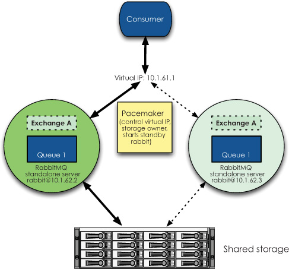
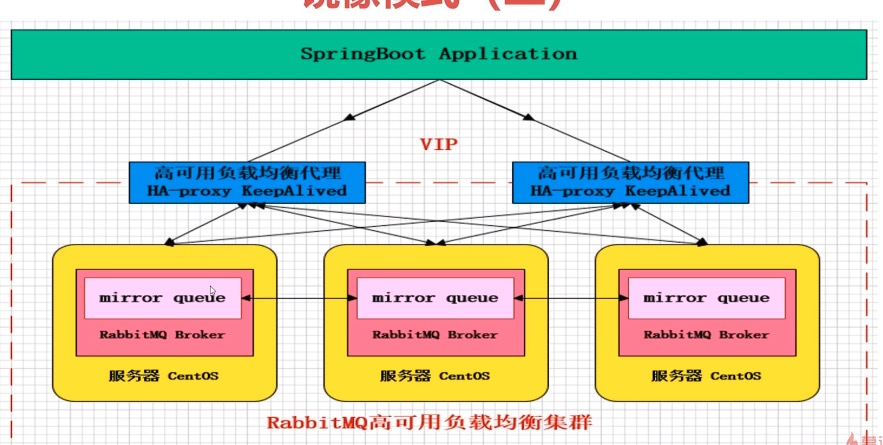
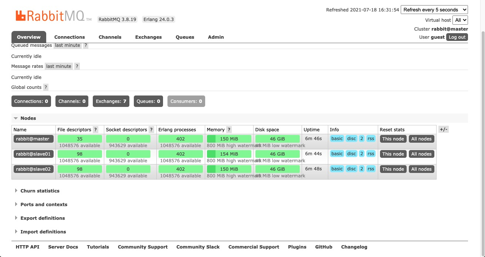
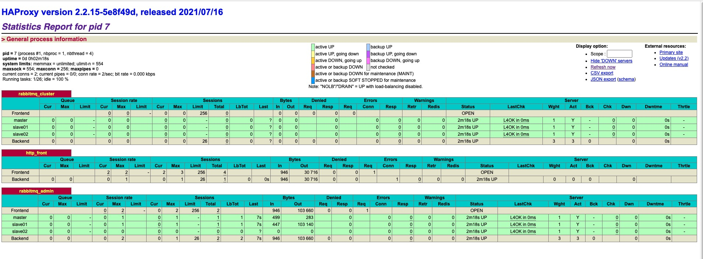
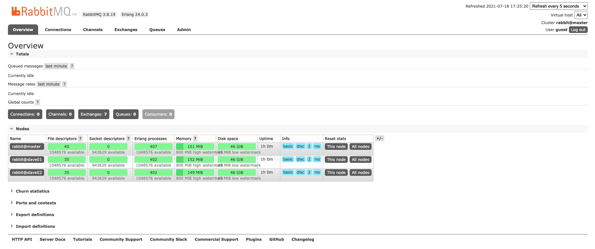

# rabbitmq学习

标签（空格分隔）： rabbitmq

* [rabbitmq学习](#rabbitmq学习)
   * [环境信息](#环境信息)
   * [mq对比](#mq对比)
   * [rabbitmq](#rabbitmq)
      * [安装rabbitmq](#安装rabbitmq)
      * [hello world](#hello-world)
      * [rabbitmq的消息路由策略](#rabbitmq的消息路由策略)
      * [消息手动ack](#消息手动ack)
      * [消息可靠性投递](#消息可靠性投递)
         * [方案一](#方案一)
         * [方案二](#方案二)
      * [spring集成rabbitmq](#spring集成rabbitmq)
      * [springBoot集成rabbitmq](#springboot集成rabbitmq)
      * [springCloud集成rabbitmq](#springcloud集成rabbitmq)
   * [rabbitmq集群](#rabbitmq集群)
      * [warren模式](#warren模式)
      * [mirror模式](#mirror模式)
         * [版本信息](#版本信息)
         * [mirror队列搭建](#mirror队列搭建)
         * [HaProxy搭建](#haproxy搭建)
         * [KeepAlived搭建](#keepalived搭建)

## 环境信息
os:macOs 10.14.5

docker:18.09.2

## mq对比
- https://blog.csdn.net/belvine/article/details/80842240

|--| ActiveMQ        | RabbitMQ  |  RocketMq  | Kafka  |
| --------   | -----  | ----  |---|---|
| 成熟度     | 高 |   高     |高|高|
| 社区活跃度        |   高   |   高   |高   |高   |
| 是否开源        |    开源    |  开源  |开源|开源|
| 开发语言        |    Java    |  Erlang  |Java|Java/Scala|
| 支持协议        |    OpenWire、STOMP、REST、XMPP、AMQP|  AMQP  |自定义|自定义|

## rabbitmq
### 安装rabbitmq
个人认为，使用docker安装是一种比较简单优雅的方式，下面介绍一下docker安装rabbitmq。

 - 拉取镜像并启动

 ```linux
 docker run rabbitmq:3.7.17-management
 
 docker run -d --hostname my-rabbit -p 5671:5671 -p 5672:5672 -p 4369:4369 -p 25672:25672 -p 15671:15671 -p 15672:15672  --name test-rabbit rabbitmq:3.7.17-management
 
 # 查看一下rabbitmq是否启动成功
 {19-08-14 16:08}[ruby-2.3.7]t4f-mbp-17055:~/elk wangquanzhou% docker ps
CONTAINER ID        IMAGE                        COMMAND                  CREATED              STATUS                          PORTS                                                                                                                      NAMES
80f14b204f14        rabbitmq:3.7.17-management   "docker-entrypoint.s…"   About a minute ago   Up About a minute               0.0.0.0:4369->4369/tcp, 0.0.0.0:5671-5672->5671-5672/tcp, 0.0.0.0:15671-15672->15671-15672/tcp, 0.0.0.0:25672->25672/tcp   test-rabbit
 ```

 - web页面
浏览器输入http://localip:15672/进行登录，用户名、密码guest/guest
 
### hello world
做一个简单的demo，连接rabbitmq，并发送测试消息，首先是生产者：
```java
package com.bfxy.rabbitmq.quickstart;

import com.rabbitmq.client.Channel;
import com.rabbitmq.client.Connection;
import com.rabbitmq.client.ConnectionFactory;

public class Procuder {


    public static void main(String[] args) throws Exception {
        //1 创建一个ConnectionFactory, 并进行配置
        ConnectionFactory connectionFactory = new ConnectionFactory();
        connectionFactory.setHost("172.20.150.108");
        connectionFactory.setPort(5672);
        connectionFactory.setVirtualHost("/");

        //2 通过连接工厂创建连接
        Connection connection = connectionFactory.newConnection();

        //3 通过connection创建一个Channel
        Channel channel = connection.createChannel();

        //4 通过Channel发送数据
        for (int i = 0; i < 5; i++) {
            String msg = "Hello RabbitMQ!";
            //1 exchange   2 routingKey
            channel.basicPublish("", "test001", null, msg.getBytes());
        }

        //5 记得要关闭相关的连接
        channel.close();
        connection.close();
    }
}
```

然后是消费者：
```java
package com.bfxy.rabbitmq.quickstart;

import com.rabbitmq.client.Channel;
import com.rabbitmq.client.Connection;
import com.rabbitmq.client.ConnectionFactory;
import com.rabbitmq.client.QueueingConsumer;
import com.rabbitmq.client.QueueingConsumer.Delivery;

public class Consumer {

    public static void main(String[] args) throws Exception {

        //1 创建一个ConnectionFactory, 并进行配置
        ConnectionFactory connectionFactory = new ConnectionFactory();
        connectionFactory.setHost("172.20.150.108");
        connectionFactory.setPort(5672);
        connectionFactory.setVirtualHost("/");

        //2 通过连接工厂创建连接
        Connection connection = connectionFactory.newConnection();

        //3 通过connection创建一个Channel
        Channel channel = connection.createChannel();

        //4 声明（创建）一个队列
        String queueName = "test001";
        channel.queueDeclare(queueName, true, false, false, null);

        //5 创建消费者
        QueueingConsumer queueingConsumer = new QueueingConsumer(channel);

        //6 设置Channel
        channel.basicConsume(queueName, true, queueingConsumer);

        while (true) {
            //7 获取消息
            Delivery delivery = queueingConsumer.nextDelivery();
            String msg = new String(delivery.getBody());
            System.err.println("消费端: " + msg);
            //Envelope envelope = delivery.getEnvelope();
        }

    }
}
```
先启动消费端，创建队列，然后启动生产端，发送消息：

消费端控制台输出如下：
```java
消费端: Hello RabbitMQ!
消费端: Hello RabbitMQ!
消费端: Hello RabbitMQ!
消费端: Hello RabbitMQ!
消费端: Hello RabbitMQ!
```

### rabbitmq的消息路由策略
大致来讲，rabbitmq有三种消息路由规则，分别是

 1. Direct Exchange（精确匹配）
 2. Topic Exchange（模糊匹配）
 3. Fanout Exchange（广播）

三者的关系可以使用下面的三张图清晰的说明：

![此处输入图片的描述][1]

![此处输入图片的描述][2]

![此处输入图片的描述][3]

这里说明一下，Topic模式的*和#，实际验证结果貌似是 *是模糊匹配一个单词， #是匹配多个单词。Topic示例代码如下：

首先是生产者：
```java
package com.bfxy.rabbitmq.api.exchange.topic;

import com.rabbitmq.client.Channel;
import com.rabbitmq.client.Connection;
import com.rabbitmq.client.ConnectionFactory;

public class Producer4TopicExchange {


    public static void main(String[] args) throws Exception {

        //1 创建ConnectionFactory
        ConnectionFactory connectionFactory = new ConnectionFactory();
        connectionFactory.setHost("172.20.150.108");
        connectionFactory.setPort(5672);
        connectionFactory.setVirtualHost("/");

        //2 创建Connection
        Connection connection = connectionFactory.newConnection();
        //3 创建Channel
        Channel channel = connection.createChannel();
        //4 声明
        String exchangeName = "test_topic_exchange";
        String routingKey1 = "user.save";
        String routingKey2 = "user.update";
        String routingKey3 = "user.delete.abc";
        //5 发送

        String msg = "Hello World RabbitMQ 4 Topic Exchange Message ...";
        channel.basicPublish(exchangeName, routingKey1, null, msg.getBytes());
        msg = "Hello World RabbitMQ 4 Topic Exchange Message ..." + "11";
        channel.basicPublish(exchangeName, routingKey2, null, msg.getBytes());
        msg = "Hello World RabbitMQ 4 Topic Exchange Message ..." + "22";
        channel.basicPublish(exchangeName, routingKey3, null, msg.getBytes());
        channel.close();
        connection.close();
    }

}
```

然后是消费者：
```java
package com.bfxy.rabbitmq.api.exchange.topic;

import com.rabbitmq.client.Channel;
import com.rabbitmq.client.Connection;
import com.rabbitmq.client.ConnectionFactory;
import com.rabbitmq.client.QueueingConsumer;
import com.rabbitmq.client.QueueingConsumer.Delivery;

public class Consumer4TopicExchange {

	public static void main(String[] args) throws Exception {
		
		
        ConnectionFactory connectionFactory = new ConnectionFactory() ;  
        
        connectionFactory.setHost("172.20.150.108");
        connectionFactory.setPort(5672);
		connectionFactory.setVirtualHost("/");
		
        connectionFactory.setAutomaticRecoveryEnabled(true);
        connectionFactory.setNetworkRecoveryInterval(3000);
        Connection connection = connectionFactory.newConnection();
        
        Channel channel = connection.createChannel();  
		//4 声明
		String exchangeName = "test_topic_exchange";
		String exchangeType = "topic";
		String queueName = "test_topic_queue";
		//String routingKey = "user.*";
		String routingKey = "user.#";
		// 1 声明交换机 
		channel.exchangeDeclare(exchangeName, exchangeType, true, false, false, null);
		// 2 声明队列
		channel.queueDeclare(queueName, false, false, false, null);
		// 3 建立交换机和队列的绑定关系:
		channel.queueBind(queueName, exchangeName, routingKey);
		
        //durable 是否持久化消息
        QueueingConsumer consumer = new QueueingConsumer(channel);
        //参数：队列名称、是否自动ACK、Consumer
        channel.basicConsume(queueName, true, consumer);  
        //循环获取消息  
        while(true){  
            //获取消息，如果没有消息，这一步将会一直阻塞  
            Delivery delivery = consumer.nextDelivery();  
            String msg = new String(delivery.getBody());    
            System.out.println("收到消息：" + msg);  
        } 
	}
}
```

注意上面的29 30行，可以试着换一下，看看效果：
```java
收到消息：Hello World RabbitMQ 4 Topic Exchange Message ...
收到消息：Hello World RabbitMQ 4 Topic Exchange Message ...11
收到消息：Hello World RabbitMQ 4 Topic Exchange Message ...22
```
如果使用
```java
String routingKey = "user.*";
```
那么结果如下：
```java
收到消息：Hello World RabbitMQ 4 Topic Exchange Message ...
收到消息：Hello World RabbitMQ 4 Topic Exchange Message ...11
```
注意一点，如果发现结果与上面的不符合，需要进到管理界面将queue上绑定的路由key进行解绑：
![此处输入图片的描述][4]
 
### 消息手动ack
为了保证消息的投递成功，即100%消费，一般可以使用ack机制进行确认。rabbitmq默认自动ack，当然也可以设置抖动ack。

### 消息可靠性投递

下面，我们先看一下业界一般的保证消息确认性投递的架构设计，如下图所示：

#### 方案一

核心思想就是，消息发送之前先对消息进行入库，然后等消息ack回来以后，再修改消息的状态。但是这样对于并发要求较高的系统一般不容易满足要求。

 ![此处输入图片的描述][5]
 
#### 方案二

这种方式，对于同一通知产生两条消息，如下图所示。两条消息一前一后相继发送，前一条消息主要传递通知所承载的业务信息，后一条消息主要负责检测前一条业务消息是否投递成功。
   ![此处输入图片的描述][6]
   
   基于上面的图，自己整理除了下面的图。第1-6步是第一条消息的投递过程。7-9步是第二条消息的投递过程（第9步发生的前提的，第一条消息消费失败了）。下面分别就合格步骤讲解一下。
   
   

 1. upstream service产生的消息存入数据库
 2. 发生该条业务消息给biz queue这个队列
 3. downStream service监听biz queue队列，获得业务消息，并进行处理
 4. downStream service反馈处理结果给ack queue
 5. callback service监听ack queue，获得业务消息处理结果
 6. 处理结果存储在msg db
 7. upstream service发生second确认消息，消息路由到second check queue队列
 8. callback service监听second check queue，获得second确认消息，从msg db查询确认消息对应的业务消息的ack情况
 9. 如果业务消息消费失败了，那么callback service通知upstream service进行消息重发
 

![此处输入图片的描述][7]   

 - 手动ack示例代码

首先是消费端代码：
```java
package com.bfxy.rabbitmq.api.ack;

import com.rabbitmq.client.Channel;
import com.rabbitmq.client.Connection;
import com.rabbitmq.client.ConnectionFactory;

public class Consumer {


    public static void main(String[] args) throws Exception {


        ConnectionFactory connectionFactory = new ConnectionFactory();
        connectionFactory.setHost("192.168.82.145");
        connectionFactory.setPort(5672);
        connectionFactory.setVirtualHost("/");

        Connection connection = connectionFactory.newConnection();
        Channel channel = connection.createChannel();


        String exchangeName = "test_ack_exchange";
        String queueName = "test_ack_queue";
        String routingKey = "ack.#";

        channel.exchangeDeclare(exchangeName, "topic", true, false, null);
        channel.queueDeclare(queueName, true, false, false, null);
        channel.queueBind(queueName, exchangeName, routingKey);

        // 手工签收 必须要关闭 autoAck = false
        channel.basicConsume(queueName, false, new MyConsumer(channel));
    }
}
```

然后是消费端内部自定义的MyConsumer类：
```java
package com.bfxy.rabbitmq.api.ack;

import java.io.IOException;

import com.rabbitmq.client.AMQP;
import com.rabbitmq.client.Channel;
import com.rabbitmq.client.DefaultConsumer;
import com.rabbitmq.client.Envelope;

public class MyConsumer extends DefaultConsumer {


    private Channel channel;

    public MyConsumer(Channel channel) {
        super(channel);
        this.channel = channel;
    }

    @Override
    public void handleDelivery(String consumerTag, Envelope envelope, AMQP.BasicProperties properties, byte[] body) throws IOException {
        System.err.println("-----------consume message----------");
        System.err.println("body: " + new String(body));
        try {
            Thread.sleep(2000);
        } catch (InterruptedException e) {
            e.printStackTrace();
        }
        if ((Integer) properties.getHeaders().get("num") == 0) {
            // 第三个参数 requeue=true表示重回队列  false表示不重回队列
			System.out.println("--nack-");
            channel.basicNack(envelope.getDeliveryTag(), false, false);
        } else {
            channel.basicAck(envelope.getDeliveryTag(), false);
        }

    }


}
```

最后是生产端：
```java
package com.bfxy.rabbitmq.api.ack;

import java.io.IOException;
import java.util.HashMap;
import java.util.Map;

import com.rabbitmq.client.*;

public class Producer {


    public static void main(String[] args) throws Exception {

        ConnectionFactory connectionFactory = new ConnectionFactory();
        connectionFactory.setHost("192.168.82.145");
        connectionFactory.setPort(5672);
        connectionFactory.setVirtualHost("/");

        Connection connection = connectionFactory.newConnection();
        Channel channel = connection.createChannel();

        String exchange = "test_ack_exchange";
        String routingKey = "ack.save";


        for (int i = 0; i < 5; i++) {

            Map<String, Object> headers = new HashMap<String, Object>();
            headers.put("num", i);

            AMQP.BasicProperties properties = new AMQP.BasicProperties.Builder()
                    .deliveryMode(2)
                    .contentEncoding("UTF-8")
                    .headers(headers)
                    .build();
            String msg = "Hello RabbitMQ ACK Message " + i;
            channel.basicPublish(exchange, routingKey, properties, msg.getBytes());
        }
    }
}
```
运行代码输出如下：
```java
-----------consume message----------
body: Hello RabbitMQ ACK Message 0
--nack-
-----------consume message----------
body: Hello RabbitMQ ACK Message 1
-----------consume message----------
body: Hello RabbitMQ ACK Message 2
-----------consume message----------
body: Hello RabbitMQ ACK Message 3
-----------consume message----------
body: Hello RabbitMQ ACK Message 4

Process finished with exit code -1
```

### spring集成rabbitmq
spring整合rabbitmq，基本上也就是类似于redis整合，有一个config类，然后在内部做各种配置，具体可以参考[这里](https://github.com/Audi-A7/rabbit-mq-demo/blob/master/rabbitmq-spring/src/main/java/com/bfxy/spring/RabbitMQConfig.java) 

这里我们重点关注一下config类内部的SimpleMessageListenerContainer，它可以实现很多功能。

![此处输入图片的描述][8]

具体的配置可以参考下图：

![此处输入图片的描述][9]

### springBoot集成rabbitmq
springboot集成的时候，和spring的一个比较大的区别就是，不再需要自己手动设置rabbitmq的连接信息，只需要将这些加入properties文件即可。
 
 另外，注意一下@RabbitListener注解，使用这个注解我们方便进行各种参数的配置，实例如下：
```java
package com.bfxy.springboot.conusmer;

import java.util.Map;

import org.springframework.amqp.rabbit.annotation.Exchange;
import org.springframework.amqp.rabbit.annotation.Queue;
import org.springframework.amqp.rabbit.annotation.QueueBinding;
import org.springframework.amqp.rabbit.annotation.RabbitHandler;
import org.springframework.amqp.rabbit.annotation.RabbitListener;
import org.springframework.amqp.support.AmqpHeaders;
import org.springframework.messaging.Message;
import org.springframework.messaging.handler.annotation.Headers;
import org.springframework.messaging.handler.annotation.Payload;
import org.springframework.stereotype.Component;

import com.rabbitmq.client.Channel;

@Component
public class RabbitReceiver {

	
	@RabbitListener(bindings = @QueueBinding(
			value = @Queue(value = "queue-1", 
			durable="true"),
			exchange = @Exchange(value = "exchange-1", 
			durable="true", 
			type= "topic", 
			ignoreDeclarationExceptions = "true"),
			key = "springboot.*"
			)
	)
	@RabbitHandler
	public void onMessage(Message message, Channel channel) throws Exception {
		System.err.println("--------------------------------------");
		System.err.println("消费端Payload: " + message.getPayload());
		Long deliveryTag = (Long)message.getHeaders().get(AmqpHeaders.DELIVERY_TAG);
		//手工ACK
		channel.basicAck(deliveryTag, false);
	}
	
	
	/**
	 * 
	 * 	spring.rabbitmq.listener.order.queue.name=queue-2
		spring.rabbitmq.listener.order.queue.durable=true
		spring.rabbitmq.listener.order.exchange.name=exchange-1
		spring.rabbitmq.listener.order.exchange.durable=true
		spring.rabbitmq.listener.order.exchange.type=topic
		spring.rabbitmq.listener.order.exchange.ignoreDeclarationExceptions=true
		spring.rabbitmq.listener.order.key=springboot.*
	 * @param order
	 * @param channel
	 * @param headers
	 * @throws Exception
	 */
	@RabbitListener(bindings = @QueueBinding(
			value = @Queue(value = "${spring.rabbitmq.listener.order.queue.name}", 
			durable="${spring.rabbitmq.listener.order.queue.durable}"),
			exchange = @Exchange(value = "${spring.rabbitmq.listener.order.exchange.name}", 
			durable="${spring.rabbitmq.listener.order.exchange.durable}", 
			type= "${spring.rabbitmq.listener.order.exchange.type}", 
			ignoreDeclarationExceptions = "${spring.rabbitmq.listener.order.exchange.ignoreDeclarationExceptions}"),
			key = "${spring.rabbitmq.listener.order.key}"
			)
	)
	@RabbitHandler
	public void onOrderMessage(@Payload com.bfxy.springboot.entity.Order order, 
			Channel channel, 
			@Headers Map<String, Object> headers) throws Exception {
		System.err.println("--------------------------------------");
		System.err.println("消费端order: " + order.getId());
		Long deliveryTag = (Long)headers.get(AmqpHeaders.DELIVERY_TAG);
		//手工ACK
		channel.basicAck(deliveryTag, false);
	}
	
	
}
```
 ### springCloud集成rabbitmq
 springCloud集成rabbitmq更多的是为了整合各种消息中间件，比如kafka，当更换消息中间件的时候，几乎不需要修改代码。
 ![此处输入图片的描述][10]
使用springcloud集成rabbitmq会使用到三个注解  
```java
@Input
@Output
@StreamListener
```
![此处输入图片的描述][11]

以消费端为例：

 1. 首先需要添加必要的配置文件
```java
server.port=8002
server.context-path=/consumer

spring.application.name=consumer
spring.cloud.stream.bindings.input_channel.destination=exchange-3
spring.cloud.stream.bindings.input_channel.group=queue-3
spring.cloud.stream.bindings.input_channel.binder=rabbit_cluster
spring.cloud.stream.bindings.input_channel.consumer.concurrency=1
spring.cloud.stream.rabbit.bindings.input_channel.consumer.requeue-rejected=false
spring.cloud.stream.rabbit.bindings.input_channel.consumer.acknowledge-mode=MANUAL
spring.cloud.stream.rabbit.bindings.input_channel.consumer.recovery-interval=3000
spring.cloud.stream.rabbit.bindings.input_channel.consumer.durable-subscription=true
spring.cloud.stream.rabbit.bindings.input_channel.consumer.max-concurrency=5

spring.cloud.stream.binders.rabbit_cluster.type=rabbit
spring.cloud.stream.binders.rabbit_cluster.environment.spring.rabbitmq.addresses=192.168.11.76:5672
spring.cloud.stream.binders.rabbit_cluster.environment.spring.rabbitmq.username=guest
spring.cloud.stream.binders.rabbit_cluster.environment.spring.rabbitmq.password=guest
spring.cloud.stream.binders.rabbit_cluster.environment.spring.rabbitmq.virtual-host=/
```
 2. 然后编写Barista接口
```java
package com.bfxy.rabbitmq.stream;

import org.springframework.cloud.stream.annotation.Input;
import org.springframework.messaging.SubscribableChannel;

/**
 * <B>中文类名：</B><BR>
 * <B>概要说明：</B><BR>
 * 这里的Barista接口是定义来作为后面类的参数，这一接口定义来通道类型和通道名称。
 * 通道名称是作为配置用，通道类型则决定了app会使用这一通道进行发送消息还是从中接收消息。
 * @author ashen（Alienware）
 * @since 2016年7月22日
 */

public interface Barista {
	  
    String INPUT_CHANNEL = "input_channel";  

    //注解@Input声明了它是一个输入类型的通道，名字是Barista.INPUT_CHANNEL，也就是position3的input_channel。这一名字与上述配置app2的配置文件中position1应该一致，表明注入了一个名字叫做input_channel的通道，它的类型是input，订阅的主题是position2处声明的mydest这个主题  
    @Input(Barista.INPUT_CHANNEL)  
    SubscribableChannel loginput();  
    
      
}  
```
 3. 最后，定义接收者receiver：
```java
package com.bfxy.rabbitmq.stream;

import org.springframework.amqp.support.AmqpHeaders;
import org.springframework.cloud.stream.annotation.EnableBinding;
import org.springframework.cloud.stream.annotation.StreamListener;
import org.springframework.messaging.Message;
import org.springframework.stereotype.Service;

import com.rabbitmq.client.Channel;


@EnableBinding(Barista.class)
@Service
public class RabbitmqReceiver {  

    @StreamListener(Barista.INPUT_CHANNEL)  
    public void receiver(Message message) throws Exception {  
		Channel channel = (com.rabbitmq.client.Channel) message.getHeaders().get(AmqpHeaders.CHANNEL);
		Long deliveryTag = (Long) message.getHeaders().get(AmqpHeaders.DELIVERY_TAG);
    	System.out.println("Input Stream 1 接受数据：" + message);
    	System.out.println("消费完毕------------");
    	channel.basicAck(deliveryTag, false);
    }  
}  
```

## rabbitmq集群

### warren模式

- https://livebook.manning.com/book/rabbitmq-in-action/chapter-7/13



如上图所示，这种模式相对简单，通过haProxy来自动调整对外服务的节点（主挂了，备上）。主备节点的存储是共享的。

### mirror模式

- https://cloud.tencent.com/developer/article/1631148



镜像集群模式下，消息会在所有的节点进行同步，可以保证数据的不丢失。一般需要3个及以上的节点，并且是基数个节点，因为有些集群操作会涉及到选举投票过程，避免出现`脑裂`。

这种方案虽然对于消息的可靠性可以保证，但是由于消息在每个节点都进行同步，大大消耗了集群带宽。

这里使用docker搭建一下上图列出的镜像集群架构。

#### 版本信息
- docker:18.09.2
- rabbitmq:3.8.19
- HaProxy:2.2.15
- KeepAlived:2.0.20

#### mirror队列搭建

这里为了方便使用docker-compose模式，新建一个名为`rabbitmq-docker-compose.yml`的文件，内容如下：
```yaml
#  启动命令  docker-compose up  （-d可以后台运行）docker-compose up  xx-service 可以指定启动某一个应用
#  停止命令  docker-compose down
version: '2'

services:
  master:
    image: rabbitmq:3.8.19-management
    ports:
      - 5672:5672
      - 15672:15672
    hostname:
      master
    environment:
      RABBITMQ_ERLANG_COOKIE: 'myrabbitmqcookie'

  slave01:
    image: rabbitmq:3.8.19-management
    ports:
      - 5673:5672
      - 15673:15672
    hostname:
      slave01
    environment:
      RABBITMQ_ERLANG_COOKIE: 'myrabbitmqcookie'

  slave02:
    image: rabbitmq:3.8.19-management
    ports:
      - 5674:5672
      - 15674:15672
    hostname:
      slave02
    environment:
      RABBITMQ_ERLANG_COOKIE: 'myrabbitmqcookie'
```

使用如下命令启动：
```shell
docker-compose -f rabbitmq-docker-compose.yml up -d
## 停止使用
docker-compose -f rabbitmq-docker-compose.yml down
```

然后使用docker exec命令，分别进入slave01、slave02容器执行如下命令：
```shell
root@slave01:/# rabbitmqctl stop_app
RABBITMQ_ERLANG_COOKIE env variable support is deprecated and will be REMOVED in a future version. Use the $HOME/.erlang.cookie file or the --erlang-cookie switch instead.
Stopping rabbit application on node rabbit@slave01 ...
root@slave01:/#
root@slave01:/#
root@slave01:/# rabbitmqctl join_cluster rabbit@master
RABBITMQ_ERLANG_COOKIE env variable support is deprecated and will be REMOVED in a future version. Use the $HOME/.erlang.cookie file or the --erlang-cookie switch instead.
Clustering node rabbit@slave01 with rabbit@master
root@slave01:/# rabbitmqctl start_app
RABBITMQ_ERLANG_COOKIE env variable support is deprecated and will be REMOVED in a future version. Use the $HOME/.erlang.cookie file or the --erlang-cookie switch instead.
Starting node rabbit@slave01 ...
root@slave01:/#
```
即，首先停止app，然后假如集群，然后再启动app。

此时任意节点打开rabbitmq浏览器控制台，都可以看到三个节点已经组成了集群：


配置镜像模式，在任意节点执行如下指令：
```shell
root@slave01:/# rabbitmqctl set_policy ha-all "^" '{"ha-mode":"all"}'
RABBITMQ_ERLANG_COOKIE env variable support is deprecated and will be REMOVED in a future version. Use the $HOME/.erlang.cookie file or the --erlang-cookie switch instead.
Setting policy "ha-all" for pattern "^" to "{"ha-mode":"all"}" with priority "0" for vhost "/" ...
root@slave01:/#
```

至此，rabbitmq基本的镜像队列就搭建完了。

#### HaProxy搭建

- https://www.huaweicloud.com/articles/272c98db522ca892fb1ffc36919c41b8.html
- https://hub.docker.com/_/haproxy?tab=description&page=1&ordering=last_updated

创建`haproxy.cfg`文件，内容如下：
```shell
global
  daemon
  maxconn 256

defaults
  mode http
  timeout connect 5000ms

  timeout client 5000ms

  timeout server 5000ms

listen rabbitmq_cluster
##监听5677端口转发到rabbitmq服务
  bind 0.0.0.0:5677
  option tcplog
  mode tcp
  balance leastconn
  # rabbitmq集群节点配置 #inter 每隔2秒对mq集群做健康检查， 2次正确证明服务器可用，3次失败证明服务器不可用，并且配置主备机制
  server master master:5672 check inter 2s rise 2 fall 3
  server slave01 slave01:5672 check inter 2s rise 2 fall 3
  server slave02 slave02:5672 check inter 2s rise 2 fall 3

listen http_front 
##haproxy的客户页面
  bind 0.0.0.0:80
  # 设置haproxy监控地址
  stats uri /haproxy?stats

listen rabbitmq_admin 
##监听8001端口转发到rabbitmq的客户端
  bind 0.0.0.0:8001
  server master master:15672 check inter 2s rise 2 fall 3
  server slave01 slave01:15672 check inter 2s rise 2 fall 3
  server slave02 slave02:15672 check inter 2s rise 2 fall 3
```

在`haproxy.cfg`文件的同级目录下创建`Dockerfile`文件，内容如下：
```shell
FROM haproxy:2.2.15
COPY haproxy.cfg /usr/local/etc/haproxy/haproxy.cfg
```
执行docker build命令：
```shell
docker build -t my-haproxy .
```

然后执行docker命令启动容器，注意这里要和rabbitmq在一个network里面：
```shell
docker run -d --name rabbitmq-haproxy01  -p 8090:80 -p 5677:5677 -p 8001:8001 --net=rabbitmq_default  my-haproxy:latest 

docker run -d --name rabbitmq-haproxy02  -p 8091:80 -p 5678:5677 -p 8002:8001 --net=rabbitmq_default  my-haproxy:latest 
```

访问`haproxy?stats`页面查看控制台信息：


此外访问http://x.x.x.x:8001或者http://x.x.x.x:8002也可以访问到rabbitmq的控制台：


#### KeepAlived搭建

- https://blog.csdn.net/qq_21108311/article/details/82973763

在两个haProxy的docker容器内分别安装keepalived服务：
```shell
更新update，安装keepalived
apt-get update
apt-get install keepalived
 
安装vim 安装ifconfig命令 安装ping
apt-get install net-tools    
apt-get install iputils-ping
apt-get install vim-gtk
```

在rabbitmq-haproxy01容器类新建配置文件/etc/keepalived/keepalived.conf：
```shell
vrrp_instance  VI_1 {
    state  MASTER
    interface  eth0
    virtual_router_id  100
    priority  100
    advert_int  1
    authentication {
        auth_type  PASS
        auth_pass  123456
    }
    virtual_ipaddress {
        172.24.0.70
    }
}
```

在rabbitmq-haproxy02容器类新建配置文件/etc/keepalived/keepalived.conf：
```shell
vrrp_instance  VI_1 {
    state  BACKUP
    interface  eth0
    virtual_router_id  100
    priority  80
    advert_int  1
    authentication {
        auth_type  PASS
        auth_pass  123456
    }
    virtual_ipaddress {
        172.24.0.70
    }
}
```


  [1]: https://github.com/Audi-A7/learn/blob/master/source/image/rabbitmq/8.png?raw=true
  [2]: https://github.com/Audi-A7/learn/blob/master/source/image/rabbitmq/9.png?raw=true
  [3]: https://github.com/Audi-A7/learn/blob/master/source/image/rabbitmq/10.png?raw=true
  [4]: https://github.com/Audi-A7/learn/blob/master/source/image/rabbitmq/unbind.png?raw=true
  [5]: https://github.com/Audi-A7/learn/blob/master/source/image/rabbitmq/11.png?raw=true
  [6]: https://github.com/Audi-A7/learn/blob/master/source/image/rabbitmq/12.png?raw=true
  [7]: https://github.com/Audi-A7/learn/blob/master/source/image/rabbitmq/%E6%B6%88%E6%81%AF%E5%8F%AF%E9%9D%A0%E6%80%A7%E6%8A%95%E9%80%92.png?raw=true
  [8]: https://github.com/Audi-A7/learn/blob/master/source/image/rabbitmq/23.png?raw=true
  [9]: https://github.com/Audi-A7/learn/blob/master/source/image/rabbitmq/24.png?raw=true
  [10]: https://github.com/Audi-A7/learn/blob/master/source/image/rabbitmq/32.png?raw=true
  [11]: https://github.com/Audi-A7/learn/blob/master/source/image/rabbitmq/33.png?raw=true