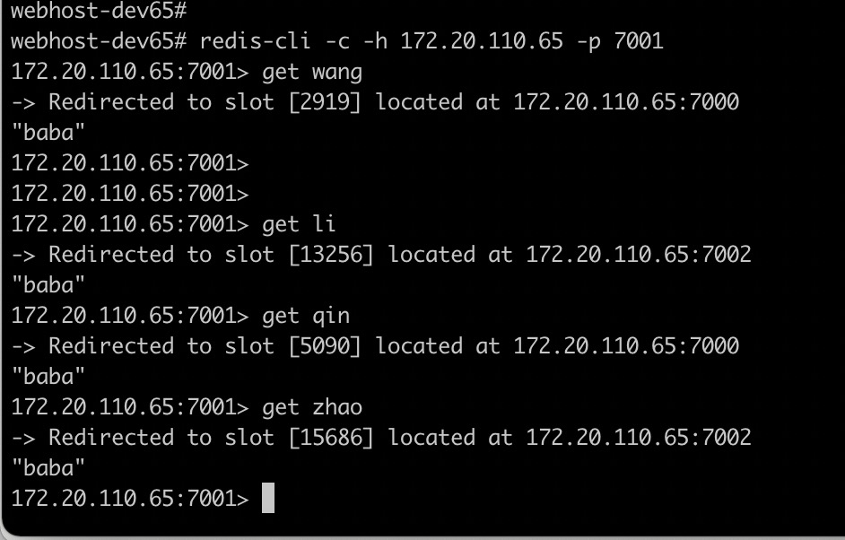
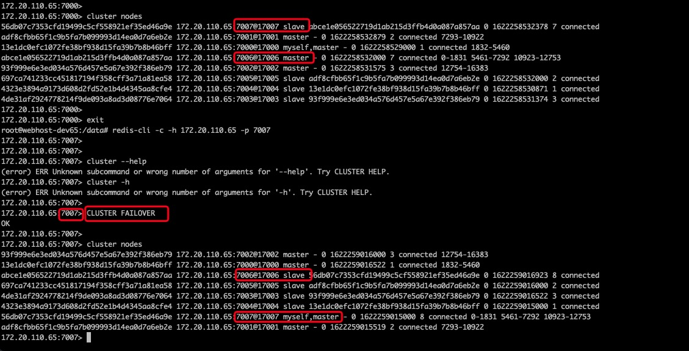
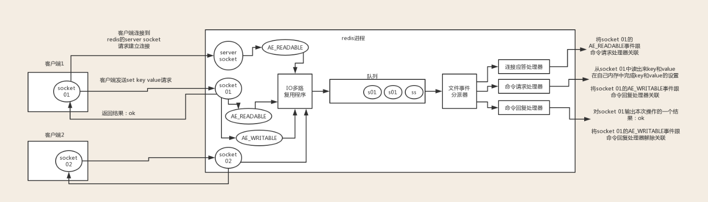
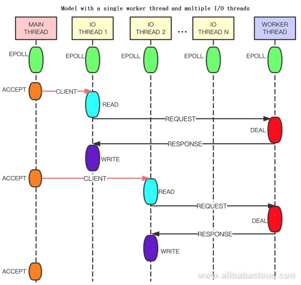
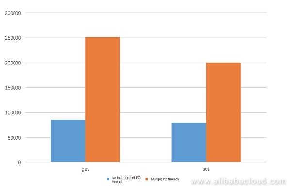

# redis学习

标签（空格分隔）： redis 数据结构

---

* [redis学习](#redis学习)
   * [redis数据结构](#redis数据结构)
      * [参考链接](#参考链接)
      * [redisObject](#redisobject)
      * [string](#string)
      * [list](#list)
      * [hash](#hash)
      * [set](#set)
      * [zset](#zset)
         * [zset对于重复数据的处理](#zset对于重复数据的处理)
   * [redis为何快](#redis为何快)
      * [多路IO复用模型](#多路io复用模型)
   * [使用shell和pipline构造海量redis数据](#使用shell和pipline构造海量redis数据)
   * [redis的pipline](#redis的pipline)
   * [海量key的查询](#海量key的查询)
   * [使用redis构建分布式锁](#使用redis构建分布式锁)
   * [使用redis构建异步队列](#使用redis构建异步队列)
   * [redis的持久化以及实战](#redis的持久化以及实战)
   * [gossip流言协议](#gossip流言协议)
   * [redis主从搭建](#redis主从搭建)
   * [redis集群原理](#redis集群原理)
      * [什么是CRC16](#什么是crc16)
      * [为什么是16384](#为什么是16384)
      * [集群一致性](#集群一致性)
   * [redis集群搭建](#redis集群搭建)
      * [搭建](#搭建)
      * [结合springboot应用](#结合springboot应用)
      * [集群扩缩容](#集群扩缩容)
         * [增加一个master](#增加一个master)
         * [集群的resharding](#集群的resharding)
         * [增加一个slave](#增加一个slave)
         * [mannual failover](#mannual-failover)
         * [集群高可用保证（方案）](#集群高可用保证方案)
         * [集群节点版本升级](#集群节点版本升级)
   * [redis锁](#redis锁)
      * [普通方式加锁](#普通方式加锁)
      * [redission](#redission)
         * [加锁](#加锁)
         * [加锁注意事项](#加锁注意事项)
         * [解锁](#解锁)
      * [red lock](#red-lock)
         * [算法步骤](#算法步骤)
         * [时钟问题](#时钟问题)
         * [重试策略](#重试策略)
         * [宕机恢复](#宕机恢复)
         * [使用](#使用)
   * [redis线程模型](#redis线程模型)
      * [单线程模型](#单线程模型)
      * [多线程模型](#多线程模型)
         * [为什么需要多线程](#为什么需要多线程)
      * [性能对比](#性能对比)
   * [redis的ASK和MOVED](#redis的ASK和MOVED)
      * [ASK](#ASK)
      * [MOVED](#MOVED)


redis学习的[参考文档](https://redisbook.readthedocs.io/en/latest/index.html)，这是我目前看到的最完备，图文并茂的文档，值得学习。

## redis数据结构

### 参考链接

 - https://www.toutiao.com/i6731690432675185165/
 - https://www.cnblogs.com/hunternet/p/11248192.html

### redisObject
理论上来说，所有redis存储的value都是一个redisObject，它的结构如下：
```c++
typedef struct redisObject {
 unsigned [type] 4;
 unsigned [encoding] 4;
 unsigned [lru] REDIS_LRU_BITS;
 int refcount;
 void *ptr;
} robj;
```
简单介绍一下这几个字段：

 - type：数据类型，就是我们熟悉的string、hash、list等。
 - encoding：内部编码，其实就是本文要介绍的数据结构。指的是当前这个value底层是用的什么数据结构。因为同一个数据类型底层也有多种数据结构的实现，所以这里需要指定数据结构。
 - REDIS_LRU_BITS：当前对象可以保留的时长。这个我们在后面讲键的过期策略的时候讲。
 - refcount：对象引用计数，用于GC。
 - ptr：指针，指向以encoding的方式实现这个对象的实际地址。

![此处输入图片的描述][1]

### string
在Redis内部，string类型有两种底层储存结构。Redis会根据存储的数据及用户的操作指令自动选择合适的结构：

 - int：存放整数类型；
 - SDS(简单动态字符串 simple dynamic string)：存放浮点、字符串、字节类型；

SDS的内部数据结构：
```c++
typedef struct sdshdr {
 // buf中已经占用的字符长度
 unsigned int len;
 // buf中剩余可用的字符长度
 unsigned int free;
 // 数据空间
 char buf[];
}
```
可见，其底层是一个char数组。buf最大容量为512M，里面可以放字符串、浮点数和字节。它为什么没有直接使用数组，而是包装成了这样的数据结构呢？

因为buf会有动态扩容和缩容的需求。如果直接使用数组，那每次对字符串的修改都会导致重新分配内存，效率很低。

buf的扩容过程如下：

 - 如果修改后len长度将小于1M,这时分配给free的大小和len一样,例如修改过后为10字节,
   那么给free也是10字节，buf实际长度变成了10 + 10 + 1 = 21byte (下图展示的就是该种情况)
 - 如果修改后len长度将大于等于1M,这时分配给free的长度为1M,例如修改过后为30M,那么给free是1M.buf实际长度变成了30M + 1M + 1byte

![此处输入图片的描述][2]
 
 需要指出的是，与扩容相反，当缩容时，并不会进行真正的缩容，「惰性空间释放指的是当字符串缩短时，并没有真正的缩容，而是移动free的指针。这样将来字符串长度增加时，就不用重新分配内存了。但这样会造成内存浪费，Redis提供了API来真正释放内存。」
 
 

### list
list底层有两种数据结构：链表linkedlist和压缩列表ziplist。当list元素个数少且元素内容长度不大时，使用ziplist实现，否则使用linkedlist。

 - 链表

Redis使用的链表是双向链表。为了方便操作，使用了一个list结构来持有这个链表。如图所示：
![此处输入图片的描述][3]
其数据结构如下所示：
```c++
typedef struct list{
 //表头节点
 listNode *head;
 //表尾节点
 listNode *tail;
 //链表所包含的节点数量
 unsigned long len;
 //节点值复制函数
 void *(*dup)(void *ptr);
 //节点值释放函数
 void *(*free)(void *ptr);
 //节点值对比函数
 int (*match)(void *ptr,void *key);
}list;
```

 - 压缩列表

与上面的链表相对应，压缩列表有点儿类似数组，通过一片连续的内存空间，来存储数据。不过，它跟数组不同的一点是，它允许存储的数据大小不同。每个节点上增加一个length属性来记录这个节点的长度，这样比较方便地得到下一个节点的位置。
![此处输入图片的描述][4]

上图的各字段含义为：

 - zlbytes：列表的总长度
 - zltail：指向最末元素
 - zllen：元素的个数
 - entry：元素的内容，里面记录了前一个Entry的长度，用于方便双向遍历
 - zlend：恒为0xFF，作为ziplist的定界符

 压缩列表不只是list的底层实现，也是hash的底层实现之一。当hash的元素个数少且内容长度不大时，使用压缩列表来实现。
 
 

### hash
hash底层有两种实现：压缩列表和字典（dict）。压缩列表刚刚上面已经介绍过了，下面主要介绍一下字典的数据结构。

 - 字典

字典其实就类似于Java语言中的Map,Python语言中的dict。与Java中的HashMap类似，Redis底层也是使用的散列表作为字典的实现，解决hash冲突使用的是链表法(其实，就是jdk8之前版本里的hashmap)。Redis同样使用了一个数据结构来持有这个散列表：

![此处输入图片的描述][5]

在键增加或减少时，会扩容或缩容，并且进行rehash，根据hash值重新计算索引值。那如果这个字典**太大**了怎么办呢？

为了解决一次性扩容耗时过多的情况，可以将扩容操作穿插在插入操作的过程中，分批完成。当负载因子触达阈值之后，只申请新空间，但并不将老的数据搬移到新散列表中。当有新数据要插入时，将新数据插入新散列表中，并且从老的散列表中拿出一个数据放入到新散列表。每次插入一个数据到散列表，都重复上面的过程。经过多次插入操作之后，老的散列表中的数据就一点一点全部搬移到新散列表中了。这样没有了集中的一次一次性数据搬移，插入操作就都变得很快了。这个过程也被称为**渐进式rehash**。

### set
set里面没有重复的集合。set的实现比较简单。如果是整数类型，就直接使用整数集合intset（应该是类似于数组，然后数组内的元素有序存储的）。使用二分查找来辅助，速度还是挺快的。不过在插入的时候，由于要移动元素，时间复杂度是O(N)。

如果不是整数类型，就使用上面在hash那一节介绍的字典。key为set的值，value为空（这一点和java里的hashset的实现机制是一样的）。

### zset
zset是可排序的set。实现方式有ziplist或skiplist。在同时满足以下两个条件的时候使用ziplist，其他时候使用skiplist，两个条件如下：

 - 有序集合保存的元素数量小于128个
 - 有序集合保存的所有元素的长度小于64字节

在ziplist内部，是按照score排序递增来存储的。意味着每次插入数据都要移动之后的数据。

 - skiplist

跳表是对链表的一个增强。我们在使用链表的时候，即使元素的有序排列的，但如果要查找一个元素，也需要从头一个个查找下去，时间复杂度是O(N)。而跳表顾名思义，就是跳跃了一些元素，可以抽象多层。

如下图所示，比如我们要查找8，先在最上层L2查找，发现在1和9之间；然后去L1层查找，发现在5和9之间；然后去L0查找，发现在7和9之间，然后找到8。

当元素比较多时，使用跳表可以显著减少查找的次数。

![此处输入图片的描述][6]
同list类似，Redis内部也不是直接使用的跳表，而是使用了一个自定义的数据结构来持有跳表。下图左边蓝色部分是skiplist，右边是4个zskiplistNode。zskiplistNode内部有很多层L1、L2等，指针指向这一层的下一个结点。BW是回退指针（backward），用于查找的时候回退。然后下面是score和对象本身object。
![此处输入图片的描述][7]

上图展示了一个跳跃表示例,其中最左边的是 skiplist结构,该结构包含以下属性。

 - header:指向跳跃表的表头节点，通过这个指针程序定位表头节点的时间复杂度就为O(1)
 - tail:指向跳跃表的表尾节点,通过这个指针程序定位表尾节点的时间复杂度就为O(1)
 - level:记录目前跳跃表内,层数最大的那个节点的层数(表头节点的层数不计算在内)，通过这个属性可以再O(1)的时间复杂度内获取层高最高的节点的层数。
 - length:记录跳跃表的长度,也即是,跳跃表目前包含节点的数量(表头节点不计算在内)，通过这个属性，程序可以再O(1)的时间复杂度内返回跳跃表的长度。

结构右方的是四个 zskiplistNode结构,该结构包含以下属性

 - 层(level):

    节点中用L1、L2、L3等字样标记节点的各个层,L1代表第一层,L2代表第二层,以此类推。

    每个层都带有两个属性:前进指针和跨度。前进指针用于访问位于表尾方向的其他节点,而跨度则记录了前进指针所指向节点和当前节点的距离(跨度越大、距离越远)。在上图中,连线上带有数字的箭头就代表前进指针,而那个数字就是跨度。当程序从表头向表尾进行遍历时,访问会沿着层的前进指针进行。

    每次创建一个新跳跃表节点的时候,程序都根据幂次定律(powerlaw,越大的数出现的概率越小)随机生成一个介于1和32之间的值作为level数组的大小,这个大小就是层的“高度”。

 - 后退(backward)指针：

    节点中用BW字样标记节点的后退指针,它指向位于当前节点的前一个节点。后退指针在程序从表尾向表头遍历时使用。与前进指针所不同的是每个节点只有一个后退指针，因此每次只能后退一个节点。

 - 分值(score):

    各个节点中的1.0、2.0和3.0是节点所保存的分值。在跳跃表中,节点按各自所保存的分值从小到大排列。

 - 成员对象(oj):

    各个节点中的o1、o2和o3是节点所保存的成员对象。在同一个跳跃表中,各个节点保存的成员对象必须是唯一的,但是多个节点保存的分值却可以是相同的:分值相同的节点将按照成员对象在字典序中的大小来进行排序,成员对象较小的节点会排在前面(靠近表头的方向),而成员对象较大的节点则会排在后面(靠近表尾的方向)。

![此处输入图片的描述][8]

#### zset对于重复数据的处理

这里其实可以分两种情况进行讨论。

- score重复：zset会把相同score的不同对象按照对象的自然进行存储。

依次插入三个score相同的元素：
```java
172.20.90.123:6379[10]> zadd testZset 100 testValue100
(integer) 1
172.20.90.123:6379[10]> zadd testZset 100 testValue10
(integer) 1
172.20.90.123:6379[10]> zadd testZset 100 testValue1000
(integer) 1
```
然后使用zrange查看元素：
```java
172.20.90.123:6379[10]> zrange testZset 0 -1 WITHSCORES
1) "testValue10"
2) "100"
3) "testValue100"
4) "100"
5) "testValue1000"
6) "100"
```
可以看到元素的顺序，确实按照字典序进行了排序。

- value重复：zset会使用新的score进行排序

```java
172.20.90.123:6379[10]> zadd testZset 1001 testValue100
(integer) 0
172.20.90.123:6379[10]> zrange testZset 0 -1 WITHSCORES
1) "testValue10"
2) "100"
3) "testValue1000"
4) "100"
5) "testValue100"
6) "1001"
```


## redis为何快

主要是由于以下几个方面：

 1. 完全基于内存，查询速度快
 2. 采用单线程处理IO请求，避免高并发时线程上下文的频繁切换
 3. 采用多路IO复用模型，提高查询响应速度

### 多路IO复用模型
![此处输入图片的描述][9]

## 使用shell和pipline构造海量redis数据
批量生成redis测试数据

windows10环境下进入docker容器，power shell下执行：
```shell
 docker exec -it 容器id /bin/bash
```

 1. docker容器Linux Bash下面执行
```shell
for((i=1;i<=20000000;i++)); do echo "set k$i v$i" >> /tmp/redisTest.txt ;done;
```
  生成2千万条redis批量设置kv的语句(key=kn,value=vn)写入到/tmp目录下的redisTest.txt文件中

 2. 用vim去掉行尾的^M符号，使用方式如下
```shell
vim /tmp/redisTest.txt
    :set fileformat=dos #设置文件的格式，通过这句话去掉每行结尾的^M符号
    ::wq #保存退出
```
  

 3. 通过redis提供的管道--pipe形式，去跑redis

传入文件的指令批量灌数据，需要花10分钟左右
```shell
cat /tmp/redisTest.txt | 路径/redis-5.0.0/src/redis-cli -h 主机ip -p 端口号 --pipe
```
如果需要安装vim工具：

进入docker容器，执行：
```shell
apt-get update
```

然后执行：
```shell
apt-get install -y vim
```
## redis的pipline

 - https://blog.csdn.net/u011489043/article/details/78769428
 - https://redis.io/topics/pipelining

看了一些博客和redis的官方文档，感觉pipeline其实简单说就是类似于批量处理。客户端的命令可以批量提交到服务器端，而不是单个单个命令的提交。同时，服务器完成操作也会批量的返回给客户端。

批量操作如何保证顺序呢？很简单，使用队列，而且是FIFO的队列，这样就可以保证命令顺序。但是这也会带来一定的内存开销，因为redis-server需要将操作的结果暂时缓存，一次性返回给客户端。所以，一批次的命令数量需要自己根据实际情况进行设置。

参考链接里使用jedis进行了测试，代码如下：
```java
	/*
	 * 测试普通模式与PipeLine模式的效率： 
	 * 测试方法：向redis中插入10000组数据
	 */
	public static void testPipeLineAndNormal(Jedis jedis)
			throws InterruptedException {
		Logger logger = Logger.getLogger("javasoft");
		long start = System.currentTimeMillis();
		for (int i = 0; i < 10000; i++) {
			jedis.set(String.valueOf(i), String.valueOf(i));
		}
		long end = System.currentTimeMillis();
		logger.info("the jedis total time is:" + (end - start));

		Pipeline pipe = jedis.pipelined(); // 先创建一个pipeline的链接对象
		long start_pipe = System.currentTimeMillis();
		for (int i = 0; i < 10000; i++) {
			pipe.set(String.valueOf(i), String.valueOf(i));
		}
		pipe.sync(); // 获取所有的response
		long end_pipe = System.currentTimeMillis();
		logger.info("the pipe total time is:" + (end_pipe - start_pipe));
		
		BlockingQueue<String> logQueue = new LinkedBlockingQueue<String>();
		long begin = System.currentTimeMillis();
		for (int i = 0; i < 10000; i++) {
			logQueue.put("i=" + i);
		}
		long stop = System.currentTimeMillis();
		logger.info("the BlockingQueue total time is:" + (stop - begin));
	}
```
测试结果如下：
![此处输入图片的描述][10]
可以看出，再批量处理10K个命令的情况下，使用pipeline的性能是不使用情况的30倍。甚至，使用pipe的性能和本机内存操作的性能匹敌。

## 海量key的查询

一般不应该使用keys进行大批量数据的过滤查询，因为他会阻塞redis的主进程，从而不能响应其他的查询操作。正确的做法是使用scan指令：

 - http://doc.redisfans.com/key/scan.html

redis的scan使用了游标的概念，其实就是类似于mysql的分页查询，下一次的查询依赖于上一次的查询。
```shell
PS C:\Users\audi> docker exec -it eb /bin/bash
root@eb375872414d:/data#
root@eb375872414d:/data#
root@eb375872414d:/data# redis-cli
127.0.0.1:6379>
127.0.0.1:6379>
127.0.0.1:6379>
127.0.0.1:6379> dbsize
(integer) 200000
127.0.0.1:6379>
127.0.0.1:6379>
127.0.0.1:6379> scan 0 match k1* count 10
1) "147456"
2) 1) "k119234"
   2) "k188801"
   3) "k180197"
   4) "k174636"
127.0.0.1:6379>
```
测试数据有20W，游标从0开始，返回的147456可以作为下一次查询的开始位置。需要指出的是，count 10并不能精确的控制只返回10条数据，redis只是尽量保证返回的数据量和这个差不多。

## 使用redis构建分布式锁

使用redis构建分布式锁的原理很简单，虽然我们的应用可能是多实例的，但是一般我们的redis只有一个（集群），我们往redis写入队（k,v），当redis已经存在该数据，那么久无法再次写入，就是这么个道理。

一般我们会使用setnx指令进行写入，同时设置过期时间。但是这样会有一个问题，那就是在已获得redis锁的线程还没执行完时，可能锁就到期了，另外的线程就可能获得该锁，从而导致并发问题。

稳妥的做法是，以java为例，设置一个相对较大的时间，在finally语句块中进行redis锁的释放。

释放锁的过程可能还会存在删除其他线程的锁的现象，参见[这里](https://github.com/AudiVehicle/learn/blob/master/2021%E5%AD%A6%E4%B9%A0%E7%AC%94%E8%AE%B0.md#%E7%BA%BF%E7%A8%8B%E5%AE%89%E5%85%A8%E4%B9%8B--%E5%90%88%E7%90%86%E5%88%A0%E9%99%A4%E9%94%81)，提供了一种较为安全的释放锁的方案。

 
## 使用redis构建异步队列

 - 非阻塞：

rpush和lpop是非阻塞的读取，并且读取一次以后消息就不存在了。

先是入队：

```shell
127.0.0.1:6379> rpush 123 456
(integer) 1
127.0.0.1:6379> 
```

然后是出队：
```shell
127.0.0.1:6379> lpop 123
"456"
127.0.0.1:6379> lpop 123
(nil)
```
第二次lpop就没有数据了。

 - 阻塞：

这次是先输入出队的指令，差事时间设置为0表示会一直阻塞：
```shell
127.0.0.1:6379> blpop xyz 0
```
然后进行入队，需要注意入队使用的还是rpush，没有brpush这个指令：
```shell
127.0.0.1:6379> rpush xyz bhcs
(integer) 1
```
此时应该会看到出队的窗口自动输出了，刚刚我们入队的数据：
```shell
127.0.0.1:6379> blpop xyz 0
1) "xyz"
2) "bhcs"
(8.88s)
127.0.0.1:6379> 
```
blpop貌似会将key也打印出来，还有取到数据所等待的时间。

 
此外，还可以使用redis的pub/sub来构建队列，示例如下：

首先开启两个监听客户端：
```shell
127.0.0.1:6379> subscribe channel
Reading messages... (press Ctrl-C to quit)
1) "subscribe"
2) "channel"
3) (integer) 1
```

```shell
127.0.0.1:6379> subscribe channel
Reading messages... (press Ctrl-C to quit)
1) "subscribe"
2) "channel"
3) (integer) 1
```

然后进行消息发布：
```shell
127.0.0.1:6379> publish channel test
(integer) 2
```

2表示有两个监听端，此时在消息的监听端应该可以收到消息test。

这种方式任然无法进行消息的持久化，如果需要持久化需要专业的消息队列，如[rabbitmq][11]。 

## redis的持久化以及实战


rdb aof rdb-aof混合格式（4.0以后的功能）
redis的save bgsave指令

## gossip流言协议

 - https://zhuanlan.zhihu.com/p/41228196
 - https://cristian.regolo.cc/2015/09/05/life-in-a-redis-cluster.html

![此处输入图片的描述][12]

gossip协议按个人理解，其目的是为了在某个特定的集群类传播某个消息，最终使集群都获得该消息，达成最终一致性。在一些区块链项目中也有用到该协议。

 - gossip协议的优点

可扩展性、去中心化、一致性收敛等。

 - gossip协议的缺点

消息冗余、消息延迟。

**消息冗余**怎么理解？

个人觉得是这样的，虽然gossip协议规定，子节点在收到父节点的消息以后，不会再将该消息会发给父节点。但是，并没有阻止将消息回发給父-父节点。也就是说，这种跨级的消息发送是被允许的，这样不可避免的某些节点就会收到重复的消息。因此，需要各个节点对消息进行唯一性标识，或者消息本身就携带唯一性标识。
 
## redis主从搭建

所谓主从，其实就是数据备份，避免单节点情况下出现的数据丢失，各个节点理论上都存储了全量的数据，忽略集群数据同步时延。

这里我们以一主两从的模式来搭建，使用docker（compose模式）实现。

docker: 18.09.2

redis tag: 

- https://redis.io/topics/sentinel
- https://www.jianshu.com/p/f185721eee57

对于主从环境中的redis配置，这里我参考redis[官方](https://redis.io/topics/config)的[conf文件](./redis_6_origin.conf)进行修改得到，主要集中修改redis的`REPLICATION`部分配置，修改后的配置文件在[这里](./redis_6_slave.conf)。

```shell
#  启动命令  docker-compose up  （-d可以后台运行）docker-compose up  xx-service 可以指定启动某一个应用
#  停止命令  docker-compose up
version: '2'

services:
  master:
    image: redis:6.2.3
    ports:
      - 6379:6379
    command: redis-server /etc/redis/redis.conf
    volumes:
      - /Users/wangquanzhou/redis/6379/data:/data
      - /Users/wangquanzhou/redis/6379/conf/redis.conf:/etc/redis/redis.conf

  slave-01:
    image: redis:6.2.3
    ports:
      - 6380:6379
    command: redis-server /etc/redis/redis.conf
    volumes:
      - /Users/wangquanzhou/redis/6380/data:/data
      - /Users/wangquanzhou/redis/6380/conf/redis.conf:/etc/redis/redis.conf

  slave-02:
    image: redis:6.2.3
    ports:
      - 6381:6379
    command: redis-server /etc/redis/redis.conf
    volumes:
      - /Users/wangquanzhou/redis/6381/data:/data
      - /Users/wangquanzhou/redis/6381/conf/redis.conf:/etc/redis/redis.conf
```

保存为`docker-compose.yml`，使用`docker-compose up -d`启动集群。主从同步时，可以配置是优先响应客户端的请求，还是优先进行主从复制。

上面就搭建了一个主从集群，为了实现`HA`，我们可以考虑为每个节点启动一个哨兵，用来监控redis的可用性。

我们同样使用`compose`模式在每个节点启动哨兵集群.原生的reids哨兵配置文件在[这里](./sentinel_origin.conf)，修改后的在[这里](sentinel.conf).

```shell
#  启动命令  docker-compose up  （-d可以后台运行）docker-compose up  xx-service 可以指定启动某一个应用
#  停止命令  docker-compose up
version: '2'

services:

# 为每个节点设置哨兵
  sentinel:
    image: redis:6.2.3
    ports:
      - 26379:26379
    command: redis-sentinel /etc/redis/sentinel.conf
    volumes:
      - /Users/wangquanzhou/redis/6379/conf/sentinel.conf:/etc/redis/sentinel.conf
      - /Users/wangquanzhou/redis/6379/log:/var/log
  sentinel-01:
    image: redis:6.2.3
    ports:
      - 26380:26380
    command: redis-sentinel /etc/redis/sentinel.conf
    volumes:
      - /Users/wangquanzhou/redis/6380/conf/sentinel.conf:/etc/redis/sentinel.conf
      - /Users/wangquanzhou/redis/6380/log:/var/log
  sentinel-02:
    image: redis:6.2.3
    ports:
      - 26381:26381
    command: redis-sentinel /etc/redis/sentinel.conf
    volumes:
      - /Users/wangquanzhou/redis/6381/conf/sentinel.conf:/etc/redis/sentinel.conf
      - /Users/wangquanzhou/redis/6381/log:/var/log
```
使用`docker-compose up -d`启动集群哨兵。

## redis集群原理

redis集群的搭建需要区别于redis主从服务的搭建，其实这二者的差别就是：集群是每个节点保存一部分数据，而主从就是每个节点都保存了全量（理论上）的数据（为啥是理论上，因为主从复制的期间可能因为网络等原因出现数据延迟等）。

redis集群并没有使用[一致性hash算法](https://github.com/AudiVehicle/learn/blob/master/2018%E5%AD%A6%E4%B9%A0%E7%AC%94%E8%AE%B0%EF%BC%88%E4%BA%8C%EF%BC%89.md#%E4%B8%80%E8%87%B4%E6%80%A7-hash-%E7%AE%97%E6%B3%95)。可以参见[这里](https://redis.io/topics/cluster-tutorial)的`Redis Cluster data sharding`小节。redis使用的是`hash slot`的概念来进行数据饭分节点储存。针对一个特定`key`，redis使用`CRC16(key) mod 16384`来确定key存储的node。

假如我们有三个node，A、B、C，每个节点负责一部分hash slot，那么一个key最终会落到三个节点中的某一个。
```shell
Node A contains hash slots from 0 to 5500.
Node B contains hash slots from 5501 to 11000.
Node C contains hash slots from 11001 to 16383.
```

如果由于某个节点宕机，那么其中一部分hash slot将无法处理。为了保证集群高可用，我们可以在每个node上部署一个到多个从节点。如下图所示：


### 什么是CRC16

- https://emn178.github.io/online-tools/crc16.html
- https://wenku.baidu.com/view/85758f36eefdc8d376ee3256.html

本质上来说就是一种数据校验算法，且无论输入的数据长度是多少得到的数据都是定长的（16bit的16进制数）。

### 为什么是16384

- https://www.jianshu.com/p/de268f62f99b
- https://github.com/redis/redis/issues/2576

16384=2^14=16K，redis集群节点间发送心跳时，需要附带上节点的slot信息，使用位图压缩后需要2K的空间进行传输。如果使用2^16=64K，需要8K的空间。集群冗余信息占的比较多，且作者认为一个集群有1000+节点的情况很少出现，因此选择了16384这个数。

So 16k was in the right range to ensure enough slots per master with a max of 1000 maters, but a small enough number to propagate the slot configuration as a raw bitmap easily. Note that in small clusters the bitmap would be hard to compress because when N is small the bitmap would have slots/N bits set that is a large percentage of bits set.


### 集群一致性

关于官方对于一致性的解释可以参看[这里](https://redis.io/topics/cluster-tutorial)的「Redis Cluster consistency guarantees」。

redis集群本身并不是强一致性的。由于主从复制是异步的，如果主从复制时，主crash，从成为新的master，那么将面临数据的丢失的可能。此外在网络分区出现的情况下，有可能出现数据不一致的情况。

## redis集群搭建

### 搭建

根据redis[官方文档](https://redis.io/topics/cluster-tutorial)对于集群搭建部分「Creating and using a Redis Cluster」的介绍，我们可以很容易的搭建一个redis集群（redis 5以下的版本方式有点差异，这里我们仅以redis 6为基础进行搭建）。

我们的目标是搭建，一个3主3从的redis集群，如下图所示：


1、准备6个开启了cluser属性的redis节点，配置可以参考官方给出配置：
```shell
port 7000  ## 各个节点的port需要自己更改
protected-mode no
cluster-enabled yes
cluster-config-file nodes.conf
cluster-node-timeout 5000
appendonly yes
cluster-announce-ip xx.xx.xx.xx
cluster-announce-port 7000  ## 各个节点的port需要自己更改
cluster-announce-bus-port 17000   ## 各个节点的port需要自己更改

```

这里我们依然使用docker compose搭建，但是redis的[官网文档](https://redis.io/topics/cluster-tutorial)的「Redis Cluster and Docker」已经指出，如果要使用docker搭建redis cluster的话需要使用`host`[网络模式](https://docs.docker.com/network/)。需要注意的是，使用`host`的时候是不允许在`compose`文件中做端口映射的。

注意一点，[`host`网络模式只在`linux`机器上有用](https://docs.docker.com/network/host/)，所以就是说想基于`docker`搭建`redis-cluter`需要在`linux`上搭。

```shell
The host networking driver only works on Linux hosts, and is not supported on Docker Desktop for Mac, Docker Desktop for Windows, or Docker EE for Windows Server.
```

```shell
#  启动命令  docker-compose up  （-d可以后台运行）docker-compose up  xx-service 可以指定启动某一个应用
#  停止命令  docker-compose up
version: '2'

services:
  node1:
    image: redis:6.2.3
    # ports:
    #   - 7000:7000
    #   - 17000:17000
    command: redis-server /etc/redis/redis.conf
    network_mode: host # host 网络模式
    volumes:
      - /root/redis/cluster/7000/data:/data
      - /root/redis/cluster/7000/conf/redis.conf:/etc/redis/redis.conf
      - /root/redis/cluster/7000/log:/var/log

  node2:
    image: redis:6.2.3
    # ports:
    #   - 7001:7001
    #   - 17001:17001
    command: redis-server /etc/redis/redis.conf
    network_mode: host # host 网络模式
    volumes:
      - /root/redis/cluster/7001/data:/data
      - /root/redis/cluster/7001/conf/redis.conf:/etc/redis/redis.conf
      - /root/redis/cluster/7001/log:/var/log

  node3:
    image: redis:6.2.3
    # ports:
    #   - 7002:7002
    #   - 17002:17002
    command: redis-server /etc/redis/redis.conf
    network_mode: host # host 网络模式
    volumes:
      - /root/redis/cluster/7002/data:/data
      - /root/redis/cluster/7002/conf/redis.conf:/etc/redis/redis.conf
      - /root/redis/cluster/7002/log:/var/log

  node4:
    image: redis:6.2.3
    # ports:
    #   - 7003:7003
    #   - 17003:17003
    command: redis-server /etc/redis/redis.conf
    network_mode: host # host 网络模式
    volumes:
      - /root/redis/cluster/7003/data:/data
      - /root/redis/cluster/7003/conf/redis.conf:/etc/redis/redis.conf
      - /root/redis/cluster/7003/log:/var/log

  node5:
    image: redis:6.2.3
    # ports:
    #   - 7004:7004
    #   - 17004:17004
    command: redis-server /etc/redis/redis.conf
    network_mode: host # host 网络模式
    volumes:
      - /root/redis/cluster/7004/data:/data
      - /root/redis/cluster/7004/conf/redis.conf:/etc/redis/redis.conf
      - /root/redis/cluster/7004/log:/var/log

  node6:
    image: redis:6.2.3
    # ports:
    #   - 7005:7005
    #   - 17005:17005
    command: redis-server /etc/redis/redis.conf
    network_mode: host # host 网络模式
    volumes:
      - /root/redis/cluster/7005/data:/data
      - /root/redis/cluster/7005/conf/redis.conf:/etc/redis/redis.conf
      - /root/redis/cluster/7005/log:/var/log
```

使用`docker-compse up`启动集群节点，输出日志：
```shell
➜  cluster docker-compose up
Creating cluster_node3_1
Creating cluster_node6_1
Creating cluster_node1_1
Creating cluster_node5_1
Creating cluster_node2_1
Creating cluster_node4_1
Attaching to cluster_node3_1, cluster_node6_1, cluster_node5_1, cluster_node4_1, cluster_node2_1, cluster_node1_1
node6_1  | 1:C 24 May 2021 11:12:47.266 # oO0OoO0OoO0Oo Redis is starting oO0OoO0OoO0Oo
node6_1  | 1:C 24 May 2021 11:12:47.266 # Redis version=6.2.3, bits=64, commit=00000000, modified=0, pid=1, just started
node6_1  | 1:C 24 May 2021 11:12:47.266 # Configuration loaded
node6_1  | 1:M 24 May 2021 11:12:47.268 * monotonic clock: POSIX clock_gettime
node6_1  | 1:M 24 May 2021 11:12:47.278 * No cluster configuration found, I'm 8eb1d27200ba908a77e2ce194dbbe72311730308
node6_1  | 1:M 24 May 2021 11:12:47.280 * Running mode=cluster, port=7005.
node6_1  | 1:M 24 May 2021 11:12:47.280 # Server initialized
node6_1  | 1:M 24 May 2021 11:12:47.284 * Ready to accept connections
node3_1  | 1:C 24 May 2021 11:12:47.259 # oO0OoO0OoO0Oo Redis is starting oO0OoO0OoO0Oo
node3_1  | 1:C 24 May 2021 11:12:47.259 # Redis version=6.2.3, bits=64, commit=00000000, modified=0, pid=1, just started
node3_1  | 1:C 24 May 2021 11:12:47.259 # Configuration loaded
node3_1  | 1:M 24 May 2021 11:12:47.260 * monotonic clock: POSIX clock_gettime
node3_1  | 1:M 24 May 2021 11:12:47.276 * No cluster configuration found, I'm 53bcb4d81081126e5ece356de113ccf849375d02
node3_1  | 1:M 24 May 2021 11:12:47.306 * Running mode=cluster, port=7002.
node3_1  | 1:M 24 May 2021 11:12:47.306 # Server initialized
node3_1  | 1:M 24 May 2021 11:12:47.310 * Ready to accept connections
node5_1  | 1:C 24 May 2021 11:12:47.310 # oO0OoO0OoO0Oo Redis is starting oO0OoO0OoO0Oo
node5_1  | 1:C 24 May 2021 11:12:47.310 # Redis version=6.2.3, bits=64, commit=00000000, modified=0, pid=1, just started
node5_1  | 1:C 24 May 2021 11:12:47.310 # Configuration loaded
node4_1  | 1:C 24 May 2021 11:12:47.383 # oO0OoO0OoO0Oo Redis is starting oO0OoO0OoO0Oo
node5_1  | 1:M 24 May 2021 11:12:47.311 * monotonic clock: POSIX clock_gettime
node4_1  | 1:C 24 May 2021 11:12:47.383 # Redis version=6.2.3, bits=64, commit=00000000, modified=0, pid=1, just started
node4_1  | 1:C 24 May 2021 11:12:47.383 # Configuration loaded
node4_1  | 1:M 24 May 2021 11:12:47.385 * monotonic clock: POSIX clock_gettime
node2_1  | 1:C 24 May 2021 11:12:47.408 # oO0OoO0OoO0Oo Redis is starting oO0OoO0OoO0Oo
node5_1  | 1:M 24 May 2021 11:12:47.326 * No cluster configuration found, I'm 5e5e4cdaa5b3075c3565ea7ae056ff52bc639881
node2_1  | 1:C 24 May 2021 11:12:47.408 # Redis version=6.2.3, bits=64, commit=00000000, modified=0, pid=1, just started
node4_1  | 1:M 24 May 2021 11:12:47.394 * No cluster configuration found, I'm 6a94d8c312cd9990abe76e9e68755d79dcb4b79a
node5_1  | 1:M 24 May 2021 11:12:47.329 * Running mode=cluster, port=7004.
node1_1  | 1:C 24 May 2021 11:12:47.396 # oO0OoO0OoO0Oo Redis is starting oO0OoO0OoO0Oo
node2_1  | 1:C 24 May 2021 11:12:47.408 # Configuration loaded
node5_1  | 1:M 24 May 2021 11:12:47.329 # Server initialized
node1_1  | 1:C 24 May 2021 11:12:47.396 # Redis version=6.2.3, bits=64, commit=00000000, modified=0, pid=1, just started
node2_1  | 1:M 24 May 2021 11:12:47.413 * monotonic clock: POSIX clock_gettime
node4_1  | 1:M 24 May 2021 11:12:47.405 * Running mode=cluster, port=7003.
node1_1  | 1:C 24 May 2021 11:12:47.396 # Configuration loaded
node5_1  | 1:M 24 May 2021 11:12:47.331 * Ready to accept connections
node4_1  | 1:M 24 May 2021 11:12:47.405 # Server initialized
node1_1  | 1:M 24 May 2021 11:12:47.397 * monotonic clock: POSIX clock_gettime
node4_1  | 1:M 24 May 2021 11:12:47.409 * Ready to accept connections
node1_1  | 1:M 24 May 2021 11:12:47.406 * No cluster configuration found, I'm 7a826ff4343be98c597b821c397f450e7d7f7430
node1_1  | 1:M 24 May 2021 11:12:47.411 * Running mode=cluster, port=7000.
node1_1  | 1:M 24 May 2021 11:12:47.411 # Server initialized
node1_1  | 1:M 24 May 2021 11:12:47.416 * Ready to accept connections
node2_1  | 1:M 24 May 2021 11:12:47.441 * No cluster configuration found, I'm 4041b580db879b261207595ab4414b8f34503d1e
node2_1  | 1:M 24 May 2021 11:12:47.444 * Running mode=cluster, port=7001.
node2_1  | 1:M 24 May 2021 11:12:47.444 # Server initialized
node2_1  | 1:M 24 May 2021 11:12:47.446 * Ready to accept connections
```

然后在宿主机上，使用如下命令将各节点组成一个集群：
```shell
redis-cli --cluster create 192.168.1.7:7000 192.168.1.7:7001 \
192.168.1.7:7002 192.168.1.7:7003 192.168.1.7:7004 192.168.1.7:7005 \
--cluster-replicas 1
```


简单测试一下集群是否正常工作：
```shell
webhost-dev65# redis-cli -c -h 172.20.110.65 -p 7000
172.20.110.65:7000>
172.20.110.65:7000>
172.20.110.65:7000>
172.20.110.65:7000> set wang hh
OK
172.20.110.65:7000> set name wang
-> Redirected to slot [5798] located at 172.20.110.65:7001
OK
172.20.110.65:7000> cluster info
cluster_state:ok
cluster_slots_assigned:16384
cluster_slots_ok:16384
cluster_slots_pfail:0
cluster_slots_fail:0
cluster_known_nodes:6
cluster_size:3
cluster_current_epoch:6
cluster_my_epoch:2
cluster_stats_messages_ping_sent:7822
cluster_stats_messages_pong_sent:7886
cluster_stats_messages_meet_sent:1
cluster_stats_messages_sent:15709
cluster_stats_messages_ping_received:7886
cluster_stats_messages_pong_received:7823
cluster_stats_messages_received:15709
172.20.110.65:7000> cluster nodes
adf8cfbb65f1c9b5fa7b099993d14ea0d7a6eb2e 172.20.110.65:7001@17001 myself,master - 0 1621856410000 2 connected 5461-10922
4de31af2924778214f9de093a8ad3d08776e7064 172.20.110.65:7003@17003 slave 93f999e6e3ed034a576d457e5a67e392f386eb79 0 1621856410000 3 connected
4323e3894a9173d608d2fd52e1b4d4345aa8cfe4 172.20.110.65:7004@17004 slave 13e1dc0efc1072fe38bf938d15fa39b7b8b46bff 0 1621856411334 1 connected
93f999e6e3ed034a576d457e5a67e392f386eb79 172.20.110.65:7002@17002 master - 0 1621856410331 3 connected 10923-16383
13e1dc0efc1072fe38bf938d15fa39b7b8b46bff 172.20.110.65:7000@17000 master - 0 1621856411535 1 connected 0-5460
697ca741233cc451817194f358cff3a71a81ea58 172.20.110.65:7005@17005 slave adf8cfbb65f1c9b5fa7b099993d14ea0d7a6eb2e 0 1621856410030 2 connected
172.20.110.65:7000>
```

注意链接redis的时候，记得加上`-c`参数，否则你在`set`元素的时候可能会得到下面的错误信息，[参考链接](https://serverfault.com/questions/812156/redis-cluster-error-moved)：
```shell
172.20.110.65:7000> set name wang
(error) MOVED 5798 172.20.110.65:7001
172.20.110.65:7000> get name
(error) MOVED 5798 172.20.110.65:7001
```

### 结合springboot应用

整体与连接单体的redis没有什么差异，唯一的不同在于yaml配置文件，工程目录结构如下:
```shell
demo
├── HELP.md
├── demo.iml
├── mvnw
├── mvnw.cmd
├── pom.xml
└── src
    ├── main
    │   ├── java
    │   │   └── com
    │   │       └── audi
    │   │           └── demo
    │   │               ├── DemoApplication.java
    │   │               └── redis
    │   │                   └── cluster
    │   │                       ├── config
    │   │                       │   └── RedisClusterConfiguration.java
    │   │                       └── web
    │   │                           └── RedisClusterController.java
    │   └── resources
    │       └── application.yml
    └── test
        └── java
            └── com
                └── audi
                    └── demo
                        └── DemoApplicationTests.java
```

集群配置信息：
```shell
server:
  port:
    1111
spring:
  redis:
    cluster:
      nodes: 172.20.110.65:7000,172.20.110.65:7001,172.20.110.65:7002,172.20.110.65:7003,172.20.110.65:7004,172.20.110.65:7005
```
注意，虽然redis集群在编码上与单体的redis没有差异，但是配置这里必须配置成集群形式，如果配置成下面这样，那么程序有可能会报错：
```shell
server:
  port:
    1111
spring:
  redis:
#    cluster:
#      nodes: 172.20.110.65:7000,172.20.110.65:7001,172.20.110.65:7002,172.20.110.65:7003,172.20.110.65:7004,172.20.110.65:7005
    database: 0
    host: 172.20.110.65
    port: 7000
```

报错信息如下，其实也就是因为没有使用集群模式区连接导致的：
```java
2021-05-26 19:22:50.312 ERROR 60567 --- [nio-1111-exec-3] o.a.c.c.C.[.[.[/].[dispatcherServlet]    : Servlet.service() for servlet [dispatcherServlet] in context with path [] threw exception [Request processing failed; nested exception is org.springframework.data.redis.RedisSystemException: Error in execution; nested exception is io.lettuce.core.RedisCommandExecutionException: MOVED 15686 172.20.110.65:7002] with root cause

io.lettuce.core.RedisCommandExecutionException: MOVED 15686 172.20.110.65:7002
	at io.lettuce.core.internal.ExceptionFactory.createExecutionException(ExceptionFactory.java:137) ~[lettuce-core-6.1.2.RELEASE.jar:6.1.2.RELEASE]
	at io.lettuce.core.internal.ExceptionFactory.createExecutionException(ExceptionFactory.java:110) ~[lettuce-core-6.1.2.RELEASE.jar:6.1.2.RELEASE]
	at io.lettuce.core.protocol.AsyncCommand.completeResult(AsyncCommand.java:120) ~[lettuce-core-6.1.2.RELEASE.jar:6.1.2.RELEASE]
	at io.lettuce.core.protocol.AsyncCommand.complete(AsyncCommand.java:111) ~[lettuce-core-6.1.2.RELEASE.jar:6.1.2.RELEASE]
	at io.lettuce.core.protocol.CommandHandler.complete(CommandHandler.java:746) ~[lettuce-core-6.1.2.RELEASE.jar:6.1.2.RELEASE]
	at io.lettuce.core.protocol.CommandHandler.decode(CommandHandler.java:681) ~[lettuce-core-6.1.2.RELEASE.jar:6.1.2.RELEASE]
	at io.lettuce.core.protocol.CommandHandler.channelRead(CommandHandler.java:598) ~[lettuce-core-6.1.2.RELEASE.jar:6.1.2.RELEASE]
	at io.netty.channel.AbstractChannelHandlerContext.invokeChannelRead(AbstractChannelHandlerContext.java:379) ~[netty-transport-4.1.65.Final.jar:4.1.65.Final]
	at io.netty.channel.AbstractChannelHandlerContext.invokeChannelRead(AbstractChannelHandlerContext.java:365) ~[netty-transport-4.1.65.Final.jar:4.1.65.Final]
	at io.netty.channel.AbstractChannelHandlerContext.fireChannelRead(AbstractChannelHandlerContext.java:357) ~[netty-transport-4.1.65.Final.jar:4.1.65.Final]
	at io.netty.channel.DefaultChannelPipeline$HeadContext.channelRead(DefaultChannelPipeline.java:1410) ~[netty-transport-4.1.65.Final.jar:4.1.65.Final]
	at io.netty.channel.AbstractChannelHandlerContext.invokeChannelRead(AbstractChannelHandlerContext.java:379) ~[netty-transport-4.1.65.Final.jar:4.1.65.Final]
	at io.netty.channel.AbstractChannelHandlerContext.invokeChannelRead(AbstractChannelHandlerContext.java:365) ~[netty-transport-4.1.65.Final.jar:4.1.65.Final]
	at io.netty.channel.DefaultChannelPipeline.fireChannelRead(DefaultChannelPipeline.java:919) ~[netty-transport-4.1.65.Final.jar:4.1.65.Final]
	at io.netty.channel.nio.AbstractNioByteChannel$NioByteUnsafe.read(AbstractNioByteChannel.java:166) ~[netty-transport-4.1.65.Final.jar:4.1.65.Final]
	at io.netty.channel.nio.NioEventLoop.processSelectedKey(NioEventLoop.java:719) ~[netty-transport-4.1.65.Final.jar:4.1.65.Final]
	at io.netty.channel.nio.NioEventLoop.processSelectedKeysOptimized(NioEventLoop.java:655) ~[netty-transport-4.1.65.Final.jar:4.1.65.Final]
	at io.netty.channel.nio.NioEventLoop.processSelectedKeys(NioEventLoop.java:581) ~[netty-transport-4.1.65.Final.jar:4.1.65.Final]
	at io.netty.channel.nio.NioEventLoop.run(NioEventLoop.java:493) ~[netty-transport-4.1.65.Final.jar:4.1.65.Final]
	at io.netty.util.concurrent.SingleThreadEventExecutor$4.run(SingleThreadEventExecutor.java:989) ~[netty-common-4.1.65.Final.jar:4.1.65.Final]
	at io.netty.util.internal.ThreadExecutorMap$2.run(ThreadExecutorMap.java:74) ~[netty-common-4.1.65.Final.jar:4.1.65.Final]
	at io.netty.util.concurrent.FastThreadLocalRunnable.run(FastThreadLocalRunnable.java:30) ~[netty-common-4.1.65.Final.jar:4.1.65.Final]
	at java.lang.Thread.run(Thread.java:748) [na:1.8.0_201]
```


`RedisClusterConfiguration`文件内容如下：
```java
@Configuration
public class RedisClusterConfiguration {

    @Bean
    public RedisTemplate<Object, Object> redisTemplate(RedisConnectionFactory redisConnectionfactory) {
        RedisTemplate<Object, Object> template = new RedisTemplate<>();

        //使用fastjson序列化
        FastJsonRedisSerializer fastJsonRedisSerializer = new FastJsonRedisSerializer(Object.class);
        // value值的序列化采用fastJsonRedisSerializer
        template.setValueSerializer(fastJsonRedisSerializer);
        template.setHashValueSerializer(fastJsonRedisSerializer);
        // key的序列化采用StringRedisSerializer
        template.setKeySerializer(new StringRedisSerializer());
        template.setHashKeySerializer(new StringRedisSerializer());

        template.setConnectionFactory(redisConnectionfactory);
        return template;
    }
}
```

`RedisClusterController`文件内容如下：
```java
/**
 * redis cluster测试web接口
 *
 * @author: WangQuanzhou
 * @date: 2021-05-25 10:01 PM
 */
@Slf4j
@RestController
@RequestMapping("redis-cluster")
public class RedisClusterController {


    @Autowired
    private RedisTemplate<String, String> redisTemplate;


    @PostMapping("{key}/{value}")
    public void set(@PathVariable("key") String key,
                    @PathVariable("value") String value) {
        log.info("received set redis cluster instruction, key = {}, value = {}", key, value);
        redisTemplate.opsForValue().set(key, value);
    }

    @GetMapping("{key}")
    public String set(@PathVariable("key") String key) {
        log.info("received get redis cluster instruction, key = {}", key);
        String value = redisTemplate.opsForValue().get(key);
        log.info("value = {}", value);
        return value;
    }
}
```

通过postman发送多次请求「拷贝成curl如下所示」，可以正常写入及读取数据。
```shell
curl -X POST \
  http://127.0.0.1:1111/redis-cluster/wang/baba \
  -H 'cache-control: no-cache' \
  -H 'content-type: multipart/form-data; boundary=----WebKitFormBoundary7MA4YWxkTrZu0gW' \
  -H 'postman-token: 3c1f8b16-8492-24d0-fc9c-97e5c38706f0'
```




### 集群扩缩容

#### 增加一个master

1、增加新节点的配置文件：
```shell
port 7006
protected-mode no
cluster-enabled yes
cluster-config-file nodes.conf
cluster-node-timeout 5000
appendonly yes
cluster-announce-ip 172.20.110.65
cluster-announce-port 7006
cluster-announce-bus-port 17006
```

2、在docker-compose.yml文件中增加如下部分：
```shell
  node7:
    image: redis:6.2.3
    command: redis-server /etc/redis/redis.conf
    network_mode: host # host 网络模式
    volumes:
      - /root/redis/cluster/7006/data:/data
      - /root/redis/cluster/7006/conf/redis.conf:/etc/redis/redis.conf
      - /root/redis/cluster/7006/log:/var/log
```

使用`docker-compose up -d`启动新建的服务，已有的服务不会受到影响。

3、服务启动以后，使用如下命令让新起来的`node7`加入集群：
```shell
docker exec -it cee7d09e6873 redis-cli -h 172.20.110.65 -p 7000 --cluster add-node 172.20.110.65:7006 172.20.110.65:7000
```
启动以后可以使用如下命令查看新集群的状态：
```shell
65# redis-cli -c -h  172.20.110.65 -p 7000
172.20.110.65:7000> cluster nodes
adf8cfbb65f1c9b5fa7b099993d14ea0d7a6eb2e 172.20.110.65:7001@17001 master - 0 1622250141000 2 connected 5461-10922
13e1dc0efc1072fe38bf938d15fa39b7b8b46bff 172.20.110.65:7000@17000 myself,master - 0 1622250140000 1 connected 0-5460
abce1e056522719d1ab215d3ffb4d0a087a857aa 172.20.110.65:7006@17006 master - 0 1622250142000 0 connected
93f999e6e3ed034a576d457e5a67e392f386eb79 172.20.110.65:7002@17002 master - 0 1622250142517 3 connected 10923-16383
697ca741233cc451817194f358cff3a71a81ea58 172.20.110.65:7005@17005 slave adf8cfbb65f1c9b5fa7b099993d14ea0d7a6eb2e 0 1622250142000 2 connected
4323e3894a9173d608d2fd52e1b4d4345aa8cfe4 172.20.110.65:7004@17004 slave 13e1dc0efc1072fe38bf938d15fa39b7b8b46bff 0 1622250141000 1 connected
4de31af2924778214f9de093a8ad3d08776e7064 172.20.110.65:7003@17003 slave 93f999e6e3ed034a576d457e5a67e392f386eb79 0 1622250142216 3 connected
```

其中，端口为7006的就是我们新加的节点，注意他此时是无连接的，通过官方文档我们也知道`add-node`这个命令做的事情，仅仅是让集群的其他节点知道这个节点的存在，但是数据并不会落到新节点上，且新的节点不参与的集群的选主投票环节。

#### 集群的resharding

在resharding的时候，我们先借助上面的`springboot`程序批量写入一些数据，示例代码如下：
```java
    @PostMapping
    public void batchGenerateData() {
        log.info("received batchGenerateData redis cluster instruction");
        for (int i = 1; i < 10000; i++) {
            String key = i + "_" + "key";
            String value = i + "_" + "value";
            redisTemplate.opsForValue().set(key, value);
        }
    }
```
代码运行以后，查看集群key数量，基本每对master-slave节点都在3330左右。


在reshard开始前，可以先查看一下集群的状态是否正常；
```shell
# docker exec -it cee7d09e6873 redis-cli -h 172.20.110.65 -p 7000 --cluster check 172.20.110.65:7001
172.20.110.65:7001 (adf8cfbb...) -> 3330 keys | 5462 slots | 1 slaves.
172.20.110.65:7006 (abce1e05...) -> 0 keys | 0 slots | 0 slaves.
172.20.110.65:7002 (93f999e6...) -> 3375 keys | 5461 slots | 1 slaves.
172.20.110.65:7000 (13e1dc0e...) -> 3299 keys | 5461 slots | 1 slaves.
[OK] 10004 keys in 4 masters.
0.61 keys per slot on average.
>>> Performing Cluster Check (using node 172.20.110.65:7001)
M: adf8cfbb65f1c9b5fa7b099993d14ea0d7a6eb2e 172.20.110.65:7001
   slots:[5461-10922] (5462 slots) master
   1 additional replica(s)
M: abce1e056522719d1ab215d3ffb4d0a087a857aa 172.20.110.65:7006
   slots: (0 slots) master
S: 4de31af2924778214f9de093a8ad3d08776e7064 172.20.110.65:7003
   slots: (0 slots) slave
   replicates 93f999e6e3ed034a576d457e5a67e392f386eb79
S: 4323e3894a9173d608d2fd52e1b4d4345aa8cfe4 172.20.110.65:7004
   slots: (0 slots) slave
   replicates 13e1dc0efc1072fe38bf938d15fa39b7b8b46bff
M: 93f999e6e3ed034a576d457e5a67e392f386eb79 172.20.110.65:7002
   slots:[10923-16383] (5461 slots) master
   1 additional replica(s)
M: 13e1dc0efc1072fe38bf938d15fa39b7b8b46bff 172.20.110.65:7000
   slots:[0-5460] (5461 slots) master
   1 additional replica(s)
S: 697ca741233cc451817194f358cff3a71a81ea58 172.20.110.65:7005
   slots: (0 slots) slave
   replicates adf8cfbb65f1c9b5fa7b099993d14ea0d7a6eb2e
[OK] All nodes agree about slots configuration.
>>> Check for open slots...
>>> Check slots coverage...
[OK] All 16384 slots covered.
```
这里我之所以要使用`docker exec`命令，是因为`linux本机`的`redis-cli`是`2.x`版本的，很多新特性命令不支持。

原本有三个master节点，每个master节点有大约5400（16384/3）个slot，为了均衡考虑，我们可以每个节点移动大约1400个slot到新节点上，每个节点约`4096`个slot。

`resharding`可以是交互式的，也可以脚本直接执行，我这里直接使用脚本：
```shell
# redis-cli --cluster reshard <host>:<port> --cluster-from <node-id> --cluster-to <node-id> --cluster-slots <number of slots> --cluster-yes

# 注意这里的<number of slots>参数，它的意思不是从其他节点每个移动多少个slot到新节点，而是新节点总共需要容纳多少个slot

docker exec -it cee7d09e6873 redis-cli -h 172.20.110.65 -p 7000 --cluster reshard 172.20.110.65:7000 --cluster-from all --cluster-to abce1e056522719d1ab215d3ffb4d0a087a857aa --cluster-slots 4096 --cluster-yes
```
执行完命令以后，再次查看集群状态：
```java
# docker exec -it cee7d09e6873 redis-cli -h 172.20.110.65 -p 7000 --cluster check 172.20.110.65:7001
172.20.110.65:7001 (adf8cfbb...) -> 2186 keys | 3630 slots | 1 slaves.
172.20.110.65:7006 (abce1e05...) -> 3350 keys | 5495 slots | 0 slaves.
172.20.110.65:7002 (93f999e6...) -> 2267 keys | 3630 slots | 1 slaves.
172.20.110.65:7000 (13e1dc0e...) -> 2201 keys | 3629 slots | 1 slaves.
[OK] 10004 keys in 4 masters.
0.61 keys per slot on average.
>>> Performing Cluster Check (using node 172.20.110.65:7001)
M: adf8cfbb65f1c9b5fa7b099993d14ea0d7a6eb2e 172.20.110.65:7001
   slots:[7293-10922] (3630 slots) master
   1 additional replica(s)
M: abce1e056522719d1ab215d3ffb4d0a087a857aa 172.20.110.65:7006
   slots:[0-1831],[5461-7292],[10923-12753] (5495 slots) master
S: 4de31af2924778214f9de093a8ad3d08776e7064 172.20.110.65:7003
   slots: (0 slots) slave
   replicates 93f999e6e3ed034a576d457e5a67e392f386eb79
S: 4323e3894a9173d608d2fd52e1b4d4345aa8cfe4 172.20.110.65:7004
   slots: (0 slots) slave
   replicates 13e1dc0efc1072fe38bf938d15fa39b7b8b46bff
M: 93f999e6e3ed034a576d457e5a67e392f386eb79 172.20.110.65:7002
   slots:[12754-16383] (3630 slots) master
   1 additional replica(s)
M: 13e1dc0efc1072fe38bf938d15fa39b7b8b46bff 172.20.110.65:7000
   slots:[1832-5460] (3629 slots) master
   1 additional replica(s)
S: 697ca741233cc451817194f358cff3a71a81ea58 172.20.110.65:7005
   slots: (0 slots) slave
   replicates adf8cfbb65f1c9b5fa7b099993d14ea0d7a6eb2e
[OK] All nodes agree about slots configuration.
>>> Check for open slots...
>>> Check slots coverage...
[OK] All 16384 slots covered.
```

我这里，之所以7006节点（新节点）的数据要多于其他节点，是因为我执行了`reshard`两次，一次`number of slots=1400`，一次`number of slots=4096`，一开始的时候我理解错了`number of slots`的意义，囧。。。

现在集群有7个节点了，4主3从，我们接下来再给新的master节点加一个slave节点。

#### 增加一个slave

添加一个slave有两种方式：
1、和上面一样，增加一个空的master节点，然后进入该节点执行类似下面的命令即可：
```shell
# 3c3a0c74aae0b56170ccb03a76b60cfe7dc1912e 是这个slave希望依附的mater节点
redis 127.0.0.1:7006> cluster replicate 3c3a0c74aae0b56170ccb03a76b60cfe7dc1912e
```
2、直接使用下面的命令假如节点，节点假如进来就是slave，且可以直接指定master节点的id：
```shell
redis-cli --cluster add-node 127.0.0.1:7006 127.0.0.1:7000 --cluster-slave --cluster-master-id 3c3a0c74aae0b56170ccb03a76b60cfe7dc1912e
```

和上面一样，首先要增加conf，修改docker-compose文件，然后重新刷新集群服务，略过。

使用如下命令，加入slave节点：
```shell
docker exec -it cee7d09e6873 redis-cli -h 172.20.110.65 -p 7000  --cluster add-node 172.20.110.65:7007 172.20.110.65:7000 --cluster-slave --cluster-master-id abce1e056522719d1ab215d3ffb4d0a087a857aa
```

此时查看集群状态， all good：
```shell
# docker exec -it cee7d09e6873 redis-cli -h 172.20.110.65 -p 7000 --cluster check 172.20.110.65:7001
172.20.110.65:7001 (adf8cfbb...) -> 2186 keys | 3630 slots | 1 slaves.
172.20.110.65:7006 (abce1e05...) -> 3350 keys | 5495 slots | 1 slaves.
172.20.110.65:7002 (93f999e6...) -> 2267 keys | 3630 slots | 1 slaves.
172.20.110.65:7000 (13e1dc0e...) -> 2201 keys | 3629 slots | 1 slaves.
[OK] 10004 keys in 4 masters.
0.61 keys per slot on average.
>>> Performing Cluster Check (using node 172.20.110.65:7001)
M: adf8cfbb65f1c9b5fa7b099993d14ea0d7a6eb2e 172.20.110.65:7001
   slots:[7293-10922] (3630 slots) master
   1 additional replica(s)
S: 56db07c7353cfd19499c5cf558921ef35ed46a9e 172.20.110.65:7007
   slots: (0 slots) slave
   replicates abce1e056522719d1ab215d3ffb4d0a087a857aa
M: abce1e056522719d1ab215d3ffb4d0a087a857aa 172.20.110.65:7006
   slots:[0-1831],[5461-7292],[10923-12753] (5495 slots) master
   1 additional replica(s)
S: 4de31af2924778214f9de093a8ad3d08776e7064 172.20.110.65:7003
   slots: (0 slots) slave
   replicates 93f999e6e3ed034a576d457e5a67e392f386eb79
S: 4323e3894a9173d608d2fd52e1b4d4345aa8cfe4 172.20.110.65:7004
   slots: (0 slots) slave
   replicates 13e1dc0efc1072fe38bf938d15fa39b7b8b46bff
M: 93f999e6e3ed034a576d457e5a67e392f386eb79 172.20.110.65:7002
   slots:[12754-16383] (3630 slots) master
   1 additional replica(s)
M: 13e1dc0efc1072fe38bf938d15fa39b7b8b46bff 172.20.110.65:7000
   slots:[1832-5460] (3629 slots) master
   1 additional replica(s)
S: 697ca741233cc451817194f358cff3a71a81ea58 172.20.110.65:7005
   slots: (0 slots) slave
   replicates adf8cfbb65f1c9b5fa7b099993d14ea0d7a6eb2e
[OK] All nodes agree about slots configuration.
>>> Check for open slots...
>>> Check slots coverage...
[OK] All 16384 slots covered.
```
现在集群有8个节点了，4主4从的结构。

#### mannual failover

`mannual failover`在什么情况下需要呢？比如需要升级集群redis节点的版本的时候。

接下来我们针对，7006节点（master节点）做`mannual failover`,步骤如下:

1、登录7006对应的slave节点
```shell
# redis-cli -c -h 172.20.110.65 -p 7007
172.20.110.65:7007>
```

2、执行`CLUSTER FAILOVER`命令：
```shell
 CLUSTER FAILOVER
```

执行结果如下：


执行了failover命令以后，7006、7007的主从角色就已经发生了改变。

值得注意的`CLUSTER FAILOVER`后面还可以跟上`FORCE|TAKEOVER`，参见[这里](https://redis.io/commands/cluster-failover)。`FORCE`用在master节点已经无法联通的情况情况下的failover，但是slave成为master的过程需要集群多数以上的master同意。`TAKEOVER`则比`FORCE`更厉害，他具备`FORCE`的所有功能，且成为master不需要集群投票通过（有时候集群挂了，没有那么多可以投票的master了）。


#### 集群高可用保证（方案）

做集群本身就是为了降低数据丢失的可能性，尽量保证能不间断对外提供服务，因此保证集群高可用是一个重点。

前面我们给每个master节点配置slave节点就是为了这个目的。但是即便配置了slave节点，也无法百分百的保证那一对master-slave就一定是可靠的（虽然master-slave同事挂掉的可能性很小），为此reids官方文档介绍了一种方案，大致思想如下：

```java
1、为每个master节点配置从节点
2、为其中某个master A配置多个slave节点（需要保证它的slave的个数是最多的）
3、当集群中，某个master B没有slave的时候，自动master A的slave分一个给B
```

开启这个属性是通过`redis.conf`配置来的，`cluster-migration-barrier`参数表示每个master节点最少要有几个slave节点。
```shell
# Cluster replicas are able to migrate to orphaned masters, that are masters
# that are left without working replicas. This improves the cluster ability
# to resist to failures as otherwise an orphaned master can't be failed over
# in case of failure if it has no working replicas.
#
# Replicas migrate to orphaned masters only if there are still at least a
# given number of other working replicas for their old master. This number
# is the "migration barrier". A migration barrier of 1 means that a replica
# will migrate only if there is at least 1 other working replica for its master
# and so forth. It usually reflects the number of replicas you want for every
# master in your cluster.
#
# Default is 1 (replicas migrate only if their masters remain with at least
# one replica). To disable migration just set it to a very large value.
# A value of 0 can be set but is useful only for debugging and dangerous
# in production.
#
# cluster-migration-barrier 1
```


#### 集群节点版本升级 

升级slave节点很简单，直接stop，然后升级。

升级amster稍微复杂一点：
- 借助mannul failover使其成为slave节点
- 升级这个slave节点

如果需要原来的master在升级后还是master，再次进行failover的过程即可。

## redis锁

在一个系统中，如果希望对一个资源同一时间只有一个线程持有，那么就需要加锁。无论是共享锁还是排他锁，都是锁。

加锁的方式有很多，比如利用mysql加锁，利用zookeeper加锁，利用synchronized关键字加锁，但是这些要么性能不能满足，要么复杂度较高，要么不能适用于分布式环境。

总的来说，使用redis实现锁，是一个不错的选择，无论是性能，还是复杂度，还是分布式环境都可以满足要求。

### 普通方式加锁

就我所见过的代码里，有下面这种加锁方式(java伪代码)：
```java
try{
    while(true){
        if !redis.haskey(lockKey){
            result = redis.setnx(lockKey,value,expireTime)
                if result
                    // 加锁成功
                    break;
        }else{
            // 没获取到就休眠一段时间再获取
            Thread.sleep(50)
        }
    }
    
    // do biz
    
}catch{
    
}finally{
    // 释放锁
    redis.del(lockKey)
}
```
这种加锁的方式，在大部分情况下，应该是可以正常工作的，但是也存在一些问题。
- 如果do biz的时间超过了expireTime，那么当这个应用去真正执行finally语句中的删除锁的语句时，有可能会删除其他线程持有的锁，之前的[笔记](https://github.com/AudiVehicle/learn/blob/master/source/2021%E5%AD%A6%E4%B9%A0%E7%AC%94%E8%AE%B0.md#%E7%BA%BF%E7%A8%8B%E5%AE%89%E5%85%A8%E4%B9%8B%E5%90%88%E7%90%86%E5%88%A0%E9%99%A4%E9%94%81)也有描述过这种情况。

要解决这个问题，也好办，我们可以把expireTime设置的比较大，但是这并不是一个好的办法，因为一档应用直接crash，那么在没有认为干预的情况下，这个锁要很久才释放，牺牲了系统的性能。

当然，更为合理的一种方案，我们可以在删除锁的时候判断锁是否依然存在，且锁的value是不是我们当初设置的value，伪代码如下：
```java
try{
    while(true){
        if !redis.haskey(lockKey){
            result = redis.setnx(lockKey,lockValue,expireTime)
                if result
                    // 加锁成功
                    break;
        }else{
            // 没获取到就休眠一段时间再获取
            Thread.sleep(50)
        }
    }
    
    // do biz
    
}catch{
    
}finally{
    if lockValue == redis.get(lockKey){
        // 释放锁
        redis.del(lockKey)
    }
}
```
这种方式是不是就是完美的呢？显然不是，因为同样可能存在do biz时长超过expireTime的情况，这会导致同一时间有两个或者多个线程获取到了锁。

为了解决这个问题，我们可以使用redisson。

### redission

- https://zhuanlan.zhihu.com/p/135864820

redission lock不仅实现了锁的互斥功能，还完成了诸如锁的可重入，锁的续期等功能。

#### 加锁

```lua
if (redis.call('exists', KEYS[1]) == 0) then 
        redis.call('hset', KEYS[1], ARGV[2], 1);
        redis.call('pexpire', KEYS[1], ARGV[1]); 
        return nil;
        end;
if (redis.call('hexists', KEYS[1], ARGV[2]) == 1) then
        redis.call('hincrby', KEYS[1], ARGV[2], 1);
        redis.call('pexpire', KEYS[1], ARGV[1]); 
        return nil;
        end;
return redis.call('pttl', KEYS[1]);
```
- KEYS[1]:表示你加锁的那个key
- ARGV[1]:表示锁的有效期，默认30s
- ARGV[2]:表示表示加锁的客户端ID,类似于这样：8743c9c0-0795-4907-87fd-6c719a6b4586:1

之所以使用lua脚本是因为他可以保证我们的redis操作语句是原子性的。

看脚本就知道，加锁的逻辑很简单:

1. 判断是否有加锁，没有的话就进行加锁，并且设置值为1，表示重入次数；然后设置过期时间，默认30s；退出
2. 如果已经存在锁，且是同一客户端加的锁，就将重入次数加1，并且重置锁过期时间；退出
3. 如果没有加锁成功，那么返回当前需要争抢的锁的剩余生存时间（毫秒）

此外，如果某个线程获取锁成功，那么redission会启动一个后台线程（watch dog），每隔10秒监控当前线程是否还持有锁，有就续期。避免业务还没执行完，锁就被释放了。

#### 加锁注意事项
这里有两点需要注意：
1. 如果要启用`看门狗`机制，那么无论是是使用`lock`还是`tryLock`方法，内部的`leaseTime`都要传入`-1`才行。因为源码里面只有它为`-1`才会进行续期。

为了验证这个我们可以如下代码进行测试：
```java
        RLock myLock = redissonClient.getLock("myLock");
        myLock.lock(20, TimeUnit.SECONDS);
        log.info("加锁成功，线程开始休眠40秒");
        Thread.sleep(40 * 1000);
        log.info("休眠结束");
```
在加锁成功的日志输出后，我们可以尝试不断刷新redis，查看锁的ttl，可以发现它确实的没有续期的（直接将超时时间重置为30秒）。

我们可以将上面的第二行代码修改成如下：
```java
        myLock.lock(-1, TimeUnit.SECONDS);
```
发现它确实是进行了续期。

也正是因为有了这个续期的机制，因此我们在使用时一定不要忘记解锁，否则极有可能造成死锁。

相关源码如下：
```java
// RedissonLock 3.16.0版本
    private <T> RFuture<Long> tryAcquireAsync(long waitTime, long leaseTime, TimeUnit unit, long threadId) {
        RFuture<Long> ttlRemainingFuture;
        if (leaseTime != -1) {
            ttlRemainingFuture = tryLockInnerAsync(waitTime, leaseTime, unit, threadId, RedisCommands.EVAL_LONG);
        } else {
            ttlRemainingFuture = tryLockInnerAsync(waitTime, internalLockLeaseTime,
                    TimeUnit.MILLISECONDS, threadId, RedisCommands.EVAL_LONG);
        }
        ttlRemainingFuture.onComplete((ttlRemaining, e) -> {
            if (e != null) {
                return;
            }

            // lock acquired
            if (ttlRemaining == null) {
            // 如果leaseTime不是-1，那么就不会启用看门狗
                if (leaseTime != -1) {
                    internalLockLeaseTime = unit.toMillis(leaseTime);
                } else {
                    scheduleExpirationRenewal(threadId);
                }
            }
        });
        return ttlRemainingFuture;
    }
```
scheduleExpirationRenewal方法源码：
```java
    protected void scheduleExpirationRenewal(long threadId) {
        ExpirationEntry entry = new ExpirationEntry();
        //     private static final ConcurrentMap<String, ExpirationEntry> EXPIRATION_RENEWAL_MAP = new ConcurrentHashMap<>();  可以看出他是一个map
        ExpirationEntry oldEntry = EXPIRATION_RENEWAL_MAP.putIfAbsent(getEntryName(), entry);
        if (oldEntry != null) {
            oldEntry.addThreadId(threadId);
        } else {
            entry.addThreadId(threadId);
            // 定时续期
            renewExpiration();
        }
    }
```

renewExpiration方法：
```java
    private void renewExpiration() {
        ExpirationEntry ee = EXPIRATION_RENEWAL_MAP.get(getEntryName());
        if (ee == null) {
            return;
        }
        
        Timeout task = commandExecutor.getConnectionManager().newTimeout(new TimerTask() {
            @Override
            public void run(Timeout timeout) throws Exception {
                ExpirationEntry ent = EXPIRATION_RENEWAL_MAP.get(getEntryName());
                if (ent == null) {
                    return;
                }
                Long threadId = ent.getFirstThreadId();
                if (threadId == null) {
                    return;
                }
                
                RFuture<Boolean> future = renewExpirationAsync(threadId);
                future.onComplete((res, e) -> {
                    if (e != null) {
                        log.error("Can't update lock " + getRawName() + " expiration", e);
                        EXPIRATION_RENEWAL_MAP.remove(getEntryName());
                        return;
                    }
                    
                    if (res) {
                        // reschedule itself
                        renewExpiration();
                    }
                });
            }
        }, internalLockLeaseTime / 3, TimeUnit.MILLISECONDS);
        
        ee.setTimeout(task);
    }
```
可以看出其内部启用了定任务每隔10秒进行一次续期，续期的源码：
```java
    protected RFuture<Boolean> renewExpirationAsync(long threadId) {
        return evalWriteAsync(getRawName(), LongCodec.INSTANCE, RedisCommands.EVAL_BOOLEAN,
                "if (redis.call('hexists', KEYS[1], ARGV[2]) == 1) then " +
                        "redis.call('pexpire', KEYS[1], ARGV[1]); " +
                        "return 1; " +
                        "end; " +
                        "return 0;",
                Collections.singletonList(getRawName()),
                internalLockLeaseTime, getLockName(threadId));
    }
```

2. 当出现多个线程争抢锁，对于为获取到锁的线程，并不会一来就while死循环去争抢锁，而是会基于redis的消息订阅模式，当持有锁的线程释放时，会发布事件，然后这些需要抢锁的线程才会进入while死循环去争抢锁「仅限于使用tryLock方式获取锁」。

```java
    @Override
    public boolean tryLock(long waitTime, long leaseTime, TimeUnit unit) throws InterruptedException {
        long time = unit.toMillis(waitTime);
        long current = System.currentTimeMillis();
        long threadId = Thread.currentThread().getId();
        Long ttl = tryAcquire(waitTime, leaseTime, unit, threadId);
        // lock acquired
        if (ttl == null) {
            return true;
        }
        
        time -= System.currentTimeMillis() - current;
        if (time <= 0) {
            acquireFailed(waitTime, unit, threadId);
            return false;
        }
        
        current = System.currentTimeMillis();
        // 订阅消息
        RFuture<RedissonLockEntry> subscribeFuture = subscribe(threadId);
        if (!subscribeFuture.await(time, TimeUnit.MILLISECONDS)) {
            // 取消任务
            if (!subscribeFuture.cancel(false)) {
                subscribeFuture.onComplete((res, e) -> {
                    if (e == null) {
                    // 取消订阅
                        unsubscribe(subscribeFuture, threadId);
                    }
                });
            }
            acquireFailed(waitTime, unit, threadId);
            return false;
        }

        try {
            time -= System.currentTimeMillis() - current;
            if (time <= 0) {
                acquireFailed(waitTime, unit, threadId);
                return false;
            }
        
            while (true) {
                long currentTime = System.currentTimeMillis();
                ttl = tryAcquire(waitTime, leaseTime, unit, threadId);
                // lock acquired
                if (ttl == null) {
                    return true;
                }

                time -= System.currentTimeMillis() - currentTime;
                if (time <= 0) {
                    acquireFailed(waitTime, unit, threadId);
                    return false;
                }

                // waiting for message
                currentTime = System.currentTimeMillis();
                if (ttl >= 0 && ttl < time) {
                    subscribeFuture.getNow().getLatch().tryAcquire(ttl, TimeUnit.MILLISECONDS);
                } else {
                    subscribeFuture.getNow().getLatch().tryAcquire(time, TimeUnit.MILLISECONDS);
                }

                time -= System.currentTimeMillis() - currentTime;
                if (time <= 0) {
                    acquireFailed(waitTime, unit, threadId);
                    return false;
                }
            }
        } finally {
        // 无论是否获取锁，都要取消订阅
            unsubscribe(subscribeFuture, threadId);
        }
//        return get(tryLockAsync(waitTime, leaseTime, unit));
    }
```

#### 解锁

然后看下释放锁的脚本：
```lua
if (redis.call('exists', KEYS[1]) == 0) then
    redis.call('publish', KEYS[2], ARGV[1]);
    return 1; 
    end;
if (redis.call('hexists', KEYS[1], ARGV[3]) == 0) then 
    return nil;
    end;
local counter = redis.call('hincrby', KEYS[1], ARGV[3], -1); 
if (counter > 0) then
    redis.call('pexpire', KEYS[1], ARGV[2]); 
    return 0; 
else redis.call('del', KEYS[1]); 
    redis.call('publish', KEYS[2], ARGV[1]); 
    return 1;
    end;
return nil;
```

- KEYS[1]：getRawName()，锁的名称，如myLock
- KEYS[2]：getChannelName()，订阅频道，如redisson_lock__channel:{myLock}
- ARGV[1]：LockPubSub.UNLOCK_MESSAGE，解锁锁定的消息，这里是数字0
- ARGV[2]：internalLockLeaseTime，锁定时间
- ARGV[3]：getLockName(threadId)，如：02363f87-3e03-4310-879a-ff0ce6094c57:75

解锁逻辑也很清晰：
1. 判断锁是否存在，不存在就直接pub释放锁的消息
2. 锁若存在，就对重入次数减1
3. 如果剩余重入次数大于0，那么重置ttl
4. 如果剩余重入次数小于等于0，pub释放锁的消息

使用redission虽然可以解决锁的重入，续期等功能，但是还是避免不了redis单点故障的问题，即便是集群模式也同样存在问题。

主要的问题就在于，有可能redis在主从同步前挂掉，那么已经加锁的数据可能还来不及写入从节点，此时新的线程来就有可能获取到同样的锁，从而导致锁的互斥性被破坏。

### red lock
- https://redis.io/topics/distlock
- https://cloud.tencent.com/developer/article/1354607?from=article.detail.1572096
- http://antirez.com/news/101
- https://martin.kleppmann.com/2016/02/08/how-to-do-distributed-locking.html

为了解决上面提到的那种redis主从复制时产生的数据不一致，从而导致加锁的互斥性被破坏，redis官方给出了一种叫做[red lock](https://redis.io/topics/distlock)的解决方案。

现对其部分重点内容，加上个人的理解阐述如下：

其实上面提到的redission已经实现了redlock，类名就是RedissonReadLock。

官方认为要实现一个基本可用的分布式锁，需要满足三个基本条件：
- 互斥性：任何时刻，只能有一个线程持有锁
- 避免死锁：理论上，任何时刻应该都是可以获取锁的，即便持有锁的对象宕机，锁也能自动释放
- 容错性：只要有多数的redis节点在线，那么就应该可以成功获取锁

#### 算法步骤
要实现red lock，第一步就是准备N（基数，至少3个，假设为5）个redis节点，节点之间没有任何关系，red lock算法的基本步骤如下：
```java
1. 获取当前毫秒时间t1
2. 依次尝试从N个节点获取锁，获取锁的超时时间要尽可能的短（一般毫秒级），这样可以保证宕机的节点对于获取锁的影响尽可能的小
3. 客户端计算获取锁的时间（当前时间t2-t1），如果差值小于lock的锁定时间，且大多数（至少3个）redis节点都加锁成功，那么客户端就会认为加锁成功
4. 如果成功获取锁，那么锁的真实有效时间是T-（t2-t1）的差值，T是程序指定的锁定时间。这里有个小问题，因为需要从N个节点获取锁，那么这里差值应该也有N个，个人认为真实有效的锁定时间应该取这N个时间的最小值。
5. 如果加锁失败（包括加锁了，但是t2-t1是负数的情况），那么RedissonReadLock会向所有（包括没有加锁成功的节点）发送解锁的指令
```

#### 时钟问题
关于算法的时钟问题：

算法的前提条件是虽然各个redis节点的时钟没有同步，但是各时钟之间的误差相比于锁定时间是很小的。

#### 重试策略
失败重试：

如果某个节点加锁失败，那么应该在一个随机（降低争抢锁的碰撞）的时间内进行重试。且一次加锁操作，最好同时发给所有的redis节点，加快加锁的速度，避免`脑裂`情况发生。

#### 宕机恢复
节点宕机恢复：
```java
1. 假设总共5个节点（A、B、C、D、E），客户端A加锁lock，成功在3个节点加锁（假设为A、B、C）
2. 节点C宕机
3. 节点C重启，C节点即便做了持久化策略，也不能保证恢复宕机前的全部数据
4. 客户端B加锁同一个lock，在C、D、E节点加锁成功（此时客户端A持有的A、B节点的锁还未释放），这就出问题了，违背了互斥性
```

一个好的方案是，C节点延迟启动，也就是C节点避免再参与宕机前的lock的锁定，这样就可以防止上面的情况出现。但是这样也有一点隐患，就是如果集群的大多数节点都宕机了，那么这种延迟启动将会导致获取lock的过程出现一段时间的不可用。


#### 使用

- https://blog.csdn.net/stone_yw/article/details/88062938

本质上来说，就是创建多个单节点的redis的连接，然后每个节点获取获取锁，最后释放锁。

```java
        Config config1 = new Config();
        config1.useSingleServer().setAddress("redis://xxxx1:xxx1")
                .setPassword("xxxx1")
                .setDatabase(0);
        RedissonClient redissonClient1 = Redisson.create(config1);
        Config config2 = new Config();
        config2.useSingleServer()
                .setAddress("redis://xxxx2:xxx2")
                .setPassword("xxxx2")
                .setDatabase(0);

        RedissonClient redissonClient2 = Redisson.create(config2);

        Config config3 = new Config();
        config3.useSingleServer().
                setAddress("redis://xxxx3:xxx3")
                .setPassword("xxxx3")
                .setDatabase(0);

        RedissonClient redissonClient3 = Redisson.create(config3);

        String lockName = "redlock-test";
        RLock lock1 = redissonClient1.getLock(lockName);
        RLock lock2 = redissonClient2.getLock(lockName);
        RLock lock3 = redissonClient3.getLock(lockName);

        RedissonRedLock redLock = new RedissonRedLock(lock1, lock2, lock3);
        boolean isLock;
        try {
            isLock = redLock.tryLock(500, 30000, TimeUnit.MILLISECONDS);
            System.out.println("isLock = " + isLock);
            if (isLock) {
                // lock success, do something;
                Thread.sleep(30000);
            }
        } catch (Exception e) {

        } finally {
            // 无论如何, 最后都要解锁
            redLock.unlock();
            System.out.println("unlock success");
        }
```

## redis线程模型
- https://segmentfault.com/a/1190000037434936
- https://www.cnblogs.com/volare/p/12283355.html
- https://www.cnblogs.com/javastack/p/12848446.html

### 单线程模型

先来一张图直观的感受下单线程模型的请求处理过程:



各个关键步骤如下所示：

1. 客户端socket01请求redis的server scoket建立连接，此时server socket生成`AE_READABLE`事件，IO多路复用程序监听到server socket产生的事件，并将该事件压入队列。
文件事件分派器从队列中拉取事件交给连接应答处理器，处理器同时生成一个与客户端通信的socket01,并将该scoket01的AE_READABLE事件与命令请求处理器关联

2. 此时客户端scoket01发送一个set key value的请求，redis的scoket01接收到`AE_READABLE`事件，IO多路复用程序监听到事件，将事件压入队列，文件分派器取到事件，由于scoket01已经和命令请求处理器关联，所以命令请求处理器开始set key value,完毕后会将redis的scoket01的`AE_WAITABLE`事件关联到命令回复处理器

3. 如果此时客户端准备好接收返回结果了，向redis中的socket01发起询问请求，那么 redis 中的 socket01 会产生一个 `AE_WRITABLE` 事件，同样压入队列中，事件分派器找到相关联的命令回复处理器，由命令回复处理器对 socket01 输入本次操作的一个结果，比如 ok，之后解除 socket01 的 AE_WRITABLE 事件与命令回复处理器的关联。

如此便完成了redis的一次通信。

这里需要注意下：

一般所说的redis单线程仅限于6.0版本以前的redis，并且这里单线程只是在接收、处理IO请求的时候是单线程，如图中所示。但是，redis后台其实还有其他的线程，比如进行持久化的，以及数据清理的线程等。

由于redis采用了多路复用机制，借助操作系统底层的指令（epoll等）就可以实现，一个线程监听多个连接的情况。

### 多线程模型

- https://www.alibabacloud.com/blog/improving-redis-performance-through-multi-thread-processing_594150




同样的，通过一张图来直观的感受下，6.0版本以后新增加的多线程处理IO请求的情况，可以看到单线程时只有一个线程监听IO请求，现在变成了N个线程监听IO请求。图中省略了redis server实际处理请求的过程，但是这部分和单线程的一模一样，没有变化。

#### 为什么需要多线程

一般而言，redis的性能瓶颈不在于CPU，而在于内存和网络。内存方面可以通过升级频率更改的内存或者加大内存来进行性能提升，但是网络IO读写在redis命令的整个执行周期内占用了大部分的CPU时间，如果我们可以使用多线程来处理网络IO请求，那么势必会加快redis的处理速度，因此在6.0版本以后引入了多线程来处理网络IO。

### 性能对比



从图中可以看出，多线程情况下，读取性能大约提升了2.5倍，写入性能大约提升了2倍。

## redis的ASK和MOVED

https://redis.io/topics/cluster-spec

其实，这两个的区别很清晰。

### ASK

如果在redis server扩缩容的过程中，你也在操作redis的数据，那么有可能你将redis命令发过去的A节点没有存储相应的数据（可能扩缩容导致数据迁移了），此时redis会返回ASK重定向以及数据真实的B节点信息。redis客户端此时就可以使用这个新的B节点位置进行数据操作。但是后续的操作还是会发往之前A节点，如此。

简单来说，redis client对于ASK这种返回结果，不会更新本地记录的key hash slot路由信息。

### MOVED

如果客户端请求redis server，server返回了MOVED以及新的B节点位置给客户端，那么客户端以后对于这类slot的请求会发往新的B节点。

简单来说，redis client对于MOVED这种返回结果，会更新本地记录的key hash slot路由信息。


  [1]: https://github.com/Audi-A7/learn/blob/master/source/image/redis/redis_object.jpeg?raw=true
  [2]: https://github.com/Audi-A7/learn/blob/master/source/image/redis/sds.jpeg?raw=true
  [3]: https://github.com/Audi-A7/learn/blob/master/source/image/redis/list.jpeg?raw=true
  [4]: https://github.com/Audi-A7/learn/blob/master/source/image/redis/ziplist.jpeg?raw=true
  [5]: https://github.com/Audi-A7/learn/blob/master/source/image/redis/redis_list.jpeg?raw=true
  [6]: https://github.com/Audi-A7/learn/blob/master/source/image/redis/jump_table.png?raw=true
  [7]: https://github.com/Audi-A7/learn/blob/master/source/image/redis/redis_jump_table.png?raw=true
  [8]: https://github.com/Audi-A7/learn/blob/master/source/image/redis/zskiplistNode.png?raw=true
  [9]: https://github.com/Audi-A7/learn/blob/master/source/image/redis/%E5%BE%AE%E4%BF%A1%E6%88%AA%E5%9B%BE_20191230201452.png?raw=true
  [10]: https://github.com/Audi-A7/learn/blob/master/source/image/redis/aHR0cDovL2ltZy5ibG9nLmNzZG4ubmV0LzIwMTcxMjExMDkxMzU4OTkx.jpg?raw=true
  [11]: https://github.com/Audi-A7/learn/blob/master/%E6%B6%88%E6%81%AF%E9%98%9F%E5%88%97%E5%AD%A6%E4%B9%A0.md
  [12]: https://github.com/Audi-A7/learn/blob/master/source/image/redis/gossip.jpg?raw=true