# 算法

标签（空格分隔）： 算法

* [算法](#算法)
   * [贪心算法](#贪心算法)
      * [分糖果](#分糖果)
      * [跳跃游戏](#跳跃游戏)
      * [最大摇摆子序列](#最大摇摆子序列)
   * [动态规划](#动态规划)
   * [回溯](#回溯)
      * [子集问题](#子集问题)
         * [递归求解](#递归求解)
         * [位运算求解](#位运算求解)
   * [搜索](#搜索)
   * [排序](#排序)
   * [合并两个有序链表](#合并两个有序链表)
   * [0-1背包问题](#0-1背包问题)
   * [最长公共子串](#最长公共子串)
   * [移除所有重复节点（递归实现）](#移除所有重复节点递归实现)
   * [二叉搜索树](#二叉搜索树)
   * [堆](#堆)
   * [Trie](#trie)
   * [AVL-Tree](#avl-tree)
      * [LL](#ll)
      * [RR](#rr)
      * [LR](#lr)
      * [RL](#rl)
      * [旋转维护时机](#旋转维护时机)
   * [红黑树](#红黑树)
      * [2-3树](#2-3树)
      * [2-3树与红黑树](#2-3树与红黑树)
      * [红黑树插入元素](#红黑树插入元素)
      * [源码](#源码)
   * [DAG 路径](#dag-路径)


---

下面，只是总结了部分经典的算法题目，更多的解题方法可以在[这里](https://github.com/AudiVehicle/algorithm)找到。

## 贪心算法

所谓贪心算法，我的理解，简单来说，你笃定一个信念，采取固定的方法（逻辑），一直循环做下去，就可以得出最优解。

下面简单看几个小例子：

### 分糖果

[分糖果](https://leetcode.com/problems/assign-cookies/)这个题，很有意思，估计出题人一定不知道孔儒让梨的典故😄😄。

题目给出了一堆糖果，每个糖果有大小si，以及一堆孩子，每个孩子最起码要分到gi分量的糖果，才会满足。问，在给出s[]和g[]的情况下，最多可以满足多少个孩子？

这题的思路，相对直接，我们可以先对s[]和g[]按照从小到大，然后遍历数组，当满足某个孩子的gi的时候，就把一个糖果分给这个孩子。代码如下：
```java
class Solution {
    public int findContentChildren(int[] g, int[] s) {
        Arrays.sort(g);
        Arrays.sort(s);
        int gi = g.length - 1;
        int si = s.length - 1;
        while (gi >= 0 && si >= 0) {
            if (g[gi] <= s[si]) {
                gi--;
            }
            si--;
        }
        return g.length-1 - gi;
    }
}
```

### 跳跃游戏

[跳跃游戏](https://leetcode.com/problems/jump-game/)给出了一个数组array，代表每一步能够跳跃最远的位置，初始在第0个位置，判断最终能否跳跃到数组末尾。

解决思路，构造一个新数组，数组的每一项代表当前节点能够跳跃最远位置的下标，然后循环遍历新的数字，判断下标是否大约数组长度即可。代码如下：
```java
    public boolean canJump(int[] nums) {
        if (null == nums || nums.length == 0) {
            return true;
        }
        int len = nums.length;
        // index[i]表示在第i个位置最远可以跳跃到的位置
        int[] index = new int[len];
        for (int i = 0; i < len; i++) {
            index[i] = i + nums[i];
        }

        // 代表当前所处的位置
        int jump = 0;
        // 表示当前位置可以跳跃的最远位置
        int maxIndex = index[0];

        while (jump < len && jump <= maxIndex) {
            // 如果当前位置已经可以直接跳到末尾，就直接跳出循环，返回true
            if (index[jump] >= len - 1) {
                return true;
            }
            // 维护maxIndex
            if (maxIndex < index[jump]) {
                maxIndex = index[jump];
            }
//            System.out.println("跳到第 " + jump + " 位置");
// 其实这里可以优化，不要jump++，而是选择当前这个区间内，能够跳跃的最远位置作为起跳点，这样可以减少循环。实际上，这也是https://leetcode.com/problems/jump-game-ii/的解题思路
            jump++;
        }
        // 如果到达了数组的末尾
        if (jump == len) {
            return true;
        }
        return false;
    }
```

### 最大摇摆子序列

[最大摇摆子序列](https://leetcode.com/problems/wiggle-subsequence/)，题目给了一串数组，求这一串数字能够组成最大摇摆子序列的长度。啥是摇摆子序列？假设数组是num=[1,17,5,10,13,15,10,5,16,8]，那么[1, 17, 10, 13, 10, 16, 8]就是一个最大子序列的，当然[1, 17, 10, 15, 10, 16, 8]，不过题目只要求求出最大长度即可，没要求输出所有可能的子序列。

这个题，使用贪心策略，加状态机的思想，可以很好的解决：

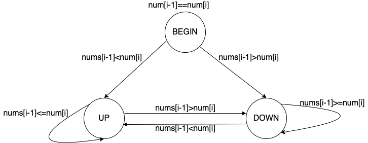

根据状态转换图，可以很容易的写出如下代码：
```java
    public int wiggleMaxLength(int[] nums) {
        if (nums == null || nums.length == 0) {
            return 0;
        }

        final int BEGIN = 0;
        final int UP = 1;
        final int DOWN = 2;

        int STATE = BEGIN;

        // 题目规定，当只有一个元素时，它也是一个摇摆序列
        int maxLen = 1;

        for (int i = 1; i < nums.length; i++) {
            switch (STATE) {
                case BEGIN:
                    // 循环的过程中，需要注意元素相等的情况
                    if (nums[i] > nums[i - 1]) {
                        STATE = UP;
                        maxLen++;
                    }
                    if (nums[i] < nums[i - 1]) {
                        STATE = DOWN;
                        maxLen++;
                    }
                    break;
                case UP:
                    if (nums[i] < nums[i - 1]) {
                        maxLen++;
                        STATE = DOWN;
                    }
                    break;
                case DOWN:
                    if (nums[i] > nums[i - 1]) {
                        maxLen++;
                        STATE = UP;
                    }
            }
        }
        return maxLen;
    }
```


## 动态规划

## 回溯

- https://www.ixigua.com/6803573365928886787?id=6803240880082780684&logTag=bd6b37b0f27a3c069acc

回溯问题，我的理解，简单来说，就是按照某种既定思路，不断向前试探，查看是否满足题干条件或者到达末尾，如果中途出现了不符合要求的情况，需要进行逐级回退然后继续试探。

### 子集问题


[最大的子集](https://leetcode.com/problems/subsets/)集合问题，是一个经典的集合问题，数组每一个元素都可以选择放或者不放，从而形成不同的子集。注意，空也是一个子集。

#### 递归求解

这个题，天然的适合使用递归来进行解决，下面展示一下解题过程的递归调用链，以求解[1,2,3]数组的解为例：

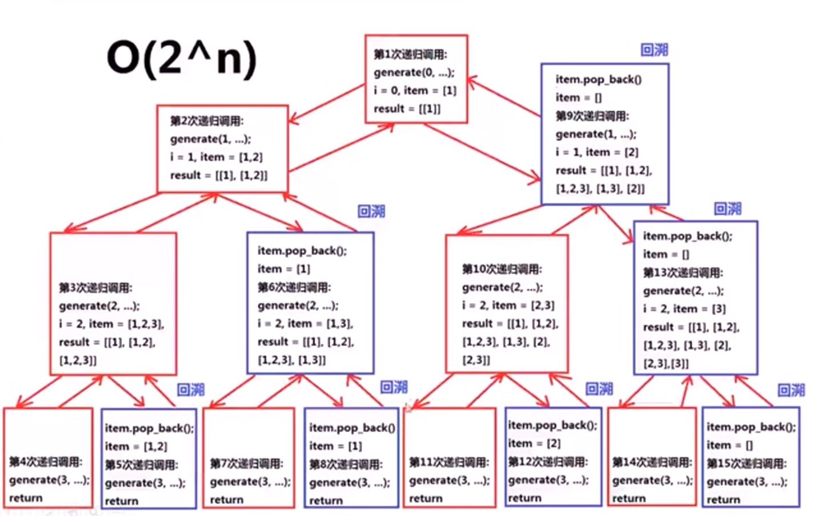

递归代码如下：
```java
    public List<List<Integer>> subsets(int[] nums) {
        List<List<Integer>> result = new LinkedList<>();

        List<Integer> item = new LinkedList<>();
        // 放入空子集
        result.add(item);
        // 递归回溯
        subset(0, nums, item, result);
        return result;
    }

    private void subset(int i, int[] nums, List<Integer> item, List<List<Integer>> result) {
        if (i >= nums.length) {
            return;
        }
        item.add(nums[i]);
        // 注意这里要新建一个对象放入result，不能直接放入item到result，也就是需要进行深拷贝
        result.add(new LinkedList<>(item));
        // 选择nums[i+1]
        subset(i + 1, nums, item, result);

        // 不选择nums[i+1]
        item.remove(item.size() - 1);
        subset(i + 1, nums, item, result);
    }
```

#### 位运算求解

使用上面的递归求解的时间复杂度是2^n，其实这个题还可以使用位运算来求解，如下图所示：

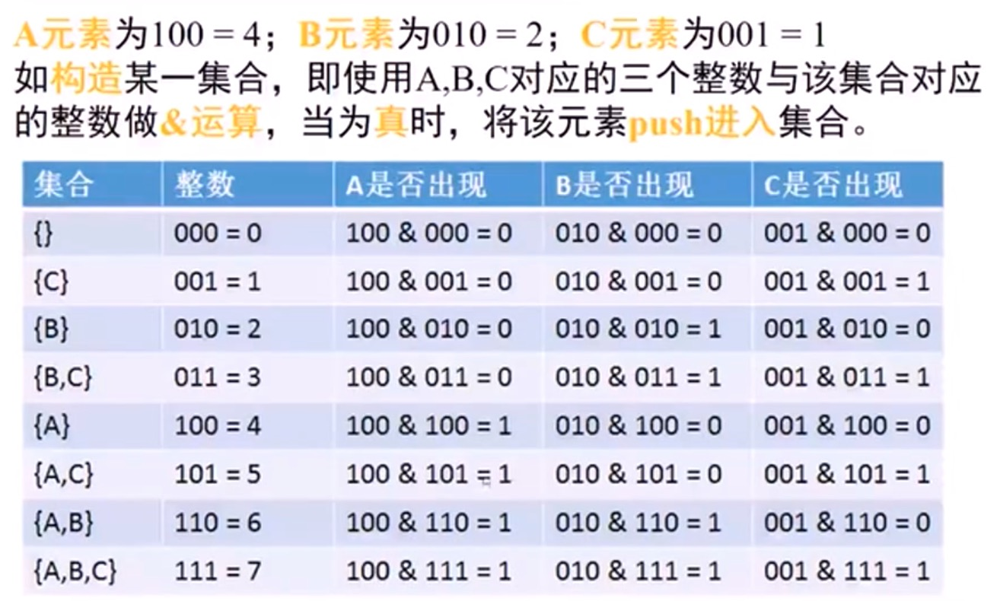

正如图上所展示的，所有的子集个数正好是2^num.len个，每一个元素能否出现，使用`位与`运算即可。

代码如下：
```java
    public List<List<Integer>> subsets2(int[] nums) {
        List<List<Integer>> result = new LinkedList<>();
        // 总共的子集的个数  1左移nums.length位
        // 之所以可以这么算，因为所有的子集个数可以这么算：nums的每一个元素都可以放或者不放，若用1表示放，0表示不放，其实就是二进制，也就是2^(nums.length)
        // 正好可以使用移位算法
        int total = 1 << nums.length;
        for (int i = 0; i < total; i++) {
            // 单个子集
            List<Integer> item = new LinkedList<>();
            for (int j = 0; j < nums.length; j++) {
                // 左移操作
                if ((i & (1 << j)) != 0) {
                    item.add(nums[j]);
                }
            }
            result.add(item);
        }
        return result;
    }
```


## 搜索

## 排序


## 合并两个有序链表

思路,将一个链表的元素逐个插入拷贝到另外一个链表.拷贝单个元素的过程中,需要记录上一次元素插入的pos位置,下一次插入元素从pos+1位置开始往后寻找正确的插入位置.
```java
package com.audi.algorithm;

import java.util.LinkedList;
import java.util.List;

public class MergeTwoList {

    // merge two list, both are sorted, lower to higher
    public static List merge(List<Integer> list1, List<Integer> list2) {
        if (list1 == null && list2 == null) {
            return null;
        }
        if (list1 == null) {
            return list2;
        }
        if (list2 == null) {
            return list1;
        }

        List newList = null;

        // choose the longer list as the destList
        if (list1.size() > list2.size()) {
            newList = list1;

            copy(list2, list1);
        } else {
            newList = list2;

            copy(list1, list2);
        }

        return newList;
    }

    private static void copy(List<Integer> src, List<Integer> dst) {
        int pos = 0;
        int temp = 0;

        for (int i = 0; i < src.size(); i++) {
            temp = src.get(i);
            for (int j = pos; j < dst.size(); j++) {
                // 下面这个if判断主要是为了解决在newList的头部插入元素的问题
                if (pos == 0 && temp < dst.get(0)) {
                    dst.add(0, temp);
                    pos = j + 1;
                    break;
                }

                if (temp >= dst.get(j) && temp < dst.get(j + 1)) {
                    // 稳定排序
                    pos = j + 1;
                    dst.add(pos, temp);
                    break;
                }
            }
        }

    }

    public static void main(String[] args) {
        List<Integer> list1 = new LinkedList<>();
        list1.add(1);
        list1.add(2);
        list1.add(5);
        list1.add(9);

        List<Integer> list2 = new LinkedList<>();
        list2.add(2);
        list2.add(7);
        list2.add(8);
        list2.add(8);
        list2.add(9);
        list2.add(19);

        System.out.println("before merge:");
        System.out.println(list1);
        System.out.println(list2);
        System.out.println();
        List newList = merge(list1, list2);
        System.out.println("after merge:");
        System.out.println(newList);

    }
}
```

代码输出结果:
```java
before merge:
[1, 2, 5, 9]
[2, 7, 8, 8, 9, 19]

after merge:
[1, 2, 2, 5, 7, 8, 8, 9, 9, 19]

Process finished with exit code 0
```

更一般的，考虑leetcode 21 的合并有序链表的题目。可以使用虚拟节点，来辅助实现链表的合并。源码如下：

```java
package com.audi.list;

import java.util.LinkedList;
import java.util.List;

/**
 * https://leetcode.com/problems/merge-two-sorted-lists/
 * <p>
 * 合并有序列表
 *
 * @author WangQuanzhou
 * @date 2020-02-23
 */
public class MergeList<E extends Comparable<E>> {

    public class ListNode {
        int val;
        ListNode next;

        ListNode(int x) {
            val = x;
        }
    }

    /**
     * 合并两个有序列表
     * <p>
     * 通过添加虚拟节点作为辅助
     *
     * @param l1
     * @param l2
     * @return
     */
    public ListNode mergeTwoLists(ListNode l1, ListNode l2) {

        if (null == l1) {
            return l2;
        }
        if (null == l2) {
            return l1;
        }

        ListNode dummyNode = new ListNode(0);
        ListNode cur = dummyNode;

        while (l1 != null && l2 != null) {
            if (l1.val > l2.val) {
                cur.next = l2;
                l2 = l2.next;
            } else {
                cur.next = l1;
                l1 = l1.next;
            }
            cur = cur.next;
        }

        if (l1 == null) {
            cur.next = l2;
        }
        if (l2 == null) {
            cur.next = l1;
        }

        return dummyNode.next;
    }

}
```


## 0-1背包问题

 
 https://www.cnblogs.com/xym4869/p/8513801.html
 
 参考上面的链接，重点是链接中的几张图，我贴在下面了：
 
 ![此处输入图片的描述][1]
 ![此处输入图片的描述][2]
 ![此处输入图片的描述][3]
 
 上面解释了递推公式的过程，以及原理。尤其注意图中的，当可以把第i个物品放入口袋的时候，那么也就是需要将之前的物品（不一定是之前的i-1个，因为还可能之前的某几个物品需要拿出来）放入容量为j-w(i)的背包中。
 
 此外，还需要注意的一点是：当背包装的物品的价值达到最大时，哪些物品被装入了，这个在上面的图中也有推倒。
 
 0-1背包问题的示例代码：
```java
 public int knapsack(int W, int N, int[] weights, int[] values) {
    int[][] dp = new int[N + 1][W + 1];
    for (int i = 1; i <= N; i++) {
        int w = weights[i - 1], v = values[i - 1];
        for (int j = 1; j <= W; j++) {
            if (j >= w) {
                dp[i][j] = Math.max(dp[i - 1][j], dp[i - 1][j - w] + v);
            } else {
                dp[i][j] = dp[i - 1][j];
            }
        }
    }
    return dp[N][W];
}
```
 
 

 

## 最长公共子串

 
 https://leetcode.com/problems/maximum-length-of-repeated-subarray/
 
 注意它的状态转移公式，且区别于最长公共子序列。
 

## 移除所有重复节点（递归实现）

 - LeetCode203：Remove Linked List Elements

这道题，题意很简单，就是移除队列中**所有**的重复元素。本质上可以使用递归实现。下图是一个递归的解题思路，使用递归时，要有递归的函数**宏观**的语义认识。


解题时，可以将头结点和剩余的其他节点看成两部分，假设剩余节点以及经过removeElements函数移除了重复节点，那么此时只需要考虑头结点释放需要移除即可。

下面是实现及测试代码：
 
```java
package com.audi.c203;

import org.omg.Messaging.SyncScopeHelper;

import java.util.List;
import java.util.Random;

/**
 * Remove Linked List Elements
 *
 * @author: WangQuanzhou
 * @date: 2020/1/11 16:31
 */
class Solution {
    public ListNode removeElements(ListNode head, int val) {
        if (head == null) {
            return null;
        }
        head.next = removeElements(head.next, val);
        return head.val == val ? head.next : head;
    }


    public static void main(String[] args) {
        ListNode head = new ListNode(1);
        ListNode tail = new ListNode(5);
        head.next = tail;
        for (int i = 1; i <= 5; i++) {
            tail.next = new ListNode(new Random().nextInt(10));
            tail = tail.next;
        }


        System.out.println("移除前：");
        tail = head;
        while (tail != null) {
            System.out.println(tail.val);
            tail = tail.next;
        }
        System.out.println();

        System.out.println("移除后：");
        Solution solution = new Solution();
        head = solution.removeElements(head, 5);
        tail = head;
        while (tail != null) {
            System.out.println(tail.val);
            tail = tail.next;
        }
        System.out.println();
    }
}
```

## 二叉搜索树

实现二叉搜索树的增删改查，首先约定本搜索树不允许重复元素的出现。首先是add方法：
```java
package com.audi.bst;


/**
 * 二分搜索树
 * <p>
 * 存储的元素E由于需要是可比较的，因此需要继承自Comparable接口
 *
 * @author: WangQuanzhou
 * @date: 2020/1/20 8:29
 */
public class BST<E extends Comparable<E>> {
    class Node {
        // 属性定义成public可以直接访问，不需要get方法
        public E e;
        public Node left, right;

        public Node(E e) {
            this.e = e;
            left = null;
            right = null;
        }
    }


    private Node root;

    private Integer size;

    public BST() {
        root = null;
        size = 0;
    }

    /**
     * 添加元素，返回已有元素个数
     *
     * @param e
     * @return
     */
    public Integer add(E e) {

        // 如果根节点为空
        if (null == root) {
            root = new Node(e);
            return size++;
        }

        add(root, e);

        return size;
    }

    /**
     * 二叉树释放为空
     *
     * @return
     */
    public Boolean isEmpty() {
        return size == 0;
    }

    /**
     * 二叉树的大小
     *
     * @return
     */
    public Integer size() {
        return size;
    }

    private void add(Node node, E e) {
        // 不允许添加重复元素
        if (e.equals(node.e)) {
            return;
        }
        // 如果添加位置左右子树为空
        if (e.compareTo(node.e) < 0 && node.left == null) {
            Node left = new Node(e);
            node.left = left;
            size++;
            return;
        }
        if (e.compareTo(node.e) > 0 && node.right == null) {
            Node right = new Node(e);
            node.right = right;
            size++;
            return;
        }


        // 如果添加位置左右子树不为空，递归调用add
        if (e.compareTo(node.e) < 0) {
            add(node.left, e);
        }
        if (e.compareTo(node.e) > 0) {
            add(node.right, e);
        }
    }

}
```

为了验证我们的add操作是正确的，我们实现以下二叉树的递归遍历，打印输出，看看结果是否正确(这里以中序遍历为例进行演示)：
```java
    /**
     * 中序遍历二叉树
     */
    public void inOrder() {
        inOrder(root);
    }

    private void inOrder(Node root) {
        if (null == root) {
            return;
        }
        inOrder(root.left);
        System.out.print(root.e + " ");
        inOrder(root.right);
    }

    public static void main(String[] args) {
        BST<Integer> bst = new BST<>();
        for (int i = 0; i < 8; i++) {
            int temp = new Random().nextInt(100);
            System.out.print(temp + " ");
            bst.add(temp);
        }
        System.out.println();
        bst.inOrder();
    }
```
测试代码输出：
```java
55 12 26 11 97 56 17 43 
11 12 17 26 43 55 56 97 
```
然后是递归前序遍历的代码：
```java
    /**
     * 前序遍历
     */
    public void preOrder() {
        preOrder(root);
    }

    private void preOrder(Node root) {
        if (null == root) {
            return;
        }
        System.out.print(root.e + " ");
        preOrder(root.left);
        preOrder(root.right);
    }

    public static void main(String[] args) {
        BST<Integer> bst = new BST<>();
        for (int i = 0; i < 8; i++) {
            int temp = new Random().nextInt(100);
            System.out.print(temp + " ");
            bst.add(temp);
        }
        System.out.println();
        bst.preOrder();
        System.out.println();
        bst.inOrder();
    }
```

输出结果如下，这里展示了前序遍历和中序遍历结果的对比：
```java
98 65 5 2 72 11 22 90 
98 65 5 2 11 22 72 90 
2 5 11 22 65 72 90 98 
```
类似的，后续遍历代码如下：
```java
    /**
     * 后序遍历
     */
    public void postOrder() {
        postOrder(root);
    }

    private void postOrder(Node root) {
        if (null == root) {
            return;
        }
        postOrder(root.left);
        postOrder(root.right);
        System.out.print(root.e + " ");
    }
```

然后是一个contains查询方法：
```java
    /**
     * 判断某个元素是否在二叉树中
     *
     * @param e
     * @return true-存在  false-不存在
     */
    public Boolean contains(E e) {
        return contains(root, e);
    }

    private Boolean contains(Node root, E e) {
        if (root == null) {
            return Boolean.FALSE;
        }
        if (root.e.compareTo(e) == 0) {
            return Boolean.TRUE;
        }
        return contains(root.left, e) || contains(root.right, e);
    }
```
或者参照下面的写法，充分利用二分搜索树的节点性质，加快查询的速度：
```java
    // 看二分搜索树中是否包含元素e
    public boolean contains(E e){
        return contains(root, e);
    }

    // 看以node为根的二分搜索树中是否包含元素e, 递归算法
    private boolean contains(Node node, E e){

        if(node == null)
            return false;

        if(e.compareTo(node.e) == 0)
            return true;
        else if(e.compareTo(node.e) < 0)
            return contains(node.left, e);
        else // e.compareTo(node.e) > 0
            return contains(node.right, e);
    }
```

有的时候，可能我们在做二叉树的查询的时候，层序遍历二叉树查询效率来的更快，因此下面我们实现二叉树的层序遍历.

二叉树的层序遍历，需要借助额外的数据结构来暂存遍历过程中的二叉树的临时节点，这里我们使用FIFO的队列来保存遍历节点的左右子节点信息，源码如下：
```java
    /**
     * 二叉树的层序遍历，借助FIFO的队列实现
     */
    public void levelOrder() {
        if (root == null) {
            return;
        }
        LinkedList<Node> list = new LinkedList<>();
        list.add(root);
        while (!list.isEmpty()) {
            Node head = list.poll();
            System.out.println(head.e);
            if (head.left != null) {
                list.add(head.left);
            }
            if (head.right != null) {
                list.add(head.right);
            }
        }
    }
```

下面是二叉树的节点删除操作，删除操作，相对复杂一些，因为涉及元素节点的移动。

当待删除节点没有左子树时，直接删除该节点，并使用右子树替换该节点位置。右子树为空时也是一样的情况。

唯一复杂一点的是，当待删除节点的左右子树都不为空时，那么该怎么办？使用Hibbard Deletion理论，使用待删除节点右子树的最小值替换待删除节点，示意图如下：


为了实现删除操作，我们需要实现删除最小节点，查找最小节点，以及真正的删除方法：
```java
    // 寻找二分搜索树的最小元素
    public E minimum(){
        if(size == 0)
            throw new IllegalArgumentException("BST is empty!");

        return minimum(root).e;
    }

    // 返回以node为根的二分搜索树的最小值所在的节点
    private Node minimum(Node node){
        if(node.left == null)
            return node;
        return minimum(node.left);
    }

    // 寻找二分搜索树的最大元素
    public E maximum(){
        if(size == 0)
            throw new IllegalArgumentException("BST is empty");

        return maximum(root).e;
    }

    // 返回以node为根的二分搜索树的最大值所在的节点
    private Node maximum(Node node){
        if(node.right == null)
            return node;

        return maximum(node.right);
    }

    // 从二分搜索树中删除最小值所在节点, 返回最小值
    public E removeMin(){
        E ret = minimum();
        root = removeMin(root);
        return ret;
    }

    // 删除掉以node为根的二分搜索树中的最小节点
    // 返回删除节点后新的二分搜索树的根
    private Node removeMin(Node node){

        if(node.left == null){
            Node rightNode = node.right;
            node.right = null;
            size --;
            return rightNode;
        }

        node.left = removeMin(node.left);
        return node;
    }

    // 从二分搜索树中删除最大值所在节点
    public E removeMax(){
        E ret = maximum();
        root = removeMax(root);
        return ret;
    }

    // 删除掉以node为根的二分搜索树中的最大节点
    // 返回删除节点后新的二分搜索树的根
    private Node removeMax(Node node){

        if(node.right == null){
            Node leftNode = node.left;
            node.left = null;
            size --;
            return leftNode;
        }

        node.right = removeMax(node.right);
        return node;
    }

    // 从二分搜索树中删除元素为e的节点
    public void remove(E e){
        root = remove(root, e);
    }

    // 删除掉以node为根的二分搜索树中值为e的节点, 递归算法
    // 返回删除节点后新的二分搜索树的根
    private Node remove(Node node, E e){

        if( node == null )
            return null;

        if( e.compareTo(node.e) < 0 ){
            node.left = remove(node.left , e);
            return node;
        }
        else if(e.compareTo(node.e) > 0 ){
            node.right = remove(node.right, e);
            return node;
        }
        else{   // e.compareTo(node.e) == 0

            // 待删除节点左子树为空的情况
            if(node.left == null){
                Node rightNode = node.right;
                node.right = null;
                size --;
                return rightNode;
            }

            // 待删除节点右子树为空的情况
            if(node.right == null){
                Node leftNode = node.left;
                node.left = null;
                size --;
                return leftNode;
            }

            // 待删除节点左右子树均不为空的情况

            // 找到比待删除节点大的最小节点, 即待删除节点右子树的最小节点
            // 用这个节点顶替待删除节点的位置
            Node successor = minimum(node.right);
            successor.right = removeMin(node.right);
            successor.left = node.left;

            node.left = node.right = null;

            return successor;
        }
    }
```

需要注意的是，由于删除操作可能会影响root节点（比如删除root节点），所以需要在remove方法返回最新的root节点。


## 堆

堆分为最大堆和最小堆，其实他们很类似，只是父节点与子节点的大小关系的比较不一致而已。我们以最大堆为例。

https://www.jianshu.com/p/21bef3fc3030

最大堆有如下一些特性：

 - 它是一颗完全二叉树
 - 父结点的data域值都不小于（大于）其子结点的data域值

什么是完全二叉树？

假设二叉树有h层，那么h-1层及以上都是满二叉树。且第h层（叶子节点）节点均靠左分布。如下图所示：


这里，我们底层使用数组来存储堆中的元素。且由于其是满二叉树，因此其父子节点的index具有如下性质：

假设父节点位置为index，那么左子节点的left_index=index*2+1，右子节点的right_idex=index*2+2。

这里数组我们使用java提供的ArrayList来实现。

首先是建堆的过程，注意我们建堆的逻辑都是将新元素添加到数组的末尾，然后进行上浮（siftUp）操作直至满足最大堆的性质，代码如下：

```java
package com.audi.heap;

import java.util.ArrayList;

/**
 * 最大堆
 *
 * @param <E>
 */
public class MaxHeap<E extends Comparable<E>> {

    private ArrayList<E> data;

    public MaxHeap(int capacity) {
        data = new ArrayList<>(capacity);
    }

    public MaxHeap() {
        data = new ArrayList<>();
    }

    // 返回堆中的元素个数
    public int size() {
        return data.size();
    }

    // 返回一个布尔值, 表示堆中是否为空
    public boolean isEmpty() {
        return data.isEmpty();
    }

    // 返回完全二叉树的数组表示中，一个索引所表示的元素的父亲节点的索引
    private int parent(int index) {
        if (index == 0)
            throw new IllegalArgumentException("index-0 doesn't have parent.");
        return (index - 1) / 2;
    }

    // 返回完全二叉树的数组表示中，一个索引所表示的元素的左孩子节点的索引
    private int leftChild(int index) {
        return index * 2 + 1;
    }

    // 返回完全二叉树的数组表示中，一个索引所表示的元素的右孩子节点的索引
    private int rightChild(int index) {
        return index * 2 + 2;
    }

    // 向堆中添加元素
    public void add(E e) {
        data.add(e);
        siftUp(data.size() - 1);
    }

    private void siftUp(int k) {

        while (k > 0 && data.get(parent(k)).compareTo(data.get(k)) < 0) {
            swap(data, k, parent(k));
            k = parent(k);
        }
    }

    /**
     * 交换data数组的i j位置的元素
     *
     * @param data
     * @param i
     * @param j
     */
    private void swap(ArrayList<E> data, int i, int j) {
        if (i > data.size() - 1 || j > data.size() - 1) {
            return;
        }
        E temp = data.get(i);
        data.set(i, data.get(j));
        data.set(j, temp);
    }
}
```

然后实现寻找堆中最大元素，以及取出堆中最大元素的过程。

最大元素，根据最大堆的性质其实就是取堆顶的元素，也就是数组的首个元素。

取出该最大元素稍微有点麻烦，因为涉及到元素的调整。这里采取的措施是，删除数组头元素，将数组最后一个元素放到数组头部，然后进行siftDown操作，直至满足最大堆的性质。

```java
    // 看堆中的最大元素
    public E findMax() {
        if (data.size() == 0)
            throw new IllegalArgumentException("Can not findMax when heap is empty.");
        return data.get(0);
    }

    // 取出堆中最大元素
    public E extractMax() {

        E ret = findMax();

        swap(data, 0, data.size() - 1);
        data.remove(data.size() - 1);
        siftDown(0);

        return ret;
    }

    private void siftDown(int k) {

        while (leftChild(k) < data.size()) {
            int j = leftChild(k); // 在此轮循环中,data[k]和data[j]交换位置
            // 选出左右子树种中较大的元素
            if (j + 1 < data.size() &&
                    data.get(j + 1).compareTo(data.get(j)) > 0)
                j++;

            // data[j] 是 leftChild 和 rightChild 中的最大值
            if (data.get(k).compareTo(data.get(j)) >= 0)
                break;

            swap(data, k, j);
            k = j;
        }
    }
```

然后是一个replace函数：
```java
    // 取出堆中的最大元素，并且替换成元素e
    public E replace(E e){

        E ret = findMax();
        data.set(0, e);
        siftDown(0);
        return ret;
    }
```

堆一般适合于求解最大K个元素：

347. Top K Frequent Elements

该题首先使用map统计各个元素出现的次数，然后使用size为k的最大堆将map的元素入堆，最后将堆中元素全部取出，即是top k的元素。
```java
    private class Freq implements Comparable<Freq> {

        public int e, freq;

        public Freq(int e, int freq) {
            this.e = e;
            this.freq = freq;
        }

        @Override
        public int compareTo(Freq another) {
            if (this.freq < another.freq)
                return 1;
            else if (this.freq > another.freq)
                return -1;
            else
                return 0;
        }
    }

    public List<Integer> topKFrequent(int[] nums, int k) {

        TreeMap<Integer, Integer> map = new TreeMap<>();
        for (int num : nums) {
            if (map.containsKey(num))
                map.put(num, map.get(num) + 1);
            else
                map.put(num, 1);
        }

        MaxHeap<Freq> maxHeap = new MaxHeap<>();
        for (int key : map.keySet()) {
            if (maxHeap.size() < k)
                maxHeap.add(new Freq(key, map.get(key)));
            else if (map.get(key) > maxHeap.findMax().freq) {
                maxHeap.extractMax();
                maxHeap.add(new Freq(key, map.get(key)));
            }
        }

        List<Integer> res = new LinkedList<>();
        while (!maxHeap.isEmpty())
            res.add(maxHeap.extractMax().e);
        return res;
    }
```

如果将上面的TreeMap换成HashMap，那么将大大加快算法的速度，约比上面的代码提升3-4倍的速度。
```java
    private class Freq implements Comparable<Freq> {

        public int e, freq;

        public Freq(int e, int freq) {
            this.e = e;
            this.freq = freq;
        }

        @Override
        public int compareTo(Freq another) {
            if (this.freq < another.freq)
                return 1;
            else if (this.freq > another.freq)
                return -1;
            else
                return 0;
        }
    }

    public List<Integer> topKFrequent(int[] nums, int k) {

        Map<Integer, Integer> map = new HashMap<>(nums.length);
        for (int num : nums) {
            if (map.containsKey(num))
                map.put(num, map.get(num) + 1);
            else
                map.put(num, 1);
        }

        MaxHeap<Freq> maxHeap = new MaxHeap<>();
        for (int key : map.keySet()) {
            if (maxHeap.size() < k)
                maxHeap.add(new Freq(key, map.get(key)));
            else if (map.get(key) > maxHeap.findMax().freq) {
                maxHeap.extractMax();
                maxHeap.add(new Freq(key, map.get(key)));
            }
        }

        List<Integer> res = new LinkedList<>();
        while (!maxHeap.isEmpty())
            res.add(maxHeap.extractMax().e);
        return res;
    }
```

当然对于这种top k的问题也可以使用大小为k数组实现。思路大致是，创建一个数组，当数组大小小于k的时候往内部添加元素，并进行排序。当数组大小达到k的时候，后续元素是否放入数组需要将该元素的频次与数组最小频次比较，大于的话，就替换数组首元素。

但是这种方式并不比上面的最大堆的算法快，原因在于太多次的排序过程。

```java
package com.audi.heap;

import java.util.*;
import java.util.stream.Collectors;

//347. Top K Frequent Elements
public class Solution {

    private class Freq implements Comparable<Freq> {

        public int e, freq;

        public Freq(int e, int freq) {
            this.e = e;
            this.freq = freq;
        }

        @Override
        public int compareTo(Freq another) {
            if (this.freq < another.freq)
                return 1;
            else if (this.freq > another.freq)
                return -1;
            else
                return 0;
        }
    }

    public List<Integer> topKFrequent(int[] nums, int k) {

        Map<Integer, Integer> map = new HashMap<>(nums.length);
        for (int num : nums) {
            if (map.containsKey(num))
                map.put(num, map.get(num) + 1);
            else
                map.put(num, 1);
        }

        List<Freq> list = new LinkedList<>();
        for (int key : map.keySet()) {
            if (list.size() < k) {
                list.add(new Freq(key, map.get(key)));
                list = list.stream().sorted(Comparator.comparing(item -> item.freq)).collect(Collectors.toList());
            } else {
                if (map.get(key) <= list.get(0).freq) {
                    continue;
                }
                list.set(0, new Freq(key, map.get(key)));
                list = list.stream().sorted(Comparator.comparing(item -> item.freq)).collect(Collectors.toList());
            }
        }
        return list.stream().map(freq -> freq.e).collect(Collectors.toList());
    }

    public static void main(String[] args) {
        Solution solution = new Solution();
        int[] nums = {5, 2, 5, 3, 5, 3, 1, 1, 3};
        System.out.println(solution.topKFrequent(nums, 2));
    }
}
```

## Trie
- https://blog.csdn.net/johnny901114/article/details/80711441

Trie，字典树，结构如下图所示，当然节点可以存储任意字符，不一定是字母。注意，Trie的根节点其实是空的，没有存储实质的数据。


下面是往trie添加元素的过程。
```java
package com.audi.trie;

import java.util.TreeMap;

public class Trie {

    private class Node{

        /**
         * 当前节点是否是完整的单词
         */
        public boolean isWord;

        /**
         * 当前节点的后继节点，因为不确定后继节点个数，这里使用map存储
         */
        public TreeMap<Character, Node> next;

        public Node(boolean isWord){
            this.isWord = isWord;
            next = new TreeMap<>();
        }

        public Node(){
            this(false);
        }
    }

    private Node root;
    private int size;

    public Trie(){
        root = new Node();
        size = 0;
    }

    // 获得Trie中存储的单词数量
    public int getSize(){
        return size;
    }

    // 向Trie中添加一个新的单词word
    public void add(String word){

        Node cur = root;
        for(int i = 0 ; i < word.length() ; i ++){
            char c = word.charAt(i);
            if(cur.next.get(c) == null)
                cur.next.put(c, new Node());
            cur = cur.next.get(c);
        }

        // 避免重复标记单词，首先判断一下当前位置是否已是一个完整的单词
        if(!cur.isWord){
            cur.isWord = true;
            size ++;
        }
    }
}
```

trie的搜索，实就是查询某个字符串是否在trie中存在。查询思路是：不断遍历字符串的每个字符，如果便利到了字符串的末尾，再判断当前位置是否是字符串（isWord=true）。源码如下：
```java
    // 查询单词word是否在Trie中
    public boolean contains(String word){

        Node cur = root;
        for(int i = 0 ; i < word.length() ; i ++){
            char c = word.charAt(i);
            if(cur.next.get(c) == null)
                return false;
            cur = cur.next.get(c);
        }
        return cur.isWord;
    }
```

上面是查询完整的字符串，还有一种就是查询前缀字符串。即，只要包含前缀字符串就行，不要求是个完整的字符串。其实这个查找过程和上面很类似，源码如下：
```java
    // 查询是否在Trie中有单词以prefix为前缀
    public boolean isPrefix(String prefix){

        Node cur = root;
        for(int i = 0 ; i < prefix.length() ; i ++){
            char c = prefix.charAt(i);
            if(cur.next.get(c) == null)
                return false;
            cur = cur.next.get(c);
        }

        return true;
    }
```

前缀搜索，可以应用于leetcode208。其实和上面的trie很相似，只是方法的名称变了一下。源码如下：

```java
package com.audi.trie;

import java.util.TreeMap;

/**
 * Trie
 * <p>
 * https://leetcode.com/problems/implement-trie-prefix-tree/
 *
 * @author WangQuanzhou
 * @date 2020-02-15
 */
public class Trie208 {

    private class Node {

        /**
         * 当前节点是否是完整的单词
         */
        public boolean isWord;

        /**
         * 当前节点的后继节点，因为不确定后继节点个数，这里使用map存储
         */
        public TreeMap<Character, Node> next;

        public Node(boolean isWord) {
            this.isWord = isWord;
            next = new TreeMap<>();
        }

        public Node() {
            this(false);
        }
    }

    private Node root;
    private int size;

    public Trie208() {
        root = new Node();
        size = 0;
    }

    // 获得Trie中存储的单词数量
    public int getSize() {
        return size;
    }

    // 向Trie中添加一个新的单词word
    public void insert(String word) {

        Node cur = root;
        for (int i = 0; i < word.length(); i++) {
            char c = word.charAt(i);
            if (cur.next.get(c) == null)
                cur.next.put(c, new Node());
            cur = cur.next.get(c);
        }

        // 避免重复标记单词，首先判断一下当前位置是否已是一个完整的单词
        if (!cur.isWord) {
            cur.isWord = true;
            size++;
        }
    }

    // 查询单词word是否在Trie中
    public boolean search(String word) {

        Trie208.Node cur = root;
        for (int i = 0; i < word.length(); i++) {
            char c = word.charAt(i);
            if (cur.next.get(c) == null)
                return false;
            cur = cur.next.get(c);
        }
        return cur.isWord;
    }

    // 查询是否在Trie中有单词以prefix为前缀
    public boolean startsWith(String prefix) {

        Trie208.Node cur = root;
        for (int i = 0; i < prefix.length(); i++) {
            char c = prefix.charAt(i);
            if (cur.next.get(c) == null)
                return false;
            cur = cur.next.get(c);
        }

        return true;
    }
}
```


此外leetCode211号问题，也可以使用Trie解决，不过有点区别的是查询过程，211号问题是支持正则匹配的。

```java
package com.audi.trie;/// Leetcode 211. Add and Search Word - Data structure design
/// https://leetcode.com/problems/add-and-search-word-data-structure-design/description/

import java.util.TreeMap;

public class WordDictionary {

    private class Node {

        public boolean isWord;
        public TreeMap<Character, Node> next;

        public Node(boolean isWord) {
            this.isWord = isWord;
            next = new TreeMap<>();
        }

        public Node() {
            this(false);
        }
    }

    private Node root;

    /**
     * Initialize your data structure here.
     */
    public WordDictionary() {
        root = new Node();
    }

    /**
     * Adds a word into the data structure.
     */
    public void addWord(String word) {

        Node cur = root;
        for (int i = 0; i < word.length(); i++) {
            char c = word.charAt(i);
            if (cur.next.get(c) == null)
                cur.next.put(c, new Node());
            cur = cur.next.get(c);
        }
        cur.isWord = true;
    }

    /**
     * Returns if the word is in the data structure. A word could contain the dot character '.' to represent any one letter.
     */
    public boolean search(String word) {
        return match(root, word, 0);
    }

    /**
     * 地柜调用match
     *
     * @param node
     * @param word
     * @param index
     * @return
     */
    private boolean match(Node node, String word, int index) {

        if (index == word.length())
            return node.isWord;

        char c = word.charAt(index);

        if (c != '.') {
            if (node.next.get(c) == null)
                return false;
            return match(node.next.get(c), word, index + 1);
        } else {
            for (char nextChar : node.next.keySet())
                if (match(node.next.get(nextChar), word, index + 1))
                    return true;
            return false;
        }
    }
}
```

## AVL-Tree

https://blog.csdn.net/qq_25343557/article/details/89110319

AVL（G. M. Adelson-Velsky和E. M. Landis名字的缩写）树主要是为了解决二分搜索树（BST）的不平衡性带来的弊端，提高树结构的遍历查询效率。

AVL提高效率的关键就是在添加元素的过程中，通过不断“旋转”树的左右分支，从而保证树结构始终是平衡二叉树。

平衡二叉树：对于树的任意节点，其左右子树的高度差不能超过1.下图展示的就是一颗平衡二叉树。


为了维护二叉树的平衡性，我们需要借助平衡因子的概念。所谓平衡因子，其实就是左右节点的高度值（图中的黑色数字，叶子节点为第1层）之差。对于一颗平衡二叉树，任意节点的平衡因子都是-1，0，1中的一个，否则就不是平衡二叉树。平衡因子的简要计算如下图中蓝色数字所示：


借助之前BST的实现，我们稍加修改即可变成AVL树，修改的操作我们称为`旋转`。旋转可以分为四种情况来进行讨论：

### LL

这里用【玩转数据结构 从入门到进阶】这门课里的一张图来解释。这个解释的非常形象。

其中，T1-T4为普通的子树，且可以为空。

当向BST中添加一个节点以后，使得以y为根节点的BST不再满足AVL的性质。我们需要做如下图的`旋转`操作。

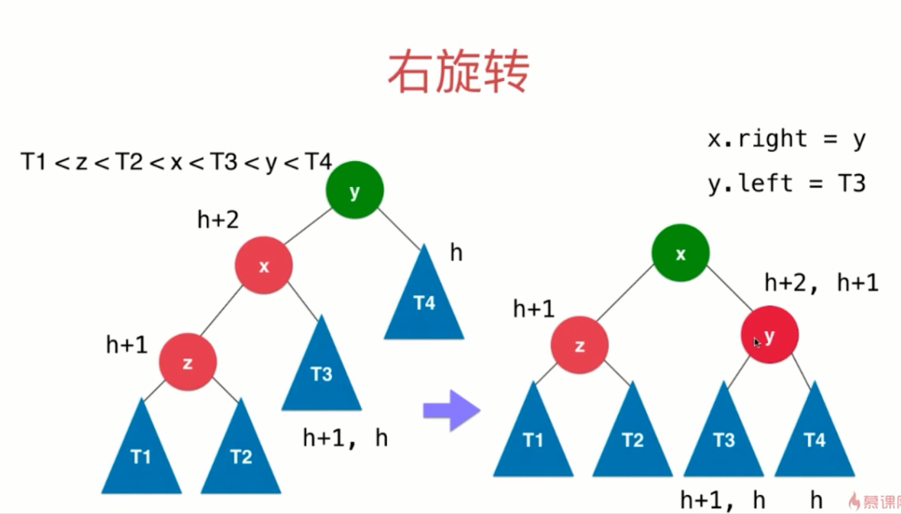

很显然，`旋转`操作以后，BST的性质是依然满足的。

下面我们讨论一下，`旋转`以后，这棵树是否满足AVL的性质。

首先需要注意一点，在添加节点后，`未旋转`前，只有y节点的左右子树不满足AVL，其他的子树还是满足的，也就是图中以Z、X节点为根的子树。

现在，假设以Z为根的子树T1、T2的最大高度为h，那么Z的高度应该为h+1.

相应的，因为以X为根节点的子树是满足AVL性质的，Z的高度是h+1，那么T3的高度要么为h+1，要么为h（这里注意下，为什么T3的高度不能为h+2呢？因为我们讨论的这种情况是，添加的新节点被添加到了树的最左边，也就意味着，整体而言，树的左子树的高度肯定是大于右子树的。所以这里不能为h+2）。

X节点的高度为h+2。

由于y节点不满足AVL的性质，且只是因为添加了一个节点导致的，因为这里平衡因子只能是2，也就是说T4的高度是h。

完成上面的推算以后，我们把上面得到的高度值，移动到图的右侧中，就可以得出`旋转`以后的y节点的高度要么为h+2，要么为h+1。又因为Z的高度是h+1，所以`旋转`以后X节点的平衡因子最大为1，满足AVL的性质。

这就是RR的推导过程。

注意，上面讨论的都是添加元素，其实这个推导过程对于删除元素同样是适用的。

### RR

上面讨论了LL的情况，RR的情况和上面很类似，只是换了个方向而已。

旋转的示意图如下，证明的过程和上面类似，这里就不再赘述，关键信息已经标注在图中。

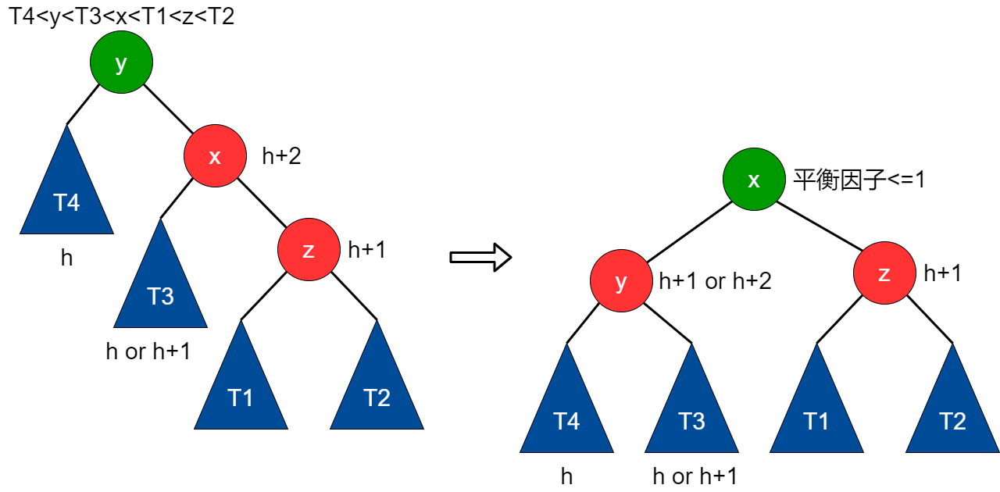

### LR

上面讨论的情况，新节点插入的位置，要么是在树的最左边，要么是在树的最右边。这里讨论一种特殊情况：


如下图所示，如果要添加的新节点位于根节点的左子树的右侧，那么我们可以很容易的将其转换为LL的情况，然后再旋转：

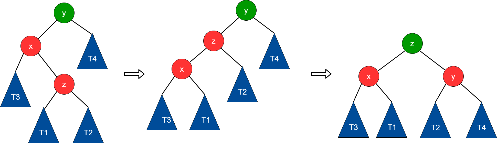


### RL

RL的情况，与上面LR的情况正好相反，新添加的节点位于根节点的右子树的左侧，一样我们可以转换为RR的情况，在进行旋转处理即可：

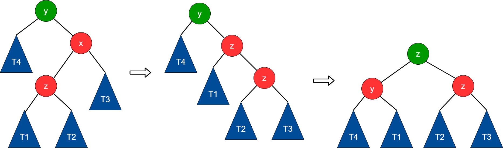


### 旋转维护时机

什么时候进行旋转？

首先，我们需要明确，对于一颗空树，它是满足AVL性质的，只有随着元素的添加or删除【删除前是满足AVL的】，因此我们只需要在树的add、remove操作中判断是否需要旋转即可。

完整的AVL树代码如下：
```java
import java.util.ArrayList;

public class AVLTree<K extends Comparable<K>, V> {

    private class Node{
        public K key;
        public V value;
        public Node left, right;
        public int height;

        public Node(K key, V value){
            this.key = key;
            this.value = value;
            left = null;
            right = null;
            height = 1;
        }
    }

    private Node root;
    private int size;

    public AVLTree(){
        root = null;
        size = 0;
    }

    public int getSize(){
        return size;
    }

    public boolean isEmpty(){
        return size == 0;
    }

    // 判断该二叉树是否是一棵二分搜索树
    public boolean isBST(){

        ArrayList<K> keys = new ArrayList<>();
        inOrder(root, keys);
        for(int i = 1 ; i < keys.size() ; i ++)
            if(keys.get(i - 1).compareTo(keys.get(i)) > 0)
                return false;
        return true;
    }

    private void inOrder(Node node, ArrayList<K> keys){

        if(node == null)
            return;

        inOrder(node.left, keys);
        keys.add(node.key);
        inOrder(node.right, keys);
    }

    // 判断该二叉树是否是一棵平衡二叉树
    public boolean isBalanced(){
        return isBalanced(root);
    }

    // 判断以Node为根的二叉树是否是一棵平衡二叉树，递归算法
    private boolean isBalanced(Node node){

        if(node == null)
            return true;

        int balanceFactor = getBalanceFactor(node);
        if(Math.abs(balanceFactor) > 1)
            return false;
        return isBalanced(node.left) && isBalanced(node.right);
    }

    // 获得节点node的高度
    private int getHeight(Node node){
        if(node == null)
            return 0;
        return node.height;
    }

    // 获得节点node的平衡因子
    private int getBalanceFactor(Node node){
        if(node == null)
            return 0;
        return getHeight(node.left) - getHeight(node.right);
    }

    // 对节点y进行向右旋转操作，返回旋转后新的根节点x
    //        y                              x
    //       / \                           /   \
    //      x   T4     向右旋转 (y)        z     y
    //     / \       - - - - - - - ->    / \   / \
    //    z   T3                       T1  T2 T3 T4
    //   / \
    // T1   T2
    private Node rightRotate(Node y) {
        Node x = y.left;
        Node T3 = x.right;

        // 向右旋转过程
        x.right = y;
        y.left = T3;

        // 更新height
        y.height = Math.max(getHeight(y.left), getHeight(y.right)) + 1;
        x.height = Math.max(getHeight(x.left), getHeight(x.right)) + 1;

        return x;
    }

    // 对节点y进行向左旋转操作，返回旋转后新的根节点x
    //    y                             x
    //  /  \                          /   \
    // T1   x      向左旋转 (y)       y     z
    //     / \   - - - - - - - ->   / \   / \
    //   T2  z                     T1 T2 T3 T4
    //      / \
    //     T3 T4
    private Node leftRotate(Node y) {
        Node x = y.right;
        Node T2 = x.left;

        // 向左旋转过程
        x.left = y;
        y.right = T2;

        // 更新height
        y.height = Math.max(getHeight(y.left), getHeight(y.right)) + 1;
        x.height = Math.max(getHeight(x.left), getHeight(x.right)) + 1;

        return x;
    }

    // 向二分搜索树中添加新的元素(key, value)
    public void add(K key, V value){
        root = add(root, key, value);
    }

    // 向以node为根的二分搜索树中插入元素(key, value)，递归算法
    // 返回插入新节点后二分搜索树的根
    private Node add(Node node, K key, V value){

        if(node == null){
            size ++;
            return new Node(key, value);
        }

        if(key.compareTo(node.key) < 0)
            node.left = add(node.left, key, value);
        else if(key.compareTo(node.key) > 0)
            node.right = add(node.right, key, value);
        else // key.compareTo(node.key) == 0
            node.value = value;

        // 更新height
        node.height = 1 + Math.max(getHeight(node.left), getHeight(node.right));

        // 计算平衡因子
        int balanceFactor = getBalanceFactor(node);

        // 平衡维护
        // LL
        if (balanceFactor > 1 && getBalanceFactor(node.left) >= 0)
            return rightRotate(node);

        // RR
        if (balanceFactor < -1 && getBalanceFactor(node.right) <= 0)
            return leftRotate(node);

        // LR
        if (balanceFactor > 1 && getBalanceFactor(node.left) < 0) {
            node.left = leftRotate(node.left);
            return rightRotate(node);
        }

        // RL
        if (balanceFactor < -1 && getBalanceFactor(node.right) > 0) {
            node.right = rightRotate(node.right);
            return leftRotate(node);
        }

        return node;
    }

    // 返回以node为根节点的二分搜索树中，key所在的节点
    private Node getNode(Node node, K key){

        if(node == null)
            return null;

        if(key.equals(node.key))
            return node;
        else if(key.compareTo(node.key) < 0)
            return getNode(node.left, key);
        else // if(key.compareTo(node.key) > 0)
            return getNode(node.right, key);
    }

    public boolean contains(K key){
        return getNode(root, key) != null;
    }

    public V get(K key){

        Node node = getNode(root, key);
        return node == null ? null : node.value;
    }

    public void set(K key, V newValue){
        Node node = getNode(root, key);
        if(node == null)
            throw new IllegalArgumentException(key + " doesn't exist!");

        node.value = newValue;
    }

    // 返回以node为根的二分搜索树的最小值所在的节点
    private Node minimum(Node node){
        if(node.left == null)
            return node;
        return minimum(node.left);
    }

    // 从二分搜索树中删除键为key的节点
    public V remove(K key){

        Node node = getNode(root, key);
        if(node != null){
            root = remove(root, key);
            return node.value;
        }
        return null;
    }

    private Node remove(Node node, K key){

        if( node == null )
            return null;

        Node retNode;
        if( key.compareTo(node.key) < 0 ){
            node.left = remove(node.left , key);
            // return node;
            retNode = node;
        }
        else if(key.compareTo(node.key) > 0 ){
            node.right = remove(node.right, key);
            // return node;
            retNode = node;
        }
        else{   // key.compareTo(node.key) == 0

            // 待删除节点左子树为空的情况
            if(node.left == null){
                Node rightNode = node.right;
                node.right = null;
                size --;
                // return rightNode;
                retNode = rightNode;
            }

            // 待删除节点右子树为空的情况
            else if(node.right == null){
                Node leftNode = node.left;
                node.left = null;
                size --;
                // return leftNode;
                retNode = leftNode;
            }

            // 待删除节点左右子树均不为空的情况
            else{
                // 找到比待删除节点大的最小节点, 即待删除节点右子树的最小节点
                // 用这个节点顶替待删除节点的位置
                Node successor = minimum(node.right);
                //successor.right = removeMin(node.right);
                successor.right = remove(node.right, successor.key);
                successor.left = node.left;

                node.left = node.right = null;

                // return successor;
                retNode = successor;
            }
        }

        if(retNode == null)
            return null;

        // 更新height
        retNode.height = 1 + Math.max(getHeight(retNode.left), getHeight(retNode.right));

        // 计算平衡因子
        int balanceFactor = getBalanceFactor(retNode);

        // 平衡维护
        // LL
        if (balanceFactor > 1 && getBalanceFactor(retNode.left) >= 0)
            return rightRotate(retNode);

        // RR
        if (balanceFactor < -1 && getBalanceFactor(retNode.right) <= 0)
            return leftRotate(retNode);

        // LR
        if (balanceFactor > 1 && getBalanceFactor(retNode.left) < 0) {
            retNode.left = leftRotate(retNode.left);
            return rightRotate(retNode);
        }

        // RL
        if (balanceFactor < -1 && getBalanceFactor(retNode.right) > 0) {
            retNode.right = rightRotate(retNode.right);
            return leftRotate(retNode);
        }

        return retNode;
    }

    public static void main(String[] args){

        System.out.println("Pride and Prejudice");

        ArrayList<String> words = new ArrayList<>();
        if(FileOperation.readFile("pride-and-prejudice.txt", words)) {
            System.out.println("Total words: " + words.size());

            AVLTree<String, Integer> map = new AVLTree<>();
            for (String word : words) {
                if (map.contains(word))
                    map.set(word, map.get(word) + 1);
                else
                    map.add(word, 1);
            }

            System.out.println("Total different words: " + map.getSize());
            System.out.println("Frequency of PRIDE: " + map.get("pride"));
            System.out.println("Frequency of PREJUDICE: " + map.get("prejudice"));

            System.out.println("is BST : " + map.isBST());
            System.out.println("is Balanced : " + map.isBalanced());

            for(String word: words){
                map.remove(word);
                if(!map.isBST() || !map.isBalanced())
                    throw new RuntimeException();
            }
        }

        System.out.println();
    }
}
```
main函数中，将一本英文文献依次存入AVL树中，插入完成以后判断了是否满足AVL的性质，然后进行了移除操作，移除的每一步都进行了是否满足BST、AVL性质的判断。

## 红黑树

在讲红黑树之前，我们先讲一下2-3树。

### 2-3树

所谓2-3树，它也是满足BST的性质的，只是除此之外，它还有一些特性（自己总结的，不一定准确，但是大体就是这么个意思）：

- 每个节点可以存储1个或者2个元素，相应的这个节点可以是二叉、三叉树
- 新插入的元素永远不会成为新的节点，而是和已有的叶子节点进行融合（这一点后续可以看插入元素的推导过程，就很容易明白）
- 2-3树是一颗绝对平衡的二叉树，也就是从根节点到每个叶子节点所经过的层数都是一样的

下面我们手推一下2-3树从0开始的一个创建过程：

假设现在有100、50、77、99、101、88、1、9这么多元素需要插入一个空的2-3树。

过程如下（纸笔推演）：

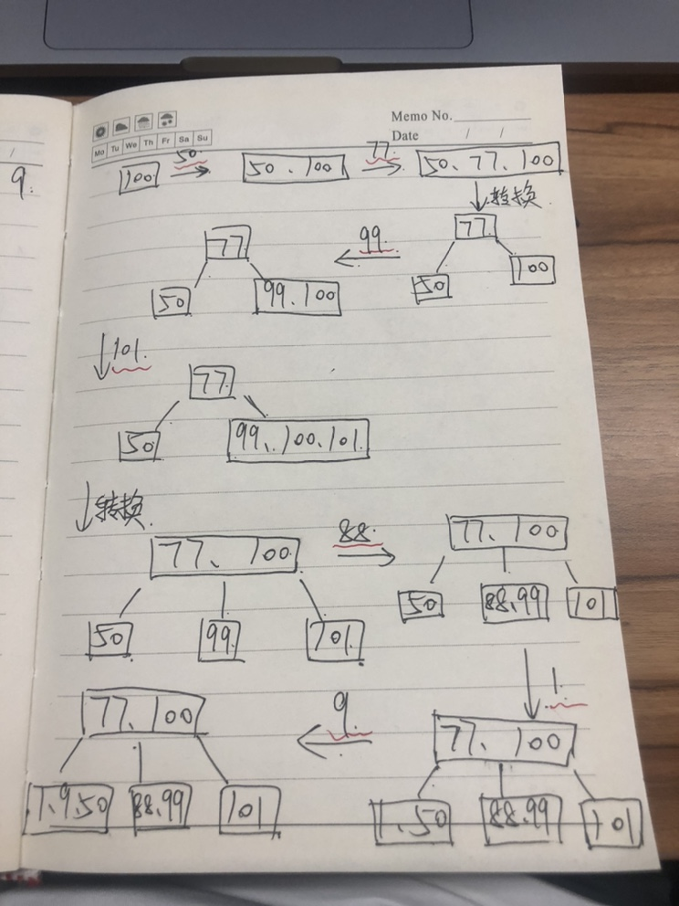
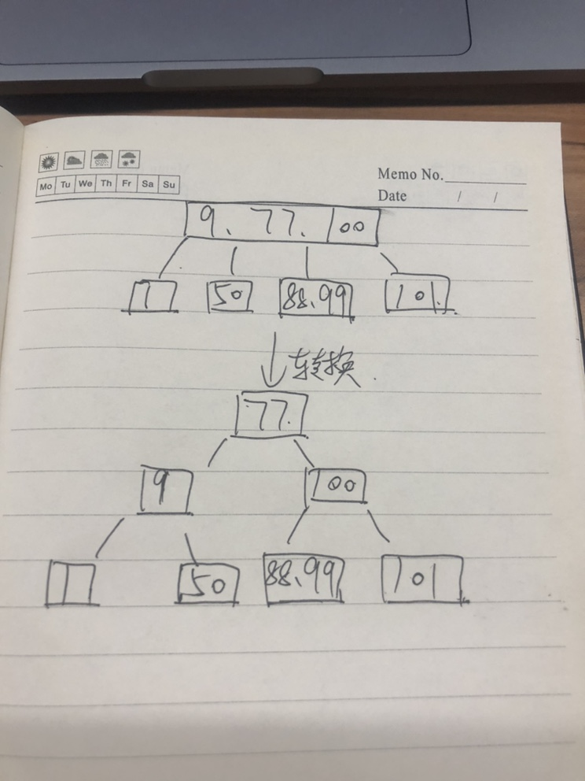

上面两张图，完整的展示了数据的插入以及插入过程中2-3为了满足相应性质所作出的调整。

从图中，我们也很容易看出2-3树的每个节点，要么没有子节点，要么左右子节点均不为空。或者从更加宏观的角度来说，每个节点都必须有左右子节点（只不过对于叶子节点，其左右子节点为空）。

看过了2-3的插入推导过程，要理解红黑树就容易的多。

### 2-3树与红黑树

不太严谨的说，2-3树在某种意义上，与红黑树是等价的。因为我们可以将2-3树经过一定的转换（标记颜色），变成红黑树。

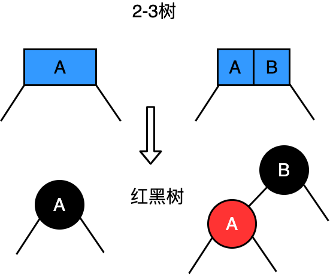

对于某个节点，上图展示了从2-3树到红黑的颜色标记过程。红色节点本质上来说，是与其相连的黑色节点平级的，但是由于红黑树每个节点只允许存储一个元素，因此我们做了颜色的标记。并且，红黑树中所有的红色节点都是向左倾斜的。

更为具体的，对于一颗完整的2-3树转换为红黑树，如下图所示：

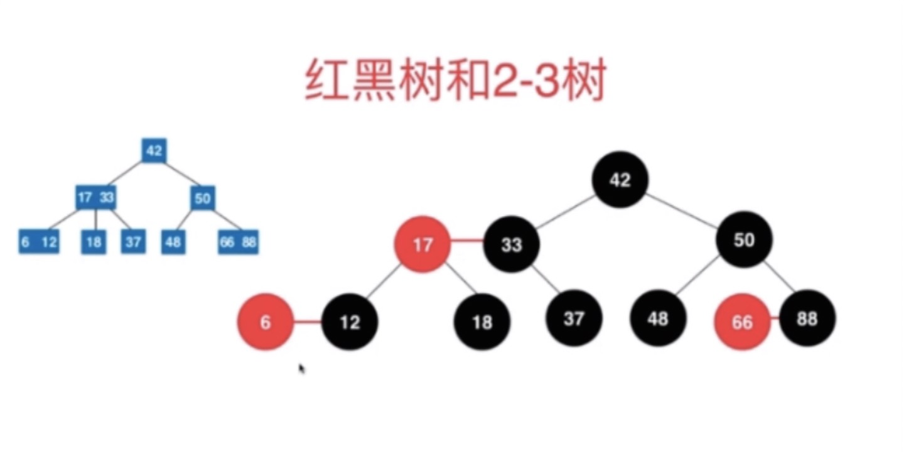

再转换一下，如下图所示，就是一颗标准的红黑树了。
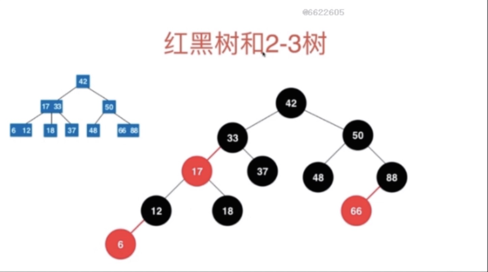


### 红黑树插入元素

新添加的元素永远都是红色的。

如果添加的是一个空树，那么直接把新加入的节点放在根节点，然后颜色转换为黑色，以满足红黑树的性质。

如果添加的不是一个空树，那么可能会存在以下几种情况：

1. 添加的元素在黑色节点的左侧，也就是对应2-3树的3-节点，此时，无需做任何调整，直接添加。
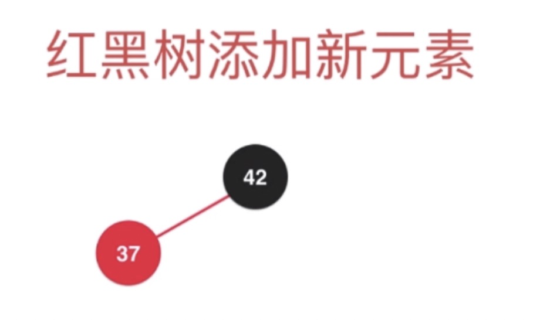

2. 添加的元素在黑色节点的右侧，此时虽然在2-3树种对应的也是一个3-节点，但是在红黑树中为了满足红黑树的性质（红色的节点总是向左倾斜），我们需要对这个节点进行旋转操作：

下图是旋转之前的样式：

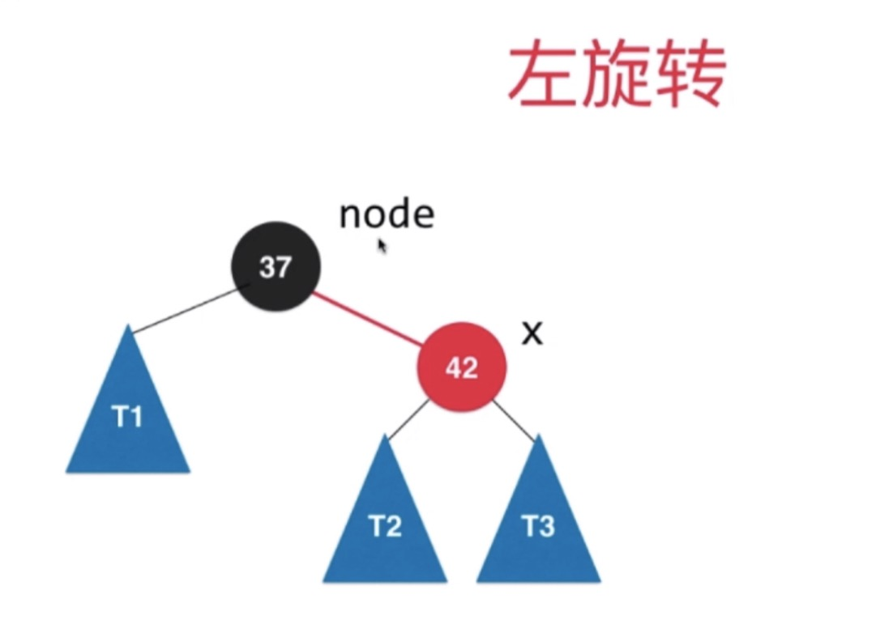

下图是旋转后的样式：
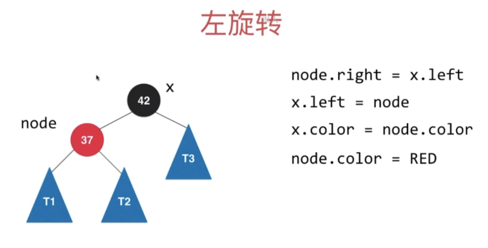

3. 新添加的元素在红色节点的右侧，如下图所示：

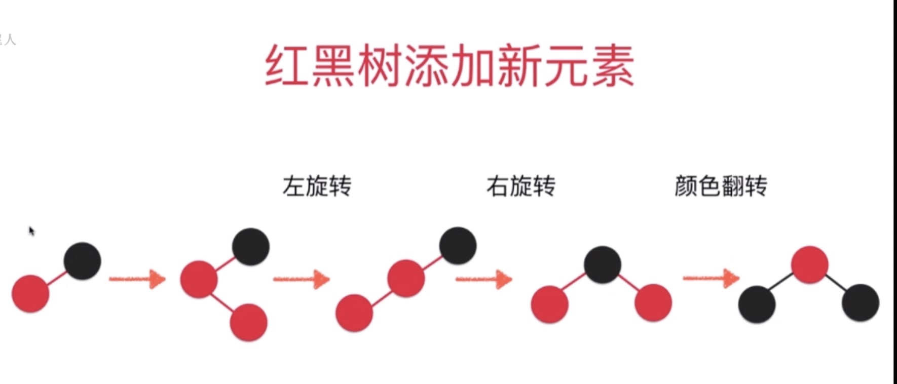

这种情况，其实也可以一些转换为之前的形式。

4. 更一般的，之前讨论的几种情况，都可以使用下面的这张图的逻辑统一起来：

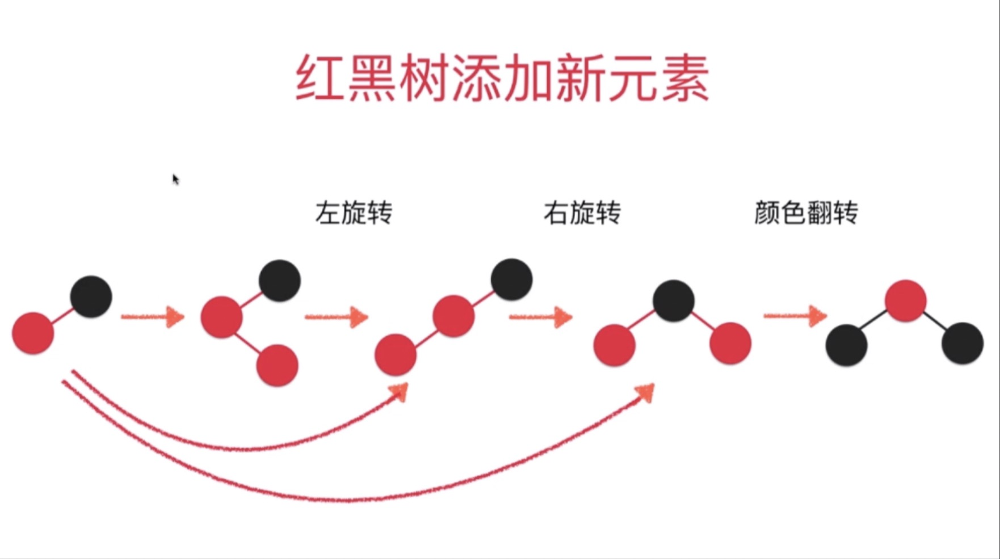

### 源码

来自《玩转数据结构 从入门到进阶》

```java
import java.util.ArrayList;

public class RBTree<K extends Comparable<K>, V> {

    private static final boolean RED = true;
    private static final boolean BLACK = false;

    private class Node{
        public K key;
        public V value;
        public Node left, right;
        public boolean color;

        public Node(K key, V value){
            this.key = key;
            this.value = value;
            left = null;
            right = null;
            color = RED;
        }
    }

    private Node root;
    private int size;

    public RBTree(){
        root = null;
        size = 0;
    }

    public int getSize(){
        return size;
    }

    public boolean isEmpty(){
        return size == 0;
    }

    // 判断节点node的颜色
    private boolean isRed(Node node){
        if(node == null)
            return BLACK;
        return node.color;
    }

    //   node                     x
    //  /   \     左旋转         /  \
    // T1   x   --------->   node   T3
    //     / \              /   \
    //    T2 T3            T1   T2
    private Node leftRotate(Node node){

        Node x = node.right;

        // 左旋转
        node.right = x.left;
        x.left = node;

        x.color = node.color;
        node.color = RED;

        return x;
    }

    //     node                   x
    //    /   \     右旋转       /  \
    //   x    T2   ------->   y   node
    //  / \                       /  \
    // y  T1                     T1  T2
    private Node rightRotate(Node node){

        Node x = node.left;

        // 右旋转
        node.left = x.right;
        x.right = node;

        x.color = node.color;
        node.color = RED;

        return x;
    }

    // 颜色翻转
    private void flipColors(Node node){

        node.color = RED;
        node.left.color = BLACK;
        node.right.color = BLACK;
    }

    // 向红黑树中添加新的元素(key, value)
    public void add(K key, V value){
        root = add(root, key, value);
        root.color = BLACK; // 最终根节点为黑色节点
    }

    // 向以node为根的红黑树中插入元素(key, value)，递归算法
    // 返回插入新节点后红黑树的根
    private Node add(Node node, K key, V value){

        if(node == null){
            size ++;
            return new Node(key, value); // 默认插入红色节点
        }

        if(key.compareTo(node.key) < 0)
            node.left = add(node.left, key, value);
        else if(key.compareTo(node.key) > 0)
            node.right = add(node.right, key, value);
        else // key.compareTo(node.key) == 0
            node.value = value;

        if (isRed(node.right) && !isRed(node.left))
            node = leftRotate(node);

        if (isRed(node.left) && isRed(node.left.left))
            node = rightRotate(node);

        if (isRed(node.left) && isRed(node.right))
            flipColors(node);

        return node;
    }

    // 返回以node为根节点的二分搜索树中，key所在的节点
    private Node getNode(Node node, K key){

        if(node == null)
            return null;

        if(key.equals(node.key))
            return node;
        else if(key.compareTo(node.key) < 0)
            return getNode(node.left, key);
        else // if(key.compareTo(node.key) > 0)
            return getNode(node.right, key);
    }

    public boolean contains(K key){
        return getNode(root, key) != null;
    }

    public V get(K key){

        Node node = getNode(root, key);
        return node == null ? null : node.value;
    }

    public void set(K key, V newValue){
        Node node = getNode(root, key);
        if(node == null)
            throw new IllegalArgumentException(key + " doesn't exist!");

        node.value = newValue;
    }

    // 返回以node为根的二分搜索树的最小值所在的节点
    private Node minimum(Node node){
        if(node.left == null)
            return node;
        return minimum(node.left);
    }

    // 删除掉以node为根的二分搜索树中的最小节点
    // 返回删除节点后新的二分搜索树的根
    private Node removeMin(Node node){

        if(node.left == null){
            Node rightNode = node.right;
            node.right = null;
            size --;
            return rightNode;
        }

        node.left = removeMin(node.left);
        return node;
    }

    // 从二分搜索树中删除键为key的节点
    public V remove(K key){

        Node node = getNode(root, key);
        if(node != null){
            root = remove(root, key);
            return node.value;
        }
        return null;
    }

    private Node remove(Node node, K key){

        if( node == null )
            return null;

        if( key.compareTo(node.key) < 0 ){
            node.left = remove(node.left , key);
            return node;
        }
        else if(key.compareTo(node.key) > 0 ){
            node.right = remove(node.right, key);
            return node;
        }
        else{   // key.compareTo(node.key) == 0

            // 待删除节点左子树为空的情况
            if(node.left == null){
                Node rightNode = node.right;
                node.right = null;
                size --;
                return rightNode;
            }

            // 待删除节点右子树为空的情况
            if(node.right == null){
                Node leftNode = node.left;
                node.left = null;
                size --;
                return leftNode;
            }

            // 待删除节点左右子树均不为空的情况

            // 找到比待删除节点大的最小节点, 即待删除节点右子树的最小节点
            // 用这个节点顶替待删除节点的位置
            Node successor = minimum(node.right);
            successor.right = removeMin(node.right);
            successor.left = node.left;

            node.left = node.right = null;

            return successor;
        }
    }

    public static void main(String[] args){

        System.out.println("Pride and Prejudice");

        ArrayList<String> words = new ArrayList<>();
        if(FileOperation.readFile("pride-and-prejudice.txt", words)) {
            System.out.println("Total words: " + words.size());

            RBTree<String, Integer> map = new RBTree<>();
            for (String word : words) {
                if (map.contains(word))
                    map.set(word, map.get(word) + 1);
                else
                    map.add(word, 1);
            }

            System.out.println("Total different words: " + map.getSize());
            System.out.println("Frequency of PRIDE: " + map.get("pride"));
            System.out.println("Frequency of PREJUDICE: " + map.get("prejudice"));
        }

        System.out.println();
    }
}
```

## DAG 路径

- https://www.cnblogs.com/Evsward/p/dag.html


 
  [1]: https://github.com/Audi-A7/learn/blob/master/source/image/interview/0-1%EF%BC%880%EF%BC%89.jpg?raw=true
  [2]: https://github.com/Audi-A7/learn/blob/master/source/image/interview/0-1%EF%BC%881%EF%BC%89.jpg?raw=true
  [3]: https://github.com/Audi-A7/learn/blob/master/source/image/interview/0-1%EF%BC%882%EF%BC%89.jpg?raw=true