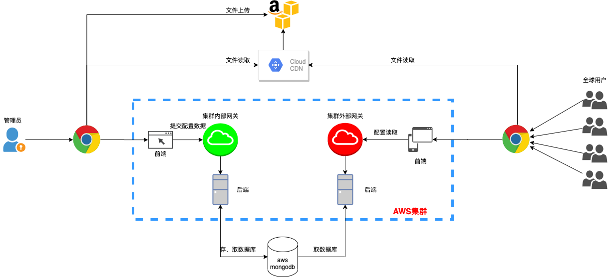
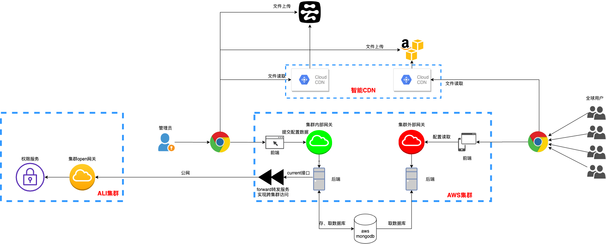
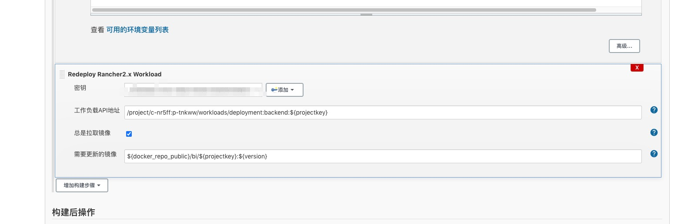

# 工作总结

标签（空格分隔）： 并发 一致性 多数据源

---

   * [工作总结](#工作总结)
      * [并发问题总结](#并发问题总结)
         * [场景介绍：](#场景介绍)
         * [具体是为什么呢？](#具体是为什么呢)
      * [多数据源注意事项](#多数据源注意事项)
         * [mybatis-plus版本：3.0.5](#mybatis-plus版本305)
         * [在一个事务中，多数据源是<strong>不能</strong>发挥效果的。切记！！！](#在一个事务中多数据源是不能发挥效果的切记)
      * [quartz定时任务实现准点只执行一次](#quartz定时任务实现准点只执行一次)
      * [使用mybatis-plus进行动态数据源切换遇到的坑](#使用mybatis-plus进行动态数据源切换遇到的坑)
         * [mybatis-plus版本：3.3.0](#mybatis-plus版本330)
         * [先说一下，解决方案：直接将@DS注解提升到service类上。将数据源B的相关mapper全部移动到新创建的一个类中，并且使用@DS("B")指定为B数据源。](#先说一下解决方案直接将ds注解提升到service类上将数据源b的相关mapper全部移动到新创建的一个类中并且使用dsb指定为b数据源)
         * [这到底是为什么呢？](#这到底是为什么呢)
      * [AOP与AspectJ](#aop与aspectj)
      * [Lombok 继承时应注意的点](#lombok-继承时应注意的点)
      * [反射获取对象的field](#反射获取对象的field)
      * [官网性能优化过程](#官网性能优化过程)
         * [第一版官网设计](#第一版官网设计)
         * [第二版官网设计](#第二版官网设计)
         * [第三版官网设计](#第三版官网设计)
      * [k8s api学习](#k8s-api学习)
         * [Redeploy Rancher2.x Workload](#redeploy-rancher2x-workload)
         * [Rancher2.x Api](#rancher2x-api)
         * [k8s Api](#k8s-api)
      * [maven中的scope](#maven中的scope)
         * [compile](#compile)
         * [test](#test)
         * [runntime](#runntime)
         * [provided](#provided)
         * [system](#system)
         * [scope的依赖传递](#scope的依赖传递)
         * [import](#import)

## 并发问题总结

### 场景介绍：
系统存在账单，账单又对应有子账单，分别将bill，subBill吧。
账单的子账单需要审核并且签字（签字需要走第三方机构签字），子账单可以分开审核签字，第三方机构（简称dsf）根据子账单id分别回调给我们签字结果。也就是说，一个子账单就有一个回调。账单的审核流程，记录在task任务表里。

某次，一个账单的两个子账单同时（同一毫秒内）回调回来了。导致，两个线程同时在做签字回调的工作，且两个线程之间没有进行临界资源的限制，导致两个线程虽然都更新了task表的签字状态，但是却没有使审核流程进入到下一个阶段。

根据分析，可能是并发的问题，导致两个线程同时执行，同时提交，最终两个子账单的签字状态都改成已签字，但是却没有流转到下一个阶段。

改进方案：使用数据库的悲观锁，for update。在事务中对处于该阶段的所有子账单进行锁定，直至该事务结束，下一个线程才可以操作这些数据。

实际发现这样改了以后，还是不能实现我们的效果。

### 具体是为什么呢？

因为加了锁以后，导致多个tomcat的处理线程需要进行等待。而回调的保持时间又只有2秒，可能导致超时，超时就会有部分子账单回调失败。

因此我们加入了线程池，但是发现加了以后依然没有达到效果，查看日志发现出现了死锁。


死锁的原因是因为锁定的key是主键id，我们的for update的语句是使用的in作为条件，也就是说一次性会锁定多行数据，但是如果这个id列表的顺序是乱序的话，就可能导致死锁。
比如需要锁定id=1，2，3，4的数据，线程A锁定了id=1，2的数据，线程B锁定了id=3，4的数据，这个时候就产生了死锁。
那对id列表排序，是不是就可以避免死锁了呢？实测结果，貌似并不可以。
最终，我们的解决方案加方法的入口加redis锁，外加手动创建一个线程池【线程池主要为了避免阻塞网络请求，因为业务上，该请求不关心处理结果，只要成功请求到接口就行】来处理签字回调请求。

部分代码如下：
```java
while (true) {
            if (null == stringRedisTemplate.opsForValue().get(contractId)) {
                log.info("transactionId = {}, 开始获取锁", transactionId);
                Boolean lockStatus = stringRedisTemplate.opsForValue().setIfAbsent(contractId, fddCallbackDTO.toString());
                if (Boolean.TRUE.equals(lockStatus)) {
                    log.info("transactionId = {}, 获得锁，开始处理业务逻辑", transactionId);
                    break;
                }
            }
            try {
                log.info("transactionId = {}, 没有获得锁，等待3秒后继续获取", transactionId);
                Thread.sleep(3000L);
            } catch (InterruptedException e) {
                log.error(e.getMessage(), e);
            }
        }
```

创建异步线程池代码如下：
```java
/**
 * https://blog.csdn.net/Muscleheng/article/details/81409672
 * 配置一个线程池处理法大大的回调  避免出现超时
 *
 * @author WangQuanzhou
 * @date 2019-06-19
 */
@Component
@EnableAsync
@Slf4j
public class ThreadPoolTaskConfig {

    // 核心线程数（默认线程数）
    private static final int corePoolSize = 10;
    // 最大线程数
    private static final int maxPoolSize = 100;
    // 允许线程空闲时间（单位：默认为秒）
    private static final int keepAliveTime = 60;
    // 缓冲队列数
    private static final int queueCapacity = 200;
    // 线程池名前缀
    private static final String threadNamePrefix = "Async-task-";

    // bean的名称，默认为首字母小写的方法名
    @Bean("taskExecutor")
    public ThreadPoolTaskExecutor taskExecutor() {
        ThreadPoolTaskExecutor executor = new ThreadPoolTaskExecutor();
        executor.setCorePoolSize(corePoolSize);
        executor.setMaxPoolSize(maxPoolSize);
        executor.setQueueCapacity(queueCapacity);
        executor.setKeepAliveSeconds(keepAliveTime);
        executor.setThreadNamePrefix(threadNamePrefix);

        // 线程池对拒绝任务的处理策略
        executor.setRejectedExecutionHandler(new ThreadPoolExecutor.CallerRunsPolicy());
        // 初始化
        executor.initialize();
        log.info("thread pool initialized sucess...");
        return executor;
    }
}
```

使用异步线程池方法（注解方式）：
```java
    // 发送提醒短信 1
    @Async("taskExecutor")
    public void sendMessage1() throws InterruptedException {
        log.info("发送短信方法---- 1   执行开始");
        Thread.sleep(5000); // 模拟耗时
        log.info("发送短信方法---- 1   执行结束");
    }

    // 发送提醒短信 2
    @Async("taskExecutor")
    public void sendMessage2() throws InterruptedException {

        log.info("发送短信方法---- 2   执行开始");
        Thread.sleep(2000); // 模拟耗时
        log.info("发送短信方法---- 2   执行结束");
    }
```

## 多数据源注意事项

### mybatis-plus版本：3.0.5

使用mybatis-plus的时候，支持多数据源，这在实际工作中会比较方便。但是也有一些注意事项。比如需要加入dynamic-DataSource的依赖：
```maven
            <dependency>
                <groupId>com.baomidou</groupId>
                <artifactId>dynamic-datasource-spring-boot-starter</artifactId>
                <version>2.5.3</version>
            </dependency>
```

启动类需要加exclude（因为使用的是druid的数据库连接池，所以加的是这个）：
```java
@Slf4j
@EnableFeignClients
@SpringBootApplication(exclude = DruidDataSourceAutoConfigure.class)
public class Application {
    public static void main(String[] args) {
        SpringApplication.run(Application.class, args);
        log.info("xxx started success...");
    }
}
```

### 在一个事务中，多数据源是**不能**发挥效果的。切记！！！


## quartz定时任务实现准点只执行一次

https://www.jianshu.com/p/52bf3f3aab6c

参考以上文档，实现自己的需求：即要求定时任务的执行时间可以随时更新，且到点只执行一次。

初始方案，想使用jdk自带的定时线程池来做，但是涉及到定时任务的随时更新的需求不好实现。且这种方式没有持久化，一旦服务重启，将会丢失任务。

使用xxl-job执行定时任务，无法实现更新定时任务执行时间的需求。

使用spring自带的schedule来做，也无法实现定时任务的实时更新，且也无法实现任务的持久化。

最终选用quratz来做，首先他可以实现任务的持久化，且可以实时的更新定时任务的执行时间，实现过程结合了上面的参考链接里的示例。

首先引入pom依赖：
```java
        <dependency>
            <groupId>org.quartz-scheduler</groupId>
            <artifactId>quartz</artifactId>
            <version>2.3.2</version>
        </dependency>
        <dependency>
            <groupId>org.quartz-scheduler</groupId>
            <artifactId>quartz-jobs</artifactId>
            <version>2.3.2</version>
        </dependency>
        <dependency>
            <groupId>org.springframework</groupId>
            <artifactId>spring-context-support</artifactId>
        </dependency>
```
quartz的配置：
```java
spring:
  quartz:
    scheduler-name: ark-flow-scheduler
    job-store-type: jdbc
    auto-startup: false
    wait-for-jobs-to-complete-on-shutdown: false
    overwrite-existing-jobs: false
    jdbc:
      #druid的wall filter会影响这里的自动建表
      initialize-schema: never
```
其次，封装一个定任务的实体类对象ScheduleJobInfo：
```java
package com.t4f.web.ark.flow.api.entity;

import com.baomidou.mybatisplus.annotation.IdType;
import com.baomidou.mybatisplus.annotation.TableId;
import io.swagger.annotations.ApiModel;
import io.swagger.annotations.ApiModelProperty;
import lombok.AllArgsConstructor;
import lombok.Builder;
import lombok.Data;
import lombok.NoArgsConstructor;
import org.quartz.JobDataMap;

import javax.validation.constraints.NotEmpty;
import java.io.Serializable;
import java.util.Date;

@Data
@NoArgsConstructor
@AllArgsConstructor
@Builder
@ApiModel(description = "定时任务实体类")
public class ScheduleJobInfo implements Serializable {
    private static final long serialVersionUID = -1465015133146616824L;

    @TableId(value = "id", type = IdType.AUTO)
    private Integer id;

    /**
     * 任务group的名称
     */
    @NotEmpty(message = "任务group的名称不能为空")
    @ApiModelProperty(value = "任务group的名称", example = "test-group")
    private String groupName;

    /**
     * 任务job的名称
     */
    @NotEmpty(message = "任务job的名称不能为空")
    @ApiModelProperty(value = "任务job的名称", required = true, example = "test-job")
    private String jobName;

    /**
     * 定时任务标识
     */
    @NotEmpty(message = "定时任务标识不能为空")
    @ApiModelProperty(value = "任务的标识", required = true, example = "schedule-job-code")
    private String code;

    /**
     * cron 表达式
     */
    @NotEmpty(message = "定时任务标识不能为空")
    @ApiModelProperty(value = "cron表达式", required = true, example = "*/5 * * * * ?")
    private String cron;

    /**
     * 定时任务执行类
     */
    @NotEmpty(message = "定时任务标识不能为空")
    @ApiModelProperty(value = "定时任务执行类", required = true, example = "com.nanc.modules.schedule.job.CronTestJob")
    private String className;

    /**
     * 成功执行次数
     */
    @ApiModelProperty(hidden = true)
    private Integer succeed;

    /**
     * 失败执行次数
     */
    @ApiModelProperty(hidden = true)
    private Integer fail;

    /**
     * 任务的状态
     * 0 - 代表正在执行
     * 1 - 已删除
     * 2 - 暂停
     */
    @ApiModelProperty(hidden = true)
    private Integer status;


    /**
     * 任务创建的时间
     */
    @ApiModelProperty(hidden = true)
    private Date createTime;

    /**
     * 任务修改的时间
     */
    @ApiModelProperty(hidden = true)
    private Date updateTime;


    /**
     * 定时任务的参数map
     */
    @ApiModelProperty(value = "定时任务执行类", required = false)
    private JobDataMap dataMap;
}
```

然后是quartz的配置类QuartzManager：
```java
package com.t4f.web.ark.flow.api.config;

import com.t4f.web.ark.flow.api.entity.ScheduleJobInfo;
import lombok.extern.slf4j.Slf4j;
import org.apache.commons.lang.RandomStringUtils;
import org.apache.commons.lang.StringUtils;
import org.quartz.*;
import org.springframework.beans.factory.annotation.Autowired;
import org.springframework.scheduling.quartz.SchedulerFactoryBean;
import org.springframework.stereotype.Component;

@Component
@Slf4j
public class QuartzManager {
    @Autowired
    private SchedulerFactoryBean schedulerFactoryBean;

    public static final String JOB_GROUP_NAME = "EXTJWEB_JOBGROUP_NAME";
    public static final String TRIGGER_GROUP_NAME = "EXTJWEB_TRIGGERGROUP_NAME";

    /**
     * 添加任务，使用任务组名（不存在就用默认的），触发器名，触发器组名
     * 并启动
     *
     * @param info
     */
    public Boolean addJob(ScheduleJobInfo info) {
        try {
            Scheduler scheduler = schedulerFactoryBean.getScheduler();

            JobKey jobKey = JobKey.jobKey(info.getJobName(), info.getGroupName());
            JobDetail jobDetail = scheduler.getJobDetail(jobKey);
            if (null != jobDetail) {
                log.info("{}， {} 定时任务已经存在", info.getJobName(), info.getGroupName());
                return Boolean.FALSE;
            }

            // JobDetail 是具体Job实例
            jobDetail = JobBuilder.newJob((Class<? extends Job>) Class.forName(info.getClassName()))
                    .withIdentity(info.getJobName(), info.getGroupName())
                    .usingJobData(info.getDataMap())
                    .build();

            // 基于表达式构建触发器
            CronScheduleBuilder cronScheduleBuilder = CronScheduleBuilder.cronSchedule(info.getCron());
            // CronTrigger表达式触发器 继承于Trigger
            // TriggerBuilder 用于构建触发器实例
            CronTrigger cronTrigger = TriggerBuilder.newTrigger().withIdentity(info.getJobName() + "_trigger", TRIGGER_GROUP_NAME)
                    .withSchedule(cronScheduleBuilder).build();

            scheduler.scheduleJob(jobDetail, cronTrigger);

            //启动
            if (!scheduler.isShutdown()) {
                scheduler.start();
            }
            return Boolean.TRUE;
        } catch (SchedulerException | ClassNotFoundException e) {
            log.error("添加任务失败", e);
            return Boolean.FALSE;
        }
    }

    /**
     * 暂停任务
     *
     * @param info
     */
    public void pauseJob(ScheduleJobInfo info) {
        try {
            Scheduler scheduler = schedulerFactoryBean.getScheduler();
            JobKey jobKey = JobKey.jobKey(info.getJobName(), info.getGroupName());
            scheduler.pauseJob(jobKey);
            log.info("=========================pause job: {} success========================", info.getJobName());
        } catch (Exception e) {
            log.error("", e);
        }
    }

    /**
     * 恢复任务
     *
     * @param info
     */
    public void resumeJob(ScheduleJobInfo info) {
        try {
            Scheduler scheduler = schedulerFactoryBean.getScheduler();
            JobKey jobKey = JobKey.jobKey(info.getJobName(), info.getGroupName());
            scheduler.resumeJob(jobKey);
            log.info("=========================resume job: {} success========================", info.getJobName());
        } catch (Exception e) {
            log.error("", e);
        }
    }

    /**
     * 删除任务，在业务逻辑中需要更新库表的信息
     *
     * @param info
     * @return
     */
    public boolean removeJob(ScheduleJobInfo info) {
        boolean result = true;
        try {

            Scheduler scheduler = schedulerFactoryBean.getScheduler();
            JobKey jobKey = JobKey.jobKey(info.getJobName(), info.getGroupName());
            JobDetail jobDetail = scheduler.getJobDetail(jobKey);
            if (null != jobDetail) {
                result = scheduler.deleteJob(jobKey);
            }
            log.info("=========================remove job: {} {}========================", info.getJobName(), result);
        } catch (Exception e) {
            log.error("", e);
            result = false;
        }
        return result;
    }

    /**
     * 修改定时任务的时间
     *
     * @param info
     * @return
     */
    public boolean modifyJobTime(ScheduleJobInfo info) {
        boolean result = true;
        try {
            Scheduler scheduler = schedulerFactoryBean.getScheduler();
            TriggerKey triggerKey = TriggerKey.triggerKey(info.getJobName() + "_trigger", TRIGGER_GROUP_NAME);
            CronTrigger trigger = (CronTrigger) scheduler.getTrigger(triggerKey);

            String oldTime = trigger.getCronExpression();
            if (!StringUtils.equalsIgnoreCase(oldTime, info.getCron())) {
                CronScheduleBuilder cronScheduleBuilder = CronScheduleBuilder.cronSchedule(info.getCron());
                CronTrigger ct = TriggerBuilder.newTrigger().withIdentity(info.getJobName() + RandomStringUtils.randomAlphabetic(6) + "_trigger", TRIGGER_GROUP_NAME)
                        .withSchedule(cronScheduleBuilder)
                        .build();

                scheduler.rescheduleJob(triggerKey, ct);
                scheduler.resumeTrigger(triggerKey);
            }

        } catch (Exception e) {
            log.error("", e);
            result = false;
        }
        return result;
    }

    /**
     * 启动所有定时任务
     */
    public void startJobs() {
        try {
            Scheduler scheduler = schedulerFactoryBean.getScheduler();
            scheduler.start();
        } catch (SchedulerException e) {
            log.error("", e);
        }
    }
}
```
然后自己封装了一个cron转换的类CronUtil，实现毫秒时间戳转换为cron表达式：
```java
package com.t4f.web.ark.flow.api.util;

import java.text.SimpleDateFormat;
import java.util.Date;

/**
 * 日期转Cron工具类
 *
 * @author WangQuanzhou
 * @date 2019-12-09
 */
public class CronUtil {

    /***
     * convert Date to cron ,eg.  "0 06 10 15 1 ? 2014"
     * @param date  : 时间点
     * @return
     */
    public static String getCron(Date date) {
        String dateFormat = "ss mm HH dd MM ? yyyy";
        return formatDateByPattern(date, dateFormat);
    }

    /***
     * convert Date to cron ,eg.  "0 06 10 15 1 ? 2014"
     * @param time  : 时间戳
     * @return
     */
    public static String getCron(Long time) {
        String dateFormat = "ss mm HH dd MM ? yyyy";
        return formatDateByPattern(new Date(time), dateFormat);
    }

    /***
     *
     * @param date
     * @param dateFormat : e.g:yyyy-MM-dd HH:mm:ss
     * @return
     */
    public static String formatDateByPattern(Date date, String dateFormat) {
        SimpleDateFormat sdf = new SimpleDateFormat(dateFormat);
        String formatTimeStr = null;
        if (date != null) {
            formatTimeStr = sdf.format(date);
        }
        return formatTimeStr;
    }

    public static void main(String[] args) {
        String cron = getCron(new Date());
        System.out.println(cron);
    }
}
```
然后自己封装了一个方法，实现在add定时任务之前删除原有的定时任务，quartz判断同一个job的标准是groupName+jobName，className表示的是需要定时执行的类，dataMap可以存放一些定时执行时携带的业务数据：
```java
    /**
     * 添加定时任务
     *
     * @param groupName
     * @param jobName
     * @param className
     * @param cron
     * @return
     */
    @Override
    public Boolean addTask(String groupName, String jobName, Class<? extends Job> className, String cron, JobDataMap dataMap) {
        log.info("start to add quartz job, groupName = {}, jobName = {}, className = {}, cron = {}",
                groupName, jobName, className.toString(), cron);
        log.info("delete old job...");
        ScheduleJobInfo scheduleJobInfo = new ScheduleJobInfo();
        scheduleJobInfo.setGroupName(groupName);
        scheduleJobInfo.setJobName(jobName);
        quartzManager.removeJob(scheduleJobInfo);

        log.info("add new job...");
        scheduleJobInfo.setCron(cron);
        scheduleJobInfo.setClassName(className.getName());
        scheduleJobInfo.setDataMap(dataMap);
        quartzManager.addJob(scheduleJobInfo);
        log.info("end add quartz job, groupName = {}, jobName = {}, className = {}, cron = {}",
                groupName, jobName, className.getName(), cron);
        return Boolean.TRUE;
    }
```
然后就是调用：
```java
taskService.addTask(TaskName.GROUP_NAME, TaskName.JOB_NAME_4_FLOW_START + Separator.UNDERLINE + server.getId(),StartFlowJobTime.class, CronUtil.getCron(flowStartTimeStamp), jobDataMap);
```
StartFlowJobTime类代码如下，注意其中删除定时任务的代码部分：
```java
package com.t4f.web.ark.flow.api.service.impl;

import lombok.extern.slf4j.Slf4j;
import org.quartz.*;
import org.springframework.stereotype.Component;
import org.springframework.transaction.annotation.Transactional;

/**
 * quartz job
 *
 * @author Cheng Luo
 * @date 2019-12-10 09:44
 */
@Slf4j
@Component
public class StartFlowJobTime implements Job {


    @Override
    @Transactional(rollbackFor = Throwable.class)
    public void execute(JobExecutionContext jobExecutionContext) throws JobExecutionException {

        JobKey jobKey = jobExecutionContext.getTrigger().getJobKey();
        try {
            //  定时时间到，开始执行导量的逻辑
            log.info("time is up, start to execute start flow quartz job, jobKey = {}", jobKey.toString());
            JobDataMap dataMap = jobExecutionContext.getJobDetail().getJobDataMap();
            // zi'ji
        } catch (Exception e) {
            log.error("execute start flow quartz job failed, jobKey = {}", jobKey.toString());
            log.error(e.getMessage(), e);
        } finally {
            log.info("execute start flow quartz job end, delete job, jobKey = {}", jobKey.toString());
            // 为保证定时任务只执行一次，在任务执行完成以后，需要删除此定时任务
            JobDetail jobDetail = jobExecutionContext.getJobDetail();
            if (null != jobDetail) {
                try {
                    jobExecutionContext.getScheduler().deleteJob(jobKey);
                } catch (SchedulerException e) {
                    e.printStackTrace();
                }
            }
        }
    }
}
```
 至此，即实现了定时任务只执行一次的需求。


## 使用mybatis-plus进行动态数据源切换遇到的坑

### mybatis-plus版本：3.3.0

前面我们说了，使用mybatis-plus的时候，多数据源将不能生效。这个很好理解，一个事务内，不允许进行数据库链接的切换时正常的。

现在假设有数据源A和B，A为主（默认）数据源，B为第二数据源。

但是，这次遇到了一个不一样的问题。在一个service实现类中，既有数据源A的mapper，也有数据源B的mapper。@DS注解全部放在mapper上的。

导致的问题现象就是，在这个service类中，所有涉及数据库的操作，都是操作的数据源A的表，即便在mapper加了@DS注解强制指定为数据源B也不生效。

### 先说一下，解决方案：直接将@DS注解提升到service类上。将数据源B的相关mapper全部移动到新创建的一个类中，并且使用@DS("B")指定为B数据源。

其实，这个问题在mybatis-plus的官方文档中，关于[多数据源](https://mp.baomidou.com/guide/dynamic-datasource.html)的部分也有提示。如下图所示：


### 这到底是为什么呢？

好在mybatis-plus是开源的，我们可以看一下@DS这个注解的实现原理和过程。

```java
package com.baomidou.dynamic.datasource.annotation;


import java.lang.annotation.*;

/**
 * 注解在类上或方法上来切换数据源
 *
 * @author TaoYu Kanyuxia
 * @since 1.0.0
 */
@Target({ElementType.TYPE, ElementType.METHOD})
@Retention(RetentionPolicy.RUNTIME)
@Documented
public @interface DS {

    /**
     * 组名或者具体数据源名称或者spel参数(#开头)
     *
     * @return 数据源名称
     */
    String value();
}
```

通过继续查找，发现了一个拦截器。

com.baomidou.dynamic.datasource.aop.DynamicDataSourceAnnotationInterceptor

源码也不长，我们直接全部粘贴过来。

```java
package com.baomidou.dynamic.datasource.aop;

import com.baomidou.dynamic.datasource.DynamicDataSourceClassResolver;
import com.baomidou.dynamic.datasource.annotation.DS;
import com.baomidou.dynamic.datasource.processor.DsProcessor;
import com.baomidou.dynamic.datasource.toolkit.DynamicDataSourceContextHolder;
import lombok.Setter;
import org.aopalliance.intercept.MethodInterceptor;
import org.aopalliance.intercept.MethodInvocation;
import org.springframework.core.annotation.AnnotationUtils;

import java.lang.reflect.Method;

/**
 * 动态数据源AOP核心拦截器
 *
 * @author TaoYu
 * @since 1.2.0
 */
public class DynamicDataSourceAnnotationInterceptor implements MethodInterceptor {

    /**
     * SPEL参数标识
     */
    private static final String DYNAMIC_PREFIX = "#";

    @Setter
    private DsProcessor dsProcessor;

    private DynamicDataSourceClassResolver dynamicDataSourceClassResolver = new DynamicDataSourceClassResolver();

    @Override
    public Object invoke(MethodInvocation invocation) throws Throwable {
        try {
            DynamicDataSourceContextHolder.push(determineDatasource(invocation));
            return invocation.proceed();
        } finally {
            DynamicDataSourceContextHolder.poll();
        }
    }

    private String determineDatasource(MethodInvocation invocation) throws Throwable {
        Method method = invocation.getMethod();
        Class<?> declaringClass = dynamicDataSourceClassResolver.targetClass(invocation);
        DS ds = method.isAnnotationPresent(DS.class) ? method.getAnnotation(DS.class)
                : AnnotationUtils.findAnnotation(declaringClass, DS.class);
        String key = ds.value();
        return (!key.isEmpty() && key.startsWith(DYNAMIC_PREFIX)) ? dsProcessor.determineDatasource(invocation, key) : key;
    }
}
```

由于我并没有使用【SPEL参数标识】这种方式来使用@DS，所以在determineDatasource方法内会直接返回key，也就是数据源的名称。

然后这个key会被push到**DynamicDataSourceContextHolder**，这个Holder又是个啥呢？我们再看一下它的源码？

```java
package com.baomidou.dynamic.datasource.toolkit;

import org.springframework.util.StringUtils;

import java.util.ArrayDeque;
import java.util.Deque;

/**
 * 核心基于ThreadLocal的切换数据源工具类
 *
 * @author TaoYu Kanyuxia
 * @since 1.0.0
 */
public final class DynamicDataSourceContextHolder {

    /**
     * 为什么要用链表存储(准确的是栈)
     * <pre>
     * 为了支持嵌套切换，如ABC三个service都是不同的数据源
     * 其中A的某个业务要调B的方法，B的方法需要调用C的方法。一级一级调用切换，形成了链。
     * 传统的只设置当前线程的方式不能满足此业务需求，必须模拟栈，后进先出。
     * </pre>
     */
    @SuppressWarnings("unchecked")
    private static final ThreadLocal<Deque<String>> LOOKUP_KEY_HOLDER = new ThreadLocal() {
        @Override
        protected Object initialValue() {
            return new ArrayDeque();
        }
    };

    private DynamicDataSourceContextHolder() {
    }

    /**
     * 获得当前线程数据源
     *
     * @return 数据源名称
     */
    public static String peek() {
        return LOOKUP_KEY_HOLDER.get().peek();
    }

    /**
     * 设置当前线程数据源
     * <p>
     * 如非必要不要手动调用，调用后确保最终清除
     * </p>
     *
     * @param ds 数据源名称
     */
    public static void push(String ds) {
        LOOKUP_KEY_HOLDER.get().push(StringUtils.isEmpty(ds) ? "" : ds);
    }

    /**
     * 清空当前线程数据源
     * <p>
     * 如果当前线程是连续切换数据源
     * 只会移除掉当前线程的数据源名称
     * </p>
     */
    public static void poll() {
        Deque<String> deque = LOOKUP_KEY_HOLDER.get();
        deque.poll();
        if (deque.isEmpty()) {
            LOOKUP_KEY_HOLDER.remove();
        }
    }

    /**
     * 强制清空本地线程
     * <p>
     * 防止内存泄漏，如手动调用了push可调用此方法确保清除
     * </p>
     */
    public static void clear() {
        LOOKUP_KEY_HOLDER.remove();
    }
}
```

不要看他的代码这么多，本质上其实就是一个ThreadLocal，来存储数据源key。再具体一点，其实是个队列（栈）。

理论上来说，是可以实现多数据源的切换的，但是为什么我在service中调用虽然在dao层使用@DS制定了数据源，还是加载失败了呢？因为使用了@Transactional注解。

这里倒不是说，在事务内切换了数据源，而是一个事务内使用的是一个数据源。由于@Transactional注解默认会加载主数据源，因此即便在底层使用了@DS也不能切换。因为此时数据库链接已经初始化好了。

如果确实需要在@Transactional注解包裹的方法内使用第二数据源，有两个方案：

 - 在service层使用@DS注解「前提是使用的是mybatis-plus」
 - 自己实现事务管理器，在@Transactional中使用transactionManager指定事务管理器实现数据源切换
 

## AOP与AspectJ

 1. https://segmentfault.com/a/1190000022019122


总到来说，AOP（Aspect Orient Programming）是一种思想，是面向对象编程思想的增强。将系统进行横向到切分，在方法到执行前、后、中执行特定到操作从而实现对业务逻辑到更精确到控制。

AOP实现的关键就在于AOP框架自动创建的AOP代理，AOP代理则可分为静态代理和动态代理两大类，其中静态代理是指使用AOP框架提供的命令进行编译，从而在编译阶段就可生成 AOP 代理类，因此也称为编译时增强；而动态代理则在运行时借助于JDK动态代理、CGLIB等在内存中“临时”生成AOP动态代理类，因此也被称为运行时增强。

AspectJ是一个易用且功能强大的AOP框架，可以实现更为完善的aop功能。一般，Spring的AOP功能使用JDK、CGlib动态代理实现。性能上，相比于AspectJ的静态织入会差一些。但是，相应的AspectJ也会更为复杂一些。

## Lombok 继承时应注意的点

https://blog.csdn.net/weixin_33953249/article/details/93375061?utm_medium=distribute.pc_relevant.none-task-blog-BlogCommendFromMachineLearnPai2-3.nonecase&depth_1-utm_source=distribute.pc_relevant.none-task-blog-BlogCommendFromMachineLearnPai2-3.nonecase

在使用@Data注解时，需要注意其默认实现的toString方法是没有包含父类的字段信息的。如果需要需要子类的toString方法包含父类的字段，可以再子类上加上：
```json
@ToString(callSuper = true)
```


## 反射获取对象的field

https://blog.csdn.net/qq_32452623/article/details/54025185

需要注意如下所示：

```java
getFields()    获取所有public字段,包括父类字段

getDeclaredFields()   获取所有字段,public和protected和private,但是不包括父类字段
```

如果一个子类想要获取父类的priavte的field，上面两个方法都不能很好满足需求，这个时候可以使用`org.reflections`工具类。里面有很多方法，其中`getAllFields`就可以满足需求。

简单看一下其源码：
```java
    /** get all fields of given {@code type}, up the super class hierarchy, optionally filtered by {@code predicates} */
    public static Set<Field> getAllFields(final Class<?> type, Predicate<? super Field>... predicates) {
        Set<Field> result = Sets.newHashSet();
        for (Class<?> t : getAllSuperTypes(type)) result.addAll(getFields(t, predicates));
        return result;
    }
```

内部分别调用了`getAllSuperTypes`和`getFields`方法，源码如下：
```java
    /** would include {@code Object.class} when {@link #getAllSuperTypes(Class, com.google.common.base.Predicate[])}. default is false. */
    public static boolean includeObject = false;

    /** get all super types of given {@code type}, including, optionally filtered by {@code predicates}
     * <p> include {@code Object.class} if {@link #includeObject} is true */
    public static Set<Class<?>> getAllSuperTypes(final Class<?> type, Predicate<? super Class<?>>... predicates) {
        Set<Class<?>> result = Sets.newLinkedHashSet();
        if (type != null && (includeObject || !type.equals(Object.class))) {
            result.add(type);
            result.addAll(getAllSuperTypes(type.getSuperclass()));
            for (Class<?> ifc : type.getInterfaces()) result.addAll(getAllSuperTypes(ifc));
        }
        return filter(result, predicates);
    }
```

```java
    /** get fields of given {@code type}, optionally filtered by {@code predicates} */
    public static Set<Field> getFields(Class<?> type, Predicate<? super Field>... predicates) {
        return filter(type.getDeclaredFields(), predicates);
    }
```

然后，`getFields`方法内部调用的`getDeclaredFields`方法其实就是`java.lang.Class`里的方法。

所以，总结起来，流程就是：先调用`getAllSuperTypes`获取当前类及其父类的Class对象，然后再调用JDK自己的`getDeclaredFields`获取所有的类属性，最后使用一个Set进行一个去重返回。


## 官网性能优化过程

官网所有服务（包括前后端服务、文件存储、数据库、redis等）均部署在aws云服务器，使用该系统的用户分布在国内外各地。

虽然国内访问aws服务，由于地理限制，即便是做了加速，响应速度上还是存在一定的延时。这里简要记录下，整个官网系统优化的过程。

### 第一版官网设计

第一版官网设计图如下所示：



第一版本的官网，图片等资源使用aws的cdn缓存，网站document数据开启gzip配置，访问页面基本需要2-3秒，图片等资源加载则更慢。

document数据等数据慢是因为前台系统的前后端交互使用的是外部网关的url，该url对应的ip在国内，应该使用集群内的虚拟ip访问（该问题在第三版官网优化时得到了改进）

图片等静态资源慢，是因为即便是配置了CDN，由于CDN节点有多个，且aws的CDN节点离国内最近的也在东京，因此速度会受到一定的限制。


### 第二版官网设计

第二版官网设计图如下所示：


第二版官网新加了current用户权限接口，由于权限系统只部署在ali集群，所以需要使用forward转发服务，aws服务才能访问到ali集群的open网关，从而实现用户权限数据的获取。

这一版本主要是增强网站的安全性及权限可维护性。

### 第三版官网设计

第三版官网设计图如下所示：


第三版本的官网主要优化了性能，请求基本都在毫秒级响应。

 1. 第一个优化点在于图片等静态资源的优化，图片在上传的时候就oss和s3各放一份，cdn也配置成根据用户位置自主决定使用aws还是ali的cdn。
 2. 第二个优化点在于前台系统的前后端交互使用集群内部虚拟ip代替网关的url，从而极大的加快了响应速度。
 

## k8s api学习

由于之前公司使用docker swarm进行服务部署，考虑与世面主流docker服务治理框架接轨，准备切换到k8s。由于之前swarm集群的管理是我们自己通过接入portainer的api实现的，为了统一，我们希望k8s也通过这种方式接入，而不是去rancher等工具上操作。

### Redeploy Rancher2.x Workload

https://www.cnblogs.com/xiao987334176/p/13162700.html


它整个的流程图如上所示。实际配置时，service的名称以及镜像版本等信息都可以通过变量的形式从`自定义运维平台`发送到jenkins，如下图所示：


这种方法确实可以实现k8s集群的更新，但是他不能实现服务的创建、查询、删除等操作（或者说要实现这几个功能代价比较大）。因此放弃。

### Rancher2.x Api


首先不得不说rancher的api之乱（也可能是个人水平有限），包括[官方文档](https://rancher.com/docs/rancher/v2.x/en/api/)关于api的使用介绍，简直无力吐槽。

对于查询接口还好，对于更新等操作，也不清除哪些字段是必传，哪些是非必传，完全靠猜。。。无奈也只有放弃。

### k8s Api

https://blog.csdn.net/wucong60/article/details/81699196

能走的路只剩下一条，好在k8s的[官方api文档](https://github.com/kubernetes-client/java/tree/master/kubernetes/docs)做的还算清晰，并且提供了[官方sdk](https://mvnrepository.com/artifact/io.kubernetes/client-java)，虽然各个版本的差异也挺大的。。。但总归是官方的，我选的版本信息如下。

```maven
        <dependency>
            <groupId>io.kubernetes</groupId>
            <artifactId>client-java</artifactId>
            <version>10.0.0</version>
        </dependency>
```


由于这次是直接操作k8s的api，因此对于其内部的一些与服务直接相关的概念也必须要清晰，包括pod、deployment、service等。

## maven中的scope

工作中，一般使用maven管理依赖较多。比如一个常用的lombok的依赖：
```java
            <dependency>
                <groupId>org.projectlombok</groupId>
                <artifactId>lombok</artifactId>
                <version>1.18.2</version>
                <scope>provided</scope>
            </dependency>
```

https://blog.csdn.net/kimylrong/article/details/50353161

https://www.baeldung.com/maven-dependency-scopes

这里的scope是`provided`，他表示依赖的项目在打包的时候不会被include进去，相关的class可以由其他dependency引入。只参与项目的编译、运行、测试等阶段。

分别详细说下其他scope：

### compile
默认就是compile，什么都不配置也就是意味着compile。compile表示被依赖项目需要参与当前项目的编译，当然后续的测试，运行周期也参与其中，是一个比较强的依赖。打包的时候通常需要包含进去。

### test
scope为test表示依赖项目仅仅参与测试相关的工作，包括测试代码的编译，执行。比较典型的如junit。

### runntime
runntime表示被依赖项目无需参与项目的编译，不过后期的测试和运行周期需要其参与。与compile相比，跳过编译而已，说实话在终端的项目（非开源，企业内部系统）中，和compile区别不是很大。比较常见的如JSR×××的实现，对应的API jar是compile的，具体实现是runtime的，compile只需要知道接口就足够了。oracle jdbc驱动jar包就是一个很好的例子，一般scope为runntime。另外runntime的依赖通常和optional搭配使用，optional为true。我可以用A实现，也可以用B实现。

### provided
provided意味着打包的时候可以不用包进去，别的设施(Web Container)会提供。事实上该依赖理论上可以参与编译，测试，运行等周期。相当于compile，但是在打包阶段做了exclude的动作。

### system
从参与度来说，也provided相同，不过被依赖项不会从maven仓库抓，而是从本地文件系统拿，一定需要配合systemPath属性使用。

### scope的依赖传递
A–>B–>C。当前项目为A，A依赖于B，B依赖于C。知道B在A项目中的scope，那么怎么知道C在A中的scope呢？答案是：
当C是test或者provided时，C直接被丢弃，A不依赖C；
否则A依赖C，C的scope继承于B的scope。

### import

https://blog.csdn.net/wangjun5159/article/details/104298131

`import`有点特殊，放到最后来说。以下面的依赖举例：
```java
<dependencyManagement>
	<dependencies>
		<dependency>
			<!-- Import dependency management from Spring Boot -->
			<groupId>org.springframework.boot</groupId>
			<artifactId>spring-boot-dependencies</artifactId>
			<version>2.1.12.RELEASE</version>
			<type>pom</type>
			<scope>import</scope>
		</dependency>
	</dependencies>
</dependencyManagement>
```

首先，`import`只能用在`dependencyManagement`内部，且`type`必须是`pom`。上面这个依赖表示的意思：
`将spring-boot-dependencies 中dependencyManagement的dependencies，全部引入到当前工程的dependencyManagement中，不会进行依赖传递`。
如果没有`import`：
`将spring-boot-dependencies 的dependencies全部插入到当前工程的dependencies中，并且会依赖传递。`

