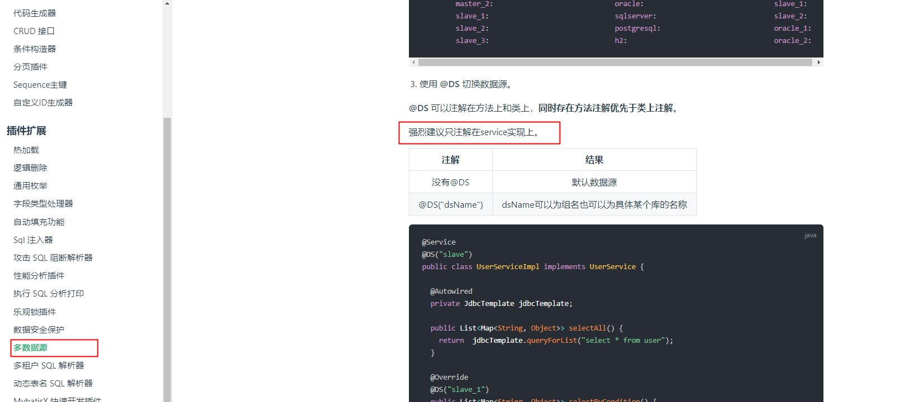

# 工作总结

标签（空格分隔）： 并发 一致性 多数据源

---

并发问题总结
======

## 场景介绍：
系统存在账单，账单又对应有子账单，分别将bill，subBill吧。
账单的子账单需要审核并且签字（签字需要走第三方机构签字），子账单可以分开审核签字，第三方机构（简称dsf）根据子账单id分别回调给我们签字结果。也就是说，一个子账单就有一个回调。账单的审核流程，记录在task任务表里。

某次，一个账单的两个子账单同时（同一毫秒内）回调回来了。导致，两个线程同时在做签字回调的工作，且两个线程之间没有进行临界资源的限制，导致两个线程虽然都更新了task表的签字状态，但是却没有使审核流程进入到下一个阶段。

根据分析，可能是并发的问题，导致两个线程同时执行，同时提交，最终两个子账单的签字状态都改成已签字，但是却没有流转到下一个阶段。

改进方案：使用数据库的悲观锁，for update。在事务中对处于该阶段的所有子账单进行锁定，直至该事务结束，下一个线程才可以操作这些数据。

实际发现这样改了以后，还是不能实现我们的效果。

## 具体是为什么呢？

因为加了锁以后，导致多个tomcat的处理线程需要进行等待。而回调的保持时间又只有2秒，可能导致超时，超时就会有部分子账单回调失败。

因此我们加入了线程池，但是发现加了以后依然没有达到效果，查看日志发现出现了死锁。


死锁的原因是因为锁定的key是主键id，我们的for update的语句是使用的in作为条件，也就是说一次性会锁定多行数据，但是如果这个id列表的顺序是乱序的话，就可能导致死锁。
比如需要锁定id=1，2，3，4的数据，线程A锁定了id=1，2的数据，线程B锁定了id=3，4的数据，这个时候就产生了死锁。
那对id列表排序，是不是就可以避免死锁了呢？实测结果，貌似并不可以。
最终，我们的解决方案加方法的入口加redis锁，外加手动创建一个线程池【线程池主要为了避免阻塞网络请求，因为业务上，该请求不关心处理结果，只要成功请求到接口就行】来处理签字回调请求。

部分代码如下：
```java
while (true) {
            if (null == stringRedisTemplate.opsForValue().get(contractId)) {
                log.info("transactionId = {}, 开始获取锁", transactionId);
                Boolean lockStatus = stringRedisTemplate.opsForValue().setIfAbsent(contractId, fddCallbackDTO.toString());
                if (Boolean.TRUE.equals(lockStatus)) {
                    log.info("transactionId = {}, 获得锁，开始处理业务逻辑", transactionId);
                    break;
                }
            }
            try {
                log.info("transactionId = {}, 没有获得锁，等待3秒后继续获取", transactionId);
                Thread.sleep(3000L);
            } catch (InterruptedException e) {
                log.error(e.getMessage(), e);
            }
        }
```

创建异步线程池代码如下：
```java
/**
 * https://blog.csdn.net/Muscleheng/article/details/81409672
 * 配置一个线程池处理法大大的回调  避免出现超时
 *
 * @author WangQuanzhou
 * @date 2019-06-19
 */
@Component
@EnableAsync
@Slf4j
public class ThreadPoolTaskConfig {

    // 核心线程数（默认线程数）
    private static final int corePoolSize = 10;
    // 最大线程数
    private static final int maxPoolSize = 100;
    // 允许线程空闲时间（单位：默认为秒）
    private static final int keepAliveTime = 60;
    // 缓冲队列数
    private static final int queueCapacity = 200;
    // 线程池名前缀
    private static final String threadNamePrefix = "Async-task-";

    // bean的名称，默认为首字母小写的方法名
    @Bean("taskExecutor")
    public ThreadPoolTaskExecutor taskExecutor() {
        ThreadPoolTaskExecutor executor = new ThreadPoolTaskExecutor();
        executor.setCorePoolSize(corePoolSize);
        executor.setMaxPoolSize(maxPoolSize);
        executor.setQueueCapacity(queueCapacity);
        executor.setKeepAliveSeconds(keepAliveTime);
        executor.setThreadNamePrefix(threadNamePrefix);

        // 线程池对拒绝任务的处理策略
        executor.setRejectedExecutionHandler(new ThreadPoolExecutor.CallerRunsPolicy());
        // 初始化
        executor.initialize();
        log.info("thread pool initialized sucess...");
        return executor;
    }
}
```

使用异步线程池方法（注解方式）：
```java
    // 发送提醒短信 1
    @Async("taskExecutor")
    public void sendMessage1() throws InterruptedException {
        log.info("发送短信方法---- 1   执行开始");
        Thread.sleep(5000); // 模拟耗时
        log.info("发送短信方法---- 1   执行结束");
    }

    // 发送提醒短信 2
    @Async("taskExecutor")
    public void sendMessage2() throws InterruptedException {

        log.info("发送短信方法---- 2   执行开始");
        Thread.sleep(2000); // 模拟耗时
        log.info("发送短信方法---- 2   执行结束");
    }
```

多数据源注意事项
========

### mybatis-plus版本：3.0.5

使用mybatis-plus的时候，支持多数据源，这在实际工作中会比较方便。但是也有一些注意事项。比如需要加入dynamic-DataSource的依赖：
```maven
            <dependency>
                <groupId>com.baomidou</groupId>
                <artifactId>dynamic-datasource-spring-boot-starter</artifactId>
                <version>2.5.3</version>
            </dependency>
```

启动类需要加exclude（因为使用的是druid的数据库连接池，所以加的是这个）：
```java
@Slf4j
@EnableFeignClients
@SpringBootApplication(exclude = DruidDataSourceAutoConfigure.class)
public class Application {
    public static void main(String[] args) {
        SpringApplication.run(Application.class, args);
        log.info("xxx started success...");
    }
}
```

### 在一个事务中，多数据源是**不能**发挥效果的。切记！！！


quartz定时任务实现准点只执行一次
===================

https://www.jianshu.com/p/52bf3f3aab6c

参考以上文档，实现自己的需求：即要求定时任务的执行时间可以随时更新，且到点只执行一次。

初始方案，想使用jdk自带的定时线程池来做，但是涉及到定时任务的随时更新的需求不好实现。且这种方式没有持久化，一旦服务重启，将会丢失任务。

使用xxl-job执行定时任务，无法实现更新定时任务执行时间的需求。

使用spring自带的schedule来做，也无法实现定时任务的实时更新，且也无法实现任务的持久化。

最终选用quratz来做，首先他可以实现任务的持久化，且可以实时的更新定时任务的执行时间，实现过程结合了上面的参考链接里的示例。

首先引入pom依赖：
```java
        <dependency>
            <groupId>org.quartz-scheduler</groupId>
            <artifactId>quartz</artifactId>
            <version>2.3.2</version>
        </dependency>
        <dependency>
            <groupId>org.quartz-scheduler</groupId>
            <artifactId>quartz-jobs</artifactId>
            <version>2.3.2</version>
        </dependency>
        <dependency>
            <groupId>org.springframework</groupId>
            <artifactId>spring-context-support</artifactId>
        </dependency>
```
quartz的配置：
```java
spring:
  quartz:
    scheduler-name: ark-flow-scheduler
    job-store-type: jdbc
    auto-startup: false
    wait-for-jobs-to-complete-on-shutdown: false
    overwrite-existing-jobs: false
    jdbc:
      #druid的wall filter会影响这里的自动建表
      initialize-schema: never
```
其次，封装一个定任务的实体类对象ScheduleJobInfo：
```java
package com.t4f.web.ark.flow.api.entity;

import com.baomidou.mybatisplus.annotation.IdType;
import com.baomidou.mybatisplus.annotation.TableId;
import io.swagger.annotations.ApiModel;
import io.swagger.annotations.ApiModelProperty;
import lombok.AllArgsConstructor;
import lombok.Builder;
import lombok.Data;
import lombok.NoArgsConstructor;
import org.quartz.JobDataMap;

import javax.validation.constraints.NotEmpty;
import java.io.Serializable;
import java.util.Date;

@Data
@NoArgsConstructor
@AllArgsConstructor
@Builder
@ApiModel(description = "定时任务实体类")
public class ScheduleJobInfo implements Serializable {
    private static final long serialVersionUID = -1465015133146616824L;

    @TableId(value = "id", type = IdType.AUTO)
    private Integer id;

    /**
     * 任务group的名称
     */
    @NotEmpty(message = "任务group的名称不能为空")
    @ApiModelProperty(value = "任务group的名称", example = "test-group")
    private String groupName;

    /**
     * 任务job的名称
     */
    @NotEmpty(message = "任务job的名称不能为空")
    @ApiModelProperty(value = "任务job的名称", required = true, example = "test-job")
    private String jobName;

    /**
     * 定时任务标识
     */
    @NotEmpty(message = "定时任务标识不能为空")
    @ApiModelProperty(value = "任务的标识", required = true, example = "schedule-job-code")
    private String code;

    /**
     * cron 表达式
     */
    @NotEmpty(message = "定时任务标识不能为空")
    @ApiModelProperty(value = "cron表达式", required = true, example = "*/5 * * * * ?")
    private String cron;

    /**
     * 定时任务执行类
     */
    @NotEmpty(message = "定时任务标识不能为空")
    @ApiModelProperty(value = "定时任务执行类", required = true, example = "com.nanc.modules.schedule.job.CronTestJob")
    private String className;

    /**
     * 成功执行次数
     */
    @ApiModelProperty(hidden = true)
    private Integer succeed;

    /**
     * 失败执行次数
     */
    @ApiModelProperty(hidden = true)
    private Integer fail;

    /**
     * 任务的状态
     * 0 - 代表正在执行
     * 1 - 已删除
     * 2 - 暂停
     */
    @ApiModelProperty(hidden = true)
    private Integer status;


    /**
     * 任务创建的时间
     */
    @ApiModelProperty(hidden = true)
    private Date createTime;

    /**
     * 任务修改的时间
     */
    @ApiModelProperty(hidden = true)
    private Date updateTime;


    /**
     * 定时任务的参数map
     */
    @ApiModelProperty(value = "定时任务执行类", required = false)
    private JobDataMap dataMap;
}
```

然后是quartz的配置类QuartzManager：
```java
package com.t4f.web.ark.flow.api.config;

import com.t4f.web.ark.flow.api.entity.ScheduleJobInfo;
import lombok.extern.slf4j.Slf4j;
import org.apache.commons.lang.RandomStringUtils;
import org.apache.commons.lang.StringUtils;
import org.quartz.*;
import org.springframework.beans.factory.annotation.Autowired;
import org.springframework.scheduling.quartz.SchedulerFactoryBean;
import org.springframework.stereotype.Component;

@Component
@Slf4j
public class QuartzManager {
    @Autowired
    private SchedulerFactoryBean schedulerFactoryBean;

    public static final String JOB_GROUP_NAME = "EXTJWEB_JOBGROUP_NAME";
    public static final String TRIGGER_GROUP_NAME = "EXTJWEB_TRIGGERGROUP_NAME";

    /**
     * 添加任务，使用任务组名（不存在就用默认的），触发器名，触发器组名
     * 并启动
     *
     * @param info
     */
    public Boolean addJob(ScheduleJobInfo info) {
        try {
            Scheduler scheduler = schedulerFactoryBean.getScheduler();

            JobKey jobKey = JobKey.jobKey(info.getJobName(), info.getGroupName());
            JobDetail jobDetail = scheduler.getJobDetail(jobKey);
            if (null != jobDetail) {
                log.info("{}， {} 定时任务已经存在", info.getJobName(), info.getGroupName());
                return Boolean.FALSE;
            }

            // JobDetail 是具体Job实例
            jobDetail = JobBuilder.newJob((Class<? extends Job>) Class.forName(info.getClassName()))
                    .withIdentity(info.getJobName(), info.getGroupName())
                    .usingJobData(info.getDataMap())
                    .build();

            // 基于表达式构建触发器
            CronScheduleBuilder cronScheduleBuilder = CronScheduleBuilder.cronSchedule(info.getCron());
            // CronTrigger表达式触发器 继承于Trigger
            // TriggerBuilder 用于构建触发器实例
            CronTrigger cronTrigger = TriggerBuilder.newTrigger().withIdentity(info.getJobName() + "_trigger", TRIGGER_GROUP_NAME)
                    .withSchedule(cronScheduleBuilder).build();

            scheduler.scheduleJob(jobDetail, cronTrigger);

            //启动
            if (!scheduler.isShutdown()) {
                scheduler.start();
            }
            return Boolean.TRUE;
        } catch (SchedulerException | ClassNotFoundException e) {
            log.error("添加任务失败", e);
            return Boolean.FALSE;
        }
    }

    /**
     * 暂停任务
     *
     * @param info
     */
    public void pauseJob(ScheduleJobInfo info) {
        try {
            Scheduler scheduler = schedulerFactoryBean.getScheduler();
            JobKey jobKey = JobKey.jobKey(info.getJobName(), info.getGroupName());
            scheduler.pauseJob(jobKey);
            log.info("=========================pause job: {} success========================", info.getJobName());
        } catch (Exception e) {
            log.error("", e);
        }
    }

    /**
     * 恢复任务
     *
     * @param info
     */
    public void resumeJob(ScheduleJobInfo info) {
        try {
            Scheduler scheduler = schedulerFactoryBean.getScheduler();
            JobKey jobKey = JobKey.jobKey(info.getJobName(), info.getGroupName());
            scheduler.resumeJob(jobKey);
            log.info("=========================resume job: {} success========================", info.getJobName());
        } catch (Exception e) {
            log.error("", e);
        }
    }

    /**
     * 删除任务，在业务逻辑中需要更新库表的信息
     *
     * @param info
     * @return
     */
    public boolean removeJob(ScheduleJobInfo info) {
        boolean result = true;
        try {

            Scheduler scheduler = schedulerFactoryBean.getScheduler();
            JobKey jobKey = JobKey.jobKey(info.getJobName(), info.getGroupName());
            JobDetail jobDetail = scheduler.getJobDetail(jobKey);
            if (null != jobDetail) {
                result = scheduler.deleteJob(jobKey);
            }
            log.info("=========================remove job: {} {}========================", info.getJobName(), result);
        } catch (Exception e) {
            log.error("", e);
            result = false;
        }
        return result;
    }

    /**
     * 修改定时任务的时间
     *
     * @param info
     * @return
     */
    public boolean modifyJobTime(ScheduleJobInfo info) {
        boolean result = true;
        try {
            Scheduler scheduler = schedulerFactoryBean.getScheduler();
            TriggerKey triggerKey = TriggerKey.triggerKey(info.getJobName() + "_trigger", TRIGGER_GROUP_NAME);
            CronTrigger trigger = (CronTrigger) scheduler.getTrigger(triggerKey);

            String oldTime = trigger.getCronExpression();
            if (!StringUtils.equalsIgnoreCase(oldTime, info.getCron())) {
                CronScheduleBuilder cronScheduleBuilder = CronScheduleBuilder.cronSchedule(info.getCron());
                CronTrigger ct = TriggerBuilder.newTrigger().withIdentity(info.getJobName() + RandomStringUtils.randomAlphabetic(6) + "_trigger", TRIGGER_GROUP_NAME)
                        .withSchedule(cronScheduleBuilder)
                        .build();

                scheduler.rescheduleJob(triggerKey, ct);
                scheduler.resumeTrigger(triggerKey);
            }

        } catch (Exception e) {
            log.error("", e);
            result = false;
        }
        return result;
    }

    /**
     * 启动所有定时任务
     */
    public void startJobs() {
        try {
            Scheduler scheduler = schedulerFactoryBean.getScheduler();
            scheduler.start();
        } catch (SchedulerException e) {
            log.error("", e);
        }
    }
}
```
然后自己封装了一个cron转换的类CronUtil，实现毫秒时间戳转换为cron表达式：
```java
package com.t4f.web.ark.flow.api.util;

import java.text.SimpleDateFormat;
import java.util.Date;

/**
 * 日期转Cron工具类
 *
 * @author WangQuanzhou
 * @date 2019-12-09
 */
public class CronUtil {

    /***
     * convert Date to cron ,eg.  "0 06 10 15 1 ? 2014"
     * @param date  : 时间点
     * @return
     */
    public static String getCron(Date date) {
        String dateFormat = "ss mm HH dd MM ? yyyy";
        return formatDateByPattern(date, dateFormat);
    }

    /***
     * convert Date to cron ,eg.  "0 06 10 15 1 ? 2014"
     * @param time  : 时间戳
     * @return
     */
    public static String getCron(Long time) {
        String dateFormat = "ss mm HH dd MM ? yyyy";
        return formatDateByPattern(new Date(time), dateFormat);
    }

    /***
     *
     * @param date
     * @param dateFormat : e.g:yyyy-MM-dd HH:mm:ss
     * @return
     */
    public static String formatDateByPattern(Date date, String dateFormat) {
        SimpleDateFormat sdf = new SimpleDateFormat(dateFormat);
        String formatTimeStr = null;
        if (date != null) {
            formatTimeStr = sdf.format(date);
        }
        return formatTimeStr;
    }

    public static void main(String[] args) {
        String cron = getCron(new Date());
        System.out.println(cron);
    }
}
```
然后自己封装了一个方法，实现在add定时任务之前删除原有的定时任务，quartz判断同一个job的标准是groupName+jobName，className表示的是需要定时执行的类，dataMap可以存放一些定时执行时携带的业务数据：
```java
    /**
     * 添加定时任务
     *
     * @param groupName
     * @param jobName
     * @param className
     * @param cron
     * @return
     */
    @Override
    public Boolean addTask(String groupName, String jobName, Class<? extends Job> className, String cron, JobDataMap dataMap) {
        log.info("start to add quartz job, groupName = {}, jobName = {}, className = {}, cron = {}",
                groupName, jobName, className.toString(), cron);
        log.info("delete old job...");
        ScheduleJobInfo scheduleJobInfo = new ScheduleJobInfo();
        scheduleJobInfo.setGroupName(groupName);
        scheduleJobInfo.setJobName(jobName);
        quartzManager.removeJob(scheduleJobInfo);

        log.info("add new job...");
        scheduleJobInfo.setCron(cron);
        scheduleJobInfo.setClassName(className.getName());
        scheduleJobInfo.setDataMap(dataMap);
        quartzManager.addJob(scheduleJobInfo);
        log.info("end add quartz job, groupName = {}, jobName = {}, className = {}, cron = {}",
                groupName, jobName, className.getName(), cron);
        return Boolean.TRUE;
    }
```
然后就是调用：
```java
taskService.addTask(TaskName.GROUP_NAME, TaskName.JOB_NAME_4_FLOW_START + Separator.UNDERLINE + server.getId(),StartFlowJobTime.class, CronUtil.getCron(flowStartTimeStamp), jobDataMap);
```
StartFlowJobTime类代码如下，注意其中删除定时任务的代码部分：
```java
package com.t4f.web.ark.flow.api.service.impl;

import lombok.extern.slf4j.Slf4j;
import org.quartz.*;
import org.springframework.stereotype.Component;
import org.springframework.transaction.annotation.Transactional;

/**
 * quartz job
 *
 * @author Cheng Luo
 * @date 2019-12-10 09:44
 */
@Slf4j
@Component
public class StartFlowJobTime implements Job {


    @Override
    @Transactional(rollbackFor = Throwable.class)
    public void execute(JobExecutionContext jobExecutionContext) throws JobExecutionException {

        JobKey jobKey = jobExecutionContext.getTrigger().getJobKey();
        try {
            //  定时时间到，开始执行导量的逻辑
            log.info("time is up, start to execute start flow quartz job, jobKey = {}", jobKey.toString());
            JobDataMap dataMap = jobExecutionContext.getJobDetail().getJobDataMap();
            // zi'ji
        } catch (Exception e) {
            log.error("execute start flow quartz job failed, jobKey = {}", jobKey.toString());
            log.error(e.getMessage(), e);
        } finally {
            log.info("execute start flow quartz job end, delete job, jobKey = {}", jobKey.toString());
            // 为保证定时任务只执行一次，在任务执行完成以后，需要删除此定时任务
            JobDetail jobDetail = jobExecutionContext.getJobDetail();
            if (null != jobDetail) {
                try {
                    jobExecutionContext.getScheduler().deleteJob(jobKey);
                } catch (SchedulerException e) {
                    e.printStackTrace();
                }
            }
        }
    }
}
```
 至此，即实现了定时任务只执行一次的需求。


使用mybatis-plus进行动态数据源切换遇到的坑
===========================

### mybatis-plus版本：3.3.0

前面我们说了，使用mybatis-plus的时候，多数据源将不能生效。这个很好理解，一个事务内，不允许进行数据库链接的切换时正常的。

现在假设有数据源A和B，A为主（默认）数据源，B为第二数据源。

但是，这次遇到了一个不一样的问题。在一个service实现类中，既有数据源A的mapper，也有数据源B的mapper。@DS注解全部放在mapper上的。

导致的问题现象就是，在这个service类中，所有涉及数据库的操作，都是操作的数据源A的表，即便在mapper加了@DS注解强制指定为数据源B也不生效。

### 先说一下，解决方案：直接将@DS注解提升到service类上。将数据源B的相关mapper全部移动到新创建的一个类中，并且使用@DS("B")指定为B数据源。

其实，这个问题在mybatis-plus的官方文档中，关于[多数据源](https://mp.baomidou.com/guide/dynamic-datasource.html)的部分也有提示。如下图所示：

