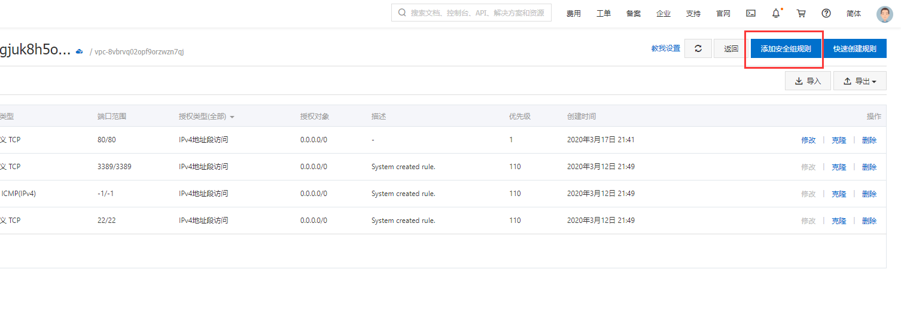

# 阿里云集群搭建

标签（空格分隔）： 集群  搭建

---

安装docker
--------
https://blog.csdn.net/janus_java/article/details/80094967

按照参考链接里的做，基本可以无障碍安装完成。这里拷贝一下并稍加修改：

 1. Docker 要求 CentOS 系统的内核版本高于 3.10 ，查看本页面的前提条件来验证你的CentOS 版本是否支持 Docker
    。 通过 uname -r 命令查看你当前的内核版本
```linux
[root@JDu4e00u53f7 etc]# uname -r
Linux 8Z 3.10.0-862.14.4.el7.x86_64 #1 SMP Wed Sep 26 15:12:11 UTC 2018 x86_64 x86_64 x86_64 GNU/Linux
```
 2. 使用 root 权限登录 Centos 。确保 yum 包更新到最新。（这一步也可以不执行，只要不影响后续的安装，因为这个update可能update很多不需要的包）
```linux
[root@JDu4e00u53f7 etc]# sudo yum update
```
 3. 卸载旧版本(如果安装过旧版本的话)  如果没安装过docker这一步也可以省略
```linux
[root@JDu4e00u53f7 etc]# sudo yum remove docker  docker-common docker-selinux docker-engine

Loaded plugins: fastestmirror
No Match for argument: docker
No Match for argument: docker-common
No Match for argument: docker-selinux
No Match for argument: docker-engine

No Packages marked for removal
```
 1. 安装需要的软件包， yum-util 提供yum-config-manager功能，另外两个是devicemapper驱动依赖的
```linux
[root@JDu4e00u53f7 etc]# sudo yum install -y yum-utils device-mapper-persistent-data lvm2
```
 2. 设置yum源
```linux
#sudo yum-config-manager --add-repo https://download.docker.com/linux/centos/docker-ce.repo
```
3. 可以查看所有仓库中所有docker版本，并选择特定版本安装

```linux
# yum list docker-ce --showduplicates | sort -r
Loading mirror speeds from cached hostfile
Loaded plugins: fastestmirror
docker-ce.x86_64            18.03.0.ce-1.el7.centos             docker-ce-stable
docker-ce.x86_64            17.12.1.ce-1.el7.centos             docker-ce-stable
docker-ce.x86_64            17.12.0.ce-1.el7.centos             docker-ce-stable
docker-ce.x86_64            17.09.1.ce-1.el7.centos             docker-ce-stable
docker-ce.x86_64            17.09.0.ce-1.el7.centos             docker-ce-stable
docker-ce.x86_64            17.06.2.ce-1.el7.centos             docker-ce-stable
docker-ce.x86_64            17.06.1.ce-1.el7.centos             docker-ce-stable
docker-ce.x86_64            17.06.0.ce-1.el7.centos             docker-ce-stable
docker-ce.x86_64            17.03.2.ce-1.el7.centos             docker-ce-stable
docker-ce.x86_64            17.03.1.ce-1.el7.centos             docker-ce-stable
docker-ce.x86_64            17.03.0.ce-1.el7.centos             docker-ce-stable
Available Packages
```
 1. 安装docker
```linux
# sudo yum install docker-ce  #由于repo中默认只开启stable仓库，故这里安装的是最新稳定版17.12.0
# sudo yum install <FQPN>  # 例如：sudo yum install docker-ce-18.03.0.ce
```
 2. 启动并加入开机启动

```linux
# sudo systemctl start docker
# sudo systemctl enable docker
```
 1. 验证安装是否成功(有client和service两部分表示docker安装启动都成功了)
```linux
# docker version
Client:
 Version:	18.03.0-ce
 API version:	1.37
 Go version:	go1.9.4
 Git commit:	0520e24
 Built:	Wed Mar 21 23:09:15 2018
 OS/Arch:	linux/amd64
 Experimental:	false
 Orchestrator:	swarm
Server:
 Engine:
  Version:	18.03.0-ce
  API version:	1.37 (minimum version 1.12)
  Go version:	go1.9.4
  Git commit:	0520e24
  Built:	Wed Mar 21 23:13:03 2018
  OS/Arch:	linux/amd64
  Experimental:	false
```

远程连接问题
------
如果出现如下警告：
```java
@@@@@@@@@@@@@@@@@@@@@@@@@@@@@@@@@@@@@@@@@@@@@@@@@@@@@@@@@@@
@    WARNING: REMOTE HOST IDENTIFICATION HAS CHANGED!     @
@@@@@@@@@@@@@@@@@@@@@@@@@@@@@@@@@@@@@@@@@@@@@@@@@@@@@@@@@@@
IT IS POSSIBLE THAT SOMEONE IS DOING SOMETHING NASTY!
Someone could be eavesdropping on you right now (man-in-the-middle attack)!
It is also possible that a host key has just been changed.
The fingerprint for the RSA key sent by the remote host is
07:36:8e:d0:72:88:38:f7:21:10:c3:12:d6:35:ad:55.
Please contact your system administrator.
Add correct host key in /Users/watsy/.ssh/known_hosts to get rid of this message.
Offending RSA key in /Users/watsy/.ssh/known_hosts:1
RSA host key for 192.168.2.108 has changed and you have requested strict checking.
Host key verification failed.
```
一般是因为远程主机的RSA key更换了，此时主要讲本机的known_hosts中对应主机的key删除即可：
```linux
ssh-keygen -f "/home/choldrim/.ssh/known_hosts" -R 192.168.2.108
```

安装harbor私有仓库
------------

 1. https://www.cnblogs.com/anxminise/p/9764221.html
 2. https://goharbor.io/docs/1.10/install-config/installation-prereqs/
 3. https://blog.csdn.net/yanghx9013/article/details/79496527
 4. https://www.jianshu.com/p/dbc0fb6e9149

安装前需要注意harbor所需要的docker的最低配置要求。
| Software        | Version   |  Description  |
| --------   | -----  | :----  |
| Docker engine     | Version 17.06.0-ce+ or higher |   For installation instructions, see Docker Engine documentation     |
| Docker Compose        |   Version 1.18.0 or higher   |   For installation instructions, see Docker Compose documentation  |
| Openssl        |    Latest is preferred   |  Used to generate certificate and keys for Harbor  |

集众家之所长，下面开始我的安装过程。

本机OS：centos7.5

 1. 首先需要安装docker-compose，安装的过程中可能会出现，各种问题。可以通过参考链接3、4实现。
 2. 下载harbor，链接1里给的地址不行，我自己去harbor官网找的地址，然后解压：
```linux
wget https://storage.googleapis.com/harbor-releases/release-1.5.0/harbor-offline-installer-v1.5.1.tgz

tar -zxvf harbor-offline-installer-v1.5.1.tgz
```

 1. 安装harbor
```linux
cd harbor
vim vim harbor.cfg #编辑配置文件

hostname = 192.168.1.112 #修改harbor的启动ip，这里需要依据系统ip设置
harbor_admin_password = 12345 #修改harbor的admin用户的密码
```
 1. 启动harbor
```linux
./prepare #配置Harbor
./install.sh #安装Harbor

## 查看启动的docker线程
[root@iZf7xzmp8Z harbor]# docker ps
CONTAINER ID        IMAGE                                  COMMAND                  CREATED              STATUS                        PORTS                                                              NAMES
125921d0c4a7        vmware/nginx-photon:v1.5.1             "nginx -g 'daemon of…"   About a minute ago   Up About a minute (healthy)   0.0.0.0:80->80/tcp, 0.0.0.0:443->443/tcp, 0.0.0.0:4443->4443/tcp   nginx
9f0362ed5f64        vmware/harbor-jobservice:v1.5.1        "/harbor/start.sh"       About a minute ago   Up About a minute                                                                                harbor-jobservice
c92cfd4ffafa        vmware/harbor-ui:v1.5.1                "/harbor/start.sh"       About a minute ago   Up About a minute (healthy)                                                                      harbor-ui
3a0bc4744857        vmware/harbor-db:v1.5.1                "/usr/local/bin/dock…"   About a minute ago   Up About a minute (healthy)   3306/tcp                                                           harbor-db
9ffa2c7a56f4        vmware/registry-photon:v2.6.2-v1.5.1   "/entrypoint.sh serv…"   About a minute ago   Up About a minute (healthy)   5000/tcp                                                           registry
7297736c2bfb        vmware/redis-photon:v1.5.1             "docker-entrypoint.s…"   About a minute ago   Up About a minute             6379/tcp                                                           redis
3f119208a77f        vmware/harbor-adminserver:v1.5.1       "/harbor/start.sh"       About a minute ago   Up About a minute (healthy)                                                                      harbor-adminserver
4e5d71a2c108        vmware/harbor-log:v1.5.1               "/bin/sh -c /usr/loc…"   About a minute ago   Up About a minute (healthy)   127.0.0.1:1514->10514/tcp                                          harbor-log
```

 1. 访问Harbor，如果是外网访问阿里云的服务器，需要开通80端口，大概步骤如下两张图所示：



然后输入用户名admin  密码12345（这是我自己改过的）就可以登录harbor了。


刚刚是直接通过ip，然后开放服务器的80端口给外网访问，如果觉得不安全，可以配置harbor以域名的方式访问。同样需要修改 vim harbor.cfg文件，将hostname改为hub.audi.com。记得重新执行./install.sh

然后本机，以win10为例，修改C:\Windows\System32\drivers\etc\hosts文件。既可使用域名方式访问harbor。

本地过程改造
------